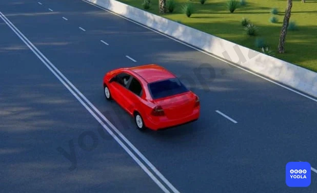
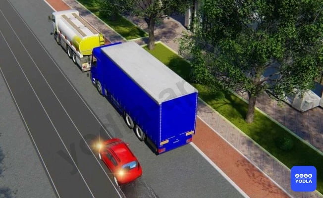
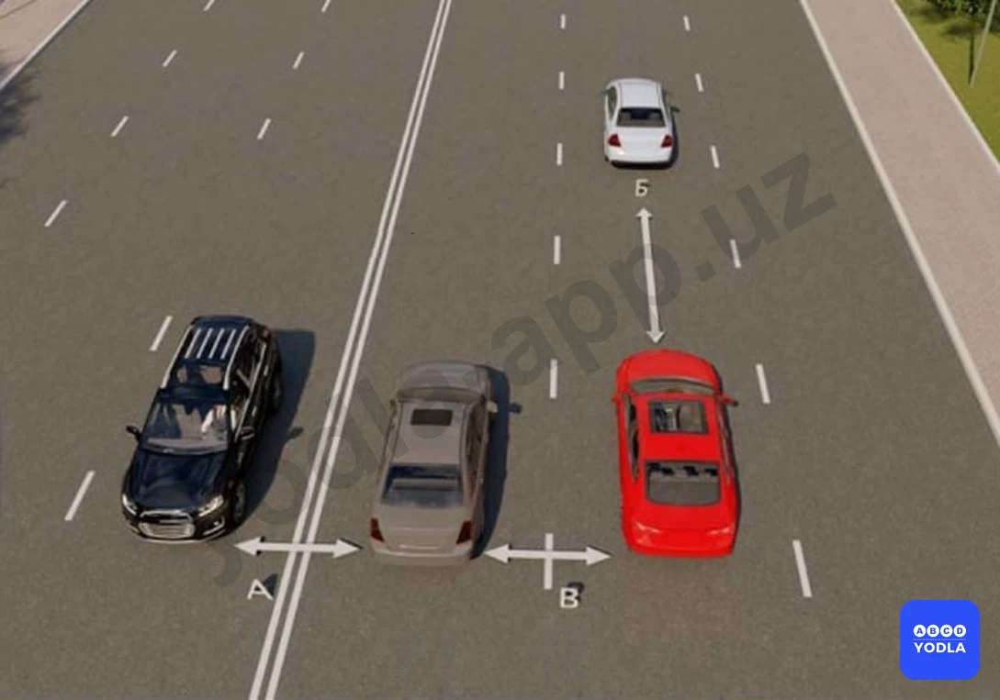
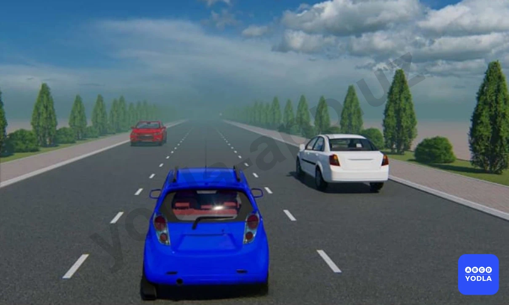

# Bilet 29

Всего вопросов: 20

## Вопрос 1

**Как определяется количество полос для движения безрельсовых транспортных средств?**

⬜ A. Дорожной разметкой
⬜ B. Дорожными знаками «Направления движения по полосам» или «Направление движения по полосе»
⬜ C. Самим водителем с учетом ширины проезжей части, габаритов транспортных средств и необходимых интервалов между ними
✅ D. Всеми перечисленными способами

> 💡 Количество полос движения определяется дорожной разметкой или дорожными знаками. При их отсутствии водители самостоятельно определяют количество полос, учитывая ширину проезжей части и необходимый боковой интервал для безопасного движения транспортных средств.

Следовательно, правильный ответ — количество полос определяется всеми перечисленными способами.

---

## Вопрос 2

**На дороге с двухсторонним движением имеющих три полосы вы должны повернуть на право. С какой полосы произведете этот маневр?**

✅ A. С правой полосы
⬜ B. Со средней полосы
⬜ C. С правой или средней полосы
⬜ D. Со средней, только в том случае когда правая сторона занята

> 💡 На трёхполосной дороге с двусторонним движением поворот направо выполняется только из крайней правой полосы.

Следовательно, правильный ответ — поворот направо выполняется из крайней правой полосы.

---

## Вопрос 3

**Разрешается ли выезжать на крайнюю левую полосу предназначенную для встречного движения на дорогах с двухсторонним движением имеющих три полосы?**

⬜ A. Разрешается для обгона
⬜ B. Разрешается во всех случаях
✅ C. Запрещается

> 💡 На трёхполосной дороге с двусторонним движением выезд на крайнюю левую полосу, предназначенную для встречного движения, запрещён.

Следовательно, правильный ответ — запрещается.

---

## Вопрос 4

**В каком направлении разрешается движение синему автомобилю?**

⬜ A. Только в обратном направлении
⬜ B. Прямо, налево и в обратном направлении
✅ C. Налево и в обратном направлении
⬜ D. Во всех направлениях

> 💡 На трёхполосной дороге с двусторонним движением движение по средней полосе разрешается только для поворота налево и разворота. Движение прямо по средней полосе запрещено.

Следовательно, правильный ответ — разрешены поворот налево и разворот.

---

## Вопрос 5

**Где не должно оказаться транспортное средство при выезде с пересечения проезжих частей во время поворота?**

⬜ A. На левой полосе, если свободна правая полоса
✅ B. На стороне встречного движения
⬜ C. На левой полосе, если имеются не менее трех полос для движения в одном направлении
⬜ D. На левой полосе, если имеется две полосы для движения в одном направлении только грузовым автомобилям с разрешенной максимальной массой более 3.5 т

> 💡 При выполнении поворота, выезжая с пересечения проезжих частей, транспортное средство не должно оказаться на полосе встречного движения.

В противном случае это создаст помехи другим участникам дорожного движения и может привести к возникновению аварийной ситуации.

Следовательно, правильный ответ — транспортное средство не должно выезжать на полосу встречного движения.

---

## Вопрос 6

**Разрешается ли водителю синего автомобиля выполнять обгон?**

⬜ A. Разрешается
✅ B. Запрещается
⬜ C. Разрешается, если красный автомобиль движется со скоростью менее 40 км/час

> 💡 В данной ситуации на трёхполосной дороге с двусторонним движением красный автомобиль объезжает неисправное транспортное средство или участок, где проводятся дорожные работы.

Синий автомобиль намерен обогнать красный автомобиль с выездом на полосу встречного движения. Такой выезд запрещён.

Следовательно, правильный ответ — водителю синего автомобиля обгон выполнять запрещено.

---

## Вопрос 7

**По какой полосе разрешается движение безрельсовых транспортных средств в населенных пунктах, если имеются три полосы и более в одном направлении? Грузовые автомобили не учитывать**

⬜ A. По любой полосе
⬜ B. По возможности ближе к правому краю проезжей части
✅ C. По любой полосе кроме крайней левой, на которою разрешается выезжать только при интенсивном движении на других полосах а также для поворота налево,разворота и остановки на дороге с односторонним движением

> 💡 В населённых пунктах легковые автомобили могут двигаться по любой полосе, кроме крайней левой, даже если другие полосы свободны.

На дорогах с тремя и более полосами крайняя левая полоса используется только для поворота налево, разворота, движения при интенсивном потоке транспорта, а на дорогах с односторонним движением — также для остановки.

Следовательно, правильный ответ — **разрешается движение по любой полосе, кроме крайней левой.**

---

## Вопрос 8

**Нарушает ли водитель правила при движении вне населенного пункта?**

✅ A. Да
⬜ B. Нет

> 💡 Водитель нарушает Правила дорожного движения за пределами населённого пункта.

Согласно пункту 67 Правил дорожного движения, за пределами населённых пунктов запрещается занимать левую полосу, если правая полоса свободна.

В данной ситуации правая полоса свободна, однако водитель продолжает движение по левой полосе, тем самым нарушая требования Правил.

Следовательно, правильный ответ — водитель нарушает правила, необоснованно занимая левую полосу.

---

## Вопрос 9

**В каких случаях разрешается выезжать за пределы правой полосы, если Вы управляете транспортным средством, скорость которого по техническим причинам не может быть более 40 км/ч?**

⬜ A. Только при перестроении перед поворотом налево либо разворотом
⬜ B. Только при обгоне или объезде
✅ C. Во всех перечисленных случаях
⬜ D. Во всех перечисленных случаях, а также при наличии трех и более полос для движения в одном направлении

> 💡 Транспортному средству, которое не может двигаться со скоростью более 40 км/ч, разрешается выезжать на левую полосу только в отдельных случаях.

К таким случаям относятся поворот налево, разворот, объезд препятствия, а также обгон в случаях, предусмотренных Правилами дорожного движения.

Следовательно, правильный ответ — во всех перечисленных случаях.

---

## Вопрос 10

**Разрешается ли водителю красного автомобиля двигаться по трамвайным путям?**

✅ A. Разрешается
⬜ B. Запрещается

> 💡 Водителю красного автомобиля разрешается двигаться по трамвайным путям.

Согласно пункту 69 Правил дорожного движения, если трамвайные пути расположены на одном уровне с проезжей частью, водитель может выехать на них, если его полоса занята, например, неисправным транспортным средством, либо при интенсивном движении, когда другого пути нет. При этом он не должен создавать помех движению трамвая.

Следовательно, правильный ответ — водителю красного автомобиля разрешается движение по трамвайным путям при условии, что он не создаёт помех трамваю.

---

## Вопрос 11

**Допускается ли движение транспортных средств по тротуарам и пешеходным дорожкам?**

⬜ A. Допускается, если это не затрудняет движение пешеходов
⬜ B. Не допускается, так как это может поставить под угрозу безопасность пешеходов
✅ C. Допускается при обслуживании торговых и других предприятий расположенных непосредственно у этих тротуаров или дорожек
⬜ D. Допускается для объезда стоящего у тротуара другого транспортного средства

> 💡 Движение транспортных средств по тротуару и пешеходной дорожке, как правило, запрещено.

Однако согласно пункту 72 Правил дорожного движения движение разрешается, если необходимо обслужить торговое или другое предприятие, расположенное непосредственно у тротуара или пешеходной дорожки, при отсутствии другого подъезда.

Следовательно, правильный ответ — движение разрешается для обслуживания объектов, расположенных непосредственно у тротуара или пешеходной дорожки, если отсутствует другой подъезд.

---

## Вопрос 12

**Где на проезжей части вне населенных пунктов водители должны вести транспортные средства?**

✅ A. По возможности ближе к правому краю проезжей части
⬜ B. По любой полосе
⬜ C. Только по правой полосе. Выезд на левую полосу разрешается для поворота налево или разворота

> 💡 Вне населённых пунктов водители должны двигаться как можно ближе к правому краю проезжей части.

Это требование установлено пунктом 67 Правил дорожного движения.

Следовательно, правильный ответ — двигаться как можно ближе к правому краю проезжей части.

---

## Вопрос 13

**Укажите расстояние, под которым в Правилах понимается «боковой интервал»:**

⬜ A. Только «А»
⬜ B. Только «Б»
⬜ C. Только «В»
✅ D. «А» и «В»

> 💡 Боковой интервал обозначен расстояниями А и Б.

Следовательно, правильный ответ — расстояния А и Б.

---

## Вопрос 14

**По какой полосе разрешается движение после этого знака?**

⬜ A. По любой полосе
✅ B. По правой полосе
⬜ C. Только по левой полосе

> 💡 Данный дорожный знак обозначает конец населённого пункта. После него движение осуществляется за пределами населённого пункта.

Согласно Правилам дорожного движения, за пределами населённого пункта при свободной правой полосе запрещается занимать левую полосу. Поэтому водитель должен двигаться по правой полосе.

Следовательно, правильный ответ — разрешается движение по правой полосе.

---

## Вопрос 15

**Можете ли Вы продолжить движение по средней полосе после обгона?**

⬜ A. Да
✅ B. Нет

> 💡 На трёхполосной дороге с двусторонним движением средняя полоса может использоваться для поворота налево, разворота или обгона.

После завершения обгона продолжать движение по средней полосе запрещается. Водитель должен перестроиться на правую полосу своего направления.

Следовательно, правильный ответ — нет, после завершения обгона продолжать движение по средней полосе нельзя.

---

## Вопрос 16

**Зависит ли выбор бокового интервала от скорости движения?**

⬜ A. Выбор бокового интервала от скорости движения не зависит
✅ B. При увеличении скорости движения боковой интервал необходимо увеличить

> 💡 При выборе бокового интервала необходимо учитывать скорость движения транспортного средства. С увеличением скорости боковой интервал также должен увеличиваться.

Следовательно, правильный ответ — да, с увеличением скорости боковой интервал необходимо увеличивать.

---

## Вопрос 17

**Укажите дистанцию между транспортными средствами.**

⬜ A. А и В
⬜ B. В
✅ C. Б

> 💡 Безопасная дистанция — это расстояние между двумя транспортными средствами, движущимися в одном направлении. На данном рисунке она обозначена расстоянием Б.

Следовательно, правильный ответ — расстояние Б.

---

## Вопрос 18

**Кто должен уступить дорогу эсли встречный разъезд затруднён?**

⬜ A. Водитель на стороне которого не имеется препятствие.
✅ B. Водитель на стороне которого имеется препятствие.

> 💡 Согласно пункту 75 Правил дорожного движения, если из-за препятствия встречный разъезд затруднён, водитель, на стороне которого находится препятствие, обязан уступить дорогу.

Следовательно, правильный ответ — уступить дорогу должен водитель, на стороне которого находится препятствие.

---

## Вопрос 19

**Какую дистанцию должен соблюдать водитель до движущегося впереди транспортного средства?**

⬜ A. 20 м
⬜ B. 50 м
✅ C. Водитель должен соблюдать такую дистанцию до движущегося впереди транспортного средства, которая гарантировала бы избежание столкновения в случае его экстренной остановки

> 💡 Водитель должен соблюдать такую дистанцию до впереди движущегося транспортного средства, которая позволит избежать столкновения даже в случае его резкого торможения.

Следовательно, правильный ответ — соблюдать дистанцию, достаточную для предотвращения столкновения при резком торможении впереди идущего транспортного средства.

---

## Вопрос 20

**Как водителю определять количество полос движения дороги, если нет разметки или дорожных знаков, указывающей количество полос движения для безрельсовых транспортных средств?**

✅ A. Самими водителями, с учётом ширины проезжей части, габаритов транспортных средств и необходимых интервалов между ними
⬜ B. Такую дорогу следует рассматривать как двухполосная дорога, на котором организовано двустороннее движение

> 💡 Как водителю определить количество полос проезжей части, если отсутствуют дорожные знаки или дорожная разметка?

В таких случаях водитель самостоятельно определяет количество полос, учитывая ширину проезжей части, необходимый боковой интервал между транспортными средствами, возможность безопасного разъезда двух автомобилей, а также их габаритные размеры. Исходя из габаритов своего транспортного средства, каждый водитель самостоятельно определяет, по какой полосе следует двигаться.

---

