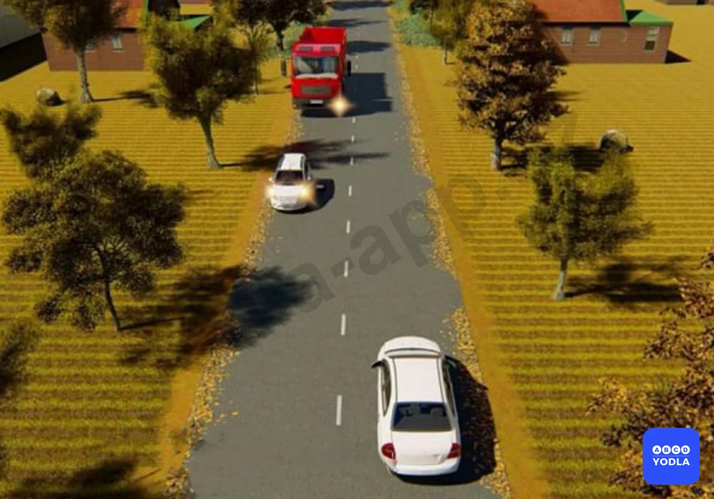
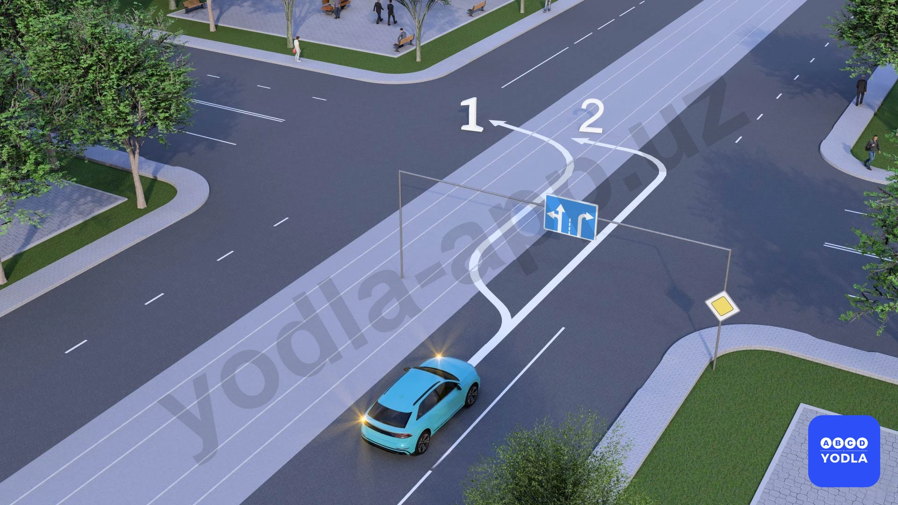
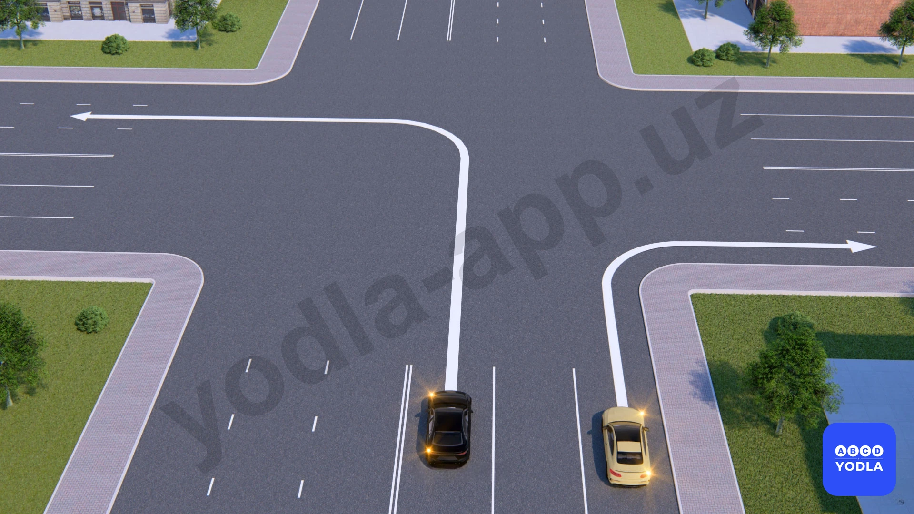
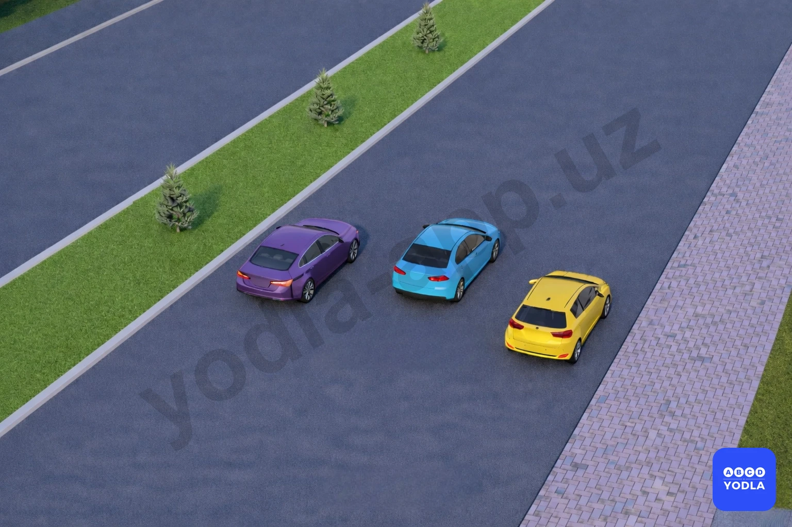

# Bilet 30

Всего вопросов: 20

## Вопрос 1

**В каких случаях водителям следует двигаться по фиксированным полосам движения, если проезжая часть разделена полосами дороги?**

⬜ A. Только при интенсивном движении
⬜ B. Только если полосы движения обозначены сплошными линиями разметки
✅ C. Во всех случаях

> 💡 Водитель, двигаясь по проезжей части, обязан двигаться в пределах своей полосы независимо от того, нанесена ли дорожная разметка прерывистой или сплошной линией. Это правило действует как при интенсивном движении, так и при свободном движении. То есть водитель должен двигаться по одной полосе, а перестроение в другую полосу допускается только при необходимости и с соблюдением требований Правил дорожного движения. Следовательно, правильный ответ — во всех случаях.

---

## Вопрос 2

**На любой дороге с тремя и более полосамидвижения в одном направлении грузовымавтомобилям разрешается занимать крайнююлевую полосу:**

⬜ A. При обгоне, повороте налево иразвороте
⬜ B. При обгоне и объезде
✅ C. F3При повороте налево и развороте
⬜ D. Во всех случаях

> 💡 Если дорога в одном направлении имеет три и более полосы движения, то грузовым автомобилям разрешается занимать крайнюю левую полосу только для поворота налево или разворота. Движение прямо по крайней левой полосе грузовым автомобилям запрещено.

---

## Вопрос 3

**Должны ли Вы уступить дорогу встречному грузовому автомобилю?**

⬜ A. Да
✅ B. Нет

> 💡 В данной ситуации вы видите, что водитель автомобиля Spark включил аварийную сигнализацию и выставил знак аварийной остановки, то есть на его стороне образовалось препятствие. Водитель грузового автомобиля пытается объехать это препятствие. Согласно пункту 75 Правил дорожного движения, именно водитель грузового автомобиля обязан уступить дорогу транспортному средству, движущемуся навстречу. Мы продолжаем движение прямо, и препятствия на нашей стороне нет, поэтому уступать дорогу грузовому автомобилю мы не обязаны. Правильный ответ — «Нет».

---

## Вопрос 4

**Какие транспортного средства нарушает правило остановки в населённых пунктах?**

⬜ A. Водитель жёлтого автомобиля
⬜ B. Водитель синего автомобиля
✅ C. Оба не нарушили
⬜ D. Оба нарушили

> 💡 В данной ситуации вопрос звучит так: «Какой водитель в населённом пункте нарушает правила остановки?» Правильный ответ — «Никто не нарушает».

Объясню почему. Водитель жёлтого автомобиля имеет опознавательный знак «Инвалид». Поскольку установлен дорожный знак «Остановка запрещена, кроме инвалидов», ему разрешено остановиться в этом месте.

Синий автомобиль остановился с левой стороны дороги. Такая остановка разрешается при соблюдении четырёх условий:

Дорога находится в населённом пункте.
Посередине отсутствуют трамвайные пути.
Дорога имеет по одной полосе движения в каждом направлении (всего две полосы).
Дорожная разметка разрешает такую остановку.

Все эти условия выполнены, поэтому водитель синего автомобиля также не нарушает Правила дорожного движения.

Следовательно, правильный ответ — оба водителя правила не нарушают.

---

## Вопрос 5

**Если дорожные знаки и разметка не указывают иное направление, с какой стороны водители должны объезжать островки безопасности, столбы и дорожные сооружения (мосты, эстакады и тому подобное) на дорогах с двусторонним движением без разделительной полосы?**

✅ A. Объезжать только с правой стороны
⬜ B. Объезжать только с левой стороны
⬜ C. Объезжать с обеих сторон

> 💡 ли дорожные знаки и разметка не указывают направление объезда препятствия, например перед мостом, водитель должен руководствоваться правилом правой стороны. В соответствии с требованиями пункта 76 Правил дорожного движения препятствие следует объезжать справа.

---

## Вопрос 6

**Сколько полос движения на участке дороги, по которому движутся автомобили?**

⬜ A. Одна полоса
✅ B. Две полосы
⬜ C. Три полосы

> 💡 На изображении вы видите три автомобиля. Многие считают, что если по ширине дороги помещаются три автомобиля, значит здесь три полосы движения. Но это неверно.

При определении количества полос необходимо учитывать не только ширину проезжей части, но и габаритные размеры транспортных средств, а также необходимый боковой интервал между ними.

В данной ситуации главное — обратить внимание на дорожный знак. Именно он показывает, что на дороге две полосы движения.

Водитель в первую очередь должен руководствоваться дорожными знаками, затем дорожной разметкой. Если нет ни знаков, ни разметки, тогда количество полос определяется самостоятельно, исходя из ширины проезжей части, габаритов транспортных средств и безопасного бокового интервала между ними.

Следовательно, в данном случае правильный ответ — две полосы движения.

---

## Вопрос 7

**Какой водитель движется, не нарушая правил?**

✅ A. Водитель синего автомобиля
⬜ B. Водитель красного автомобиля
⬜ C. Оба водителя автомобилей
⬜ D. Оба водителя нарушают правила

> 💡 В данной ситуации вы видите временный дорожный знак «Поворот налево запрещён». Если требования постоянного и временного дорожных знаков противоречат друг другу, водитель обязан руководствоваться временным дорожным знаком.

Поэтому, несмотря на то что постоянный знак указывает направление налево, поворот налево здесь запрещён.

Однако знак «Поворот налево запрещён» не запрещает разворот, если отсутствуют другие ограничения. Следовательно, водитель синего автомобиля не нарушает Правила дорожного движения.

---

## Вопрос 8

**По какому направлению разрешён поворот налево?**

⬜ A. Только по первому направлению
✅ B. Только по второму направлению
⬜ C. Поворот налево запрещён по обоим направлениям
⬜ D. По всем направлениям

> 💡 Если трамвайные пути расположены на одном уровне с проезжей частью, выезд на них разрешается при соблюдении требований Правил дорожного движения. Однако если отсутствуют дорожные знаки 5.8.1 и 5.8.2, движение по трамвайным путям для движения прямо не допускается. Следовательно, автомобиль должен продолжить движение по своей полосе во втором направлении.

---

## Вопрос 9

**По каким направлениям разрешено движение грузовому автомобилю?**

✅ A. Только налево
⬜ B. Налево и разворот
⬜ C. Прямо и налево

> 💡 На изображении дорога имеет четыре полосы движения в одном направлении. Если в одном направлении три и более полос, грузовым автомобилям разрешается занимать крайнюю левую полосу только для поворота налево или разворота. Движение прямо по крайней левой полосе для грузовых автомобилей запрещено.

Однако в данной ситуации установлен дорожный знак «Разворот запрещён», поэтому водитель грузового автомобиля не может выполнить разворот. Следовательно, ему разрешается только поворот налево.

---

## Вопрос 10

**Разрешено ли движение в указанных направлениях?**

⬜ A. Разрешено только направо
⬜ B. Разрешено только налево
✅ C. Разрешено в обоих направлениях

> 💡 На изображении видно, что водитель жёлтого автомобиля занимает крайнюю правую полосу и выполняет поворот в соответствии с требованиями Правил дорожного движения. Это разрешено и не является нарушением.

Водителю чёрного автомобиля также разрешается занять необходимую полосу для выполнения поворота в данной ситуации.

Следовательно, действия обоих водителей разрешены, и ни один из них не нарушает Правила дорожного движения.

---

## Вопрос 11

**Сколько полос движения имеется на проезжей части, по которой движутся автомобили?**

⬜ A. 2
⬜ B. 1
✅ C. 3

> 💡 На изображении видно, что на проезжей части свободно помещаются три автомобиля, при этом между ними сохраняется необходимый боковой интервал. Дорожные знаки и разметка отсутствуют. Поэтому, учитывая ширину проезжей части и необходимый боковой интервал между транспортными средствами, считается, что на данной дороге имеется три полосы движения.

---

## Вопрос 12

**С какой максимальной скоростью разрешается движение легковых автомобилей на участках дорог вне населенных пунктов?**

⬜ A. 110 км/ч.
✅ B. 100 км/ч.
⬜ C. 90 км/ч
⬜ D. 80 км/ч.
⬜ E. 70 км/ч.

> 💡 Вне населённых пунктов максимально разрешённая скорость для легковых автомобилей составляет 100 км/ч. Поэтому правильный ответ — 100 км/ч.

---

## Вопрос 13

**С какой максимальной скоростью разрешается дви­жение легковых автомобилей с прицепом на участках дорог, обозначенных таким дорожным знаком?**

⬜ A. 60 км/ч
⬜ B. 70 км/ч
✅ C. 80 км/ч
⬜ D. 100 км/ч
⬜ E. 110 км/ч

> 💡 Если легковой автомобиль движется с прицепом, то вне населённых пунктов максимально разрешённая скорость для него составляет 80 км/ч. Для транспортных средств с прицепом установлен отдельный скоростной режим. Поэтому правильный ответ — 80 км/ч.

---

## Вопрос 14

**На участке дороги с данным знаком с какой максимальной скоростью должны двигаться грузовые автомобили, разрешенная максимальная масса которых не более 3,5т.?**

⬜ A. 110 км/ч
⬜ B. 70 км/ч
✅ C. 100 км/ч
⬜ D. 90 км/ч
⬜ E. 60 км/ч

> 💡 Для грузовых автомобилей с разрешённой максимальной массой не более 3,5 тонны вне населённых пунктов максимально разрешённая скорость составляет 100 км/ч. Такие автомобили по скоростному режиму приравниваются к легковым автомобилям. Поэтому правильный ответ — 100 км/ч.

---

## Вопрос 15

**Во сколько раз увеличивается длина тормозного пути, если скорость движения увеличивается в два раза?**

⬜ A. Длина тормозного пути не зависит от скорости движения
⬜ B. В три раза
✅ C. В четыре раза
⬜ D. В два раза

> 💡 Если скорость движения увеличивается в два раза, то тормозной путь увеличивается в четыре раза. Запомните простое правило: во сколько раз увеличивается скорость, во столько раз в квадрате увеличивается тормозной путь. Поэтому правильный ответ — в 4 раза.

---

## Вопрос 16

**Что называется остановочным путем?**

⬜ A. Дистанция; пройденная автомобилем за время; когда водителю стало известно об опасности до начала торможения
✅ B. Путь; пройденный автомобилем с момента обнаружения водителем опасности; до его полной остановки

> 💡 Остановочный путь — это общее расстояние, которое проходит автомобиль с момента, когда водитель заметил опасность, до полной остановки транспортного средства.

То есть водитель замечает опасность, в течение примерно 1 секунды оценивает ситуацию и нажимает на педаль тормоза. После этого автомобиль начинает тормозить и полностью останавливается. Расстояние, пройденное с момента обнаружения опасности до полной остановки автомобиля, называется остановочным путём.

Тормозной путь — это расстояние, которое автомобиль проходит с момента нажатия на педаль тормоза до полной остановки.

Время реакции — это время от момента обнаружения опасности до нажатия на педаль тормоза. В среднем оно принимается равным 1 секунде, хотя может изменяться в зависимости от состояния и опыта водителя.

---

## Вопрос 17

**Прежде чем начать обгон; водитель должен убедиться в том; что:**

⬜ A. Ни один из следующих за ним водителей, которому может быть создана помеха, не начал обгона
⬜ B. Водитель транспортного средства, движущегося впереди по той же полосе, не подал сигнал о повороте (перестроении) налево
⬜ C. При завершении обгона он сможет, не создавая помехи обгоняемому транспортному средству, вернуться на ранее занимаемую полосу
✅ D. Выполнить все перечисленные действия

> 💡 Перед началом обгона водитель обязан убедиться, что выполнение манёвра будет безопасным. Если все предложенные варианты соответствуют требованиям Правил дорожного движения, то правильный ответ — все перечисленные варианты.

---

## Вопрос 18

**С какой максимальной скоростью разрешено движение водителю легкового автомобиля; буксирующего прицеп вне населенного пункта?**

⬜ A. 50 км/ч
⬜ B. 70 км/ч
✅ C. 80 км/ч
⬜ D. 90 км/ч
⬜ E. 100 км/ч

> 💡 Вне населённых пунктов максимально разрешённая скорость для легкового автомобиля с прицепом составляет 80 км/ч. Поэтому правильный ответ — 80 км/ч.

---

## Вопрос 19

**В каких случаях водителю легкового автомобиля при езде вне населённых пунктов запрещается превышать установленную скорость?**

⬜ A. Только если на дороге установлены дорожные знаки; ограничивающие скорость движения
⬜ B. Только если он двигается с прицепом
⬜ C. Если он буксирует другие транспортные средства
✅ D. Во всех перечисленных случаях

> 💡 Вне населённых пунктов водителю легкового автомобиля в некоторых случаях запрещается двигаться со скоростью более 90 км/ч. Например, если установлены дорожные знаки ограничения скорости или автомобиль движется с прицепом, превышать установленную скорость запрещено.

Поэтому правильный ответ — во всех перечисленных случаях.

---

## Вопрос 20

**Что должен учитывать водитель при выборе скорости движения?**

⬜ A. Интенсивность движения, особенности и состояние транспортного средства и груза
⬜ B. Дорожные и метрологические условия
✅ C. Все перечисленные факторы

> 💡 При выборе скорости движения водитель обязан учитывать все факторы: интенсивность дорожного движения, особенности и состояние транспортного средства и груза, а также дорожные и погодные условия. Поэтому правильный ответ — все перечисленные факторы.

---

