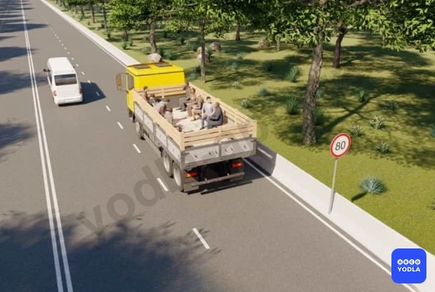
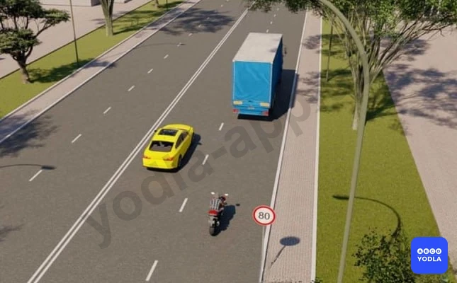
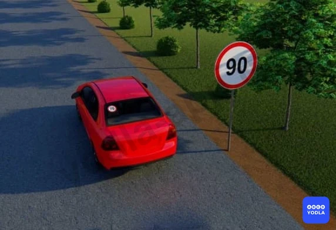

# Bilet 31

Всего вопросов: 20

## Вопрос 1

**Водителю какого транспортного средства разрешено движение со скоростью; указанной на знаке?**

⬜ A. Обоим водителям
✅ B. Только водителю микроавтобуса
⬜ C. Обоим запрещено

> 💡 Как видно на изображении, здесь показаны микроавтобус и грузовой автомобиль. Поскольку грузовой автомобиль перевозит людей, его максимально разрешённая скорость на любых дорогах составляет 60 км/ч.

Для микроавтобуса вне населённых пунктов разрешена скорость до 90 км/ч. На данном участке дороги установлено ограничение 80 км/ч.

Следовательно, двигаться со скоростью 80 км/ч разрешается только водителю микроавтобуса. Водителю грузового автомобиля, перевозящего людей, это не разрешается, так как его скорость не должна превышать 60 км/ч независимо от типа дороги.

---

## Вопрос 2

**Кто из водителей нарушает требования Правил; если все транспортные средства движутся со скоростью 80 км/ч?**

⬜ A. Водители мотоцикла и грузового автомобиля
⬜ B. Водители мотоцикла и легкового автомобиля
⬜ C. Все водители
⬜ D. Водитель мотоцикла
✅ E. Никто не нарушает

> 💡 На данном участке дороги установлено ограничение скорости 80 км/ч. Поэтому все транспортные средства обязаны двигаться не быстрее 80 км/ч.

Хотя для легкового автомобиля вне населённых пунктов максимально разрешённая скорость составляет 100 км/ч, на этом участке он обязан соблюдать ограничение 80 км/ч.

Следовательно, если все транспортные средства движутся в пределах установленного ограничения, никто не нарушает Правила дорожного движения.

Правильный ответ — никто не нарушает.

---

## Вопрос 3

**Что называется тормозным путем?**

⬜ A. Расстояние; пройденное автомобилем с момента обнаружения водителем опасности до полной остановки
✅ B. Расстояние; пройденное автомобилем с момента нажатия на педаль тормоза до полной остановки

> 💡 Тормозной путь — это расстояние, которое автомобиль проходит с момента нажатия водителем на педаль тормоза до полной остановки автомобиля.

---

## Вопрос 4

**С какой максимальной скоростью разрешается движение на данном участке дороги при наличии на автомобиле опознавательного знака?**

✅ A. 70 км/ч
⬜ B. 90 км/ч
⬜ C. 100 км/ч

> 💡 Как видно, на дороге установлен знак ограничения скорости 90 км/ч. Однако на автомобиле установлен опознавательный знак «70».

В такой ситуации водитель не имеет права превышать скорость, указанную на опознавательном знаке автомобиля. Это требование действует на любых дорогах.

Следовательно, в данной ситуации максимально разрешённая скорость составляет 70 км/ч.

---

## Вопрос 5

**С какой максимальной скоростью разрешается движение мотоциклам на участках дорог обозначенных таким дорожным знаком?**

⬜ A. 60 км/ч
⬜ B. 70 км/ч
✅ C. 80 км/ч
⬜ D. 90 км/ч
⬜ E. 100 км/ч

> 💡 Этот дорожный знак обозначает дорогу вне населённого пункта. На таких дорогах максимально разрешённая скорость для мотоциклов составляет 80 км/ч.

Поэтому правильный ответ — 80 км/ч.

---

## Вопрос 6

**С какой максимальной скоростью разрешается движение не междугородним автобусам на участках дорог обозначенных таким дорожным знаком?**

⬜ A. 50 км/ч
⬜ B. 60 км/ч
⬜ C. 70 км/ч
✅ D. 80 км/ч
⬜ E. 90 км/ч

> 💡 Этот дорожный знак обозначает дорогу вне населённого пункта. На таких дорогах для негородских (не междугородних) автобусов максимально разрешённая скорость составляет 80 км/ч.

Если это междугородний автобус, то максимально разрешённая скорость составляет 90 км/ч.

Поэтому правильный ответ — 80 км/ч.

---

## Вопрос 7

**С какой максимальной скоростью разрешается движение в кузове грузового автомобиля при перевозке людей вне населённого пункта?**

⬜ A. 40 км/ч
⬜ B. 50 км/ч
✅ C. 60 км/ч
⬜ D. 70 км/ч
⬜ E. 80 км/ч

> 💡 Вне населённых пунктов, если грузовой автомобиль перевозит людей в кузове, максимально разрешённая скорость составляет 60 км/ч.

Это правило действует на любых дорогах. То есть грузовой автомобиль, перевозящий людей, не должен превышать скорость 60 км/ч.

Поэтому правильный ответ — 60 км/ч.

---

## Вопрос 8

**Вы приближаетесь к повороту дороги налево, он оказался более крутым, чем предполагалось. Вы должны:**

⬜ A. Продолжаете движение не изменяя скорости и придерживаясь левого края проезжей части дороги
✅ B. Снизите скорость движения
⬜ C. Увеличите скорость чтобы быстрее пройти поворот

> 💡 При приближении к повороту может оказаться, что он намного более крутой, чем вы предполагали. Это означает, что поворот более опасный и требует повышенного внимания.

В такой ситуации необходимо снизить скорость, чтобы избежать заноса или столкновения с препятствием.

Поэтому правильный ответ — уменьшить скорость.

---

## Вопрос 9

**С какой максимальной скоростью разрешается движение грузовых автомобилей с разрешенной максимальной массой более 3,5 т на участках дорог обозначенных таким дорожным знаком?**

⬜ A. 60 км/ч
⬜ B. 90 км/ч
✅ C. 80 км/ч
⬜ D. 70 км/ч
⬜ E. 100 км/ч

> 💡 Этот дорожный знак обозначает дорогу вне населённого пункта.

В вопросе речь идёт о грузовом автомобиле с разрешённой максимальной массой более 3,5 тонны. Для таких грузовых автомобилей вне населённых пунктов максимально разрешённая скорость составляет 80 км/ч.

Для грузовых автомобилей с разрешённой максимальной массой до 3,5 тонны максимально разрешённая скорость составляет 100 км/ч.

Поэтому правильный ответ — 80 км/ч.

---

## Вопрос 10

**Разрешается ли водителю междугородного автобуса вне населенных пунктов превышать скорость 80 км/ч?**

⬜ A. Разрешается только при движении по дороге имеющей две и более полосы для движения в данном направлении
✅ B. Разрешается
⬜ C. Запрещается

> 💡 Водителю маршрутного автобуса вне населённых пунктов разрешается двигаться со скоростью более 80 км/ч, поскольку для такого автобуса максимально разрешённая скорость составляет 90 км/ч.

Следовательно, превышать скорость 80 км/ч разрешается. Правильный ответ — Да, разрешается.

---

## Вопрос 11

**С какой максимальной скоростью разрешается движение междугородным автобусам на участках дорог обозначенных таким дорожным знаком?**

⬜ A. 50 км/ч
⬜ B. 60 км/ч
⬜ C. 70 км/ч
⬜ D. 80 км/ч
✅ E. 90 км/ч

> 💡 Этот дорожный знак обозначает дорогу вне населённого пункта. На таких дорогах для междугородних автобусов максимально разрешённая скорость составляет 90 км/ч.

Поэтому правильный ответ — 90 км/ч.

---

## Вопрос 12

**С какой скоростью вне населенных пунктов разрешается движение транспортных средств, осуществляющих перевозки тяжеловесных или габаритных грузов?**

⬜ A. Не более 40 км/час
⬜ B. Не более 60 км/час
✅ C. Не более предписанной ГСБДД при согласовании условий перевозки

> 💡 Транспортные средства, перевозящие крупногабаритные или тяжеловесные грузы, как вне населённых пунктов, так и в населённых пунктах, не должны превышать скорость, установленную условиями перевозки и согласованную с Государственной службой безопасности дорожного движения.

Следовательно, такие транспортные средства могут двигаться только со скоростью, указанной в разрешении или условиях перевозки.

---

## Вопрос 13

**Если на транспортном средстве установлен опознавательный знак «ограничения скорости», водитель транспортного средства обязан:**

⬜ A. Разрешается превышать указанную на знаке скорость только на участках дорог где скорость движения повышена установкой соответствующего дорожного знака
✅ B. Запрещается превышать указанную на знаке скорость

> 💡 Если на транспортном средстве установлен опознавательный знак, ограничивающий максимальную скорость, водителю запрещается превышать скорость, указанную на этом знаке.

В данном случае под знаком подразумевается именно опознавательный знак ограничения максимальной скорости, установленный на транспортном средстве.

---

## Вопрос 14

**Может ли быть повышена максимальная скорость движения; определенная технической характеристикой транспортного средства?**

⬜ A. Может быть повышена органами; ответственными за эксплуатацию дорог
⬜ B. Может быть повышена на дорогах вне населенных пунктов. На таких участках устанавливаются знаки "Ограничение максимальной скорости"
✅ C. Не может быть превышена

> 💡 Превышать максимальную скорость, указанную в технической характеристике транспортного средства, запрещено. Водитель обязан соблюдать максимальную скорость, установленную производителем транспортного средства.

Поэтому правильный ответ — нет, превышать нельзя.

---

## Вопрос 15

**Что понимается под временем реакции?**

✅ A. Время с момента обнаружения водителем опасности, до начала ответных действий
⬜ B. Время с момента; когда водитель начал тормозить; до полной остановки транспортного средства

> 💡 Время реакции — это время, которое проходит с момента обнаружения водителем опасности до начала выполнения конкретного действия.

После того как водитель замечает опасность, он оценивает ситуацию и принимает решение. Затем он либо нажимает на педаль тормоза, либо поворачивает рулевое колесо, чтобы объехать препятствие, если это безопаснее. Время, затраченное на принятие этого решения, называется временем реакции.

Среднее время реакции принимается равным 1 секунде. За это время водитель оценивает дорожную ситуацию и принимает решение о необходимых действиях.

---

## Вопрос 16

**При выборе скорости движения водителю запрещается:**

⬜ A. Превышать скорость, указанную на опознавательном знаке, установленном на транспортном средстве в соответствии с настоящими Правилами
⬜ B. Резко тормозить, если это не требуется для обеспечения безопасности движения
✅ C. Запрещаются оба перечисленных действия

> 💡 Следовательно, оба действия запрещены. Водитель не должен превышать скорость, указанную на опознавательном знаке ограничения скорости, установленном на транспортном средстве. Кроме того, запрещается резко тормозить, если это не связано с предотвращением дорожно-транспортного происшествия и может создать помеху или опасность для других участников движения.

Поэтому правильный ответ — оба действия запрещены.

---

## Вопрос 17

**С какой максимальной скоростью разрешено движение при буксировке на гибкой сцепке?**

⬜ A. 70 км/ч
⬜ B. 60 км/ч
✅ C. 50 км/ч
⬜ D. 40 км/ч
⬜ E. 30 км/ч

> 💡 При буксировке транспортного средства максимально разрешённая скорость составляет 50 км/ч. Это правило распространяется как на буксирующее, так и на буксируемое транспортное средство.

Поэтому правильный ответ — 50 км/ч.

---

## Вопрос 18

**Какое расстояние проедет транспортное средство за одну секунду при скорости движения 108 км/ч?**

⬜ A. 15 м
⬜ B. 25 м
✅ C. 30 м

> 💡 Транспортное средство, движущееся со скоростью 108 км/ч, проходит 30 метров за 1 секунду.

Чтобы быстро определить расстояние, пройденное за одну секунду, скорость в км/ч нужно разделить на 3,6.

Например: 108 ÷ 3,6 = 30 метров.

Следовательно, правильный ответ — 30 метров.

---

## Вопрос 19

**Какое расстояние проедет транспортное средство за одну секунду при скорости движения 72 км/ч?**

⬜ A. 15 м
✅ B. 20 м
⬜ C. 25 м

> 💡 Транспортное средство, движущееся со скоростью 72 км/ч, проходит 20 метров за 1 секунду.

Для расчёта необходимо разделить скорость на 3,6:

72 ÷ 3,6 = 20 метров.

Поэтому правильный ответ — 20 метров.

---

## Вопрос 20

**С какой скоростью могут двигаться грузовые автомобили с прицепом вне населённых пунктов?**

⬜ A. 80 км/ч
✅ B. 70 км/ч
⬜ C. 90 км/ч
⬜ D. 60 км/ч

> 💡 Для грузовых автомобилей с прицепом максимально разрешённая скорость составляет 70 км/ч.

Поэтому правильный ответ — 70 км/ч.

---

