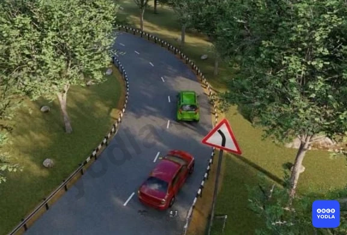
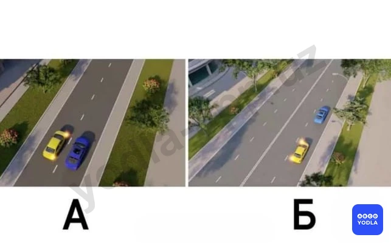
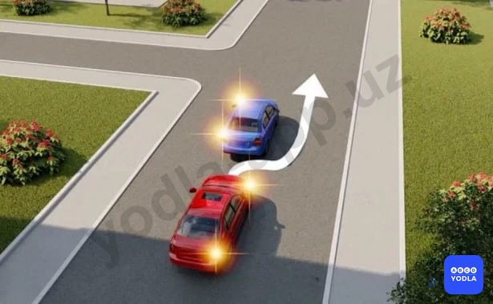
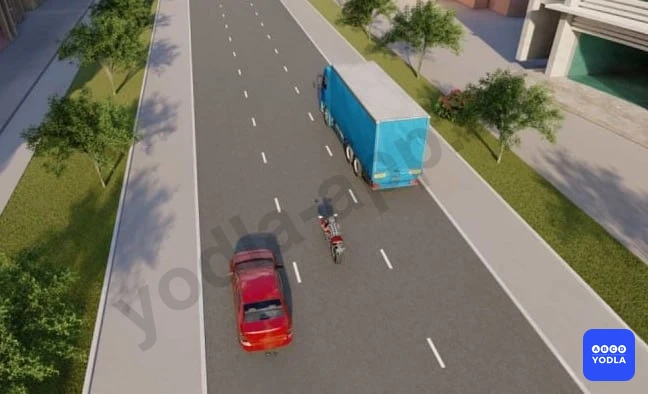
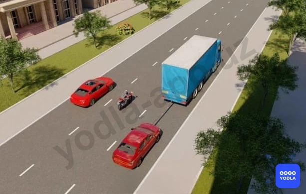

# Bilet 32

Всего вопросов: 20

## Вопрос 1

**Что наиболее важно учитывать водителю транспортных средств при выборе скорости, движущихся в темное время суток?**

⬜ A. Ограничения скорости, установленные ПДД
⬜ B. Ограничение скорости, указанное в техническом описании транспортных средств
✅ C. Условия видимости

> 💡 В тёмное время суток водитель должен выбирать скорость движения с учётом условий видимости. Чем дальше водитель может видеть дорогу, тем безопаснее он может управлять транспортным средством на соответствующей скорости.

Поэтому правильный ответ — необходимо учитывать условия видимости.

---

## Вопрос 2

**Какая максимальная скорость разрешена в жилых зонах:**

⬜ A. 5км/ч
✅ B. 20 км/ч
⬜ C. 30 км/ч
⬜ D. 40 км/ч

> 💡 В жилых зонах максимально разрешённая скорость составляет 20 км/ч.

Поэтому правильный ответ — 20 км/ч.

---

## Вопрос 3

**С какой максимальной скоростью разрешается движение в жилых зонах:**

⬜ A. 5 км/ч
⬜ B. 40 км/ч
⬜ C. 30 км/ч
✅ D. 20 км/ч

> 💡 В жилых зонах максимально разрешённая скорость составляет 20 км/ч.

Поэтому правильный ответ — 20 км/ч.

---

## Вопрос 4

**Какая максимальная скорость разрешена на расстоянии до 300 метров на дорогах вокругшкол и дошкольных учреждений?**

⬜ A. 20 км/ч
✅ B. 30 км/ч
⬜ C. 50 км/ч
⬜ D. 60 км/ч

> 💡 В ночное время вблизи образовательных учреждений, на дорогах, расположенных в радиусе до 300 метров, максимально разрешённая скорость составляет 30 км/ч.

Поэтому правильный ответ — 30 км/ч.

---

## Вопрос 5

**В каких направлениях разрешено движение данному автомобилю?**

⬜ A. По всем направлениям
⬜ B. По первому, второму и третьему направлениям
✅ C. По первому, третьему и четвёртому направлениям
⬜ D. Только по первому

> 💡 Как видно на изображении, транспортные средства, конструктивная скорость которых не превышает 40 км/ч, должны двигаться только по крайней правой полосе.

Перестраиваться на другие полосы им запрещено. Исключение составляют случаи, когда необходимо повернуть налево или выполнить разворот.

Следовательно, в данной ситуации разрешено движение по направлениям 1, 3 и 4.

---

## Вопрос 6

**Когда разрешается выезд транспортному средству, скорость которого не превышает 40 км/ч, с правой полосы проезжей части?**

⬜ A. При объезде
⬜ B. При перестроении для поворота налево или разворота
✅ C. Во всех перечисленных случаях

> 💡 Транспортные средства, скорость которых не превышает 40 км/ч, должны двигаться только по крайней правой полосе.

Покидать крайнюю правую полосу им разрешается только в исключительных случаях: для объезда препятствия, поворота налево, разворота или опережения, если это допускается Правилами дорожного движения.

Поэтому правильный ответ — во всех перечисленных случаях.

---

## Вопрос 7

**На двухполосных дорогах с двусторонним движением, расположенных вне населённых пунктов, водители транспортных средс��в (или составов транспортных средств), скорость которых не может превышать 50 километров в час, а также длина которых превышает 7 метров, должны соблюдать какое расстояние между собой и движущимся впереди транспортным средством?**

⬜ A. 3 метра
⬜ B. 5 метров
⬜ C. Такое расстояние, которое обеспечивает гарантию предотвращения столкновения в случае резкого торможения движущегося впереди транспортного средства
✅ D. Такое расстояние, которое позволяет обгоняющему транспортному средству без затруднений вернуться в занимаемую ранее полосу

> 💡 Здесь важно обратить внимание на то, что вне населённых пунктов транспортные средства, движущиеся со скоростью не более 50 км/ч, а также транспортные средства длиной более 7 метров, не должны создавать помех другим участникам движения.

Если за ними образовалась очередь из автомобилей и дорожная разметка разрешает обгон, водитель обязан соблюдать такую дистанцию до впереди идущего транспортного средства, чтобы обгоняющий автомобиль мог безопасно вернуться в ранее занимаемую полосу.

Поэтому правильный ответ — соблюдать дистанцию, достаточную для безопасного возвращения обгоняющего транспортного средства в свою полосу.

---

## Вопрос 8

**Обгон запрещается:**

⬜ A. На нерегулируемых перекрестках
⬜ B. На второстепенных дорогах на нерегулируемых перекрестках
⬜ C. На перекрестках равной важности
✅ D. Во всех перечисленных случаях

> 💡 В данной ситуации обгон запрещён во всех перечисленных случаях.

В частности:

на нерегулируемых перекрёстках;
на нерегулируемых перекрёстках неравнозначных дорог, если водитель движется не по главной дороге;
на нерегулируемых перекрёстках равнозначных дорог обгон запрещён.

Поэтому правильный ответ — во всех перечисленных случаях.

---

## Вопрос 9

**Разрешается ли обгон в данной ситуации?**

⬜ A. Разрешается
✅ B. Запрещается

> 💡 Согласно пункту 86, подпункту 6 главы 12 ПДД, обгон запрещается в конце подъёма и на участках дороги с ограниченной видимостью.

Поэтому красному автомобилю запрещено обгонять синий автомобиль, так как данная ситуация относится к условиям ограниченной видимости. На опасном повороте водитель красного автомобиля не может чётко и ясно видеть встречную полосу движения, а также не способен правильно оценить дорожную обстановку.

---

## Вопрос 10

**Разрешается ли обгон в показанной ситуации?**

✅ A. Разрешается
⬜ B. Запрещается
⬜ C. Разрешается, если скорость обгоняемого транспортного средства менее 40 км/ч

> 💡 Согласно пункту 86, подпункту 5 главы 12 ПДД, обгон запрещается на железнодорожных переездах и менее чем за 100 метров до них.

Поэтому красному автомобилю разрешается обгонять грузовой автомобиль, так как обгон выполняется непосредственно после железнодорожного переезда, то есть после полного его проезда.

---

## Вопрос 11

**На каком из рисунков показан обгон?**

✅ A. «А»
⬜ B. «Б»
⬜ C. «А» и «Б»

> 💡 Согласно пункту 6, подпункту 24 главы 1 ПДД, обгон — это опережение одного или нескольких транспортных средств, связанное с выездом на полосу, предназначенную для встречного движения, и последующим возвращением на ранее занимаемую полосу.

Поэтому обгон правильно показан на рисунке А, так как жёлтый автомобиль выезжает на полосу встречного движения для обгона синего автомобиля. На рисунке Б изображено опережение, поскольку жёлтый автомобиль планирует опередить синий автомобиль, не выезжая на полосу встречного движения.

---

## Вопрос 12

**Разрешается ли обгон транспортных средств в зоне перекрестка на дороге; являющейся главной по отношению к пересекаемой?**

✅ A. Разрешается
⬜ B. Запрещается

> 💡 Обратим внимание на вопрос. В вопросе говорится, что пересекаемый путь находится на главной дороге. Значит, если была основная дорога, то здесь разрешается обгон. Если обгон не является основным или считается основным, то обгон запрещается.

---

## Вопрос 13

**Имеет ли право водитель совершить обгон с правой стороны в данной ситуации?**

✅ A. Да
⬜ B. Нет

> 💡 Преодоление разрешено, так как водитель впереди идущего транспортного средства собирается перестроиться налево.

---

## Вопрос 14

**Разрешен ли водителю легкового автомобиля обгон в показанной ситуации?**

⬜ A. Разрешен
⬜ B. Разрешен, если скорость мотоциклиста менее 40 км/ч
✅ C. Запрещен

> 💡 Это двусторонняя дорога. Официальные лица, которые видят. Здесь переход на крайнюю левую полосу запрещен. Значит, водитель красного автомобиля движется здесь на встречную полосу и нарушает это правило. Значит, правильный ответ здесь запрещен.

---

## Вопрос 15

**Нарушает ли Правила водитель мотоцикла?**

⬜ A. Да
✅ B. Нет

> 💡 Здесь мотоциклист никак не знает правила, потому что он стучит в конце съезда, мотоцикл ещё не добрался до конца съезда, поэтому правильного ответа нет.

---

## Вопрос 16

**Если Вы выехали для обгона движущегося впереди идущего автомобиля, то в какой из перечисленных ситуаций наиболее целесообразно подать звуковой сигнал?**

⬜ A. Обгон совершается в ночное время
⬜ B. Водитель обгоняемого автомобиля начал притормаживать
✅ C. Водитель обгоняемого автомобиля включил указатель левого поворота
⬜ D. Водитель обгоняемого автомобиля включил указатель правого поворота

> 💡 Говорят, что если вы выезжаете на обгон впереди идущего автомобиля, то в каком из указанных случаев целесообразно дать звуковой ход? Конечно, если впереди идущий транспорт внезапно включит указатель поворота налево, нам придется его обгонять. А он, не глядя на нас, включил кнопку поворота налево. Так что он может подать нам сигнал.

---

## Вопрос 17

**По какому направлению водитель автомобиля правильно выполняет обгон?**

⬜ A. По направлению «А»
✅ B. По направлению «Б»
⬜ C. По направлению «А» и «Б»

> 💡 Значит, водитель красного автомобиля выехал на обгон мотоцикла, но, не доезжая до перекрестка, уже успел его обогнать. Если бы вы дали направление А, он бы оказался на перекрестке, равнозначном перекрестку. Поэтому, следовательно, ему запрещено в направлении А, правильный ответ будет правильным в направлении Б.

---

## Вопрос 18

**Разрешен ли обгон водителю красного автомобиля в такой ситуации?**

⬜ A. Разрешен
✅ B. Запрещена
⬜ C. Разрешен только при отсутствии встречных транспортных средств

> 💡 Водителю красного автомобиля запрещается выезжать на обгон, так как на трехполосной дороге с двусторонним движением не остается времени для переключения на левую полосу движения. Это правильный ответ. Запрещено.

---

## Вопрос 19

**Разрешается ли обгон в этом месте?**

⬜ A. Разрешается
✅ B. Запрещается
⬜ C. Разрешается на дорогах вне населенных пунктов
⬜ D. Запрещается только на дорогах вне населенных пунктов

> 💡 Согласно абзацу 6 пункта 86 главы 12 ПДД, обгон запрещен - в конце подъема и на других участках дорог с ограниченной видимостью.

---

## Вопрос 20

**Разрешается ли обгонять автопоезд в данной ситуации, если он движется со скоростью менее 40 км/час?**

✅ A. Запрещается
⬜ B. Разрешается

> 💡 ПДД Общие положения: Опасность - это любой фактор, который ставит под угрозу безопасность дорожного движения.

---

