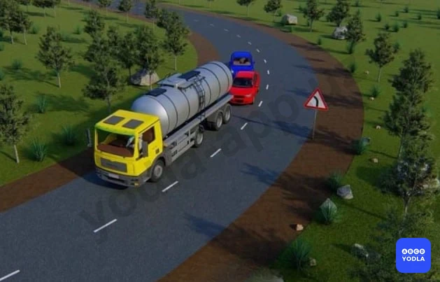
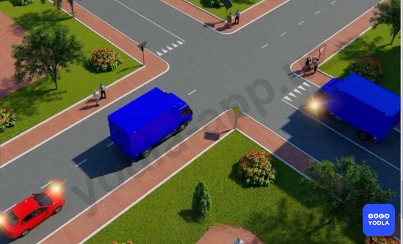
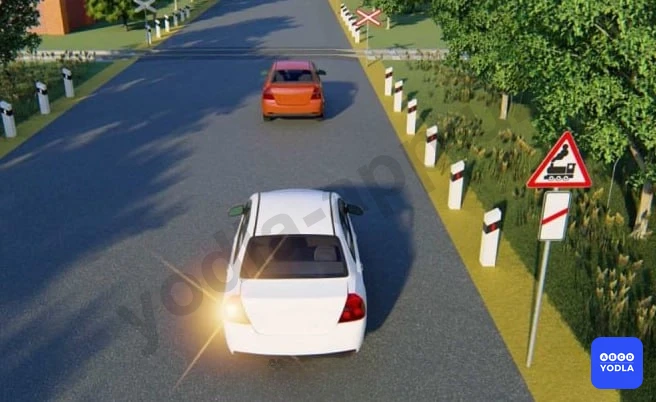
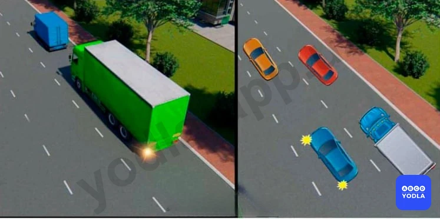
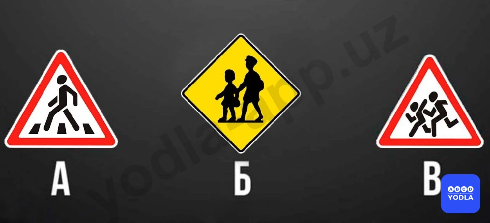
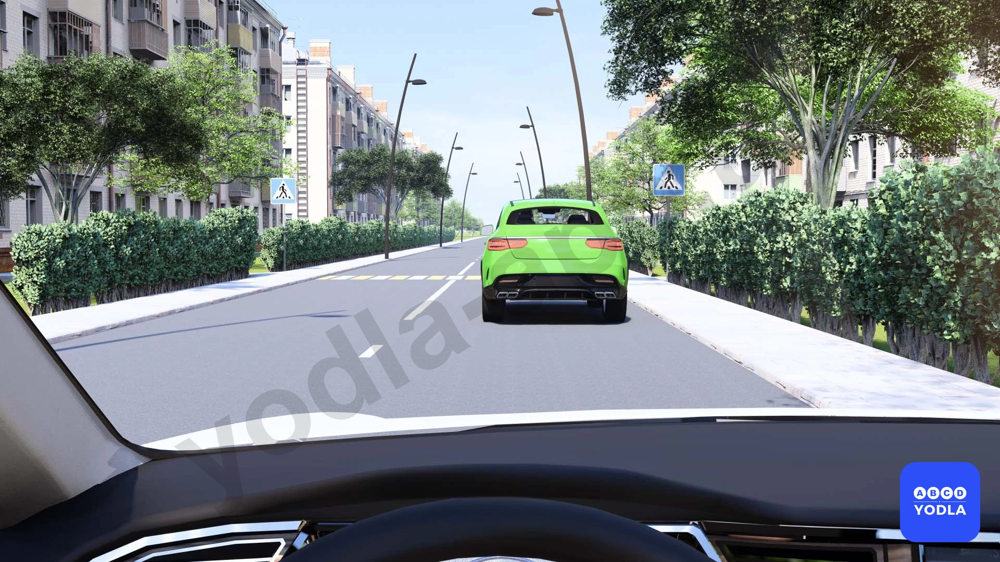

# Bilet 33

Всего вопросов: 20

## Вопрос 1

**Как должен действовать водитель автомобиля при обгоне его другим транспортным средством?**

⬜ A. Не изменяя полосы движения, подать сигнал указателем правого поворота
✅ B. Не препятствовать обгону повышением скорости движения или иными действиями
⬜ C. Снизить скорость движения, подать звуковой сигнал

> 💡 Согласно пункту 84 главы 12 ПДД, водителю обгоняемого транспортного средства запрещается препятствовать обгону повышением скорости движения или иными действиями.

---

## Вопрос 2

**Разрешается ли обгон на этом участке дороги?**

⬜ A. Разрешается если обгоняемый автомобиль движется со скоростью меньше чем 40 км/ч
✅ B. Запрещается
⬜ C. Разрешается, если обгон завершается до железнодорожного переезда

---

## Вопрос 3

**Вы выехали для обгона и неожиданно увидели встречный автомобиль. Если Вы не уверены в том что сумеете завершить обгон. Вы должны:**

⬜ A. Продолжить обгон до его завершения подавая звуковой сигнал и включив фары
⬜ B. Слегка увеличить скорость и быстрее завершить обгон
✅ C. Снизить скорость и вернуться на ранее занимаемую полосу

> 💡 Согласно пункту 82 главы 12 ПДД, прежде чем начать обгон водитель обязан убедиться в том, что полоса движения, на которую он намерен выехать, свободна на достаточном для обгона расстоянии и в процессе обгона он не создаст опасности для движения и помех другим участникам движения, по завершении обгона он сможет, не создавая помех обгоняемому транспортному средству, вернуться на ранее занимаемую полосу.

---

## Вопрос 4

**Что должен делать водитель тягача?**

✅ A. Через 100 метров от опасного поворота остановиться и пропустить автомобили скопившиеся сзади
⬜ B. Продолжать движение не изменяя скорость
⬜ C. Указать рукой на обгон по параллельной полосе

---

## Вопрос 5

**Разрешается ли водителю красного автомобиля выполнить обгон в данной ситуации?**

✅ A. Разрешается
⬜ B. Запрещается
⬜ C. Разрешается при условии; что скорость обгоняемого менее 40 км/ч

> 💡 Согласно абзацу 2 пункта 86 главы 12 ПДД, обгон запрещен - на нерегулируемых перекрестках при движении по дороге, не являющейся главной.

---

## Вопрос 6

**Как должен поступить водитель крупногабаритного транспортного средства, соблюдающего определенную скорость движения в населенном пункте?**

⬜ A. Остановиться и пропустить скопившиеся за ним транспортные средства
✅ B. Продолжить движение

> 💡 Согласно пункту 87 главы 12 ПДД, водитель тихоходного или крупногабаритного транспортного средства вне населённых пунктов в случаях, когда обгон этого транспортного средства затруднён, должен принять как можно правее, а при необходимости – остановиться, чтобы пропустить скопившиеся за ним транспортные средства. Однако, в населенных пунктах нет вышеупомянутых требований,  он может продолжить движение.

---

## Вопрос 7

**Разрешен ли обгон в данной ситуации?**

⬜ A. Разрешен, только одиночных транспортных средств, движущихся со скоростью менее 40 км/час
✅ B. Запрещена
⬜ C. Разрешен во всех случаях

> 💡 Согласно абзацу 4 пункта 86 главы 12 ПДД, обгон запрещён на железнодорожных переездах и ближе чем за 100 метр перед ними. Вне населенных пунктов знак 1.2. повторяются. Второй знак устанавливается на расстоянии не менее 50 метр (не более 100 метр) до начала опасного участка.

---

## Вопрос 8

**Что такое обгон?**

⬜ A. Опережение одного или нескольких транспортных средств другим связанное с выездом из занимаемой полосы
✅ B. Опережение одного или нескольких транспортных средств, связанное с выездом на полосу встречного движения и последующим возвращением на ранее занимаемую полосу
⬜ C. Опережение одного или нескольких транспортных средств движущихся в соседнем ряду с меньшей скоростью

> 💡 Согласно определению 24 пункт 6 главы 1 ПДД, обгон – опережение одного или нескольких транспортных средств, связанное с выездом на полосу, предназначенную для встречного движения, и последующим возвращением на ранее занимаемую полосу.

---

## Вопрос 9

**В чем должен убедиться водитель прежде чем начать обгон?**

⬜ A. В том что он движется гораздо быстрее водителя обгоняемого транспортного средства
✅ B. В том что водитель транспортного средства движущегося впереди по той же полосе не подал сигнал о повороте (перестроении) налево
⬜ C. В том что участок дороги на который он намерен выехать свободен на расстоянии 1000 м

---

## Вопрос 10

**Водитель какого транспортного средства правильно выполняет обгон?**

✅ A. Водитель грузового автомобиля
⬜ B. Водитель легкового автомобиля
⬜ C. Оба правильно
⬜ D. Оба неправильно

> 💡 Согласно пункту 66 главы 10 ПДД, на дорогах с двусторонним движением, имеющих три полосы, обозначенные разметкой (за исключением дорожной разметки 1.9), из которых средняя используется для движения в обоих направлениях, разрешается выезжать на эту полосу только для обгона, объезда, поворота налево или разворота. Выезжать на крайнюю левую полосу, предназначенную для встречного движения, запрещается.

---

## Вопрос 11

**Что запрещается водителю обгоняемого транспортного средства?**

⬜ A. Двигаться со скоростью более 40 км/час
⬜ B. Препятствовать обгону снижением скорости движения своего транспортного средства
✅ C. Препятствовать обгону путем повышения скорости движения или иными действиями

---

## Вопрос 12

**Обгон запрещается?**

✅ A. На железнодорожных переездах и ближе; чем за 100 м перед ними
⬜ B. На железнодорожных переездах и более чем 100 м от них
⬜ C. На железнодорожных переездах и более чем 100 м от них вне населенных пунктов

> 💡 Согласно абзацу 4 пункта 86 главы 12 ПДД, обгон запрещён на железнодорожных переездах и ближе чем за 100 метр перед ними.

---

## Вопрос 13

**Разрешается ли обгонять автобус в этом месте?**

✅ A. Разрешается
⬜ B. Запрещается

> 💡 Согласно абзацу 4 пункта 86 главы 12 ПДД, обгон запрещён на железнодорожных переездах и ближе чем за 100 метр перед ними. Вне населенных пунктов знак 1.1. повторяются. Первый знак устанавливается на расстоянии 150 — 300 м до начала опасного участка..

---

## Вопрос 14

**Водитель какого транспортного средства выполняет обгон правильно?**

✅ A. Водитель зеленого автомобиля
⬜ B. Водитель синего автомобиля
⬜ C. Оба водителя правильно обгоняют
⬜ D. Обоим водителям обгон запрещен

> 💡 Согласно пункту 66 главы 10 ПДД, на дорогах с двусторонним движением, имеющих три полосы, обозначенные разметкой (за исключением дорожной разметки 1.9), из которых средняя используется для движения в обоих направлениях, разрешается выезжать на эту полосу только для обгона, объезда, поворота налево или разворота. Выезжать на крайнюю левую полосу, предназначенную для встречного движения, запрещается.

---

## Вопрос 15

**Какие ограничения, относящиеся к обгону, действуют на железнодорожных переездах и вблизи них?**

✅ A. Обгон запрещен на переезде и ближе чем за 100 м перед ним
⬜ B. Обгон запрещен только на после переезда
⬜ C. Обгон запрещен на переезде и на расстоянии 100 м до и после него

> 💡 Дорожная разметка 1.20 раздела 1 приложения № 2 к ПДД, предупреждает о приближении к разметке 1.13.
Дорожная разметка 1.13 раздела 1 приложения № 2 к ПДД, указывает место, где водитель должен при необходимости остановиться, уступая дорогу транспортным средствам, движущимся по пересекаемой дороге.

---

## Вопрос 16

**В каких случаях обгон запрещен?**

⬜ A. На регулируемых перекрёстках
⬜ B. В конце подъёма и на других участках дорог с ограничения видимостю
⬜ C. На нерегулируемых перекрёстках при движении по дороге не являешься главной
✅ D. Во всех причисленных случаях

> 💡 Пункта 9 главы 2 ПДД, гласит: — детям до 12 лет, находящимся на заднем сиденье автомобиля (в соответствии с пунктом 159 Правил);
— беременным женщинам, больным (при наличии справки согласно министерству Здравоохранения перечня болезней и при наличии заболеваний согласно этого перечня), состояние которых не позволяет им пристегнуться ремнем безопасности;

---

## Вопрос 17

**Какой из этих знаков установлен перед школами и дошкольными образовательными организациями?**

⬜ A. «А»

✅ B. «Б» 
⬜ C. «В»

> 💡 Согласно пункта 31 главы 7 ПДД, круглый зеленый сигнал светофора разрешает движение. Согласно пункта 36 главы 7 ПДД, для регулирования движения трамваев, могут применяться светофоры с четырьмя круглыми сигналами бело-лунного цвета, расположенными в виде буквы «Т». Движение разрешается при включении одновременно нижнего сигнала и одного или нескольких верхних. Из них левый разрешает движение налево, средний — прямо, правый — направо. Если включены только три верхних сигнала, то движение запрещено.

---

## Вопрос 18

**На каких изображениях показан обгон?**

✅ A. Только на первом и втором изображениях
⬜ B. Только на первом и третьем изображениях
⬜ C. Только на первом, втором и четвёртом изображениях
⬜ D. Только на первом изображении
⬜ E. На всех изображениях

> 💡 Пункта 88 главы 13 ПДД, гласит: На левой стороне дороги остановка и стоянка разрешаются в населенных пунктах на дорогах с односторонним движением, имеющим две полосы движения, при отсутствии трамвайных путей посередине. Пункта 115.1 главы 17.1 ПДД, гласит: По дороге с выделенной полосой для маршрутного общественного транспорта могут двигаться только маршрутные транспортные средства. Движение других транспортных средств по этой полосе запрещается, за исключением транспортных средств оперативных и специальных служб.

---

## Вопрос 19

**Разрешен ли здесь обгон?**

⬜ A. Разрешается
⬜ B. Если скорость обгоняемого транспортного средства менее 40 км/ч
✅ C. Запрещается

> 💡 "На основании абзацев 2 и 4 пункта 159 главы 26 ПДД: 159. Запрещается перевозить людей в следующих случаях:
детей в кузове грузового автомобиля;
на тракторах и других самоходных устройства, в грузовом прицепе, в прицепе-даче, в кузове грузовых мотоциклов, электромотоциклов, мопедов и скутеров."

---

## Вопрос 20

**Какие предупредительные сигналы можно использовать при обгоне в населённых пунктах?**

✅ A. Фары дальнего света
⬜ B. Звуковые сигналы
⬜ C. 1 и 2

> 💡 На основании абзацев 2 и 3 пункта 48 и пункта 49 главы 8 ПДД: 48. Звуковые сигналы могут применяться только в следующих случаях:
вне населенных пунктов при обгоне, для предупреждения других водителей; Запрещается применение звуковых сигналов кроме случаев, указанных выше. 
49. Вместо звукового сигнала об обгоне или же вместе с ним может подаваться предупредительный сигнал переключением фар.

---

