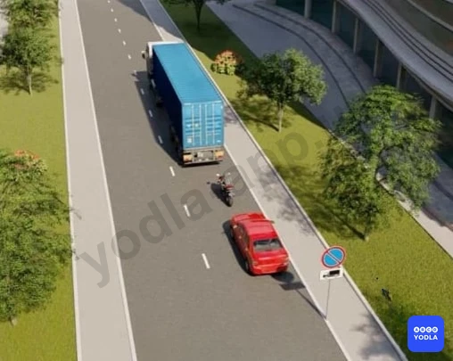
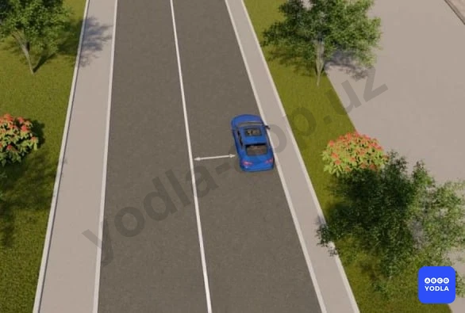
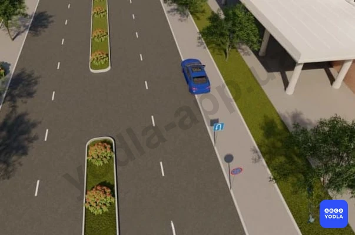
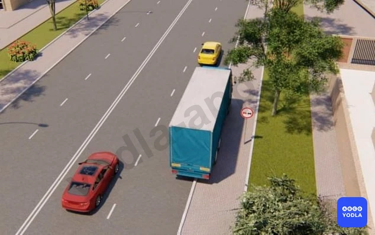
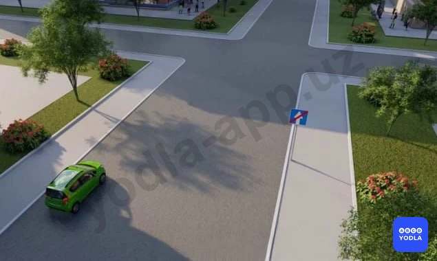
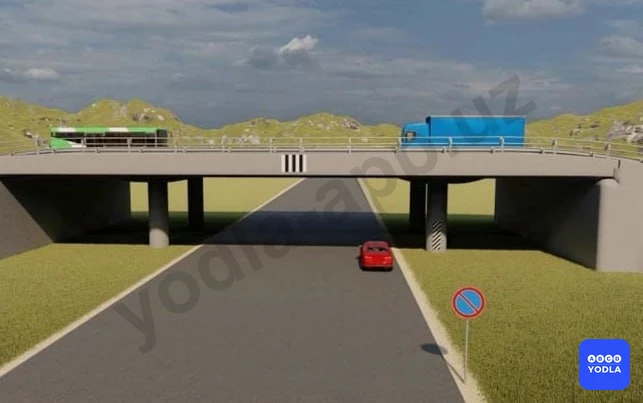

# Bilet 34

Всего вопросов: 20

## Вопрос 1

**Какие предупредительные сигналы можно использовать при обгоне вне населённых пунктов?**

⬜ A. Фары дальнего света
⬜ B. Звуковые сигналы
✅ C. 1 и 2

> 💡 На основании пункта 4.1.1 Приложения 1 к ПДД и абзаца 10 раздела 4 «Предписывающие знаки»: 4.1.1. «Движение прямо». Действие знаков 4.1.1 — 4.1.6 распространяется на пересечение проезжих частей, перед которым установлен знак.

---

## Вопрос 2

**Разрешается ли стоянка в этом месте?**

✅ A. Разрешается
⬜ B. Запрещается

> 💡 Согласно пункту 91 главы 13 ПДД, остановка и стоянка запрещается в следующих местах: на пересечении проезжих частей и ближе 30 м от края пересекаемой проезжей части, за исключением стороны напротив бокового проезда трехсторонних пересечений (перекрестков), имеющих сплошную линию дорожной разметки или разделительную полосу.

---

## Вопрос 3

**Какие транспортные средства допускается ставить в два ряда на проезжей части?**

✅ A. Мотоциклы без бокового прицепа, мопеды и велосипеды
⬜ B. Мотоциклы с боковым прицепом
⬜ C. Автомобили обозначенные знаком «Инвалид»
⬜ D. Грузовые автомобили, обслуживающие торговые и другие предприятия, которые непосредственно расположены вдоль тротуаров, разрешенная максимальная масса которых не превышает 3,5 т.

> 💡 Согласно пункту 89 главы 8 ПДД, ставить транспортные средства на проезжей части разрешается в один ряд параллельно к краю проезжей части, при условии, что они не мешают другим участникам дорожного движения, а двухколесные транспортные средства без бокового прицепа — в два ряда.

---

## Вопрос 4

**Каким транспортным средствам разрешена стоянка?**

⬜ A. Только мотоциклу
⬜ B. Только грузовому автомобилю
⬜ C. Только легковому автомобилю
✅ D. Легковому автомобилю и мотоциклу
⬜ E. Всем транспортным средствам

> 💡 Дополнительный знак 7.4.1 «Вид транспортного средства» приложения № 1 к ПДД, означает, что действие знака 3.28. «Стоянка запрещена» распространяет на грузовые автомобили, в том числе и с прицепом, с разрешенной максимальной массой более 3.5 тонн.

---

## Вопрос 5

**В каких местах разрешается стоянка транспортных средств под углом к краю проезжей части?**

⬜ A. На дорогах с двумя полосами движения в каждом направлении
⬜ B. На дорогах с тремя и более полосами движения в каждом направлении
⬜ C. Только на дорогах с односторонним движением
✅ D. На расширенных участках проезжей части; с условием; что не будет создана помеха другим участникам движения

> 💡 Согласно пункту 89 главы 13 ПДД, на отдельных участках дорог, имеющих местное уширение проезжей части, разрешается иное расположение транспортных средств, при условии, что это не будет создавать помех другим участникам движения.

---

## Вопрос 6

**При каком расстоянии между остановившемся автомобилем и сплошной линией разметки запрещается остановка?**

⬜ A. 6 м
⬜ B. 5,5 м
⬜ C. 4 м
⬜ D. 3,5 м
✅ E. 2,5 м

> 💡 Согласно абзацу 7 пункта 91 главы 13 ПДД, остановка запрещается в следующих местах: где расстояние между сплошной линией дорожной разметки (кроме обозначающей край проезжей части), разделительной полосой или противоположным краем проезжей части и остановившимся транспортным средством менее 3 м.

---

## Вопрос 7

**При остановке или стоянке на неосвещенных участках дорог в условиях недостаточной видимости водитель механического транспортного средства должен:**

⬜ A. Включить противотуманные фары или ближний свет фар
⬜ B. Включить дальний свет фар
✅ C. Включить габаритные огни

> 💡 Пункта 136 главы 23 ПДД, гласит: При остановке и стоянке в темное время суток на неосвещенных участках дорог, а также в условиях недостаточной видимости на транспортном средстве должны быть включены габаритные огни. 
В условиях недостаточной видимости дополнительно к габаритним огням могут быть включены фары ближнего света, противотуманные фары и задние противотуманные фонари.

---

## Вопрос 8

**В каких случаях запрещена стоянка на дорогах; имеющих менее трех полос движения в одну сторону?**

⬜ A. На мостах, эстакадах и на путепроводах
⬜ B. Под мостами, эстакадами и подвесными дорогами
✅ C. Во всех перечисленных случаях

> 💡 Согласно пункту 91 главы 13 ПДД, запрещается остановка и стоянка на мостах, эстакадах, путепроводах, если для движения в одном направлении имеется менее трёх полос, под мостами, эстакадами и путепроводами (кроме участков дорог, на которых разрешена стоянка с соответствующими дорожными знаками).

---

## Вопрос 9

**Разрешается ли стоянка легковому автомобилю в показанной ситуации?**

⬜ A. Разрешается
✅ B. Запрещается

> 💡 Согласно абзацу 14 пункта 91 главы 13 ПДД, остановка запрещается: в местах, где транспортное средство закроет от других водителей сигналы светофора, дорожные знаки или сделает невозможным движение (въезд или выезд) других транспортных средств, или создаст помехи для движения пешеходов.

---

## Вопрос 10

**Водители каких транспортных средств нарушили правила остановки?**

⬜ A. Только «А»
⬜ B. Только «Б»
⬜ C. Только «В»
⬜ D. «Б» и «В»
✅ E. «А» и «Б»

> 💡 Пункта 88 главы 13 ПДД, гласит: Остановка и стоянка транспортных средств разрешается как можно правее на обочине, а при ее отсутствии — у края проезжей части, и в случаях, указанных в пункте 89 Правил — на тротуаре. Грузовым автомобилям с разрешенной максимальной массой более 3,5 тн на левой стороне дорог с односторонним движением разрешается лишь остановка для загрузки или разгрузки груза.
Пункта 89 главы 13 ПДД, гласит: Ставить транспортные средства на проезжей части разрешается в один ряд параллельно к краю проезжей части, а двухколесные транспортные средства без бокового прицепа – в два ряда.

---

## Вопрос 11

**Водитель может покидать свое место или оставлять транспортное средство, если:**

⬜ A. Он выключил двигатель и включил стояночную тормозную систему
⬜ B. Он выключил двигатель и установил задний противооткатный буфер безопасности
✅ C. Им приняты необходимые меры; исключающие самопроизвольное движение транспортного средства или использование его в отсутствие водителя

> 💡 Пункта 95 главы 13 ПДД гласит: Водитель может покидать свое место или оставлять транспортное средство, если им приняты необходимые меры, исключающие самопроизвольное движение транспортного средства или использование его в отсутствии водителя.

---

## Вопрос 12

**Разрешается ли здесь стоянка?**

⬜ A. Разрешается 
✅ B. Запрещается 

> 💡 Согласно сорок третьему абзацу третьего раздела приложения 1 ПДД: Зона действия знаков 3.16, 3.20, 3.22, 3.24, 3.26- 3.30 от места установки знака до ближайшего перекрестка, а в населенных пунктах при их отсутствии — до конца населенного пункта при их отсутствии-действует до конца поселения. На выездах с прилегающих территорий на дороги или на пересечениях ( стыках ) дороги с полевыми, лесными дорогами и другими дорогами постоянного движения, не предназначенными для выезда на траву, действие этих знаков не теряется, если перед ними не установлены соответствующие знаки.

---

## Вопрос 13

**Разрешена ли остановка в этом месте?**

⬜ A. Разрешена
✅ B. Запрещена

> 💡 Согласно абзацу 2 пункта 88 главы 13 ПДД, в населенных пунктах остановка и стоянка допускаются на левой стороне дорог с одной полосой движения в каждом направлении и не имеющих трамвайных путей посередине, а так же дорог только с односторонним движением. Дорог имеющих трамвайных путей посередине остановка на левой стороне запрещена.

---

## Вопрос 14

**Ближе какого расстояния запрещается остановка и стоянка от остановочных площадок, а при их отсутствии, от указателя остановки маршрутных транспортных средств или такси, если это создает помехи их движению?**

⬜ A. 5 m
⬜ B. 10 m
✅ C. 15 m
⬜ D. 20 m
⬜ E. 25 m

> 💡 Согласно абзацу 13 пункта 91 главы 13 ПДД, остановка  запрещается в следующих местах: на остановочных площадках, местах остановки маршрутных транспортных средств, в том числе обозначенных дорожной разметкой 1.17 и ближе 15 м от них с обеих сторон по ходу движения, при их отсутствии — от указателя места остановки маршрутных транспортных средств (кроме остановки для посадки или высадки пассажиров, если это не создаст помех движению маршрутных транспортных средств).

---

## Вопрос 15

**Разрешается ли водителю грузовика остановиться в этом месте?**

⬜ A. Разрешается
✅ B. Запрещается

> 💡 Согласно абзацу 14 пункта 91 главы 13 ПДД, остановка запрещается в следующих местах: в местах, где транспортное средство закроет от других водителей сигналы светофора, дорожные знаки или сделает невозможным движение (въезд или выезд) других транспортных средств, или создаст помехи для движения пешеходов.

---

## Вопрос 16

**Разрешается ли стоянка автомобиля в этом месте?**

✅ A. Разрешается
⬜ B. Запрещается

> 💡 Согласно пункту 2 статьи 61 Правил дорожного движения, при наличии в месте выезда на дорогу полосы разгона водитель должен двигаться по ней и перестраиваться на соседнюю полосу, уступая дорогу транспортным средствам, движущимся по этой дороге.

---

## Вопрос 17

**Разрешается ли остановка в указанном месте?**

⬜ A. Разрешается
✅ B. Запрещается

---

## Вопрос 18

**Разрешена ли стоянка автомобиля в этом месте?**

⬜ A. Разрешена
✅ B. Запрещена

> 💡 Согласно требованию знака 3.28 раздела 3 приложения № 1 к ПДД, «Стоянка запрещена» запрещается стоянка транспортных средств. Его действия от места установки знака до ближайшего перекрестка за ним, до место для разворота, а в населенных пунктах при отсутствии перекрестка – до конца населенного пункта.

---

## Вопрос 19

**Где должен остановить автомобиль водитель при наличии обочины на дороге?**

⬜ A. У края проезжей части
⬜ B. На проезжей части, на расстоянии 0,5 м от обочины
✅ C. На самой обочине

> 💡 Согласно пункту 88 главы 13 ПДД, остановка и стоянка транспортных средств разрешаются на правой стороне дороги на обочине, а при ее отсутствии - на проезжей части у ее края.

---

## Вопрос 20

**Какие правила нарушил водитель легкового автомобиля?**

⬜ A. Только правила стоянки
✅ B. Правила остановки и стоянки

> 💡 Знак дополнительной информации 7.18 "Кроме инвалидов". Указывает, что действие знаков не распространяется на транспортные средства и мотоколяски, на которых установлены опознавательные знаки "Инвалид" в соответствии с пунктом 28.3 настоящих Правил. В данном случае знак дополнительной информации 7.18 означает, что действие знака 3.27 не распространяется на автомобили с опознавательным знаком "Инвалид". Соответственно, остановка для них разрешена.

---

