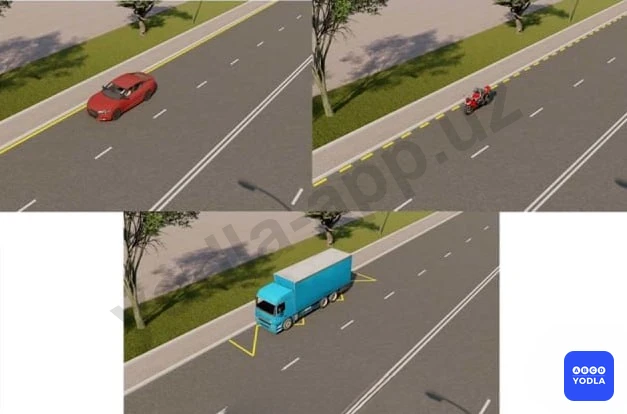
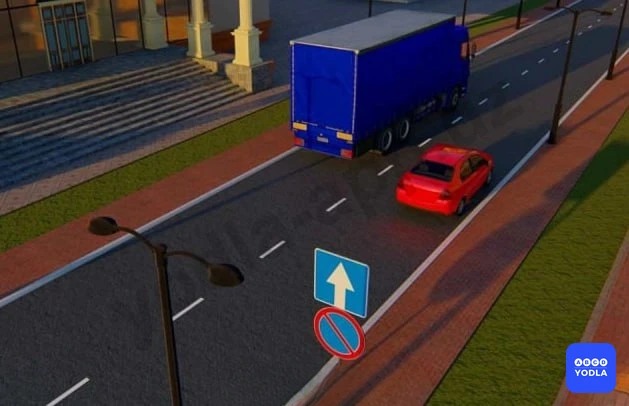
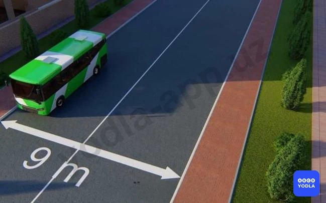
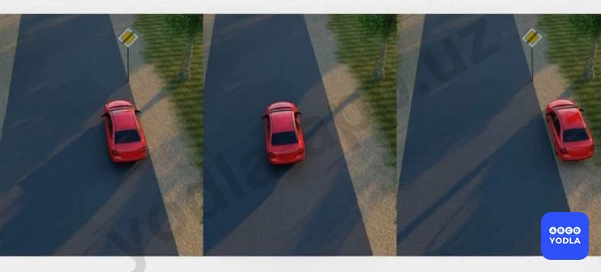
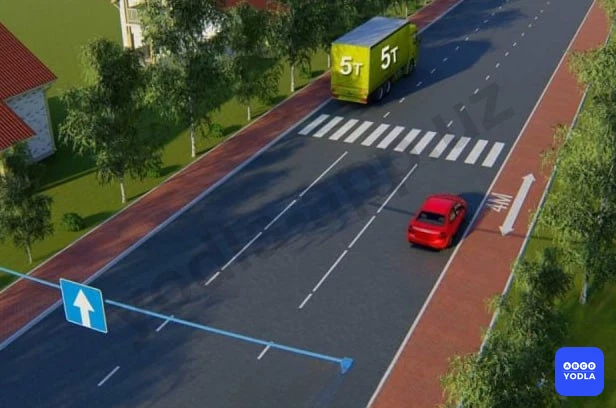
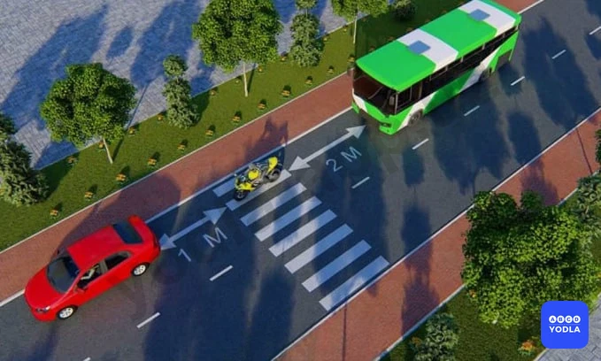
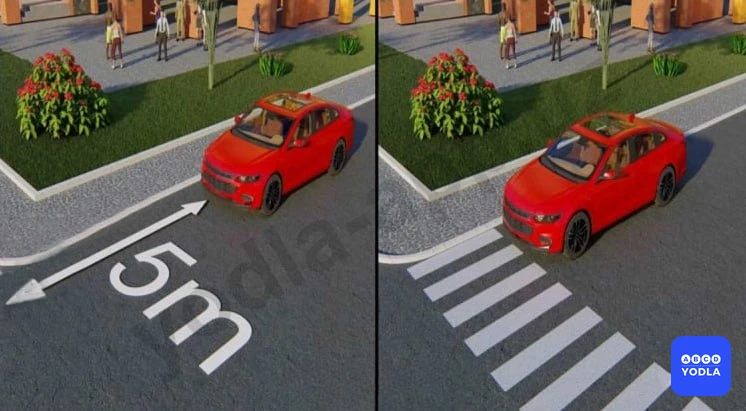

# Bilet 35

Всего вопросов: 20

## Вопрос 1

**Кто из водителей правильно произвел остановку для высадки пассажиров?**

⬜ A. Водитель синего и красного автомобиля

✅ B. Водители мотоцикла и синего автомобиля

⬜ C. Только водитель синего автомобиля
⬜ D. Все водители

> 💡 Горизонтальная разметка 1.4 (сплошная линия желтого цвета) - обозначает места, где запрещена остановка. Применяется самостоятельно или в сочетании со знаком 3.27 и наносится у края проезжей части или по верху бордюра.
Горизонтальная разметка 1.10 (прерывистая линия желтого цвета) - обозначает места, где запрещена стоянка. Применяется самостоятельно или в сочетании со знаком 3.28 и наносится у края проезжей части или по верху бордюра.
Горизонтальная разметка 1.17 - обозначает остановки маршрутных транспортных средств и стоянки такси.
Пункта 91 главы 13 ПДД, гласит: Что остановка запрещена на остановочных площадках, а при их отсутствии - ближе 15 м от указателя остановки маршрутных транспортных средств или такси, если это создаст помехи их движению. В данном случае только водитель красного автомобиля нарушил Правила дорожного движения, соответственно, водители мотоцикла и синего автомобиля правильно произвели остановку для высадки пассажиров.

---

## Вопрос 2

**Стоянка запрещается:**

⬜ A. Более 30 метров от края пересекаемых проезжих частей
⬜ B. Более 10 метров перед пешеходным переходом
⬜ C. Более одного метра за пешеходным переходом
✅ D. В тех местах; где стоящее транспортное средство делает невозможным движение (въезд или выезд) других транспортных средств или создает помехи для движения пешеходов
⬜ E. Во всех перечисленных случаях

> 💡 Пункта 91 главы 13 ПДД, гласит: Остановка запрещается в следующих местах: на пешеходных переходах и менее чем за 10 метров до них; на пересечениях проезжих частей на расстоянии менее 30 метров от края пересекаюшей проезжей части (за исключением противоположной стороны примыкающей дороги, отделенной разделительной линией или разделительной полосой на трехсторонних перекрестках); в местах, где транспортное средство закроет от других водителей сигналы светофора, дорожные знаки или сделает невозможным движение (въезд или выезд) других транспортных средств или создаст помехи для движения пешеходов.

---

## Вопрос 3

**Водители каких транспортных средств нарушили правила стоянки?**

⬜ A. Водитель легкового автомобиля
⬜ B. Водитель грузового автомобиля
✅ C. Оба водителя

> 💡 Запрещающий знак 3.28 “Стоянка запрещена”. Запрещается стоянка транспортных средств. “Стоянка запрещена” запрещает стоянку транспортных средств. Абзацу 3 пункта 88 главы 13 ПДД, грузовым автомобилям с разрешенной максимальной массой более 3,5 т на левой стороне дороги с односторонним движением остановка разрешается только для загрузки и разгрузки груза.

---

## Вопрос 4

**Водитель какого транспортного средства нарушил правила стоянки?**

⬜ A. Водитель синего автомобиля
⬜ B. Водитель красного автомобиля
✅ C. Оба водителя нарушили
⬜ D. Оба водителя не нарушили

> 💡 Согласно пункту 91 Правил дорожного движения, остановка запрещается в следующих местах: на пересечении проезжих частей и ближе 30 м от края пересекаемой проезжей части, за исключением стороны напротив бокового проезда трехсторонних пересечений (перекрестков), имеющих сплошную линию дорожной разметки или разделительную полосу.
Согласно знак 3.28 раздела 3 приложения № 1 к ПДД, «Стоянка запрещена». запрещается стоянка транспортных средств, за исключением транспортных средств, прикрепленных к сотруднику, выполняющему служебные обязанности, и имеющих соответствующие цветографические схемы, нанесенные на наружной поверхности, оборудованных проблесковыми маячками красного или синего или синего и красного цветов.

---

## Вопрос 5

**Если за пешеходным переходом образовался затор, который вынудит водителя остановиться на пешеходном переходе, водитель обязан:**

✅ A. Остановиться и не въезжать на пешеходный переход,так как это создает помеху для движения пешеходов
⬜ B. Остановиться за 15 м перед пешеходным переходом
⬜ C. Остановиться на пешеходном переходе соблюдая необходимую дистанцию от вперед стоящего транспортного средства
⬜ D. Остановиться за 5 м перед пешеходным переходом

> 💡 Согласно пункту 112 главы 17 ПДД, запрещается въезжать на пешеходный переход, если за ним образовался затор, который вынудит водителя остановиться на пешеходном переходе.

---

## Вопрос 6

**Разрешается ли водителю автобуса остановиться для высадки пассажиров?**

✅ A. Запрещается
⬜ B. Разрешается

> 💡 Пункту 91 главы 13 ПДД, гласит: Остановка запрещается в следующих местах: в местах, где расстояние между сплошной линией разметки (кроме обозначающей край проезжей части) и остановившимся транспортным средством менее 3 M; В данном случае ширина проезжей части в одну сторону составляет 4,5 м (9 м деленное пополам), если автобус остановится в указанном месте, расстояние между сплошной линией разметки и автобусом будет менее 3 м, а это запрещено.

---

## Вопрос 7

**В каком ответе указаны все водители; нарушившие правила остановки?**

⬜ A. Водители красного автомобиля и мотоцикла
⬜ B. Водитель синего автомобиля
⬜ C. Водитель мотоцикла
✅ D. Водители всех транспортных средств

> 💡 Запрешаюший знак 3.27 “Остановка запрешена”, Запрешается остановка и стоянка транспортных средств. Знак дополнительной информации 7.2.4 “Зона действия” информирует водителей о нахождении их в зоне действия знаков. Пункту 66 главы 10 ПДД, гласит: На дорогах с двусторонним движением, имеющих три полосы (кроме обозначенных разметкой 1.9), на среднюю полосу разрешается выезжать только для обгона, поворота налево, разворота и объезда. Выезжать на крайнюю левую полосу, предназначенную для встречного движения, запрещается.

---

## Вопрос 8

**На каком рисунке водитель поставил автомобиль на стоянку с нарушением правил?**

⬜ A. Только на левом
✅ B. На левом и среднем
⬜ C. На всех

> 💡 Согласно пункту 88 главы 13 ПДД, остановка и стоянка транспортных средств разрешаются на правой стороне дороги на обочине, а при ее отсутствии – у края проезжей части.

---

## Вопрос 9

**Какой автомобиль правильно поставлен на стоянку?**

⬜ A. Легковой автомобиль
✅ B. Оба неправильно
⬜ C. Оба правильно
⬜ D. Грузовик

> 💡 Согласно абзацу 3 пункта 88 главы 13 ПДД, грузовым автомобилям с разрешенной максимальной массой более 3,5 т на левой стороне дороги с односторонним движением остановка разрешается только для загрузки и разгрузки груза. Согласно абзацу 8 пункта 91 главы 13 ПДД, остановка и стоянка запрещается в следующих местах: на пешеходных переходах и ближе 10 м перед ними.

---

## Вопрос 10

**Разрешается ли здесь остановка автомобиля?**

⬜ A. Запрещается, потому что расстояние между автомобилем и прерывистой линией дороги меньше 3-х метров
⬜ B. Запрещается по четным дням месяца
✅ C. Разрешается

> 💡 Согласно требованию знака 3.28 раздела 3 приложения № 1 к ПДД, «Стоянка запрещена» запрещается только стоянку. Прекращение движения транспортного средства связанным с посадкой или высадкой пассажиров транспортного средства не запрещена.

---

## Вопрос 11

**Ближе какого расстояние от железнодорожных переездов запрещается стоянка транспортных средств?**

⬜ A. 300 м
⬜ B. 150 м
⬜ C. 100 м
✅ D. 50 м
⬜ E. 25 м

> 💡 Пункту 92 главы 13 ПДД, гласит: Стоянка запрещается в следующих местах: ближе 50 м от железнодорожных переездов.

---

## Вопрос 12

**Водители каких транспортных средств правильно остановились для высадки пассажиров?**

✅ A. Водитель легкового автомобиля
⬜ B. Водитель мотоцикла
⬜ C. Водитель автобуса
⬜ D. Все водители

> 💡 Согласно абзацу 8 пункта 91 главы 13 ПДД, остановка запрещается на пешеходных переходах и ближе 10 м перед ними.

---

## Вопрос 13

**Водителю какого автомобиля разрешена остановка?**

⬜ A. Водителю легкового автомобиля
✅ B. Водителю грузового автомобиля
⬜ C. Обоим водителям

> 💡 Согласно абзацу 4 пункта 91 главы 13 ПДД, остановка запрещается на мостах, эстакадах, путепроводах, если для движения в одном направлении имеется менее трёх полос. Под мостами, эстакадами и путепроводами (кроме участков дорог, на которых разрешена стоянка с соответствующими дорожными знаками).

---

## Вопрос 14

**Водитель какого транспортного средства нарушил правила остановки?**

✅ A. Только водитель мотоцикла
⬜ B. Только водитель автомобиля
⬜ C. Оба нарушили
⬜ D. Никто не нарушил

> 💡 Согласно пункту 132 главы 22 ПДД, если полоса, обозначенная дорожным знаком 5.9 отделена от остальной проезжей части дороги прерывистой линией разметки, в таких местах заезжать на эту полосу при въезде на дорогу и для посадки и высадки пассажиров у правого края проезжей части при условии, что это не создаст помех движению маршрутных транспортных средств.

---

## Вопрос 15

**Где разрешается длительная стоянка транспортных средств (отдых, ночлег и т.д.) вне населенного пункта?**

⬜ A. На обочине дороге
✅ B. На площадках для стоянки или за пределами дороги
⬜ C. На правой стороне проезжей части дороги, но так чтобы не препятствовать движению других транспортных средств
⬜ D. На левой стороне, только соблюдая все меры безопасности движения

> 💡 Пункту 90 главы 13 ПДД, гласит: Вне населенных пунктов стоянка для отдыха, ночлега и в других целях разрешается только на предусмотренных для этого площадках или за пределами дороги.

---

## Вопрос 16

**Остановка и стоянка транспортных средств запрещается в местах, где расстояние между сплошной линией продольной разметки и остановившимся транспортным средством менее:**

⬜ A. 2,0 м
✅ B. 3,0 м
⬜ C. 4,0 м
⬜ D. 5,0 м
⬜ E. 6,0 м

---

## Вопрос 17

**Где запрещается остановка и стоянка транспортных средств?**

⬜ A. В местах с интенсивным движением транспортных средств и пешеходов
✅ B. На мостах, эстакадах и путепроводах, имеющих менее 3 полос движения
⬜ C. При расстоянии более 30 м до края пересекающейся проезжей части

> 💡 Согласно абзацу 12 пункта 91 главы 13 ПДД, Остановка и стоянка запрещается в следующих местах: на пересечении проезжих частей и ближе 30 м от края пересекаемой проезжей части (за исключением стороны напротив бокового проезда трехсторонних пересечений (перекрестков), имеющих сплошную линию разметки или разделительную полосу).

---

## Вопрос 18

**Водитель какого автомобиля не нарушил правила стоянки?**

⬜ A. Красный
⬜ B. Желтый
✅ C. Оба нарушили
⬜ D. Никто не нарушил

> 💡 Согласно пункту 88 главы 13 ПДД, остановка и стоянка транспортных средств разрешаются на правой стороне дороги на обочине, а при ее отсутствии - на проезжей части у ее края. В населенных пунктах остановка и стоянка допускаются на левой стороне дорог с одной полосой движения в каждом направлении и не имеющих трамвайных путей посередине, а так же дорог только с односторонним движением.
Согласно пунку 91 главы 13 ПДД, остановка запрещается на пересечении проезжих частей и ближе 30 м от края пересекаемой проезжей части (за исключением стороны напротив бокового проезда трехсторонних пересечений (перекрестков), имеющих сплошную линию дорожной разметки или разделительную полосу).

---

## Вопрос 19

**В каких местах из перечисленных не запрещается остановка и стоянка транспортных средств?**

⬜ A. На мостах; путепроводах; имеющих 3 и более полосы движения в одном направлении
⬜ B. Более 30 м от края пересекаемой проезжей части
✅ C. Во всех указанных местах

---

## Вопрос 20

**В каком случае водитель правильно остановил машину для высадки пассажиров?**

⬜ A. На левом рисунке
⬜ B. На обоих рисунках
⬜ C. На правом рисунке
✅ D. На обоих рисунках остановился неправильно

> 💡 Пункта 91 главы 13 ПДД, гласит: на пешеходных переходах и менее чем за 10 метров до них; на пересечениях проезжих частей на расстоянии менее 30 метров от края пересекаюшей проезжей части (за исключением противоположной стороны примыкающей дороги, отделенной разделительной линией или разделительной полосой на трехсторонних перекрестках).

---

