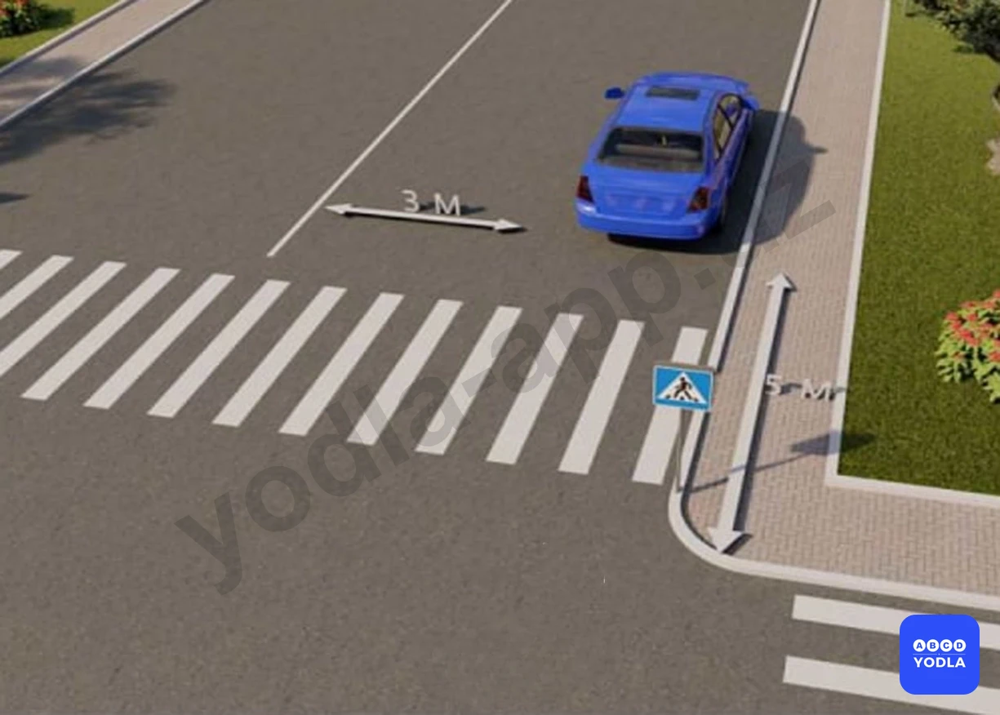
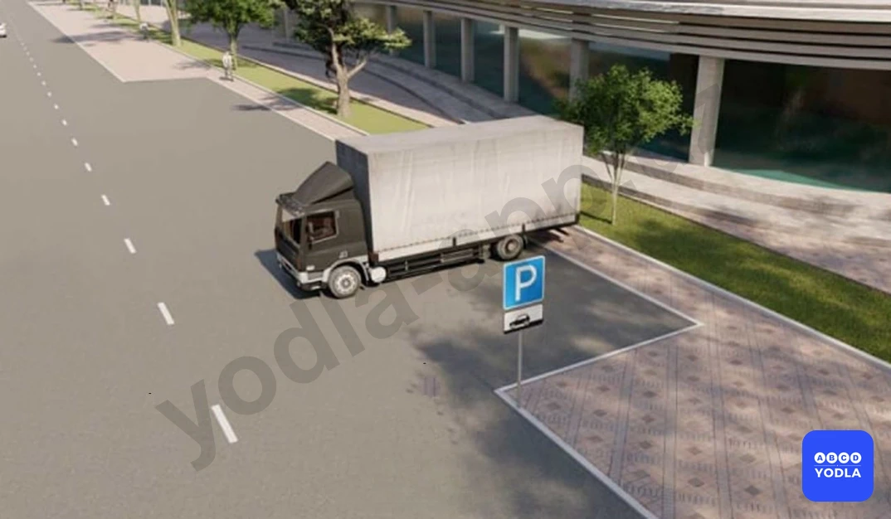
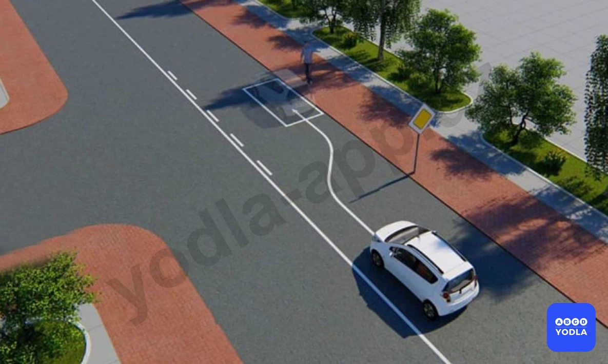
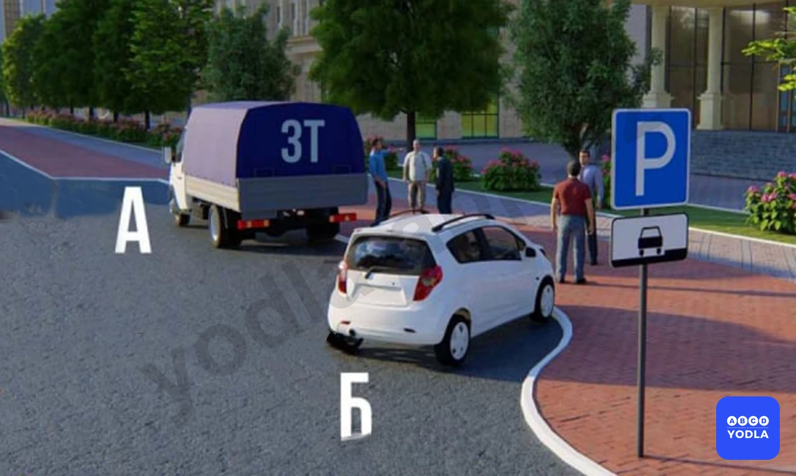
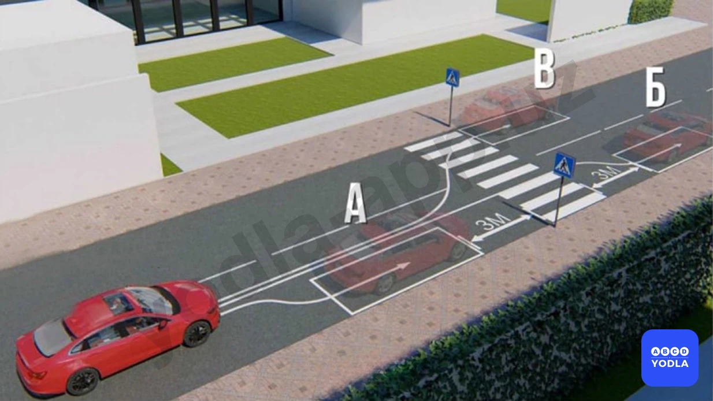
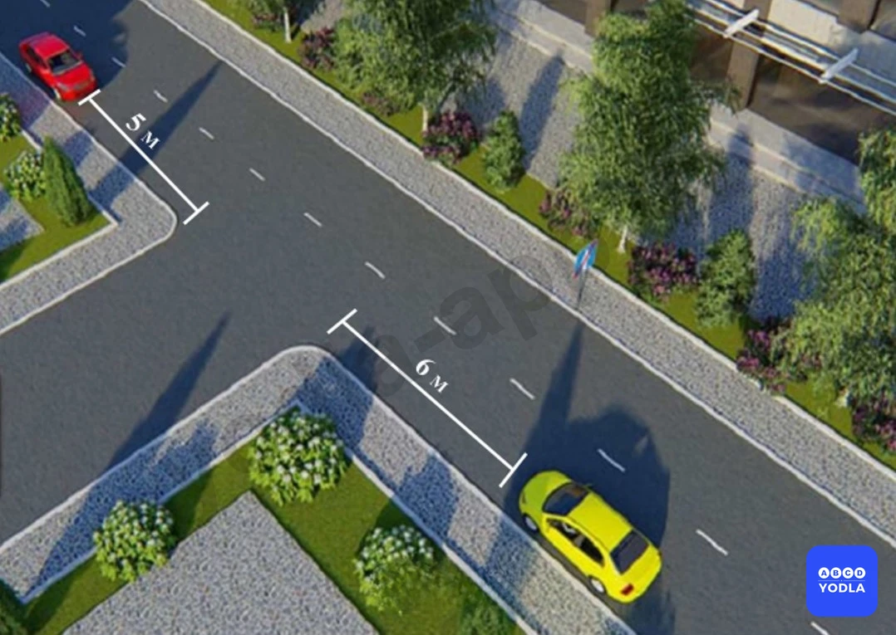

# Bilet 36

Всего вопросов: 20

## Вопрос 1

**Разрешается ли стоянка на краю тротуара, прилегающего непосредственно к проезжей части с полным или частичным заездом на него?**

✅ A. Разрешается только легковым автомобилям и мотоциклам при условии, что это не создаст помех движению пешех
⬜ B. Запрещается только грузовым автомобилям с разрешенной максимальной массой более 3,5 т
⬜ C. Запрещается всем, транспортным средствам

> 💡 Абзацу 2 пункта 15 главы 4 ПДД, гласит: стоянка на краю тротуара, граничащего с проезжей частью, разрешается только легковым автомобилям, мотоциклам, мопедам и велосипедам при условии, что это не будет создавать помех движению пешеходов.

---

## Вопрос 2

**Что запрещается водителю, если он решил открыть двери транспортного средства и выйти из него?**

⬜ A. Запрещается открывать двери стоящего транспортного средства на дорогах с интенсивным движением
⬜ B. Запрещено открывать водительскую дверь на оживлённых дорогах. Выход через пассажирскую дверь.
✅ C. Запрещается открывать двери стоящего транспортного средства, если это угрожает безопасности и создает помехи другим участникам дорожного движения

> 💡 Согласно пункту 94 главы 13 ПДД, запрещается открывать двери транспортного средства, если это создаст помехи или опасность другим участникам дорожного движения (водителям и для пассажирам).

---

## Вопрос 3

**В каких местах из перечисленных запрещается остановка и стоянка транспортных средств?**

⬜ A. В местах выезда из ворот
⬜ B. На трамвайных путях
⬜ C. В непосредственной близости от трамвайных путей, если это создает помехи движению трамваев
✅ D. Во всех указанных местах

> 💡 Пункта 91 главы 13 ПДД, гласит: Остановка запрещается в следующих местах: на трамвайных путях, а также в непосредственной близости от них, если это создает помехи движению трамваев; в местах, где транспортное средство закроет от других водителей сигналы светофора, дорожные знаки или сделает невозможным движение (въезд или выезд) других транспортных средств или создаст помехи для движения пешеходов.

---

## Вопрос 4

**Остановка и стоянка запрещены:**

⬜ A. На железнодорожных переездах
⬜ B. На пешеходных переходах и ближе 10 м
⬜ C. В местах где движение транспорта мешает движению пешеходов
⬜ D. При выезде из дворов
✅ E. Во всех перечисленных случаях

> 💡 Пункта 91 главы 13 ПДД, гласит: Остановка запрещается в следующих местах: в тоннелях, на железнодорожных переездах; на пешеходных переходах и ближе 10 м перед ними; в местах, где транспортное средство закроет от других водителей сигналы светофора, дорожные знаки или сделает невозможным движение (въезд или выезд) других транспортных средств или создаст помехи для движения пешеходов;

---

## Вопрос 5

**Остановка и стоянка запрещена:**

⬜ A. Вблизи опасных поворотов и выпуклых переломов продольного профиля дороги с видимостью дороги менее 100 м в одном направлении
⬜ B. На мостах, эстакадах и путепроводах, имеющие менее 3 полос движения
✅ C. Во всех перечисленных случаях

> 💡 Абзацу 3 пункта 91 главы 13 ПДД, остановка запрещается в следующих местах: на мостах, эстакадах, путепроводах (если для движения в одном направлении имеется менее трех полос) и под ними; в близи выпуклых переломов продольного профиля дороги, при видимости дороги менее 100 м хотя бы в одном направлении.

---

## Вопрос 6

**Разрешено ли водителю ставить автомобиль на стоянку в указанном месте?**

⬜ A. Да
✅ B. Нет

> 💡 Согласно пункту 2 статьи 61 Правил дорожного движения, при наличии в месте выезда на дорогу полосы разгона водитель должен двигаться по ней и перестраиваться на соседнюю полосу, уступая дорогу транспортным средствам, движущимся по этой дороге.

---

## Вопрос 7

**Кто из водителей нарушил правила стоянки?**

⬜ A. Только водитель мотоцикла
✅ B. Только водитель автомобиля стоящий на тротуаре
⬜ C. Никто не нарушил

> 💡 Знак 7.16 раздела 7 приложения № 1 к ПДД, «Влажное покрытие». Указывает, что действие знака распространяется на период времени, когда покрытие проезжей части влажное.

---

## Вопрос 8

**Нарушил ли водитель грузового автомобиля правила парковки?**

✅ A. Нарушил
⬜ B. Нарушил, если разрешенная максимальная масса автомобиля более 3,5 т
⬜ C. Не нарушил

> 💡 Согласно требованиям безопасности дорожного движения, для предотвращения опасных последствий заноса автомобиля при резком повороте рулевого колеса на скользкой дороге, водителю следует предпринять быстро, но плавно повернуть рулевое колесо в сторону заноса, затем опережающим воздействием на рулевое колесо выровнять траекторию движения автомобиля.

---

## Вопрос 9

**Разрешена ли Вам остановка в указанном месте на перекрестке?**

⬜ A. Разрешена
✅ B. Запрещена
⬜ C. Разрешена, если расстояние от Вашего транспортного средства до линии разметки не менее 3 м

> 💡 Согласно пункту 7.4 Приложение № 3 к Правилам дорожного движения, светопропускание передних лобовых, боковых и задних стекол на всех транспортных средствах менее 70%, за исключением стекол люков, установленных на крыше автомобиля, а также тонированных (затемненных) стекол автотранспортных средств, установленных на основании разрешения органов внутренних дел. Примечание. Допускается наличие занавесок на боковых и задних лобовых стеклах автотранспортных средств категории М3 класса III, тонирование (затемнение) задних лобовых стекол автотранспортных средств всех категорий без ограничения светопропускания, а также наличия на задних лобовых стеклах занавесок (жалюзи, шторка) при наличии с обеих сторон наружных зеркал заднего вида.

---

## Вопрос 10

**Разрешено ли Вам остановиться на легковом автомобиле в указанном месте?**

⬜ A. Да
✅ B. Нет

> 💡 Согласно требованиям безопасности дорожного движения, риск сильного бокового ветра возрастает при переходе с закрытого участка дороги на открытый участок.

---

## Вопрос 11

**В каком порядке разрешается парковать транспортные средства на нерасширенных участках проезжей части?**

⬜ A. Под углом
✅ B. Параллельно
⬜ C. В любом случае

> 💡 Знак 3.21 раздела 3 приложения № 1 к ПДД, «Конец зоны запрещения обгона».
Знак 3.23 раздела 3 приложения № 1 к ПДД, «Конец зоны запрещения обгона грузовым автомобилям».
Знак 3.31 раздела 3 приложения № 1 к ПДД, «Конец зоны всех ограничений». Обозначение конца зоны действия одновременно нескольких знаков из следующих: 3.16, 3.20, 3.22, 3.24, 3.26 — 3.30.

---

## Вопрос 12

**Кто нарушил правило стоянки?**

⬜ A. Только «А»
✅ B. Только «Б»
⬜ C. «А» и «Б»

> 💡 Согласно пункту 46 Правил дорожного движения, подача сигнала указателями поворотов или рукой должна производиться заблаговременно до начала выполнения маневра и прекращаться немедленно после его завершения (подача сигнала рукой может быть закончена непосредственно перед выполнением маневра).

---

## Вопрос 13

**Можно ли остановиться в этом месте для посадки или высадки пассажира?**

✅ A. Да
⬜ B. Нет

> 💡 ПДД приложение № 1: 3.28. “Стоянка запрещена”. Запрещается стоянка транспортных средств.

---

## Вопрос 14

**Кто из водителей нарушил правила остановки?**

⬜ A. Оба нарушили
⬜ B. Только водитель синего автомобиля
✅ C. Только водитель красного автомобиля

> 💡 Согласно статьи 6 Правил дорожного движения, приоритет — право на первоочередное движение в намеченном направлении по отношению к другим участникам движения.

---

## Вопрос 15

**Ближе какого расстояния запрещеноостанавливаться от края пересекаемойпроезжей части?**

⬜ A. 40 метр
⬜ B. 45 метр
✅ C. 30 метр

> 💡 Пункта 91 главы 13 ПДД, гласит: на пересечениях проезжих частей и на расстоянии менее 30 метров от края пересекаюшей проезжей части (за исключением противоположной стороны примыкающей дороги, отделенной разделительной линией или разделительной полосой на трехсторонних перекрестках).

---

## Вопрос 16

**На каком расстоянии запрещена остановка транспортных средств в местах разворота, атакже до или после них?**

⬜ A. 40 метр
⬜ B. 45 метр
✅ C. 30 метр
⬜ D. 50 метр

> 💡 Пункта 91 главы 13 ПДД, гласит: Остановка запрещается в следующих местах: В местах разворота транспортных средств а также до или после них 30 метров.

---

## Вопрос 17

**Не ближе какого расстояния разрешается остановка и стоянка перед пешеходным переходом?**

⬜ A. 3 метров
⬜ B. 5 метров
✅ C. 10 метров

> 💡 Пункта 91 главы 13 ПДД, гласит: Остановка запрещается в следующих местах: на пешеходных переходах и менее чем за 10 метров до них.

---

## Вопрос 18

**На каком расстоянии от остановки по ходу движения (не доезжая и после) запрещается остановка и стоянка?**

⬜ A. 25 метр
⬜ B. 30 метр
✅ C. 15 метр
⬜ D. 20 метр

> 💡 Согласно абзацу 13 пункта 91 главы 13 ПДД, остановка  запрещается в следующих местах: на остановочных площадках, местах остановки маршрутных транспортных средств, в том числе обозначенных дорожной разметкой 1.17 и ближе 15 м от них с обеих сторон по ходу движения, при их отсутствии — от указателя места остановки маршрутных транспортных средств (кроме остановки для посадки или высадки пассажиров, если это не создаст помех движению маршрутных транспортных средств).

---

## Вопрос 19

**В каком из указанных мест Вы можете произвести остановку?**

⬜ A. Только ��А»
✅ B. Только «Б»
⬜ C. Только «Б» и «В»
⬜ D. Ни в каком

> 💡 Согласно пункту 118 Правил дорожного движения, запрещается выезжать на железнодорожный переезд в следующих случаях: если за переездом образовался затор, который вынудит водителя остановиться на переезде.

---

## Вопрос 20

**Водитель какой машины не нарушил правил парковки?**

⬜ A. Красный
⬜ B. Жёлтый
✅ C. Оба нарушили
⬜ D. Никто не нарушил

> 💡 Пункта 168 главы 28 ПДД, гласит: Водителям велосипеда и индивидуальные транспортные средства запрещается:
ездить, не держась за руль или держась за руль одной рукой (за исключением случая, когда подается предупредительный сигнал перед маневром);
перевозить пассажиров (за исключением перевозки пассажиров в возрасте до 7 лет на дополнительном сиденье, оборудованном надежным подножками);
перевозить груз, который выступает более чем 0,5 м по длине или ширине за габариты, или груз, мешающий управлению;

---

