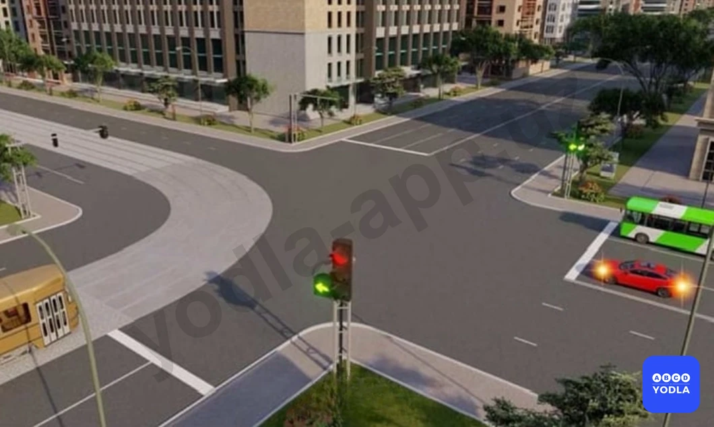
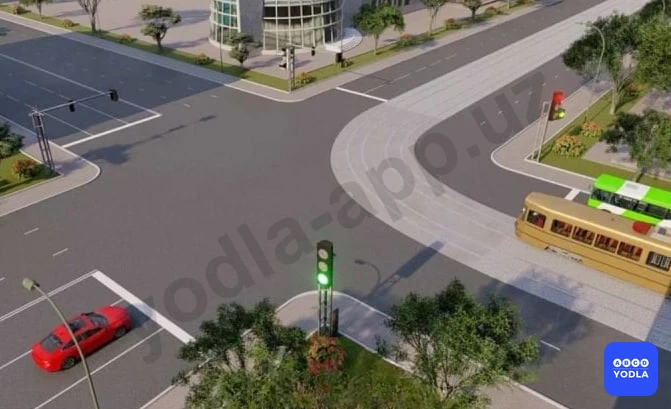
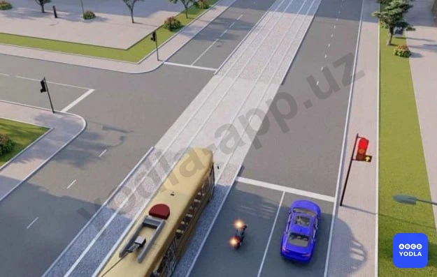
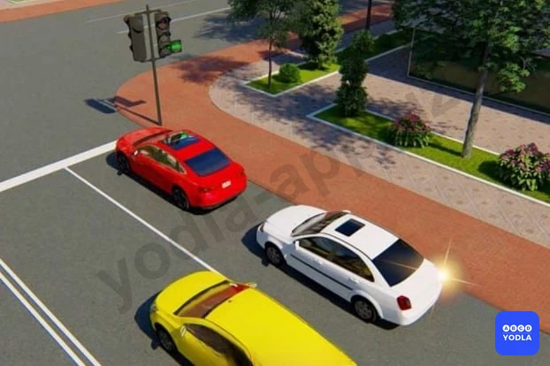
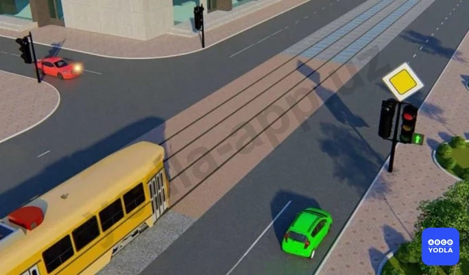
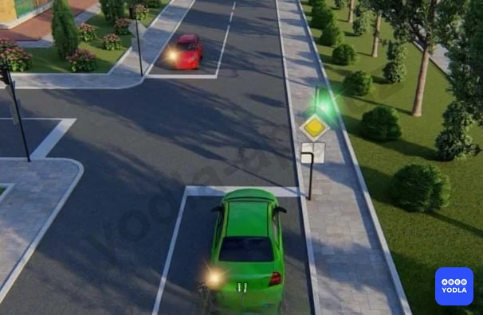
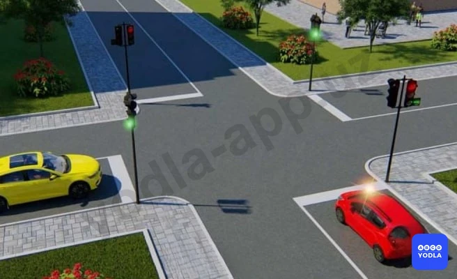
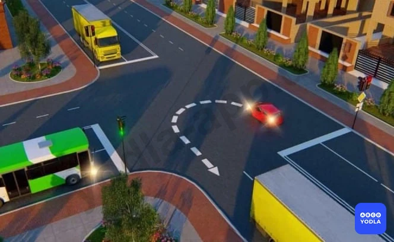
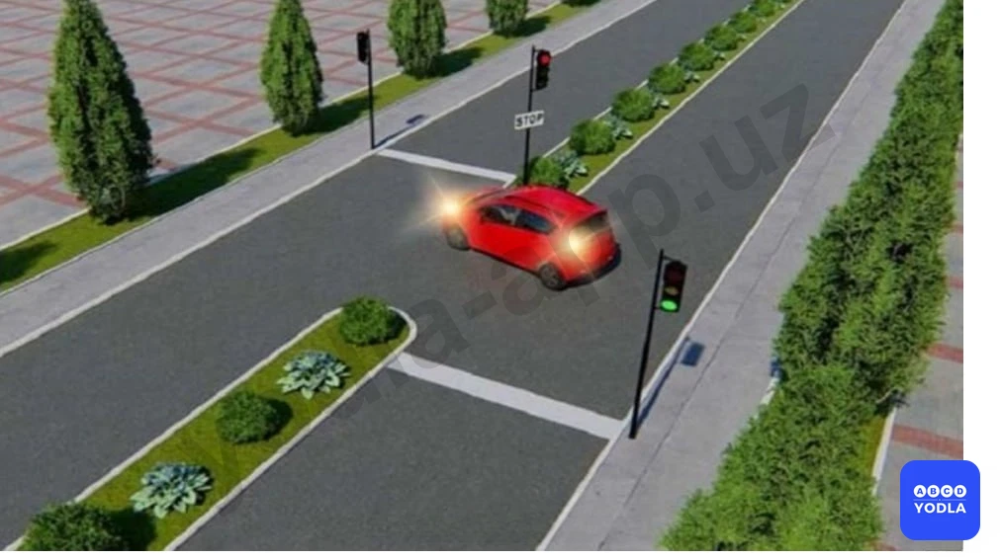

# Bilet 38

Всего вопросов: 20

## Вопрос 1

**На рисунке изображена-...**

✅ A. Нерегулируемый, перекресток неравнозначных дорог
⬜ B. Нерегулируемый, равнозначный перекресток
⬜ C. Регулируемый перекресток

> 💡 При съезде автомобиля правыми колесами на неукрепленную и влажную обочину возникает опасность заноса из-за разницы сцепления правых и левых колес с дорогой. При этом целесообразно, не меняя скорости, т.е. не прибегая к торможению, плавным поворотом рулевого колеса вернуть автомобиль на проезжую часть. Торможение в данной ситуации может вызвать занос автомобиля.

---

## Вопрос 2

**На рисунке изображена:**

⬜ A. Нерегулируемый перекресток неравнозначных дорог
⬜ B. Нерегулируемый, равнозначный перекресток
✅ C. Регулируемый перекресток

> 💡 Пункта 128 главы 21 ПДД, гласит: На уклонах, обозначенных дорожными знаками 1.13 и 1.14, при наличии препятствия, затрудняющего движение в противоположных направлениях, уступить дорогу должен водитель транспортного средства, движущегося на спуск. Приложение № 1: пункт 2.7. “Преимущество перед встречным движением”. Узкий участок дороги, при движении по которому водитель пользуется приоритетом по отношению к встречным транспортным средствам.

---

## Вопрос 3

**Водители каких транспортных средств проедут перекресток первыми?**

✅ A. Водители автомобиля и автобуса
⬜ B. Водитель трамвая

> 💡 Согласно пунктам 100, 101 главы 15 ПДД, при движении в направлении зеленой стрелки, включённой в дополнительной секции одновременно с жёлтым или красным сигналом светофора, водитель транспортного средства обязан уступить дорогу транспортным средствам, движущимся с других направлений. При движении в направлении стрелки, включенной в дополнительной секции одновременно с желтым или красным сигналом светофора, трамвай должен уступить дорогу транспортным средствам, движущимся с других направлений.

---

## Вопрос 4

**Водитель какого транспортного средства должен уступить дорогу?**

⬜ A. Водитель автомобиля
✅ B. Водитель трамвая

> 💡 Согласно пунктам 100, 101 главы 15 ПДД, при движении в направлении зеленой стрелки, включённой в дополнительной секции одновременно с жёлтым или красным сигналом светофора, водитель транспортного средства обязан уступить дорогу транспортным средствам, движущимся с других направлений. При движении в направлении стрелки, включенной в дополнительной секции одновременно с желтым или красным сигналом светофора, трамвай должен уступить дорогу транспортным средствам, движущимся с других направлений.

---

## Вопрос 5

**Транспортные средства проедут перекресток в следующем порядке:**

⬜ A. Трамвай и автобус, легковой автомобиль
⬜ B. Трамвай, легковой автомобиль, автобус
✅ C. Легковой автомобиль, трамвай и автобус

> 💡 Согласно пунктам 100, 101 главы 15 ПДД, при движении в направлении зеленой стрелки, включённой в дополнительной секции одновременно с жёлтым или красным сигналом светофора, водитель транспортного средства обязан уступить дорогу транспортным средствам, движущимся с других направлений. Если сигналы светофора разрешают движение одновременно трамваю и безрельсовым транспортным средствам, то трамвай имеет право на первоочередное движение, независимо от направления его движения. При движении в направлении стрелки, включенной в дополнительной секции одновременно с желтым или красным сигналом светофора, трамвай должен уступить дорогу транспортным средствам, движущимся с других направлений.

---

## Вопрос 6

** Зеленый автомобиль проедет перекресток:**

✅ A. Вторым
⬜ B. Первым

> 💡 Согласно пункту 99 главы № 15 ПДД, при повороте налево или развороте по зелёному сигналу светофора водитель безрельсового транспортного средства обязан уступить дорогу транспортным средствам, движущимся со встречного направления прямо или направо.

---

## Вопрос 7

**Водитель какого транспортного средства должен уступить дорогу?**

⬜ A. Водитель мотоцикла
✅ B. Водитель автомобиля

> 💡 Согласно пункту 100 главы 15 ПДД, при движении в направлении зеленой стрелки, включённой в дополнительной секции одновременно с жёлтым или красным сигналом светофора, водитель транспортного средства обязан уступить дорогу транспортным средствам, движущимся с других направлений.

---

## Вопрос 8

**Каким транспортным средствам разрешается движение в указанных направлениях?**

⬜ A. Водителю автомобиля
⬜ B. Водителям автомобиля и мотоцикла
✅ C. Водителям трамвая и автомобиля

> 💡 Согласно пункту 32 главы 7 ПДД, сигналы светофора, выполненные в виде стрелок красного, желтого и зеленого цветов имеют то же значение, что и круглые соответствующего цвета. Их действия распространяются только на направление, указываемое стрелками.

---

## Вопрос 9

**Водитель какого транспортного средства имеет преимущество в движении?**

⬜ A. Водитель автомобиля
✅ B. Водитель трамвая

> 💡 Согласно пункту 101 главы 15 ПДД, если сигналы светофора или регулировщика разрешают движение одновременно трамваю и безрельсовым транспортным средствам, то трамвай имеет право на первоочередное движение, независимо от направления его движения.

---

## Вопрос 10

**Как должен поступить водитель красного автомобиля в ситуации показанной на рисунке?**

⬜ A. Дождаться разрешающего сигнала светофора и проехать прямо
✅ B. Включить указатель правого поворота и повернуть направо
⬜ C. Включить указатель левого поворота и освободить правый ряд

> 💡 Сигналы светофора, выполненные в виде стрелок красного, желтого и зеленого цветов, имеют то же значение, что и круглые сигналы соответствующего цвета. Их действие распространяется только на направление, указываемое стрелками. Стрелка, разрешающая поворот налево, разрешает и разворот, если это не запрещено соответствующим дорожным знаком. Такое же значение имеет зеленая стрелка в дополнительной секции. Выключенный сигнал дополнительной секции означает запрещение движения в направлении, регулируемом этой секцией.
В данном случае движение красному автомобилю разрешено только направо, соответственно, он должен включить указатель правого поворота и повернуть направо.

---

## Вопрос 11

**Красный автомобиль проедет перекресток:**

⬜ A. Первым
⬜ B. Вторым
⬜ C. Третьим
✅ D. Последним

> 💡 Согласно пунктам 99, 101 главы 15 ПДД, при повороте налево или развороте по зелёному сигналу светофора водитель безрельсового транспортного средства обязан уступить дорогу транспортным средствам, движущимся со встречного направления прямо или направо. Если сигналы светофора разрешают движение одновременно трамваю и безрельсовым транспортным средствам, то трамвай имеет право на первоочередное движение, независимо от направления его движения.

---

## Вопрос 12

**Транспортные средства проедут перекресток в следующем порядке:**

✅ A. Красный автомобиль, трамвай одновременно с зеленым автомобилем
⬜ B. Трамвай, красный, зеленый автомобили
⬜ C. Трамвай одновременно с зеленым автомобилем, красный автомобиль

> 💡 Согласно пункту 100 главы 15 ПДД, при движении в направлении зеленой стрелки, включённой в дополнительной секции одновременно с жёлтым или красным сигналом светофора, водитель транспортного средства обязан уступить дорогу транспортным средствам, движущимся с других направлений.

---

## Вопрос 13

**Красный автомобиль проедет перекресток**

✅ A. Первым
⬜ B. Вторым

> 💡 Согласно пункту 43 главы № 7 ПДД, в случае, если значение сигналов светофора противоречат требованиям дорожных знаков приоритета, водители должны руководствоваться сигналами светофора. Согласно пункту 99 главы № 15 ПДД, при повороте налево или развороте по зелёному сигналу светофора водитель безрельсового транспортного средства обязан уступить дорогу транспортным средствам, движущимся со встречного направления прямо или направо.

---

## Вопрос 14

**Водитель красного автомобиля:**

✅ A. Должен уступить дорогу
⬜ B. Имеет преимущество на первоочередное движение

---

## Вопрос 15

**Первым проедет перекресток:**

⬜ A. Красный автомобиль
⬜ B. Синий автомобиль
✅ C. Зеленый автомобиль

---

## Вопрос 16

**Преимущество в движении имеет:**

⬜ A. Водитель автобуса; выезжающий на перекресток по главной дороге
✅ B. Водитель легкого автомобиля; завершающий на перекрестке разворот
⬜ C. Водитель автобуса; выезжающий на перекресток при разрешающем сигнале светофора

> 💡 Согласно пунктам 102, 103 главы 15 ПДД, водитель, въехавший на перекресток при разрешающем сигнале светофора, должен выехать в намеченном направлении, независимо от сигналов светофора на выходе с него. При включении разрешающего сигнала светофора водитель обязан уступить дорогу транспортным средствам, завершающим движение через перекресток.

---

## Вопрос 17

**При каком сигнале светофора водителю автомобиля можно закончить разворот?**

⬜ A. При красном
✅ B. При зеленом

⬜ C. При любом

> 💡 Согласно пункту 102 главы 15 ПДД, водитель, въехавший на перекресток при разрешающем сигнале светофора, должен выехать в намеченном направлении, независимо от сигналов светофора на выходе с него. Однако, если на перекрестке перед светофорами, расположенными на пути следования водителя, имеются стоп-линии (или дорожный знак 5.33), водитель обязан руководствоваться сигналами каждого светофора.

---

## Вопрос 18

**Кому должен уступить дорогуъ водитель транспортного средства, движущийся на зеленый сигнал дополнительной секции одновременно с красным или желтым сигналом светофора?**

✅ A. Должен уступать дорогу транспортным средствам, движущимся с других направлений.
⬜ B. Транспортным средствам, приближающимся справа.
⬜ C. Транспортным средствам, движущиеся во встречном направлении на право или прямо.

> 💡 Согласно статьи 6 Правил дорожного движения, дорожно-транспортное происшествие — событие, возникшее в процессе движения по дороге транспортного средства, при котором наступила смерть или причинен вред здоровью граждан, повреждены транспортные средства, сооружения, грузы либо причинен иной материальный ущерб.

---

## Вопрос 19

**В этой ситуации вы:**

⬜ A. Вы можете продолжать движение, не останавливаясь
✅ B. Вы должны остановиться перед знаком и дождаться разрешающего сигнала светофора

> 💡 Согласно пункту 105 Правил дорожного движения, на перекрестке равнозначных дорог водитель безрельсового транспортного средства обязан уступить дорогу транспортным средствам, приближающимся справа. Этим же правилом должны руководствоваться между собой водители трамваев. На таких перекрестках трамвай имеет право на приоритет движения перед безрельсовыми транспортными средствами, независимо от направления его движения.
Согласно пункту 107 Правил дорожного движения, при повороте налево или развороте водитель безрельсового транспортного средства обязан уступить дорогу транспортным средствам, движущимся по равнозначной дороге со встречного направления прямо или направо, а также производящим обгон в разрешенных случаях. Этим же правилом должны руководствоваться между собой водители трамваев.
На этом перекрёстке первым движется трамвай, вторым — автобус, идущий прямо, а третьим — красный автомобиль, поворачивающий налево.

---

## Вопрос 20

**Вторым проедет перекресток:**

⬜ A. Красный автомобил
⬜ B. Зеленый автомобиль
✅ C. Зеленый автомобиль одновременно с трамваем

> 💡 Знак 3.24 раздела 3 приложения № 1 к ПДД, «Ограничение максимальной скорости». Запрещается движение со скоростью (км/ч), превышающей указанную на знаке.
Знак 7.2.1 раздела 7 приложения № 1 к ПДД, «Зона действия». Указывает протяженность опасного участка дороги, обозначенного предупреждающими знаками, или зону действия запрещающих и информационно-указательных знаков.

---

