# Bilet 39

Всего вопросов: 20

## Вопрос 1

**Вы намерены повернуть налево. Ваши действия?**

✅ A. Проедете перекресток первым
⬜ B. Дождитесь, пока Т-образный светофор даст разрешение и уступите дорогу трамваю
⬜ C. Уступите дорогу трамваю

> 💡 ПДД приложение № 1: 1.21. Дети.
Участок дороги вблизи детского учреждения (школы, места отдыха детей и т. п.), на проезжей части которого возможно появление детей.

---

## Вопрос 2

**Красный автомобиль кому должен уступить дорогу?**

⬜ A. Грузовику
⬜ B. Трактору
✅ C. Никому

> 💡 "На основании абзаца 1 пункта 56 главы 9 ПДД, а также пункта 1.1 Приложения 2 к ПДД и абзаца 44: 56. Перед поворотом направо, налево или разворотом водитель обязан заблаговременно занять соответствующее крайнее положение на проезжей части, предназначенной для движения в данном направлении, кроме случаев, когда совершается поворот при въезде на перекресток с круговым движением.
1.1 — разделяет транспортные потоки противоположных направлений и обозначает границы полос движения в опасных местах на дорогах и границы полос для велосипедистов; обозначает границы проезжей части, на которые въезд запрещен; обозначает границы стояночных мест транспортных средств и край проезжей части дорог, не отнесенных по условиям движения к автомагистралям; Линии 1.1 и 1.3 пересекать запрещается, кроме случая, когда линия 1.1 применена для обозначения края проезжей части."

---

## Вопрос 3

**Какой водитель первым продолжит движение?**

⬜ A. Водитель жёлтой автомобиля 
✅ B. Водитель синего автомобиля

> 💡 На основании пункта 7.22 абзаца 25 Приложения 3 к ПДД: Категория L — мототранспортные средства.

---

## Вопрос 4

**В каком порядке проедут перекресток транспортные средства?**

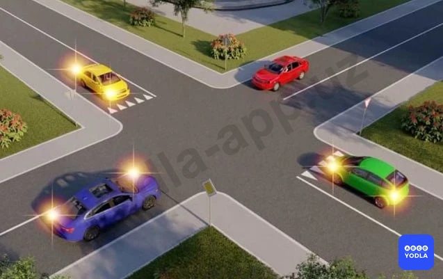

✅ A. Красный; синий одновременно с желтым; зеленый
⬜ B. Желтый одновременно с зеленым; красный; синий
⬜ C. Красный; зеленый; синий одновременно с желтым

> 💡 Согласно пункту 104 главы 16 ПДД, на перекрестках неравнозначных дорог водитель транспортного средства, движущегося по второстепенной дороге, должен уступить дорогу транспортным средствам, приближающимся по главной дороге, независимо от направления их дальнейшего движения. Согласно пункту 107 главы 16 ПДД, при повороте налево или развороте водитель безрельсового транспортного средства обязан уступить дорогу транспортным средствам, движущимся по равнозначной дороге со встречного направления прямо или направо.

---

## Вопрос 5

**Вторым проедет перекресток:**

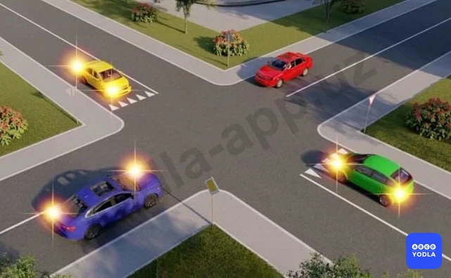

⬜ A. Зеленый автомобиль одновременно с желтым
⬜ B. Красный автомобиль
✅ C. Синий автомобиль одновременно с желтым

> 💡 Согласно пункту 104 главы 16 ПДД, на перекрестках неравнозначных дорог водитель транспортного средства, движущегося по второстепенной дороге, должен уступить дорогу транспортным средствам, приближающимся по главной дороге, независимо от направления их дальнейшего движения. Согласно пункту 107 главы 16 ПДД, при повороте налево или развороте водитель безрельсового транспортного средства обязан уступить дорогу транспортным средствам, движущимся по равнозначной дороге со встречного направления прямо или направо.

---

## Вопрос 6

**Вторым проедет перекресток:**

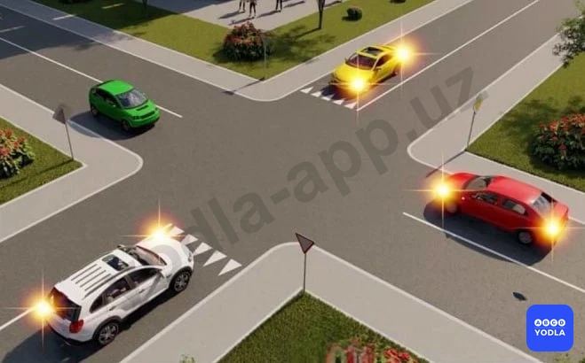

⬜ A. Белый автомобиль одновременно с желтым
✅ B. Красный автомобиль
⬜ C. Зеленый автомобиль

> 💡 Согласно пункту 104 главы 16 ПДД, на перекрестках неравнозначных дорог водитель транспортного средства, движущегося по второстепенной дороге, должен уступить дорогу транспортным средствам, приближающимся по главной дороге, независимо от направления их дальнейшего движения. Согласно пункту 107 главы 16 ПДД, при повороте налево или развороте водитель безрельсового транспортного средства обязан уступить дорогу транспортным средствам, движущимся по равнозначной дороге со встречного направления прямо или направо.

---

## Вопрос 7

**Последним проедет перекресток:**

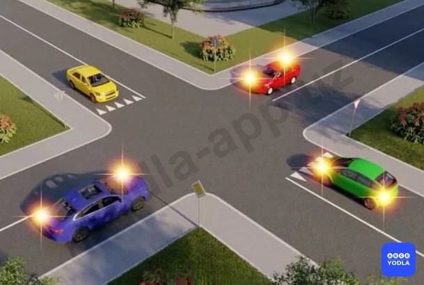

⬜ A. Синий автомобиль
⬜ B. Желтый автомобиль
✅ C. Зеленый автомобиль
⬜ D. Красный автомобиль

> 💡 Согласно пункту 104 главы 16 ПДД, на перекрестках неравнозначных дорог водитель транспортного средства, движущегося по второстепенной дороге, должен уступить дорогу транспортным средствам, приближающимся по главной дороге, независимо от направления их дальнейшего движения. Согласно пункту 107 главы 16 ПДД, при повороте налево или развороте водитель безрельсового транспортного средства обязан уступить дорогу транспортным средствам, движущимся по равнозначной дороге со встречного направления прямо или направо.

---

## Вопрос 8

**Первым проедет перекресток:**

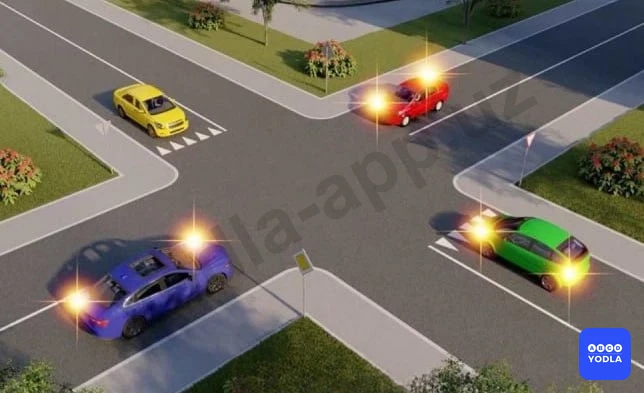

⬜ A. Зеленый автомобиль
⬜ B. Синий автомобиль
✅ C. Красный автомобиль
⬜ D. Желтый автомобиль

> 💡 Согласно пункту 104 главы 16 ПДД, на перекрестках неравнозначных дорог водитель транспортного средства, движущегося по второстепенной дороге, должен уступить дорогу транспортным средствам, приближающимся по главной дороге, независимо от направления их дальнейшего движения. Согласно пункту 107 главы 16 ПДД, при повороте налево или развороте водитель безрельсового транспортного средства обязан уступить дорогу транспортным средствам, движущимся по равнозначной дороге со встречного направления прямо или направо.

---

## Вопрос 9

**Третьим проедет перекресток:**

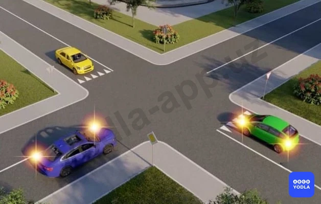

⬜ A. Синий автомобиль
⬜ B. Желтый автомобиль
✅ C. Зеленый автомобиль

> 💡 Согласно пункту 104 главы 16 ПДД, на перекрестках неравнозначных дорог водитель транспортного средства, движущегося по второстепенной дороге, должен уступить дорогу транспортным средствам, приближающимся по главной дороге, независимо от направления их дальнейшего движения. Согласно пункту 107 главы 16 ПДД, при повороте налево или развороте водитель безрельсового транспортного средства обязан уступить дорогу транспортным средствам, движущимся по равнозначной дороге со встречного направления прямо или направо.

---

## Вопрос 10

**Транспортные средства проедут перекресток в следующем порядке:**

⬜ A. Легковой автомобиль, автобус, велосипед
⬜ B. Автобус, велосипед, легковой автомобиль
⬜ C. Автобус, легковой автомобиль, велосипед
✅ D. Велосипед, автобус, легковой автомобиль

---

## Вопрос 11

**Транспортные средства проедут перекресток в следующем порядке:**

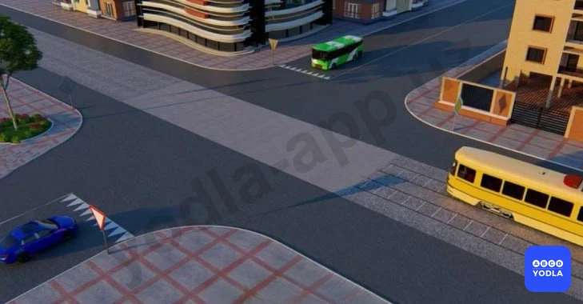

✅ A. Трамвай, автомобиль и автобус одновременно
⬜ B. Т��амвай, автобус, автомобиль
⬜ C. Автобус, трамвай, автомобиль

> 💡 Согласно пункту 104 главы 16 ПДД, на перекрестках неравнозначных дорог водитель транспортного средства, движущегося по второстепенной дороге, должен уступить дорогу транспортным средствам, приближающимся по главной дороге, независимо от направления их дальнейшего движения. На таких перекрестках трамвай имеет приоритет перед безрельсовыми транспортными средствами, движущимися в попутном или встречном направлении по равнозначной дороге, независимо от направления его движения.

---

## Вопрос 12

**Укажите очередность проезда перекрестка:**

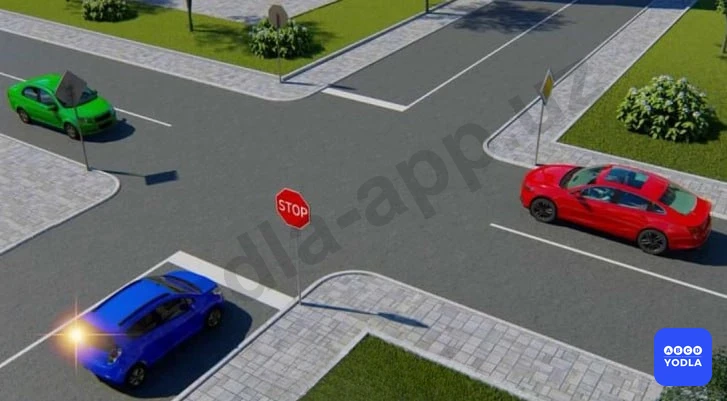

⬜ A. Синий, красный одновременно с зеленым
⬜ B. Красный, синий, зеленый
✅ C. Красный одновременно с зеленым, синий

> 💡 Согласно пункту 104 главы 16 ПДД, на перекрестках неравнозначных дорог водитель транспортного средства, движущегося по второстепенной дороге, должен уступить дорогу транспортным средствам, приближающимся по главной дороге, независимо от направления их дальнейшего движения.

---

## Вопрос 13

**Транспортные средства проедут перекресток в следующем порядке:**

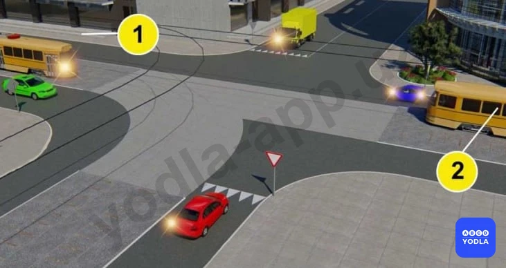

⬜ A. Зеленый автомобиль одновременно с трамваем 2, трамвай 1, синий, желтый, красный автомобили
✅ B. Трамваи 1 и 2 одновременно с желтым автомобилем, зеленый, синий, красный автомобили

> 💡 Согласно пунктам 104, 107 главы 16 ПДД, на перекрестках неравнозначных дорог водитель транспортного средства, движущегося по второстепенной дороге, должен уступить дорогу транспортным средствам, приближающимся по главной дороге, независимо от направления их дальнейшего движения. На таких перекрестках трамвай имеет приоритет перед безрельсовыми транспортными средствами, движущимися в попутном или встречном направлении по равнозначной дороге, независимо от направления его движения. При повороте налево или развороте водитель безрельсового транспортного средства обязан уступить дорогу транспортным средствам, движущимся по равнозначной дороге со встречного направления прямо или направо, а также производящим обгон в разрешенных случаях. Этим же правилом должны руководствоваться между собой водители трамваев.

---

## Вопрос 14

**Последним проедет перекресток:**

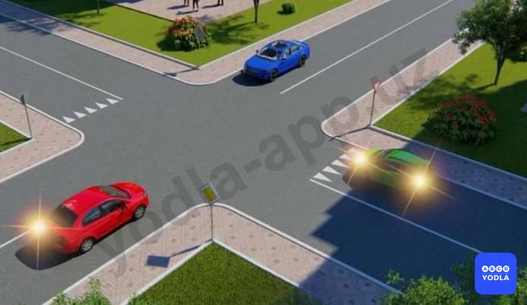

⬜ A. Красный автомобиль
⬜ B. Синий автомобиль
✅ C. Зеленый автомобиль

> 💡 Согласно пункту 104 главы 16 ПДД, на перекрестках неравнозначных дорог водитель транспортного средства, движущегося по второстепенной дороге, должен уступить дорогу транспортным средствам, приближающимся по главной дороге, независимо от направления их дальнейшего движения. Согласно пункту 107 главы 16 ПДД, при повороте налево или развороте водитель безрельсового транспортного средства обязан уступить дорогу транспортным средствам, движущимся по равнозначной дороге со встречного направления прямо или направо.

---

## Вопрос 15

**Автомобили проедут перекресток в следующем порядке:**

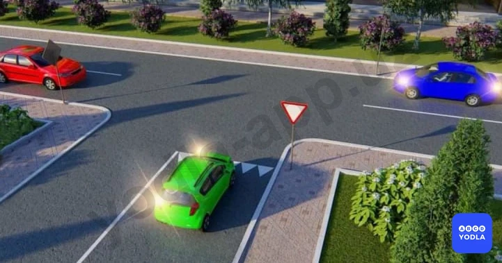

⬜ A. Синий, зеленый, красный
✅ B. Красный, синий, зеленый
⬜ C. Зеленый; красный; синий

> 💡 Согласно пункту 104 главы 16 ПДД, на перекрестках неравнозначных дорог водитель транспортного средства, движущегося по второстепенной дороге, должен уступить дорогу транспортным средствам, приближающимся по главной дороге, независимо от направления их дальнейшего движения. Согласно пункту 107 главы 16 ПДД, при повороте налево или развороте водитель безрельсового транспортного средства обязан уступить дорогу транспортным средствам, движущимся по равнозначной дороге со встречного направления прямо или направо.

---

## Вопрос 16

**Синий автомобиль проедет перекресток:**

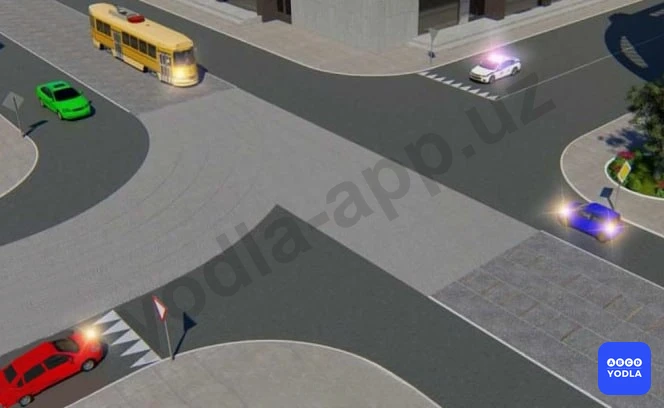

⬜ A. Первым
⬜ B. Вторым
⬜ C. Третьим
✅ D. Четвертым
⬜ E. Последним

> 💡 Согласно пункту 26 главы 6 ПДД, при приближении транспортных средств с включенными проблесковым маячком синего цвета или синего и красного цветов и специальным звуковым сигналом водители обязаны уступить им дорогу для обеспечения их беспрепятственного проезда. Согласно пункту 104 главы 16 ПДД, на перекрестках неравнозначных дорог водитель транспортного средства, движущегося по второстепенной дороге, должен уступить дорогу транспортным средствам, приближающимся по главной дороге, независимо от направления их дальнейшего движения. На таких перекрестках трамвай имеет приоритет перед безрельсовыми транспортными средствами, движущимися в попутном или встречном направлении по равнозначной дороге, независимо от направления его движения. Согласно пункту 107 главы 16 ПДД, при повороте налево или развороте водитель безрельсового транспортного средства обязан уступить дорогу транспортным средствам, движущимся по равнозначной дороге со встречного направления прямо или направо.

---

## Вопрос 17

**Пересекает перекресток вторым?**

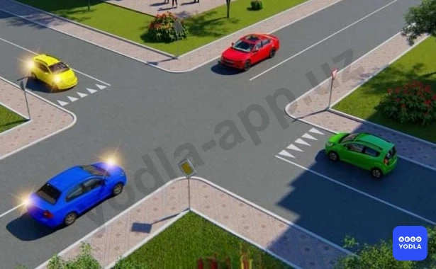

⬜ A. Зеленый автомобиль
⬜ B. Красный автомобиль
✅ C. Синий автомобиль одновременно с желтым

> 💡 Согласно пункту 104 главы 16 ПДД, на перекрестках неравнозначных дорог водитель транспортного средства, движущегося по второстепенной дороге, должен уступить дорогу транспортным средствам, приближающимся по главной дороге, независимо от направления их дальнейшего движения. Согласно пункту 107 главы 16 ПДД, при повороте налево или развороте водитель безрельсового транспортного средства обязан уступить дорогу транспортным средствам, движущимся по равнозначной дороге со встречного направления прямо или направо.

---

## Вопрос 18

**Вы намерены повернуть налево. Кому следует уступить дорогу?**

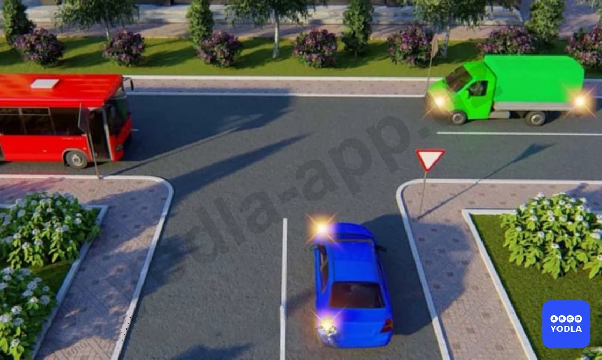

⬜ A. Только автобусу
⬜ B. Только грузовому автомобилю
✅ C. Обоим транспортным средствам

> 💡 Согласно пункту 52 Правил дорожного движения, при отсутствии или неисправности аварийной световой сигнализации на буксируемом механическом транспортном средстве на его задней части должен быть закреплён знак аварийной остановки.

---

## Вопрос 19

**Последним проедет перекресток:**

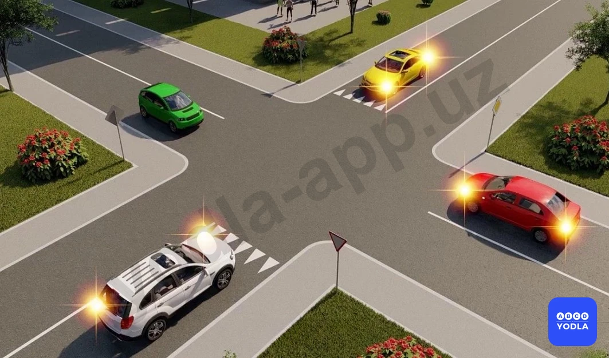

⬜ A. Красный автомобиль
✅ B. Белый одновременно с жёлтым
⬜ C. Желтый автомобиль

> 💡 Знак 1.34 раздела 1 приложения № 1 к ПДД, «Внимание, заградительное устройство». Знак устанавливается в местах, оборудованным заградительным устройством, и предупреждает водителей транспортных средств о наличии заградительного устройства.

---

## Вопрос 20

**Вы движетесь прямо от перекрестка - ваше движение:**

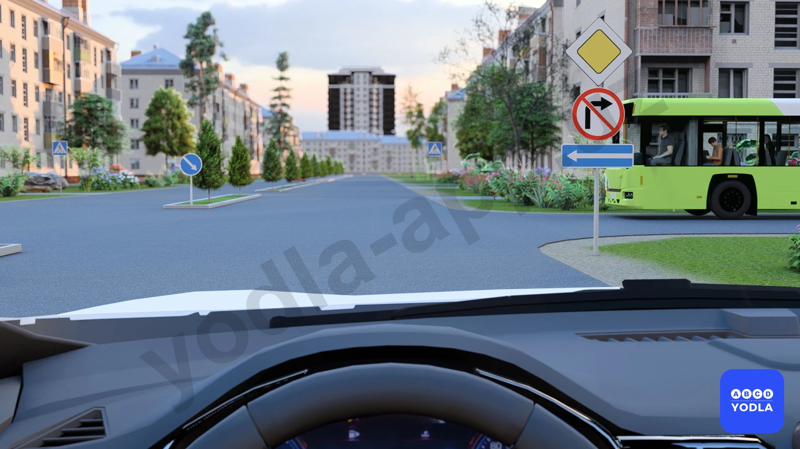

✅ A. Я проеду первым
⬜ B. Я уступаю дорогу автобусу

> 💡 Согласно главе 16, пункту 104 Правил дорожного движения:

104. На перекрёстке неравнозначных дорог водитель, движущийся по второстепенной дороге, обязан уступить дорогу транспортным средствам, приближающимся по главной дороге, независимо от направления их дальнейшего движения. На таких перекрёстках трамвай имеет преимущество независимо от направления движения только на равнозначной дороге.

В данной ситуации вы движетесь по главной дороге, а автобус выезжает со второстепенной дороги. Поэтому вы проезжаете перекрёсток первым.

---

