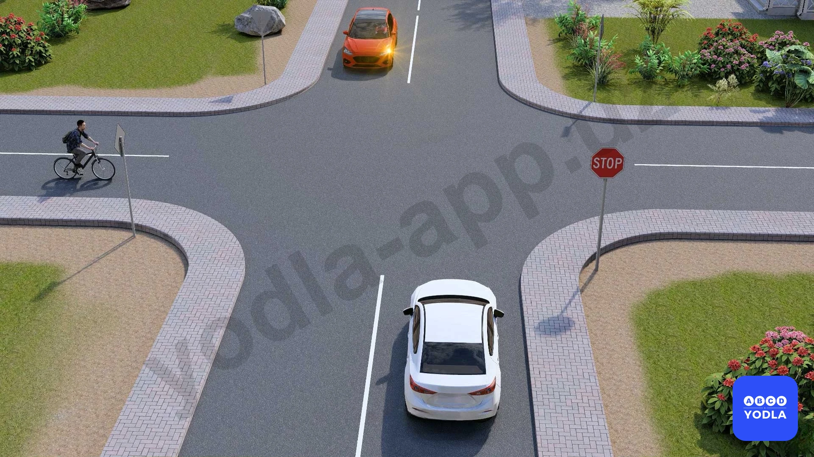
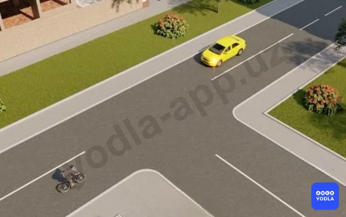
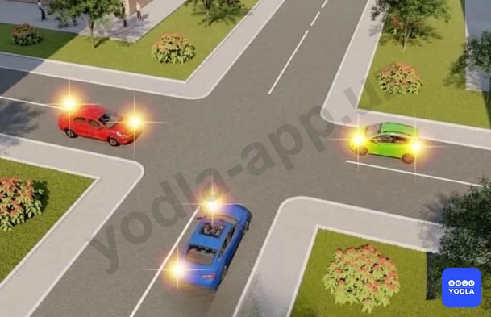
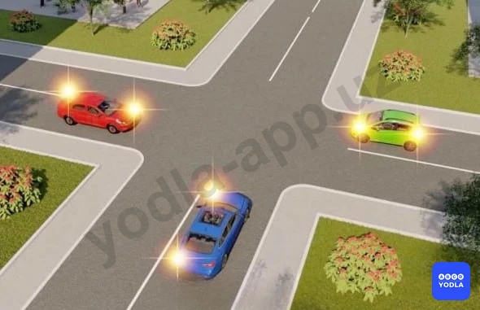
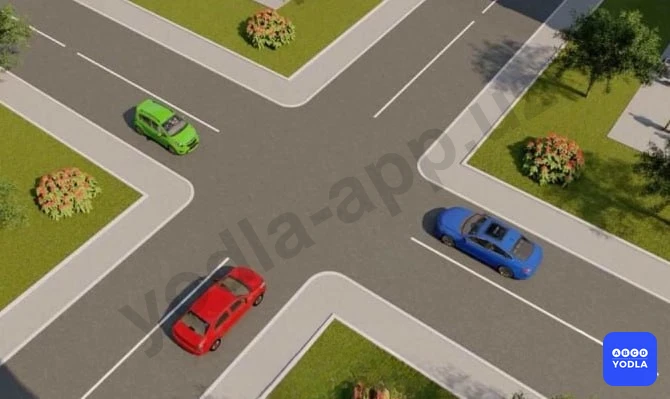
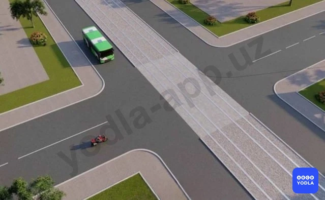
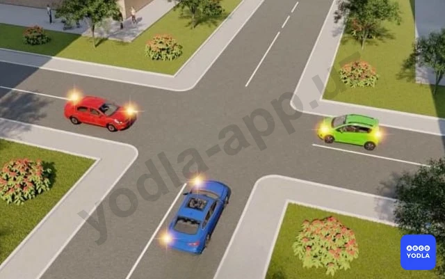
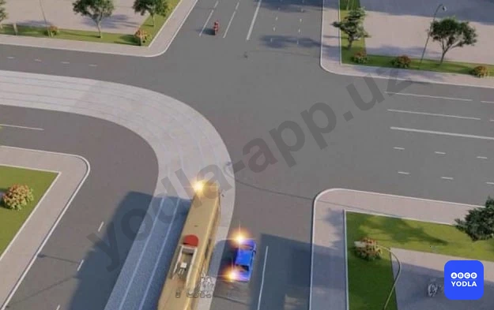
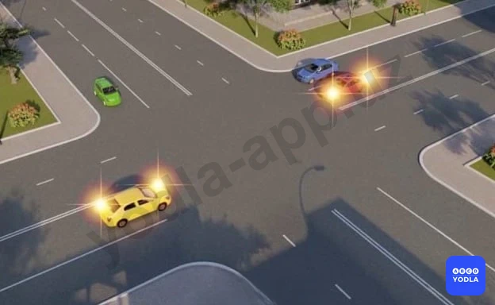
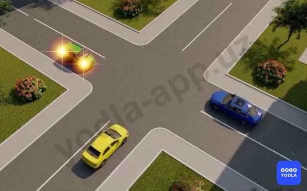

# Bilet 40

Всего вопросов: 20

## Вопрос 1

**Укажите порядок проезда перекрёстка:**

⬜ A. Велосипед, красный автомобиль, белый автомобиль
⬜ B. Красный автомобиль, белый автомобиль, велосипед
✅ C. Велосипед, белый автомобиль, красный автомобиль

> 💡 На основании абзаца 1 пункта 88 главы 13 ПДД: 88. Остановка и стоянка транспортных средств разрешается как можно правее на обочине, а при ее отсутствии — у края проезжей части, и в случаях, указанных в пункте 89 Правил — на тротуаре.

---

## Вопрос 2

**Первым проедет перекресток:**

⬜ A. Красный автомобиль
⬜ B. Синий автомобиль
⬜ C. Желтый автомобиль
✅ D. Зеленый автомобиль

> 💡 Согласно пункту 105 главы 16 ПДД на перекрестке равнозначных дорог водитель безрельсового транспортного средства обязан уступить дорогу транспортным средствам, приближающимся справа.

---

## Вопрос 3

**Транспортные средства проедут перекресток в следующем порядке:**

✅ A. Трамвай, автобус и легковой автомобиль
⬜ B. Автобус, легковой автомобиль, трамвай
⬜ C. Легковой автомобиль, трамвай, автобус

> 💡 Согласно пункту 105 главы 16 ПДД, на перекрестке равнозначных дорог трамвай имеет право на приоритет движения перед безрельсовыми транспортными средствами, независимо от направления его движения. Согласно пункту 107 главы 16 ПДД, при повороте налево или развороте водитель безрельсового транспортного средства обязан уступить дорогу транспортным средствам, движущимся по равнозначной дороге со встречного направления прямо или направо, а также производящим обгон в разрешенных случаях.

---

## Вопрос 4

**Вторым проедет перекресток:**

⬜ A. Красный автомобиль
✅ B. Синий автомобиль
⬜ C. Зеленый автомобиль

> 💡 Пункта 105 главы 16 ПДД, гласит: На перекрестке равнозначных дорог водитель безрельсового транспортного средства обязан уступить дорогу транспортным средствам, приближающимся справа.

---

## Вопрос 5

**B каком ответе правильно указана очередность проезда перекрестка?**

⬜ A. Автобус, автомобиль, велосипед
⬜ B. Автомобиль, автобус, велосипед
✅ C. Велосипед, автобус, автомобиль

> 💡 YHQ 16-bobi 104, 106-bandlariga asosan, teng ahamiyatga ega bo‘lmagan yo‘llar kesishgan chorrahada, keyingi harakat yo‘nalishidan qat'i nazar, asosiy yo‘ldan kelayotgan transport vositasiga ikkinchi darajali yo‘ldan kelayotgan transport vositasining haydovchisi yo‘l berishi kerak. YHQ 16-bobi 107 bandiga asosan, chapga burilishda yoki qayrilib olishda relssiz transport vositasining haydovchisi teng ahamiyatli yo‘ldan qarama-qarshi yo‘nalishdan to‘g‘riga yoki o‘ngga harakatlanayotgan, shuningdek, ruxsat etilgan hollarda quvib o‘tayotgan transport vositalariga yo‘l berishi shart. Bu qoidaga tramvay haydovchilari ham o‘zaro amal qilishlari kerak.

---

## Вопрос 6

**Водитель какого транспортного средства должен уступить дорогу?**

⬜ A. Водитель велосипеда
✅ B. Водитель автомобиля

> 💡 При торможении автомобиля под действием силы инерции происходит перераспределение массы по осям. Нагрузка на переднюю ось увеличивается, а на заднюю уменьшается.
Перераспределение массы тем значительнее, чем выше интенсивность торможения. При уменьшении нагрузки на заднюю ось уменьшается сила, прижимающая колеса к дороге; следовательно, появляется вероятность проскальзывания колес (торможение «юзом») и заноса автомобиля. Увеличение нагрузки на переднюю ось приводит к увеличению силы, прижимающей передние колеса к дороге, следовательно, вероятность их проскальзывания снижается.

---

## Вопрос 7

**Водитель какого транспортного средства имеет право на первоочередное движение?**

⬜ A. Водитель дорожной машины
✅ B. Водитель легкового автомобиля

> 💡 Согласно пункту 105 главы 16 ПДД, на перекрестке равнозначных дорог водитель безрельсового транспортного средства обязан уступить дорогу транспортным средствам, приближающимся справа. Согласно пункту 28 главы 6 ПДД, Проблесковый маячок жёлтого или оранжевого цвета не дает приоритета в движении и служит исключительно для предупреждения других участников движения об опасности.

---

## Вопрос 8

**Автомобили проедут перекресток в следующем порядке:**

⬜ A. Красный, зеленый, синий
⬜ B. Синий, красный, зеленый
✅ C. Все три одновременно

> 💡 Согласно пункту 105 главы 16 ПДД на перекрестке равнозначных дорог водитель безрельсового транспортного средства обязан уступить дорогу транспортным средствам, приближающимся справа.

---

## Вопрос 9

**Вторым проедет перекресток:**

⬜ A. Красный автомобиль
✅ B. Синий автомобиль
⬜ C. Зеленый автомобиль

> 💡 Согласно пункту 105 главы 16 ПДД на перекрестке равнозначных дорог водитель безрельсового транспортного средства обязан уступить дорогу транспортным средствам, приближающимся справа.

---

## Вопрос 10

**Последним проедет перекресток:**

⬜ A. Зеленый автомобиль
⬜ B. Синий автомобиль
✅ C. Красный автомобиль

> 💡 Согласно пункту 105 главы 16 ПДД на перекрестке равнозначных дорог водитель безрельсового транспортного средства обязан уступить дорогу транспортным средствам, приближающимся справа.

---

## Вопрос 11

**Пересечет перекресток первым:**

⬜ A. Красный автомобиль
⬜ B. Зеленый автомобиль
✅ C. Синий автомобиль

> 💡 Согласно пункту 105 главы 16 ПДД на перекрестке равнозначных дорог водитель безрельсового транспортного средства обязан уступить дорогу транспортным средствам, приближающимся справа.

---

## Вопрос 12

**Водитель какого транспортного средства должен уступить дорогу?**

✅ A. Водитель автобуса
⬜ B. Водитель мотоцикла

> 💡 Согласно пункту 105 главы 16 ПДД на перекрестке равнозначных дорог водитель безрельсового транспортного средства обязан уступить дорогу транспортным средствам, приближающимся справа.

---

## Вопрос 13

**Вторым проедет перекресток:**

✅ A. Синий автомобиль
⬜ B. Зеленый автомобиль
⬜ C. Красный автомобиль

> 💡 Согласно пункту 105 главы 16 ПДД на перекрестке равнозначных дорог водитель безрельсового транспортного средства обязан уступить дорогу транспортным средствам, приближающимся справа.

---

## Вопрос 14

**В каком ответе правильно указана последовательность действий водителя автомобиля?**

⬜ A. Пропустил мотоцикл и развернулся на перекрестке
⬜ B. Пропустил трамвай и развернулся на перекрестке
✅ C. Пропустил трамвай, мотоцикл и развернулся на перекрестке

> 💡 Согласно пункту 105 главы 16 ПДД, на перекрестке равнозначных дорог тр��мвай имеет право на приоритет движения перед безрельсовыми транспортными средствами, независимо от направления его движения. Согласно пункту 107 главы 16 ПДД, повороте налево или развороте водитель безрельсового транспортного средства обязан уступить дорогу транспортным средствам, движущимся по равнозначной дороге со встречного направления прямо или направо.

---

## Вопрос 15

**Автомобили проедут перекресток в следующем порядке:**

✅ A. Желтый въедет на перекресток и остановится, чтобы пропустить синий; зеленый; синий одновременно с красным; желтый
⬜ B. Синий одновременно с красным; зеленый; желтый
⬜ C. Зеленый; синий одновременно с красным; желтый

> 💡 Согласно пункту 105 главы 16 ПДД, на перекрестке равнозначных дорог водитель безрельсового транспортного средства обязан уступить дорогу транспортным средствам, приближающимся справа. Согласно пункту 107 главы 16 ПДД, повороте налево или развороте водитель безрельсового транспортного средства обязан уступить дорогу транспортным средствам, движущимся по равнозначной дороге со встречного направления прямо или направо.

---

## Вопрос 16

**Последний, кто пересек перекресток:**

✅ A. желтый
⬜ B. Cиний
⬜ C. Зеленым

> 💡 Согласно пункту 105 главы 16 ПДД на перекрестке равнозначных дорог водитель безрельсового транспортного средства обязан уступить дорогу транспортным средствам, приближающимся справа.

---

## Вопрос 17

**Автомобили проедут перекресток в следующем порядке:**

⬜ A. Желтый выедет на перекресток и остановится, чтобы пропустить зеленый; синий одновременно с красным
⬜ B. Синий одновременно с красным; зеленый, желтый
✅ C. Зеленый, синий одновременно с красным, желтый

> 💡 Согласно пункту 105 главы 16 ПДД на перекрестке равнозначных дорог водитель безрельсового транспортного средства обязан уступить дорогу транспортным средствам, приближающимся справа.

---

## Вопрос 18

**Автомобили проедут перекресток в следующем порядке:**

⬜ A. Зеленый; синий; красный
✅ B. Синий; красный; зеленый
⬜ C. Синий одновременно с зеленым; красный

> 💡 Согласно пункту 105 главы 16 ПДД на перекрестке равнозначных дорог водитель безрельсового транспортного средства обязан уступить дорогу транспортным средствам, приближающимся справа.

---

## Вопрос 19

**Автомобили проедут перекресток в следующем порядке:**

✅ A. Красный выедет на перекресток и остановится, чтобы пропустить синий, и одновременно с красным проедет зеленый; синий; красный закончит разворот
⬜ B. Красный, синий, зеленый
⬜ C. Синий, зеленый, красный

> 💡 Согласно пункту 105 главы 16 ПДД, на перекрестке равнозначных дорог водитель безрельсового транспортного средства обязан уступить дорогу транспортным средствам, приближающимся справа. Согласно пункту 107 главы 16 ПДД, повороте налево или развороте водитель безрельсового транспортного средства обязан уступить дорогу транспортным средствам, движущимся по равнозначной дороге со встречного направления прямо или направо.

---

## Вопрос 20

**Третьим проедет перекресток:**

⬜ A. Зеленый автомобиль
✅ B. Синий автомобиль
⬜ C. Красный автомобиль

> 💡 Согласно пункту 105 главы 16 ПДД на перекрестке равнозначных дорог водитель безрельсового транспортного средства обязан уступить дорогу транспортным средствам, приближающимся справа.

---

