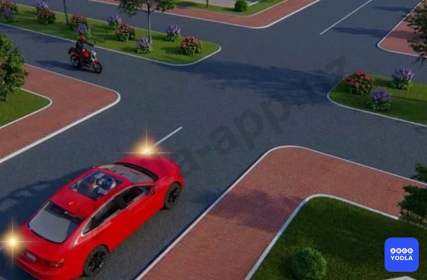
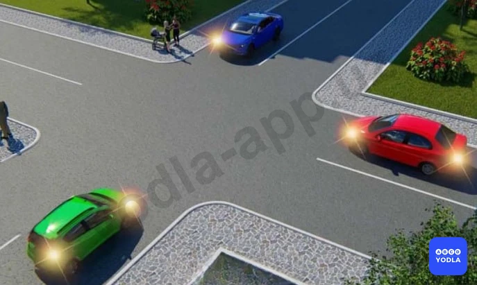
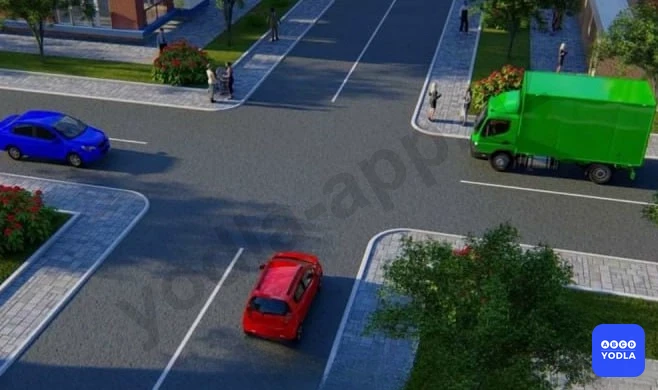
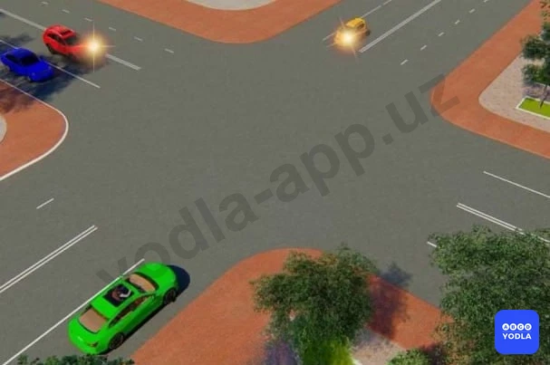
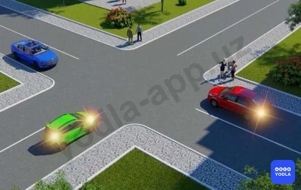
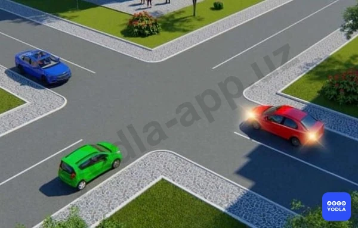

# Bilet 41

Всего вопросов: 20

## Вопрос 1

**Водитель какого транспортного средства имеет право на первоочередное движение?**

⬜ A. Водитель автомобиля
✅ B. Водитель мотоцикла

> 💡 Согласно пункту 105 главы 16 ПДД на перекрестке равнозначных дорог водитель безрельсового транспортного средства обязан уступить дорогу транспортным средствам, приближающимся справа.

---

## Вопрос 2

**Транспортные средства проедут перекресток следующем порядке:**

⬜ A. Трамвай, желтый, зеленый автомобили
✅ B. Трамвай и зеленый автомобиль, желтый автомобиль
⬜ C. Зеленый, желтый автомобили, трамвай

> 💡 Согласно пункту 105 главы 16 ПДД, на перекрестке равнозначных дорог водитель безрельсового транспортного средства обязан уступить дорогу транспортным средствам, приближающимся справа. На таких перекрестках трамвай имеет право на первоочередное движение перед безрельсовыми транспортными средствами независимо от направления его движения.

---

## Вопрос 3

**Кто из водителей имеет право напервоочередное движение?**

⬜ A. Водитель мотоцикла
✅ B. Водитель автомобиля

> 💡 Согласно пункту 105 главы 16 ПДД на перекрестке равнозначных дорог водитель безрельсового транспортного средства обязан уступить дорогу транспортным средствам, приближающимся справа.

---

## Вопрос 4

**Водитель какого транспортного средства должен уступить дорогу?**

⬜ A. Водитель трамвая
⬜ B. Водитель грузового автомобиля
✅ C. Водители обоих автомобилей

> 💡 Согласно пункту 105 главы 16 ПДД, на перекрестке равнозначных дорог водитель безрельсового транспортного средства обязан уступить дорогу транспортным средствам, приближающимся справа. Этим же правилом должны руководствоваться между собой водители трамваев. На таких перекрестках трамвай имеет право на приоритет движения перед безрельсовыми транспортными средствами, независимо от направления его движения.

---

## Вопрос 5

**Водитель какого транспортного средства должен уступить дорогу?**

✅ A. Водитель синего автомобиля
⬜ B. Водитель красного автомобиля

> 💡 Согласно пункту 105 главы 16 ПДД на перекрестке равнозначных дорог водитель безрельсового транспортного средства обязан уступить дорогу транспортным средствам, приближающимся справа.

---

## Вопрос 6

**Водитель какого транспортного средства должен уступить дорогу?**

✅ A. Водитель автомобиля
⬜ B. Водитель трамвая

> 💡 Согласно пункту 105 главы 16 ПДД, на перекрестке равнозначных дорог водитель безрельсового транспортного средства обязан уступить дорогу транспортным средствам, приближающимся справа. На таких перекрестках трамвай имеет право на приоритет движения перед безрельсовыми транспортными средствами, независимо от направления его движения.

---

## Вопрос 7

**Синий автомобиль проедет перекресток:**

⬜ A. Первым одновременно с красным
⬜ B. Вторым одновременно с красным
✅ C. Третьим одновременно с красным

> 💡 Согласно пунктам 105 и 26 глав 16 и 6 ПДД, на перекрестке равнозначных дорог водитель безрельсового транспортного средства обязан уступить дорогу транспортным средствам, приближающимся справа. При приближении транспортных средств с включенными проблесковым маячком синего цвета или синего и красного цветов и специальным звуковым сигналом, а также сопровождаемых ими транспортных средств с включенным ближним светом фар водители обязаны уступить им дорогу для обеспечения их беспрепятственного проезда.

---

## Вопрос 8

**Транспортные средства проедут перекресток следующем порядке:**

✅ A. Все одновременно
⬜ B. Синий, красный, зеленый
⬜ C. Синий одновременно с зеленым, красный
⬜ D. Красный с зеленым, синий

> 💡 Согласно пункту 105 главы 16 ПДД на перекрестке равнозначных дорог водитель безрельсового транспортного средства обязан уступить дорогу транспортным средствам, приближающимся справа.

---

## Вопрос 9

**Последним проедет перекресток:**

✅ A. Синий автомобиль
⬜ B. Зеленый автомобиль
⬜ C. Красный автомобиль

> 💡 Согласно пункту 105 главы 16 ПДД на перекрестке равнозначных дорог водитель безрельсового транспортного средства обязан уступить дорогу транспортным средствам, приближающимся справа.

---

## Вопрос 10

**Автомобили проедут перекресток в следующем порядке:**

⬜ A. Желтый въедет на перекресток и останавливается, чтобы пропустить зеленый, зеленый, синий одновременно красный, желтый
⬜ B. Синий одновременно с красным, зеленый, желтый
✅ C. Зеленый, синий одновременно с красным, желтый

> 💡 Согласно пункту 105 главы 16 ПДД на перекрестке равнозначных дорог водитель безрельсового транспортного средства обязан уступить дорогу транспортным средствам, приближающимся справа.

---

## Вопрос 11

**Последним проедет перекресток:**

✅ A. Красный автомобиль
⬜ B. Синий автомобиль
⬜ C. Зеленый автомобиль

> 💡 Согласно пункту 105 главы 16 ПДД, на перекрестке равнозначных дорог водитель безрельсового транспортного средства обязан уступить дорогу транспортным средствам, приближающимся справа. Согласно пункту 107 главы 16 ПДД, повороте налево или развороте водитель безрельсового транспортного средства обязан уступить дорогу транспортным средствам, движущимся по равнозначной дороге со встречного направления прямо или направо.

---

## Вопрос 12

**Вторым проедет перекресток:**

⬜ A. Зеленый автомобиль
✅ B. Красный автомобиль одновременно с синим
⬜ C. Желтый автомобиль

---

## Вопрос 13

**Вторым проедет перекресток:**

✅ A. Синий автомобиль
⬜ B. Зеленый автомобиль
⬜ C. Красный автомобиль

> 💡 Согласно пункту 105 главы 16 ПДД на перекрестке равнозначных дорог водитель безрельсового транспортного средства обязан уступить дорогу транспортным средствам, приближающимся справа.

---

## Вопрос 14

**Автомобили проедут перекресток в следующем порядке:**

⬜ A. Красный, синий, зеленый
✅ B. Зеленый, синий, красный
⬜ C. Зеленый одновременно с красным, синий

> 💡 Согласно пункту 105 главы 16 ПДД на перекрестке равнозначных дорог водитель безрельсового транспортного средства обязан уступить дорогу транспортным средствам, приближающимся справа.

---

## Вопрос 15

**Первым проедет перекресток:**

✅ A. Зеленый
⬜ B. Красный
⬜ C. Синий

> 💡 Согласно пункту 105 главы 16 ПДД на перекрестке равнозначных дорог водитель безрельсового транспортного средства обязан уступить дорогу транспортным средствам, приближающимся справа.

---

## Вопрос 16

**Красный автомобиль проедет перекресток:**

✅ A. Вторым, одновременно е синим
⬜ B. Вторым, после желтого
⬜ C. Третьим, после зеленого и желтого

> 💡 Согласно пункту 105 главы 16 ПДД на перекрестке равнозначных дорог водитель безрельсового транспортного средства обязан уступить дорогу транспортным средствам, приближающимся справа.

---

## Вопрос 17

**Автомобили проедут перекресток в следующем порядке:**

✅ A. Красный въедет на перекресток и остановится чтобы пропустить синий; зеленый; синий и красный заканчивают поворот
⬜ B. Зеленый, синий, красный
⬜ C. Красный, синий, зеленый

> 💡 Согласно пункту 105 главы 16 ПДД, на перекрестке равнозначных дорог водитель безрельсового транспортного средства обязан уступить дорогу транспортным средствам, приближающимся справа. Согласно пункту 107 главы 16 ПДД, повороте налево или развороте водитель безрельсового транспортного средства обязан уступить дорогу транспортным средствам, движущимся по равнозначной дороге со встречного направления прямо или направо.

---

## Вопрос 18

**В каком ответе правильно указана очередность проезда?**

✅ A. Мотоцикл, автобус, грузовой автомобиль
⬜ B. Автобус, мотоцикл, грузовой автомобиль
⬜ C. Автобус, грузовой автомобиль, мотоцикл

> 💡 Согласно пункту 105 главы 16 ПДД на перекрестке равнозначных дорог водитель безрельсового транспортного средства обязан уступить дорогу транспортным средствам, приближающимся справа.

---

## Вопрос 19

**Транспортные средства проедут перекресток следующем порядке:**

⬜ A. Легковой автомобиль, автобус, трамвай
⬜ B. Трамвай, автобус, легковой автомобиль
✅ C. Трамвай, легковой автомобиль, автобус

> 💡 Согласно пункту 105 главы 16 ПДД на перекрестке равнозначных дорог водитель безрельсового транспортного средства обязан уступить дорогу транспортным средствам, приближающимся справа. На таких перекрестках трамвай имеет право на приоритет движения перед безрельсовыми транспортными средствами, независимо от направления его движения.

---

## Вопрос 20

**Кто первым пересекает перекресток?**

✅ A. Зеленый автомобиль
⬜ B. Красный автомобиль
⬜ C. Синий автомобиль

> 💡 Согласно пункту 104 главы 16 ПДД, на перекрестках неравнозначных дорог водитель транспортного средства, движущегося по второстепенной дороге, должен уступить дорогу транспортным средствам, приближающимся по главной дороге, независимо от направления их дальнейшего движения. Согласно пункту 107 главы 16 ПДД, при повороте налево или развороте водитель безрельсового транспортного средства обязан уступить дорогу транспортным средствам, движущимся по равнозначной дороге со встречного направления прямо или направо.

---

