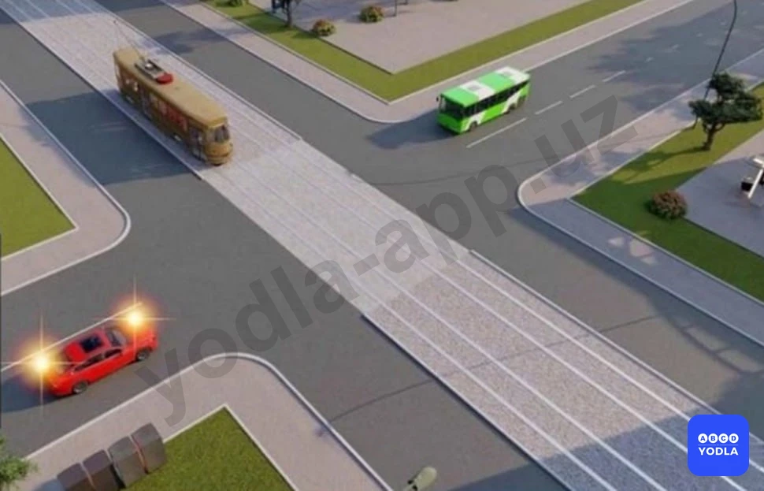
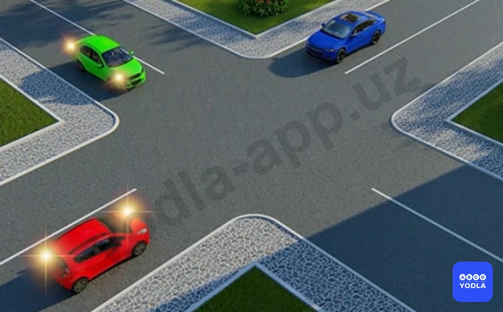
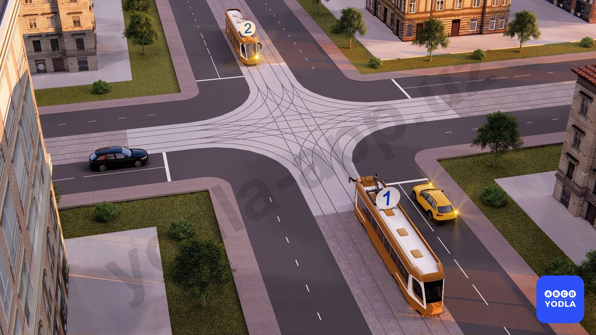
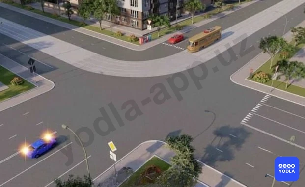
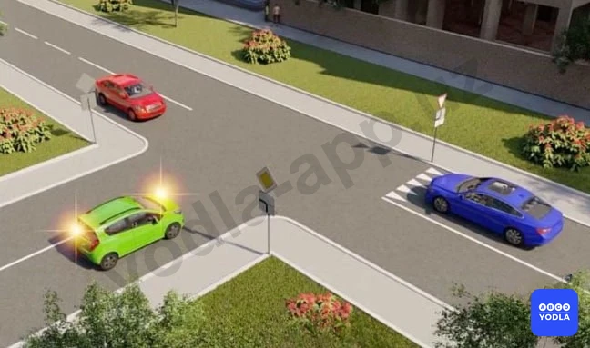
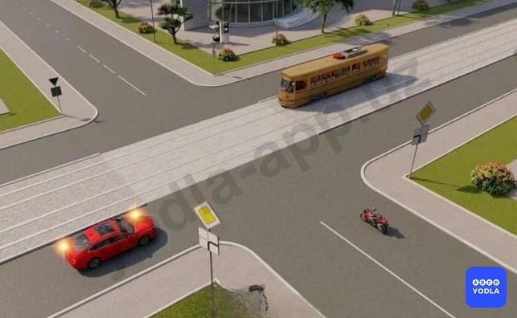
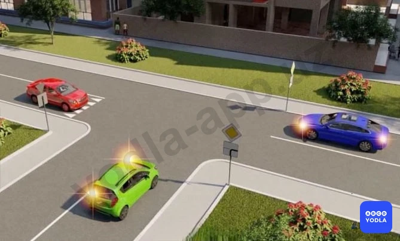

# Bilet 42

Всего вопросов: 20

## Вопрос 1

**Водитель какого транспортного средства должен уступить дорогу?**

⬜ A. Водитель мотоцикла
✅ B. Водитель грузового автомобиля

> 💡 Согласно пункту 105 главы 16 ПДД на перекрестке равнозначных дорог водитель безрельсового транспортного средства обязан уступить дорогу транспортным средствам, приближающимся справа.

---

## Вопрос 2

**Вы намерены проехать перекресток в прямом направлении. Ваши действия?**

⬜ A. Уступите дорогу легковому автомобилю, поскольку онпервым въехал на перекресток
✅ B. Убедитесь, что легковой автомобиль уступает дорогу, и проедете перекресток первым

> 💡 Дорожная разметка 1.21 раздела 1 приложения № 2 к ПДД, (надпись «STOP») — предупреждает о приближении к разметке 1.12, когда она применяется в сочетании со знаком 2.5.

---

## Вопрос 3

**Какой автомобиль должен уступить дорогу на перекрестке?**

⬜ A. Синий автомобиль
✅ B. Красный автомобиль

> 💡 Согласно знаку 1.34 раздела 1 приложения № 1 к ПДД, «Внимание, управляемое препятствие», знак устанавливается перед железнодорожным переездом, оборудованным заградительным устройством, и предупреждает водителей транспортных средств о наличии заградительного устройства.

---

## Вопрос 4

**Красный автомобиль проедет перекрёсток?**

✅ A. Последним
⬜ B. Вторым.
⬜ C. Первым

---

## Вопрос 5

**Последним проедет перекресток:**

⬜ A. Синий автомобиль
✅ B. Красный автомобиль
⬜ C. Зеленый автомобиль

> 💡 Согласно пункту 105 Правил дорожного движения, на перекрестке равнозначных дорог водитель безрельсового транспортного средства обязан уступить дорогу транспортным средствам, приближающимся справа. Этим же правилом должны руководствоваться между собой водители трамваев. На таких перекрестках трамвай имеет право на приоритет движения перед безрельсовыми транспортными средствами, независимо от направления его движения.
Согласно пункту 107 Правил дорожного движения, при повороте налево или развороте водитель безрельсового транспортного средства обязан уступить дорогу транспортным средствам, движущимся по равнозначной дороге со встречного направления прямо или направо, а также производящим обгон в разрешенных случаях. Этим же правилом должны руководствоваться между собой водители трамваев.
На этом перекрестке , красный автомобиль начинает движение и останавливается на перекрестке, чтобы пропустить синий. Зеленый автомобиль пересекает перекресток первым, синий вторым, а красный автомобиль последним, завершая движение.

---

## Вопрос 6

**Последним проедет перекресток:**

⬜ A. Велосипед
⬜ B. Автобус
✅ C. Автомобиль

> 💡 Приложение к ПДД №1: Знак 3.27 не действует на легковые немаршрутные такси при посадке высадке пассажиров (погрузке выгрузке грузов). Автомобили и мотоциклы с коляской, оборудованные опознавательным знаком “Инвалид” в соответствии с пунктом 176 настоящих Правил, управляемые инвалидами, могут отступать от требований знаков 3.2, 3.3 и 3.28. При наличии дополнительного знака 7.18 разрешается остановка в зоне действия знака 3.27. Знаки 3.28-3.30 не действуют на такси с включенным таксометром.

---

## Вопрос 7

**Первым проедет перекресток?**

✅ A. Зеленый автомобиль
⬜ B. Красный автомобиль
⬜ C. Синий автомобиль

> 💡 Пункта 48 главы 8 ПДД, гласит: Звуковые сигналы могут применяться в следующих случаях: вне населенных пунктов при обгоне, для предупреждения других водителей; в необходимых случаях для предотвращения дорожно-транспортного происшествия. Использование звуковых сигналов запрещено, за исключением случаев, указанных выше.

---

## Вопрос 8

**Первым проедет перекресток:**

⬜ A. Красный автомобиль
⬜ B. Синий автомобиль
✅ C. Зеленый автомобиль

> 💡 Согласно пункту 100 Правил дорожного движения, при движении в направлении зеленой стрелки, включённой в дополнительной секции одновременно с жёлтым или красным сигналом светофора, водитель транспортного средства обязан уступить дорогу транспортным средствам, движущимся с других направлений.
Согласно пункту 101 Правил дорожного движения, если сигналы светофора или регулировщика разрешают движение одновременно трамваю и безрельсовым транспортным средствам, то трамвай имеет право на первоочередное движение, независимо от направления его движения. 
При движении в направлении стрелки, включенной в дополнительной секции одновременно с желтым или красным сигналом светофора, трамвай должен уступить дорогу транспортным средствам, движущимся с других направлений.

---

## Вопрос 9

**Какой водитель автомобиля должен уступить дорогу?**

✅ A. Красный автомобиль
⬜ B. Синий автомобиль

> 💡 "На основании пункта 38 главы 7 ПДД: 38. Сигналы регулировщика имеют следующие значения:
Руки вытянуты в стороны или опущены:
Правая рука вытянута вперед:
со стороны левого бока — разрешено движение трамваю налево, безрельсовым транспортным средствам — во всех направлениях."

---

## Вопрос 10

**Укажите порядок движения:**

✅ A. Трамвай 1 одновременно с жёлтым автомобилем, трамвай 2 одновременно с чёрным автомобилем
⬜ B. Трамвай 1 одновременно с жёлтым автомобилем, затем чёрный автомобиль, затем трамвай 2
⬜ C. Трамвай 1, трамвай 2, жёлтый автомобиль, чёрный автомобиль

> 💡 На основании пункта 57 главы 9 ПДД: 57. Поворот должен осуществляться таким образом, чтобы при выезде с пересечения проезжих частей транспортное средство не оказалось на стороне встречного движения.
При повороте направо транспортное средство должно двигаться по возможности ближе к правому краю проезжей части.

---

## Вопрос 11

**Транспортные средства проедут перекресток в следующем порядке:**

✅ A. Мотоцикл, трамвай и автомобиль
⬜ B. Трамвай, мотоцикл, автомобиль
⬜ C. Трамвай и автомобиль, мотоцикл

> 💡 Согласно пункту 104 главы 16 ПДД, на перекрестках неравнозначных дорог водитель транспортного средства, движущегося по второстепенной дороге, должен уступить дорогу транспортным средствам, приближающимся по главной дороге, независимо от направления их дальнейшего движения. На таких перекрестках трамвай имеет приоритет перед безрельсовыми транспортными средствами, движущимися в попутном или встречном направлении по равнозначной дороге, независимо от направления его движения.

---

## Вопрос 12

**Транспортные средства проедут перекресток в следующем порядке:**

⬜ A. Красный автомобиль, трамвай, зеленый, синий автомобиль
⬜ B. Трамвай, красный, синий, зеленый автомобили
✅ C. Трамвай, красный, зеленый, синий автомобили

> 💡 Согласно пунктам 106, 105 и 104 главы 16 ПДД, если главная дорога на перекрестке меняет направление, водители, движущиеся по главной дороге, должны руководствоваться между собой правилами проезда перекрестков равнозначных дорог. На перекрестке равнозначных дорог водитель безрельсового транспортного средства обязан уступить дорогу транспортным средствам, приближающимся справа. На перекрестках неравнозначных дорог трамвай имеет приоритет перед безрельсовыми транспортными средствами, движущимися в попутном или встречном направлении по равнозначной дороге, независимо от направления его движения.

---

## Вопрос 13

**Вторым проедет перекресток:**

✅ A. Трамвай
⬜ B. Красный автомобиль
⬜ C. Синий автомобиль

> 💡 Согласно пунктам106, 105 и 104 главы 16 ПДД, если главная дорога на перекрестке меняет направление, водители, движущиеся по главной дороге, должны руководствоваться между собой правилами проезда перекрестков равнозначных дорог. На перекрестке равнозначных дорог водитель безрельсового транспортного средства обязан уступить дорогу транспортным средствам, приближающимся справа. На перекрестках неравнозначных дорог трамвай имеет приоритет перед безрельсовыми транспортными средствами, движущимися в попутном или встречном направлении по равнозначной дороге, независимо от направления его движения.

---

## Вопрос 14

**Третьим проедет перекресток:**

⬜ A. Зеленый автомобиль
⬜ B. Красный автомобиль
✅ C. Синий автомобиль
⬜ D. Желтый автомобиль

> 💡 Согласно пунктам 106, 105 и 104 главы 16 ПДД, если главная дорога на перекрестке меняет направление, водители, движущиеся по главной дороге, должны руководствоваться между собой правилами проезда перекрестков равнозначных дорог. На перекрестке равнозначных дорог водитель безрельсового транспортного средства обязан уступить дорогу транспортным средствам, приближающимся справа. На перекрестках неравнозначных дорог водитель транспортного средства, движущегося по второстепенной дороге, должен уступить дорогу транспортным средствам, приближающимся по главной дороге, независимо от направления их дальнейшего движения.

---

## Вопрос 15

**Автомобили проедут перекресток в следующем порядке:**

⬜ A. Синий, зеленый, красный
⬜ B. Синий одновременно с зеленым, красный
✅ C. Зеленый, красный одновременно с синим

> 💡 Согласно пунктам106, 105 и 104 главы 16 ПДД, если главная дорога на перекрестке меняет направление, водители, движущиеся по главной дороге, должны руководствоваться между собой правилами проезда перекрестков равнозначных дорог. На перекрестке равнозначных дорог водитель безрельсового транспортного средства обязан уступить дорогу транспортным средствам, приближающимся справа. На перекрестках неравнозначных дорог водитель транспортного средства, движущегося по второстепенной дороге, должен уступить дорогу транспортным средствам, приближающимся по главной дороге, независимо от направления их дальнейшего движения.

---

## Вопрос 16

**Транспортные средства проедут перекресток следующем порядке:**

✅ A. Мотоцикл, автомобиль, трамвай
⬜ B. Трамвай, автомобиль, мотоцикл
⬜ C. Трамвай, мотоцикл, автомобиль

> 💡 Согласно пунктам 106, 105 и 104 главы 16 ПДД, если главная дорога на перекрестке меняет направление, водители, движущиеся по главной дороге, должны руководствоваться между собой правилами проезда перекрестков равнозначных дорог. На перекрестке равнозначных дорог водитель безрельсового транспортного средства обязан уступить дорогу транспортным средствам, приближающимся справа. На перекрестках неравнозначных дорог трамвай имеет приоритет перед безрельсовыми транспортными средствами, движущимися в попутном или встречном направлении по равнозначной дороге, независимо от направления его движения.

---

## Вопрос 17

**Какой автомобиль последним проедет перекресток?**

⬜ A. Синий
✅ B. Красный
⬜ C. Зеленый

> 💡 Согласно пунктам 106, 105 и 104 главы 16 ПДД, если главная дорога на перекрестке меняет направление, водители, движущиеся по главной дороге, должны руководствоваться между собой правилами проезда перекрестков равнозначных дорог. На перекрестке равнозначных дорог водитель безрельсового транспортного средства обязан уступить дорогу транспортным средствам, приближающимся справа. На перекрестках неравнозначных дорог водитель транспортного средства, движущегося по второстепенной дороге, должен уступить дорогу транспортным средствам, приближающимся по главной дороге, независимо от направления их дальнейшего движения.

---

## Вопрос 18

**Транспортные средства проедут перекресток в следующем порядке:**

✅ A. Синий, зеленый, красный автомобили
⬜ B. Синий, пропустит красный, а затем закончит поворот; зеленый автомобиль
⬜ C. Красный, синий, зеленый автомобили
⬜ D. Зеленый, красный, синий автомобили

> 💡 Согласно пунктам106, 105 и 104 главы 16 ПДД, если главная дорога на перекрестке меняет направление, водители, движущиеся по главной дороге, должны руководствоваться между собой правилами проезда перекрестков равнозначных дорог. На перекрестке равнозначных дорог водитель безрельсового транспортного средства обязан уступить дорогу транспортным средствам, приближающимся справа. На перекрестках неравнозначных дорог водитель транспортного средства, движущегося по второстепенной дороге, должен уступить дорогу транспортным средствам, приближающимся по главной дороге, независимо от направления их дальнейшего движения.

---

## Вопрос 19

**Вторым проедет перекресток:**

⬜ A. Красный автомобиль
✅ B. Зеленый автомобиль
⬜ C. Синий автомобиль

> 💡 Согласно пунктам 106, 105 и 104 главы 16 ПДД, если главная дорога на перекрестке меняет направление, водители, движущиеся по главной дороге, должны руководствоваться между собой правилами проезда перекрестков равнозначных дорог. На перекрестке равнозначных дорог водитель безрельсового транспортного средства обязан уступить дорогу транспортным средствам, приближающимся справа. На перекрестках неравнозначных дорог водитель транспортного средства, движущегося по второстепенной дороге, должен уступить дорогу транспортным средствам, приближающимся по главной дороге, независимо от направления их дальнейшего движения.

---

## Вопрос 20

**В каком порядке проедут перекресток транспортные средства?**

⬜ A. Трамвай 2 одновременно с трамваем 1, синий автомобиль одновременно с красным
✅ B. Трамвай 2; синий автомобиль; трамвай 1; красный автомобиль

> 💡 Согласно пунктам 106, 105 и 104 главы 16 ПДД, если главная дорога на перекрестке меняет направление, водители, движущиеся по главной дороге, должны руководствоваться между собой правилами проезда перекрестков равнозначных дорог. На перекрестке равнозначных дорог водитель безрельсового транспортного средства обязан уступить дорогу транспортным средствам, приближающимся справа. Этим же правилом должны руководствоваться между собой водители трамваев. На перекрестках неравнозначных дорог водитель транспортного средства, движущегося по второстепенной дороге, должен уступить дорогу транспортным средствам, приближающимся по главной дороге, независимо от направления их дальнейшего движения. На таких перекрестках трамвай имеет приоритет перед безрельсовыми транспортными средствами, движущимися в попутном или встречном направлении по равнозначной дороге, независимо от направления его движения.

---

