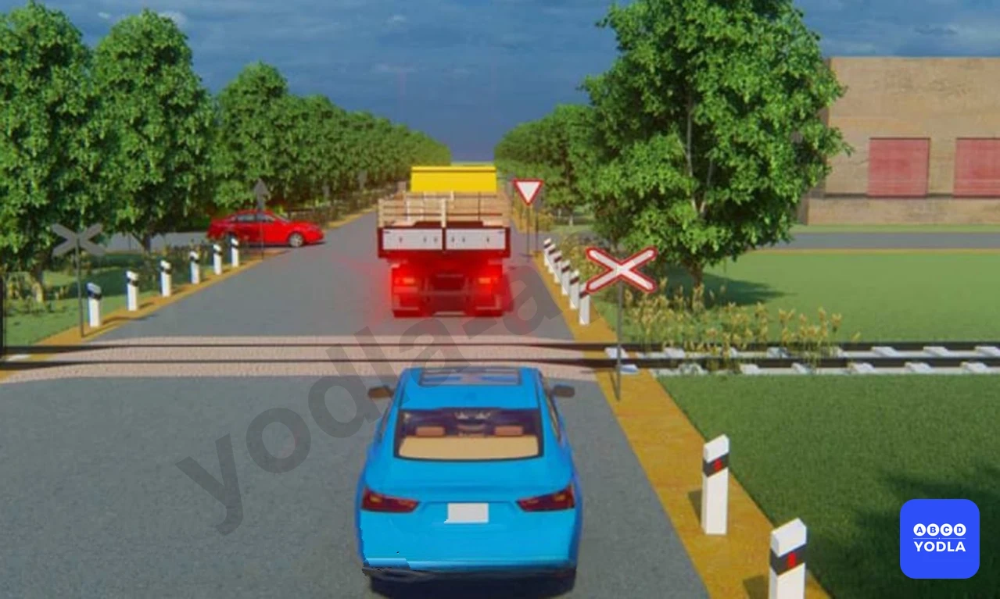
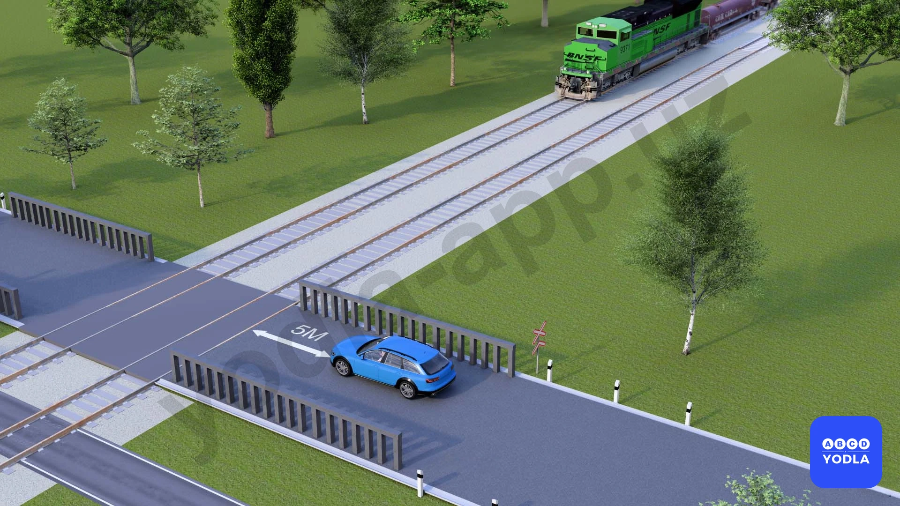

# Bilet 45

Всего вопросов: 20

## Вопрос 1

**Разрешается ли открывать шлагбаум или объезжать его?**

⬜ A. Разрешается если светофор выключен
✅ B. Запрещается

> 💡 Согласно абзацу 7 пункта 118 главы 18 ПДД, запрещается самовольно открывать шлагбаум.

---

## Вопрос 2

**Перед началом движения после остановки перед железнодорожным переездом водитель должен:**

⬜ A. Начать движение через переезд со скоростью обеспечивающей безопасность движения
⬜ B. Проехать переезд на первой передаче
✅ C. Убедиться в отсутствии приближающегося поезда

> 💡 Согласно пункту 117 главы 18 ПДД, при приближении к железнодорожному переезду водитель обязан руководствоваться требованиями дорожных знаков и разметки, сигналами светофоров, положением шлагбаума, указаниями дежурного по переезду и убедиться в отсутствии приближающегося поезда (локомотива, дрезины).

---

## Вопрос 3

**Сигналом запрещающим движение через железнодорожный переезд является положение дежурного обращенного к водителю:**

⬜ A. Левым или правым плечом с поднятым над головой жезлом (красным флагом)
✅ B. Грудью или спиной с поднятым над головой жезлом (красным флагом) или с вытянутыми в стороны руками
⬜ C. Любым плечом или грудью с поднятым над головой жезлом (красным флагом)

> 💡 Согласно абзацу 3 пункта 118 главы 18 ПДД, запрещается выезжать на железнодорожный переезд при запрещающем сигнале дежурного по переезду (дежурный обращён к водителю грудью или спиной с поднятым над головой жезлом, красным фонарём или флажком, либо с вытянутыми в сторону руками).

---

## Вопрос 4

**Разрешается ли переезжать через железнодорожный переезд сельскохозяйственным, дорожным и строительным механическим транспортным средствам на гусеничном ходу?**

⬜ A. Разрешается, если получено разрешение начальника дистанции пути железной дороги
✅ B. Разрешается загруженными на механические транспортные средства в транспортном положении
⬜ C. Запрещается

> 💡 Согласно абзацу 8 пункта 118 главы 18 ПДД, запрещается провозить через переезд в нетранспортном положении сельскохозяйственные, дорожные, строительные и другие машины и механизмы.

---

## Вопрос 5

**Только с разрешения начальника дистанции пути железной дороги допускается движение через переезд транспортных средств скорость движения которых менее:**

⬜ A. 3 км/ч
⬜ B. 5 км/ч
✅ C. 8 км/ч
⬜ D. 10 км/ч
⬜ E. 30 км/ч

---

## Вопрос 6

**Чем должен руководствоваться водитель при проезд железнодорожного переезда?**

⬜ A. Положением шлагбаума и световой сигнализацией
⬜ B. Дорожными знаками и разметкой
⬜ C. Указаниями и сигналами дежурного по переезду
✅ D. Всеми перечисленными требованиями

---

## Вопрос 7

**На каком наименьшем расстоянии до шлагбаума правила обязывают водителя остановиться у железнодорожного переезда для пропуска приближающегося поезда при отсутствии стоп-линии знака 2.5 «Движение без остановки запрещено» и светофора?**

⬜ A. 1 м
✅ B. 5 м
⬜ C. 10 м
⬜ D. 15 м
⬜ E. 20 м

> 💡 Пункту 119 главы 18 ПДД, гласит: В случаях, когда движение через переезд запрещено, водитель должен остановиться у стоп-линий, знака 2.5 или светофора, если их нет - не ближе 5 метр шлагбаума, а при отсутствии шлагбаума не ближе 10 м до первого рельса.

---

## Вопрос 8

**Разрешено ли Вам въехать на железнодорожный переезд?**

⬜ A. Да
⬜ B. Да, если отсутствует приближающийся поезд
✅ C. Нет

> 💡 Согласно абзацу второго пункта 88 Правил дорожного движения, на левой стороне дороги остановка и стоянка разрешаются в населенных пунктах на дорогах без трамвайного пути посередине, с одной полосой движения в каждую сторону, а также с односторонним движением.
Согласно пункту 91 Правил дорожного движения, остановка запрещается в следующих местах: на пешеходных переходах и ближе 10 м перед ними.

---

## Вопрос 9

**Правильно ли водитель остановился для предоставления преимущества поезду?**

⬜ A. Да
✅ B. Нет

> 💡 "На основании пунктов 3.18.1 и 3.18.2 Приложения 1 к ПДД: 3.18.1. «Поворот направо запрещен».
3.18.2. «Поворот налево запрещен»."

---

## Вопрос 10

**Водитель красного автомобиля правильно ли остановился, чтобы пропустить приближающийся поезд?**

⬜ A. Остановился правильно
✅ B. Остановился неправильно

> 💡 На основании пункта 119 главы 18 ПДД: 119. В случаях, когда движение через переезд запрещено, водитель должен остановиться у стоп-линии, дорожного знака 2.5 или светофора, если их нет — не ближе 5 м от шлагбаума, а при отсутствии шлагбаума — не ближе 10 м до ближайшего рельса.

---

## Вопрос 11

**На автомагистрале запрещено:**

⬜ A. Разворот и въезд в разрывы разделительной полосы
⬜ B. Движение задним ходом
⬜ C. Остановка вне специальных площадок для стоянки; обозначенных знаком "Место стоянки" или "Место отдыха"
✅ D. Все перечисленные действия

> 💡 Пункта 121 главы 19 ПДД, гласит: На автомагистралях запрещается: движение пешеходов, домашних животных, гужевых повозок, велосипедов, индивидуальные транспортные средства, скутеры, мопедов, тракторов и самоходных машин, транспортных средств, скорость которых по технической характеристике или их состоянию менее 40 км/ч;
- движение грузовых автомобилей с разрешенной максимальной массой более 3,5 т по другим полосам, кроме первой и второй;
- остановка вне специальных площадок для
стоянки, обозначенных знаками 5.15 "Место
стоянки" или 6.11 "Место отдыха";
- разворот и въезд в технологические разрывы
разделительной полосы
- движение задним ходом;
- учебная езда. Как видно, на автомагистрали запрещены все перечисленные действия.

---

## Вопрос 12

**Разрешена ли буксировка на автомагистрали?**

⬜ A. Разрешена со скоростью 50 км/ч
⬜ B. Запрещается
⬜ C. Разрешена только путем частичной погрузки или на жесткой сцепке
⬜ D. Разрешена на гибкой сцепке
✅ E. Разрешена любым способом

> 💡 Пункта 145 главы 24 ПДД, гласит: Буксировка запрещается в следующих случаях: транспортных средств, у которых не действует рулевое управление (кроме случаев буксировки методом частичной погрузки);
двух и более транспортных средств; при общей длине буксирующего и буксируемого транспортных средств вместе со связующим звеном, превышающей 20 м; транспортного средства с недействующей тормозной системой, если его фактическая масса превышает половину фактической массы буксирующего транспортного средства (кроме случаев буксировки при меньшей фактической массе таких транспортных средств только на жесткой сцепке или методом частичной погрузки.); с двухколесными мотоциклами, электромотоциклами, мопедами, скутерами и индивидуальные транспортных средствам, а также такими мотоциклами, электромотоциклами, мопедами, скутерами и индивидуальные транспортных средствам;
в гололедицу, на скользкой дороге, на гибкой сцепке. В Правилах дорожного движения нет ограничений на буксировку на автомагистралях.

---

## Вопрос 13

**Разрешена ли остановка на автомагистрали?**

⬜ A. Запрещена
⬜ B. Разрешается в местах; где автомагистраль хорошо просматривается
⬜ C. Разрешается, если имеются три полосы для движения в одном направлении
✅ D. Разрешается на специальных площадках для стоянки; обозначенных знаком «Место стоянки» или «Место отдыха»

> 💡 Согласно абзацу 3 пункта 121 главы 18 ПДД, на автомагистралях запрещается остановка вне специальных площадках для стоянки, обозначенных знаками 5.15 «Место стоянки» или 6.11 «Место отдыха».

---

## Вопрос 14

**Учебная езда на автомагистрали:**

⬜ A. Разрешена со скоростью не более 70 км/час
⬜ B. Разрешена со скоростью не более 60 км/час при достаточных навыках управления у обучаемого с мастером обучения вождению
✅ C. Запрещена
⬜ D. Разрешена, если механическое транспортное средство, на котором производится обучение, обозначено опознавательным знаком

> 💡 Согласно абзацу 6 пункта 121 главы 19 ПДД, на автомагистралях обучение вождению транспортного средства запрещается.

---

## Вопрос 15

**Разрешено ли грузовикам двигаться по левой полосе на автомагистрали?**

⬜ A. Разрешается
✅ B. Запрещается

> 💡 ПДД Общие положения: Перестроение - выезд из занимаемой полосы или занимаемого ряда с сохранением первоначального направления движения.

---

## Вопрос 16

**Разрешается ли движение пешеходов по дороге обозначенной знаком «Автомагистраль»?**

✅ A. Запрещается
⬜ B. Разрешается идти только вне населенных пунктов навстречу движению транспортных средств
⬜ C. Разрешается идти вне населенных пунктов по ходу движения транспортных средств

> 💡 Согласно пункту 121 главы 18 ПДД, на автомагистралях запрещается движение пешеходов, домашних животных, гужевых повозок, велосипедов, мопедов, тракторов и самоходных машин, транспортных средств, скорость которых по технической характеристике или их состоянию менее 40 км/ч.

---

## Вопрос 17

**Что запрещено на автомагистрали водителям грузовых автомобилей, разрешенная максимальная масса которых менее 3,5 т?**

⬜ A. Движение во второй полосе трехполосной дороги
✅ B. Движение задним ходом
⬜ C. Буксировка механических транспортных средств
⬜ D. Все перечисленные действия

> 💡 Согласно абзацу 5 пункта 121 главы 19 ПДД, на автомагистралях запрещается движение задним ходом.

---

## Вопрос 18

**Разрешается ли въезд в разрывы разделительной полосы на автомагистрали?**

⬜ A. Разрешается
⬜ B. Разрешается только для разворота, кроме водителей грузовых автомобилей полной массой более 3,5 т
✅ C. Запрещается
⬜ D. Разрешается маршрутным транспортным средствам

---

## Вопрос 19

**Разрешается ли разворот в разрывах разделительной полосы на участках дорог обозначенных этим знаком?**

⬜ A. Разрешается
✅ B. Запрещается
⬜ C. Разрешается только транспортным средствам с полной массой до 3,5 тонны

---

## Вопрос 20

**В каких местах разрешена преднамеренная остановка транспортных средств на автомагистралях?**

⬜ A. На крайней правой полосе проезжей части дороги
⬜ B. В местах; где видимость более 100 м и число полос движения более четырех
✅ C. На специальных площадках для стоянки; обозначенных знаками "Место стоянки" или "Место отдыха"

> 💡 Согласно пункту 121 Правил дорожного движения, на автомагистралях запрещается: остановка вне специальных площадок для стоянки, обозначенных дорожными знаками 5.15 или 6.11.

---

