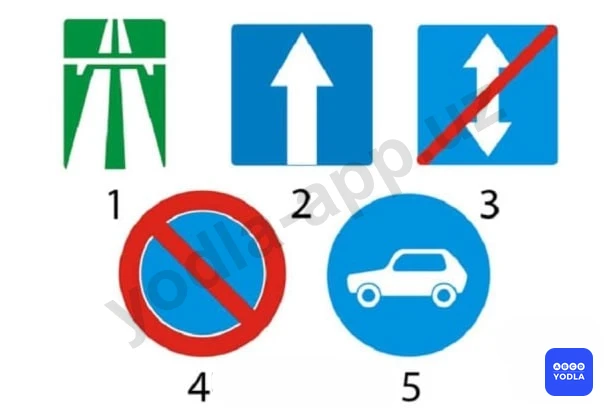
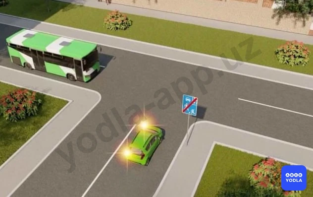
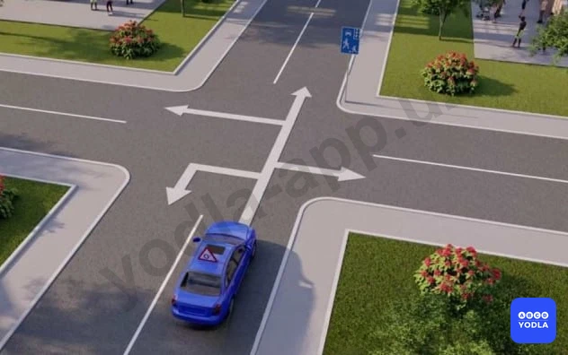
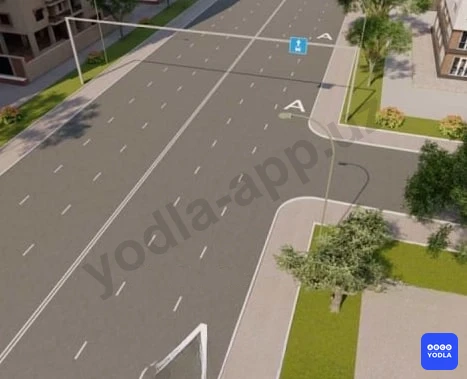

# Bilet 46

Всего вопросов: 20

## Вопрос 1

**Разрешается ли движение по автомагистралям транспортных средств; скорость которых по техничес­кой характеристике или их состоянию менее 40 км/ч?**

⬜ A. Разрешается не далее второй полосы
✅ B. Запрещается
⬜ C. Разрешается; если не установлен знак "Ограничение минимальной скорости"

> 💡 Согласно пункту 121 главы 18 ПДД, на автомагистралях запрещается движение пешеходов, домашних животных, грузовых повозок, велосипедов, мопедов, тракторов и самоходных машин, транспортных средств, скорость которых по технической характеристике или их состоянию менее 40 км/ч.

---

## Вопрос 2

**Какой из показанных знаков запрещает движение задним ходом?**

✅ A. 1
⬜ B. 2
⬜ C. 3
⬜ D. 4
⬜ E. 5

> 💡 Пункта 121 главы 19 ПДД, гласит: На автомагистралях запрещается; движение задним ходом Соответственно, в зоне действия знака 5.1 “Автомагистраль” движение задним ходом запрещено.

---

## Вопрос 3

**Остановка на автомагистрали разрешена:**

⬜ A. Только правее линии разметки, обозначающей край проезжей части
⬜ B. В любых местах за пределами проезжей части
✅ C. Только на специальных площадках для стоянки, обозначенных соответствующими знаками (5.15 или 6.11).

> 💡 Согласно пункту 121 Правил дорожного движения, на автомагистралях запрещается: остановка вне специальных площадок для стоянки, обозначенных дорожными знаками 5.15 или 6.11.

---

## Вопрос 4

**Кто из водителей нарушает правила?**

✅ A. Водители грузового автомобиля с разрешенной максимальной массой 3т и мопеда
⬜ B. Только водитель мопеда
⬜ C. Никто не нарушает

> 💡 Пункта 86 главы 12 ПДД, гласит: Обгон запрещен:
— в КОНЦЕ подъема и на других участках дорог с ограниченной видимостью;
Не нарушает, потому что мотоциклист не на КОНЦЕ подъема.

---

## Вопрос 5

**Какие ограничения установлены на территории; обозначенной указанным знакам?**

⬜ A. Запрещается движение со скоростью более 5км/ч
✅ B. Обучение вождению транспортных средств
⬜ C. Запрещается сквозное движение
⬜ D. Запрещается стоянка в ночное время легковых автомобилей

> 💡 Согласно абзацу 1 пункта 124 главы 20 ПДД, в жилой зоне запрещается учебная езда на механических транспортных средствах, стоянка с работающим двигателем, стоянка грузовых автомобилей с разрешенной максимальной массой более 3,5 т вне специально выделенных и обозначенных дорожными знаками и (или) дорожной разметкой мест.

---

## Вопрос 6

**Обязан ли водитель легкового автомобиля уступить дорогу?**

✅ A. Да
⬜ B. Нет

> 💡 Согласно пункту 126 главы 20 ПДД, «Конец жилой зоны», при выезде из жилых зон водители должны уступить дорогу другим участникам движения.

---

## Вопрос 7

**В каком направлении разрешено движение этому транспортному средству, если за рулем находится обучаемый?**

⬜ A. В любом
⬜ B. Только направо
✅ C. Направо, налево и в обратном направлении

> 💡 Согласно абзацу 1 пункта 124 главы 20 ПДД, в жилой зоне запрещается учебная езда на механических транспортных средствах.

---

## Вопрос 8

**Обязан ли водитель уступить дорогу пешеходам в данном месте?**

✅ A. Да
⬜ B. Нет

> 💡 Согласно пункту 123 главы 20 ПДД, в жилой зоне (территории, въезды и выезды с которых обозначены знаками 5.38 и 5.39) движение пешеходов разрешается по тротуарам и проезжей части. При этом пешеходы имеют приоритет, однако, они не должны создавать необоснованные помехи для движения транспортных средств.

---

## Вопрос 9

**Какие действия запрещены в жилой зоне?**

⬜ A. Только учебная езда
⬜ B. Только стоянка с работающим двигателем
✅ C. Все вышеперечисленные действия

> 💡 Согласно пункту 3 Приложение № 3 к Правилам дорожного движения, запрещается эксплуатация транспортных средств при нарушена регулировка фар, не работают в установленном режиме или загрязнены внешние световые приборы и световозвращатели, на транспортном средстве установлены:
спереди — противотуманные фары с огнями любого цвета, кроме белого или жёлтого, указатели поворота с огнями любого цвета, кроме жёлтого или оранжевого, а световозвращающие приспособления — любого цвета, кроме белого.

---

## Вопрос 10

**Где могут двигаться пешеходы в жилой зоне?**

⬜ A. Только по тротуарам
⬜ B. По тротуарам и в один ряд по краю проезжей части
✅ C. По тротуарам и по проезжей части

> 💡 Согласно пункту 138 Правил дорожного движения, в светлое время суток ближний свет фар должен быть включен в следующих случаях: при движении в составе организованной транспортной колонны; на автобусах и маршрутных транспортных средствах, перевозящих пассажиров; при организованной перевозке группы детей; при перевозке опасных, крупногабаритных и тяжеловесных грузов; 
при буксировке механических транспортных средств (на буксирующем транспортном средстве); на мотоциклах и мопедах.

---

## Вопрос 11

**При выезде из жилой зоны водитель:**

✅ A. Должен уступить дорогу другим участникам движения
⬜ B. Он имеет приоритет перед другими участниками движения

> 💡 Согласно пункту 126 Правил дорожного движения, при выезде из жилых зон водители должны уступить дорогу другим участникам движения.

---

## Вопрос 12

**При выезде из жилой зоны необходимо уступить дорогу?**

⬜ A. Только транспортным средствам, приближающимся справа
⬜ B. Только транспортным средствам, приближающимся слева
⬜ C. Только транспортным средствам с включенным проблесковым маячком
✅ D. Всем транспортным средствам

> 💡 Согласно пункту 126 Правил дорожного движения, при выезде из жилых зон водители должны уступить дорогу другим участникам движения.

---

## Вопрос 13

**Где могут двигаться пешеходы в жилой зоне?**

✅ A. По тротуарам и по проезжей части
⬜ B. Только по тротуарам
⬜ C. В один ряд по краю проезжей части

> 💡 Дорожная разметка 1.28 раздела 1 приложения № 2 к ПДД, дорожная разметка, дублирующая запрещающие знаки.

---

## Вопрос 14

**Водитель какого транспортного средства должен уступить дорогу?**

✅ A. Водитель грузовика
⬜ B. Водитель легкового автомобиля

> 💡 Предупреждающий знак 1.14 "Крутой подъем". Пункту 128 главы 21 ПДД гласит: На уклонах, обозначенных знаками 1.13 и 1.14, при наличии препятствия, затрудняющего движение в противоположных направлениях, уступить дорогу должен водитель транспортного средства, движущегося на спуск. В данном случае водитель грузового автомобиля движется на спуск, поэтому он должен уступить дорогу.

---

## Вопрос 15

**Водитель какого транспортного средства должен уступить дорогу?**

⬜ A. Водитель автобуса
✅ B. Водитель грузовика

> 💡 Согласно пункту 128 главы 21 ПДД, на уклонах, обозначенных дорожными знаками 1.13 и 1.14, при наличии препятствия, затрудняющего движение в противоположных направлениях, уступить дорогу должен водитель транспортного средства, движущегося на спуск.

---

## Вопрос 16

**Если встречный разъезд на уклонах, обозначенных соответствующими знаками, затруднен, необходимо уступить дорогу:**

⬜ A. Транспортному средству; движущемуся на спуск
⬜ B. Маршрутному транспортному средству
✅ C. Транспортному средству; движущемуся на подъем

> 💡 Согласно пункту 128 главы 21 ПДД, на уклонах, обозначенных дорожными знаками 1.13 и 1.14, при наличии препятствия, затрудняющего движение в противоположных направлениях, уступить дорогу должен водитель транспортного средства, движущегося на спуск.

---

## Вопрос 17

**Разрешается ли заезжать на полосу; обозначенную этим знаком при повороте направо?**

⬜ A. Разрешается
⬜ B. Запрещается
✅ C. Разрешается; если полоса не ограничена от остальной части дороги сплошной линией

> 💡 В соответствии с вторым и третьим абзацами пункта 132 главы 22 ПДД: Если полоса, обозначенная дорожным знаком 5.9 отделена от остальной проезжей части дороги прерывистой линией разметки, то при поворотах транспортные средства должны перестраиваться на эту полосу. Разрешается также в таких местах заезжать на эту полосу при въезде на дорогу и для посадки и высадки пассажиров у правого края проезжей части при условии, что это не создаст помех движению маршрутных транспортных средств.
В данном случае, если полоса не ограничена от остальной части дороги сплошной линией, транспортные средства должны перестраиваться на эту полосу при поворотах.

---

## Вопрос 18

**Из какой полосы следует поворачивать направо в показанной ситуации?**

⬜ A. Только из второй полосы
✅ B. Только из крайней правой полосы; обозначенной разметкой « А »

> 💡 Cогласно пункту 132 главы 22 ПДД, по полосе, обозначенной дорожными знаками 5.9, 5.10.1 — 5.10.3 для движения маршрутных транспортных средств, движение и остановка других транспортных средств запрещается. Если полоса, обозначенная дорожным знаком 5.9 отделена от остальной проезжей части дороги прерывистой линией разметки, то при поворотах транспортные средства должны перестраиваться на эту полосу.

---

## Вопрос 19

**Должен ли водитель автобуса; движущегося по установленному маршруту; уступать дорогу в данной ситуации?**

✅ A. Должен
⬜ B. . Не должен
⬜ C. Не должен, так как он движется прямо

> 💡 Пункта 105 главы 16 ПДД, гласит: На перекрестке равнозначных дорог водитель безрельсового транспортного средства обязан уступить дорогу транспортным средствам, приближающимся справа.
Этим же правилом должны руководствоваться между собой водители трамваев. На таких перекрестках трамвай имеет право на первоочередное движение перед безрельсовыми транспортными средствами независимо от направления его движения. В данном случае трамвай имеет приоритет перед автобусом. Соответственно, водитель автобуса должен уступить ему дорогу.

---

## Вопрос 20

**Можно ли заезжать на крайнюю левую полосу проезжей части; если в начале участка дороги стоит этот знак?**

⬜ A. Можно для поворота налево
⬜ B. Можно для обгона, если нет встречного движения и полоса отделена от остальной проезжей части прерывистой линией разметки
✅ C. Нельзя ни при каких обстоятельствах

> 💡 Информационно-указательный знак 5.10.1 "Дорога с полосой для маршрутных транспортных средств". Дорога, по которой движение маршрутных транспортных средств осуществляется навстречу общему потоку транспортных средств по выделенной полосе. Пункт Пункта 132 главы 22 ПДД гласит: По полосе, обозначенной знаками 5.9, 5.10.1-5.10.3 для движения маршрутных транспортных средств, движение и остановка других транспортных средств запрещается. Если эта полоса отделена от остальной проезжей части дороги прерывистой линией разметки, то при поворотах транспортные средства должны перестраиваться на эту полосу. Разрешается также в таких местах заезжать на эту полосу при въезде на дорогу и для посадки и высадки пассажиров у правого края проезжей части при условии, что это не создаст помех движению маршрутных транспортных средств.

---

