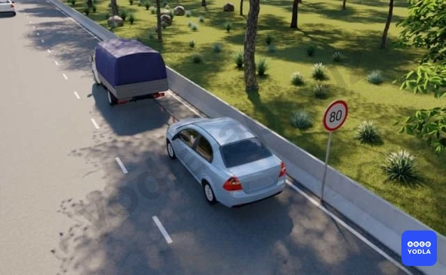

# Bilet 49

Всего вопросов: 20

## Вопрос 1

**Разрешается ли перевозка пассажиров в буксируемом автомобиле?**

⬜ A. Разрешается в автобусе
✅ B. Разрешается в легковом автомобиле
⬜ C. Разрешается в буксируемом грузовом автомобиле при буксировке на жесткой сцепке

> 💡 Пункта 143 главы 24 ПДД, гласит: При буксировке на гибкой или жесткой сцепке запрещается перевозка людей в буксируемом автобусе, троллейбусе и в кузове буксируемого грузового автомобиля, а при буксировке путем частичной погрузки - нахождение людей в кабине или кузове буксируемого транспортного средства, а также в кузове буксирующего транспортного средства.
В правилах не запрещено перевозить людей в буксируемом легковом автомобиле.

---

## Вопрос 2

**В каких случаях разрешается буксировка транспортного средства при отсутствии водителя за рулем буксируемого транспортного средства?**

⬜ A. Во всех случаях
⬜ B. При буксировке с помощью гибкого или жесткого буксирного устройства
✅ C. В случае; когда конструкция жесткой сцепки обеспечивает следование буксируемого транспортного средства; по траектории буксирующего
⬜ D. При буксировке на жесткой сцепке

> 💡 Согласно пункту 142 главы 24 ПДД, буксировка на жесткой или гибкой сцепке должна осуществляться только при наличии водителя за рулем буксируемого транспортного средства, кроме случаев, когда конструкция жесткой сцепки обеспечивает при прямолинейном движении следование буксируемого транспортного средства по траектории буксирующего.

---

## Вопрос 3

**Какая общая длина поезда сцепленных транспортных средств допускается Правилами при буксировке?**

✅ A. 20 м
⬜ B. 21 м
⬜ C. 22 м
⬜ D. 23 м
⬜ E. 24 м

> 💡 Согласно третьему абзацу пункта 145 главы 24 ПДД: Буксировка запрещается в следующих случаях: при общей длине буксирующего и буксируемого транспортных средств вместе со связующим звеном, превышающей 20 м.

---

## Вопрос 4

**Буксировка запрещается**

⬜ A. В гололедицу на жесткой сцепке
✅ B. Мотоциклами без бокового прицепа
⬜ C. Мотоциклов с боковым прицепом
⬜ D. При общей длине поезда сцепленных транспортных средств-20 м

> 💡 Абзацу 5 пункта 145 главы 24 ПДД, буксировка запрещается мотоциклами без бокового прицепа, а также мотоциклов без бокового прицепа.

---

## Вопрос 5

**Где могут находиться пассажиры при буксировке путем частичной погрузки?**

⬜ A. В кабине обоих автомобилей

✅ B. В кабине буксирующего автомобиля

⬜ C. В кабине буксируемого автомобиля
⬜ D. В кузове буксирующего автомобиля

> 💡 Пункта 143 главы 24 ПДД гласит: При буксировке на гибкой или жесткой сцепке запрещается перевозка людей в буксируемом автобусе, троллейбусе и в кузове буксируемого грузового автомобиля, а при буксировке путем частичной погрузки нахождение людей в кабине или кузове буксируемого транспортного средства, а также в кузове буксирующего транспортного средства. Соответственно, пассажиры могут находится в кабине буксирующего автомобиля при буксировке путем частичной погрузки.

---

## Вопрос 6

**В каком ответе указан правильный вариант включения световых приборов на буксируемом транспортном средстве?**

⬜ A. Ближний свет фар в темное время суток или в условиях тумана
✅ B. Аварийная сигнализация, при её отсутствии или неисправности транспортное средство должно быть обозначено знаком аварийной остановки укрепленном на нем сзади
⬜ C. Габаритные огни в населенных пунктах
⬜ D. Любое освещение на дорогах вне населенных пунктах

> 💡 Пункта 50 главы 8 ПДД гласит: Аварийная световая сигнализация должна быть включена в следующих случаях: при буксировке (на буксируемом транспортном средстве). Пункта 52 главы 8 ПДД гласит: При отсутствии или неисправности аварийной световой сигнализации на буксируемом транспортном средстве на его задней части должен быть закреплен знак аварийной остановки.

---

## Вопрос 7

**Разрешается ли перевозка людей в кузове грузового автомобиля при буксировке на жесткой или гибкой сцепке?**

⬜ A. Разрешается в кузове буксирующего и буксируемого автомобилей
⬜ B. Разрешено только в кузове автомобиля; который был отбуксирован
✅ C. Разрешается только в кузове буксирующего автомобиля

> 💡 Согласно пункту 143 Правил дорожного движения, при буксировке на гибкой или жесткой сцепке запрещается перевозка людей в буксируемом автобусе, троллейбусе и в кузове буксируемого грузового автомобиля, а при буксировке путем частичной погрузки — нахождение людей в кабине или кузове буксируемого транспортного средства, а также в кузове буксирующего транспортного средства.

---

## Вопрос 8

**Какое внешнее освещение должно быть включено на буксируемом транспортном средстве?**

⬜ A. В темное время суток, только габаритные огни
⬜ B. Ближний свет фар
✅ C. Аварийная сигнализация

> 💡 Пункта 50 главы 8 ПДД гласит: Одновременное включение всех световых указателей поворотов является сигналом оповещения об аварийной ситуации. Согласно абзацу четвертому пункта 50 главы 8 ПДД, аварийный сигнал должен быть включен в следующих случаях: при буксировке (в буксируемом транспортном средстве).

---

## Вопрос 9

**Механическое транспортное средство с неисправным рулевым управлением должно буксироваться:**

✅ A. Методом его частичной погрузки
⬜ B. На жесткой сцепке
⬜ C. Методом его частичной погрузки или на жесткой сцепке
⬜ D. На жесткой сцепке; если фактическая масса буксирующего вдвое превышает фактическую массу буксируемого

> 💡 Абзацу 1 пункта 145 главы 24 ПДД, запрещается буксировка транспортных средств, у которых не действует рулевое управление (кроме случаев буксировки методом частичной погрузки).

---

## Вопрос 10

**Разрешается ли буксировка при гололеде?**

⬜ A. Запрещается
⬜ B. Разрешается при использовании средств против скольжения (эластичный трос) только одно транспортное средство
✅ C. Разрешается при использовании жесткой сцепки для буксировки

> 💡 Абзацу 6 пункта 145 главы 24 ПДД, буксировка запрещается в следующих случаях: в гололедицу, на скользкой дороге, на гибкой сцепке.

---

## Вопрос 11

**Разрешается ли перевозить людей при буксировке на гибкой или жесткой сцепке в буксируемом механическом транспортном средстве?**

⬜ A. Разрешается в автобусе и троллейбусе
⬜ B. Запрещается
⬜ C. Разрешается в грузовом и легковом автомобилях
✅ D. Разрешается в кабине грузового автомобиля и в легковом автомобиле

> 💡 Пункта 143 главы 24 ПДД гласит: При буксировке на гибкой или жесткой сцепке запрещается перевозка людей в буксируемом автобусе, троллейбусе и в кузове буксируемого грузового автомобиля, а при буксировке путем частичной погрузки - нахождение людей в кабине или кузове буксируемого транспортного средства, а также в кузове буксирующего транспортного средства. Как видно, запрещено перевозить людей в буксируемом автобусе, троллейбусе и в кузове буксируемого грузового автомобиля, соответственно, разрешено в кабине грузового автомобиля и в легковом автомобиле (по правилу “что не запрещено, то разрешено”).

---

## Вопрос 12

**С какой максимальной скоростью может осуществляться буксировка в данных условиях?**

⬜ A. 30 км/ч
✅ B. 50 км/ч
⬜ C. 70 км/ч
⬜ D. 80 км/ч

> 💡 Согласно абзацу 3 пункта 80 главы 11 ПДД, на всех дорогах разрешается движение транспортным средствам, буксирующим механические транспортные средства – не более 50 км/ч.

---

## Вопрос 13

**Какое расстояние между транспортными средствами должна обеспечить гибкая сцепка?**

⬜ A. 1-3 м
⬜ B. 2-4 м
⬜ C. 3-6 м
✅ D. 4-6 м
⬜ E. 4-8 м

> 💡 Согласно пункту 144 главы 24 ПДД, при буксировке на гибкой сцепке расстояние между буксирующим и буксируемым транспортными средствами должно быть в пределах 4 — 6 метров, а при буксировке на жесткой сцепке расстояние между буксирующим и буксируемым транспортными средствами должно быть не более 4 метров.

---

## Вопрос 14

**В каких случаях запрещена буксировка?**

⬜ A. В гололедицу на жесткой сцепке
✅ B. В гололедицу на гибкой сцепке
⬜ C. Мотоциклами с боковым прицепом

> 💡 Пункту 145 главы 24 ПДД, гласит: Буксировка запрешается в следуюших случаях: в гололедицу, на скользкой дороге, на гибкой сцепке.

---

## Вопрос 15

**Разрешается ли буксировка мотоциклов?**

✅ A. Разрешается мотоциклам с боковым прицепом
⬜ B. Запрещается
⬜ C. Разрешается в равнинной местности
⬜ D. Разрешается мотоциклам без бокового прицепа

---

## Вопрос 16

**Каким образом должно быть обозначено гибкое связывающее устройство во время буксировки механического транспортного средства?**

✅ A. Сигнальными флажками или щитками с красными и белыми полосами со световозвращаюшей поверхностью
⬜ B. Знаком аварийной остановки на транспортном средстве укрепленным на нем сзади
⬜ C. Транспортное средство, обозначенное спереди фонарями белого, а сзади красного цвета

> 💡 Пункту 144 главы 24 ПДД, при буксировке на гибкой сцепке расстояние между буксирующим и буксируемым транспортными средствами должно быть в пределах 4-6 м, а при жесткой не более 4 м. При гибкой сцепке связующее звено обозначается сигнальными щитками или флажками с красными и белыми полосами со световозвращающей поверхностью в соответствии с пунктом 177 ПДД

---

## Вопрос 17

**Разрешается ли буксировка автомобиля с неисправной тормозной системой?**

✅ A. На жесткой сцепке, если фактическая масса буксирующего будет в два раза превышать фактическую массу буксируемого
⬜ B. Только на жесткой сцепке
⬜ C. Любым способом, если за рулем буксируемого транспортного средства находится водитель
⬜ D. Только методом его частичной погрузки

---

## Вопрос 18

**Разрешается ли буксировка мопедов?**

⬜ A. Разрешается
⬜ B. Разрешается только в светлое время суток по дорогам; не имеющим твердого покрытия
✅ C. Запрещается

> 💡 Абзацу 7 пункта 168 главы 28 ПДД, гласит: Запрещается буксировка велосипедов и индивидуальные транспортным средствам, а также велосипедами и индивидуальным транспортным средствам (за исключением буксировки прицепа, предназначенного для эксплуатации с велосипедом).

---

## Вопрос 19

**В каких из перечисленных случаев запрещена буксировка на гибкой сцепке?**

⬜ A. Только на горных дорогах
✅ B. Только в гололедицу
⬜ C. Только в темное время суток и в условиях недостаточной видимости
⬜ D. Во всех перечисленных случаях

> 💡 Согласно пункту 31 главы 7 ПДД, зеленый мигающий сигнал разрешает движение и информирует, что время его действия истекает и вскоре будет включен запрещающий сигнал.

---

## Вопрос 20

**Какое расстояние должно быть обеспечено между буксирующим и буксируемым транспортными средствами при буксировке на жесткой сцепке?**

✅ A. Не более 4 м
⬜ B. От 4 до 6 м
⬜ C. Правилами не регламентируется

> 💡 Знак 7.6.4 раздела 7 приложения № 1 к ПДД, «Способ постановки транспортного средства на стоянку». 7.6.4 Указывает способ постановки легковых автомобилей и мотоциклов на околотротуарной стоянке.

---

