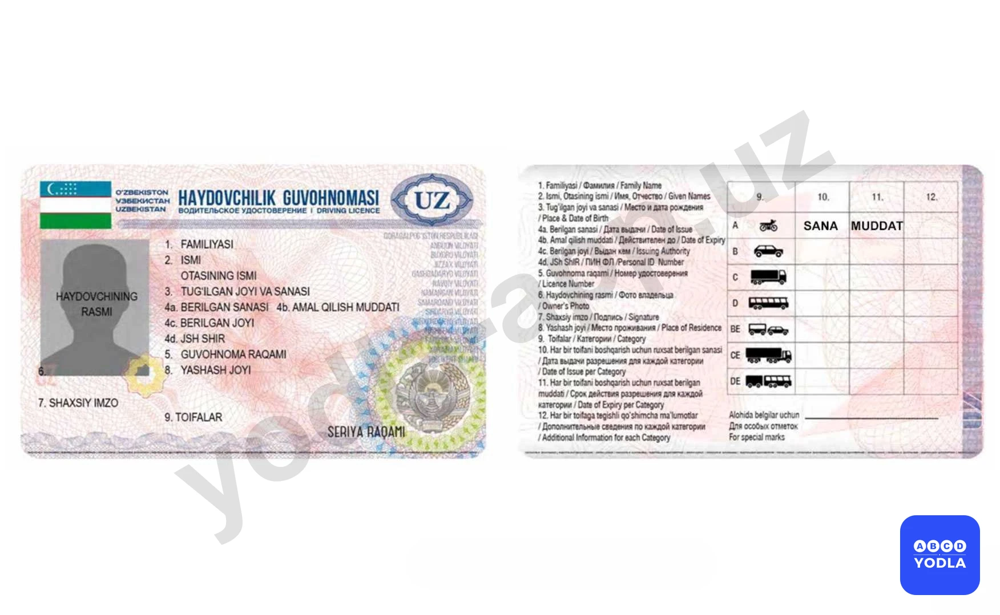

# Bilet 50

Всего вопросов: 20

## Вопрос 1

**Как следует обозначить буксируемый автомобиль при отсутствии или неисправности аварийной сигнализации?**

⬜ A. Включить габаритные огни
⬜ B. Включить задний противотуманные фонаре
✅ C. Установить на задней части буксируемого автомобиля знак аварийной остановки

> 💡 Согласно пункту 75 Правил дорожного движения, если встречный разъезд затруднён, то водитель на стороне которого имеется препятствие, должен уступить дорогу.

---

## Вопрос 2

**Разрешается ли Вам буксировать автомобиль с недействующей тормозной системой, если фактическая масса у этого автомобиля превышает половину фактической массы Вашего автомобиля?**

⬜ A. Разрешается
✅ B. Не разрешается
⬜ C. Разрешается только при скорости буксировки не более 30 км/ч

> 💡 Согласно пункту 145 главы 24 ПДД, запрещается буксировка транспортного средства с недействующей рабочей тормозной системой, если его фактическая масса превышает половину фактической массы буксирующего транспортного средства (кроме случаев буксировки при меньшей фактической массе таких транспортных средств только на жесткой сцепке или методом частичной погрузки.)

---

## Вопрос 3

**Разрешена ли Вам перевозка людей в салоне легкового автомобиля, буксирующего неисправное транспортное средство?**

✅ A. Разрешена
⬜ B. Запрещена

> 💡 При увеличении скорости увеличиваются и поперечные отклонения от задаваемой водителем траектории движения. Это происходит за счет боковой эластичности колес, неровностей покрытия, воздействия ветра и люфтов в механизмах рулевого управления. Поэтому, увеличивая скорость, водители должны увеличивать боковой интервал.

---

## Вопрос 4

**Разрешается ли перевозить людей в автобусе или троллейбусе, при буксировке на жёсткой сцепке?**

✅ A. Запрещено
⬜ B. Разрешено

> 💡 Согласно требованиям безопасности дорожного движения, способ вождения автомобиля с плавным ускорением и плавным замедлением позволяет экономить расход топлива.

---

## Вопрос 5

**В каком из перечисленных случаев запрещается буксировка на гибкой сцепке?**

⬜ A. Только по горной дороге
✅ B. Только на скользкой дороге
⬜ C. В темное время суток и в условиях недостаточной видимости
⬜ D. Во всех перечисленных случаях

> 💡 Согласно пункту 102 главы 15 ПДД, водитель, въехавший на перекресток при разрешающем сигнале светофора, должен выехать в намеченном направлении, независимо от сигналов светофора на выходе с него. Однако, если на перекрестке перед светофорами, расположенными на пути следования водителя, имеются стоп-линии (или дорожный знак 5.33), водитель обязан руководствоваться сигналами каждого светофора.

---

## Вопрос 6

**Разрешается ли перевозить людейв буксируемом автобусе?**

⬜ A. Разрешается
✅ B. Запрещается
⬜ C. Разрешается только сидячим пассажирам

> 💡 Согласно пункту 143 Правил дорожного движения, при буксировке на гибкой или жесткой сцепке запрещается перевозка людей в буксируемом автобусе, троллейбусе и в кузове буксируемого грузового автомобиля, а при буксировке путем частичной погрузки — нахождение людей в кабине или кузове буксируемого транспортного средства, а также в кузове буксирующего транспортного средства.

---

## Вопрос 7

**Не менее скольких предупредительных устройств должно устанавливаться при буксировке на гибкой сцепке?**

✅ A. Не менее двух
⬜ B. Не менее трёх
⬜ C. Не менее одного

> 💡 Согласно пункту 106 Правил дорожного движения, Если главная дорога на перекрестке меняет направление, водители, движущиеся по главной дороге, должны руководствоваться между собой правилами проезда перекрестков равнозначных дорог.
Этим же правилом должны руководствоваться между собой и водители, движущиеся по второстепенным дорогам.
Зеленый автомобиль пересекает этот перекресток первым, красный автомобиль вторым, синий автомобиль третьим и желтый автомобиль последним.

---

## Вопрос 8

**Как оборудуется учебное транспортное средство?**

⬜ A. Опознавательными знаками по требованиям Правил
⬜ B. Дополнительными педалями тормоза и сцепления
⬜ C. Зеркалом заднего вида для обучающего
✅ D. Со всеми перечисленными приборами и знаками.

> 💡 Согласно пункту 150 главы 25 ПДД, механические транспортные средства, предназначенные для обучения вождению, должны быть обозначены опознавательными знаками «Учебное транспортное средство», кроме того, они должны быть оборудованы дополнительными педалями сцепления и рабочего тормоза, зеркалом заднего вида для обучающего.

---

## Вопрос 9

**С какого возраста правила разрешают управлять легковыми автомобилями?**

⬜ A. С 14 лет
⬜ B. С 16 лет
✅ C. С 18 лет

> 💡 Пункта 149 главы 25 ПДД, гласит: Обучаемому к концу обучения на право управления транспортными средствами должно быть: — для категорий “В” и “С” — не менее 18 лет.

---

## Вопрос 10

**Кто имеет право обучать вождению в учебных организациях?**

✅ A. Мастер обучения вождению имеющий документы на право обучения вождению
⬜ B. Опытный водител
⬜ C. Водитель со стажем 3 года
⬜ D. Водитель 1 -го и 2-го класса; имеющий водительский стаж 5 лет

> 💡 Пункт 148 главы 25 ПДД, гласит: Инструктор практических занятий по управлению автомототранспортным средством или средством городского электрическокого транспорта должен иметь при себе документы на право обучения вождению,а также удостоверение на право управления транспортным средством соответствующей категории.

---

## Вопрос 11

**Считается ли человек, обучающий вождению транспортного средства, водителем?**

✅ A. Да
⬜ B. Нет

> 💡 Согласно абзацу 3 пункта 12 главы 2 ПДД, водителю запрещается управлять транспортным средством, если на транспортном средстве тормозная система, рулевое управление, стеклоочиститель во время дождя или снегопада, неисправно сцепное устройство (в составе автопоезда), не горят или отсутствуют фары и задние габаритные огни в темное время суток или в условиях ограниченной видимости.

---

## Вопрос 12

**Это восклицательный знак:**

⬜ A. Временный ремонт дороги
⬜ B. Транспортных средства с взрывчатыми и легковоспламеняющимися грузами
✅ C. Механических транспортных средств управляемых водителями, имеющими водительский стаж менее 2 лет

> 💡 ПДД приложение № 2: 1.29.1 искусственная неровность (приподнятый пешеходный переход).

---

## Вопрос 13

**Где проводится начальное обучение вождению транспортных средств (начальное обучение)?**

⬜ A. На шоссе
⬜ B. В населенных пунктах
⬜ C. Размещение в более
✅ D. На закрытых площадках или в автодроме

> 💡 Пункт 16 главы 4 ПДД, гласит:
Движение организованных колонн пешеходов разрешается в попутном движению транспортных средств направлении только по правой стороне проезжей части дороги, не более чем по четыре человека в ряд.
Впереди и сзади колонны с левой стороны должны находиться сопровождающие с красными флажками, а в темное время суток и при недостаточной видимости — с включенными фонарями: спереди — белого цвета, сзади — красного.
Группы детей разрешается водить только по тротуарам и пешеходным дорожкам, а при их отсутствии — по проезжей части, только в светлое время суток и в сопровождении взрослых.

---

## Вопрос 14

**В конце срока обучения к сдаче экзаменов на право управления мототранспортным средством категории \"А\" допускаются лица, достигшие какого возраста?**

⬜ A. 17 лет
✅ B. 16 лет
⬜ C. 14 лет
⬜ D. 18 лет
⬜ E. 15 лет

> 💡 "На основании пункта 1.11 Приложения 2 к ПДД и абзаца 49: 1.11 — разделяет транспортные потоки противоположных или попутных направлений на участках дорог, где перестроение разрешено только из одной полосы; обозначает места, предназначенные для разворота, въезда и выезда со стояночных площадок и т. п., где движение разрешено только в одну сторону;
Линию 1.11 разрешается пересекать со стороны прерывистой, а также и со стороны сплошной, но только при завершении обгона или объезда."

---

## Вопрос 15

**Какое количество людей разрешается перевозить в кузове грузового автомобиля?**

⬜ A. Не более 20 человекss
✅ B. Число перевозимых людей не должно превышать количество оборудованных для сидения мест
⬜ C. По усмотрению водителя
⬜ D. По указанию администрации

> 💡 Пункта 6 главы 1 ПДД гласит: Опережение – движение транспортного средства со скоростью, большей скорости попутного транспортного средства.

---

## Вопрос 16

**Разрешается ли перевозка людей на грузовом прицепе?**

✅ A. Запрещается
⬜ B. Разрешается
⬜ C. Разрешается только лицам; сопровождающим груз

> 💡 Запрещается перевозить людей на тракторах и других самоходных машинах, на грузовом прицепе, в прицепе – даче, в кузове грузового мотоцикла.

---

## Вопрос 17

**Разрешается ли перевозить детей; не достигших 12-летнего возраста в кабине грузового автомобиля?**

✅ A. Разрешается
⬜ B. Разрешается только в сопровождении взрослого пассажира
⬜ C. Запрещается

> 💡 Абзацу 5 пункта 159 главы 26 ПДД, Запрещается перевозить людей в следующих случаях: запрещается перевозить детей до 12 лет на заднем сиденье мотоцикла, электромотоцикла, мопеда и скутера, а также на переднем сиденье легкового автомобиля при отсутствии специального детского удерживающего устройства.

---

## Вопрос 18

**Каковы требования для организованной перевозки группа детей?**

⬜ A. При организовонной перевозки группы детей в автобусе должен присутствовать сопровождающий 
⬜ B. На передней и задней части транспортного средства; должен быть установлен опозновательный знак «Перевозка детей»
⬜ C. Организованная перевозка восьми и более детей на автобусах, не относящиеся к маршрутным транспортым средствам
✅ D. Во всех перечисленных случаях

> 💡 При организованной перевозке группы детей в автобусе (микроавтобусе) с детьми должен находиться взрослый сопровождающий (сопровождающие). Автобус (микроавтобус) должно иметь спереди и сзади опознавательные знаки «Перевозка группы детей».

---

## Вопрос 19

**Разрешается ли проезд в кузове грузового автомобиля; не оборудованного для перевозки людей?**

⬜ A. Запрещается
⬜ B. Разрешается на дорогах; не относящихся к автомагистралям
✅ C. Разрешается только лицам, сопровождающим груз или следующим за его получением, при условии обеспечения их местом для сидения, расположенным ниже уровня бортов

> 💡 Проезд в кузове грузового автомобиля, не оборудованном для перевозки людей, разрешается только лицам, сопровождающим груз или следующим за его получением, при условии, что они обеспечены местом для сидения, расположенным ниже уровня бортов.

---

## Вопрос 20

**Разрешается ли перевозка детей на переднем сиденье легкового автомобиля?**

⬜ A. Разрешается перевозка детей в возрасте не моложе 7 лет
✅ B. Разрешается перевозка детей достигших 12-летнего возраста и старше
⬜ C. Разрешается независимо от возраста при наличии взрослого пассажира

> 💡 Пункта 159 главы 26 ПДД, гласит: Запрещается перевозить людей в следующих случаях: - запрещается перевозить детей до 12 лет на заднем сиденье мотоцикл, электромотоцикл, мопед и скутера, а также на переднем сиденье легкового автомобиля при отсутствии специального детского удерживающего устройства.

---

