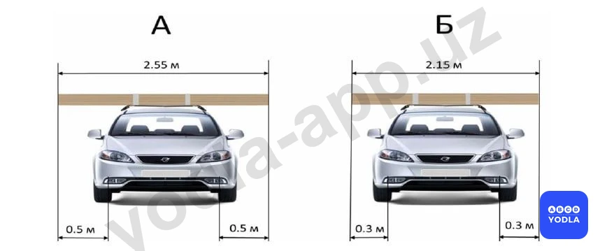
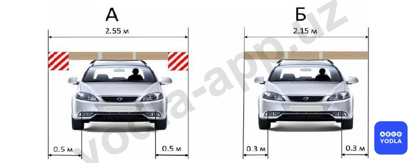
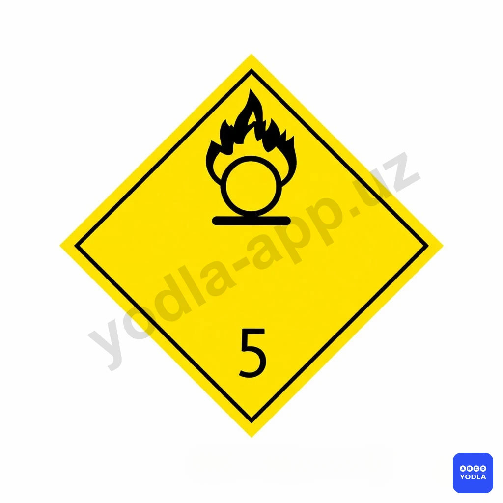

# Bilet 52 (PRO)

Всего вопросов: 20

## Вопрос 1

**В каких случаях перевозимый груз должен быть обозначен сигнальными щитками или флажками, а в темное время суток и в условиях недостаточной видимости светоотражающими приспособлениями или фонарями?**

✅ A. Если груз выступает за габариты транспортного средства спереди или сзади более чем на 1 м
⬜ B. Если груз выступает за габариты транспортного средства сзади на 0,8 м

> 💡 Пункту 163 главы 27 ПДД, гласит: Груз, выступающий за габариты транспортного средства спереди или сзади более чем на 1 м, сбоку более чем на 0,4 м от внешнего края габаритного огня, должен быть обозначен опознавательными знаками "Крупногабаритный груз", в соответствии с Пункту 176 главы 29 ПДД, Правил, а в темное время суток и в условиях недостаточной видимости, кроме того, спереди фонарем или световозвращателем белого цвета, сзади фонарем или световозвращателем красного цвета.

---

## Вопрос 2

**При какой максимальной ширине транспортного средства с грузом или без груза допускается движение без разрешения ГСБДД?**

⬜ A. 2,0 м
✅ B. 2,55 м
⬜ C. 3,8 м
⬜ D. 4,0 м
⬜ E. 5,0 м

> 💡 Для перевозки тяжеловесных, крупногабаритных и опасных грузов, движения транспортных средств, габаритные параметры которых с грузом или без груза превышают по ширине 2,55 метра (для рефрижераторов и изотермических кузовов — 2,6 м), требуется согласование с ГСБДД в установленном порядке.

---

## Вопрос 3

**Кто регламентирует массу перевозимого груза и распределения нагрузки по осям?**

⬜ A. ГСБДД
⬜ B. Администрация автохозяйства
✅ C. Предприятие- изготовитель данного транспортного средства

> 💡 Пункту 160 главы 27 ПДД, гласит: Масса перевозимого груза и распределение нагрузки по осям не должны превышать величин, установленных предприятием-изготовителем для данного транспортного средства.

---

## Вопрос 4

**Разрешается ли перевозка груза на грузовом автомобиле «Газель» без соблюдения специальных правил, если высота автомобиля с грузом составляет 3,8 м от поверхности дороги?**

✅ A. Разрешается
⬜ B. Запрещается
⬜ C. Только по дорогам, на которых отсутствует необходимость двигаться под мостами или путепроводами

> 💡 Пункту 164 главы 27 ПДД, гласит: Для перевозки тяжеловесных, крупногабаритных и опасных грузов, движения транспортных средств, габаритные параметры которых с грузом или без груза превышают по ширине 2,5 м, по высоте 4 м от поверхности проезжей части, по длине (включая один прицеп) 20 м, либо с грузом, выступающим за заднюю точку габарита транспортного средства более чем на 2 м, движения автопоездов с двумя и более прицепами требуется разрешение органов ГСБДД. В данном случае высота грузового автомобиля от поверхности проезжей части составляет 3,8 м, специальное разрешение требуется, если высота составляет более 4 м. Соответственно, перевозка груза на грузовом автомобиле без соблюдения специальных правил, если высота груза составляет 3,8 м от поверхности дороги, разрешена.

---

## Вопрос 5

**Как обозначается груз, выступающий за габариты транспортного средства в темное время суток и в условиях недостаточной видимости?**

⬜ A. Сигнальными щитками или флажками (с нанесенными по диагонали красными и белыми чередующими полосами)
✅ B. «Негабаритного груза» опознавательным знаком, кроме того Светоотражающими приспособлениями или фонарями спереди белого, сзади красного
⬜ C. Флажками – сзади красными, спереди белыми

---

## Вопрос 6

**На каком рисунке изображен автомобиль, водитель которого нарушает правила перевозки грузов?**

✅ A. А
⬜ B. Б
⬜ C. А и Б

> 💡 Колеса должны быть повернуты так, чтобы автомобиль при произвольном скатывании выехал не на проезжую часть, а уперся колесами в бордюр тротуара. Подъем дороги согласно знаку снизу вверх. Автомобиль А упирается передними колесами в бордюр. Автомобиль C также упирается передними колесами в бордюр и не может скатиться. Автомобиль B выкатывается прямо на проезжую часть. Автомобиль D также выкатится на дорогу, пока задние колеса не упрутся в бордюр, в результате чего автомобиль встанет боком, перекрыв часть полосы движения. Правильное положение колес обеспечили водители автомобилей А и C.

---

## Вопрос 7

**На каком рисунке изображен автомобиль, водитель которого нарушает правила перевозки грузов при движении в светлое время суток?**

⬜ A. А
⬜ B. На обоих рисунках
✅ C. Никто не нарушает

> 💡 Согласно статьи 163 Правил дорожного движения,  Груз, выступающий за габариты транспортного средства спереди и сзади более чем на 1 м или сбоку более чем на 0,4 м от внешнего края габарита, должен быть обозначен опознавательными знаками «Крупногабаритный груз».

---

## Вопрос 8

**На каком рисунке изображен автомобиль, водитель которого нарушает правила перевозки грузов?**

⬜ A. A
⬜ B. B
✅ C. А и В

> 💡 Пункта 123 главы 20 ПДД, гласит: В жилой зоне (территории, въезды и выезды с которых обозначены дорожными знаками 5.38 и 5.39) движение пешеходов разрешается по тротуарам и по проезжей части. При этом пешеходы имеют приоритет, однако, они не должны создавать необоснованные помехи для движения транспортных средств.

---

## Вопрос 9

**Не более какой высоты может располагатьсягруз на багажнике, установленном накрыше легкового автомобиля (кромеперевозки велосипедов со специальнымиприспособлениями)?**

⬜ A. 0.5 метр
✅ B. 1.0  метр
⬜ C. 1.2 метр
⬜ D. 1.5 метр

> 💡 В соответствии с восьмым абзацем пункта 162 главы 27 ПДД: Перевозка груза допускается при условии, что груз: габариты груза, размещенного в багажнике, установленном на крыше легкового автомобиля не превышает 1 метра по высоте и 0,5 метра по длине (кроме случаев перевозки велосипедов, закрепленных специальными приспособлениями).

---

## Вопрос 10

**Не более скольких метров разрешается превышать длину габарита легкового автомобиля при перевозке груза, закрепленногона крыше?**

⬜ A. 2 метр
⬜ B. 1 метр
⬜ C. 1.2 метр
✅ D. 0.5 метр

---

## Вопрос 11

**К каким веществам относится этот символ?**

⬜ A. Токсичные вещества
⬜ B. Органические пероксиды
✅ C. Окислители

> 💡 На основании пункта 3.19,  пункта 5.8.1 Приложения 1 к ПДД и абзаца 11 раздела 5 «Информационно-указательные знаки» а также пункта 3.18.2 Приложения 1 к ПДД и абзаца 47 раздела 3 «Запрещающие знаки»: 3.19. «Разворот запрещен». 
5.8.1. «Направления движения по полосам». Число полос и разрешенные направления движения на каждой из них. Движение по другим направлениям запрещается.
Знаки 5.8.1 �� 5.8.2, разрешающие поворот налево из крайней левой полосы, разрешают и разворот с этой полосы.
3.18.2. «Поворот налево запрещен». Действие знаков 3.18.1 и 3.18.2 распространяется на пересечение проезжих частей, перед которыми установлен знак.

---

## Вопрос 12

**В каких случаях допускается выезд велосипедистов от правого края проезжей части?**

⬜ A. При перевозке груза
✅ B. В разрешенных случаях для поворота налево или разворота
⬜ C. В обоих перечисленных случаях

> 💡 Согласно пункту 168 главы 28 ПДД, велосипедистам и водителям мопеда запрещается поворачивать налево или разворачиваться на дорогах с трамвайным движением и на дорогах, имеющих более одной полосы для движения в данном направлении.

---

## Вопрос 13

**Разрешается ли велосипедистам ездить по тротуарам?**

⬜ A. Разрешается
⬜ B. Разрешается при отсутствии пешеходов
✅ C. Запрещается

> 💡 Согласно пункту 166 главы 28 ПДД, допускается движение велосипедов, мопедов, гужевых повозок, верховых и вьючных животных только по крайней правой полосе дороги по возможности правее в один ряд. Если не создаются помехи пешеходам, разрешается движение по обочине.

---

## Вопрос 14

**В каких случаях водители велосипедов и мопедов должны уступать дорогу транспортным средствам в местах пересечения велосипедной дорожки с дорогой?**

✅ A. Во всех случаях на нерегулируемом пересечении вне перекрестков
⬜ B. При приближении транспортного средства справа
⬜ C. Водитель велосипеда и мопеда имеет преимущество в указанном месте

> 💡 Согласно пункту 169 главы 28 ПДД, вне перекрестков, на нерегулируемом пересечении велосипедной дорожки с дорогой, велосипедисты и водители мопеда должны уступить дорогу транспортным средствам, движущимся по этой дороге.

---

## Вопрос 15

**Водителям мопедов разрешается:**

⬜ A. Двигаться в один ряд с правой стороны только по крайней правой полосе дороги
⬜ B. Двигаться только по обочине, эсли это не мешает пешеходам
✅ C. Во всех перечисленных случаях

> 💡 Согласно пункту 166 Правил дорожного движения, допускается движение велосипедов, мопедов, гужевых повозок, верховых и вьючных животных только по крайней правой полосе дороги по возможности правее в один ряд. Если не создаются помехи пешеходам, разрешается движение по обочине.

---

## Вопрос 16

**Перегон животных на дороге разрешается в основном:**

✅ A. В светлое время суток.
⬜ B. В тёмное время суток.
⬜ C. В любое время.

> 💡 Согласно статьи 6 Правил дорожного движения, обеспечение безопасности дорожного движения — деятельность, направленная на предупреждение причин возникновения дорожно-транспортных происшествий, снижение тяжести их последствий.

---

## Вопрос 17

**Кто должен уступить дорогу на пересечении с нерегулируемой велосипедной дорожкой за пределами перекрестка?**

⬜ A. Водители транспортных средств
✅ B. Водители велосипедов и мопедов, движущиеся по велосипедной дорожке

> 💡 Согласно абзацу первого пункта 89 Правил дорожного движения, Ставить транспортные средства на проезжей части разрешается в один ряд параллельно к краю проезжей части, а двухколесные транспортные средства без бокового прицепа — в два ряда.

---

## Вопрос 18

**При перевозке грузов на велосипедах запрещено провозить груз, если он превышает габариты по высоте и ширине?**

⬜ A. 0.3 м
⬜ B. 0.4 м
✅ C. 0.5 м
⬜ D. 1 м

> 💡 25. Водители транспортных средств оперативных и специальных служб с включенным проблесковым маячком синего или красного или синего и красного цветов, выполняя неотложное служебное задание, могут отступать от требований разделов 7 (кроме сигналов регулировщика), 9—16, 19-20 и 22 Правил, приложений № 1 и 2 к Правилам, при условии обеспечения безопасности движения.

---

## Вопрос 19

**Водитель мопеда обязан:**

⬜ A. Должен достичь 16-летнего возраста
⬜ B. Носить мотоциклетный шлем и пристегивать
⬜ C. Днём также включать ближний свет фар
✅ D. Все перечисленные ответы

> 💡 ПДД приложение № 1: 2.1. Главная дорога. Дорога, на которой предоставлено право на первоочередное движение через нерегулируемые перекрестки. Знак устанавливается в начале главной дороги и непосредственно перед пересечениями.
Пункта 104 главы 16 ПДД, гласит:
На перекрестках неравнозначных дорог водитель транспортного средства, движущегося по второстепенной дороге, должен уступить дорогу транспортным средствам, приближающимся по главной дороге, независимо от направления их дальнейшего движения.

---

## Вопрос 20

**В каких случаях разрешается перевозка пассажира на велосипеде?**

✅ A. Только детей до 7 лет можно перевозить в специальном сиденье
⬜ B. Разрешается только для взрослых
⬜ C. Можно перевозить любого пассажира
⬜ D. Никогда не разрешается

> 💡 На основании пункта 3.18.2 Приложения 1 к ПДД и абзаца 47 раздела 3 «Запрещающие знаки»: 3.18.2. «Поворот налево запрещен». Действие знаков 3.18.1 и 3.18.2 распространяется на пересечение проезжих частей, перед которыми установлен знак.

---

