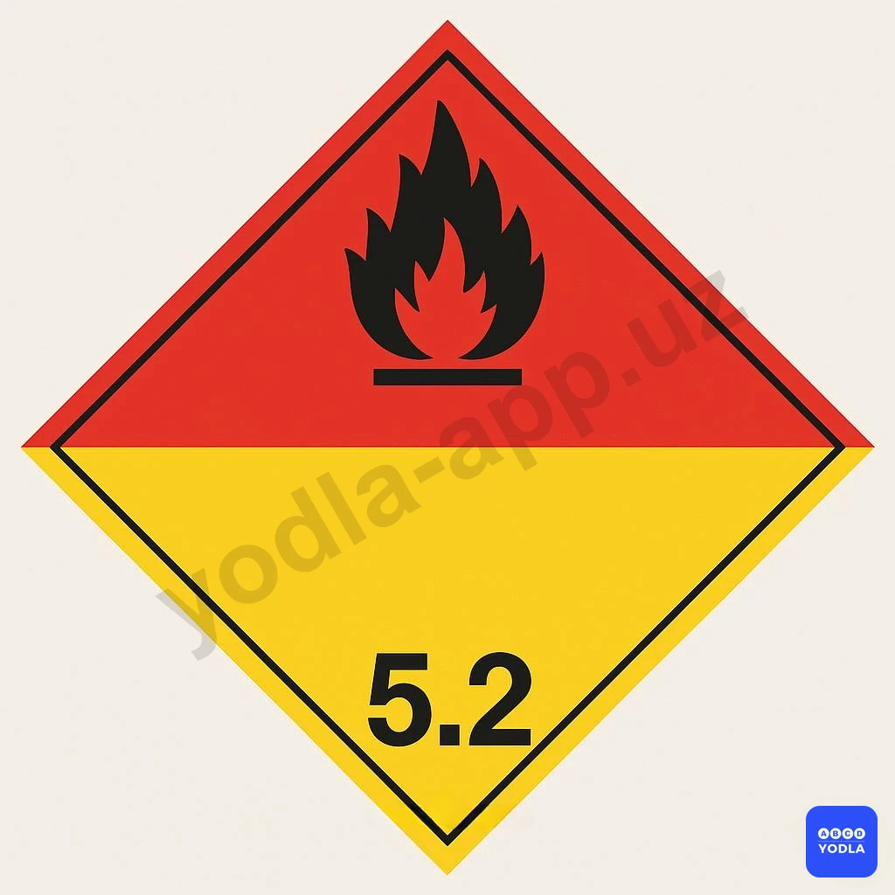
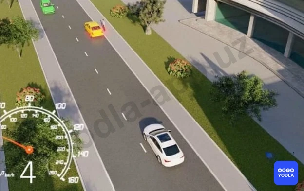
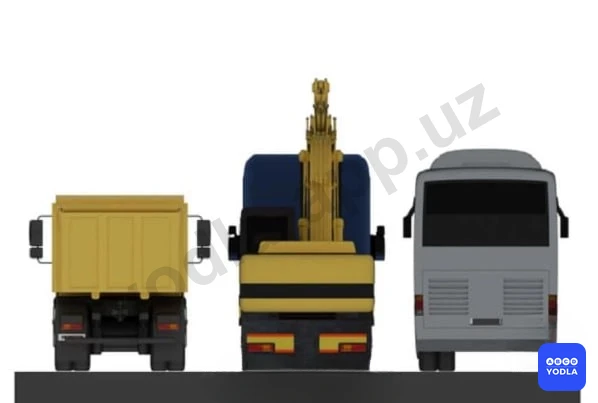

# Bilet 56 (PRO)

Всего вопросов: 20

## Вопрос 1

**Правила для легковых автомобилей, выпущенных до 01.01.1981 г. какой норматив эффективности работы тормозной системы допускается при движении со скоростью 40км/с при торможении?**

⬜ A. 7,2 m
⬜ B. 12,2 m
⬜ C. 19,5 m
⬜ D. 25 m
✅ E. 14,5 m

> 💡 ПДД приложение № 1: 2.5. Движение без остановки запрещено.
Запрещается движение без остановки перед стоп-линией, а если ее нет — перед краем пересекаемой проезжей части. Водитель должен уступить дорогу транспортным средствам, движущимся по пересекаемой, а при наличии дополнительного дорожного знака 7.13 — по главной дороге.
Этот дорожный знак может быть установлен перед железнодорожным переездом или карантинным постом. В этих случаях водитель должен остановиться перед стоп-линией, а при ее отсутствии — перед знаком.

---

## Вопрос 2

**Данное транспортное средство к какой категории относится?**

✅ A. M1
⬜ B. M2
⬜ C. N1
⬜ D. O1

> 💡 ПДД приложение № 1: 3.18.2. Поворот налево запрещен.

---

## Вопрос 3

**Как называется этот предупреждающий знак?**

⬜ A. Окисляющие вещества
✅ B. Органические пероксиды
⬜ C. Легковоспламеняющиеся газы и жидкости

> 💡 Пункта 119 главы 18 ПДД гласит:
В случаях, когда движение через переезд запрещено, водитель должен остановиться у стоп-линии, дорожного знака 2.5 или светофора, если их нет — не ближе 5 м от шлагбаума, а при отсутствии шлагбаума — не ближе 10 м до ближайшего рельса.

---

## Вопрос 4

**При движении по кривой дороге автомобиль более устойчив; если движение осуществляется:**

✅ A. С включенной передачей
⬜ B. С выключенной передачей
⬜ C. С увеличением скорости

> 💡 При движении автомобиля на повороте возникает центробежная сила. Если поворот направо, существует вероятность выезда на полосу встречного движения; если налево — на обочину или за пределы дороги. При отключённой передаче автомобиль продолжает движение самостоятельно, и управление становится сложнее. Поэтому, приближаясь к повороту, оцените его крутизну и свою скорость, и продолжайте движение, не отключая механизм передачи.

---

## Вопрос 5

**Какие колеса автомобиля более подвержены торможению «со скольжением»?**

✅ A. Задние колеса
⬜ B. Передние колеса

> 💡 Под воздействием инерционной силы при торможении происходит перераспределение веса на оси. Вес увеличивается на переднюю ось и уменьшается на заднюю. Чем выше скорость торможения, тем более заметно перераспределение нагрузки на оси. С уменьшением нагрузки на заднюю ось уменьшается сцепление колеса с дорогой, что может привести к скольжению (движению без вращения колеса) и заносу автомобиля. Увеличение нагрузки на переднюю ось повышает сцепление колеса с дорогой, что снижает вероятность скольжения.

---

## Вопрос 6

**Вы остановились на подъеме в ожидании разрешающего сигнала светофора. При этом удерживать автомобиль на месте , лучше всего:**

✅ A. Стояночным тормозом
⬜ B. За счет пробуксовки сцепления при включенной первой передаче
⬜ C. ��ыключенным двигателем, с включенной пониженной передачей
⬜ D. Рабочим тормозом

> 💡 Рабочий (основной) тормоз предназначен для постоянного использования во время движения автомобиля и служит водителю для замедления или остановки движения автомобиля с различной интенсивностью. Стояночный тормоз предназначен для предотвращения скатывания автомобиля при длительной стоянке или стоянке.
На подъеме в ожидании разрешающего сигнала светофора удерживать автомобиль на месте лучше всего стояночным тормозом ("ручником"), т.к. это минимизирует риск того, что автомобиль скатится вниз.

---

## Вопрос 7

**Если сила тяги на колесах будет превышать силу сцепления колес с дорогой, то:**

⬜ A. Двигатель заглохнет
⬜ B. Увеличится износ деталей сцепления
✅ C. Ведущие колеса будут пробуксовывать

> 💡 При трогании с места возникает большая сила инерции, и для её преодоления необходимо приложить значительную тяговую силу к ведущим колесам. Во время равномерного движения по горизонтальной дороге с небольшой скоростью сила сопротивления невелика, и для её преодоления требуется меньшая тяговая сила. При избыточной тяге управляемые колёса могут пробуксовывать.

---

## Вопрос 8

**Какая из показанных автоцистерн более устойчива при повороте?**

⬜ A. Наполненная жидкостью на 75%
✅ B. Наполненная жидкостью полностью

> 💡 Потере устойчивости грузового автомобиля может способствовать незакрепленный груз. При движении на повороте незакрепленный груз может перемещаться по грузовой платформе и, ударяя в ее борт, приводить к опрокидыванию автомобиля. Аналогичные явления происходят при движении автомобильной цистерны с текучим грузом. При движении автомобиля с жидким грузом происходят перемещения груза от одного борта к другому. Раскачиваясь и ударяя в борта, жидкий груз также может вызвать потерю устойчивости автомобиля.

---

## Вопрос 9

**При возникновении заноса в результате торможения водитель должен:**

✅ A. Прекратить начатое торможение
⬜ B. Выключить сцепление
⬜ C. До предела нажать тормозную педаль
⬜ D. Выключить сцепление и тормозить стояночным тормозом

> 💡 Занос на скользкой дороге может возникнуть при торможении из-за блокировки задних колес автомобиля. В этом случае необходимо в первую очередь устранить причину заноса, то есть прекратить начатое торможение. В дальнейшем поворотом рулевого колеса в сторону заноса можно выровнять траекторию движения автомобиля.

---

## Вопрос 10

**Чем может быть вызвано боковое скольжение автомо­биля?**

⬜ A. Только резким поворотом
⬜ B. Только резким торможением
⬜ C. Резким разгоном и резким торможением
✅ D. Во всех перечисленных случаях

> 💡 Боковое скольжение автомобиля может быть вызвано резким поворотом, торможением или разгоном.

---

## Вопрос 11

**Что должен делать водитель автомобиля для прекращения начавшегося заноса задней оси заднеприводного автомобиля?**

⬜ A. Повернуть рулевое колесо в сторону;
✅ B. Повернуть рулевое колесо в сторону начавшегося заноса.
⬜ C. Нажать на педаль тормоза

> 💡 Занос на скользкой дороге может возникнуть из-за резкого поворота рулевого колеса. В этом случае необходимо быстро, но плавно повернуть рулевое колесо в сторону заноса и, не дожидаясь прекращения скольжения, опережающим воздействием на рулевое колесо выровнять траекторию движения автомобиля.

---

## Вопрос 12

**Какой прием торможения обеспечивает безопасную остановку заднеприводного автомобиля на скользкой дороге?**

⬜ A. Резкое нажатие на педаль тормоза без выключение сцепления
✅ B. Прерывистое торможение без выключения сцепления
⬜ C. Tорможение с выключенным сцеплением

> 💡 На скользкой дороге следует тормозить прерывистым нажатием на педаль тормоза, не выключая сцепление и передачу, используя торможение двигателем и не допуская блокировки (движение «юзом») колес.

---

## Вопрос 13

**В каком случае устойчивость автомобиля против опрокидывания повышается?**

⬜ A. Центр тяжести смешен вправо
⬜ B. Центр тяжести расположен высоко
✅ C. Центр тяжести расположен низко

> 💡 Автомобиль без груза и пассажиров более устойчив на повороте, так как у такого автомобиля самое низкое расположение центра тяжести, а значит, самый маленький опрокидывающий момент.

---

## Вопрос 14

**Как остановить автомобиль в случае внезапного отказа рабочего тормоза?**

✅ A. Перейти на низшую передачу; затормозить стояночным тормозом. При необходимости воспользоваться каким-либо препятствием
⬜ B. Выключить сцепление и резко тормозить стояночным тормозом

> 💡 Ситуация с внезапным отказом рабочего тормоза может иметь множество оттенков: скорость автомобиля, работоспособность стояночного тормоза, плотность потока, ширина дороги, пешеходы, зеленые насаждения, плотность застройки, встречные транспортные средства и многое-многое другое. Также много может быть принято решений. Отсюда понятно, что на вопрос «Что делать, когда отказали тормоза?» нельзя дать один ответ, приемлемый во всех случаях. Итак, в опасной ситуации самое главное: сохранять спокойствие и уверенность в себе; уметь быстро дать оценку сложившейся ситуации; принять такое решение, которое не причинит вреда и не подвергнет риску жизнь людей; выполняя принятое решение, быть всегда готовым к изменению своей тактики, так как ситуация может измениться.

---

## Вопрос 15

**Чем может быть вызвано интенсивное перемещение вперед пассажиров и неукрепленного груза?**

⬜ A. Только резким разгоном
✅ B. Только резким торможением
⬜ C. Резким разгоном и резким торможением

> 💡 Водитель, пассажиры, а также незакрепленный груз при резком торможении или столкновении, после мгновенной остановки автомобиля еще продолжают двигаться, сохраняя скорость движения, которую автомобиль имел перед остановкой. Именно в это время происходит большая часть травм в результате удара головой о ветровое стекло, грудью о рулевое колесо и рулевую колонку, коленями о нижнюю кромку щитка приборов. Из-за смещения груза автомобиль может потерять устойчивость и опрокинуться. Поэтому перед началом движения водителю и пассажирам необходимо пристегнуться ремнями безопасности и целесообразно закрепить груз.

---

## Вопрос 16

**Какие опасные последствия может вызвать резкое открытие дроссельной заслонки на скользкой дороге?**

⬜ A. Выход из строя деталей карбюратора
⬜ B. Прекращение работы двигателя
✅ C. Боковой занос автомобиля

> 💡 Открытие дроссельной заслонки карбюратора происходит при нажатии на педаль газа. При резком открытии дроссельной заслонки на скользкой дороге произойдет пробуксовка ведущих колес и возможен боковой занос автомобиля. Вряд ли карбюратор сломается при резком нажатии на педаль газа. Двигатель не прекращает работу при нажатии на педаль газа, а наоборот, начинает интенсивнее работать.

---

## Вопрос 17

**Какой из указанных автомобилей наиболее устойчив против опрокидывания?**

⬜ A. Автобус при наличии в нем стоящих пассажиров
⬜ B. Автокран
✅ C. Порожний грузовой автомобиль

> 💡 Более устойчив на повороте автомобиль без груза и пассажиров, так как у такого автомобиля самое низкое расположение центра тяжести, а значит, самый маленький опрокидывающий момент.

---

## Вопрос 18

**Как влияет торможение "юзом' на тормозной путь при сухом состоянии дороги?**

⬜ A. Тормозной путь уменьшается
⬜ B. Тормозной путь не изменяется
✅ C. Тормозной путь увеличивается

> 💡 Уменьшение тормозного пути достигается торможением на грани блокировки, так как заблокированные колеса (торможение «юзом») скользят по дороге, увеличивая при этом тормозной путь.

---

## Вопрос 19

**Какие колеса автомобиля более склонны к затормаживанию на "юз"?**

✅ A. Задние колеса
⬜ B. Передние колеса

> 💡 Под воздействием инерционной силы при торможении происходит перераспределение веса на оси. Вес увеличивается на переднюю ось и уменьшается на заднюю. Чем выше скорость торможения, тем более заметно перераспределение нагрузки на оси. С уменьшением нагрузки на заднюю ось уменьшается сцепление колеса с дорогой, что может привести к скольжению (движению без вращения колеса) и заносу автомобиля. Увеличение нагрузки на переднюю ось повышает сцепление колеса с дорогой, что снижает вероятность скольжения.

---

## Вопрос 20

**В каком случае центробежная сила при повороте уменьшается?**

⬜ A. При резком повороте рулевого колеса в сторону поворота
✅ B. При снижении скорости движения
⬜ C. При уменьшении радиуса поворота

> 💡 При прохождении поворота водителю следует учитывать, что при увеличении скорости движения автомобиля центробежная сила увеличивается пропорционально квадрату скорости, что может привести к опрокидыванию транспортного средства.

---

