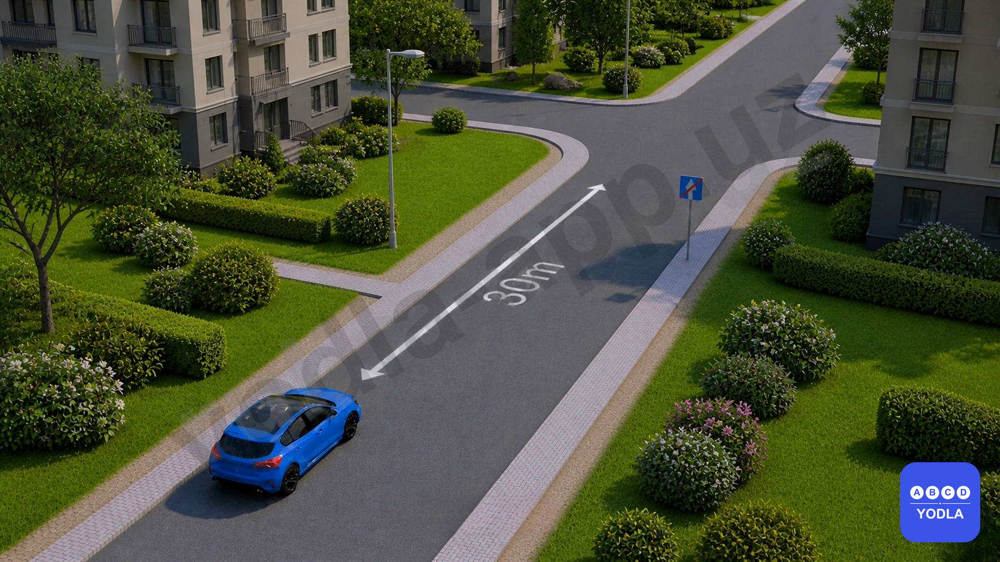
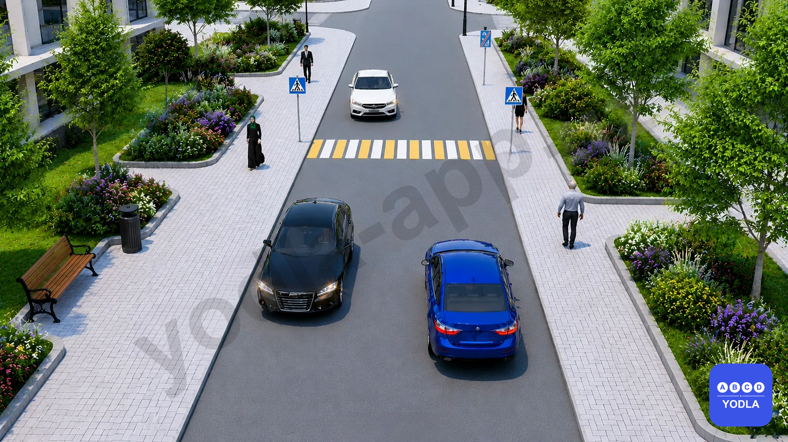
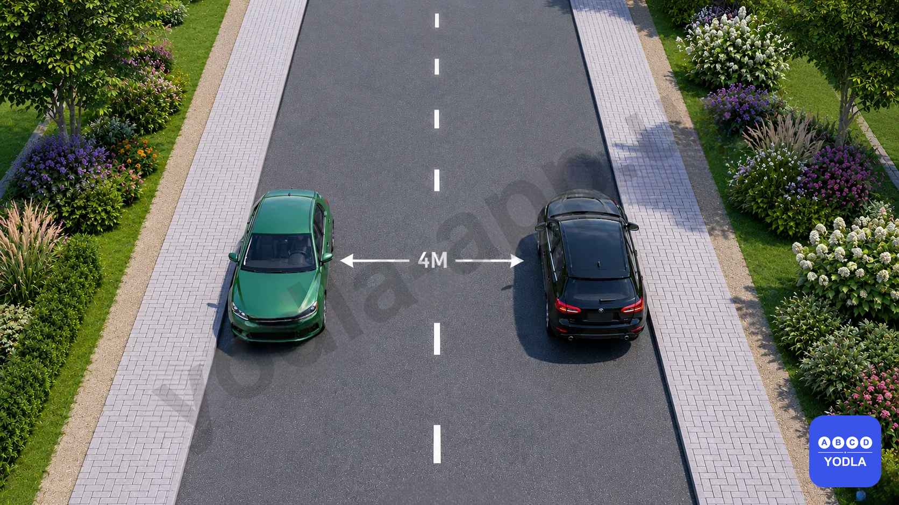
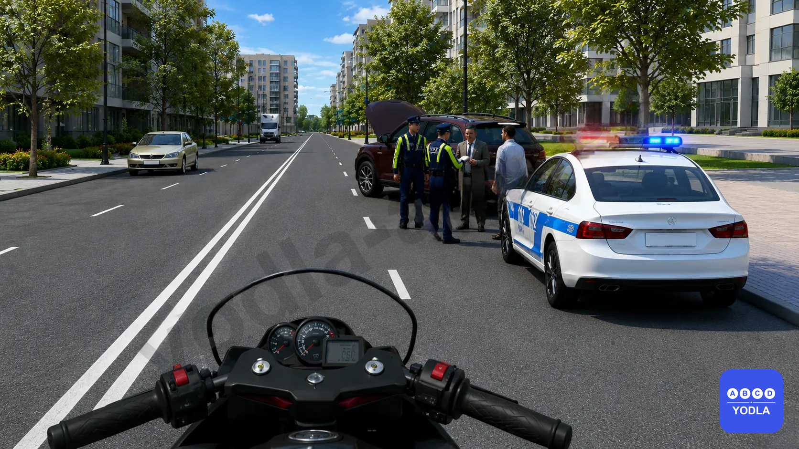
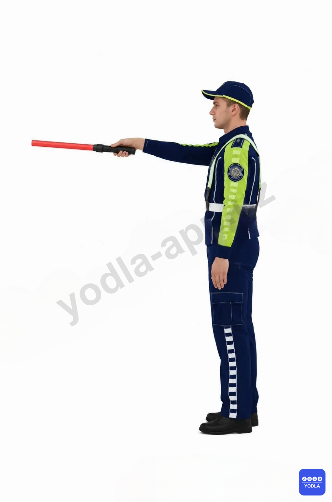

# Bilet 61 (PRO)

Всего вопросов: 20

## Вопрос 1

**Признаки венозного кровотечения**

⬜ A. Розовая кровь бъёт из сосудов пульсацией
✅ B. Из сосудов вытекает темно-красная кровь
⬜ C. Наблюдается приток крови из мелких сосудов к внутренним органам

> 💡 Согласно пункту 137 Правил дорожного движения, противотуманные фары могут использоваться в следующих случаях: в темное время суток на неосвещенных участках дорог совместно с ближним или дальним светом фар.

---

## Вопрос 2

**Можно ли давать еду, воду, лекарства человеку с травмой живота?**

⬜ A. Да
✅ B. Нет

> 💡 Знак 4.1.1 раздела 4 приложения № 1 к ПДД, «Движение прямо». Разрешается движение только в направлениях, указанных на знаках стрелками.
Знак 7.4.1 раздела 7 приложения № 1 к ПДД, «Вид транспортного средства». Указывают вид транспортного средства, на который распространяется действие знака. Дорожный знак 7.4.1 распространяет действие знака на грузовые автомобили, в том числе и с прицепом, с разрешенной максимальной массой более 3,5 т.
Легковому автомобилю разрешено движение в любом направлении.

---

## Вопрос 3

**Первая помощь при травме головы, сотрясении мозга или травме шеи**

✅ A. Пострадавшего кладут на жесткие и плоские носилки, под шею подкладывают подушку и без движения отправляют в больницу
⬜ B. Уложить пострадавшего на бок, подложить под шею твердую подушку, туго связать, не шевелясь, и отправиться в больницу
⬜ C. Успокоить пострадавшего, охладить поврежденное место холодной водой или льдом, уменьшить боль и кровотечение

> 💡 Знак 3.17.1 раздела 3 приложения № 1 к ПДД, «Таможня». Запрещается проезд без остановки у таможенного (контрольного) пункта.

---

## Вопрос 4

**Каковы признаки напряжения и растяжения мышц и сухожилий?**

⬜ A. Ощущается боль в пораженной области
✅ B. В месте повреждения возникает отек, ощущается боль, иногда в этой области лопаются мелкие капиллярные сосуды и в результате кровотечения появляются кровоподтеки

> 💡 Согласно абзацу третьего пункта 98 Правил дорожного движения, транспортные средства, движущиеся на перекрестке с круговым движением, имеют приоритет (преимущество) по отношению к транспортным средствам, въезжающим на перекресток.

---

## Вопрос 5

**Каковы признаки шока?**

⬜ A. Воспаление кожи и слизистых оболочек
⬜ B. Сильное потоотделение
⬜ C. Сухость натощак, жажда, учащенное дыхание
⬜ D. Потеря памяти, бессознательное состояние
✅ E. Все вышеперечисленное

> 💡 ПДД общие положения: Безопасность дорожного движения состояние дорожного движения, отражающее степень защищенности его участников от дорожно-транспортных происшествий и их последствий.

---

## Вопрос 6

**В каких случаях следует начинать сердечно-легочную реанимацию пострадавшего?**

⬜ A. При наличии болей в области сердца и затрудненного дыхания
⬜ B. При отсутствии у пострадавшего сознания, независимо от наличия дыхания.
✅ C. При отсутствии у пострадавшего сознания, дыхания и кровообращения.

> 💡 Согласно предмету Первой помощи при дорожно-транспортных происшествиях, пострадавшему следует начать сердечно-легочную реанимацию, при отсутствии у пострадавшего сознания, дыхания и кровообращения.

---

## Вопрос 7

**Как оказывается первая помощь при переломах конечностей, если отсутствуют транспортные шины и подручные средства для их изготовления?**

✅ A. Верхнюю конечность, согнутую в локте, подвешивают на косынке и прибинтовывают к туловищу. Нижние конечности прибинтовывают друг к другу, обязательно проложив между ними мягкую ткань
⬜ B. Верхнюю конечность, вытянутую вдоль тела, прибинтовывают к туловищу. Нижние конечности прибинтовывают друг к другу, проложив между ними мягкую ткань
⬜ C. Верхнюю конечность, согнутую в локте, подвешивают на косынке и прибинтовывают к туловищу. Нижние конечности плотно прижимают друг к другу и прибинтовывают

> 💡 Согласно пункту 105 Правил дорожного движения, на перекрестке равнозначных дорог водитель безрельсового транспортного средства обязан уступить дорогу транспортным средствам, приближающимся справа. Этим же правилом должны руководствоваться между собой водители трамваев. На таких перекрестках трамвай имеет право на приоритет движения перед безрельсовыми транспортными средствами, независимо от направления его движения.
Согласно пункту 107 Правил дорожного движения, при повороте налево или развороте водитель безрельсового транспортного средства обязан уступить дорогу транспортным средствам, движущимся по равнозначной дороге со встречного направления прямо или направо, а также производящим обгон в разрешенных случаях. Этим же правилом должны руководствоваться между собой водители трамваев.
На этом перекрестке , красный автомобиль начинает движение и останавливается на перекрестке, чтобы пропустить синий. Зеленый автомобиль пересекает перекресток первым, синий вторым, а красный автомобиль последним, завершая движение.

---

## Вопрос 8

**Категория L — это?**

⬜ A. Грузовые автомобили
✅ B. Мототранспортные средства
⬜ C. Пассажирские транспортные средства

> 💡 На основании пункта 7.22 абзаца 25 Приложения 3 к ПДД: Категория L — мототранспортные средства.

---

## Вопрос 9

**Какие категории автотранспортных средств могут двигаться в зоне действия данного знака?**

✅ A. Чистые
⬜ B. Средние
⬜ C. Загрязняющие

> 💡 На основании пункта 3.35 Приложения 1 к ПДД: 3.35. На территории экологической зоны запрещено движение автотранспортных средств, имеющих «среднюю» и «вредную» экологические категории.
Знак 3.35 устанавливается на расстоянии 150 – 300 метров до въезда в экологическую зону.

---

## Вопрос 10

**На двусторонней дороге имеется неподвижный предмет (бочка, мешок и т.п.). С какой стороны вы объедете это препятствие?**

⬜ A. С правой и с левой стороны
✅ B. С правой стороны
⬜ C. С левой стороны

> 💡 На основании пункта 76 главы 10 ПДД: 76. На дорогах с двусторонним движением при отсутствии разделительной полосы островки безопасности, тумбы и элементы дорожных сооружений (опоры мостов, путепроводов и тому подобное), находящиеся на середине проезжей части, водитель должен объезжать справа, если дорожные знаки и дорожная разметка не предписывают иное.

---

## Вопрос 11

**Разрешена ли стоянка автомобиля в этом месте?**

✅ A. Разрешена
⬜ B. Запрещена

> 💡 На основании главы 13 ПДД, пункта 88, абзаца 2 и пункта 91, абзаца 13: В населенных пунктах на дорогах с отсутствием трамвайных путей посередине, имеющих по одной полосе в каждом направлении, а также с организацией одностороннего движения разрешается остановка и стоянка на левой стороне дороги.
91. Остановка запрещается в следующих местах: на пересечении проезжих частей и ближе 30 м от края пересекаемой проезжей части, (за исключением стороны напротив бокового проезда трехсторонних пересечений (перекрестков, имеющих сплошную линию дорожной разметки или разделительную полосу).

---

## Вопрос 12

**На каком рисунке показан правильный вариант обгона?**

⬜ A. 1
⬜ B. 3
✅ C. 2 и 3
⬜ D. 3 и 4

> 💡 На основании Приложения 2 к ПДД, пункта 1.1 и абзаца 44, пункта 1.11 и абзаца 49, а также главы 12 ПДД, пункта 86, абзаца 2: 1.1 — разделяет транспортные потоки противоположных направлений. Линии 1.1 и 1.3 пересекать запрещается, кроме случая, когда линия 1.1 применена для обозначения края проезжей части. 
1.11 — разделяет транспортные потоки противоположных или попутных направлений на участках дорог, где перестроение разрешено только из одной полосы; обозначает места, предназначенные для разворота, въезда и выезда со стояночных площадок и т. п., где движение разрешено только в одну сторону. Линию 1.11 разрешается пересекать со стороны прерывистой, а также и со стороны сплошной, но только при завершении обгона или объезда.
86. Обгон запрещен: на регулируемых перекрестках.

---

## Вопрос 13

**Какое транспортное средство должно уступить дорогу?**

✅ A. Белый автомобиль
⬜ B. Зеленый автомобиль

> 💡 На основании пункта 75 главы 10 ПДД: 75. Если встречный разъезд затруднен, то водитель на стороне которого имеется препятствие, должен уступить дорогу.

---

## Вопрос 14

**В показанной ситуации какое транспортное средство должно уступить дорогу?**

✅ A. Белый автомобиль
⬜ B. Синий автомобиль

> 💡 На основании пункта 75 главы 10 ПДД: 75. Если встречный разъезд затруднен, то водитель на стороне которого имеется препятствие, должен уступить дорогу.

---

## Вопрос 15

**Разрешена ли остановка в указанном месте?**

⬜ A. Запрещена
✅ B. Разрешена

> 💡 На основании абзаца 8 пункта 91 главы 13 ПДД: 91. Остановка запрещается в следующих местах: в местах, где расстояние между сплошной линией дорожной разметки (кроме обозначающей край проезжей части), разделительной полосой или противоположным краем проезжей части и остановившимся транспортным средством менее 3 м.

---

## Вопрос 16

**Какой сигнал должно подать красное транспортное средство, поворачивающее направо на перекрёстке, транспортному средству впереди?**

⬜ A. Звуковой сигнал
⬜ B. Световые сигналы
✅ C. Необходимо дождаться разрешающего сигнала светофора
⬜ D. Все ответы верны

> 💡 Дорожный знак 5.42 разрешает поворот направо на красный сигнал светофора, уступив дорогу всем. Если впереди находится транспортное средство, движущееся прямо, необходимо дождаться, пока для него загорится зелёный сигнал и оно продолжит движение прямо

---

## Вопрос 17

**Как вы должны поступить в данной ситуации?**

⬜ A. Подать звуковой сигнал и увеличить скорость
✅ B. Снизить скорость до уровня, обеспечивающего возможность немедленной остановки при необходимости
⬜ C. Повернуть налево и объехать препятствие
⬜ D. Продолжить движение без остановки

> 💡 На основании пункта 27 главы 6 ПДД: 27. Приближаясь к стоящему транспортному средству оперативных и специальных служб с включенным проблесковым маячком синего или красного либо синего и красного цветов, водитель должен снизить скорость, чтобы иметь возможность немедленно остановиться в случае необходимости.

---

## Вопрос 18

**В каких направлениях могут двигаться транспортные средства при данном сигнале от регулировщика дорожного движения?**

⬜ A. Трамваям — прямо, безрельсовым транспортным средствам — прямо и направо.

✅ B. Трамваям — налево, безрельсовым транспортным средствам — во всех направлениях.
⬜ C. Во всех направлениях

---

## Вопрос 19

**В каком направлении вы должны продолжить движение при данном сигнале регулировщика?**

⬜ A. Только прямо
⬜ B. Только в обратном направлении
⬜ C. Только налево
✅ D. Только направо

> 💡 Согласно главе 7, пункту 38 Правил дорожного движения:

Если правая рука регулировщика вытянута вперёд, то со стороны его груди всем транспортным средствам разрешается движение только направо.

---

## Вопрос 20

**Разрешена ли остановка в указанном месте?**

⬜ A. Разрешена
✅ B. Запрещена

> 💡 Согласно главе 13, пункту 91 (абзац 7) Правил дорожного движения:

91. Остановка запрещается: на мостах, путепроводах, эстакадах и под ними, если для движения в данном направлении имеется менее трёх полос.

В данной ситуации транспортное средство находится на мосту, поэтому остановка запрещена.

---

