# Bilet 62 (PRO)

Всего вопросов: 20

## Вопрос 1

**Что означает поднятая вверх рука регулировщика на перекрёстке?**

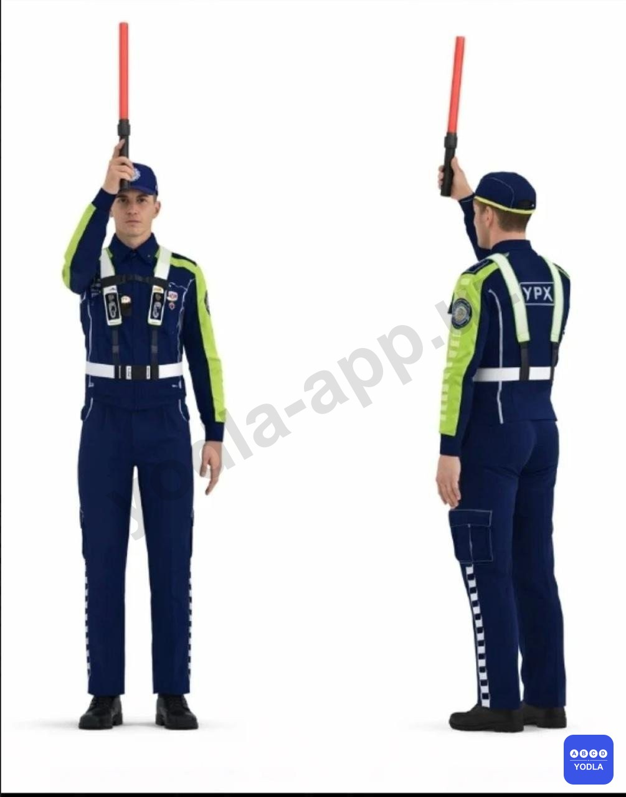

⬜ A. Приоритет светофора
⬜ B. Изменение направления движения
⬜ C. Начало движения
✅ D. Запрещение движения

---

## Вопрос 2

**Разрешена ли остановка в указанном месте?**

✅ A. Разрешена
⬜ B. Запрещена

---

## Вопрос 3

**В каком варианте правильно указан порядок проезда перекрёстка?
**

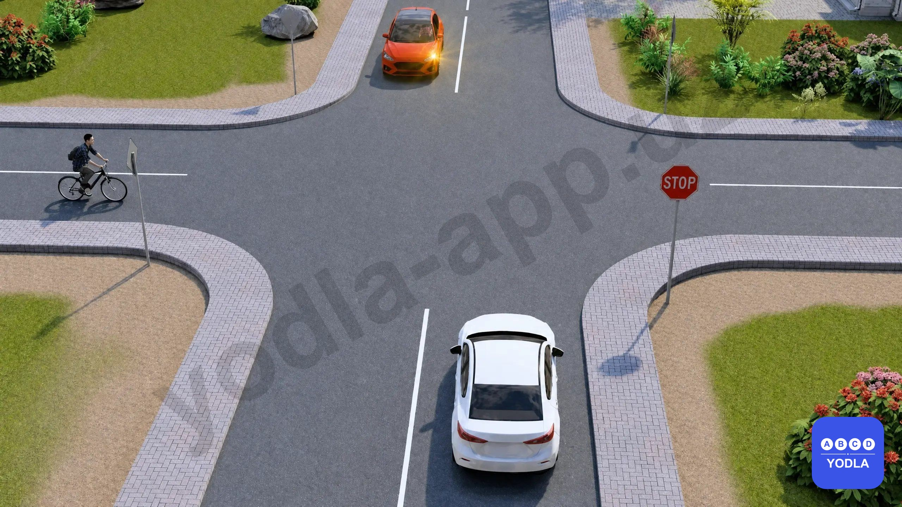

✅ A. Велосипед, белый автомобиль, красный автомобиль
⬜ B. Велосипед, красный автомобиль, белый автомобиль
⬜ C. Красный автомобиль, белый автомобиль, велосипед

---

## Вопрос 4

**Сколько проезжих частей имеет данная дорога?**

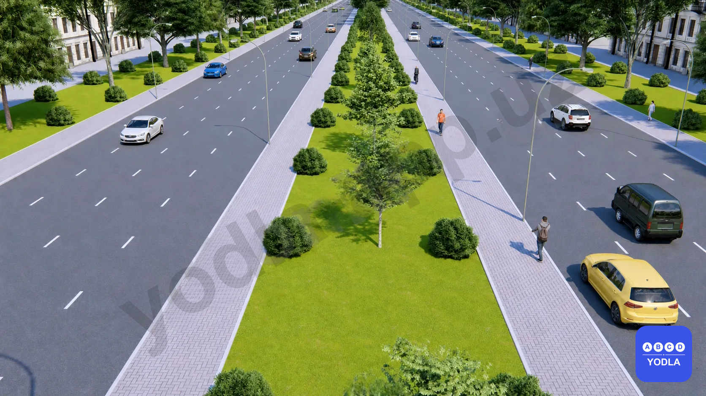

⬜ A. Одна
✅ B. Две
⬜ C. Восемь

> 💡 Согласно пункту 6 Правил дорожного движения:

Разделительная полоса — это часть дороги, разделяющая расположенные рядом проезжие части, не предназначенная для движения или остановки транспортных средств и выделенная газоном, канавой, специальными ограждениями либо приподнятая над уровнем проезжей части.

Поскольку на данной дороге проезжие части разделены разделительной полосой, дорога имеет две проезжие части.

---

## Вопрос 5

**Какой из этих знаков называется «Искусственная неровность»?**

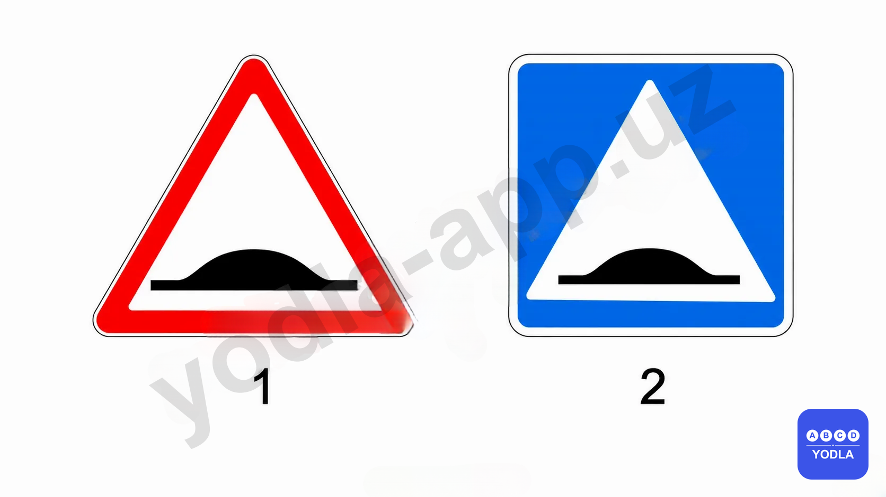

⬜ A. Второй знак
⬜ B. Оба знака
✅ C. Первый знак

---

## Вопрос 6

**Какой световой сигнал вы обязаны включить в данной ситуации?**

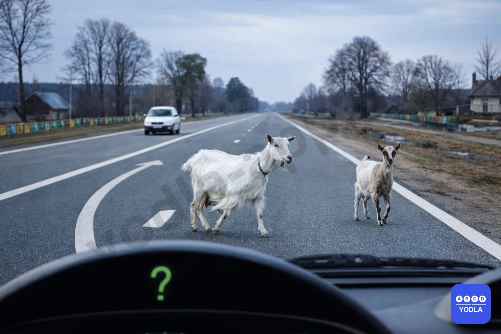

✅ A. Включите указатель левого поворота
⬜ B. Переключите на дальний/ближний свет
⬜ C. Используйте оба одновременно

---

## Вопрос 7

**В каком из указанных направлений разрешено движение?**

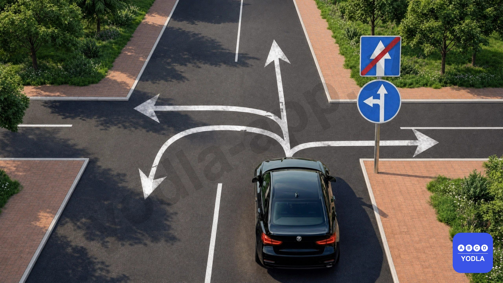

✅ A. Только прямо
⬜ B. Только прямо и налево
⬜ C. Разрешено движение во всех направлениях
⬜ D. Только прямо, налево и на разворот

---

## Вопрос 8

**Как называется данная горизонтальная дорожная разметка?**

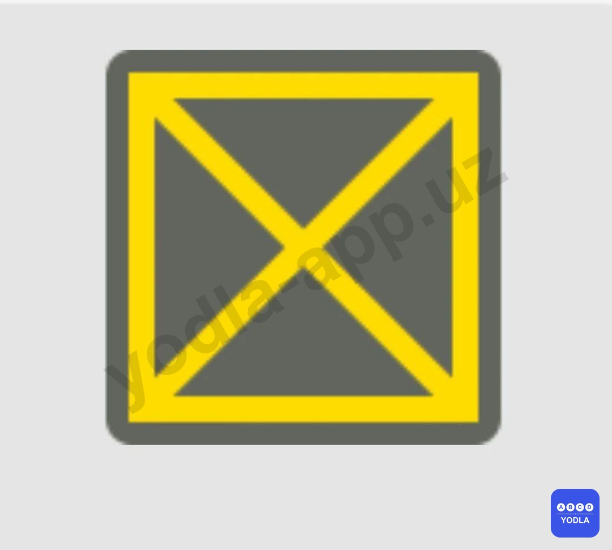

⬜ A. Ширина перекрёстка
✅ B. Зона перекрёстка

---

## Вопрос 9

**Разрешён ли вам обгон?**

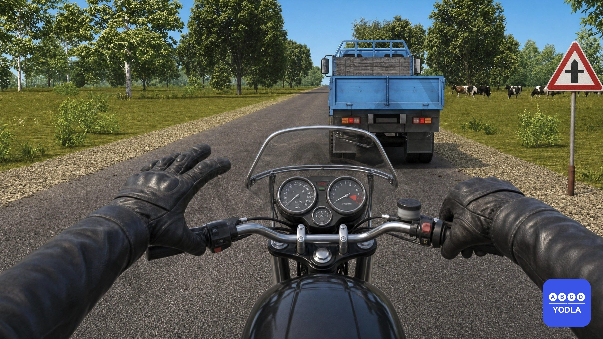

✅ A. Разрешён
⬜ B. Разрешён, если обгон будет завершён до перекрёстка
⬜ C. Запрещён

---

## Вопрос 10

**Какие водители нарушают правила поворота на перекрестке?**

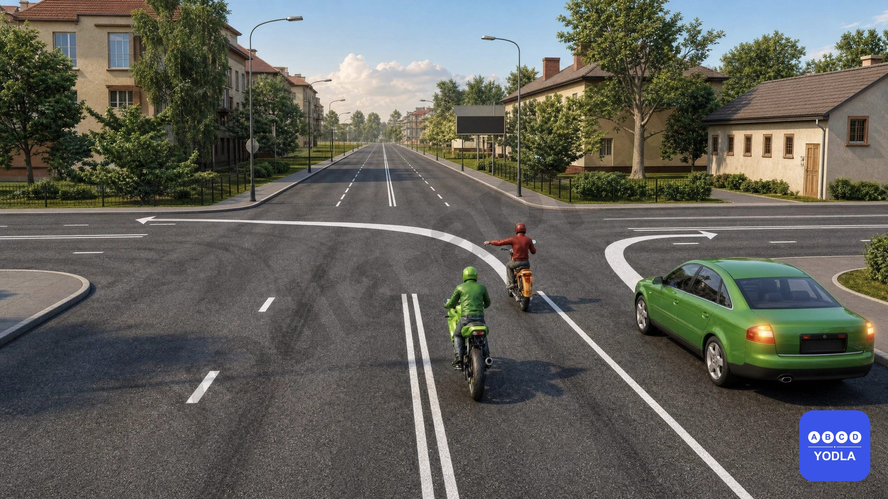

⬜ A. Никто не нарушает правила
⬜ B. Только водитель мотоцикла, поворачивающий налево
✅ C. Оба
⬜ D. Только водитель автомобиля

---

## Вопрос 11

**Транспортные средства каких категорий могут двигаться в зоне действия этого знака?**

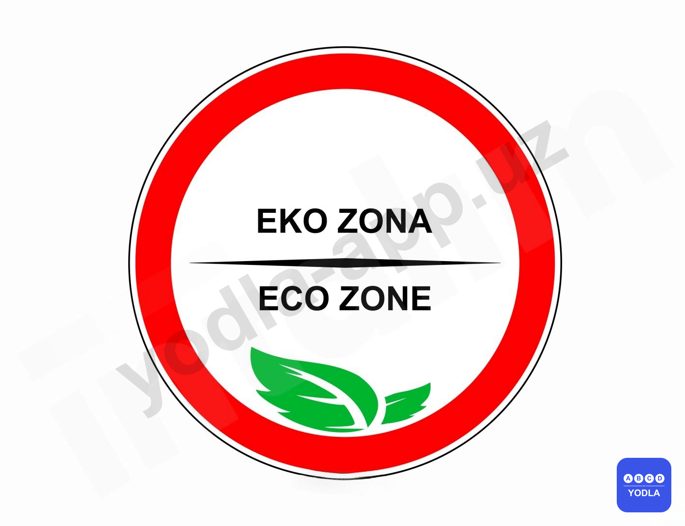

✅ A. Чистый
⬜ B. Вредный
⬜ C. Средний

---

## Вопрос 12

**На двухсторонней дороге находится неподвижный предмет (бочка, мешок, ...). С какой стороны вы его объедете?**

⬜ A. С правой и левой стороны
✅ B. С правой стороны
⬜ C. С левой стороны

---

## Вопрос 13

**В каком направлении разрешено движение?**

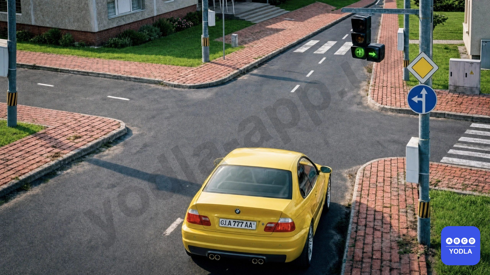

⬜ A. Только прямо
⬜ B. Можно во всех направлениях
✅ C. Прямо, налево и на разворот
⬜ D. Налево и направо
⬜ E. Прямо и налево

---

## Вопрос 14

**В каком направлении разрешен разворот?**

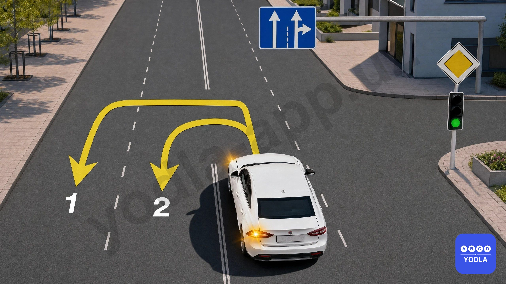

⬜ A. Разрешено по направлению 2
✅ B. В обоих запрещено
⬜ C. Разрешено по направлению 1
⬜ D. Разрешено по обоим направлениям

---

## Вопрос 15

**На каком рисунке показано 4 полосы?**

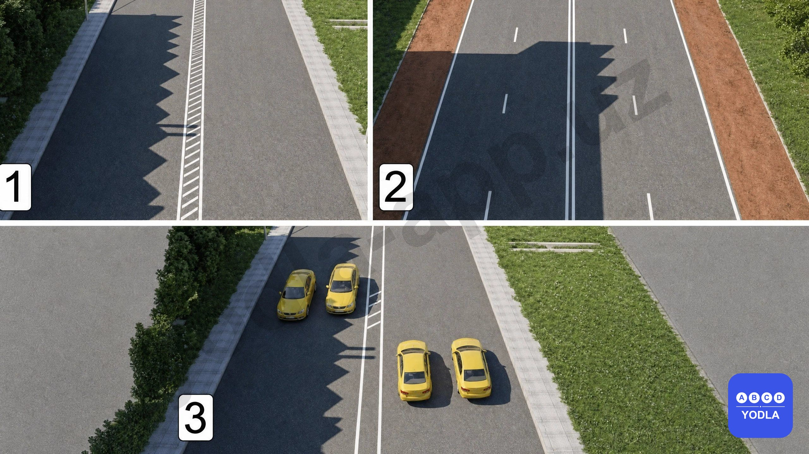

⬜ A. 2 и 3
⬜ B. Только 2
⬜ C. Только 1
✅ D. 1, 2 и 3

---

## Вопрос 16

**В каком направлении разрешено движение этому транспортному средству?**

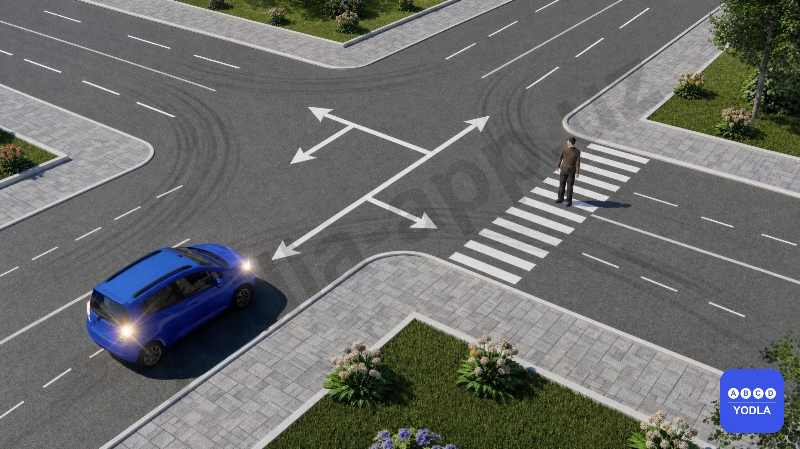

⬜ A. Прямо, направо и назад
⬜ B. Прямо, направо, налево и на разворот
⬜ C. Прямо и направо, не уступая дорогу пешеходу
✅ D. Прямо и направо, уступив дорогу пешеходу

---

## Вопрос 17

**Водитель какого автомобиля должен уступить дорогу?**

✅ A. Водитель чёрного автомобиля
⬜ B. Водитель белого автомобиля

> 💡 Согласно главе 16, пункту 105 (абзац 1) и пункту 106 Правил дорожного движения:

105. На перекрёстке равнозначных дорог водитель безрельсового транспортного средства обязан уступить дорогу транспортным средствам, приближающимся справа. Это правило также распространяется на взаимное движение трамваев.

106. Если направление главной дороги изменяется на перекрёстке, водители, движущиеся по главной дороге, должны руководствоваться правилами проезда перекрёстков равнозначных дорог. Водители, движущиеся по второстепенным дорогам также обязаны соблюдать это правило между собой.

---

## Вопрос 18

**Разрешается ли грузовым автомобилям движение по крайней левой полосе на автомагистралях?**

⬜ A. Разрешается
✅ B. Запрещается

> 💡 Согласно главе 19, пункту 121 (абзац 2) Правил дорожного движения, движение грузовых автомобилей по крайней левой полосе автомагистрали запрещается.

---

## Вопрос 19

**Каким транспортным средствам разрешается движение при данном сигнале регулировщика?**

⬜ A. Зелёному и белому автомобилям
⬜ B. Синему автомобилю и автомобилю ДПС
⬜ C. Только автомобилю ДПС
✅ D. Никому не разрешается

> 💡 Согласно главе 7, пункту 38 и главе 6, пункту 25 (абзац 1) Правил дорожного движения:

38. Если регулировщик поднял руку вверх, движение транспортных средств и пешеходов во всех направлениях запрещается, за исключением случаев, предусмотренных пунктом 42 Правил.

25. Водители транспортных средств оперативных и специальных служб с включёнными проблесковыми маячками синего, красного или одновременно синего и красного цвета при выполнении неотложных служебных обязанностей могут отступать от требований глав 7 (за исключением сигналов регулировщика), 9–16, 19–20 и 22, а также приложений 1 и 2 Правил при условии обеспечения безопасности дорожного движения.

---

## Вопрос 20

**В каких направлениях разрешается движение транспортным средствам на перекрёстке при данном сигнале регулировщика?**

⬜ A. Трамваям — прямо, безрельсовым транспортным средствам — прямо и направо
⬜ B. Во всех направлениях
✅ C. Трамваям — налево, безрельсовым транспортным средствам — во всех направлениях

> 💡 Согласно главе 7, пункту 38 Правил дорожного движения:

38. Если правая рука регулировщика вытянута вперёд, то со стороны его левого бока трамваям разрешается движение налево, а безрельсовым транспортным средствам — во всех направлениях.

---

