# Bilet 63 (PRO)

Всего вопросов: 20

## Вопрос 1

**Что означает сигнал регулировщика, когда его руки вытянуты в стороны?**

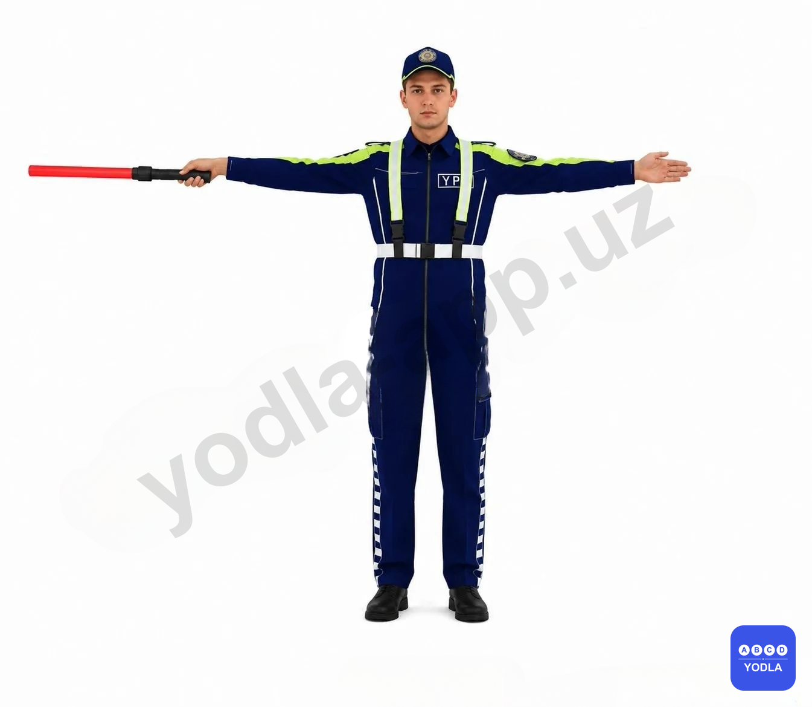

⬜ A. С левой и правой стороны трамваям разрешается движение прямо, безрельсовым транспортным средствам — прямо, направо и налево.
⬜ B. С левой и правой стороны трамваям разрешается движение налево, безрельсовым транспортным средствам — направо.
✅ C. С левой и правой стороны трамваям разрешается движение прямо, безрельсовым транспортным средствам — прямо и направо, а со стороны груди и спины движение запрещено.

> 💡 Согласно главе 7, пункту 38 Правил дорожного движения:

Если руки регулировщика вытянуты в стороны или опущены, то с левой и правой стороны трамваям разрешается движение прямо, а безрельсовым транспортным средствам — прямо и направо. Со стороны груди и спины движение всех транспортных средств запрещается.

---

## Вопрос 2

**В каких направлениях разрешается движение?**

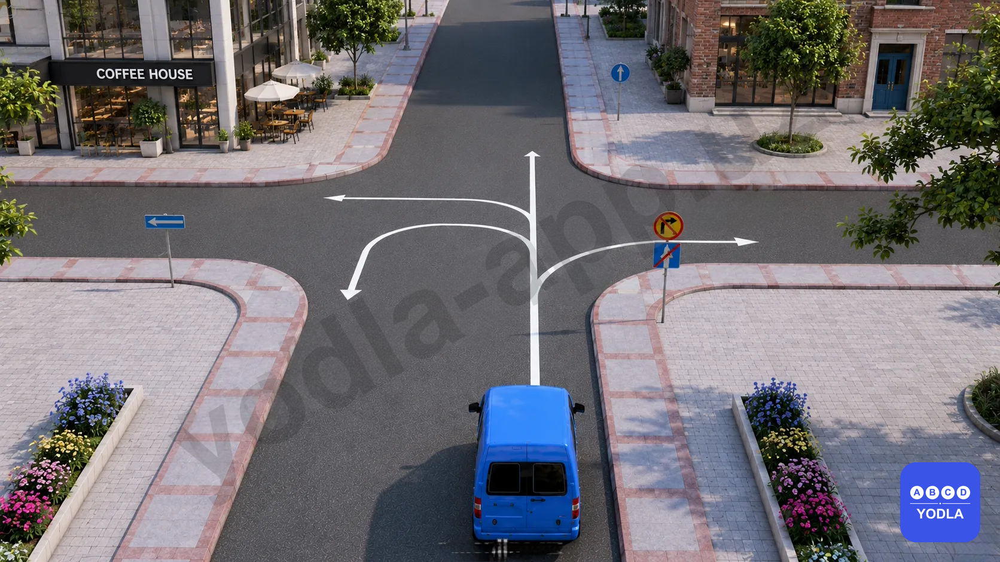

⬜ A. Во всех направлениях, кроме поворота направо и разворота
⬜ B. Во всех направлениях
✅ C. Только прямо
⬜ D. Прямо, налево и на разворот

> 💡 На правой стороне перекрёстка установлен знак «Поворот налево запрещён». Этот знак запрещает водителю повернуть налево.

Кроме того, на левой дороге организовано одностороннее движение. Это видно по синему знаку с белой стрелкой, который показывает, что движение по этой дороге осуществляется слева направо (для вас — влево). Если вы повернёте налево, то окажетесь на полосе встречного движения, что запрещено Правилами дорожного движения.

Повернуть направо также нельзя, поскольку на этой дороге движение организовано таким образом, что въезд с вашего направления запрещён.

Поэтому:

❌ Налево — запрещено.
❌ Направо — запрещено.
❌ Разворот — запрещён.
✅ Разрешено движение только прямо.

---

## Вопрос 3

**Разрешается ли в данном месте остановка для посадки или высадки пассажиров?**

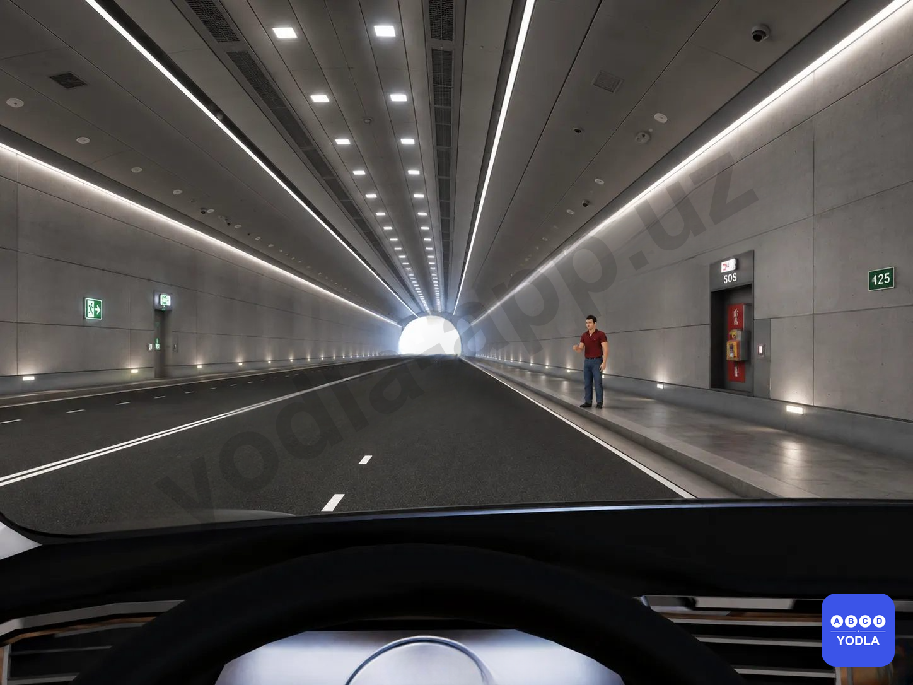

⬜ A. Разрешается
✅ B. Запрещается
⬜ C. Разрешается только водителям такси

> 💡 Согласно главе 13, пункту 91 (абзац 4) Правил дорожного движения:

91. Остановка запрещается: в тоннелях.

Поэтому остановка в тоннеле для посадки или высадки пассажиров также запрещена.

---

## Вопрос 4

**Каким по счёту белый автомобиль проедет перекрёсток?**

⬜ A. Первым
✅ B. Вторым
⬜ C. Третьим
⬜ D. Последним

> 💡 Согласно главе 16, пунктам 104, 105 и 106 Правил дорожного движения:

104. На перекрёстке неравнозначных дорог водитель, движущийся по второстепенной дороге, обязан уступить дорогу транспортным средствам, приближающимся по главной дороге, независимо от направления их дальнейшего движения. Трамвай имеет преимущество перед безрельсовыми транспортными средствами на равнозначной дороге.

105. На перекрёстке равнозначных дорог водитель безрельсового транспортного средства обязан уступить дорогу транспортному средству, приближающемуся справа.

106. Если направление главной дороги изменяется на перекрёстке, водители должны руководствоваться правилами проезда перекрёстков равнозначных дорог.

---

## Вопрос 5

**В каких направлениях вам разрешается продолжить движение?**

✅ A. Только налево
⬜ B. Прямо и налево
⬜ C. Налево и на разворот

> 💡 Согласно Приложению 1, пункту 5.8.2, разделу 5 (Информационно-указательные знаки) и главе 7, пункту 32 Правил дорожного движения:

5.8.2 — знак «Направления движения по полосе» указывает разрешённое направление движения по данной полосе. Движение в других направлениях запрещается.

32. Красные, жёлтые и зелёные сигналы светофора в виде стрелок имеют то же значение, что и круглые сигналы, но распространяются только на указанное направление. Если разворот не запрещён соответствующим дорожным знаком, зелёная стрелка, разрешающая поворот налево, разрешает также разворот.

В данной ситуации, согласно разметке полосы и сигналу светофора, разрешается движение только налево.

---

## Вопрос 6

**В каких направлениях разрешается движение чёрному автомобилю?**

⬜ A. Прямо и налево
⬜ B. Прямо и на разворот
⬜ C. Только прямо
✅ D. Только налево

> 💡 Согласно Приложению 1, пункту 5.8.2, разделу 5 (Информационно-указательные знаки) и главе 7, пункту 32 Правил дорожного движения:

5.8.2 — знак «Направления движения по полосе» определяет разрешённое направление движения по данной полосе. Движение в иных направлениях запрещено.

32. Красные, жёлтые и зелёные сигналы светофора в виде стрелок имеют то же значение, что и круглые сигналы, и распространяются только на указанное направление. Если разворот не запрещён соответствующим дорожным знаком, зелёная стрелка, разрешающая поворот налево, также разрешает разворот.

В данной ситуации чёрному автомобилю, находящемуся на данной полосе, разрешается движение только налево.

---

## Вопрос 7

**В каком направлении разрешается движение белому автомобилю?**

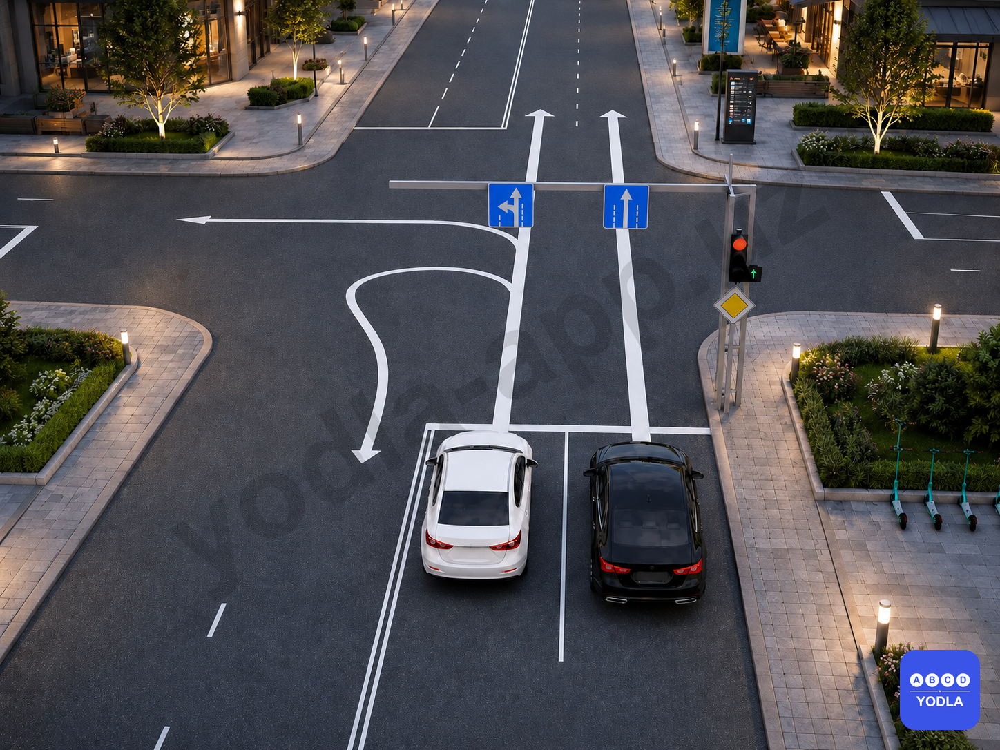

⬜ A. Движение запрещено
⬜ B. Прямо, налево и на разворот
⬜ C. Прямо и налево
✅ D. Только прямо

> 💡 Согласно Приложению 1, пункту 5.8.2, разделу 5 (Информационно-указательные знаки) и главе 7, пункту 32 Правил дорожного движения:

5.8.2 — знак «Направления движения по полосе» определяет разрешённое направление движения по данной полосе. Движение в иных направлениях запрещено.

32. Красные, жёлтые и зелёные сигналы светофора в виде стрелок имеют то же значение, что и круглые сигналы и распространяются только на указанное направление. Если разворот не запрещён соответствующим дорожным знаком, зелёная стрелка, разрешающая поворот налево, также разрешает разворот.

В данной ситуации белому автомобилю, находящемуся на данной полосе, разрешается движение только прямо.

---

## Вопрос 8

**Какое транспортное средство движется правильно?**

⬜ A. Синий автомобиль
✅ B. Белый и синий автомобили
⬜ C. Белый автомобиль
⬜ D. Все неправильно
⬜ E. Все правильно

> 💡 Согласно главе 9, пункту 56 (абзац 1) и пункту 57 (абзац 2) Правил дорожного движения:

56. Перед поворотом направо, налево или разворотом водитель обязан заранее занять соответствующее крайнее положение на проезжей части, предназначенной для движения в данном направлении.

57. При повороте направо транспортное средство должно двигаться как можно ближе к правому краю проезжей части.

В данной ситуации и белый, и синий автомобили движутся в соответствии с Правилами дорожного движения.

---

## Вопрос 9

**Какой из перечисленных опознавательных знаков может быть установлен по желанию водителя?**

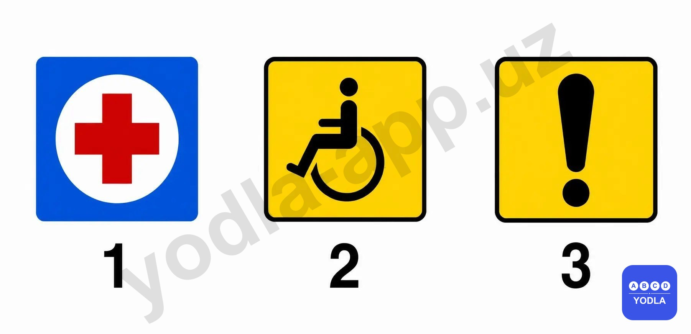

⬜ A. 1, 2
⬜ B. 2, 3
⬜ C. 1, 3
✅ D. Все знаки

> 💡 Согласно Приложению 1 ПДД (Опознавательные знаки транспортных средств):

Некоторые опознавательные знаки являются обязательными, а некоторые могут быть установлены по желанию водителя.

В данном вопросе все знаки под номерами 1, 2 и 3 относятся к опознавательным знакам, которые могут устанавливаться по желанию водителя.

---

## Вопрос 10

**Какой автомобиль, остановившийся из-за затора, не нарушает Правила дорожного движения?**

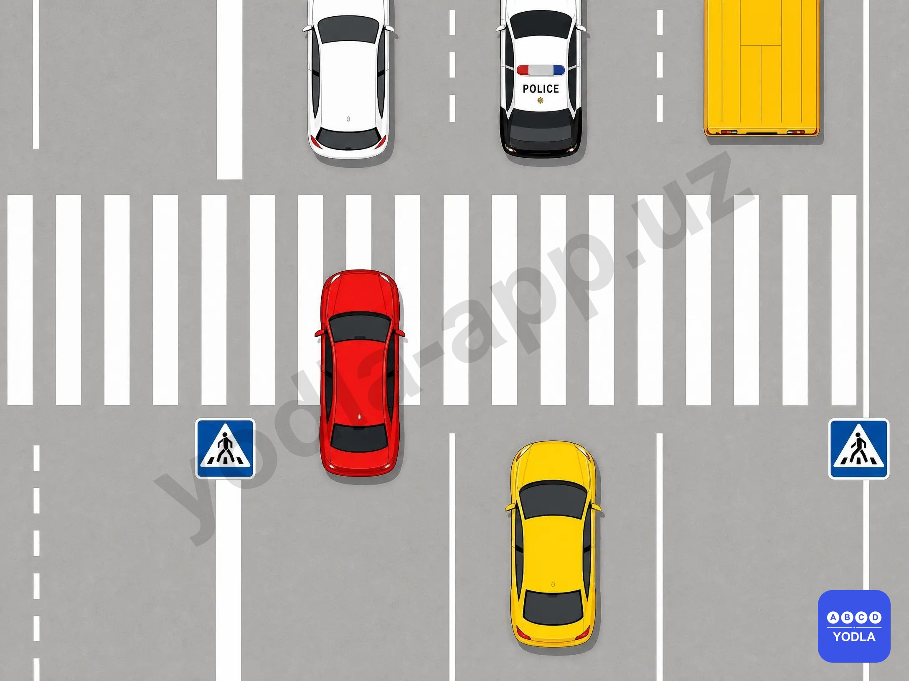

⬜ A. Оба не нарушают
✅ B. Жёлтый автомобиль
⬜ C. Красный автомобиль
⬜ D. Оба нарушают

> 💡 Согласно главе 13, пунктам 91 и 95 Правил дорожного движения:

91. Остановка на пешеходном переходе и ближе 10 метров перед ним запрещена.

95. Если транспортное средство вынуждено остановилось из-за дорожного затора, такая остановка не считается нарушением.

В данной ситуации красный автомобиль оказался на пешеходном переходе из-за затора, а жёлтый автомобиль остановился на безопасном расстоянии от перехода. Следовательно, Правила не нарушает жёлтый автомобиль.

---

## Вопрос 11

**Нарушает ли водитель красного автомобиля Правила дорожного движения?**

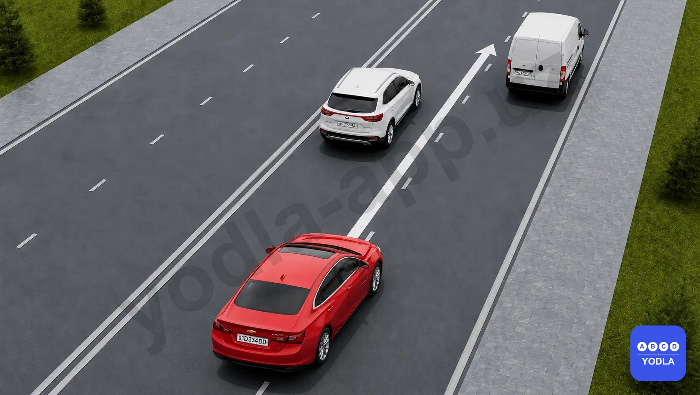

⬜ A. Не нарушает
✅ B. Нарушает

> 💡 Согласно главе 10, пункту 68 Правил дорожного движения:

68. Только транспортные средства, скорость которых не превышает 40 км/ч либо которые по техническим причинам не могут двигаться быстрее, обязаны постоянно двигаться по крайней правой полосе, кроме случаев объезда, обгона, перестроения для поворота налево или разворота.

В данной ситуации белый фургон не является тихоходным транспортным средством. Красный автомобиль движется по левой полосе без необходимости, не выполняя обгон или иной разрешённый манёвр. Следовательно, водитель красного автомобиля нарушает Правила дорожного движения.

---

## Вопрос 12

**В каких направлениях запрещено движение грузовому автомобилю с разрешённой максимальной массой более 3,5 тонны?**

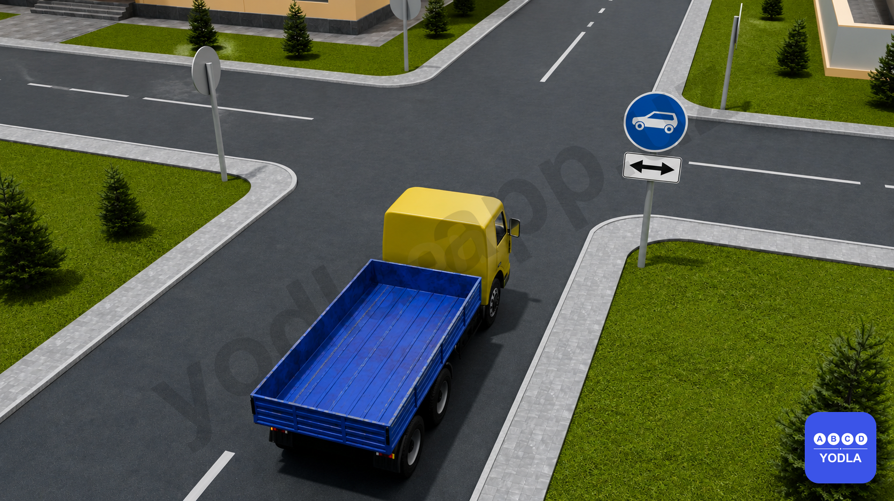

✅ A. Налево и направо
⬜ B. Только прямо
⬜ C. Во всех направлениях

> 💡 Согласно требованиям приложения 1, дорожного знака 4.5.2 и таблички дополнительной информации 7.2.1 Правил дорожного движения:

Знак 4.5.2 «Дорога для легковых автомобилей» вместе с табличкой, указывающей действие в обоих направлениях, означает, что по этой дороге разрешено движение только легковых автомобилей, мотоциклов и иных транспортных средств, которым это разрешено.

Грузовым автомобилям с разрешённой максимальной массой более 3,5 тонны въезд на такую дорогу запрещён. Поэтому им запрещено поворачивать как налево, так и направо.

---

## Вопрос 13

**В каких направлениях разрешено движение?**

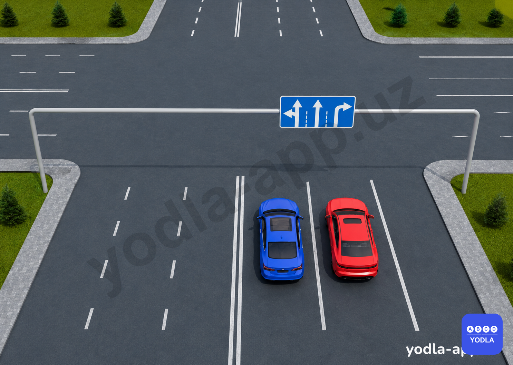

✅ A. Синий — прямо, налево и на разворот; Красный — только прямо.
⬜ B. Синий — налево и прямо; Красный — направо.
⬜ C. Синий — прямо и на разворот; Красный — только прямо.

> 💡 Согласно приложению 1 ПДД, дорожному знаку 5.8.2 «Направления движения по полосам»:

Знак 5.8.2 определяет, в каких направлениях разрешено движение с каждой полосы.

Синий автомобиль находится в левой полосе. С этой полосы разрешается:
поворот налево;
движение прямо;
разворот.
Красный автомобиль находится в правой полосе. С этой полосы разрешается:
только движение прямо.

Следовательно, синий автомобиль может двигаться прямо, налево и выполнять разворот, а красный автомобиль — только прямо.

---

## Вопрос 14

**С какой стороны необходимо объехать синий автомобиль в данной ситуации?**

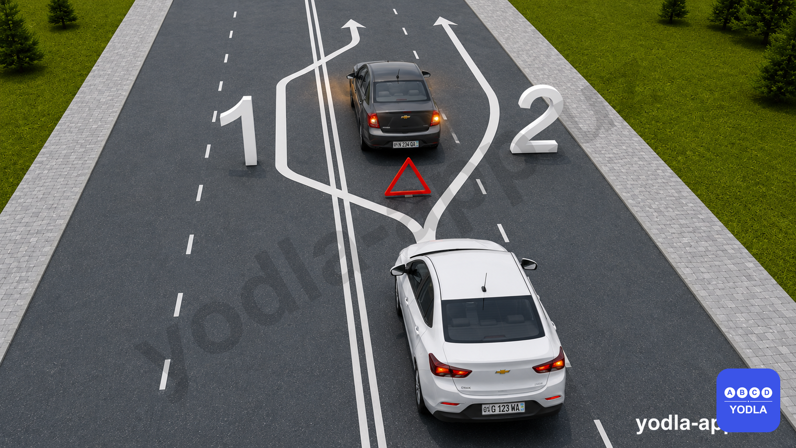

✅ A. Справа
⬜ B. Разрешается объехать с любой стороны
⬜ C. Слева
⬜ D. Объезд запрещён с обеих сторон

> 💡 Согласно главе 11 ПДД (правила обгона и объезда):

Чёрный автомобиль занял положение для выполнения поворота налево.

Белый автомобиль, продолжая движение, должен объехать его справа, а не слева.

Причина:

Чёрный автомобиль уже готовится к повороту налево.
Объезд слева в данной ситуации запрещён и небезопасен.
При наличии свободной полосы справа объезд выполняется именно с правой стороны.

Поэтому в данной ситуации чёрный автомобиль необходимо объехать справа.

---

## Вопрос 15

**Какой знак обозначает полосу для велосипедистов и средств индивидуальной мобильности?**

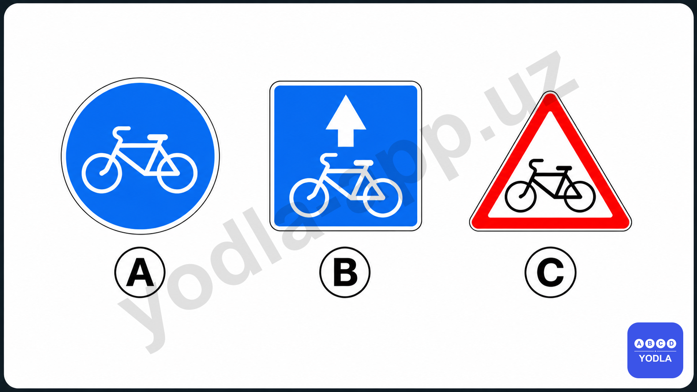

✅ A. B
⬜ B. C
⬜ C. A

> 💡 Согласно информационно-указательным знакам приложения 1 ПДД:

Знак B обозначает полосу движения, предназначенную для велосипедистов и средств индивидуальной мобильности (электросамокатов, сигвеев и др.).

Знак A обозначает велосипедную дорожку, а не полосу движения.
Знак B обозначает полосу для велосипедистов и средств индивидуальной мобильности. ✅
Знак C является предупреждающим знаком, информирующим о возможном появлении велосипедистов.

Поэтому правильный ответ — B.

---

## Вопрос 16

**На каких изображениях пешеход(ы) переходят дорогу, не нарушая Правила дорожного движения?**

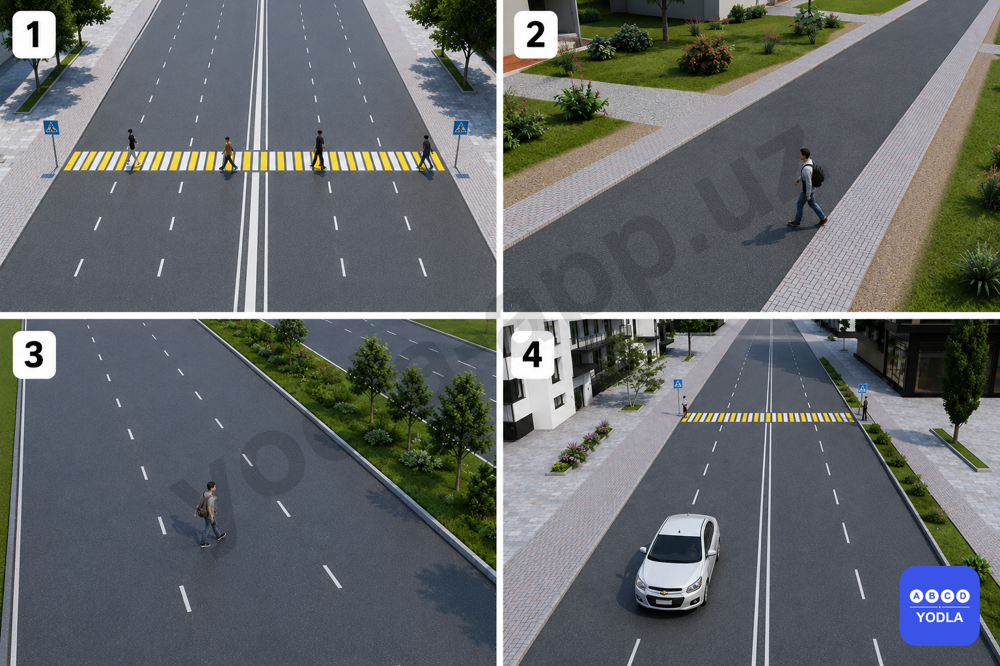

⬜ A. На втором и третьем изображениях
⬜ B. На третьем и четвёртом изображениях
✅ C. На первом, втором и четвёртом изображениях
⬜ D. На втором, третьем и четвёртом изображениях

> 💡 Согласно Правилам дорожного движения для пешеходов:

На изображении 1 пешеходы переходят дорогу по пешеходному переходу. Это разрешено.
На изображении 2 поблизости нет пешеходного перехода, поэтому переход дороги в этом месте допускается.
На изображении 3 пешеход переходит дорогу вне пешеходного перехода, хотя переход находится рядом. Это нарушение Правил.
На изображении 4 пешеход переходит дорогу по обозначенному пешеходному переходу. Это правильно.

Следовательно, на изображениях 1, 2 и 4 пешеходы действуют по Правилам, а на изображении 3 — нарушают их.

---

## Вопрос 17

**Какому транспортному средству разрешён разворот в показанных направлениях?**

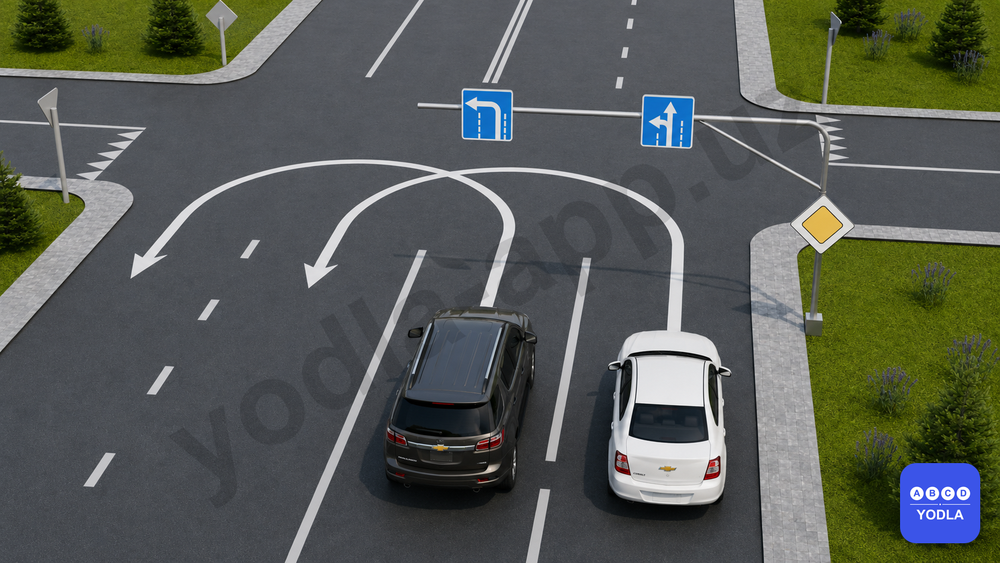

⬜ A. Белому автомобилю
✅ B. Чёрному автомобилю
⬜ C. Разрешено обоим транспортным средствам
⬜ D. Запрещено обоим транспортным средствам

> 💡 Согласно приложению 1 ПДД, дорожному знаку 5.8.2 «Направления движения по полосам»:

Направление движения с каждой полосы определяется дорожными знаками.

Чёрный автомобиль находится на полосе, с которой разрешены поворот налево и разворот. Поэтому ему разрешён разворот.
Белый автомобиль находится на полосе, с которой разрешены только движение прямо и поворот налево. Разворот с этой полосы не разрешён.

Следовательно, разворот разрешён только чёрному автомобилю.

---

## Вопрос 18

**Разрешена ли остановка белому автомобилю в указанном месте?**

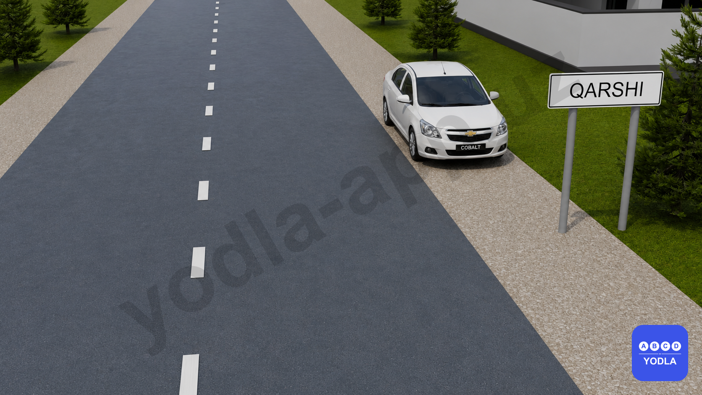

✅ A. Разрешается
⬜ B. Запрещается

> 💡 Согласно главе 9, пункту 87 Правил дорожного движения:

В населённых пунктах остановка транспортных средств разрешается у правого края проезжей части или на обочине, если это не запрещено дорожными знаками или разметкой.

В данной ситуации белый автомобиль остановился на правой обочине. Запрещающих дорожных знаков или разметки нет, поэтому остановка белого автомобиля в этом месте разрешена и не является нарушением.

---

## Вопрос 19

**Запрещена ли остановка белому автомобилю в указанном месте?**

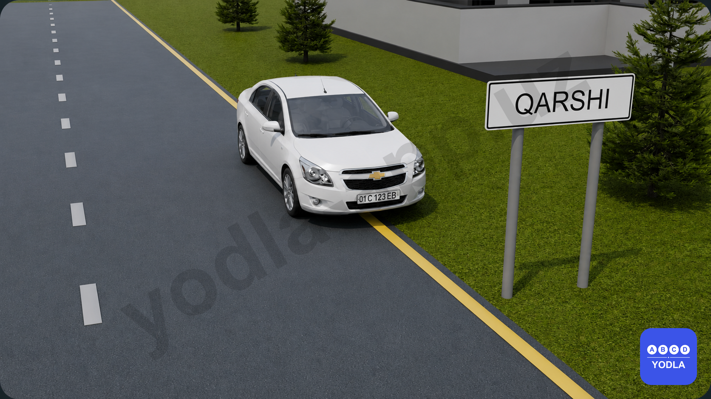

⬜ A. Разрешается
✅ B. Запрещается

> 💡 Согласно главе 9, пункту 88 Правил дорожного движения:

Жёлтая сплошная линия разметки (1.4) обозначает место, где остановка транспортных средств запрещена.

В данной ситуации белый автомобиль остановился у жёлтой сплошной линии, поэтому такая остановка нарушает требования Правил дорожного движения и запрещена.

---

## Вопрос 20

**Для чего разработаны Правила дорожного движения Республики Узбекистан?**

⬜ A. Для государственной регистрации транспортных средств и взыскания штрафов.
⬜ B. Для установления порядка тонировки стёкол автомобилей.
✅ C. Для совершенствования правил дорожного движения, предупреждения дорожно-транспортных происшествий, обеспечения контроля за безопасностью дорожного движения и повышения эффективности организации движения.
⬜ D. Для ремонта дорожных ям и проведения дорожных работ.

> 💡 Согласно пункту 1 Правил дорожного движения Республики Узбекистан:

Правила дорожного движения разработаны для обеспечения безопасности дорожного движения, предупреждения дорожно-транспортных происшествий, установления единого порядка для всех участников дорожного движения и организации безопасного и эффективного движения.

---

