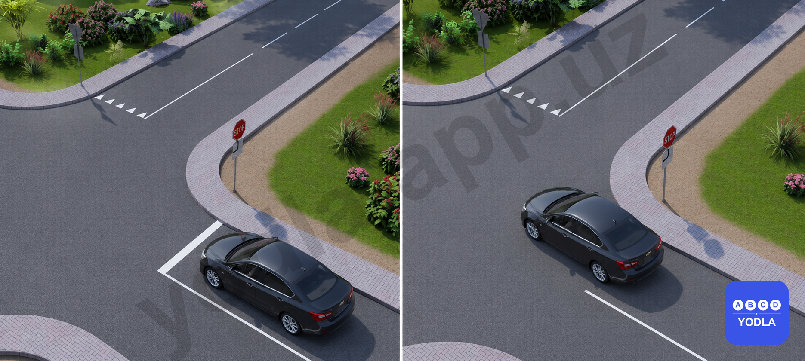
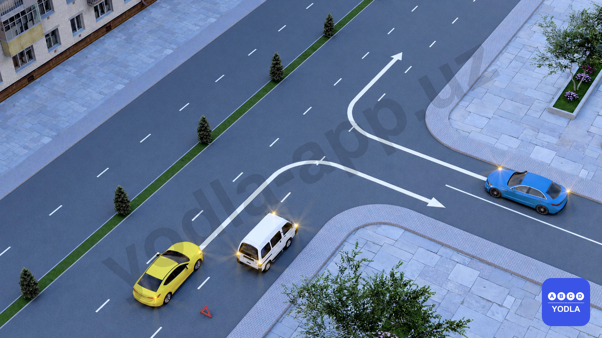
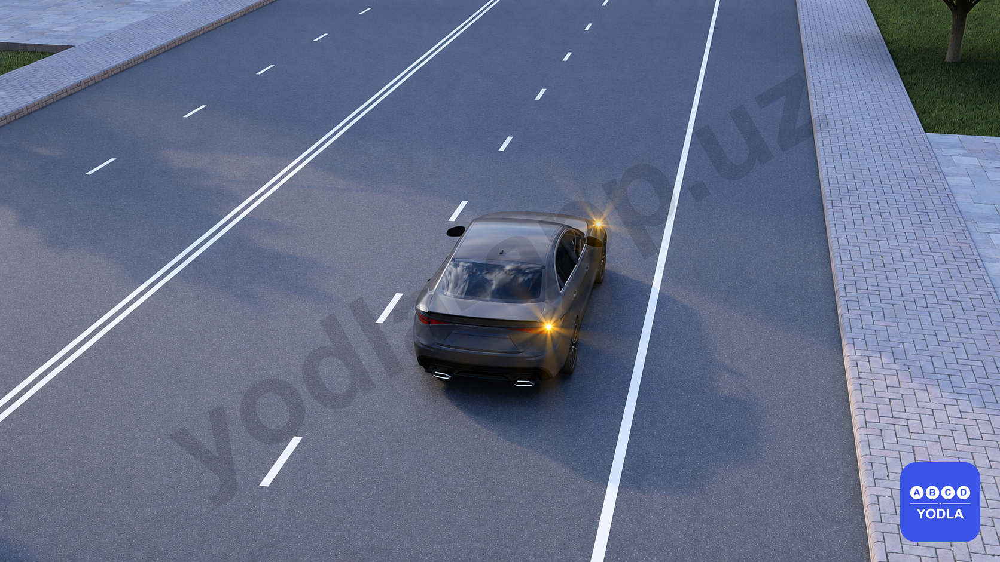

# Bilet 64 (PRO)

Всего вопросов: 4

## Вопрос 1

**На каком рисунке водитель правильно остановился перед стоп-линией?**

✅ A. На обоих рисунках
⬜ B. Только на рисунке 2
⬜ C. Только на рисунке 1

> 💡 Согласно требованиям дорожного знака 5.33 «STOP» и разметки 1.12 «Стоп-линия»:

Водитель обязан остановиться перед стоп-линией. Если стоп-линия отсутствует, необходимо остановиться перед пересекаемой проезжей частью в месте, обеспечивающем хороший обзор.

В данной ситуации:

На рисунке 1 автомобиль остановился перед стоп-линией, как требуют Правила.
На рисунке 2 стоп-линия отсутствует, поэтому водитель остановился перед пересечением проезжей части в безопасном месте.

Следовательно, в обоих случаях водитель выполнил требования Правил.

---

## Вопрос 2

**Какой водитель нарушает Правила дорожного движения?**

⬜ A. Водитель жёлтого автомобиля
✅ B. Водитель синего автомобиля
⬜ C. Нарушают оба водителя
⬜ D. Оба водителя не нарушают

> 💡 Водитель синего автомобиля перед поворотом должен был занять крайнюю полосу, предназначенную для движения в выбранном направлении. Однако он начал поворот направо не из соответствующей полосы.

Водитель жёлтого автомобиля выполняет левый поворот из полосы, предназначенной для этого манёвра, поэтому Правила не нарушает.

Следовательно, нарушает только водитель синего автомобиля.

---

## Вопрос 3

**Разрешено ли данному транспортному средству пересечь сплошную линию и остановиться на обочине?**

⬜ A. Разрешено только в населённых пунктах
✅ B. Разрешается
⬜ C. Разрешается только в случае вынужденной остановки
⬜ D. Запрещается

> 💡 Согласно пункту 9 Правил дорожного движения, пересечение сплошной линии, разделяющей встречные направления движения, запрещено. Исключение предусмотрено для случаев, когда это необходимо для остановки или выезда на обочину.

Поэтому в данной ситуации водитель имеет право пересечь сплошную линию и выехать на обочину для остановки. Правила также предусматривают возможность остановки транспортного средства на правой обочине.

---

## Вопрос 4

**Какова основная цель Закона Республики Узбекистан «О дорожном движении»?**

✅ A. Регулирование отношений в сфере дорожного движения
⬜ B. Выдача разрешений на изменение степени тонировки стёкол автотранспортных средств
⬜ C. Проведение технического осмотра транспортных средств

> 💡 Закон Республики Узбекистан «О дорожном движении» направлен на регулирование отношений в сфере дорожного движения, обеспечение безопасности дорожного движения, а также определение прав и обязанностей участников дорожного движения.

Поэтому основной целью закона является не выдача разрешений на тонировку стёкол и не проведение технического осмотра, а именно регулирование отношений в сфере дорожного движения.

---

