# Коварные вопросы

Всего вопросов: 219

## Вопрос 1

**Как называется этот знак?**

⬜ A. Искусственная неровность
⬜ B. Обязательное снижение скорости
✅ C. Приподнятый пешеходный переход

> 💡 Данный дорожный знак не обозначает искусственную неровность. Он указывает на наличие приподнятого пешеходного перехода.

---

## Вопрос 2

**О чём предупреждает этот знак?**

⬜ A. Впереди крутой подъём
⬜ B. Что впереди разводной мост
✅ C. Искусственная неровность дороги

> 💡 ПДД, Знак 1.31. “Искусственная неровность дороги”.

---

## Вопрос 3

**Разрешается ли Вам выполнить разворот с заездом во двор задним ходом?**

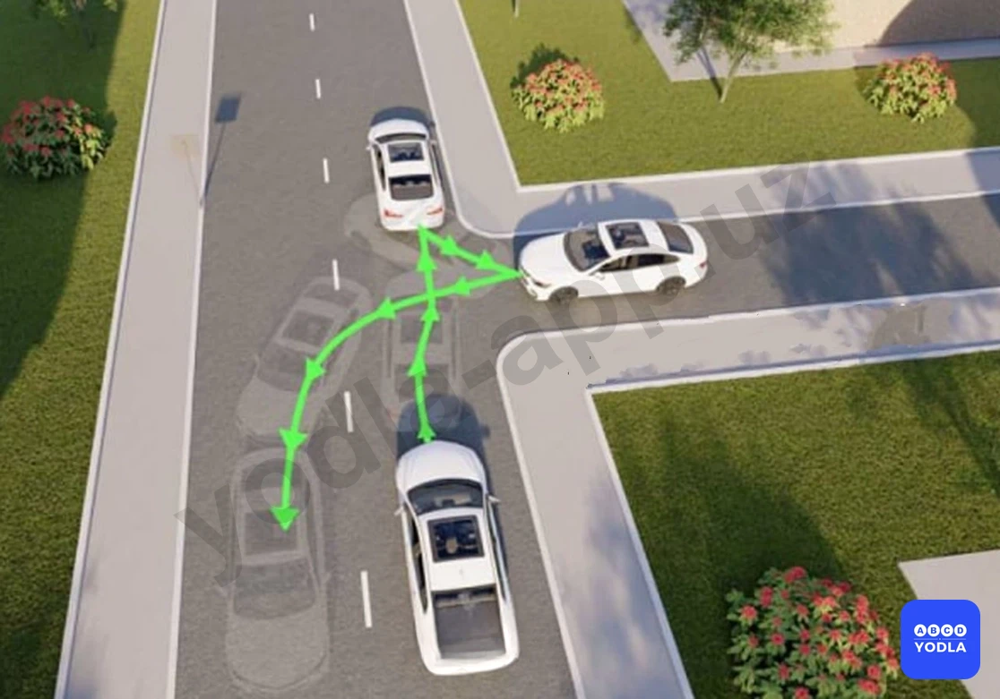

⬜ A. Разрешается
✅ B. Разрешается, если при этом не будут созданы помехи другим участникам движения
⬜ C. Запрещается

> 💡 Движение задним ходом на перекрёстках запрещено, однако при въезде во двор такого запрета нет.

Поэтому въезд во двор задним ходом для выполнения разворота разрешается, если этот манёвр не создаёт помех и не представляет опасности для других участников дорожного движения.

Следовательно, правильный ответ — разрешается, если такой манёвр не создаёт помех другим участникам дорожного движения.

---

## Вопрос 4

**Разрешается ли водителю на данном перекрестке выполнять указанный маневр движением задним ходом?**

⬜ A. Разрешено
✅ B. Запрещено

> 💡 Движение задним ходом на перекрёстках запрещено.

Следовательно, правильный ответ — выполнение данного манёвра не разрешается.

---

## Вопрос 5

**Способ разворота с использованием прилегающей территории слева, обеспечивающий безопасность движения, показан:**

⬜ A. Только на левом рисунке
✅ B. Только на правом рисунке
⬜ C. На обоих рисунках

> 💡 В данной ситуации более безопасным считается вариант, требующий меньшего движения задним ходом. На обоих рисунках показан манёвр разворота, однако следует выбрать вариант, при котором требуется меньше двигаться задним ходом.

Чем меньше расстояние движения задним ходом, тем ниже вероятность столкновения с другими транспортными средствами.

Следовательно, правильный ответ — вариант, требующий меньшего движения задним ходом.

---

## Вопрос 6

**Способ разворота с использованием прилегающей территории справа, обеспечивающий безопасность движения, показан**

✅ A. Только на левом рисунке
⬜ B. Только на правом рисунке
⬜ C. На обоих рисунках

---

## Вопрос 7

**Водитель какого транспортного средства правильно выполняет разворот?**

⬜ A. Водитель синего автомобиля
⬜ B. Водитель синего автомобиля
✅ C. Оба водителя

> 💡 В данной ситуации оба водителя выполнили разворот правильно.

Водитель легкового автомобиля выполнил разворот из крайней левой полосы, что полностью соответствует Правилам дорожного движения.

Если из-за габаритов транспортного средства или по другим причинам выполнить разворот из крайней левой полосы невозможно, допускается выполнение разворота из другой, более правой полосы.

Следовательно, правильный ответ — оба автомобиля выполнили разворот правильно.

---

## Вопрос 8

**Кто должен уступить дорогу при одновременном развороте?**

✅ A. Водитель автобуса
⬜ B. Водитель легкового автомобиля
⬜ C. В данной ситуации водителям следует действовать по взаимной договоренности

> 💡 При повороте налево водитель может занять любую полосу движения. Однако рекомендуется по возможности занимать крайнюю левую или среднюю полосу.

Для транспортных средств, движущихся во встречном направлении, крайняя правая полоса предназначена для поворота направо. При включении зелёного сигнала светофора обоим направлениям разрешается выполнять поворот.

Согласно правилам, водитель, поворачивающий налево, обязан уступить дорогу транспортному средству, поворачивающему направо со встречного направления. Однако, если транспортные средства не создают помех друг другу, они могут выполнить поворот одновременно.

Следовательно, правильный ответ — водитель, поворачивающий налево, может занять любую полосу движения.

---

## Вопрос 9

**В этой ситуации кто должен уступить дорогу?**

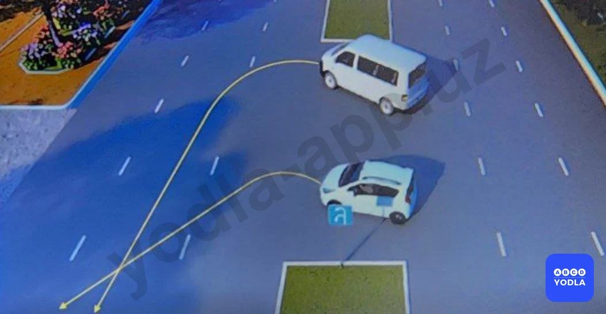

⬜ A. Водитель микроавтобуса
✅ B. Водитель легкового автомобиля

> 💡 В данной ситуации водитель легкового автомобиля продолжает движение, поскольку его правая сторона занята.

Следовательно, правильный ответ — водитель легкового автомобиля продолжает движение.

---

## Вопрос 10

**Сколько полос движения на участке дороги, по которому движутся автомобили?**

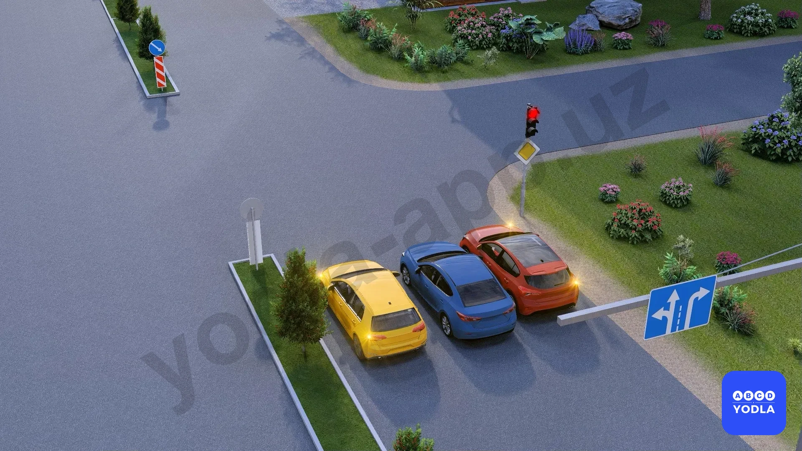

⬜ A. Одна полоса
✅ B. Две полосы
⬜ C. Три полосы

> 💡 На изображении вы видите три автомобиля. Многие считают, что если по ширине дороги помещаются три автомобиля, значит здесь три полосы движения. Но это неверно.

При определении количества полос необходимо учитывать не только ширину проезжей части, но и габаритные размеры транспортных средств, а также необходимый боковой интервал между ними.

В данной ситуации главное — обратить внимание на дорожный знак. Именно он показывает, что на дороге две полосы движения.

Водитель в первую очередь должен руководствоваться дорожными знаками, затем дорожной разметкой. Если нет ни знаков, ни разметки, тогда количество полос определяется самостоятельно, исходя из ширины проезжей части, габаритов транспортных средств и безопасного бокового интервала между ними.

Следовательно, в данном случае правильный ответ — две полосы движения.

---

## Вопрос 11

**Сколько полос движения имеется на проезжей части, по которой движутся автомобили?**

⬜ A. 2
⬜ B. 1
✅ C. 3

> 💡 На изображении видно, что на проезжей части свободно помещаются три автомобиля, при этом между ними сохраняется необходимый боковой интервал. Дорожные знаки и разметка отсутствуют. Поэтому, учитывая ширину проезжей части и не��бходимый боковой интервал между транспортными средствами, считается, что на данной дороге имеется три полосы движения.

---

## Вопрос 12

**Что называется остановочным путем?**

⬜ A. Дистанция; пройденная автомобилем за время; когда водителю стало известно об опасности до начала торможения
✅ B. Путь; пройденный автомобилем с момента обнаружения водителем опасности; до его полной остановки

> 💡 Остановочный путь — это общее расстояние, которое проходит автомобиль с момента, когда водитель заметил опасность, до полной остановки транспортного средства.

То есть водитель замечает опасность, в течение примерно 1 секунды оценивает ситуацию и нажимает на педаль тормоза. После этого автомобиль начинает тормозить и полностью останавливается. Расстояние, пройденное с момента обнаружения опасности до полной остановки автомобиля, называется остановочным путём.

Тормозной путь — это расстояние, которое автомобиль проходит с момента нажатия на педаль тормоза до полной остановки.

Время реакции — это время от момента обнаружения опасности до нажатия на педаль тормоза. В среднем оно принимается равным 1 секунде, хотя может изменяться в зависимости от состояния и опыта водителя.

---

## Вопрос 13

**Что считается стоянкой?**

⬜ A. Прекращение движения транспортного средства на время до 10 минут (приведение в неподвижное состояние)
✅ B. Преднамеренное прекращение движения транспортного средства на время более 10 минут по причинам, не связанным с посадкой или высадкой пассажиров либо загрузкой или разгрузкой транспортного средства.

> 💡 "На основании абзаца 2 пункта 149 главы 25 ПДД: 149. Обучаемому к концу обучения на право управления транспортным средством должно быть:
для категории «А» — не менее 16 лет."

---

## Вопрос 14

**Что считается остановкой?**

✅ A. Прекращение движения транспортного средства на время до 10 минут (приведение в неподвижное состояние)
⬜ B. Преднамеренное прекращение движения транспортного средства на время более 10 минут по причинам, не связанным с посадкой или высадкой пассажиров либо загрузкой или разгрузкой транспортного средства

> 💡 На основании абзаца 1 пункта 64 главы 10 ПДД: 64. Количество полос движения для безрельсовых транспортных средств определяется разметкой и (или) дорожными знаками 5.8.1, 5.8.2, 5.8.7, 5.8.8. Если такой дорожной разметки или дорожных знаков нет — самими водителями, с учетом ширины проезжей части, габаритов транспортных средств и необходимых интервалов между ними. При этом на дорогах с двусторонним движением стороной, предназначенной для встречного движения, считается половина ширины проезжей части, расположенная слева, не считая местной ширины проезжей части (полосы торможения и разгона, дополнительные полосы на подъем, заездные карманы мест остановок маршрутных транспортных средств).

---

## Вопрос 15

**Какое расстояние проедет транспортное средство за одну секунду при скорости движения 108 км/ч?**

⬜ A. 15 м
⬜ B. 25 м
✅ C. 30 м

> 💡 Транспортное средство, движущееся со скоростью 108 км/ч, проходит 30 метров за 1 секунду.

Чтобы быстро определить расстояние, пройденное за одну секунду, скорость в км/ч нужно разделить на 3,6.

Например: 108 ÷ 3,6 = 30 метров.

Следовательно, правильный ответ — 30 метров.

---

## Вопрос 16

**Какое расстояние проедет транспортное средство за одну секунду при скорости движения 90 км/ч?**

⬜ A. 15 м
✅ B. 25 м
⬜ C. 35 м

> 💡 При прохождении поворота на транспортное средство действует центробежная сила, которая возрастает с увеличением скорости и стремится сместить транспортное средство к внешней стороне закругления дороги. Занос или снос транспортного средства может возникнуть при проезде поворота из-за большой скорости движения, торможения или низкого коэффициента сцепления. Антиблокировочная тормозная система, предназначенная для предотвращения блокировки колес транспортного средства, может снизить вероятность возникновения заноса или сноса при торможении, но не может исключить возможность их возникновения.

---

## Вопрос 17

**Какое расстояние проедет транспортное средство за одну секунду при скорости движения 72 км/ч?**

⬜ A. 15 м
✅ B. 20 м
⬜ C. 25 м

> 💡 Транспортное средство, движущееся со скоростью 72 км/ч, проходит 20 метров за 1 секунду.

Для расчёта необходимо разделить скорость на 3,6:

72 ÷ 3,6 = 20 метров.

Поэтому правильный ответ — 20 метров.

---

## Вопрос 18

**Нарушает ли Правила водитель мотоцикла?**

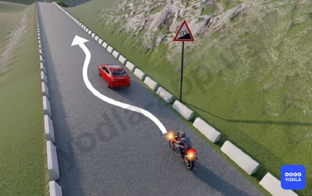

⬜ A. Да
✅ B. Нет

> 💡 Здесь мотоциклист никак не знает правила, потому что он стучит в конце съезда, мотоцикл ещё не добрался до конца съезда, поэтому правильного ответа нет.

---

## Вопрос 19

**Разрешается ли обгон в этом месте?**

⬜ A. Разрешается
✅ B. Запрещается
⬜ C. Разрешается на дорогах вне населенных пунктов
⬜ D. Запрещается только на дорогах вне населенных пунктов

> 💡 Согласно абзацу 6 пункта 86 главы 12 ПДД, обгон запрещен - в конце подъема и на других участках дорог с ограниченной видимостью.

---

## Вопрос 20

**Что должен делать водитель тягача?**

✅ A. Через 100 метров от опасного поворота остановиться и пропустить автомобили скопившиеся сзади
⬜ B. Продолжать движение не изменяя скорость
⬜ C. Указать рукой на обгон по параллельной полосе

---

## Вопрос 21

**Как должен поступить водитель крупногабаритного транспортного средства, соблюдающего определенную скорость движения в населенном пункте?**

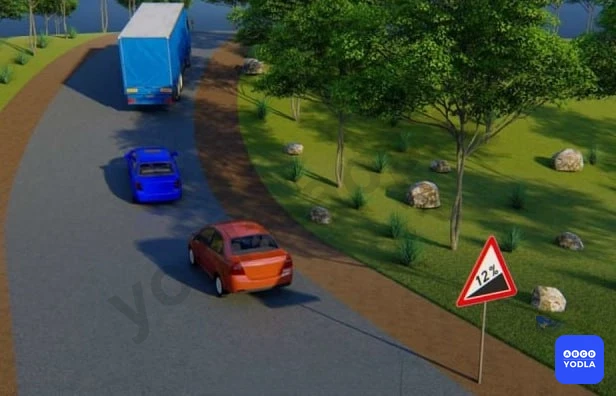

⬜ A. Остановиться и пропустить скопившиеся за ним транспортные средства
✅ B. Продолжить движение

> 💡 Согласно пункту 87 главы 12 ПДД, водитель тихоходного или крупногабаритного транспортного средства вне населённых пунктов в случаях, когда обгон этого транспортного средства затруднён, должен принять как можно правее, а при необходимости – остановиться, чтобы пропустить скопившиеся за ним транспортные средства. Однако, в населенных пунктах нет вышеупомянутых требований,  он может продолжить движение.

---

## Вопрос 22

**Водитель какого транспортного средства нарушил правила стоянки?**

⬜ A. Водитель синего автомобиля
⬜ B. Водитель красного автомобиля
✅ C. Оба водителя нарушили
⬜ D. Оба водителя не нарушили

> 💡 Согласно пункту 91 Правил дорожного движения, остановка запрещается в следующих местах: на пересечении проезжих частей и ближе 30 м от края пересекаемой проезжей части, за исключением стороны напротив бокового проезда трехсторонних пересечений (перекрестков), имеющих сплошную линию дорожной разметки или разделительную полосу.
Согласно знак 3.28 раздела 3 приложения № 1 к ПДД, «Стоянка запрещена». запрещается стоянка транспортных средств, за исключением транспортных средств, прикрепленных к сотруднику, выполняющему служебные обязанности, и имеющих соответствующие цветографические схемы, нанесенные на наружной поверхности, оборудованных проблесковыми маячками красного или синего или синего и красного цветов.

---

## Вопрос 23

**Кто из водителей нарушил правила остановки?**

⬜ A. Оба нарушили
⬜ B. Только водитель синего автомобиля
✅ C. Только водитель красного автомобиля

> 💡 Согласно статьи 6 Правил дорожного движения, приоритет — право на первоочередное движение в намеченном направлении по отношению к другим участникам движения.

---

## Вопрос 24

**К каким веществам относится этот символ?**

⬜ A. Токсичные вещества
⬜ B. Органические пероксиды
✅ C. Окислители

> 💡 На основании пункта 3.19,  пункта 5.8.1 Приложения 1 к ПДД и абзаца 11 раздела 5 «Информационно-указательные знаки» а также пункта 3.18.2 Приложения 1 к ПДД и абзаца 47 раздела 3 «Запрещающие знаки»: 3.19. «Разворот запрещен». 
5.8.1. «Направления движения по полосам». Число полос и разрешенные направления движения на каждой из них. Движение по другим направлениям запрещается.
Знаки 5.8.1 и 5.8.2, разрешающие поворот налево из крайней левой полосы, разрешают и разворот с этой полосы.
3.18.2. «Поворот налево запрещен». Действие знаков 3.18.1 и 3.18.2 распространяется на пересечение проезжих частей, перед которыми установлен знак.

---

## Вопрос 25

**Как называется этот предупреждающий знак?**

⬜ A. Окисляющие вещества
✅ B. Органические пероксиды
⬜ C. Легковоспламеняющиеся газы и жидкости

> 💡 Пункта 119 главы 18 ПДД гласит:
В случаях, когда движение через переезд запрещено, водитель должен остановиться у стоп-линии, дорожного знака 2.5 или светофора, если их нет — не ближе 5 м от шлагбаума, а при отсутствии шлагбаума — не ближе 10 м до ближайшего рельса.

---

## Вопрос 26

**Что называется тормозным путем?**

⬜ A. Расстояние; пройденное автомобилем с момента обнаружения водителем опасности до полной остановки
✅ B. Расстояние; пройденное автомобилем с момента нажатия на педаль тормоза до полной остановки

> 💡 Тормозной путь — это расстояние, которое автомобиль проходит с момента нажатия водителем на педаль тормоза до полной остановки автомобиля.

---

## Вопрос 27

**Какое направление разрешено для движения этому транспортному средству через перекресток?**

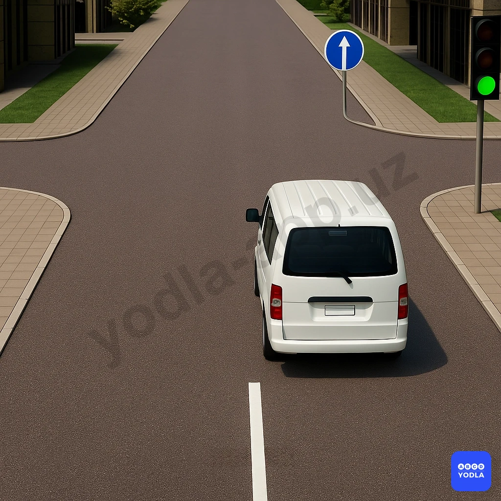

⬜ A. Только прямо и направо
⬜ B. Только налево и разворот
⬜ C. Только направо
⬜ D. Только прямо
✅ E. Во всех направлениях

> 💡 На изображении синий круглый знак означает «Движение прямо». Однако этот знак установлен с правой стороны дороги, предназначенной для встречного направления движения. Перед микроавтобусом отсутствуют какие-либо запрещающие знаки или дорожная разметка, ограничивающие направление движения. Поэтому ему разрешается движение во всех направлениях: прямо, направо, налево и разворот.

---

## Вопрос 28

**На каком рисунке пешеходы двигаются без нарушения правил?**

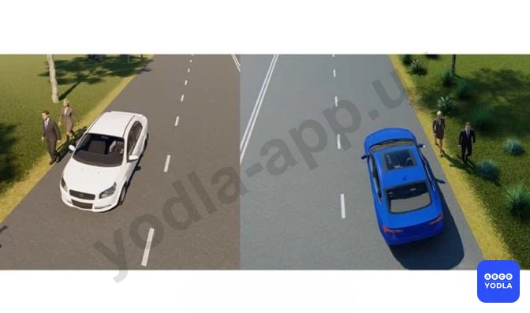

⬜ A. На левом рисунке
⬜ B. На правом рисунке
✅ C. На обоих рисунках

> 💡 Согласно абзацу 1 и 3 пункта 15 главы 4 ПДД, пешеходы должны двигаться по тротуарам или пешеходным дорожкам, а при их отсутствии – по обочинам. При движении по краю проезжей части пешеходы должны идти навстречу движению транспортных средств.

---

## Вопрос 29

**Водитель какого транспортного средства должен уступить дорогу?**

⬜ A. Водитель автомобиля скорой помощи
✅ B. Водитель легкового автомобиля

> 💡 Согласно термину 26 пункта главы 6 ПДД, при приближении транспортных средств с включенными проблесковым маячком синего цвета или синего и красного цветов и специальным звуковым сигналом, а также сопровождаемых ими транспортных средств с включенным ближним светом фар водители обязаны уступить им дорогу для обеспечения их беспрепятственного проезда.

---

## Вопрос 30

**Можно ли водителю автобуса обгонять в зоне действия этого знака?**

✅ A. Можно во всех случаях с соблюдением правил обгона
⬜ B. Нельзя
⬜ C. Можно при условии; если обгоняемое транспортное средство движется со скоростью менее 40 км/ч

> 💡 Согласно двадцать шестому абзацу третьего раздела приложения №1 ПДД: Запрещающий знак 3.22 "Обгон грузовым автомобилям запрещен". Запрещается грузовым автомобилям с разрешенной максимальной массой более 3,5 т обгон всех транспортных средств (за исключением транспортного средства, трактора, гужевой повозки, велосипеда, движущегося со скоростью менее 40 км/ч). 
Знак запрещает обгон грузовым автомобилям, соответственно, автобусам в зоне действия этого знака обгон разрешен во всех случаях.

---

## Вопрос 31

**Какие транспортные средства запрещается обгонять при этом знаке?**

⬜ A. Все
✅ B. Все, кроме одиночных, движущихся со скоростью менее 40 км/ч
⬜ C. Легковые автомобили, мотоциклы и грузовые автомобили с полной массой менее 3,5 т
⬜ D. Грузовые автомобили с полной массой более 3,5 т

> 💡 Согласно требованию знаку 3.20 раздела 3 приложения № 1 к ПДД, «Обгон запрещен» запрещается обгон всех транспортных средств, кроме одиночных, движущихся со скоростью менее 40 км/ч.

---

## Вопрос 32

**Какой знак запрещает движение грузового автомобиля с прицепом, если суммарная разрешенная максимальная масса автомобиля и прицепа равна 7 т?**

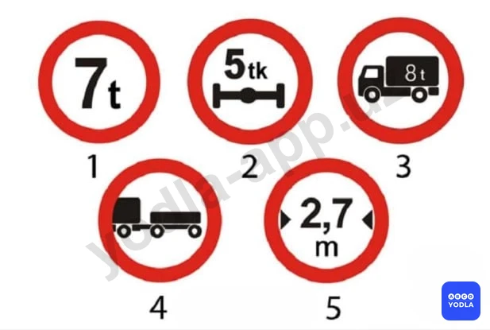

⬜ A. 1
⬜ B. 2
⬜ C. 3
✅ D. 4
⬜ E. 5

> 💡 Запрещающий знак 3.7 “Движение с прицепом запрещено”. Запрещается движение грузовых автомобилей и тракторов с прицепами любого типа, а также всякая буксировка механических транспортных средств.

---

## Вопрос 33

**Какой знак разрешат левый поворот?**

⬜ A. 1
⬜ B. 2
✅ C. 3
⬜ D. 4
⬜ E. 5

> 💡 Запрещающий знак 3.19 “Разворот запрещен”. Все знаки, кроме запрещающего разворот 3.19, запрещают поворот налево.

---

## Вопрос 34

**Какой знак разрешает разворот?**

⬜ A. 1
✅ B. 2
⬜ C. 3
⬜ D. 4
⬜ E. 5

> 💡 Запрещающий знак 3.18.2 “Поворот налево запрещен”.

---

## Вопрос 35

**Каким транспортным средствам запрещено движение по указанному знаку?**

✅ A. Всем механическим транспортным средствам
⬜ B. Только грузовых автомобилей
⬜ C. Всех автомобилей

> 💡 Этот знак обозначает 3.3 «Движение механических транспортных средств запрещено».

---

## Вопрос 36

**Разрешается ли Вам осуществить посадку (высадку) пассажиров либо загрузку (разгрузку) транспортного средства в зоне действия этого знака?**

✅ A. Да
⬜ B. Нет

> 💡 В зоне действия данного знака разрешается посадка и высадка пассажиров, поскольку знак «Стоянка запрещена» запрещает только длительное прекращение движения транспортного средства. Кратковременная остановка, в том числе для посадки или высадки пассажиров, допускается.

---

## Вопрос 37

**Какие знаки обозначают конец зоны запрещения обгона грузовых автомобилей?**

⬜ A. А
⬜ B. Б
⬜ C. А и Б
✅ D. А, Б, В

> 💡 Знак А распространяется на все транспортные средства. Знак Б относится к грузовым автомобилям. Знак В отменяет действие всех ранее введённых запрещающих ограничений.

---

## Вопрос 38

**Какие из этих указанных знаков не действует на легковые немаршрутные такси при посадке — высадке пассажиров (погрузке — выгрузке грузов)?**

⬜ A. Только A
⬜ B. Только B
⬜ C. Только B,C,D
✅ D. Все

> 💡 В зоне действия всех этих знаков такси разрешается производить посадку и высадку пассажиров. Поскольку кратковременная остановка для посадки или высадки пассажиров не считается стоянкой.

---

## Вопрос 39

**Требования каких знаков из указанных вступают в силу непосредственно в том месте, где они установлены?**

⬜ A. Только B
✅ B. А и В
⬜ C. Все

> 💡 Итак, в вопросе спрашивается, требования каких из указанных знаков вступают в силу непосредственно с места их установки. Знак А действует с места установки на протяжении следующих 100 метров, следовательно, он начинает действовать сразу. Знак Б также действует с места установки до ближайшего перекрёстка, то есть его требование тоже вступает в силу немедленно. Знак С начинает действовать только через 200 метров, поэтому он не относится к знакам, действие которых начинается непосредственно с места установки. Следовательно, правильный ответ — А и Б.

---

## Вопрос 40

**Разрешено ли движение легкового автомобиля с прицепом в месте, где установлен этот знак?**

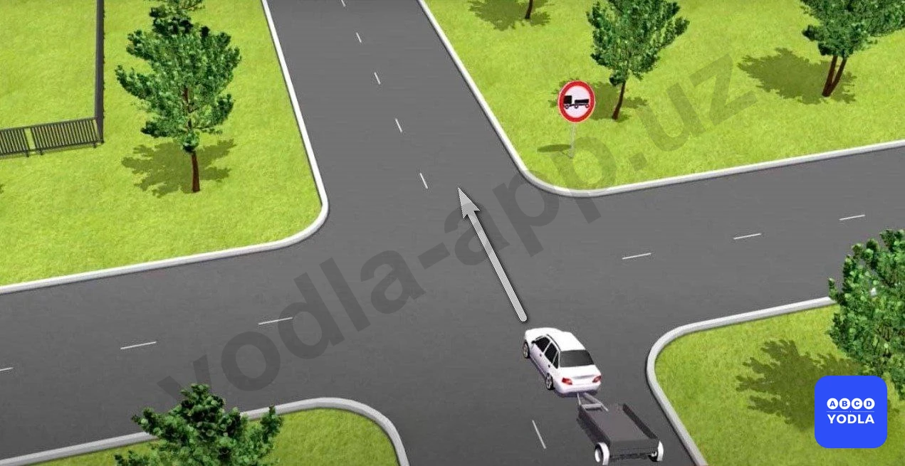

⬜ A. Разрешается, если масса прицепа не более 750 кг
✅ B. Разрешается
⬜ C. Запрещается

> 💡 Данный дорожный знак означает «Движение с прицепом запрещено». Он запрещает движение грузовых автомобилей с прицепами, а также буксировку механических транспортных средств. Однако это ограничение не распространяется на легковые автомобили, движущиеся с прицепом. Поэтому, если в вопросе спрашивается, разрешено ли движение легкового автомобиля с прицепом, правильный ответ — разрешено.

---

## Вопрос 41

**На каком знаки можно остановиться в четные дни месяца?**

⬜ A. На левом рисунке
⬜ B. На правом рисунке
✅ C. На обеих рисунке можно

> 💡 Итак, в вопросе спрашивается, при каком знаке разрешена остановка в чётные дни месяца. Обратите внимание: речь идёт именно об остановке, а не о стоянке. Не следует путать эти понятия. Поэтому в данном случае остановка разрешена при обоих знаках.

---

## Вопрос 42

**Какой дорожный знак разрешает разворот?**

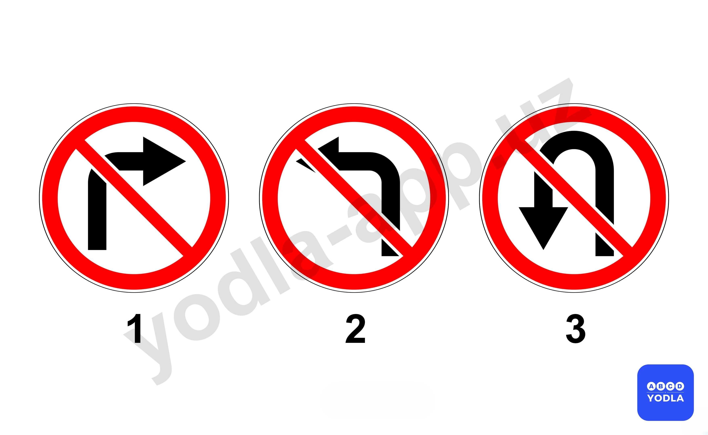

✅ A. 1 и 2
⬜ B. 2 и 3
⬜ C. все

> 💡 В вопросе спрашивается, какие дорожные знаки разрешают разворот. Третий знак означает «Разворот запрещён». Следовательно, в зоне его действия разворот выполнять нельзя. Поэтому правильный ответ — 1 и 2.

---

## Вопрос 43

**Разрешено ли жёлтому автомобилю выполнять обгон в указанном месте?**

✅ A. Разрешено
⬜ B. Запрещено

> 💡 В данной ситуации водителю жёлтого автомобиля разрешается выполнить обгон. Несмотря на действие дорожного знака «Обгон запрещён», разрешается обгон одиночного транспортного средства, движущегося со скоростью менее 40 км/ч.

---

## Вопрос 44

**По каким направлениям водителю синего автомобиля запрещено движение?**

⬜ A. Только по направлению 1
⬜ B. Только по направлению 2
✅ C. По направлениям 1, 3 и 4
⬜ D. По всем направлениям

> 💡 Внимательно прочитайте вопрос. В нём спрашивается, в каком направлении водителю синего автомобиля движение не разрешается. Многие ошибочно читают вопрос как «в каком направлении разрешается движение».
В данной ситуации движение прямо разрешено. Однако поворот направо запрещён, поскольку действует временный дорожный знак. Кроме того, автомобиль движется по правой полосе, поэтому движение по третьему и четвёртому направлениям также не разрешается.
Следовательно, правильный ответ — первое и третье направления, то есть движение в этих направлениях запрещено.

---

## Вопрос 45

**Какой знак называется « Объезд препятствия слева »?**

⬜ A. 1
⬜ B. 2
✅ C. 3
⬜ D. 4
⬜ E. 5

> 💡 В вопросе о знаке «Объезд препятствия слева» многие ошибочно выбирают пятый вариант ответа. Однако правильным является третий вариант.
Такой знак обычно устанавливается на разделительных островках, бордюрах или других участках дороги, где имеется препятствие. В зависимости от знака водитель обязан объехать препятствие с указанной стороны. Чаще всего используется знак «Объезд препятствия справа», но при проведении дорожных работ или в других ситуациях может быть установлен знак «Объезд препятствия слева».
Следовательно, знаки, предписывающие объезд препятствия с определённой стороны, относятся к предписывающим знакам, и в данном вопросе правильным является третий вариант ответа.

---

## Вопрос 46

**Какой знак запрещает движение со скоростью менее 50 км/час?**

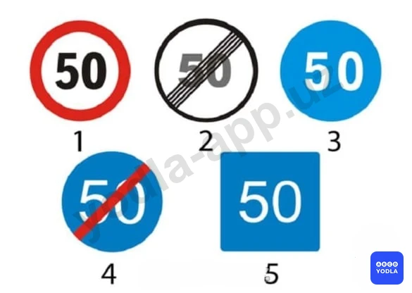

⬜ A. 1
⬜ B. 2
✅ C. 3
⬜ D. 4
⬜ E. 5

> 💡 Итак, в вопросе спрашивается, какой знак запрещает движение со скоростью менее 50 км/ч. Это означает, что транспортное средство не может двигаться со скоростью ниже 50 км/ч, то есть должно двигаться со скоростью 50 км/ч или выше.
Такое требование устанавливает предписывающий знак «Минимальная скорость движения». Этот знак имеет форму синего круга.
Следовательно, правильный ответ — третий знак.

---

## Вопрос 47

**Разрешается ли на этом перекрестке повернуть налево?**

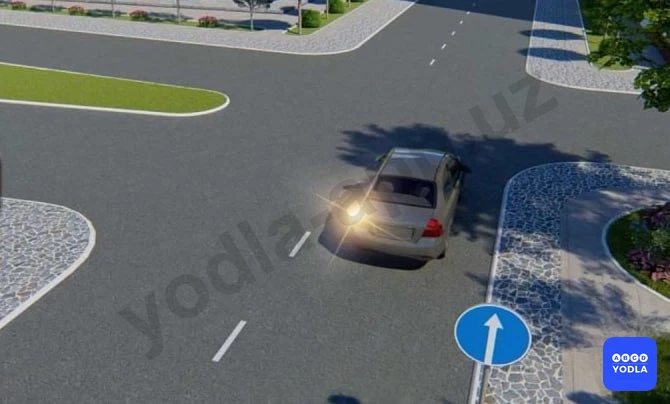

✅ A. Разрешается
⬜ B. Запрещается

> 💡 Знак 4.1.1. «Движение прямо» раздела 4, приложения № 1 ПДД, разрешается движение только прямо. Действие знака распространяется на пересечение проезжих частей, перед которым установлен знак.

---

## Вопрос 48

**Кто из водителей, совершающих поворот, нарушает Правила?**

⬜ A. Только водитель легкового автомобиля
⬜ B. Только мотоциклист
✅ C. Оба нарушают

> 💡 Как видно из ситуации, водитель мотоцикла собирается повернуть направо, а водитель легкового автомобиля — повернуть налево.
Легковому автомобилю поворот налев�� запрещён, поскольку установленный дорожный знак не разрешает такой манёвр.
Водителю мотоцикла может показаться, что дополнительная секция светофора разрешает поворот. Однако он также не имеет права выполнять манёвр, так как для него действует знак «Движение прямо».
Следовательно, оба водителя выполняют поворот с нарушением Правил дорожного движения.
Вывод: правильный ответ — оба водителя нарушают правила.

---

## Вопрос 49

**Какие знаки обязывают водителя грузового автомобиля с разрешенной максимальной массой до 3,5 т. повернуть направо?**

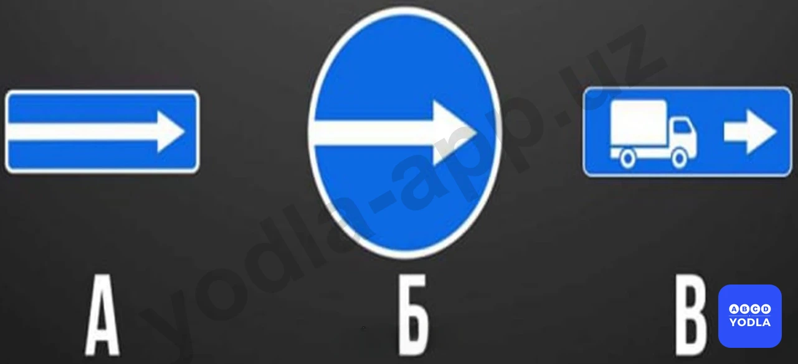

⬜ A. Только «А»
✅ B. Только «Б»
⬜ C. «А» и «Б»
⬜ D. «Б» и «В»

> 💡 Внимательно прочитайте вопрос. В конце вопроса используется слово «предписывает». Это означает, что речь идёт именно о предписывающих дорожных знаках.
Знаки А и В относятся к информационно-указательным знакам. Они информируют водителя, указывают направление движения или организуют движение, но не предписывают обязательные действия.
Некоторые знаки могут сообщать о запрете поворота налево или указывать направление, однако они не являются предписывающими.
Поэтому, если в вопросе спрашивается, какой знак предписывает определённое действие, то правильный ответ — знак Б, так как именно он относится к предписывающим дорожным знакам.

---

## Вопрос 50

**Какой знак указывает на то, что объезд препятствия разрешен с правой или левой стороны?**

⬜ A. 1
⬜ B. 2
⬜ C. 3
⬜ D. 4
✅ E. 5

> 💡 Если в вопросе спрашивается об объезде препятствия справа или слева, то правильным ответом будет пятый предписывающий знак. Пятый знак обозначает объезд препятствия справа или слева.

---

## Вопрос 51

**В каком направлении движение запрещено?**

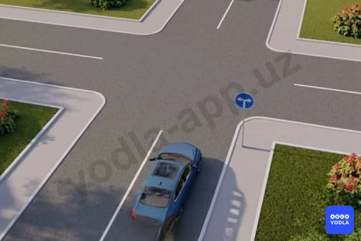

⬜ A. Только направо
⬜ B. Направо, налево и в обратном направлении
⬜ C. Налево и в обратном направлении
✅ D. Только прямо

> 💡 Таким образом, данный дорожный знак разрешает поворот направо, поворот налево и разворот, однако запрещает движение прямо.

---

## Вопрос 52

**Разрешен ли поворот налево на этом перекрестке?**

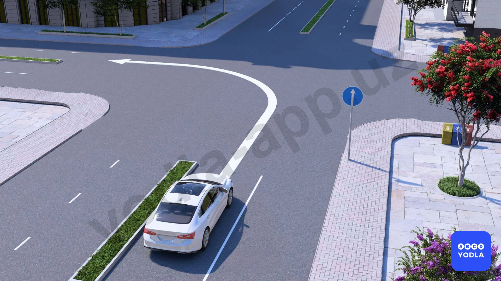

✅ A. Разрешается
⬜ B. Запрещается

> 💡 Если в вопросе спрашивается, разрешён ли поворот налево, то правильный ответ — да. Как видно на изображении, посередине дороги имеется разделительная полоса, пусть даже небольшая.
Знак 4.1.1 «Движение прямо» действует в отношении первой проезжей части, отделённой разделительной полосой. После пересечения первой проезжей части действие данного знака на следующую проезжую часть не распространяется.
Следовательно, при въезде на вторую проезжую часть поворот налево разрешается. Поэтому в данной ситуации поворот налево допускается.

---

## Вопрос 53

**Какое транспортное средство поворачивает направо правильно?**

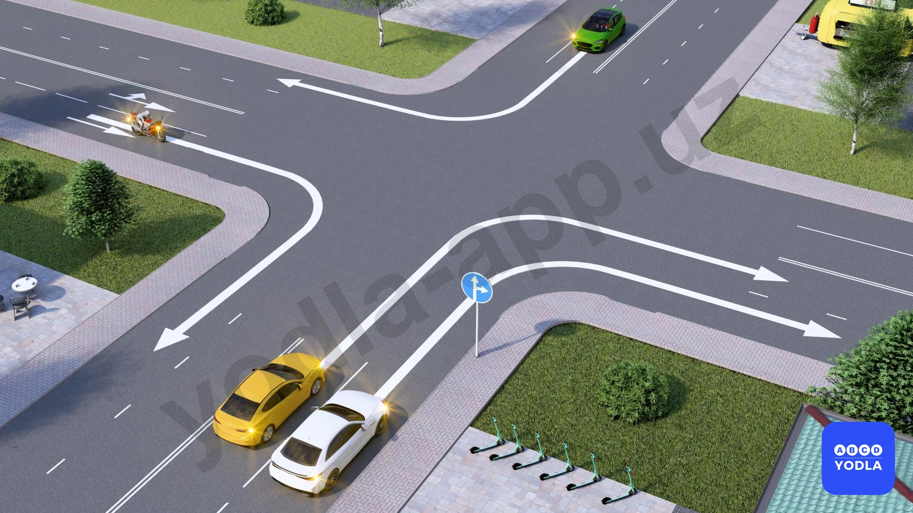

⬜ A. Мотоцикл
⬜ B. Жёлтый и зелёный автомобиль
✅ C. Белый автомобиль
⬜ D. Все поворачивают правильно

> 💡 Как видно, в данной ситуации только водитель белого автомобиля правильно выполняет поворот направо.
Водитель жёлтого автомобиля поворачивает направо со второй полосы движения, что является нарушением правил.
Водитель мотоцикла движется по полосе, предназначенной только для движения прямо, однако выполняет поворот направо, что также недопустимо.
Водитель зелёного автомобиля тоже поворачивает направо со второй полосы, что является нарушением.
Согласно правилам, поворот направо должен выполняться только с крайней правой полосы и при максимально возможном приближении к правому краю проезжей части.
Следовательно, правильный ответ — только водитель белого автомобиля выполняет поворот направо правильно.

---

## Вопрос 54

**Этот знак разрешает движение автомобиля:**

⬜ A. Во всех направлениях
⬜ B. «Б» и «В»
✅ C. «А» и «В»

> 💡 Этот знак обозначает «Место для разворота». Он разрешает выполнение разворота, однако запрещает поворот налево.
Следовательно, водитель может двигаться в направлениях А и В, но не может двигаться в направлении Б, то есть поворачивать налево.
Таким образом, правильный ответ — направления А и В.

---

## Вопрос 55

**В каких направлениях разрешено продолжить движение на перекрестке?**

✅ A. Только «Г» и «Е»
⬜ B. «А», «Б», «Г», «Д»
⬜ C. «Б», «В», «Г», «Д»

> 💡 На перекрёстке установлен дорожный знак 5.8.1, который показывает, из какой полосы движения разрешено двигаться в определённых направлениях. Первая полоса предназначена только для поворота направо, а вторая полоса — только для движения прямо. Следовательно, движение разрешено в направлениях Г и Е.

---

## Вопрос 56

**На каком рисунке водитель совершил маневр не нарушая требований правил?**

✅ A. 1
⬜ B. 2
⬜ C. 3

> 💡 Рассмотрим каждое изображение отдельно. На первом изображении, несмотря на наличие знака "Движение прямо", разрешается поворот направо на прилегающую территорию, например во двор или жилой квартал. Нарушения правил здесь нет. На втором изображении водитель поворачивает налево, что противоречит требованиям дорожного знака и является нарушением. На третьем изображении установлен прямоугольный знак, обозначающий дорогу с односторонним движением. Водитель выполняет разворот и начинает движение во встречном направлении. На дороге с односторонним движением движение во встречном направлении запрещено. Следовательно, в данном случае также имеет место нарушение правил.

---

## Вопрос 57

**В каких направлениях; обозначенных стрелками разрешено движение?**

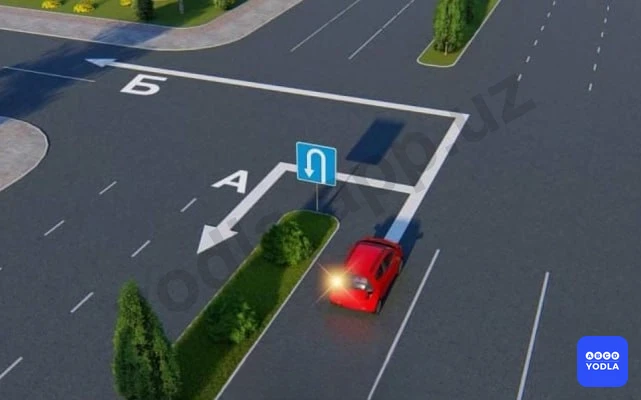

✅ A. «А»
⬜ B. «Б»
⬜ C. «А» и «Б»

> 💡 При наличии знака места для разворота разрешается только разворот. Данный дорожный знак запрещает поворот налево.

---

## Вопрос 58

**Какиезнаки являются информационно-указательным?**

⬜ A. 1 и 2
⬜ B. 3 и 4
✅ C. 2 и 3
⬜ D. 1 и 4

> 💡 Вопрос заключается в том, какие из представленных знаков относятся к информационно-указательным знакам. В данном случае второй и третий дорожные знаки являются информационно-указательными. Первый и четвёртый дорожные знаки относятся к знакам сервиса. Следовательно, правильный ответ — второй и третий знаки.

---

## Вопрос 59

**Какие из указанных знаков запрещают поворот налево?**

⬜ A. Только А
⬜ B. А и Б
✅ C. А и С
⬜ D. Все

> 💡 Вопрос заключается в том, какие из представленных знаков запрещают поворот налево. В случае со знаком А поворот налево невозможен, поскольку такой манёвр приводит к выезду на полосу, предназначенную для маршрутных транспортных средств. Знак С также запрещает поворот налево. Следовательно, правильный ответ — А и С.

---

## Вопрос 60

**Какие из этих знаков являются временные дорожными знаки:**

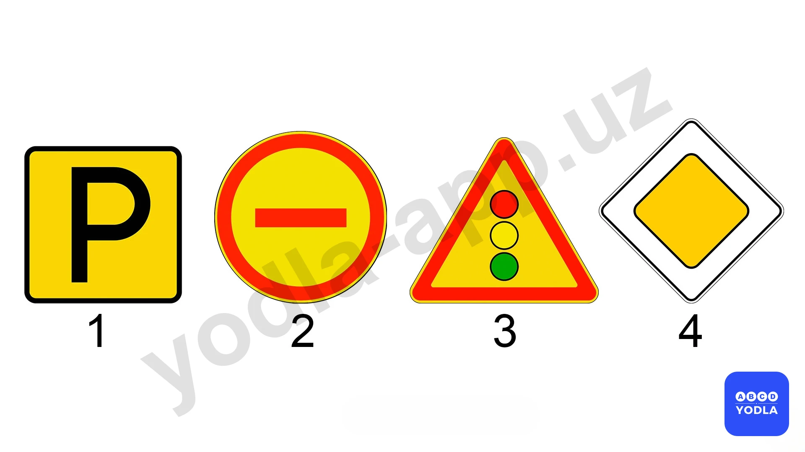

⬜ A. «1»и«4»
✅ B. «2»и«3»
⬜ C. «3»и«4»

> 💡 Вопрос заключается в том, какие из представленных знаков являются временными дорожными знаками. Временные дорожные знаки имеют жёлтый фон. В данном случае временными являются второй и третий дорожные знаки. Следовательно, правильный ответ — второй и третий знаки.

---

## Вопрос 61

**Какие знаки отменяют действие дорожного знака 3.24 "Ограничение максимальной скорости"?**

⬜ A. Только первый
⬜ B. Только второй
⬜ C. Только третий
⬜ D. Только четвёртый
✅ E. Все ответы верны

> 💡 Вопрос заключается в том, какие знаки отменяют действие ограничения максимальной скорости. В данной ситуации все представленные знаки отменяют действие ранее введённого ограничения скорости.

Знак начала населённого пункта вводит правила движения, действующие в населённых пунктах, поэтому предыдущее ограничение скорости теряет силу.

Знак окончания ограничения скорости отменяет именно это ограничение.

Знак окончания всех ограничений также отменяет ранее введённые ограничения.

Знак конца населённого пункта означает начало действия правил, установленных вне населённых пунктов, вследствие чего прежнее ограничение скорости также прекращает своё действие.

Следовательно, в данном случае все представленные дорожные знаки отменяют действие ограничения максимальной скорости.

---

## Вопрос 62

**В каких направлениях разрешено движение автомобилю?**

✅ A. В первом направлении
⬜ B. Во втором направлении
⬜ C. Разрешено в обоих направлениях

> 💡 Синий автомобиль находится на первой полосе движения. Для данной полосы разрешено движение прямо и налево. Следовательно, движение по первому направлению разрешается.

Движение по второму направлению с выполнением разворота не допускается, поскольку автомобиль находится не на крайней левой полосе. Разворот должен выполняться только из крайнего левого положения на проезжей части.

Таким образом, в данной ситуации разрешается движение только по первому направлению.

---

## Вопрос 63

**Какое транспортное средство поворачивает направо правильно?**

⬜ A. Белый и жёлтый автомобиль
⬜ B. Красный и белый автомобиль
⬜ C. Жёлтый и зелёный автомобиль
✅ D. Белый автомобиль
⬜ E. Все автомобили

> 💡 Вопрос заключается в том, какое транспортное средство правильно выполняет поворот направо. В данной ситуации правильный ответ — белый автомобиль.

Жёлтый автомобиль поворачивает направо со второй полосы движения. Поворот направо должен выполняться только с крайней правой полосы, поэтому это является нарушением.

Для красного автомобиля дорожный знак предписывает движение только прямо, поэтому поворот направо запрещён.

Зелёный автомобиль также выполняет поворот направо со второй полосы, что не допускается правилами.

Следовательно, правильный ответ — только белый автомобиль выполняет поворот направо правильно.

---

## Вопрос 64

**Разрешено ли водителю Синий  автомобиля въезжать на парковку?**

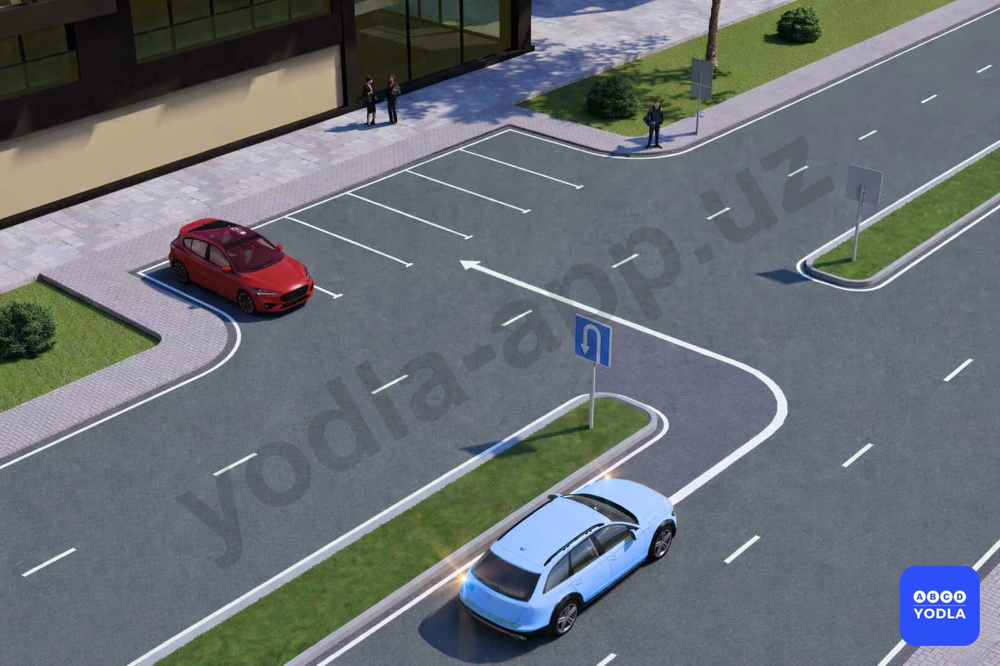

⬜ A. Разрешено
✅ B. Запрещено

> 💡 Данный дорожный знак разрешает разворот, но запрещает поворот налево. Поэтому, если в вопросе спрашивается, разрешён ли въезд в данном направлении, правильный ответ — запрещено.

---

## Вопрос 65

**Какой из следующих дорожных знаков требует соблюдения минимальной скорости?**

⬜ A. На вывеске слева
✅ B. На вывеске справа
⬜ C. В обоих случаях

> 💡 Вопрос заключается в том, какой из представленных дорожных знаков устанавливает минимальную скорость движения. Правильным ответом является знак, расположенный справа. Этот знак указывает, что транспортные средства должны двигаться со скоростью не менее 60 км/ч или выше.

Первый знак прямоугольной формы обозначает рекомендуемую скорость движения. Он не является обязательным. Водитель может двигаться со скоростью 60 км/ч, ниже или выше этого значения, если это не противоречит правилам дорожного движения.

Следовательно, правильный ответ — только знак, расположенный справа.

---

## Вопрос 66

**В каких направлениях вам разрешено продолжить движение?**

✅ A. Только налево
⬜ B. Прямо и налево
⬜ C. Налево и с разворотом

> 💡 Как видно, дополнительная секция светофора разрешает движение налево. Транспортное средство находится на первой полосе движения. В данной ситуации движение прямо не разрешается, однако разрешён поворот налево. Выполнение разворота также не допускается. Следовательно, движение разрешено только налево. Правильный ответ — только налево.

---

## Вопрос 67

**Какой знак запрещает обгон водителю?**

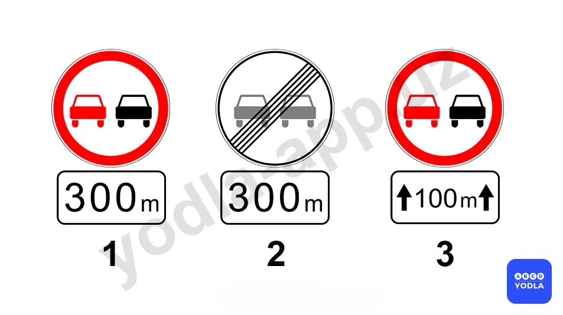

⬜ A. 1 и 3
⬜ B. 1 и 2
✅ C. 2 и 3
⬜ D. На всех изображениях

> 💡 Вопрос заключается в том, какие знаки указывают водителю на запрет обгона.

Обратим внимание на первый знак. Под знаком «Обгон запрещён» установлена табличка «300 м». Это означает, что действие запрета начнётся через 300 метров. Следовательно, в данном месте обгон ещё разрешён.

Во втором случае знак «Обгон запрещён» уже действует, поэтому обгон выполнять нельзя.

В третьем случае дополнительная табличка указывает, что зона действия запрета продолжается ещё на протяжении 100 метров. Следовательно, обгон здесь также запрещён.

Таким образом, правильный ответ — второй и третий знаки.

---

## Вопрос 68

**Что означает эта разметка?**

⬜ A. Обозначает полосу предназначенную только для движения автобусов
✅ B. Обозначает полосу предназначенную только для движения маршрутных транспортных средств
⬜ C. Обозначает полосу предназначенную для движения автобусов и троллейбусов
⬜ D. Обозначает полосу предназначенную для движения автобусов и маршрутных такси (особо малых автобусов)

> 💡 Буква «А», нанесённая на проезжую часть, обозначает полосу, предназначенную для движения маршрутных транспортных средств.

Следует помнить, что к маршрутным транспортным средствам относятся автобусы, троллейбусы и маршрутные такси. Поэтому, даже если в вариантах ответа перечислены отдельные виды транспорта, наиболее правильным и полным ответом будет — маршрутные транспортные средства.

Следовательно, данная разметка обозначает полосу для движения маршрутных транспортных средств.

---

## Вопрос 69

**Водители каких транспортных средств неправильно произвели остановки для высадки пассажиров?**

✅ A. Водитель красного автомобиля
⬜ B. Синий автомобиль
⬜ C. Водитель мотоцикла
⬜ D. Водители обоих автомобилей
⬜ E. Все водители

> 💡 Обратим внимание на рисунок. Красный автомобиль остановился у сплошной жёлтой линии, синий автомобиль — у жёлтой зигзагообразной разметки, а мотоцикл находится возле прерывистой жёлтой линии.

Начнём анализ снизу. Жёлтая зигзагообразная разметка обозначает остановку автобусов и троллейбусов. В этом месте другие транспортные средства могут кратковременно останавливаться для посадки или высадки пассажиров, если они не создают помех маршрутному транспорту. Поэтому водитель синего автомобиля правила не нарушил.

Водитель мотоцикла также не нарушил правила. При необходимости он может кратковременно остановиться для высадки пассажира.

Красный автомобиль находится в зоне сплошной жёлтой линии. Такая разметка запрещает остановку транспортных средств. Следовательно, водитель красного автомобиля нарушил правила.

Таким образом, неправильно остановился только водитель красного автомобиля.

---

## Вопрос 70

**С каким дорожным знаком может быть применена разметка в виде желтой прерывистой линии?**

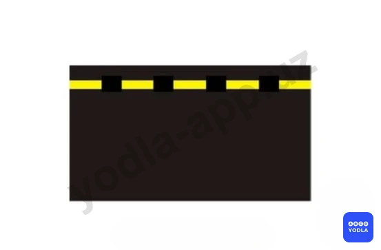

⬜ A. «Остановка запрещена»
✅ B. «Стоянка запрещена»
⬜ C. «Стоянка по нечетным числам запрещена»

> 💡 Разметка 1.10 (желтая прерывистая) раздела 1 приложения № 2 к ПДД, обозначает места, где запрещена стоянка. Применяется самостоятельно или в сочетании со знаком 3.28 «Стоянка запрещена»  и наносится у края проезжей части или по верху бордюра.

---

## Вопрос 71

**По какой траектории водитель автомобиля нарушил правила при повороте налево?**

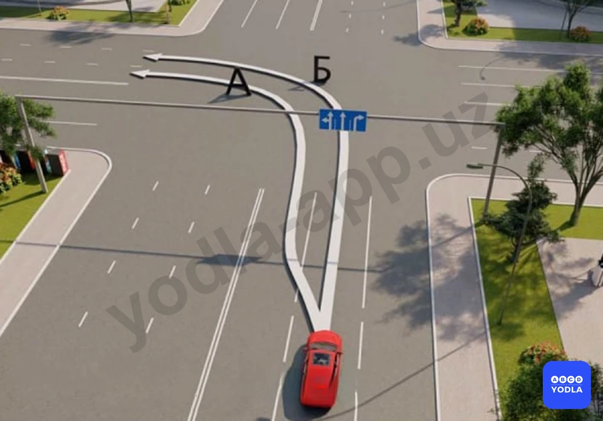

⬜ A. Только по траектории «А»
⬜ B. Только по траектории «Б»
✅ C. По любой траектории из указанных

> 💡 Вопрос заключается в том, по какому направлению водитель нарушает правила при повороте налево.

Поворот по направлению Б запрещён, поскольку для данной полосы установлен знак, разрешающий движение только прямо.

Поворот по направлению А также запрещён, так как водитель должен был заранее занять соответствующую полосу для поворота. Кроме того, он пересёк сплошную линию разметки.

Следовательно, водитель нарушает правила при движении по всем указанным направлениям.

Правильный ответ — нарушение допускается по всем указанным направлениям.

---

## Вопрос 72

**В каком направлении вам разрешено проезжать перекресток?**

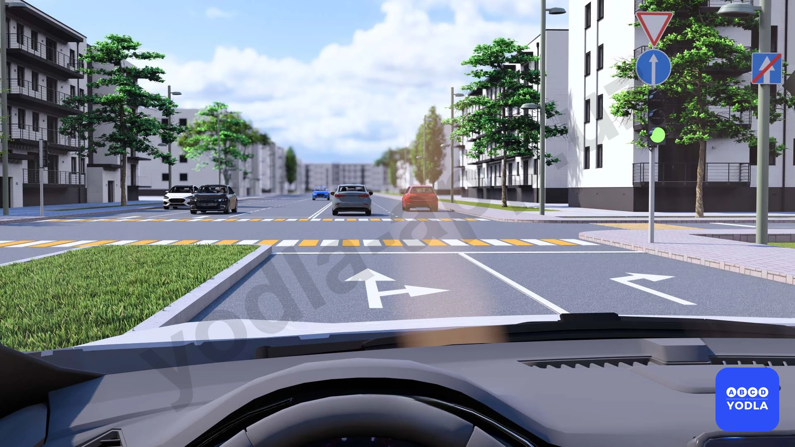

✅ A. Только прямо
⬜ B. Прямо и направо
⬜ C. Только направо

> 💡 Вопрос заключается в том, в каком направлении разрешено движение через перекрёсток.

В данной ситуации дорожная разметка и дорожный знак противоречат друг другу. В таких случаях водитель обязан руководствоваться требованиями дорожного знака.

Поскольку знак разрешает движение только прямо, движение в других направлениях не допускается.

Следовательно, правильный ответ — разрешено движение только прямо.

---

## Вопрос 73

**На каком снимке водитель остановился без нарушения правил?**

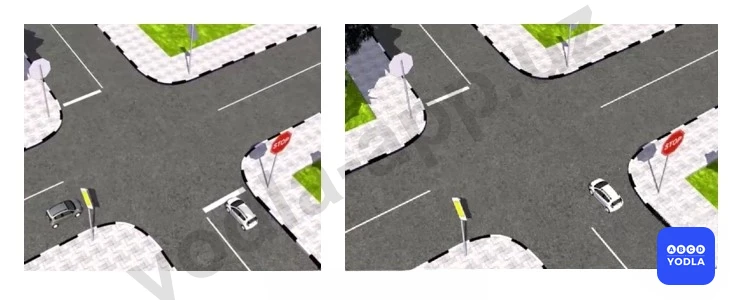

⬜ A. На рисунке слева
⬜ B. На рисунке справа
✅ C. На обоих изображениях

> 💡 Вопрос заключается в том, на каком рисунке водитель остановился без нарушения правил.

На первом рисунке водитель остановился перед стоп-линией, что полностью соответствует требованиям правил.

На втором рисунке стоп-линия отсутствует. В такой ситуации водитель имеет право остановиться в месте, откуда обеспечивается видимость пересекаемой дороги и возможность уступить дорогу другим участникам движения.

Следовательно, в обоих случаях водитель действовал правильно и не нарушил правила.

Правильный ответ — на обоих рисунках нарушение отсутствует.

---

## Вопрос 74

**Какой водитель нарушил правило остановки?**

⬜ A. Легковой автомобиль
⬜ B. Грузовой автомобиль
⬜ C. Оба не сломались
✅ D. Оба сломались

> 💡 Вопрос заключается в том, на каком рисунке водитель нарушил правила.

На первом рисунке водитель остановился, не доехав до стоп-линии. В ситуации, когда требуется остановка, транспортное средство должно остановиться непосредственно перед стоп-линией. Поэтому это считается нарушением.

На втором рисунке водитель проехал стоп-линию и остановился за ней. Это также является нарушением правил.

Следовательно, на обоих рисунках водитель нарушил правила.

Правильный ответ — нарушение имеется на обоих рисунках.

---

## Вопрос 75

**Какая горизонтальная разметка обозначает пешеходный переход в «3D» виде?**

⬜ A. «А»
⬜ B. «Б»
✅ C. «В»

> 💡 Вопрос заключается в том, какая дорожная разметка обозначает пешеходный переход с 3D-эффектом.

Если в вопросе указано именно «3D-пешеходный переход», правильным ответом будет вариант В. Эта разметка выполнена таким образом, что создаёт визуальный объёмный эффект.

Если бы речь шла о приподнятом пешеходном переходе, правильным мог бы быть другой вариант. Однако здесь ключевым словом является «3D».

Следовательно, правильный ответ — вариант В.

---

## Вопрос 76

**Какая горизонтальная разметка обозначает «D»-приподнятый пешеходный переход?**

⬜ A. «А»
✅ B. «Б»
⬜ C. «В»

> 💡 В данном вопросе речь идёт о «3D-приподнятом пешеходном переходе».

Обратите внимание, что здесь присутствуют два ключевых слова: «3D» и «приподнятый». Если бы речь шла только о 3D-пешеходном переходе, правильным мог бы быть вариант В. Однако в вопросе также указано, что переход является приподнятым.

Поэтому правильный ответ — вариант Б.

---

## Вопрос 77

**Какая горизонтальная разметка обозначает приподнятый пешеходный переход?**

✅ A. «А»
⬜ B. «Б»
⬜ C. «В»

> 💡 Вопрос заключается в том, какая дорожная разметка обозначает приподнятый пешеходный переход.

Слово «3D» в вопросе отсутствует. Поскольку речь идёт только о приподнятом пешеходном переходе, правильным ответом является вариант А.

Следовательно, разметка А обозначает приподнятый пешеходный переход.

---

## Вопрос 78

**в каких направлениях разрешено движение водителю красного автомобиля?**

⬜ A. Только налево
✅ B. Налево и в разворот
⬜ C. Прямо и налево

> 💡 Вопрос заключается в том, какой водитель правильно остановился при запрещающем сигнале светофора.

На первом рисунке водитель проехал стоп-линию. Обратите внимание, что здесь установлен знак «STOP», который указывает на наличие стоп-линии. Поскольку водитель остановился уже за стоп-линией, его действия являются неправильными.

На втором рисунке водитель остановился непосредственно перед стоп-линией, как того требуют правила.

Следовательно, правильный ответ — второй рисунок.

---

## Вопрос 79

**Какой водитель автомобиля правильно остановился на запрещающий сигнал светофора**

⬜ A. На 1-рисунке
✅ B. На 2-рисунке
⬜ C. На обоих рисунках

> 💡 "На основании пункта 4.1.4 Приложения 1 к ПДД и абзаца 1 пункта 56 главы 9 ПДД: 4.1.4. «Движение прямо или направо».
56. Перед поворотом направо, налево или разворотом водитель обязан заблаговременно занять соответствующее крайнее положение на проезжей части, предназначенной для движения в данном направлении, кроме случаев, когда совершается поворот при въезде на перекресток с круговым движением."

---

## Вопрос 80

**Какому автомобилю разрешено выполнить разворот?**

⬜ A. Обоим
⬜ B. Желтому автомобилю
⬜ C. Синему автомобилю
✅ D. Обоим автомобилям запрещено

> 💡 Вопрос заключается в том, какому автомобилю разрешён разворот.

В данной ситуации разворот не разрешён ни одному из автомобилей.

Жёлтый автомобиль движется со стороны сплошной линии разметки. Поскольку пересекать сплошную линию запрещено, выполнить разворот он не может.

Синий автомобиль находится в правой полосе движения. Разворот должен выполняться из крайней левой полосы, поэтому водитель синего автомобиля также не имеет права выполнять данный манёвр.

Следовательно, правильный ответ — разворот не разрешён ни одному из автомобилей.

---

## Вопрос 81

**Какое транспортное средство нарушает правила?**

⬜ A. Оба не нарушили
⬜ B. Нарушил зелёный
✅ C. Оба нарушили
⬜ D. Нарушил белый

> 💡 Вопрос заключается в том, какому автомобилю разрешён разворот.

В данной ситуации разворот не разрешён ни одному из автомобилей.

Жёлтый автомобиль движется со стороны сплошной линии разметки. Поскольку пересечение сплошной линии запрещено, выполнить разворот он не может.

Синий автомобиль находится в правой полосе движения. Разворот должен выполняться из крайней левой полосы, поэтому водитель синего автомобиля также не имеет права выполнять этот манёвр.

Следовательно, правильный ответ — разворот не разрешён ни одному из автомобилей.

---

## Вопрос 82

**По какому направлению разрешено движение?**

⬜ A. A и B
✅ B. B и C
⬜ C. По всем направлениям

> 💡 Как видно на рисунке, здесь нанесена сплошная линия разметки. Поэтому выполнить разворот водитель не может, так как пересечение сплошной линии запрещено.

Однако движение прямо и поворот направо разрешены.

Следовательно, правильный ответ — разрешено движение по направлениям Б и С.

---

## Вопрос 83

**Что означает мигание зеленого сигнала светофора?**

⬜ A. Предупреждает о неисправности светофора
✅ B. Разрешает движение и информирует о том, что вскоре будет включен запрещающий сигнал
⬜ C. Запрещает дальнейшее движение

> 💡 Мигающий зелёный сигнал разрешает движение.

Одновременно он предупреждает водителя о том, что время действия зелёного сигнала заканчивается и вскоре включится жёлтый или красный, то есть запрещающий сигнал.

Следовательно, мигающий зелёный сигнал разрешает движение и информирует о скором включении запрещающего сигнала.

---

## Вопрос 84

**В каком направлении разрешено движение?**

⬜ A. «A» «B» «C»
⬜ B. «A» «B» «D»
✅ C. «D»

> 💡 Как видно на рисунке, горит красный сигнал светофора, то есть общее движение запрещено.

Однако дополнительная секция разрешает движение налево. При этом временный дорожный знак запрещает поворот налево, поэтому выполнить левый поворот нельзя.

Но данный запрет не распространяется на разворот. Следовательно, водитель может выполнить разворот.

Правильный ответ — разрешено движение в направлении D, то есть разворот.

---

## Вопрос 85

**Какому водителю автомобиля разрешено повернуть?**

⬜ A. Разрешено обоим
⬜ B. Водителю белого автомобиля
✅ C. Запрещено обоим
⬜ D. Водителю красного автомобиля

> 💡 В этом вопросе многие ошибаются и считают, что красному автомобилю движение разрешено, потому что это разрешает светофор.

Но нужно помнить: сигналы светофора отменяют только действие знаков приоритета. Они не отменяют действие предписывающих знаков.

Здесь установлен временный предписывающий знак, который распространяется на все транспортные средства и предписывает движение только прямо.

Поэтому ни один из автомобилей не может выполнить поворот.

Следовательно, правильный ответ — поворот запрещён обоим автомобилям.

---

## Вопрос 86

**По каким направлениям разрешается движение?**

⬜ A. Разрешается движение во всех направлениях
⬜ B. Налево и разворот
✅ C. Налево
⬜ D. Прямо и налево
⬜ E. Движение во всех направлениях запрещается

> 💡 Как видно на рисунке, горит красный сигнал светофора, но дополнительная секция разрешает движение только налево.

Из-за расположения автомобиля и требований дорожных знаков разворот запрещён. Поэтому водитель не может выполнить разворот.

Следовательно, в данной ситуации разрешён только поворот налево.

Правильный ответ — можно двигаться только налево.

---

## Вопрос 87

**Каким транспортным средствам разрешено движение?**

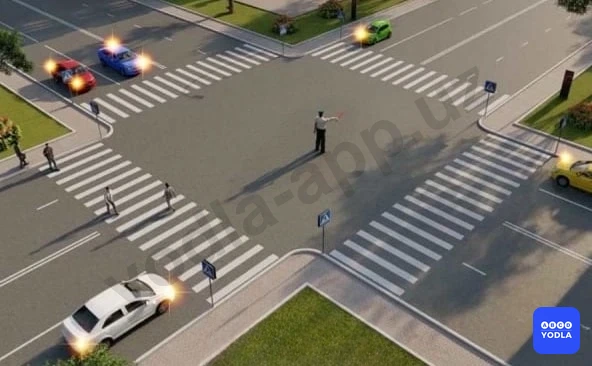

⬜ A. Только красному автомобилю
⬜ B. Всем транспортным средствам
✅ C. Красному, синему и зелёным автомобилям.

> 💡 В данной ситуации анализируем сигналы регулировщика.

- Транспортным средствам, находящимся за спиной регулировщика, движение запрещено во всех направлениях. Поэтому белому автомобилю движение запрещено.
- Жёлтому автомобилю также движение не разрешается.
- Зелёному автомобилю разрешено движение только направо.
- Синий и красный автомобили находятся сбоку от регулировщика, поэтому им разрешено движение в допустимых направлениях.

Следовательно:
- белому и жёлтому автомобилям движение запрещено;
- зелёному, синему и красному автомобилям движение разрешено.

Правильный ответ — красный, зелёный и синий автомобили.

---

## Вопрос 88

**В каких направлениях может двигаться автомобиль?**

⬜ A. Только направо
⬜ B. Остановиться и ждать зеленого сигнала светофора
⬜ C. Только прямо
✅ D. Во всех направлениях

> 💡 В данной ситуации сигналы регулировщика и светофора противоречат друг другу.

Согласно Правилам дорожного движения, если сигналы регулировщика противоречат сигналам светофора или требованиям дорожных знаков, водители обязаны руководствоваться сигналами регулировщика.

Поэтому в данной ситуации приоритет имеют именно сигналы регулировщика, а не светофора.

Если положение регулировщика разрешает движение во всех направлениях, то транспортные средства могут двигаться во всех разрешённых направлениях.

Следовательно, правильный ответ — необходимо руководствоваться сигналами регулировщика, и в данной ситуации движение разрешено во всех направлениях.

---

## Вопрос 89

**По каким направлениям разрешено движение транспортных средств?**

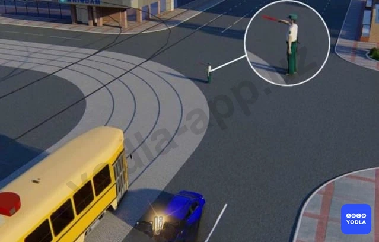

⬜ A. Трамваю налево или прямо
⬜ B. Только автомобилю налево
⬜ C. Трамваю и автомобилю налево
⬜ D. Трамваю налево или прямо, автомобилю после трамвая
✅ E. Трамваю налево, автомобилю налево и в обратном направлении

> 💡 Согласно пункту 38 главы 7 ПДД, правая рука регулировщика вытянута вперед: со стороны левого бока — разрешено движение трамваю налево, безрельсовым транспортным средствам — во всех направлениях; со стороны груди — всем транспортным средствам разрешено движение только направо; со стороны правого бока и спины — движение всех транспортных средств запрещено; пешеходам разрешено переходить проезжую часть за спиной регулировщика.

---

## Вопрос 90

**Разрешается ли Вам продолжить движение, если регулировщик поднял руку вверх после того, как Вы въехали на перекресток?**

⬜ A. Не разрешается
⬜ B. Разрешается, только если Вы поворачиваете направо
✅ C. Разрешается

> 💡 Согласно пункту 124 Правил дорожного движения, в жилой зоне запрещается: учебная езда на механических транспортных средствах; стоянка с работающим двигателем; стоянка грузовых автомобилей с разрешенной максимальной массой более 3,5 т вне специально выделенных и обозначенных дорожными знаками и (или) дорожной разметкой мест.

---

## Вопрос 91

**Разрешается ли транспортному средству с включенным маячком двигаться прямо?**

⬜ A. Разрешается
✅ B. Запрещается

> 💡 Согласно пункту 60 главы 9 ПДД, в случаях, когда траектории движения транспортных средств пересекаются, а очерёдность проезда не оговорена настоящими Правилами, дорогу должен уступить водитель, к которому транспортное средство приближается справа.

---

## Вопрос 92

**В каких направлениях разрешено движение автомобилям?**

⬜ A. Красному — налево, синему — запрещено
⬜ B. Синему — прямо, красному — налево
✅ C. Обоим разрешено движение по указанным направлениям
⬜ D. Красному разрешено, синему направо запрещено

> 💡 "На основании пункта 5.8.2 Приложения 1 к ПДД и абзаца 11 раздела 5 «Информационно-указательные знаки», а также пункта 3.18.2 Приложения 1 к ПДД и абзаца 47 раздела 3 «Запрещающие знаки»: 5.8.2. «Направления движения по полосе». Разрешенные направления движения по полосе. Движение по другим направлениям запрещается.
Знаки 5.8.1 и 5.8.2, разрешающие поворот налево из крайней левой полосы, разрешают и разворот с этой полосы. 
3.18.2. «Поворот налево запрещен». Действие знаков 3.18.1 и 3.18.2 распространяется на пересечение проезжих частей, перед которыми установлен знак."

---

## Вопрос 93

**В каких случаях разрешено применять звуковые сигналы в населённых пунктах?**

⬜ A. Только для предупреждения о намерение произвести обгон
✅ B. Только для предотвращения ��орожно-транспортного происшествия
⬜ C. В обоих перечисленных случаях

> 💡 В населённых пунктах звуковой сигнал разрешается подавать только для предотвращения дорожно-транспортного происшествия.

Следовательно, в населённых пунктах звуковой сигнал подаётся только для предотвращения опасности.

---

## Вопрос 94

**Разворот запрещается:**

⬜ A. Ближе 15 м  от перекрестков

⬜ B. На нерегулируемых перекрестках, если на пересе­каемой дороге организовано одностороннее движение
✅ C. На пешеходных переходах
⬜ D. Во всех перечисленных случаях

> 💡 Внимательно прочитайте вопрос.

Разворот однозначно запрещён на пешеходных переходах.

Многие выбирают ответ «во всех перечисленных случаях», но здесь он будет неправильным.

Поскольку:
- вблизи нерегулируемого перекрёстка;
- или на некоторых перекрёстках, где пересекаемая дорога является дорогой с односторонним движением,

разворот не всегда запрещён.

Следовательно, правильный ответ — разворот запрещён на пешеходных переходах.

---

## Вопрос 95

**Преимущество в движении имеет:**

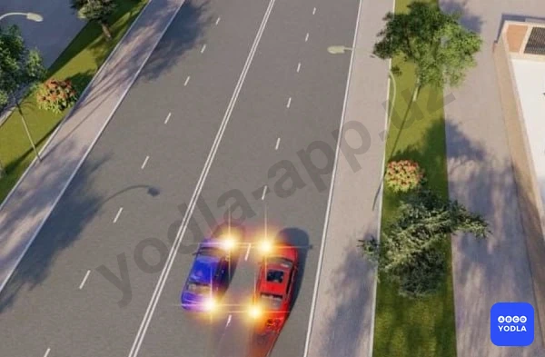

⬜ A. Синий автомобиль, т.к. красный изменяет направление движения влево
✅ B. Красный автомобиль, т.к. при взаимном перестроении он находится справа
⬜ C. Синий автомобиль, т.к. при взаимном перестроении он находится слева

> 💡 Какое транспортное средство имеет преимущество при перестроении?

Если два транспортных средства одновременно намерены перестроиться, водитель обязан уступить дорогу транспортному средству, находящемуся справа.

В данной ситуации справа находится красный автомобиль.

Поэтому преимущество при перестроении имеет красный автомобиль, и именно он перестраивается первым.

Следовательно, правильный ответ — преимущество имеет красный автомобиль.

---

## Вопрос 96

**Водитель какого транспортного средства правильно въезжает на пересечение с круговым движением?**

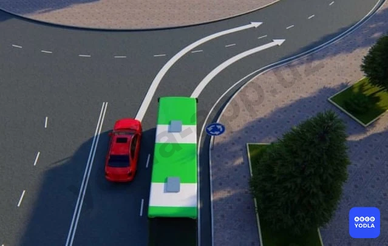

✅ A. Оба водителя
⬜ B. Только водитель автобуса
⬜ C. Только водитель легкового автомобиля

> 💡 В данной ситуации оба водителя правильно въезжают на перекрёсток с круговым движением.

Согласно правилам, при въезде на перекрёсток с круговым движением водитель может занять:
- правую полосу;
- или левую полосу.

Поэтому въезд обоих автомобилей соответствует Правилам дорожного движения.

Однако при выезде с кругового движения водитель должен занимать только крайнюю правую полосу.

В данной ситуации автомобили только въезжают на круг, поэтому оба водителя действуют правильно.

Следовательно, правильный ответ — оба водителя правильно въезжают на перекрёсток с круговым движением.

---

## Вопрос 97

**Как Вам следует действовать, выезжая с места стоянки одновременно с другим автомобилем?**

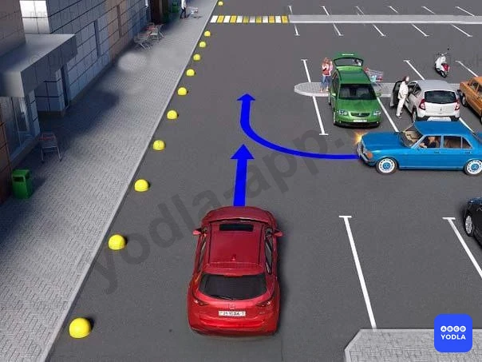

✅ A. Уступить дорогу
⬜ B. Проехать первым
⬜ C. По взаимной договоренности с водителем этого автомобиля

> 💡 При выезде с места стоянки, если траектории движения транспортных средств пересекаются, необходимо уступить дорогу транспортному средству, приближающемуся справа.

Если в вопросе не указано, какое транспортное средство имеется в виду, предполагается, что вашим транспортным средством является автомобиль, расположенный на рисунке ближе всего к вам. В данном случае это красный автомобиль.

Следовательно, правильный ответ — уступить дорогу транспортному средству, приближающемуся справа.

---

## Вопрос 98

**Водитель какого транспортного средства должен уступить дорогу в данной ситуации?**

⬜ A. Водитель белого автомобиля
✅ B. Водитель красного автомобиля

> 💡 В данной ситуации уступить дорогу должен водитель транспортного средства, у которого справа находится другое транспортное средство.

В этом случае правая сторона водителя красного автомобиля занята, поэтому именно он обязан уступить дорогу.

Следовательно, правильный ответ — водитель красного автомобиля должен уступить дорогу.

---

## Вопрос 99

**Водитель автомобиля в каком направлении нарушает правила?**

⬜ A. A
⬜ B. B
✅ C. Нарушает правила в обоих направлениях
⬜ D. Не нарушает правила ни в одном направлении

> 💡 Поворот направо в направлении А запрещён. Поворот в направлении Б разрешён, однако при перестроении на данную полосу водитель пересёк сплошную линию разметки.

Таким образом, в обоих случаях требования Правил дорожного движения нарушены.

Следовательно, правильный ответ — нарушения допущены в направлениях А и Б.

---

## Вопрос 100

**В каком направлении разрешается движение автомобилям?**

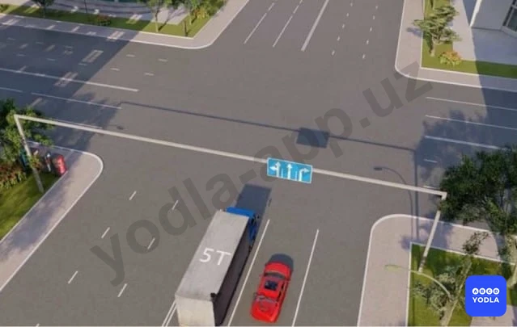

⬜ A. Красному автомобилю –прямо, синему автомобилю- прямо и налево
⬜ B. Красному и синему автомобилям-прямо
✅ C. Красному автомобилю –прямо, синему- налево или обратно

> 💡 В данной ситуации грузовому автомобилю с крайней левой полосы разрешается только поворот налево и разворот. Движение прямо с этой полосы запрещено.

Транспортные средства, намеревающиеся двигаться прямо, могут использовать остальные полосы движения, но не крайнюю левую.

Дорожный знак распространяется на все транспортные средства. Поэтому не следует делать вывод только по знаку, необходимо также учитывать правила движения по полосам.

Следовательно, правильный ответ — красному автомобилю разрешено движение прямо, а синему автомобилю разрешены поворот налево и разворот.

---

## Вопрос 101

**Разрешается ли выезжать на крайнюю левую полосу предназначенную для встречного движения на дорогах с двухсторонним движением имеющих три полосы?**

⬜ A. Разрешается для обгона
⬜ B. Разрешается во всех случаях
✅ C. Запрещается

> 💡 На трёхполосной дороге с двусторонним движением выезд на крайнюю левую полосу, предназначенную для встречного движения, запрещён.

Следовательно, правильный ответ — запрещается.

---

## Вопрос 102

**В каком направлении разрешается движение синему автомобилю?**

⬜ A. Только в обратном направлении
⬜ B. Прямо, налево и в обратном направлении
✅ C. Налево и в обратном направлении
⬜ D. Во всех направлениях

> 💡 На трёхполосной дороге с двусторонним движением движение по средней полосе разрешается только для поворота налево и разворота. Движение прямо по средней полосе запрещено.

Следовательно, правильный ответ — разрешены поворот налево и разворот.

---

## Вопрос 103

**Разрешается ли водителю синего автомобиля выполнять обгон?**

⬜ A. Разрешается
✅ B. Запрещается
⬜ C. Разрешается, если красный автомобиль движется со скоростью менее 40 км/час

> 💡 В данной ситуации на трёхполосной дороге с двусторонним движением красный автомобиль объезжает неисправное транспортное средство или участок, где проводятся дорожные работы.

Синий автомобиль намерен обогнать красный автомобиль с выездом на полосу встречного движения. Такой выезд запрещён.

Следовательно, правильный ответ — водителю синего автомобиля обгон выполнять запрещено.

---

## Вопрос 104

**По какой полосе разрешается движение безрельсовых транспортных средств в населенных пунктах, если имеются три полосы и более в одном направлении? Грузовые автомобили не учитывать**

⬜ A. По любой полосе
⬜ B. По возможности ближе к правому краю проезжей части
✅ C. По любой полосе кроме крайней левой, на которою разрешается выезжать только при интенсивном движении на других полосах а также для поворота налево,разворота и остановки на дороге с односторонним движением

> 💡 В населённых пунктах легковые автомобили могут двигаться по любой полосе, кроме крайней левой, даже если другие полосы свободны.

На дорогах с тремя и более полосами крайняя левая полоса используется только для поворота налево, разворота, движения при интенсивном потоке транспорта, а на дорогах с односторонним движением — также для остановки.

Следовательно, правильный ответ — **разрешается движение по любой полосе, кроме крайней левой.**

---

## Вопрос 105

**В каких случаях разрешается выезжать за пределы правой полосы, если Вы управляете транспортным средством, скорость которого по техническим причинам не может быть более 40 км/ч?**

⬜ A. Только при перестроении перед поворотом налево либо разворотом
⬜ B. Только при обгоне или объезде
✅ C. Во всех перечисленных случаях
⬜ D. Во всех перечисленных случаях, а также при наличии трех и более полос для движения в одном направлении

> 💡 Транспортному средству, которое не может двигаться со скоростью более 40 км/ч, разрешается выезжать на левую полосу только в отдельных случаях.

К таким случаям относятся поворот налево, разворот, объезд препятствия, а также обгон в случаях, предусмотренных Правилами дорожного движения.

Следовательно, правильный ответ — во всех перечисленных случаях.

---

## Вопрос 106

**Где на проезжей части вне населенных пунктов водители должны вести транспортные средства?**

✅ A. По возможности ближе к правому краю проезжей части
⬜ B. По любой полосе
⬜ C. Только по правой полосе. Выезд на левую полосу разрешается для поворота налево или разворота

> 💡 Вне населённых пунктов водители должны двигаться как можно ближе к правому краю проезжей части.

Это требование установлено пунктом 67 Правил дорожного движения.

Следовательно, правильный ответ — двигаться как можно ближе к правому краю проезжей части.

---

## Вопрос 107

**По какой полосе разрешается движение после этого знака?**

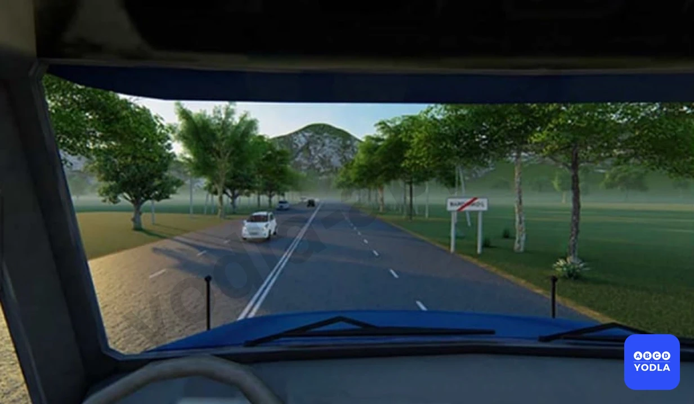

⬜ A. По любой полосе
✅ B. По правой полосе
⬜ C. Только по левой полосе

> 💡 Данный дорожный знак обозначает конец населённого пункта. После него движение осуществляется за пределами населённого пункта.

Согласно Правилам дорожного движения, за пределами населённого пункта при свободной правой полосе запрещается занимать левую полосу. Поэтому водитель должен двигаться по правой полосе.

Следовательно, правильный ответ — разрешается движение по правой полосе.

---

## Вопрос 108

**Какие транспортного средства нарушает правило остановки в населённых пунктах?**

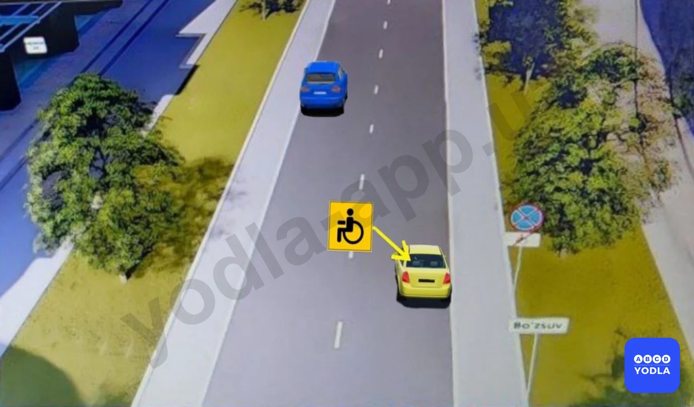

⬜ A. Водитель жёлтого автомобиля
⬜ B. Водитель синего автомобиля
✅ C. Оба не нарушили
⬜ D. Оба нарушили

> 💡 В данной ситуации вопрос звучит так: «Какой водитель в населённом пункте нарушает правила остановки?» Правильный ответ — «Никто не нарушает».

Объясню почему. Водитель жёлтого автомобиля имеет опознавательный знак «Инвалид». Поскольку установлен дорожный знак «Остановка запрещена, кроме инвалидов», ему разрешено остановиться в этом месте.

Синий автомобиль остановился с левой стороны дороги. Такая остановка разрешается при соблюдении четырёх условий:

Дорога находится в населённом пункте.
Посередине отсутствуют трамвайные пути.
Дорога имеет по одной полосе движения в каждом направлении (всего две полосы).
Дорожная разметка разрешает такую остановку.

Все эти условия выполнены, поэтому водитель синего автомобиля также не нарушает Правила дорожного движения.

Следовательно, правильный ответ — оба водителя правила не нарушают.

---

## Вопрос 109

**По каким направлениям разрешено движение грузовому автомобилю?**

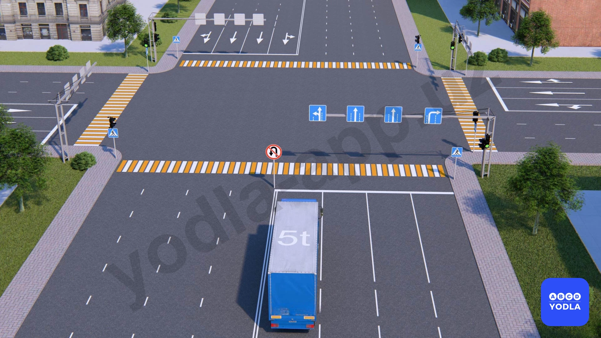

✅ A. Только налево
⬜ B. Налево и разворот
⬜ C. Прямо и налево

> 💡 На изображении дорога имеет четыре полосы движения в одном направлении. Если в одном направлении три и более полос, грузовым автомобилям разрешается занимать крайнюю левую полосу только для поворота налево или разворота. Движение прямо по крайней левой полосе для грузовых автомобилей запрещено.

Однако в данной ситуации установлен дорожный знак «Разворот запрещён», поэтому водитель грузового автомобиля не может выполнить разворот. Следовательно, ему разрешается только поворот налево.

---

## Вопрос 110

**С какой максимальной скоростью разрешается движение не междугородним автобусам на участках дорог обозначенных таким дорожным знаком?**

⬜ A. 50 км/ч
⬜ B. 60 км/ч
⬜ C. 70 км/ч
✅ D. 80 км/ч
⬜ E. 90 км/ч

> 💡 Этот дорожный знак обозначает дорогу вне населённого пункта. На таких дорогах для негородских (не междугородних) автобусов максимально разрешённая скорость составляет 80 км/ч.

Если это междугородний автобус, то максимально разрешённая скорость составляет 90 км/ч.

Поэтому правильный ответ — 80 км/ч.

---

## Вопрос 111

**С какой максимальной скоростью разрешается движение междугородным автобусам на участках дорог обозначенных таким дорожным знаком?**

⬜ A. 50 км/ч
⬜ B. 60 км/ч
⬜ C. 70 км/ч
⬜ D. 80 км/ч
✅ E. 90 км/ч

> 💡 Этот дорожный знак обозначает дорогу вне населённого пункта. На таких дорогах для междугородних автобусов максимально разрешённая скорость составляет 90 км/ч.

Поэтому правильный ответ — 90 км/ч.

---

## Вопрос 112

**В каких направлениях разрешено движение данному автомобилю?**

⬜ A. По всем направлениям
⬜ B. По первому, второму и третьему направлениям
✅ C. По первому, третьему и четвёртому направлениям
⬜ D. Только по первому

> 💡 Как видно на изображении, транспортные средства, конструктивная скорость которых не превышает 40 км/ч, должны двигаться только по крайней правой полосе.

Перестраиваться на другие полосы им запрещено. Исключение составляют случаи, когда необходимо повернуть налево или выполнить разворот.

Следовательно, в данной ситуации разрешено движение по направлениям 1, 3 и 4.

---

## Вопрос 113

**На двухполосных дорогах с двусторонним движением, расположенных вне населённых пунктов, водители транспортных средств (или составов транспортных средств), скорость которых не может превышать 50 километров в час, а также длина которых превышает 7 метров, должны соблюдать какое расстояние между собой и движущимся впереди транспортным средством?**

⬜ A. 3 метра
⬜ B. 5 метров
⬜ C. Такое расстояние, которое обеспечивает гарантию предотвращения столкновения в случае резкого торможения движущегося впереди транспортного средства
✅ D. Такое расстояние, которое позволяет обгоняющему транспортному средству без затруднений вернуться в занимаемую ранее полосу

> 💡 Здесь важно обратить внимание на то, что вне населённых пунктов транспортные средства, движущиеся со скоростью не более 50 км/ч, а также транспортные средства длиной более 7 метров, не должны создавать помех другим участникам движения.

Если за ними образовалась очередь из автомобилей и дорожная разметка разрешает обгон, водитель обязан соблюдать такую дистанцию до впереди идущего транспортного средства, чтобы обгоняющий автомобиль мог безопасно вернуться в ранее занимаемую полосу.

Поэтому правильный ответ — соблюдать дистанцию, достаточную для безопасного возвращения обгоняющего транспортного средства в свою полосу.

---

## Вопрос 114

**На каком из рисунков показан обгон?**

✅ A. «А»
⬜ B. «Б»
⬜ C. «А» и «Б»

> 💡 Согласно пункту 6, подпункту 24 главы 1 ПДД, обгон — это опережение одного или нескольких транспортных средств, связанное с выездом на полосу, предназначенную для встречного движения, и последующим возвращением на ранее занимаемую полосу.

Поэтому обгон правильно показан на рисунке А, так как жёлтый автомобиль выезжает на полосу встречного движения для обгона синего автомобиля. На рисунке Б изображено опережение, поскольку жёлтый автомобиль планирует опередить синий автомобиль, не выезжая на полосу встречного движения.

---

## Вопрос 115

**Разрешен ли водителю легкового автомобиля обгон в показанной ситуации?**

⬜ A. Разрешен
⬜ B. Разрешен, если скорость мотоциклиста менее 40 км/ч
✅ C. Запрещен

> 💡 Это двусторонняя дорога. Официальные лица, которые видят. Здесь переход на крайнюю левую полосу запрещен. Значит, водитель красного автомобиля движется здесь на встречную полосу и нарушает это правило. Значит, правильный ответ здесь запрещен.

---

## Вопрос 116

**По какому направлению водитель автомобиля правильно выполняет обгон?**

⬜ A. По направлению «А»
✅ B. По направлению «Б»
⬜ C. По направлению «А» и «Б»

> 💡 Значит, водитель красного автомобиля выехал на обгон мотоцикла, но, не доезжая до перекрестка, уже успел его обогнать. Если бы вы дали направление А, он бы оказался на перекрестке, равнозначном перекрестку. Поэтому, следовательно, ему запрещено в направлении А, правильный ответ будет правильным в направлении Б.

---

## Вопрос 117

**Разрешается ли водителю красного автомобиля выполнить обгон в данной ситуации?**

✅ A. Разрешается
⬜ B. Запрещается
⬜ C. Разрешается при условии; что скорость обгоняемого менее 40 км/ч

> 💡 Согласно абзацу 2 пункта 86 главы 12 ПДД, обгон запрещен - на нерегулируемых перекрестках при движении по дороге, не являющейся главной.

---

## Вопрос 118

**Разрешается ли обгонять автобус в этом месте?**

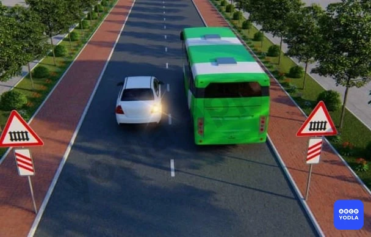

✅ A. Разрешается
⬜ B. Запрещается

> 💡 Согласно абзацу 4 пункта 86 главы 12 ПДД, обгон запрещён на железнодорожных переездах и ближе чем за 100 метр перед ними. Вне населенных пунктов знак 1.1. повторяются. Первый знак устанавливается на расстоянии 150 — 300 м до начала опасного участка..

---

## Вопрос 119

**На каких изображениях показан обгон?**

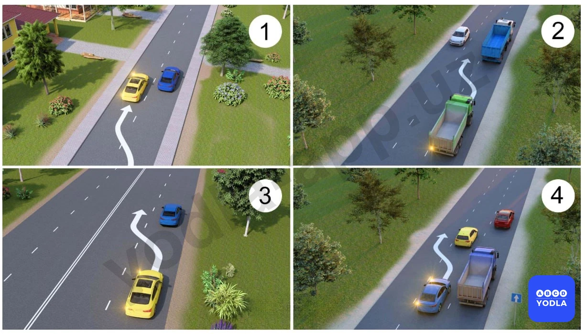

✅ A. Только на первом и втором изображениях
⬜ B. Только на первом и третьем изображениях
⬜ C. Только на первом, втором и четвёртом изображениях
⬜ D. Только на первом изображении
⬜ E. На всех изображениях

> 💡 Пункта 88 главы 13 ПДД, гласит: На левой стороне дороги остановка и стоянка разрешаются в населенных пунктах на дорогах с односторонним движением, имеющим две полосы движения, при отсутствии трамвайных путей посередине. Пункта 115.1 главы 17.1 ПДД, гласит: По дороге с выделенной полосой для маршрутного общественного транспорта могут двигаться только маршрутные транспортные средства. Движение других транспортных средств по этой полосе запрещается, за исключением транспортных средств оперативных и специальных служб.

---

## Вопрос 120

**Какие предупредительные сигналы можно использовать при обгоне в населённых пунктах?**

✅ A. Фары дальнего света
⬜ B. Звуковые сигналы
⬜ C. 1 и 2

> 💡 На основании абзацев 2 и 3 пункта 48 и пункта 49 главы 8 ПДД: 48. Звуковые сигналы могут применяться только в следующих случаях:
вне населенных пунктов при обгоне, для предупреждения других водителей; Запрещается применение звуковых сигналов кроме случаев, указанных выше. 
49. Вместо звукового сигнала об обгоне или же вместе с ним может подаваться предупредительный сигнал переключением фар.

---

## Вопрос 121

**Какие предупредительные сигналы можно использовать при обгоне вне населённых пунктов?**

⬜ A. Фары дальнего света
⬜ B. Звуковые сигналы
✅ C. 1 и 2

> 💡 На основании пункта 4.1.1 Приложения 1 к ПДД и абзаца 10 раздела 4 «Предписывающие знаки»: 4.1.1. «Движение прямо». Действие знаков 4.1.1 — 4.1.6 распространяется на пересечение проезжих частей, перед которым установлен знак.

---

## Вопрос 122

**Водители каких транспортных средств нарушили правила остановки?**

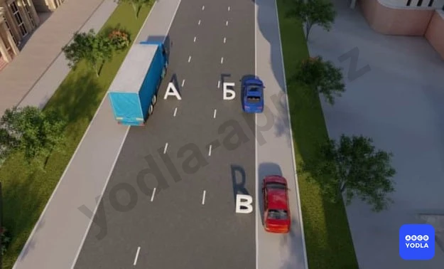

⬜ A. Только «А»
⬜ B. Только «Б»
⬜ C. Только «В»
⬜ D. «Б» и «В»
✅ E. «А» и «Б»

> 💡 Пункта 88 главы 13 ПДД, гласит: Остановка и стоянка транспортных средств разрешается как можно правее на обочине, а при ее отсутствии — у края проезжей части, и в случаях, указанных в пункте 89 Правил — на тротуаре. Грузовым автомобилям с разрешенной максимальной массой более 3,5 тн на левой стороне дорог с односторонним движением разрешается лишь остановка для загрузки или разгрузки груза.
Пункта 89 главы 13 ПДД, гласит: Ставить транспортные средства на проезжей части разрешается в один ряд параллельно к краю проезжей части, а двухколесные транспортные средства без бокового прицепа – в два ряда.

---

## Вопрос 123

**В каком ответе указаны все водители; нарушившие правила остановки?**

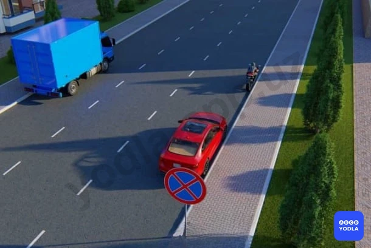

⬜ A. Водители красного автомобиля и мотоцикла
⬜ B. Водитель синего автомобиля
⬜ C. Водитель мотоцикла
✅ D. Водители всех транспортных средств

> 💡 Запрешаюший знак 3.27 “Остановка запрешена”, Запрешается остановка и стоянка транспортных средств. Знак дополнительной информации 7.2.4 “Зона действия” информирует водителей о нахождении их в зоне действия знаков. Пункту 66 главы 10 ПДД, гласит: На дорогах с двусторонним движением, имеющих три полосы (кроме обозначенных разметкой 1.9), на среднюю полосу разрешается выезжать только для обгона, поворота налево, разворота и объезда. Выезжать на крайнюю левую полосу, предназначенную для встречного движения, запрещается.

---

## Вопрос 124

**Какой автомобиль правильно поставлен на стоянку?**

⬜ A. Легковой автомобиль
✅ B. Оба неправильно
⬜ C. Оба правильно
⬜ D. Грузовик

> 💡 Согласно абзацу 3 пункта 88 главы 13 ПДД, грузовым автомобилям с разрешенной максимальной массой более 3,5 т на левой стороне дороги с односторонним движением остановка разрешается только для загрузки и разгрузки груза. Согласно абзацу 8 пункта 91 главы 13 ПДД, остановка и стоянка запрещается в следующих местах: на пешеходных переходах и ближе 10 м перед ними.

---

## Вопрос 125

**Водителю какого автомобиля разрешена остановка?**

⬜ A. Водителю легкового автомобиля
✅ B. Водителю грузового автомобиля
⬜ C. Обоим водителям

> 💡 Согласно абзацу 4 пункта 91 главы 13 ПДД, остановка запрещается на мостах, эстакадах, путепроводах, если для движения в одном направлении имеется менее трёх полос. Под мостами, эстакадами и путепроводами (кроме участков дорог, на которых разрешена стоянка с соответствующими дорожными знаками).

---

## Вопрос 126

**Водитель какого автомобиля не нарушил правила стоянки?**

⬜ A. Красный
⬜ B. Желтый
✅ C. Оба нарушили
⬜ D. Никто не нарушил

> 💡 Согласно пункту 88 главы 13 ПДД, остановка и стоянка транспортных средств разрешаются на правой стороне дороги на обочине, а при ее отсутствии - на проезжей части у ее края. В населенных пунктах остановка и стоянка допускаются на левой стороне дорог с одной полосой движения в каждом направлении и не имеющих трамвайных путей посередине, а так же дорог только с односторонним движением.
Согласно пунку 91 главы 13 ПДД, остановка запрещается на пересечении проезжих частей и ближе 30 м от края пересекаемой проезжей части (за исключением стороны напротив бокового проезда трехсторонних пересечений (перекрестков), имеющих сплошную линию дорожной разметки или разделительную полосу).

---

## Вопрос 127

**В каком случае водитель правильно остановил машину для высадки пассажиров?**

⬜ A. На левом рисунке
⬜ B. На обоих рисунках
⬜ C. На правом рисунке
✅ D. На обоих рисунках остановился неправильно

> 💡 Пункта 91 главы 13 ПДД, гласит: на пешеходных переходах и менее чем за 10 метров до них; на пересечениях проезжих частей на расстоянии менее 30 метров от края пересекаюшей проезжей части (за исключением противоположной стороны примыкающей дороги, отделенной разделительной линией или разделительной полосой на трехсторонних перекрестках).

---

## Вопрос 128

**Разрешено ли водителю ставить автомобиль на стоянку в указанном месте?**

⬜ A. Да
✅ B. Нет

> 💡 Согласно пункту 2 статьи 61 Правил дорожного движения, при наличии в месте выезда на дорогу полосы разгона водитель должен двигаться по ней и перестраиваться на соседнюю полосу, уступая дорогу транспортным средствам, движущимся по этой дороге.

---

## Вопрос 129

**Кто из водителей нарушил правила стоянки?**

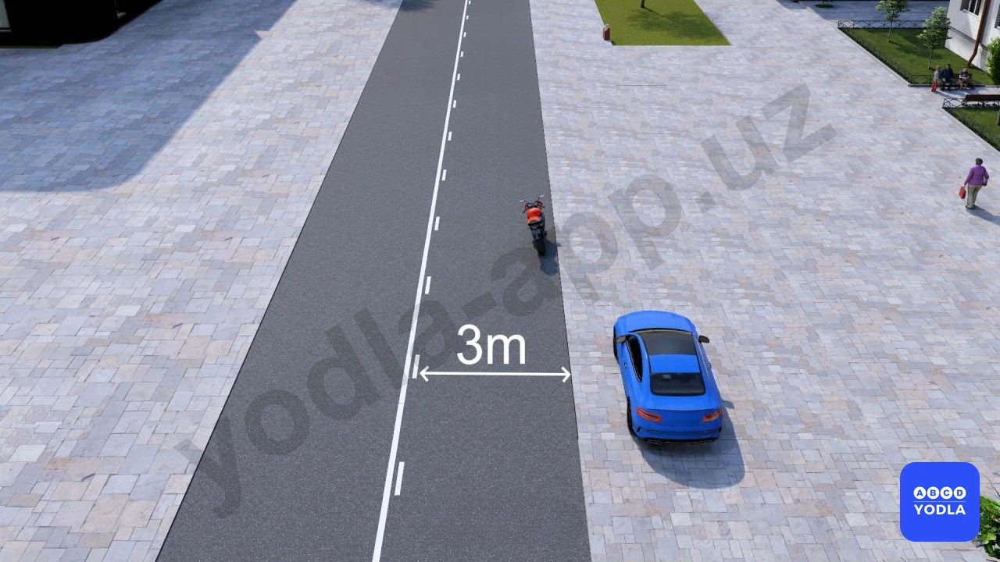

⬜ A. Только водитель мотоцикла
✅ B. Только водитель автомобиля стоящий на тротуаре
⬜ C. Никто не нарушил

> 💡 Знак 7.16 раздела 7 приложения № 1 к ПДД, «Влажное покрытие». Указывает, что действие знака распространяется на период времени, когда покрытие проезжей части влажное.

---

## Вопрос 130

**На каком изображении водители нарушили правила остановки?**

⬜ A. 1
⬜ B. 2
⬜ C. 3
⬜ D. 1,2
✅ E. 1,3

> 💡 ПДД приложение № 1: 4.1.1 Движение прямо.
Действие знака 4.1.1, установленного в начале участка дороги, распространяется до ближайшего перекрестка. Знак не запрещает поворот направо на прилегающие к дороге территории.

---

## Вопрос 131

** Зеленый автомобиль проедет перекресток:**

✅ A. Вторым
⬜ B. Первым

> 💡 Согласно пункту 99 главы № 15 ПДД, при повороте налево или развороте по зелёному сигналу светофора водитель безрельсового транспортного средства обязан уступить дорогу транспортным средствам, движущимся со встречного направления прямо или направо.

---

## Вопрос 132

**Водитель какого транспортного средства имеет преимущество в движении?**

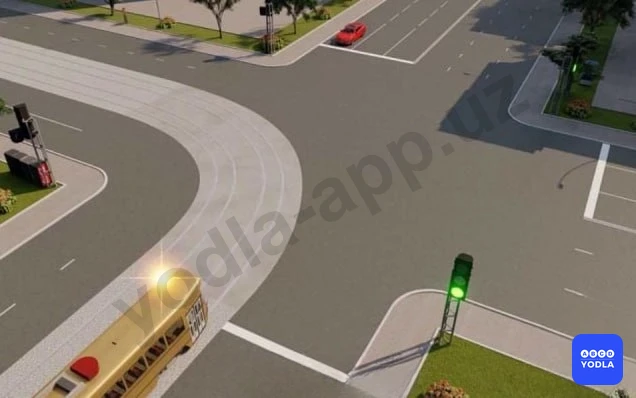

⬜ A. Водитель автомобиля
✅ B. Водитель трамвая

> 💡 Согласно пункту 101 главы 15 ПДД, если сигналы светофора или регулировщика разрешают движение одновременно трамваю и безрельсовым транспортным средствам, то трамвай имеет право на первоочередное движение, независимо от направления его движения.

---

## Вопрос 133

**Красный автомобиль проедет перекресток**

✅ A. Первым
⬜ B. Вторым

> 💡 Согласно пункту 43 главы № 7 ПДД, в случае, если значение сигналов светофора противоречат требованиям дорожных знаков приоритета, водители должны руководствоваться сигналами светофора. Согласно пункту 99 главы № 15 ПДД, при повороте налево или развороте по зелёному сигналу светофора водитель безрельсового транспортного средства обязан уступить дорогу транспортным средствам, движущимся со встречного направления прямо или направо.

---

## Вопрос 134

**Преимущество в движении имеет:**

⬜ A. Водитель автобуса; выезжающий на перекресток по главной дороге
✅ B. Водитель легкого автомобиля; завершающий на перекрестке разворот
⬜ C. Водитель автобуса; выезжающий на перекресток при разрешающем сигнале светофора

> 💡 Согласно пунктам 102, 103 главы 15 ПДД, водитель, въехавший на перекресток при разрешающем сигнале светофора, должен выехать в намеченном направлении, независимо от сигналов светофора на выходе с него. При включении разрешающего сигнала светофора водитель обязан уступить дорогу транспортным средствам, завершающим движение через перекресток.

---

## Вопрос 135

**Вы намерены повернуть налево. Ваши действия?**

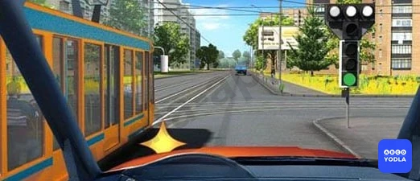

✅ A. Проедете перекресток первым
⬜ B. Дождитесь, пока Т-образный светофор даст разрешение и уступите дорогу трамваю
⬜ C. Уступите дорогу трамваю

> 💡 ПДД приложение № 1: 1.21. Дети.
Участок дороги вблизи детского учреждения (школы, места отдыха детей и т. п.), на проезжей части которого возможно появление детей.

---

## Вопрос 136

**Красный автомобиль кому должен уступить дорогу?**

⬜ A. Грузовику
⬜ B. Трактору
✅ C. Никому

> 💡 "На основании абзаца 1 пункта 56 главы 9 ПДД, а также пункта 1.1 Приложения 2 к ПДД и абзаца 44: 56. Перед поворотом направо, налево или разворотом водитель обязан заблаговременно занять соответствующее крайнее положение на проезжей части, предназначенной для движения в данном направлении, кроме случаев, когда совершается поворот при въезде на перекресток с круговым движением.
1.1 — разделяет транспортные потоки противоположных направлений и обозначает границы полос движения в опасных местах на дорогах и границы полос для велосипедистов; обозначает границы проезжей части, на которые въезд запрещен; обозначает границы стояночных мест транспортных средств и край проезжей части дорог, не отнесенных по условиям движения к автомагистралям; Линии 1.1 и 1.3 пересекать запрещается, кроме случая, когда линия 1.1 применена для обозначения края проезжей части."

---

## Вопрос 137

**Какой водитель первым продолжит движение?**

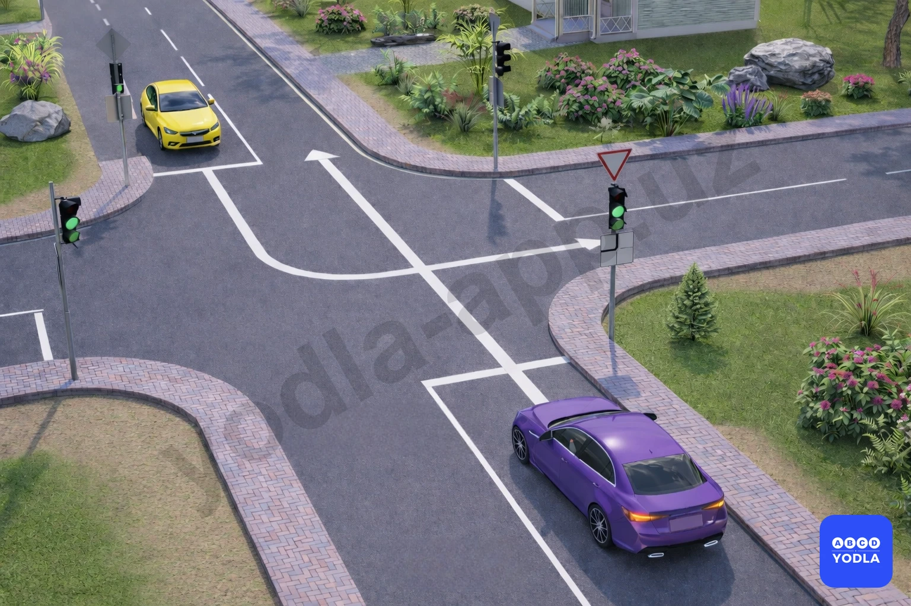

⬜ A. Водитель жёлтой автомобиля 
✅ B. Водитель синего автомобиля

> 💡 На основании пункта 7.22 абзаца 25 Приложения 3 к ПДД: Категория L — мототранспортные средства.

---

## Вопрос 138

**Транспортные средства проедут перекресток в следующем порядке:**

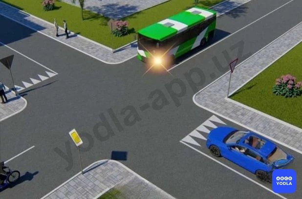

⬜ A. Легковой автомобиль, автобус, велосипед
⬜ B. Автобус, велосипед, легковой автомобиль
⬜ C. Автобус, легковой автомобиль, велосипед
✅ D. Велосипед, автобус, легковой автомобиль

---

## Вопрос 139

**Транспортные средства проедут перекресток в следующем порядке:**

⬜ A. Зеленый автомобиль одновременно с трамваем 2, трамвай 1, синий, желтый, красный автомобили
✅ B. Трамваи 1 и 2 одновременно с желтым автомобилем, зеленый, синий, красный автомобили

> 💡 Согласно пунктам 104, 107 главы 16 ПДД, на перекрестках неравнозначных дорог водитель транспортного средства, движущегося по второстепенной дороге, должен уступить дорогу транспортным средствам, приближающимся по главной дороге, независимо от направления их дальнейшего движения. На таких перекрестках трамвай имеет приоритет перед безрельсовыми транспортными средствами, движущимися в попутном или встречном направлении по равнозначной дороге, независимо от направления его движения. При повороте налево или развороте водитель безрельсового транспортного средства обязан уступить дорогу транспортным средствам, движущимся по равнозначной дороге со встречного направления прямо или направо, а также производящим обгон в разрешенных случаях. Этим же правилом должны руководствоваться между собой водители трамваев.

---

## Вопрос 140

**Синий автомобиль проедет перекресток:**

⬜ A. Первым
⬜ B. Вторым
⬜ C. Третьим
✅ D. Четвертым
⬜ E. Последним

> 💡 Согласно пункту 26 главы 6 ПДД, при приближении транспортных средств с включенными проблесковым маячком синего цвета или синего и красного цветов и специальным звуковым сигналом водители обязаны уступить им дорогу для обеспечения их беспрепятственного проезда. Согласно пункту 104 главы 16 ПДД, на перекрестках неравнозначных дорог водитель транспортного средства, движущегося по второстепенной дороге, должен уступить дорогу транспортным средствам, приближающимся по главной дороге, независимо от направления их дальнейшего движения. На таких перекрестках трамвай имеет приоритет перед безрельсовыми транспортными средствами, движущимися в попутном или встречном направлении по равнозначной дороге, независимо от направления его движения. Согласно пункту 107 главы 16 ПДД, при повороте налево или развороте водитель безрельсового транспортного средства обязан уступить дорогу транспортным средствам, движущимся по равнозначной дороге со встречного направления прямо или направо.

---

## Вопрос 141

**Укажите порядок проезда перекрёстка:**

⬜ A. Велосипед, красный автомобиль, белый автомобиль
⬜ B. Красный автомобиль, белый автомобиль, велосипед
✅ C. Велосипед, белый автомобиль, красный автомобиль

> 💡 На основании абзаца 1 пункта 88 главы 13 ПДД: 88. Остановка и стоянка транспортных средств разрешается как можно правее на обочине, а при ее отсутствии — у края проезжей части, и в случаях, указанных в пункте 89 Правил — на тротуаре.

---

## Вопрос 142

**Первым проедет перекресток:**

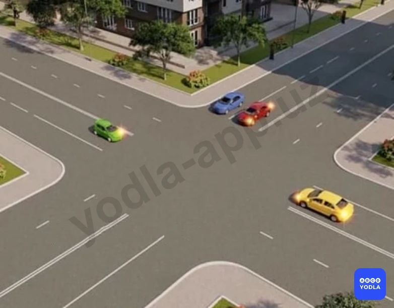

⬜ A. Красный автомобиль
⬜ B. Синий автомобиль
⬜ C. Желтый автомобиль
✅ D. Зеленый автомобиль

> 💡 Согласно пункту 105 главы 16 ПДД на перекрестке равнозначных дорог водитель безрельсового транспортного средства обязан уступить дорогу транспортным средствам, приближающимся справа.

---

## Вопрос 143

**Транспортные средства проедут перекресток в следующем порядке:**

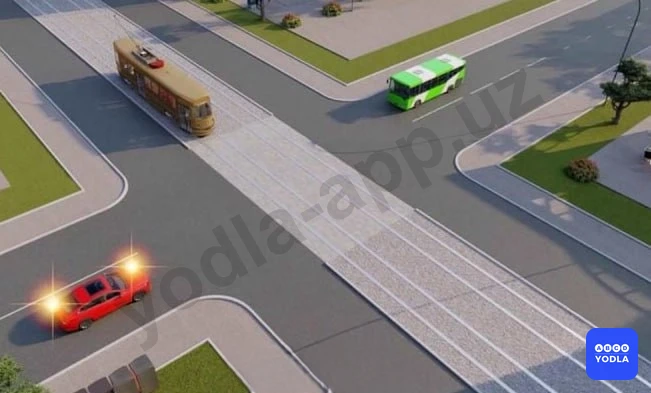

✅ A. Трамвай, автобус и легковой автомобиль
⬜ B. Автобус, легковой автомобиль, трамвай
⬜ C. Легковой автомобиль, трамвай, автобус

> 💡 Согласно пункту 105 главы 16 ПДД, на перекрестке равнозначных дорог трамвай имеет право на приоритет движения перед безрельсовыми транспортными средствами, независимо от направления его движения. Согласно пункту 107 главы 16 ПДД, при повороте налево или развороте водитель безрельсового транспортного средства обязан уступить дорогу транспортным средствам, движущимся по равнозначной дороге со встречного направления прямо или направо, а также производящим обгон в разрешенных случаях.

---

## Вопрос 144

**Вторым проедет перекресток:**

⬜ A. Красный автомобиль
✅ B. Синий автомобиль
⬜ C. Зеленый автомобиль

> 💡 Пункта 105 главы 16 ПДД, гласит: На перекрестке равнозначных дорог водитель безрельсового транспортного средства обязан уступить дорогу транспортным средствам, приближающимся справа.

---

## Вопрос 145

**Водитель какого транспортного средства имеет право на первоочередное движение?**

⬜ A. Водитель дорожной машины
✅ B. Водитель легкового автомобиля

> 💡 Согласно пункту 105 главы 16 ПДД, на перекрестке равнозначных дорог водитель безрельсового транспортного средства обязан уступить дорогу транспортным средствам, приближающимся справа. Согласно пункту 28 главы 6 ПДД, Проблесковый маячок жёлтого или оранжевого цвета не дает приоритета в движении и служит исключительно для предупреждения других участников движения об опасности.

---

## Вопрос 146

**Автомобили проедут перекресток в следующем порядке:**

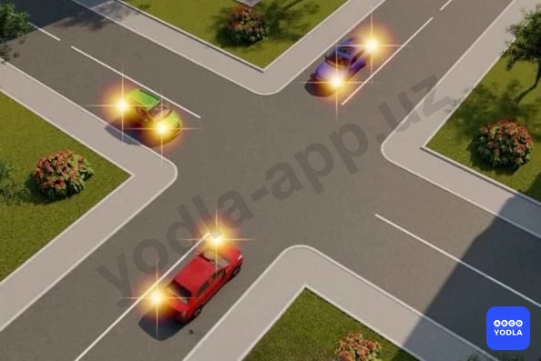

⬜ A. Красный, зеленый, синий
⬜ B. Синий, красный, зеленый
✅ C. Все три одновременно

> 💡 Согласно пункту 105 главы 16 ПДД на перекрестке равнозначных дорог водитель безрельсового транспортного средства обязан уступить дорогу транспортным средствам, приближающимся справа.

---

## Вопрос 147

**Вторым проедет перекресток:**

⬜ A. Красный автомобиль
✅ B. Синий автомобиль
⬜ C. Зеленый автомобиль

> 💡 Согласно пункту 105 главы 16 ПДД на перекрестке равнозначных дорог водитель безрельсового транспортного средства обязан уступить дорогу транспортным средствам, приближающимся справа.

---

## Вопрос 148

**Автомобили проедут перекресток в следующем порядке:**

✅ A. Желтый въедет на перекресток и остановится, чтобы пропустить синий; зеленый; синий одновременно с красным; желтый
⬜ B. Синий одновременно с красным; зеленый; желтый
⬜ C. Зеленый; синий одновременно с красным; желтый

> 💡 Согласно пункту 105 главы 16 ПДД, на перекрестке равнозначных дорог водитель безрельсового транспортного средства обязан уступить дорогу транспортным средствам, приближающимся справа. Согласно пункту 107 главы 16 ПДД, повороте налево или развороте водитель безрельсового транспортного средства обязан уступить дорогу транспортным средствам, движущимся по равнозначной дороге со встречного направления прямо или направо.

---

## Вопрос 149

**Водитель какого транспортного средства должен уступить дорогу?**

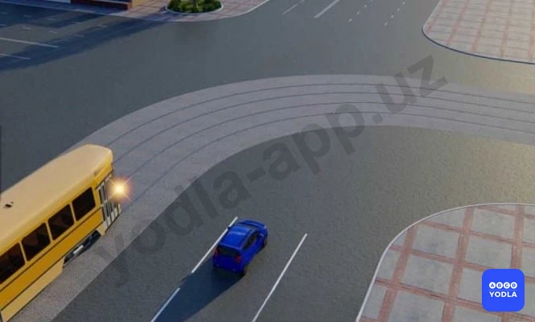

✅ A. Водитель автомобиля
⬜ B. Водитель трамвая

> 💡 Согласно пункту 105 главы 16 ПДД, на перекрестке равнозначных дорог водитель безрельсового транспортного средства обязан уступить дорогу транспортным средствам, приближающимся справа. На таких перекрестках трамвай имеет право на приоритет движения перед безрельсовыми транспортными средствами, независимо от направления его движения.

---

## Вопрос 150

**Транспортные средства проедут перекресток следующем порядке:**

✅ A. Все одновременно
⬜ B. Синий, красный, зеленый
⬜ C. Синий одновременно с зеленым, красный
⬜ D. Красный с зеленым, синий

> 💡 Согласно пункту 105 главы 16 ПДД на перекрестке равнозначных дорог водитель безрельсового транспортного средства обязан уступить дорогу транспортным средствам, приближающимся справа.

---

## Вопрос 151

**В каком ответе правильно указана очередность проезда?**

✅ A. Мотоцикл, автобус, грузовой автомобиль
⬜ B. Автобус, мотоцикл, грузовой автомобиль
⬜ C. Автобус, грузовой автомобиль, мотоцикл

> 💡 Согласно пункту 105 главы 16 ПДД на перекрестке равнозначных дорог водитель безрельсового транспортного средства обязан уступить дорогу транспортным средствам, приближающимся справа.

---

## Вопрос 152

**Вы намерены проехать перекресток в прямом направлении. Ваши действия?**

⬜ A. Уступите дорогу легковому автомобилю, поскольку онпервым въехал на перекресток
✅ B. Убедитесь, что легковой автомобиль уступает дорогу, и проедете перекресток первым

> 💡 Дорожная разметка 1.21 раздела 1 приложения № 2 к ПДД, (надпись «STOP») — предупреждает о приближении к разметке 1.12, когда она применяется в сочетании со знаком 2.5.

---

## Вопрос 153

**Какой водитель автомобиля должен уступить дорогу?**

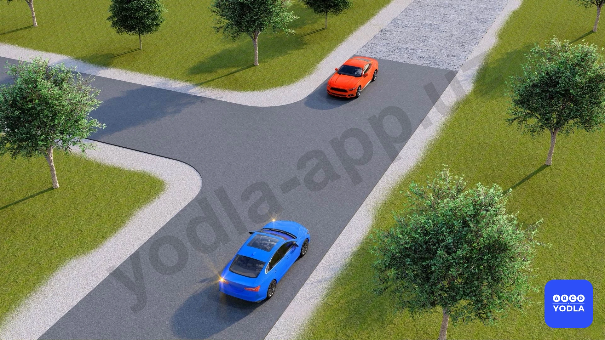

✅ A. Красный автомобиль
⬜ B. Синий автомобиль

> 💡 "На основании пункта 38 главы 7 ПДД: 38. Сигналы регулировщика имеют следующие значения:
Руки вытянуты в стороны или опущены:
Правая рука вытянута вперед:
со стороны левого бока — разрешено движение трамваю налево, безрельсовым транспортным средствам — во всех направлениях."

---

## Вопрос 154

**Укажите порядок движения:**

✅ A. Трамвай 1 одновременно с жёлтым автомобилем, трамвай 2 одновременно с чёрным автомобилем
⬜ B. Трамвай 1 одновременно с жёлтым автомобилем, затем чёрный автомобиль, затем трамвай 2
⬜ C. Трамвай 1, трамвай 2, жёлтый автомобиль, чёрный автомобиль

> 💡 На основании пункта 57 главы 9 ПДД: 57. Поворот должен осуществляться таким образом, чтобы при выезде с пересечения проезжих частей транспортное средство не оказалось на стороне встречного движения.
При повороте направо транспортное средство должно двигаться по возможности ближе к правому краю проезжей части.

---

## Вопрос 155

**В каком порядке проедут перекресток транспортные средства?**

⬜ A. Трамвай 2 одновременно с трамваем 1, синий автомобиль одновременно с красным
✅ B. Трамвай 2; синий автомобиль; трамвай 1; красный автомобиль

> 💡 Согласно пунктам 106, 105 и 104 главы 16 ПДД, если главная дорога на перекрестке меняет направление, водители, движущиеся по главной дороге, должны руководствоваться между собой правилами проезда перекрестков равнозначных дорог. На перекрестке равнозначных дорог водитель безрельсового транспортного средства обязан уступить дорогу транспортным средствам, приближающимся справа. Этим же правилом должны руководствоваться между собой водители трамваев. На перекрестках неравнозначных дорог водитель транспортного средства, движущегося по второстепенной дороге, должен уступить дорогу транспортным средствам, приближающимся по главной дороге, независимо от направления их дальнейшего движения. На таких перекрестках трамвай имеет приоритет перед безрельсовыми транспортными средствами, движущимися в попутном или встречном направлении по равнозначной дороге, независимо от направления его движения.

---

## Вопрос 156

**Транспортные средства проедут перекресток следующем порядке:**

⬜ A. Трамваи 1 и 2 одновременно с зеленым автомобилем, красный, синий автомобили
✅ B. Трамвай 1 одновременно с зеленым автомобилем, красный автомобиль, трамвай 2, синий автомобиль

> 💡 Согласно пунктам 106, 105 и 104 главы 16 ПДД, если главная дорога на перекрестке меняет направление, водители, движущиеся по главной дороге, должны руководствоваться между собой правилами проезда перекрестков равнозначных дорог. На перекрестке равнозначных дорог водитель безрельсового транспортного средства обязан уступить дорогу транспортным средствам, приближающимся справа. Этим же правилом должны руководствоваться между собой водители трамваев. На перекрестках неравнозначных дорог водитель транспортного средства, движущегося по второстепенной дороге, должен уступить дорогу транспортным средствам, приближающимся по главной дороге, независимо от направления их дальнейшего движения. На таких перекрестках трамвай имеет приоритет перед безрельсовыми транспортными средствами, движущимися в попутном или встречном направлении по равнозначной дороге, независимо от направления его движения.

---

## Вопрос 157

**Вторым проедет перекресток:**

⬜ A. Трамвай
⬜ B. Мотоцикл
✅ C. Автомобиль

> 💡 Согласно пункту 105 Правил дорожного движения, на перекрестке равнозначных дорог водитель безрельсового транспортного средства обязан уступить дорогу транспортным средствам, приближающимся справа. Этим же правилом должны руководствоваться между собой водители трамваев. На таких перекрестках трамвай имеет право на приоритет движения перед безрельсовыми транспортными средствами, независимо от направления его движения.
Велосипед пересекает этот перекресток первым, автобус вторым, синий автомобиль последним.

---

## Вопрос 158

**Какой автомобиль проедет перекресток третьим?**

✅ A. Красный автомобиль
⬜ B. Зеленый автомобиль
⬜ C. Синий автомобиль

> 💡 ПДД общие положения: Разрешенная максимальная масса - максимальная масса (величина) снаряженного транспортного средства с грузом, водителем и пассажирами, установленная предприятием-изготовителем.

---

## Вопрос 159

**Кто из водителей обязан остановиться?**

✅ A. Водитель легкового автомобиля
⬜ B. Водитель автобуса
⬜ C. Оба водителя

> 💡 Согласно пункту 109 главы 17 ПДД, водитель транспортного средства, приближающегося к нерегулируемому пешеходному переходу, обязан снизить скорость или остановиться, чтобы пропустить пешеходов, переходящих проезжую часть данного направления.

---

## Вопрос 160

**В ситуации, показанной на рисунке, должен ли водитель красного автомобиля продолжить движение?**

✅ A. Да
⬜ B. Нет

> 💡 "На основании пункта 1.11 Приложения 2 к ПДД и абзаца 49, а также пункта 5.11.1 Приложения 1 к ПДД: 1.11 — разделяет транспортные потоки противоположных или попутных направлений на участках дорог, где перестроение разрешено только из одной полосы; обозначает места, предназначенные для разворота, въезда и выезда со стояночных площадок и т. п., где движение разрешено только в одну сторону;
Линию 1.11 разрешается пересекать со стороны прерывистой, а также и со стороны сплошной, но только при завершении обгона или объезда.
5.11.1. «Место для разворота». Поворот налево запрещается."

---

## Вопрос 161

**Водитель красного автомобиля правильно ли остановился, чтобы пропустить приближающийся поезд?**

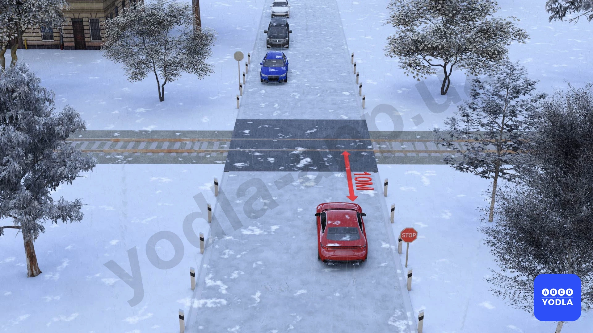

⬜ A. Остановился правильно
✅ B. Остановился неправильно

> 💡 На основании пункта 119 главы 18 ПДД: 119. В случаях, когда движение через переезд запрещено, водитель должен остановиться у стоп-линии, дорожного знака 2.5 или светофора, если их нет — не ближе 5 м от шлагбаума, а при отсутствии шлагбаума — не ближе 10 м до ближайшего рельса.

---

## Вопрос 162

**Кто из водителей нарушает правила?**

✅ A. Водители грузового автомобиля с разрешенной максимальной массой 3т и мопеда
⬜ B. Только водитель мопеда
⬜ C. Никто не нарушает

> 💡 Пункта 86 главы 12 ПДД, гласит: Обгон запрещен:
— в КОНЦЕ подъема и на других участках дорог с ограниченной видимостью;
Не нарушает, потому что мотоциклист не на КОНЦЕ подъема.

---

## Вопрос 163

**Обязаны ли Вы уступить дорогу маршрутному транспортному средству, отъезжающему от тротуара, где нет обозначенного места остановки?**

⬜ A. Да
✅ B. Нет

> 💡 Знак 7.6.1 раздела 7 приложения № 1 к ПДД, «Способ постановки транспортного средства на стоянку». 7.6.1 указывает способ постановки транспортного средства на проезжую часть, вдоль тротуара.

---

## Вопрос 164

**Какое транспортное средство должно уступить дорогу в данной ситуации?**

⬜ A. Легковой автомобиль
✅ B. Автобус

> 💡 Согласно предмету Первой помощи при дорожно-транспортных происшествиях, травма головного мозга характеризуется следующими основными признаками:
- Потеря сознания может длиться от нескольких секунд до нескольких часов;
- Рвота - два-три раза, в тяжёлых случаях больше;
- Амнезия - потеря памяти, связана с полученной травмой и некоторые события; жизни стираются из памяти.

---

## Вопрос 165

**Каким транспортным средствам разрешается высаживать пассажиров?**

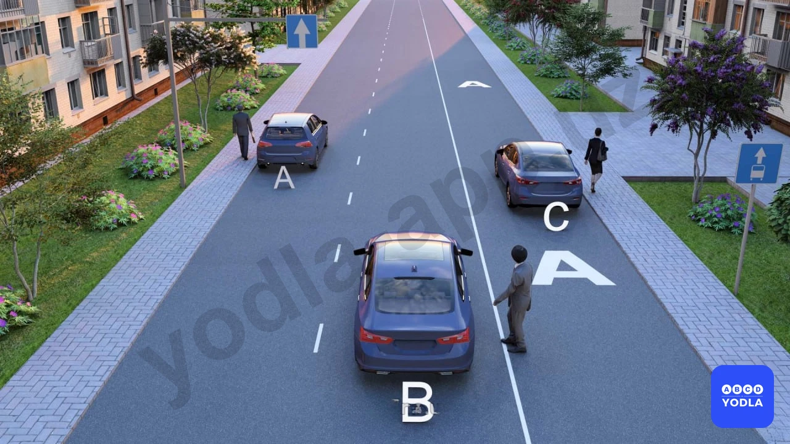

✅ A. «А»
⬜ B. «B»
⬜ C. «C»
⬜ D. Ни одному

> 💡 ЙҲҚ 1 илова: 4.1.1. “Ҳаракатланиш тўғрига”. Йўлнинг қисми бошланишида ўрнатилган 4.1.1 белгисининг таъсири яқин чорраҳагача жорий қилинади. Белги ўнг томонда жойлашган ҳовлиларга ва йўлга ёндош бошқа ҳудудларга бурилишни тақиқламайди.

---

## Вопрос 166

**Разрешается ли движение других видов транспортных средств по полосе проезжей части, выделенной только для транспортных средств установленного направления?**

⬜ A. Разрешено
⬜ B. Запрещено
✅ C. Разрешается только по истечении времени движения транспортного средства по установленному направлению

> 💡 ПДД приложение № 1: 4.1.1 Движение прямо.
Действие знака 4.1.1, установленного в начале участка дороги, распространяется до ближайшего перекрестка. Знак не запрещает поворот направо на прилегающие к дороге территории.

---

## Вопрос 167

**По какому направлению легковой автомобиль поворачивает правильно?**

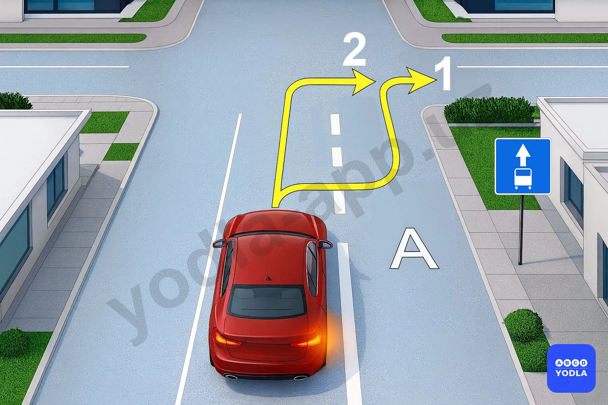

✅ A. 1
⬜ B. 1 и 2
⬜ C. 2

> 💡 На основании абзаца 2 пункта 133 главы 22 ПДД: Маршрутным транспортным средствам запрещается посадка и высадка пассажиров в местах, отличных отостановок (за исключением маршрутных такси).

---

## Вопрос 168

**При движении в темное время суток на освещенных участках дорог на механическом транспортном средстве должен быть включен:**

✅ A. Ближний свет фар
⬜ B. Дальний свет фар или габаритные огни
⬜ C. Ближний свет фар (противотуманные фары) или габаритные огни

> 💡 В соответствии с пунктом 135 главы 23 Правил дорожного движения, в следующих случаях вместо дальнего света фар должен быть включен ближний свет: если дорога освещена.

---

## Вопрос 169

**При движении в темное время суток на неосвещенных участках дорог на механическом транспортном средстве должны быть включены:**

✅ A. Ближний или дальний свет фар
⬜ B. Только ближний свет фар
⬜ C. Только дальний свет фар

> 💡 Пункта 134 главы 23 ПДД гласит: В темное время суток и в условиях недостаточной видимости, а также независимо от освещения дороги, в тоннелях на движущихся транспортных средствах должны быть включены: — на всех механических транспортных средствах и мопедах — фары дальнего или ближнего света.

---

## Вопрос 170

**Какое расстояние между транспортными средствами должна обеспечить гибкая сцепка?**

⬜ A. 1-3 м
⬜ B. 2-4 м
⬜ C. 3-6 м
✅ D. 4-6 м
⬜ E. 4-8 м

> 💡 Согласно пункту 144 главы 24 ПДД, при буксировке на гибкой сцепке расстояние между буксирующим и буксируемым транспортными средствами должно быть в пределах 4 — 6 метров, а при буксировке на жесткой сцепке расстояние между буксирующим и буксируемым транспортными средствами должно быть не более 4 метров.

---

## Вопрос 171

**Какое расстояние должно быть обеспечено между буксирующим и буксируемым транспортными средствами при буксировке на жесткой сцепке?**

✅ A. Не более 4 м
⬜ B. От 4 до 6 м
⬜ C. Правилами не регламентируется

> 💡 Знак 7.6.4 раздела 7 приложения № 1 к ПДД, «Способ постановки транспортного средства на стоянку». 7.6.4 Указывает способ постановки легковых автомобилей и мотоциклов на околотротуарной стоянке.

---

## Вопрос 172

**На каком рисунке изображен автомобиль, водитель которого нарушает правила перевозки грузов?**

✅ A. А
⬜ B. Б
⬜ C. А и Б

> 💡 Колеса должны быть повернуты так, чтобы автомобиль при произвольном скатывании выехал не на проезжую часть, а уперся колесами в бордюр тротуара. Подъем дороги согласно знаку снизу вверх. Автомобиль А упирается передними колесами в бордюр. Автомобиль C также упирается передними колесами в бордюр и не может скатиться. Автомобиль B выкатывается прямо на проезжую часть. Автомобиль D также выкатится на дорогу, пока задние колеса не упрутся в бордюр, в результате чего автомобиль встанет боком, перекрыв часть полосы движения. Правильное положение колес обеспечили водители автомобилей А и C.

---

## Вопрос 173

**На каком рисунке изображен автомобиль, водитель которого нарушает правила перевозки грузов при движении в светлое время суток?**

⬜ A. А
⬜ B. На обоих рисунках
✅ C. Никто не нарушает

> 💡 Согласно статьи 163 Правил дорожного движения,  Груз, выступающий за габариты транспортного средства спереди и сзади более чем на 1 м или сбоку более чем на 0,4 м от внешнего края габарита, должен быть обозначен опознавательными знаками «Крупногабаритный груз».

---

## Вопрос 174

**На каком рисунке изображен автомобиль, водитель которого нарушает правила перевозки грузов?**

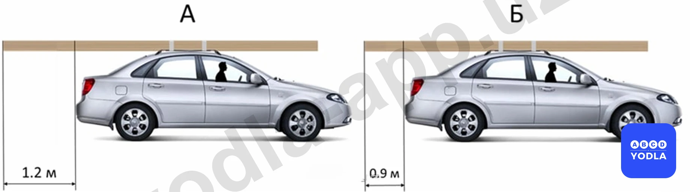

⬜ A. A
⬜ B. B
✅ C. А и В

> 💡 Пункта 123 главы 20 ПДД, гласит: В жилой зоне (территории, въезды и выезды с которых обозначены дорожными знаками 5.38 и 5.39) движение пешеходов разрешается по тротуарам и по проезжей части. При этом пешеходы имеют приоритет, однако, они не должны создавать необоснованные помехи для движения транспортных средств.

---

## Вопрос 175

**Перегон животных на дороге разрешается в основном:**

✅ A. В светлое время суток.
⬜ B. В тёмное время суток.
⬜ C. В любое время.

> 💡 Согласно статьи 6 Правил дорожного движения, обеспечение безопасности дорожного движения — деятельность, направленная на предупреждение причин возникновения дорожно-транспортных происшествий, снижение тяжести их последствий.

---

## Вопрос 176

**Что обозначает данный опознавательный знак?**

⬜ A. Впереди участок дороги имеющий неровности на проезжей части
⬜ B. Впереди участок дороги с тремя полосами для движения в данной направлении
✅ C. Транспортное средство оборудованное шипованными шинами

> 💡 Согласно определению 2, данному в пункте 176 главы 29 ПДД, «Шипы» — знак в виде равностороннего треугольника белого цвета с каймой красного цвета, в который вписана буква «Т» черного цвета — сзади механических транспортных средств, имеющих шипованные шины. Стороны треугольника от 200 до 300 мм в зависимости от вида транспортного средства, ширина каймы равна 1/10 стороны.

---

## Вопрос 177

**Какой должна быть минимальная остаточная высота рисунка протектора шин транспортных средств категорий M2 и M3?**

⬜ A. 0,8 мм.
⬜ B. 1,2 мм.
⬜ C. 1,6 мм.
✅ D. 2 мм.
⬜ E. 2,5 мм.

> 💡 Шины имеют остаточную высоту рисунка протектора для автотранспортных средств категории N2, N3, O3, O4 менее 1,0 мм; для M1, N1, O1, O2 менее 1,6 мм, для автотранспортных средств категорий М2, МЗ, менее 2,0 мм, для мотоциклов, электромотоциклов, мопед��в и скутеров - если она меньше 0,8 мм.
Примечание: для прицепа устанавливаются нормы остаточной высоты рисунка протектора шин, аналогичные нормам для шин автомобилей-тягачей.

---

## Вопрос 178

**В каком из перечисленных случаев разрешается эксплуатация автотранспортных средств?**

⬜ A. Между сдвоенными шинами имеются инородные предметы
⬜ B. Шины по размеру или допустимой нагрузки не соответствуют модели транспортного средства
✅ C. На передней оси автотранспортных средств категории М1; М2;М3 класса 1 установлены шины по первому классу ремонта
⬜ D. Во всех случаях разрешается

> 💡 Согласно пункту 5.7 Раздела 5 Приложения 3 ПДД: На передней оси автотранспортных средств категорий М1, М2, М3 класса I, средней и задней осях автотранспортных средств категории М3 классов II и III установлены шины, восстановленные по второму классу ремонта.

---

## Вопрос 179

**Какой наибольший суммарный люфт допускается правилами для категории автотранспортных средств N2; N3?**

⬜ A. 16°
⬜ B. 20°
✅ C. 25°
⬜ D. 26°
⬜ E. 30°

> 💡 Согласно пункту 2.1 приложения № 3 к ПДД, суммарный люфт в рулевом управлении в регламентированных условиях испытаний автотранспортного средства категории N3 не должен превышать 25 градусов.

---

## Вопрос 180

**На уклоне ниже насколько система стояночного тормоза не может удерживать транспортные средства М в неподвижном состоянии?**

⬜ A. 18 %
⬜ B. 20 %
⬜ C. 24 %
✅ D. 25 %

> 💡 В соответствии с примечанием к приложению 1 Правил дорожного движения, дорожные знаки 1.8, 1.15, 1.16, 1.31, 1.17, 1.18.1 — 1.18.3, 1.21, 1.30, 2.6, 2.7, 3.1, 3.2, 3.11 — 3.16, 3.18.1 — 3.18.25 могут устанавливаться в качестве временных дорожных знаков. Временные дорожные знаки будут желтого цвета.

---

## Вопрос 181

**Шины транспортных средств категории М1 должны иметь остаточную высоту рисунка протектора не менее:**

⬜ A. 0,8 мм
⬜ B. 1,0 мм
✅ C. 1,6 мм
⬜ D. 2,0 мм
⬜ E. 2,5 мм

> 💡 Согласно пункту 5.1 приложения № 3 к ПДД, запрещается эксплуатация транспортных средств, если шины имеют остаточную высоту рисунка протектора для автотранспортных средств категорий N2, N3, О3, О4 менее 1,0 мм; для автотранспортных средств категорий М1, N1, О1, О2 менее 1,6 мм; для автотранспортных средств категорий М2, М3 менее 2,0 мм; для мотоциклов и мопедов (скутеров, квадроциклов) менее 0,8 мм.

---

## Вопрос 182

**При каких условиях разрешается эксплуатация транспортных средств?**

⬜ A. Шины имеют местные повреждения; обнажающие корд
⬜ B. На передней оси легкового автомобиля категории М1 установлены шины; восстановленные по второму классу ремонта
✅ C. Остаточная высота рисунка протектора шин грузовых автомобилей 1,6 мм

> 💡 Согласно пункту 5.1 раздела 5 приложения 3 ПДД «Условия при которых запрещается эксплуатация транспортных средств»: если высота остаточного рисунка протектора шин для автотранспортных средств категорий N2, N3, O3, O4 составляет менее 1,0 мм, использование транспортных средств запрещено. 
Соответственно, если остаточная высота протектора шин для транспортных средств категории N2 и N3 составляет 1,6 мм, эксплуатация такого транспортного средства разрешена.

---

## Вопрос 183

**Шины мотоциклов должны иметь остаточную высоту рисунка протектора не менее:**

⬜ A. 0,5 мм
✅ B. 0,8 мм
⬜ C. 1,0 мм
⬜ D. 1,6 мм
⬜ E. 2,0 мм

> 💡 Согласно пункту 5.1 приложения № 3 к ПДД, запрещается эксплуатация транспортных средств, если шины имеют остаточную высоту рисунка протектора для автотранспортных средств категорий N2, N3, О3, О4 менее 1,0 мм; для автотранспортных средств категорий М1, N1, О1, О2 менее 1,6 мм; для автотранспортных средств категорий М2, М3 менее 2,0 мм; для мотоциклов и мопедов (скутеров, квадрациклов) менее 0,8 мм.

---

## Вопрос 184

**В каком из нижеперечисленных случаях можно использовать транспортное средство?**

⬜ A. Направление фары искажены
✅ B. На автомобилях; которые были сняты с производства; были установлены внешние фонари автомобили различных типов и моделей
⬜ C. Внешние фары и отражатели не работают должным образом или загрязнены

> 💡 Пункту 3.1. приложения № 3 к ПДД, Количество, тип, расположение и режим работы внешних световых приборов не соответствуют требованиям конструкции транспортного средства. На легковых автомобилях, снятых с производства, допускается установка внешних световых приборов от автомобилей других марок и моделей.

---

## Вопрос 185

**Минимально допускаемое Правилами значение остаточной высоты рисунка протектора шин автотранспортных средств категории N2; N3; 03; 04 составляет:**

⬜ A. 0,5 мм
✅ B. 1 мм
⬜ C. 1,6 мм
⬜ D. 2 мм
⬜ E. 3 мм

> 💡 Согласно пункту 5.1 приложения № 3 к ПДД, запрещается эксплуатация транспортных средств, если шины имеют остаточную высоту рисунка протектора для автотранспортных средств категорий N2, N3, О3, О4 менее 1,0 мм; для автотранспортных средств категорий М1, N1, О1, О2 менее 1,6 мм; для автотранспортных средств категорий М2, М3 менее 2,0 мм; для мотоциклов и мопедов (скутеров, квадроциклов) менее 0,8 мм.

---

## Вопрос 186

**Тормозная система считается неисправной, если нарушена герметичность пневматического привода, что вызывает падение давления воздуха при неработающем компрессоре за 30 мин, при свободном положении органов управления в МПа, более чем:**

⬜ A. 0,025
⬜ B. 0,035
✅ C. 0,05
⬜ D. 0,055
⬜ E. 0,06

> 💡 Согласно пункту 1.4 приложения № 3 к ПДД, запрещается эксплуатация транспортных средств, если нарушение герметичности пневматического или пневмогидравлического тормозного привода вызывает падение давления воздуха при неработающем двигателе более чем на 0,05 МПа за 30 мин. при свободном положении органов управления тормозной системой или за 15 мин. при включенных органах управления.

---

## Вопрос 187

**Высота рисунка протектора шин автомобилей категорий М2, М3 не должна быть менее:**

⬜ A. 0,8 мм
⬜ B. 1,0 мм
⬜ C. 1,6 мм
✅ D. 2,0 мм
⬜ E. 2,5 мм

> 💡 Согласно пункту 5.1 приложения № 3 к ПДД, запрещается эксплуатация транспортных средств, если шины имеют остаточную высоту рисунка протектора для автотранспортных средств категорий N2, N3, О3, О4 менее 1,0 мм; для автотранспортных средств категорий М1, N1, О1, О2 менее 1,6 мм; для автотранспортных средств категорий М2, М3 менее 2,0 мм; для мотоциклов и мопедов (скутеров, квадрациклов) менее 0,8 мм.

---

## Вопрос 188

**В каком из перечисленных случаев разрешается эксплуатация транспортных средств?**

⬜ A. Шины по размеру и допустимой нагрузке не соответствуют модели транспортного средства
⬜ B. На одну ось транспортного средства установлены диагональные шины совместно с радиальными
✅ C. На переднюю ось легкового автомобиля категории М1 установлены шины, восстановленные по первому классу ремонта

> 💡 Пункту 5.7 раздела 5 приложения Nº 3 к ПДД, условия при которых запрешается эксплуатация автотранспортных средств: на передней оси автотранспортных средств категории M1, М2, МЗ класса 1 установлены шины, востановленные по второму классу ремонта.

---

## Вопрос 189

**Разрешается ли установка шин; восстановленных по второму классу ремонта на легковых автомобилях?**

⬜ A. Запрещается
⬜ B. Разрешается на обоих осях автомобиля
✅ C. Разрешается только на задней оси

> 💡 В "Условиях, при которых запрещается эксплуатация транспортных средств" (приложение №3 к ПДД) сказано, что эксплуатация транспортных средств запрещена, если: 5.7. На передней оси легкового автомобиля и автобуса (кроме междугородного) установлены шины, восстановленные по второму классу ремонта. Как видно, запрещается на передней оси легкового автомобиля устанавливать шины, восстановленные по второму классу ремонта. Соответственно, на задней оси разрешается.

---

## Вопрос 190

**В каких случаях разрешается пользоваться транспортным средством?**

⬜ A. Если на внешней поверхности транспортного средства нанесены различные изображения, которые не соответствуют законодательству и негативно влияют на безопасность передвижения
✅ B. При соответствии технических показателей (параметров), указанных на внешней стороне газовых баллонов автобуса и автомобиля, оборудованных системой газоснабжения, данным (показателям) в техническом паспорте, дата последнего и планового осмотров
⬜ C. При окраске кузова (кабины) в несколько разных цветов в случаях, не предусмотренных заводом-изготовителем (кроме спецавтомобилей)

> 💡 Пункту 7.19 раздела 7 приложения № 3 к ПДД, технические параметры, указанные на наружной поверхности газовых баллонов автомобилей и автобусов, оснащенных газовой системой питания, не соответствуют данным технического паспорта, отсутствуют даты последнего и планируемого освидетельствования.

---

## Вопрос 191

**Суммарный люфт в рулевом управлении в регламентированных условиях испытаний автотранспортного средства категория М3 не должен превышать следующих значений:**

⬜ A. 10°
✅ B. 20°
⬜ C. 25°

> 💡 Согласно раздела 1 приложения № 2 к ПДД, горизонтальная разметка 1.5 — разделяет транспортные потоки противоположных направлений на дорогах, имеющих две или три полосы; обозначает границы полос движения при наличии двух и более полос, предназначенных для движения в одном направлении. Линию 1.5 пересекать разрешается с любой стороны.

---

## Вопрос 192

**В каком случае запрещается эксплуатация транспортного средства?**

⬜ A. Не работает указатель уровня топлива
⬜ B. Нарушена система  зажигания
⬜ C. Затруднен пуск двигателя
✅ D. Не работает звуковой сигнал

> 💡 Согласно пункту 7.2 Приложение № 3 к Правилам дорожного движения, запрещается эксплуатация транспортных,  если не работает звуковой сигнал.

---

## Вопрос 193

**На каком уклоне запрещается эксплуатация автотранспортных средств категории N в загруженном состоянии, полной нагрузкой при необеспечении неподвижного состояния стояночной тормозной системы?**

⬜ A. Менее 25 процентов.
⬜ B. Менее 16 процентов.
✅ C. Менее 31 процентов.
⬜ D. Менее 20 процентов.

> 💡 При кратковременной остановке на подъеме, на автомобиле с механической трансмиссией следует привести в действие стояночный тормоз.

---

## Вопрос 194

**Какой максимально допустимый люфт в рулевом управления автомобилей категории М3:**

⬜ A. 10 градусов
✅ B. 20 градусов
⬜ C. 25 градусов

> 💡 Согласно требованиям безопасности дорожного движения, среднее время реакции водителя принято равным около 1 секунды.

---

## Вопрос 195

**Какая максимально допустимая величина люфта в рулевом управления транспортных средств категории М2:**

⬜ A. 10 градусов
✅ B. 20 градусов
⬜ C. 3,25 градусов

> 💡 Очень важным моментом при движении в ночное время является выбор скорости движения. При этом следует учитывать главное условие - расстояние видимости водителем дороги должно превышать величину остановочного пути.

---

## Вопрос 196

**Суммарный люфт в рулевом управлении в регламентированных условях испытаний автотранспортного средства категория N1 не должен превышать следующих значений:**

⬜ A. 10 градусов
✅ B. 20 градусов
⬜ C. 25 градусов

> 💡 Согласно статьи 6 Правил дорожного движения, разделительная полоса — элемент дороги, разделяющий смежные проезжие части и не предназначенный для движения и остановки транспортных средств, приподнята над уровнем дороги или отделена газоном, канавой, специальными ограждениями.

---

## Вопрос 197

**Автотранспортное средство категории М:**

✅ A. Механические автотранспортные средства, имеющие не менее четырех колес и используемые для перевозки пассажиров
⬜ B. Автотранспортные средства, предназначенные для перевозки грузов, максимальная масса которых не превышает 3,5 т
⬜ C. F3. Прицепы (включая полуприцепы)

> 💡 Ниже указаны пункты ПДД: 5.10.2, 5.10.3. “Выезд на дорогу с полосой для маршрутных транспортных средств”. 5.11.1. “Место для разворота”. Поворот налево запрещается.

---

## Вопрос 198

**Правила для легковых автомобилей, выпущенных до 01.01.1981 г. какой норматив эффективности работы тормозной системы допускается при движении со скоростью 40км/с при торможении?**

⬜ A. 7,2 m
⬜ B. 12,2 m
⬜ C. 19,5 m
⬜ D. 25 m
✅ E. 14,5 m

> 💡 ПДД приложение № 1: 2.5. Движение без остановки запрещено.
Запрещается движение без остановки перед стоп-линией, а если ее нет — перед краем пересекаемой проезжей части. Водитель должен уступить дорогу транспортным средствам, движущимся по пересекаемой, а при наличии дополнительного дорожного знака 7.13 — по главной дороге.
Этот дорожный знак может быть установлен перед железнодорожным переездом или карантинным постом. В этих случаях водитель должен остановиться перед стоп-линией, а при ее отсутствии — перед знаком.

---

## Вопрос 199

**Какая из показанных автоцистерн более устойчива при повороте?**

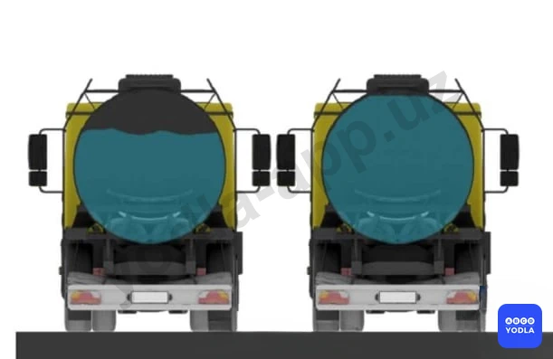

⬜ A. Наполненная жидкостью на 75%
✅ B. Наполненная жидкостью полностью

> 💡 Потере устойчивости грузового автомобиля может способствовать незакрепленный груз. При движении на повороте незакрепленный груз может перемещаться по грузовой платформе и, ударяя в ее борт, приводить к опрокидыванию автомобиля. Аналогичные явления происходят при движении автомобильной цистерны с текучим грузом. При движении автомобиля с жидким грузом происходят перемещения груза от одного борта к другому. Раскачиваясь и ударяя в борта, жидкий груз также может вызвать потерю устойчивости автомобиля.

---

## Вопрос 200

**Как остановить автомобиль в случае внезапного отказа рабочего тормоза?**

✅ A. Перейти на низшую передачу; затормозить стояночным тормозом. При необходимости воспользоваться каким-либо препятствием
⬜ B. Выключить сцепление и резко тормозить стояночным тормозом

> 💡 Ситуация с внезапным отказом рабочего тормоза может иметь множество оттенков: скорость автомобиля, работоспособность стояночного тормоза, плотность потока, ширина дороги, пешеходы, зеленые насаждения, плотность застройки, встречные транспортные средства и многое-многое другое. Также много может быть принято решений. Отсюда понятно, что на вопрос «Что делать, когда отказали тормоза?» нельзя дать один ответ, приемлемый во всех случаях. Итак, в опасной ситуации самое главное: сохранять спокойствие и уверенность в себе; уметь быстро дать оценку сложившейся ситуации; принять такое решение, которое не причинит вреда и не подвергнет риску жизнь людей; выполняя принятое решение, быть всегда готовым к изменению своей тактики, так как ситуация может измениться.

---

## Вопрос 201

**В каком случае центробежная сила при повороте уменьшается?**

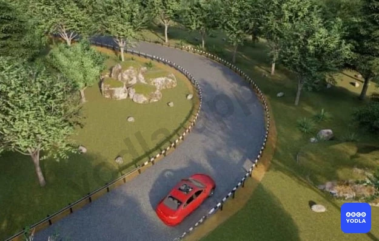

⬜ A. При резком повороте рулевого колеса в сторону поворота
✅ B. При снижении скорости движения
⬜ C. При уменьшении радиуса поворота

> 💡 При прохо��дении поворота водителю следует учитывать, что при увеличении скорости движения автомобиля центробежная сила увеличивается пропорционально квадрату скорости, что может привести к опрокидыванию транспортного средства.

---

## Вопрос 202

**Смещается ли прицеп автопоезда при движении на повороте?**

⬜ A. Смещается в сторону от центра поворота
⬜ B. Не смещается
✅ C. Смещается к центру поворота

> 💡 При одновременном прохождении поворота с автопоездом вам следует позаботиться об увеличении бокового интервала до этого транспортного средства, так как задние колеса автопоезда (прицепа) смещаются к центру поворота и увеличивается коридор движения автопоезда

---

## Вопрос 203

**В каких случаях увеличивается центробежная сила автомобиля на поворотах?**

⬜ A. С увеличением радиуса поворота
✅ B. С увеличением скорости движения
⬜ C. С уменьшением скорости движения

> 💡 Центробежная сила автомобиля на поворотах увеличивается с увеличением скорости движения. С увеличением радиуса поворота или уменьшением скорости движения центробежная сила на поворотах уменьшается.

---

## Вопрос 204

**Какова траектория движения прицепа при повороте автомобиля к центру поворота?**

⬜ A. Смещается в сторону от центра поворота.
⬜ B. Не смещается
✅ C. Смещается к центру поворота

> 💡 Пункта 107 главы 16 ПДД, гласит: При повороте налево или развороте водитель безрельсового транспортного средства обязан уступить дорогу транспортным средствам, движущимся по равнозначной дороге со встречного направления прямо или направо, а также производящим обгон в разрешенных случаях. Этим же правилом должны руководствоваться между собой водители трамваев.

---

## Вопрос 205

**Что называют тормозным путем?**

⬜ A. Расстояние, пройденное транспортным средством до полной остановки автомобиля после обнаружения опасности.
✅ B. Расстояние, пройденное транспортным средством с момента нажатия на педаль тормоза до полной остановки

> 💡 Тормозным путем автомобиля называется путь, пройденный автомобилем с момента нажатия на педаль тормоза, до его полной остановки.

---

## Вопрос 206

**В случае остановки на подъеме при наличии тротуара можно предотвратить самопроизвольное скатывание автомобиля, повернув его передние колеса в положение**

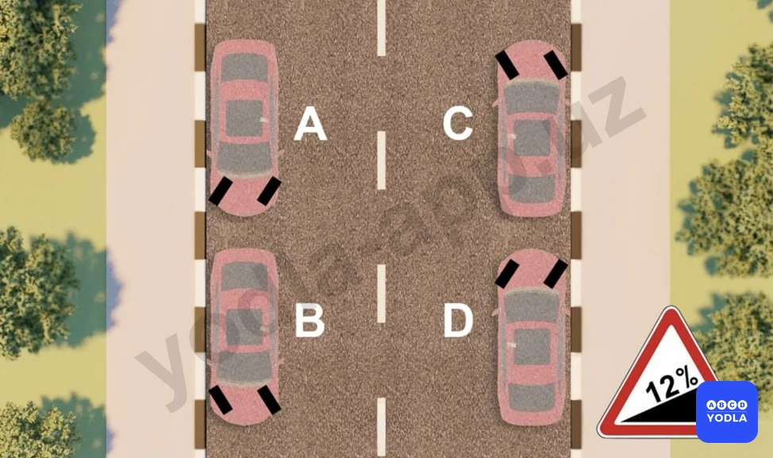

⬜ A. A и D
⬜ B. B и C
✅ C. A и C
⬜ D. B и D

> 💡 Согласно статьи 163 Правил дорожного движения,  Груз, выступающий за габариты транспортного средства спереди и сзади более чем на 1 м или сбоку более чем на 0,4 м от внешнего края габарита, должен быть обозначен опознавательными знаками «Крупногабаритный груз».

---

## Вопрос 207

**Как транспортировать пострадавш��го с повреждением грудного отдела позвоночника?**

✅ A. Лежа на спине на жестком щите
⬜ B. Лежа на спине на мягкой подстилке
⬜ C. Лежа на боку на жестком щите

> 💡 При повреждении позвоночника важно не допустить смещения позвонков относительно друг друга, чтобы избежать травмирования спинного мозга. Для обеспечения минимальной подвижности позвоночника травмированного следует расположить на ровной твердой поверхности и максимально ограничить его перемещения.

---

## Вопрос 208

**Как нужно транспортировать раненного с повреждением грудной клетки?**

✅ A. Лежа на поврежденном боку или полусидя
⬜ B. В положении лежа на здоровом боку или сидя
⬜ C. В положении лежа на спине или на животе

> 💡 Чтобы обеспечить неподвижность костных отломков одного относительно другого, нужно наложить тугую повязку на грудную клетку. После этого дыхание обеспечивается только за счет движений диафрагмы, которые наиболее свободны в положении сидя.

---

## Вопрос 209

**Признаки артериального кровотечения:**

✅ A. Кровь розового цвета сильной пульсацией бьёт из сосудов.
⬜ B. Темно красная кровь струится из сосудов.
⬜ C. Кровотечение во внутренние органы из мелких кровеносных сосудов

> 💡 Согласно пункту 143 Правил дорожного движения, при буксировке на гибкой или жесткой сцепке запрещается перевозка людей в буксируемом автобусе, троллейбусе и в кузове буксируемого грузового автомобиля, а при буксировке путем частичной погрузки — нахождение людей в кабине или кузове буксируемого транспортного средства, а также в кузове буксирующего транспортного средства.

---

## Вопрос 210

**Признаки венозного кровотечения**

⬜ A. Розовая кровь бъёт из сосудов пульсацией
✅ B. Из сосудов вытекает темно-красная кровь
⬜ C. Наблюдается приток крови из мелких сосудов к внутренним органам

> 💡 Согласно пункту 137 Правил дорожного движения, противотуманные фары могут использоваться в следующих случаях: в темное время суток на неосвещенных участках дорог совместно с ближним или дальним светом фар.

---

## Вопрос 211

**Разрешена ли стоянка автомобиля в этом месте?**

✅ A. Разрешена
⬜ B. Запрещена

> 💡 На основании главы 13 ПДД, пункта 88, абзаца 2 и пункта 91, абзаца 13: В населенных пунктах на дорогах с отсутствием трамвайных путей посередине, имеющих по одной полосе в каждом направлении, а также с организацией одностороннего движения разрешается остановка и стоянка на левой стороне дороги.
91. Остановка запрещается в следующих местах: на пересечении проезжих частей и ближе 30 м от края пересекаемой проезжей части, (за исключением стороны напротив бокового проезда трехсторонних пересечений (перекрестков, имеющих сплошную линию дорожной разметки или разделительную полосу).

---

## Вопрос 212

**На каком рисунке показан правильный вариант обгона?**

⬜ A. 1
⬜ B. 3
✅ C. 2 и 3
⬜ D. 3 и 4

> 💡 На основании Приложения 2 к ПДД, пункта 1.1 и абзаца 44, пункта 1.11 и абзаца 49, а также главы 12 ПДД, пункта 86, абзаца 2: 1.1 — разделяет транспортные потоки противоположных направлений. Линии 1.1 и 1.3 пересекать запрещается, кроме случая, когда линия 1.1 применена для обозначения края проезжей части. 
1.11 — разделяет транспортные потоки противоположных или попутных направлений на участках дорог, где перестроение разрешено только из одной полосы; обозначает места, предназначенные для разворота, въезда и выезда со стояночных площадок и т. п., где движение разрешено только в одну сторону. Линию 1.11 разрешается пересекать со стороны прерывистой, а также и со стороны сплошной, но только при завершении обгона или объезда.
86. Обгон запрещен: на регулируемых перекрестках.

---

## Вопрос 213

**Какое транспортное средство должно уступить дорогу?**

✅ A. Белый автомобиль
⬜ B. Зеленый автомобиль

> 💡 На основании пункта 75 главы 10 ПДД: 75. Если встречный разъезд затруднен, то водитель на стороне которого имеется препятствие, должен уступить дорогу.

---

## Вопрос 214

**В показанной ситуации какое транспортное средство должно уступить дорогу?**

✅ A. Белый автомобиль
⬜ B. Синий автомобиль

> 💡 На основании пункта 75 главы 10 ПДД: 75. Если встречный разъезд затруднен, то водитель на стороне которого имеется препятствие, должен уступить дорогу.

---

## Вопрос 215

**Разрешена ли остановка в указанном месте?**

⬜ A. Запрещена
✅ B. Разрешена

> 💡 На основании абзаца 8 пункта 91 главы 13 ПДД: 91. Остановка запрещается в следующих местах: в местах, где расстояние между сплошной линией дорожной разметки (кроме обозначающей край проезжей части), разделительной полосой или противоположным краем проезжей части и остановившимся транспортным средством менее 3 м.

---

## Вопрос 216

**Какой сигнал должно подать красное транспортное средство, поворачивающее направо на перекрёстке, транспортному средству впереди?**

⬜ A. Звуковой сигнал
⬜ B. Световые сигналы
✅ C. Необходимо дождаться разрешающего сигнала светофора
⬜ D. Все ответы верны

> 💡 Дорожный знак 5.42 разрешает поворот направо на красный сигнал светофора, уступив дорогу всем. Если впереди находится транспортное средство, движущееся прямо, необходимо дождаться, пока для него загорится зелёный сигнал и оно продолжит движение прямо

---

## Вопрос 217

**Как вы должны поступить в данной ситуации?**

⬜ A. Подать звуковой сигнал и увеличить скорость
✅ B. Снизить скорость до уровня, обеспечивающего возможность немедленной остановки при необходимости
⬜ C. Повернуть налево и объехать препятствие
⬜ D. Продолжить движение без остановки

> 💡 На основании пункта 27 главы 6 ПДД: 27. Приближаясь к стоящему транспортному средству оперативных и специальных служб с включенным проблесковым маячком синего или красного либо синего и красного цветов, водитель должен снизить скорость, чтобы иметь возможность немедленно остановиться в случае необходимости.

---

## Вопрос 218

**Разрешена ли остановка в указанном месте?**

⬜ A. Разрешена
✅ B. Запрещена

> 💡 Согласно главе 13, пункту 91 (абзац 7) Правил дорожного движения:

91. Остановка запрещается: на мостах, путепроводах, эстакадах и под ними, если для движения в данном направлении имеется менее трёх полос.

В данной ситуации транспортное средство находится на мосту, поэтому остановка запрещена.

---

## Вопрос 219

**Разрешена ли остановка в указанном месте?**

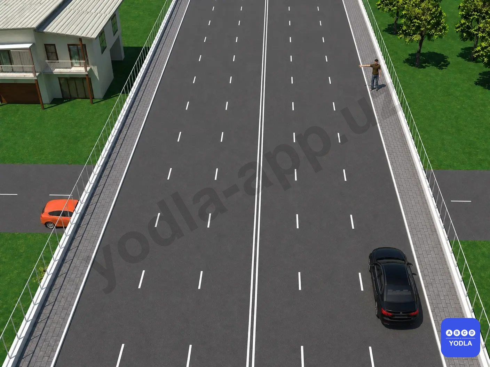

✅ A. Разрешена
⬜ B. Запрещена

---

