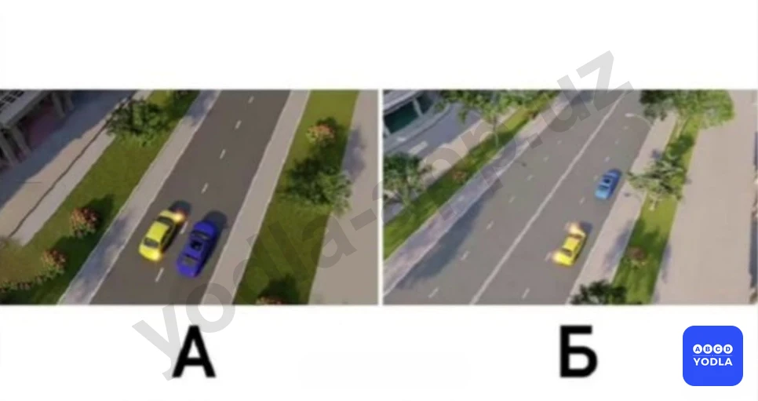
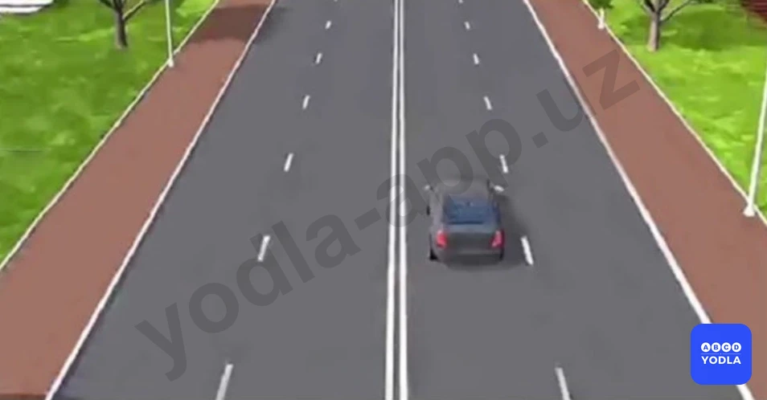
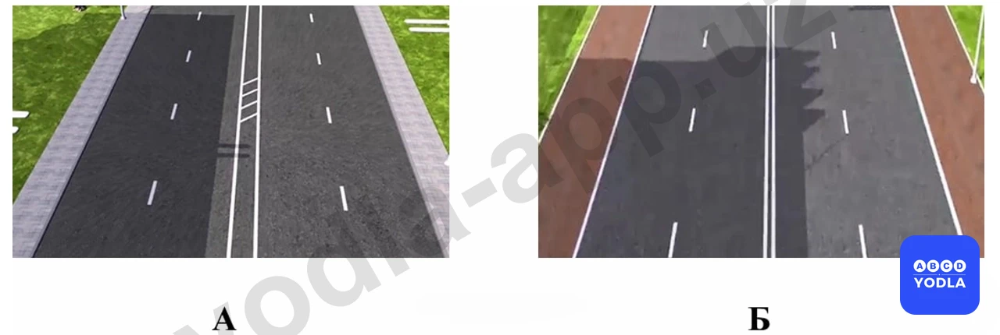

# 01. Общие правила (боб 1)

Всего вопросов: 51

## Вопрос 1

**Если на грунтовой дороге непосредственно перед перекрестком имеется участок с покрытием, то делает ли это ее равной по значению с пересекаемой?**

✅ A. Нет
⬜ B. Да

> 💡 Согласно определению 12 пункта 6 главы 1 ПДД, главная дорога – дорога с твердым покрытием (асфальт, цементно-бетон и тому подобное) по отношению к грунтовой дороге или дорога, обозначенная знаками 2.1, 2.3.1 – 2.3.3 или 5.1, по отношению к пересекаемой (примыкающей), либо любая дорога по отношению к выездам с прилегающих территорий. Наличие покрытия на второстепенной дороге непосредственно перед перекрестком не делает ее равной по значению с пересекаемой.

---

## Вопрос 2

**Кто является «Участником дорожного движения»?**

✅ A. Лицо, принимающее непосредственное участие в процессе движения как пешеход, водитель, пассажир транспортного средства
⬜ B. Любое лицо, находящееся на дороге и не выполняющее на ней работы
⬜ C. Лицо, управляющее каким-либо транспортным средством

> 💡 Согласно определению 58 пункта 6 главы 1 ПДД, участник дорожного движения – лицо, принимающее непосредственное участие в процессе дорожного движения в качестве водителя, пассажира транспортного средства или пешехода.

---

## Вопрос 3

**Что должен предпринять водитель при вынужденной остановке?**

⬜ A. Включить ближний свет фар или противотуманные фары
⬜ B. Поднять капот двигателя
✅ C. Знаки аварийной остановки должны быть включены, а при их отсутствии или неисправностях должен быть установлен знак аварийной остановки на расстоянии не менее 15 метров от транспортного средства в населенных пунктах и не менее 30 метров вне их.

> 💡 Согласно пунктов 50 и 51 главы главы 8 ПДД, при вынужденной остановке в местах, где остановка запрещена должна быть включена аварийная световая сигнализация, а также при ее неисправности надо незамедлительно выставить знак (мигающий красный фонарь) аварийной остановки.

---

## Вопрос 4

**К маршрутным транспортным средствам относятся:**

⬜ A. Автобусы и маршрутные такси
⬜ B. Трамваи и троллейбусы
✅ C. Автобусы, троллейбусы, трамваи и маршрутные такси, движущиеся по установленным маршрутам

> 💡 Согласно определению 18 пункта 6 главы 1 ПДД, маршрутное транспортное средство – транспортное средство общего пользования (троллейбус, автобус, трамвай, маршрутное такси), предназначенное для перевозки пассажиров и имеющее установленный маршрут с остановочными пунктами (остановками).

---

## Вопрос 5

**Что такое «Разрешенная максимальная масса»?**

⬜ A. Грузоподъемность транспортного средства
⬜ B. Фактическая масса транспортного средства
✅ C. . Масса снаряженного транспортного средства с грузом, водителем и пассажирами, установленная предприятием-изготовителем в качестве максимально допустимой
⬜ D. Масса груза перевозимого транспортным средством которая устанавливается в качестве допустимой технической характеристики завода-изготовителя

> 💡 Согласно определению 43 пункта 6 главы 1 ПДД, разрешенная максимальная масса – максимальная масса (величина) снаряженного транспортного средства с грузом, водителем и пассажирами, установленная предприятием–изготовителем.

---

## Вопрос 6

**Считается ли перекрестком выезд на дорогу с автозаправочной станции?**

✅ A. Не считается
⬜ B. Считается

> 💡 Согласно определений 36 и 51, данному в пункте 6 главы 1 ПДД, не считаются перекрестками выезды с прилегающих территорий. Прилегающая территория – территория, непосредственно прилегающая к дороге и не предназначенная для сквозного движения транспортных средств (дворы, жилые массивы, автостоянки, автозаправочные станции, предприятия и т. п).

---

## Вопрос 7

**Какую дорогу считать главной?**

✅ A. Дорогу с твёрдым покрытием по отношению к грунтовой или обозначенную соответствующими знаками
⬜ B. Дорогу с продолжением в обе стороны по отношению к примыкающей на трехстороннем перекрестке
⬜ C. Дорогу с многополосной проезжей частью по отношению к дороге с одной полосой для движения в каждом направлении

---

## Вопрос 8

**Что понимается под «Недостаточной видимостью»?**

⬜ A. Промежуток времени от конца вечерних сумерек до начала утренних сумерек
⬜ B. Видимость менее 150 м
✅ C. Видимость менее 300 м в условиях тумана, дождя, снегопада и т.п., а также в сумерки
⬜ D. Дождь, снегопад, сумерки

> 💡 Согласно определению 23, пункта 6 главы 1 ПДД, недостаточная видимость – видимость дороги менее 300 м в условиях дождя, снегопада, тумана и в других подобных условиях, а также в сумерки.

---

## Вопрос 9

**Сколько полос движений имеет данная дорога?**

⬜ A. Одну полосу для движения
✅ B. Две полосы для движения
⬜ C. Три полосы для движения

> 💡 Знак 5.5 раздела 5 приложения № 1 к ПДД, 5.5. «Дорога с односторонним движением». Дорога или проезжая часть, по всей ширине которой движение транспортных средств осуществляется в одном направлении.

---

## Вопрос 10

**Что означает термин "обгон"?**

⬜ A. Опережение одного или нескольких транспортных средств
✅ B. Опережение одного или нескольких транспортных средств, связанное с выездом на полосу (сторону проезжей части), предназначенную для встречного движения, и последующим возвращением на ранее занимаемую полосу (сторону проезжей части)
⬜ C. Опережение движущегося впереди транспортного средства, связанное с выездом из занимаемой полосы

> 💡 Согласно знаку 3.17.2 раздела 3 приложения № 1 к ПДД, «Опасность». Запрещается дальнейшее движение всех транспортных средств в связи с дорожно-транспортным происшествием или другой опасностью.

---

## Вопрос 11

**Пешеходный переход - это...**

✅ A. Часть участка дороги, предназначенная для пешеходного перехода с дорожными знаками 5.16.1, 5.16.2 и дорожными полосами 1.14.1-1.14.3.
⬜ B. Часть дороги, предназначенная для пешеходного движения и запрещенная для движения транспортных средств.
⬜ C. Часть дороги, примыкающая к проезжей части или отделенная от нее газоном, бордюром, специальными ограждениями и предназначенная для движения пешеходов.

> 💡 Согласно пункту 38 Правил дорожного движения, Сигналы регулировщика имеют следующие значения: руки вытянуты в стороны или опущены: со стороны левого и правого бока — разрешено движение трамваю прямо, безрельсовым транспортным средствам — прямо и направо, пешеходам разрешено переходить проезжую часть; со стороны груди и спины — движение всех транспортных средств и пешеходов запрещено.
В этой ситуации движение разрешено красной и желтой машине.

---

## Вопрос 12

**Дорожно-транспортное происшествие-**

✅ A. Событие, произошедшее во время движения транспортного средства по дороге и повлекшее гибель или вред здоровью граждан, повреждение транспортных средств, сооружений, груза или иной материальный ущерб
⬜ B. Дорожная ситуация, отражающая уровень защищенности участников дорожного движения от дорожно-транспортных происшествий и их последствий

---

## Вопрос 13

**На каком рисунке изображена дорога с двумя проезжими частями?**

⬜ A. На первой рисунке
✅ B. На второй рисунке
⬜ C. На обеих рисунках

> 💡 Согласно предмету Первой помощи при дорожно-транспортных происшествиях, травма головного мозга характеризуется следующими основными признаками:
- Потеря сознания может длиться от нескольких секунд до нескольких часов;
- Рвота - два-три раза, в тяжёлых случаях больше;
- Амнезия - потеря памяти, связана с полученной травмой и некоторые события; жизни стираются из памяти.

---

## Вопрос 14

**Пешеходная дорожка – это...**

⬜ A. Часть участка дороги, предназначенная для движения пешеходов, отделенная знаками 5.16.1, 5.16.2 и дорожной разметкой 1.14.1-1.14.3.
✅ B. Участок дороги, предназначенный для пешеходов и движения транспортных средств, запрещен.
⬜ C. Часть дороги, примыкающая к проезжей части или отделенная от нее газоном, арыком, специальными ограждениями и предназначенная для движения пешеходов.

> 💡 Согласно знаку 3.31 раздела 3 приложения № 1 к ПДД, «Конец зоны всех ограничений»,  обозначение конца зоны действия одновременно нескольких запрещающих знаков из следующих: 3.16, 3.20, 3.22, 3.24, 3.26 — 3.30.

---

## Вопрос 15

**Перекресток это...**

⬜ A. Территория непосредственно прилегающая к дороге и не предназначенная для сквозного движения транспортных средств.
✅ B. Место пересечения, примыкания или разветвление дорог на одном уровне.
⬜ C. Часть дороги, предназначенная для движения безрельсовых транспортных средств

> 💡 Согласно пункту 42 главы 7 ПДД, водителям, которые при включении жёлтого сигнала светофора не могут остановиться, не прибегая к экстренному торможению, перед стоп-линией, а в случае её отсутствия на перекрестке — перед пересекаемой проезжей частью, разрешается дальнейшее движение.

---

## Вопрос 16

**Обеспечение безопасности дорожного движения -**

✅ A. Деятельность, направленная на предупреждение причин дорожно -транспортных происшествий и уменьшение их тяжелых последствий
⬜ B. Комплекс правовых, организационно-технических мероприятий и распорядительных действий по управлению движения на дорогах

> 💡 Согласно статьи 6 Правил дорожного движения, Перекресток — место пересечения, примыкания или разветвления дорог на одном уровне. Границы перекрестка определяются воображаемыми линиями, соединяющими соответственно противоположные, наиболее удаленные от центра перекрестка начала закруглений проезжих частей.
Не считаются перекрестками выезды с прилегающих территорий.

---

## Вопрос 17

**Как называется любая из продольных полос проезжей части, обозначенная или не обозначенная дорожной разметкой и имеющая ширину, достаточную для движения в один раз?**

⬜ A. Проезжная часть
✅ B. Полоса движения
⬜ C. Обочина дороги
⬜ D. Прилегающая территория

> 💡 Более низкая передача на крутом спуске обеспечит большую эффективность торможения двигателем, поэтому выбирать передачу следует исходя из условия: чем круче спуск, тем ниже передача.

---

## Вопрос 18

**К какому термину относится следующее пояснения? Остановка движения транспортного средства из-за технической неисправности, перевозимого груза, состояния водителя и пассажиров, наличия препятствия на дороге или погодных условий.**

⬜ A. Дорожно-транспортное происшествие
⬜ B. Обеспечение безопасности дорожного движения
✅ C. Вынужденная остановка

> 💡 Согласно статьи 6 Правил дорожного движения, вынужденная остановка — прекращение движения транспортного средства по причине технической неисправности или опасности, создаваемой перевозимым грузом, состоянием водителя, пассажира, препятствием на дороге или метеорологическими условиями. Такое поведение водителя является последней необходимой мерой и нарушением не признается.

---

## Вопрос 19

**В какой формулеровке указан правильный ответ термину «Приоритет»**

⬜ A. Требование о том, что они не могут продолжать или начинать движение, совершать какие-либо маневры, в случаях, когда они могут вынудить другого участника дорожного движения, имеющего преимущественное право проезда, изменить направление или скорость движения
✅ B. Право на первоочередное движение в намеченном направлении по отношению к другим участникам движения

> 💡 Во время сильного дождя вода сохраняется в зоне контакта колес с покрытием, в результате чего может (особенно при изношенном протекторе) образоваться «водяной клин», а колеса начинают скользить по покрытию. В этом случае водителю следует плавно снизить скорость, применяя торможение двигателем, так как любое резкое изменение скорости движения может привести к заносу автомобиля.

---

## Вопрос 20

**По правилам дорожного движения дорожные знаки делятся на сколько групп?**

⬜ A. 5
⬜ B. 6
✅ C. 7

> 💡 Дорожные знаки подразделяются на 7 групп. К ним относятся: предупреждающие знаки, знаки приоритета, запрещающие знаки, предписывающие знаки, информационно-указательные знаки, знаки сервиса и знаки дополнительной информации (таблички).

---

## Вопрос 21

**Механическое транспортное средство...**

⬜ A. Устройство, предназначнное для перевозки людей, грузов или выполнения специальных задач.
⬜ B. Транспортное средство, не оборудованное двигателем, предназначенное для движения в составе механического транспортного средства. Этот термин также применяется к полуприцепам и раздвижным прицепам
✅ C. Транспортное средство (кроме мопеда) приводимое в движение двигателем. Термин распространяется на любые трактора и самоходные механизмы

> 💡 Под механическим транспортным средством понимаются все транспортные средства, приводимые в движение двигателем. К ним относятся автомобили, мотоциклы, тракторы и другая самоходная техника.

---

## Вопрос 22

**Прилегающая территория-...**

✅ A. Территория, непосредственно прилегающая к дороге и не предназначенная для сквозного движения транспортных средств.
⬜ B. Место, где дороги пересекаются и разветвляются на одном уровне
⬜ C. Участок дороги, предназначенный для движения безрельсовых транспортных средств

> 💡 Прилегающая территория — это территория, примыкающая к дороге, но не предназначенная для движения транспортных средств. К ней относятся дворы, автостоянки, автозаправочные станции и другие подобные места.

---

## Вопрос 23

**Какое описание подходит под понятие «Населённый пункт»?**

✅ A. Территория въезда и выезда, с которых обозначены знаками 5.22 - 5.25.
⬜ B. Территория места жительства людей.
⬜ C. Территория города и посёлка.

> 💡 Прилегающая территория — это территория, примыкающая к дороге, но не предназначенная для движения транспортных средств. К ней относятся дворы, автостоянки, автозаправочные станции и другие подобные места.

---

## Вопрос 24

**Обеспечение безопасности дорожного движения –**

✅ A. Мероприятия, направленные на предупреждение причин дорожно-транспортных происшествий и уменьшение их тяжких последствий
⬜ B. Комплекс правовых, конструктивных и технических мероприятий и управленческих мероприятий по организации дорожного движения
⬜ C. Дорожная ситуация, отражающая уровень защищенности участников дорожного движения от дорожно-транспортных происшествий и их последствий

> 💡 Безопасность дорожного движения — это комплекс мер, направленных на предотвращение дорожно-транспортных происшествий и снижение тяжести их последствий в случае возникновения. Проще говоря, это совокупность действий, обеспечивающих безопасное движение людей на дорогах.

---

## Вопрос 25

**Разделительная зона - …**

⬜ A. Часть дороги, предназначенная для движения нерельсового транспорта
⬜ B. Любой продольный участок проезжей части, обозначенный или не обозначенный дорожными линиями, достаточно широкий для движения транспортных средств в один ряд
✅ C. Высокий участок дороги, разделяющий расположенные рядом участки движения, не предназначенный для движения или остановки транспортных средств, приподнятый над уровнем дороги или отделенный газоном, канавой, специальным бордюром

> 💡 Разделительная полоса — это конструктивно выделенная или специально обозначенная часть дороги, разделяющая проезжие части встречных направлений движения. Движение и остановка транспортных средств на ней запрещены.

---

## Вопрос 26

**На каком рисунке изображена дорога с разделительная зона?**

✅ A. На правом рисунке
⬜ B. На левом рисунке
⬜ C. На обоих рисунках

> 💡 На правом изображении хорошо видна широкая разделительная полоса, покрытая зелёной растительностью, которая полностью отделяет встречные направления движения. На левом изображении имеются только белые линии разметки, а разделительная полоса отсутствует.

---

## Вопрос 27

**Дайте определение термину «Приоритет»**

⬜ A. Требование о том, что они не могут продолжать или начинать движение, совершать какие-либо маневры, в случаях, когда они могут вынудить другого участника дорожного движения, имеющего преимущественное право проезда, изменить направление или скорость движения
✅ B. Право на первоочередное движение в намеченном направлении по отношению к другим участникам движения

> 💡 Преимущество означает право одного водителя проехать или продолжить движение первым по отношению к другим участникам дорожного движения. Например, транспортное средство, движущееся по главной дороге, имеет преимущество перед транспортным средством, выезжающим со второстепенной дороги.

---

## Вопрос 28

**На каком рисунке изображена дорога двумя проезжими частями?**

⬜ A. На рисунке “А”
⬜ B. На рисунке “Б”
✅ C. Ни на одном рисунке

> 💡 На обоих изображениях отсутствует разделительная полоса. Поэтому каждая из дорог состоит из одной проезжей части. Следовательно, ни в одном из случаев нет двух проезжих частей.

---

## Вопрос 29

**Сколько проезжих частей имеет эта дорога?**

✅ A. 1
⬜ B. 2
⬜ C. 4

> 💡 На данном изображении в середине дороги отсутствует разделительная полоса. Поэтому эта дорога состоит из одной проезжей части.

---

## Вопрос 30

**На каком рисунков показано разделительная зона?**

⬜ A. А
⬜ B. Б
⬜ C. А и Б
✅ D. Ни на одном рисунке

> 💡 На обоих изображениях отсутствует возвышенная или ограждённая часть, разделяющая встречные направления движения. Поэтому на обоих изображениях разделительная полоса отсутствует.

---

## Вопрос 31

**Проезжая часть дороги:**

✅ A. Часть дороги, предназначенная для движения безрельсовых транспортных средств
⬜ B. Часть дороги, предназначенная для движения транспортных средств
⬜ C. Часть дороги, предназначенная для движения автомобилей

> 💡 Под проезжей частью понимается часть дороги, предназначенная для движения транспортных средств. Обычно это асфальтированная часть дороги, по которой осуществляется движение. Под безрельсовыми транспортными средствами понимаются транспортные средства, не движущиеся по рельсам, то есть автомобили, мототранспортные средства и велосипеды.

---

## Вопрос 32

**Полоса движения:**

⬜ A. Часть дороги, предназначенная для движения безрельсовых транспортных средств
⬜ B. Элемент дороги, разделяющий смежные проезжие части и не предназначенный для движения и остановки транспортных средств, расположенный выше уровня дороги и (или) обозначенный дорожной разметкой 1.1
✅ C. Любая из продольных полос проезжей части, обозначенная или необозначенная дорожной разметкой и имеющая ширину, достаточную для движения автомобилей в один ряд

> 💡 Полоса движения — это часть проезжей части, предназначенная для движения транспортных средств в один ряд и обозначенная дорожной разметкой либо имеющая ширину, достаточную для безопасного движения одного автомобиля.

---

## Вопрос 33

**Что называется разрешённой максимальной массой транспортного средства?**

✅ A. Максимальная масса (величина) снаряженного транспортного средства с грузом, водителем и пассажирами, установленная предприятием-изготовителем
⬜ B. Масса транспортного средства с грузом, водителем и пассажирами
⬜ C. Максимальная масса (величина) снаряженного транспортного средства без груза, без водителя и без пассажирами, установленная предприятием-изготовителем

> 💡 Разрешённая максимальная масса — это наибольшая масса транспортного средства, установленная заводом-изготовителем, включая массу самого транспортного средства, водителя, пассажиров и груза. Это предельное значение установлено в целях безопасности, и превышение этой массы является опасным и запрещённым.

---

## Вопрос 34

**Какие транспортные средства относятся к маршрутным транспортным средствам?**

✅ A. Транспортное средство общего пользования (троллейбус, автобус, трамвай, маршрутное такси), предназначенное для перевозки пассажиров и имеющее установленный маршрут с остановочными пунктами (остановками)
⬜ B. Автобусы
⬜ C. Любые транспортные средства, перевозящие пассажиров

> 💡 Знак 2.5 раздела 2 приложения № 1 к ПДД, «Движение без остановки запрещено». Запрещается движение без остановки перед стоп-линией, а если ее нет — перед краем пересекаемой проезжей части. Водитель должен уступить дорогу транспортным средствам, движущимся по пересекаемой, а при наличии дополнительного дорожного знака 7.13 — по главной дороге.
Этот дорожный знак может быть установлен перед железнодорожным переездом или карантинным постом. В этих случаях водитель должен остановиться перед стоп-линией, а при ее отсутствии — перед знаком.

---

## Вопрос 35

**Главная дорога:**

⬜ A. Дорога с асфальтобетонным покрытием по отношению к дороге, покрытой брусчаткой
⬜ B. Дорога с тремя или более полосами движения по отношению к дороге с двумя полосами
✅ C. Дорога с твердым покрытием по отношению к грунтовой дороге
⬜ D. Все ответы правильные

> 💡 ПДД общие положения: Маршрутное транспортное средство - транспортное средство общего пользования (троллейбус, автобус, трамвай, маршрутное такси), предназначенное для перевозки пассажиров и имеющее установленный маршрут с остановочными пунктами (остановками)

---

## Вопрос 36

**Какой из нижеперечисленных ответов даетправильное определение термина «пассажир»?**

⬜ A. Все лица находящиеся втранспортном средстве
✅ B. Лицо, кроме водителя, находящеесяв транспортном средстве (кромеводителя), а также лицо, котороевходит в транспортное средство(садится на него) или выходит изтранспортного средства (сходит снего)
⬜ C. Оба определения верны

> 💡 ПДД общие положения: «Пассажир» - это лицо, находящееся в транспортном средстве, а также лицо, которое входит в транспортное средство или выходит из транспортного средства.

---

## Вопрос 37

**Что называется опережение?**

✅ A. Движение транспортного средства со скоростью, большей скорости попутного транспортного средства
⬜ B. Выезд на полосу, предназначенной для движения в противоположном направлении, с последующим возвращением на ранее занимаемую полосу
⬜ C. Обгон одного или нескольких транспортных средств, движущихся по соседней полосе на малой скорости

> 💡 Пункта 6 главы 1 ПДД гласит: Опережение – движение транспортного средства со скоростью, большей скорости попутного транспортного средства.

---

## Вопрос 38

**Что такое препятствие?**

✅ A. Неподвижный объект на проезжейчасти
⬜ B. Автомобиль, остановившиеся напроезжей части из-за затора
⬜ C. Любой фактор угрожающий безопасности дорожного движения

> 💡 ПДД Общие положения: Препятствие - неподвижный объект на полосе движения (неисправное или поврежденное транспортное средство, дефект проезжей части, посторонние предметы и т.п.), не позволяющий продолжить движение по этой полосе.

---

## Вопрос 39

**Что такое перестроение ?**

✅ A. Перестроение - с одной полосына другую, сохраняя исходное направление движения
⬜ B. Перестроение - изменение направления движения в обратном направлении на специально выделенной полосе проезжей части, обозначенными дорожными знаками 5.35 - 5.37, линией 1.9и оборудованным реверсивным светофором
⬜ C. Перестроение - действие (маневр),совершаемое водителями с цельюне препятствовать движению другихучастников дорожного движения вслучае опасности

> 💡 ПДД Общие положения: Перестроение - выезд из занимаемой полосы или занимаемого ряда с сохранением первоначального направления движения.

---

## Вопрос 40

**Какой из ниже перечисленных ответов дает правильное определение термина «опасность»?**

✅ A. F1 Любой фактор, угрожающий безопасности дорожного движения
⬜ B. F2 Любое препятствие, вынуждающее участников дорожного движения менять направление движения
⬜ C. Ситуация, возникшая в процессе дорожного движения, при которой продолжение движения в том же направлении и с той же скоростью создает угрозу возникновения дорожно-транспортного происшествия

> 💡 ПДД Общие положения: Опасность - это любой фактор, который ставит под угрозу безопасность дорожного движения.

---

## Вопрос 41

**Что делать, если водитель не может определить, заасфальтирована ли дорога, по которой он едет (темнота, грязь, снег), и нет знаков приоритета движения?**

⬜ A. Должен считать себя на главной дороге
✅ B. Должен выделяться на второстепенной дороге
⬜ C. Везде

> 💡 Если водитель не может определить наличие или отсутствие покрытия на дороге, по которой он движется (в тёмное время суток, при наличии грязи, снега и в других подобных условиях), и при этом отсутствуют знаки приоритета, он должен считать, что движется по второстепенной дороге. Основание: пункт 108 ПДД.

---

## Вопрос 42

**Сколько основные понятий и терминов используется в Правилах?**

⬜ A. 65
⬜ B. 56
⬜ C. 77
✅ D. 78

> 💡 Общие положения ПДД, пункт 6: аварийная ситуация, автомагистраль, автопоезд и другие — всего 78 основных понятий и терминов. Ранее их было 77.

В 2026 году был добавлен ещё один новый термин. В перечень основных понятий и терминов Правил дорожного движения включено понятие «малогабаритные мототранспортные средства».

Данное понятие введено на основании Постановления Кабинета Министров Республики Узбекистан №125 от 30 марта 2026 года и вступило в силу с 1 апреля 2026 года.

В Правилах этому термину дано следующее определение:

Малогабаритные мототранспортные средства — это двух-, трёх- или четырёхколёсные транспортные средства с максимальной конструктивной скоростью не более 25 км/ч, оснащённые двигателем внутреннего сгорания рабочим объёмом до 25 см³ либо электродвигателем с номинальной мощностью до 0,25 кВт.

К данному понятию не относятся средства индивидуальной мобильности (самокаты, электросамокаты и т.п.).

---

## Вопрос 43

**Следующее определение: «прекращение движения транспортного средства на время до 10 минут (приведение в неподвижное состояние)» относится к какому термину?**

✅ A. Остановка
⬜ B. Вынужденная остановка
⬜ C. Уступить дорогу
⬜ D. Стоянка

> 💡 Приведение транспортного средства в неподвижное состояние на срок до 10 минут называется остановкой.

---

## Вопрос 44

**Какое направление разрешено для движения этому транспортному средству через перекресток?**

⬜ A. Только прямо и направо
⬜ B. Только налево и разворот
⬜ C. Только направо
⬜ D. Только прямо
✅ E. Во всех направлениях

> 💡 На изображении синий круглый знак означает «Движение прямо». Однако этот знак установлен с правой стороны дороги, предназначенной для встречного направления движения. Перед микроавтобусом отсутствуют какие-либо запрещающие знаки или дорожная разметка, ограничивающие направление движения. Поэтому ему разрешается движение во всех направлениях: прямо, направо, налево и разворот.

---

## Вопрос 45

**Сколько глав и пунктов содержится в правилах дорожного движения?**

⬜ A. Глава 50 - параграф 300
⬜ B. Глава 37 - параграф 286
✅ C. Глава  29 - параграф 186

> 💡 Правила дорожного движения состоят из 29 глав и 186 пунктов.

---

## Вопрос 46

**В каком ответе правильно указано определение термина «создание аварийной обстановки»?**

⬜ A. Деятельность, направленная на предотвращение причин дорожно-транспортных происшествий и уменьшение их тяжёлых последствий
✅ B. Вынуждение других участников дорожного движения резко изменить направление движения или скорость, а также принять иные меры для обеспечения собственной безопасности или безопасности других граждан

> 💡 Создание аварийной ситуации означает вынуждение других участников дорожного движения внезапно изменить направление движения или скорость. Это является крайне опасным действием и может привести к дорожно-транспортному происшествию.

---

## Вопрос 47

**Согласно постановлению Кабинета Министров №172, из скольких пунктов состоят Правила дорожного движения?**

⬜ A. Из 184
✅ B. Из 186
⬜ C. Из 216
⬜ D. Из 220

> 💡 Правила дорожного движения состоят из 29 глав и 186 пунктов.

---

## Вопрос 48

**На каком рисунке показана четырёхполосная дорога?**

⬜ A. На первом
⬜ B. На первом и втором
⬜ C. На втором и третьем
✅ D. На всех

> 💡 На всех трёх изображениях показана дорога с четырьмя полосами движения. Независимо от того, обозначены полосы дорожной разметкой или нет, если ширина проезжей части позволяет разместить четыре полосы движения, такая дорога считается четырёхполосной. Кроме того, две параллельные сплошные линии посередине дороги указывают на наличие четырёх и более полос движения.

---

## Вопрос 49

**Каков порядок, установленный законом о регулировании взаимодействия сотрудников дорожной полиции с участниками дорожного движения и использовании специальных средств?**

⬜ A. Предотвращение дорожно-транспортных происшествий и обеспечение безопасности дорожного движения.
⬜ B. Организация специальных мероприятий
⬜ C. Преследование
⬜ D. Наблюдение
✅ E. Все ответы показаны.

> 💡 Сотрудники дорожно-патрульной службы могут использовать специальные средства во всех указанных случаях: для предотвращения происшествий, проведения специальных мероприятий, а также при преследовании и наблюдении за транспортными средствами.

---

## Вопрос 50

**Категория L — это?**

⬜ A. Грузовые автомобили
✅ B. Мототранспортные средства
⬜ C. Пассажирские транспортные средства

> 💡 На основании пункта 7.22 абзаца 25 Приложения 3 к ПДД: Категория L — мототранспортные средства.

---

## Вопрос 51

**Сколько проезжих частей имеет данная дорога?**

⬜ A. Одна
✅ B. Две
⬜ C. Восемь

> 💡 Согласно пункту 6 Правил дорожного движения:

Разделительная полоса — это часть дороги, разделяющая расположенные рядом проезжие части, не предназначенная для движения или остановки транспортных средств и выделенная газоном, канавой, специальными ограждениями либо приподнятая над уровнем проезжей части.

Поскольку на данной дороге проезжие части разделены разделительной полосой, дорога имеет две проезжие части.

---

