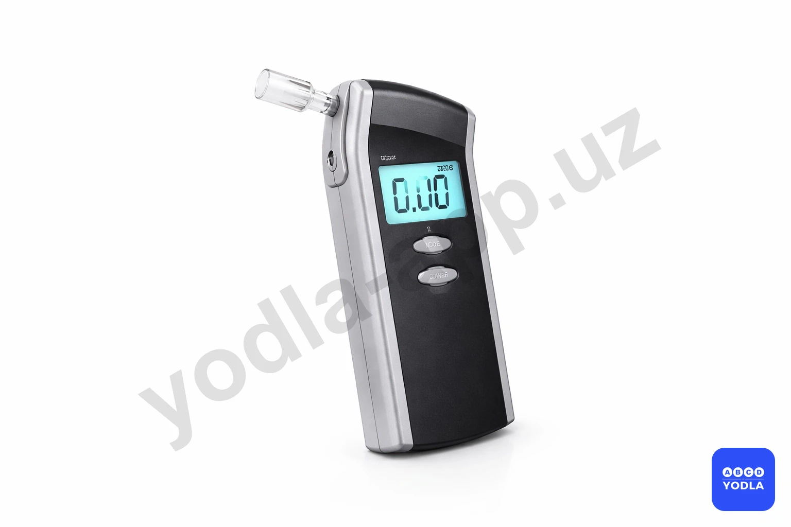
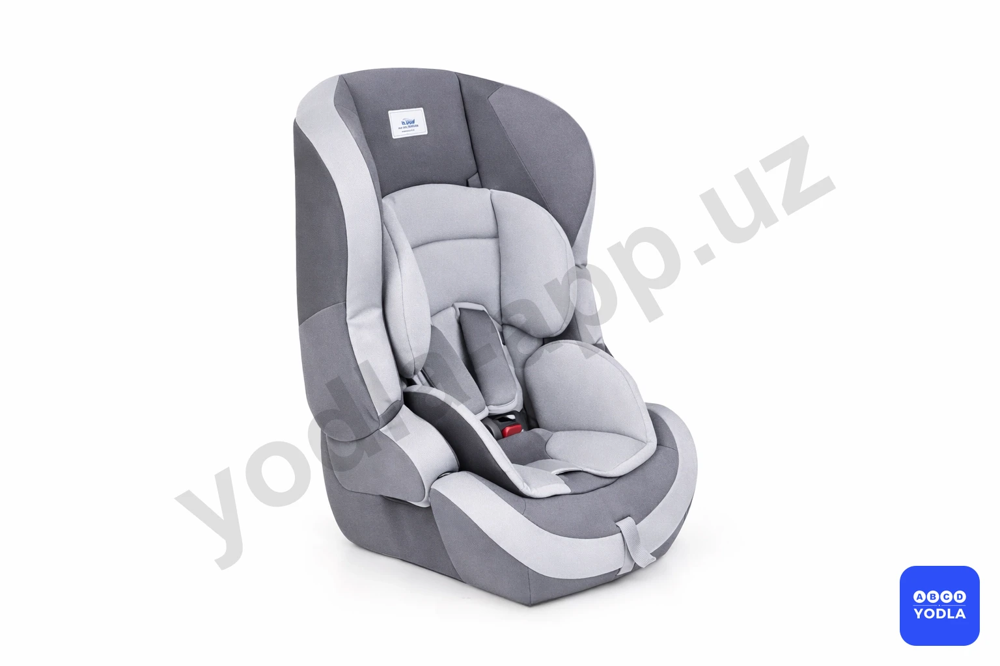

# 02. Общие обязанности водителей (боб 2)

Всего вопросов: 13

## Вопрос 1

**Кому водитель должен предоставить свое транспортное средство независимо от направления движения?**

⬜ A. Сотрудникам дорожной службы
✅ B. Медицинским служащим, для транспортировки больного в случаях угрожающих его жизни

> 💡 Согласно абзацу з пункта 11 главы 2 ПДД водитель транспортного средства обязан предоставлять транспортное средство медицинским работникам, следующим в попутном направлении для оказания медицинской помощи, а также для транспортировки граждан, нуждающихся в безотлагательной медицинской помощи, в лечебно-профилактическое учреждение.

---

## Вопрос 2

**В каком из перечисленных случаев Правила обязывают водителя предоставить свое транспортное средство в распоряжение работника органов внутренних дел?**

⬜ A. В любом случае
✅ B. Для выполнения неотложных служебных заданий
⬜ C. В любом случае для следования к месту работы

> 💡 Согласно абзацу з пункта 11 главы 2 ПДД водитель транспортного средства обязан предоставлять транспортное средство сотрудникам ОВД, Национальной гвардии, Службы государственной безопасности и  Государственной службы безопасности Президента Республики Узбекистан для выполнения неотложных служебных заданй в случаях, предусмотренных законодательством.

---

## Вопрос 3

**Что должен сделать в первую очередь водитель; причастный к дорожно-транспортному происшествию?**

⬜ A. Остановиться на месте происшествия, записать фамилии и адреса очевидцев, сообщить о случившемся в милицию, принять меры для оказания доврачебной медицинской помощи пострадавшим
✅ B. Немедленно остановиться и оставаться на месте происшествия, включить аварийную световую сигнализацию и выставить знак аварийной остановки
⬜ C. Остановиться и принять все возможные меры к сохранению следов происшествия, ограждению их и организации объезда места происшествия, сообщить о случившемся в милицию и принять меры для оказания доврачебной медицинской помощи пострадавшим

> 💡 Пункта 13 главы З ПДД гласит: При дорожно-транспортном происшествии водители, причастные к нему, обязаны: немедленно остановить транспортное средство, включить аварийную световую сигнализацию или выставить знак аварийной остановки (мигающий красный фонарь), не перемещать транспортное средство и предметы, имеющие отношение к происшествию.

---

## Вопрос 4

**Может ли лицо; имеющее доверенность на право распоряжения транспортным средством; передавать управление транспортным средством в своем присутствии другому лицу?**

⬜ A. Разрешена
⬜ B. Нельзя
✅ C. Может; при наличии у этого лица водительского удостоверения на право управления транспортным средством данной категории; и оно указано в страховом полисе обязательного страхования гражданской ответственности владельца транспортного средства

> 💡 Пункта 8 главы 2 ПДД гласит: Лицо, имеющее удостоверение на право управления транспортным средством соответствующей категории, талон к нему или временное разрешение, имеет право управлять не принадлежающим ему транспортным средством в присутствии владельца или лица, имеющего документ, подтверждающий право на распоряжение, владение и пользование транспортным средством (по их согласию), а также при условии, что договор обязательного страхования гражданской ответственности владельца транспортного средства заключен в отношении неограниченного числа лиц, допущенных к управлению данным транспортным средством, либо если лицо, управляющее транспортным средством, указано в страховом полисе.

---

## Вопрос 5

**В каком случае водитель должен предоставить грузовой автомобиль работнику органов внутренних дел для буксировки транспортного средства поврежденного при дорожно транспортном происшествии?**

⬜ A. Только в случае, если буксировка будет осуществляться в попутном направлении
✅ B. В любом случае, кроме транспортных средств принадлежащих гражданам
⬜ C. По усмотрению водителя

> 💡 Пункта 91 главы 13 ПДД, гласит: на пересечениях проезжих частей и на расстоянии менее 30 метров от края пересекаюшей проезжей части (за исключением противоположной стороны примыкающей дороги, отделенной разделительной линией или разделительной полосой на трехсторонних перекрестках).

---

## Вопрос 6

**Разрешается ли водителю управлять транспортным средством под воздействием лекарственных препаратов; снижающих скорость реакции и внимание?**

✅ A. Запрещается
⬜ B. Разрешается
⬜ C. Разрешается, если стаж водителя более 2-х лет

> 💡 Пункту 12 главы 2 ПДД, гласит: Водителю запрещается: - управлять транспортным средством в состоянии любого опьянения (алкогольного, наркотического и др.), под воздействием лекарственных препаратов, снижающих скорость реакции и внимание, в болезненном или утомленном состоянии, способным создать угрозу безопасности движения.

---

## Вопрос 7

**Если в результате дорожно-транспортного происшествия нет пострадавших, а материальный ущерб несущественен, могут ли водители сами покинуть место происшествия и прибыть на ближайший пост ГСБДД или в органы внутренних дел для оформления происшествия?**

⬜ A. Не могут
⬜ B. Могут
✅ C. Могут; предварительно составив схему происшествия и подписав ее

> 💡 Пункта 14 главы 3 ПДД, гласит: Если в результате дорожно-транспортного происшествия нет пострадавших, то водители, при взаимном согласии в оценке обстоятельств случившегося, могут прибыть на ближайший пост ГСБДД или в орган милиции для оформления происшествия, предварительно составив схему происшествия и подписав ее.

---

## Вопрос 8

**Разрешается ли водителю пользоваться телефоном во время движения?**

⬜ A. Разрешается
✅ B. Разрешается только при использовании технического устройства, позволяющего вести переговоры без использования рук
⬜ C. Разрешается только при движении со скоростью менее 20 км/ч

> 💡 Знак 1.6 раздела 1 приложения № 1 к ПДД, «Пересечение равнозначных дорог». Устанавливаются в населенных пунктах на расстоянии 50 — 100 м до начала опасного участка. Согласно пункту 105 главы 16 ПДД, на перекрестке равнозначных дорог водитель безрельсового транспортного средства обязан уступить дорогу транспортным средствам, приближающимся справа.

---

## Вопрос 9

**Что обязаны сделать в первую очередь водители, причастные к дорожно-транспортному происшествию?**

⬜ A. Освободить проезжую часть
✅ B. Немедленно остановиться, включить аварийную сигнализацию и выставить знак аварийной остановки
⬜ C. Сообщить о случившемся в СБДД

> 💡 Согласно пункту 67 Правил дорожного движения, вне населенных пунктов, а также в населенных пунктах на участках дорог, где разрешено движение с большей скоростью для отдельных видов транспортных средств, чем предписано настоящими Правилами, водители транспортных средств должны двигаться по возможности ближе к правому краю проезжей части. Запрещается занимать левые полосы движения при свободных правых.

---

## Вопрос 10

**Следующим лицам разрешается не пристегиваться ремнями безопасности в транспортных средствах, предусмотренных конструкцией ремней безопасности?**

⬜ A. Детям до 12 лет на заднем сиденье автомобиля
⬜ B. Беременным женщинам
⬜ C. Водителям, едущим задним ходом
✅ D. 1 и 2 ответы верны
⬜ E. Во всех перечисленных случаях

> 💡 Пункта 32 главы 7 ПДД, гласит: Сигналы светофора, выполненные в виде стрелок красного, желтого и зеленого цветов тоже имеют то же значение, что и круглые соответствующего цвета. Их действие распространяется только на направление, указываемое стрелками.
Стрелка, разрешающая поворот налево, разрешает и разворот, если это не запрещено соответствующим дорожным знаком.
Также это значение имеет зелёная стрелка в дополнительной секции.
Выключенный сигнал дополнительной секции означает запрещение движения в направлении, регулируемом этой секцией.
ПДД приложение № 1: Поворот налево запрещен.

---

## Вопрос 11

**Какой документ разрешает владельцу механического транспортного средства управлять транспортным средством, если у него нет водительских прав?**

⬜ A. Биометрик паспорт
⬜ B. ID карта
⬜ C. Право собственности
⬜ D. Все ответы верны
✅ E. Первый и второй ответы верны

> 💡 Пункт 91 главы 13 ПДД гласит:
что остановка запрещается в местах, где расстояние между сплошной линией разметки (кроме обозначающей край проезжей части) и остановившимся транспортным средством менее 3 м.

---

## Вопрос 12

**В случаях, когда концентрация паров этанола, выделяемых водителем транспортного средства, указывает на это, сотрудник DYHXX составит административный отчет о факте употребления водителем алкогольного напитка**

⬜ A. В случае концентрации 0,105 миллиграмма на литр подаваемого воздуха и выше 
✅ B. При концентрации 0,135 миллиграмма или более на литр выдыхаемого воздуха
⬜ C. При концентрации 0,255 миллиграмма или более на литр выдыхаемого воздуха

> 💡 Если содержание этанола в выдыхаемом водителем воздухе составляет 0,135 миллиграмма и выше, водитель считается находящимся в состоянии опьянения, и в установленном порядке оформляется административный протокол.

---

## Вопрос 13

**Где безопаснее всего разместить детское удерживающее устройство в автомобиле?**

✅ A. Заднее среднее сиденье
⬜ B. Переднее сиденье
⬜ C. Место за водителем

> 💡 Самым безопасным местом для установки детского удерживающего устройства считается среднее сиденье заднего ряда. При столкновении оно подвергается наименьшему риску, поскольку расположено на наибольшем удалении от всех сторон автомобиля.

---

