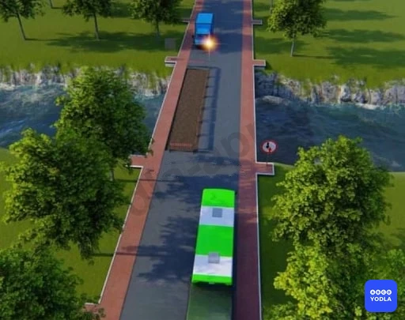
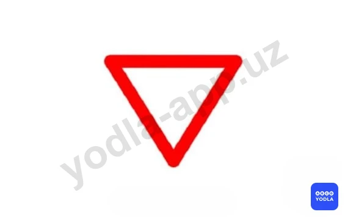
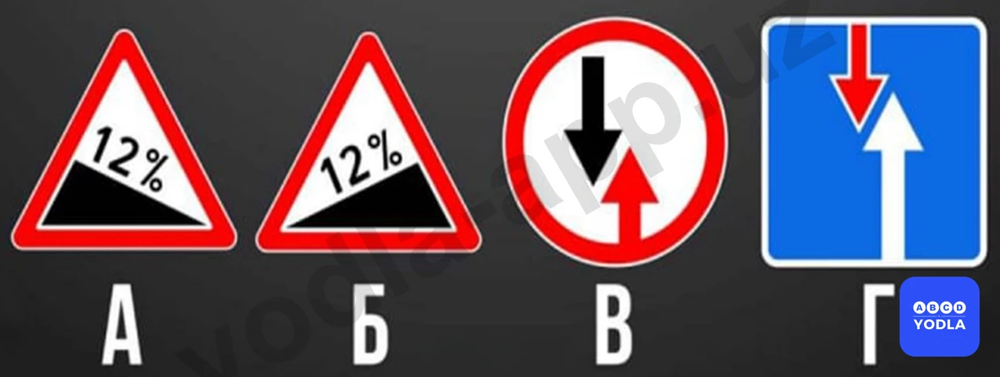
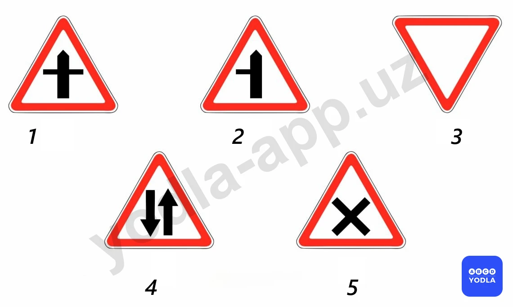

# 06. Знаки приоритета (боб 1.2)

Всего вопросов: 19

## Вопрос 1

**Какой знак обозначает преимущество встречного движения?**

⬜ A. 1
✅ B. 2
⬜ C. 3
⬜ D. 4
⬜ E. 5

> 💡 Согласно знаку 2.6 раздела 2 приложения № 1 к ПДД, «Приоритет встречного движения» запрещает въезд на узкий участок дороги, если это может затруднить встречное движение. Водитель должен уступить дорогу (не создавать помех) встречным транспортным средствам, находящимся на узком участке или противоположном подъезде к нему.

---

## Вопрос 2

**Водитель какого транспортного средства имеет право на первоочередное движение?**

✅ A. Водитель грузового автомобиля

⬜ B. Водитель автобуса

> 💡 Знак 2.6 главы 2 приложения № 1 к ПДД, «Приоритет встречного движения» запрещает въезд на узкий участок дороги, если это может затруднить встречное движение. Водитель должен уступить дорогу встречным транспортным средствам, находящимся на узком участке или противоположном подъезде к нему. А знак 2.7. «Преимущество перед встречным движением». Узкий участок дороги, при движении по которому водитель пользуется приоритетом по отношению к встречным транспортным средствам.

---

## Вопрос 3

**Какой знак обязывает уступить дорогу транспортным средствам; движущимся по пересекаемой дороге?**

⬜ A. 1
⬜ B. 2
✅ C. 3
⬜ D. 4
⬜ E. 5

> 💡 Согласно знаку 2.4 раздела 2 приложения № 1 к ПДД, «Уступите дорогу». Водитель должен уступить дорогу транспортным средствам, движущимся по пересекаемой дороге, а при наличии дополнительного знака 7.13 — по главной.

---

## Вопрос 4

**Если данный знак установлен у перекрестка то как должен поступить водитель?**

⬜ A. Если на перекрестке на месте пересечения нет транспортных средств должен проехать без остановки
⬜ B. Должен быть осторожным при проезде через перекресток
✅ C. Запрещается движение без остановки перед стоп линией, а если ее нет - перед краем пересекамой проезжей части

> 💡 Согласно пункту 2.5 раздела 2 приложения № 1 к ПДД, «Движение без остановки запрещено» запрещается движение без остановки перед стоп-линией, а если ее нет — перед краем пересекаемой проезжей части. Водитель должен уступить дорогу транспортным средствам, движущимся по пересекаемой, а при наличии дополнительного дорожного знака 7.13 – по главной дороге. Этот дорожный знак может быть установлен перед железнодорожным переездом или карантинным постом. В этих случаях водитель должен остановиться перед стоп-линией, а при ее отсутствии — перед знаком.

---

## Вопрос 5

**Какой знак требует уступить дорогу встречным транспортным средствам?**

⬜ A. 1
✅ B. 2
⬜ C. 3
⬜ D. 4
⬜ E. 5

> 💡 Знак 2.6 раздела 2 приложения № 1 к ПДД, «Преимущество встречного движения». Запрещается въезд на узкий участок дороги, если это может затруднить встречное движение. Водитель должен уступить дорогу встречным транспортным средствам, находящимся на узком участке или противоположном подъезде к нему.

---

## Вопрос 6

**В каком случае водитель правильно выполнил требования этого знака?**

⬜ A. Уступил дорогу механическим транспортным средствам движущимся по пересекаемой дороге
✅ B. Уступил дорогу транспортным средствам движущимся по пересекаемой дороге

> 💡 Знак 2.4 «Уступите дорогу» раздела 2 приложения № 1 к ПДД, водитель должен уступить дорогу (не создавать помех) транспортным средствам, движущимся по пересекаемой дороге, а при наличии дополнительного знака 7.13 – по главной.

---

## Вопрос 7

**Какой знак обязывает уступить дорогу транспортным средствам движущимся по пересекаемой дороге?**

⬜ A. 1
⬜ B. 2
⬜ C. 3
✅ D. 4
⬜ E. 5

> 💡 Знак 2.4 «Уступите дорогу» раздела 2 приложения № 1 к ПДД, водитель должен уступить дорогу транспортным средствам, движущимся по пересекаемой дороге.

---

## Вопрос 8

**Водитель какого транспортного средства должен уступить дорогу?**

⬜ A. Водитель трактора
✅ B. Водитель автобуса

> 💡 Правильный ответ — знак №4, 2.4 «Уступите дорогу!». Водитель обязан уступить дорогу транспортным средствам, движущимся по пересекаемой главной дороге.

---

## Вопрос 9

**Какие знаки требует, что Вы должны уступить дорогу, если встречный разъезд затруднен?**

⬜ A. Только «В»
✅ B. «А» и «В»
⬜ C. «Б» и «В»
⬜ D. «Б» и «Г»

> 💡 Согласно пункту 49 Правил дорожного движения, вместо звукового сигнала об обгоне или же вместе с ним может подаваться предупредительный сигнал переключением фар.
Согласно пункту 48 Правил дорожного движения, звуковые сигналы могут применяться в следующих случаях: вне населенных пунктов при обгоне, для предупреждения других водителей; в необходимых случаях — для предотвращения дорожно-транспортного происшествия.
Использование звуковых сигналов запрещено, за исключением случаев, указанных выше.

---

## Вопрос 10

**Какой знак указывает на необходимость уступить дорогу встречному транспортному средству на узких участках дороги?**

✅ A. А
⬜ B. Б
⬜ C. Б и В
⬜ D. А и Г
⬜ E. Г

> 💡 Знак 2.6 раздела 2 приложения № 1 к ПДД, «Преимущество встречного движения». Запрещается въезд на узкий участок дороги, если это может затруднить встречное движение. Водитель должен уступить дорогу встречным транспортным средствам, находящимся на узком участке или противоположном подъезде к нему.

---

## Вопрос 11

**Какой знак запрещает движение без остановки перед стоп-линией, а при эё отсутствии перед линией пересечения проезжих частей дороги?**

⬜ A. А
✅ B. Б
⬜ C. Б и В
⬜ D. А и Г
⬜ E. Г

> 💡 Согласно статьи 6 Правил дорожного движения, полоса движения — любая из пр��дольных полос проезжей части, обозначенная или необозначенная дорожной разметкой и имеющая ширину, достаточную для движения автомобилей в один ряд.

---

## Вопрос 12

**Какие дорожные знаки дают преимущество водителю на узком участке дороги?**

⬜ A. Только B
⬜ B. А и B
✅ C. Только Д
⬜ D. Только C

> 💡 «Преимущество перед встречным движением». Обозначает, что при движении по узкому участку дороги водитель имеет преимущество перед транспортными средствами, движущимися во встречном направлении.

---

## Вопрос 13

**Какой знак предписывает водителю уступить дорогу транспортным средствам, движущимся по пересекаемой дороге?**

⬜ A. А
⬜ B. Б
⬜ C. В
⬜ D. Г
✅ E. Б и Г

> 💡 Оба дорожных знака 2.4 и 2.5 устанавливаются на второстепенной дороге и обязывают водителя уступить дорогу транспортным средствам, движущимся по главной дороге.

---

## Вопрос 14

**Какой знак обозначает пересечение с второстепенной дорогой?**

✅ A. 1
⬜ B. 2
⬜ C. 3
⬜ D. 4
⬜ E. 5

> 💡 Обозначает «Пересечение со второстепенной дорогой». Этот знак указывает, что данная дорога является главной, и предупреждает о наличии пересечений со второстепенными дорогами с обеих сторон.

---

## Вопрос 15

**Какой знакобозначает примыкание второстепенной дороги?**

⬜ A. 1
✅ B. 2
⬜ C. 3
⬜ D. 4
⬜ E. 5

> 💡 Согласно пункту 98 Правил дорожного движения, перекресток, где очередность движения определяется сигналами светофора или регулировщика, считается регулируемым. 
При желтом мигающем сигнале, неработающих светофорах или отсутствии регулировщика перекресток считается нерегулируемым, и водители обязаны руководствоваться правилами проезда нерегулируемых перекрёстков и установленными на перекрёстке знаками приоритета.

---

## Вопрос 16

**При наличии каких знаков водитель пользуеться преимушеством, если встречный разъезд затруднен припятствием?**

⬜ A. В
⬜ B. А и В
⬜ C. Б и В
✅ D. Б и Г

> 💡 Приложение № 1 ПДД: 1.11.1, 1.11.2. “Опасный поворот”. Закругление дороги малого радиуса или с ограниченной видимостью: 1.11.1 направо, 1.11.2 - налево.

---

## Вопрос 17

**В этой ситуации вы:**

⬜ A. У меня есть право первого прохода
✅ B. Я уступаю дорогу приближающейся машине

> 💡 Линия 1.18 раздела 1 приложения № 2 к ПДД, указывает разрешённые направления движения по полосам на перекрестке. Применяется самостоятельно или в сочетании со знаками 5.8.1, 5.8.2 «Направления движения по полосам», разметка с изображением тупика наносится для указания того, что поворот на ближайшую проезжую часть запрещён; разметка, разрешающая поворот налево из крайней левой полосы, разрешает и разворот.

---

## Вопрос 18

**Найдите предупреждающие знаки**

⬜ A. Все
⬜ B. 1,2 4,5
✅ C. 4,5

> 💡 Пункта 60 главы 9 ПДД, гласит:
В случаях, когда траектории движения транспортных средств пересекаются, а очередность проезда не оговорена Правилами, дорогу должен уступить водитель, к которому транспортное средство приближается справа.

---

## Вопрос 19

**В каких местах знаки приоритета определяют очередность движения?**

⬜ A. Только на перекрестках
⬜ B. Только между узкой частью ствола
✅ C. Оба ответа верны

> 💡 ПДД приложение № 1: 5.15.1 “Платная стоянка”.

---

