# 07. Запрещающие знаки (боб 1.3)

Всего вопросов: 62

## Вопрос 1

**Какой знак запрещает движение транспортных средств с дистанцией между ними, меньше указанной на знаке?**

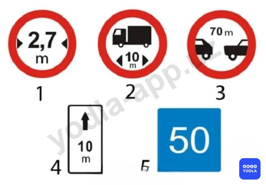

⬜ A. 1
⬜ B. 2
✅ C. 3
⬜ D. 4
⬜ E. 5

> 💡 Согласно знаку 3.16 раздела 3 приложения № 1 к ПДД, «Ограничение минимальной дистанции» запрещается движение транспортных средств с дистанцией между ними меньше чем указанной на знаке.

---

## Вопрос 2

**Этот дорожный знак обозначает:**

⬜ A. Запрещается движение грузовых автомобилей и составов транспортных средств (грузовых автомобилей с прицепами) грузоподъемностью больше указанной на знаке
✅ B. Запрещается движение транспортных средств, в том числе тягачей с прицепами, общая фактическая масса которых (включая массу пассажиров и груза) больше указанной на знаке

> 💡 Согласно знаку 3.11 раздела 3 приложения № 1 к ПДД, «Ограничение массы», запрещается движение транспортных средств, в том числе составов транспортных средств, общая фактическая масса которых больше указанной на знаке.

---

## Вопрос 3

**В каком ответе правильно указаны все разрешенные направления движения?**

⬜ A. « А »
⬜ B. « Б »
⬜ C. « В »
✅ D. « А » и « Б »
⬜ E. « А » и « В »

> 💡 Согласно абзацу 4 раздела 3 приложения № 1 к ПДД, действие знака 3.18.1 «Поворот направо запрещен» распространяется на пересечение проезжих частей, перед которыми установлен знак.

---

## Вопрос 4

**В каком направлении  разрешается движение?**

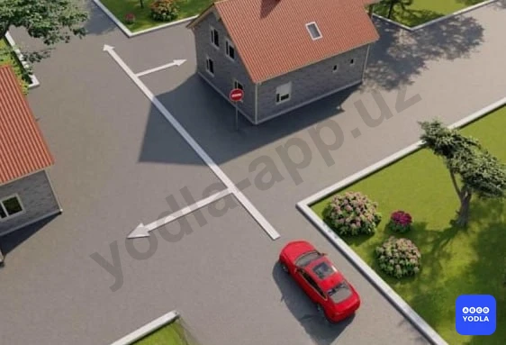

✅ A. Только налево
⬜ B. Прямо и направо
⬜ C. Только направо и налево
⬜ D. Только прямо

> 💡 Знак 3.1 раздела 3 приложения № 1 к ПДД, «Въезд запрещен». Запрещается въезд всех транспортных средств.

---

## Вопрос 5

**Что обозначает этот знак?**

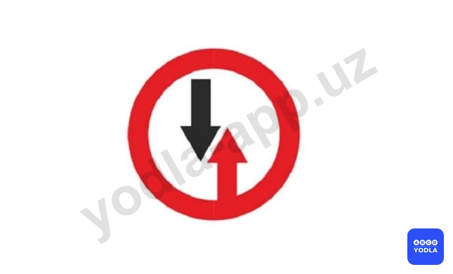

⬜ A. Предоставляет преимущество перед встречными транспортными средствами
✅ B. Обязывает водителя уступить дорогу встречным транспортным средствам
⬜ C. Обозначает конец участка дороги с односторонним движением

> 💡 Согласно десятому абзацу второго раздела приложения №1 ПДД: 2.6 «Преимущество встречного движения». Запрещается въезд на узкий участок дороги, если это может затруднить встречное движение. Водитель должен уступить дорогу встречным транспортным средствам, находящимся на узком участке или противоположном подъезде к нему.

---

## Вопрос 6

**В каком направлении запрещено движение?**

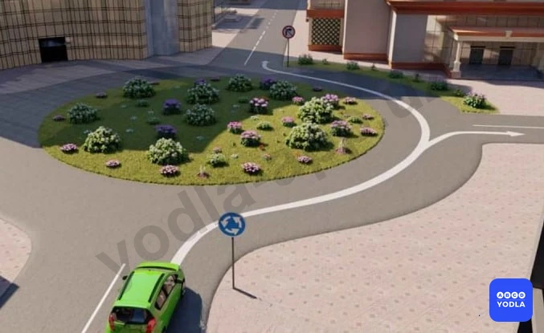

⬜ A. Направо в первый проезд
✅ B. Направо во второй проезд
⬜ C. Направо в первый и второй проезды

> 💡 Согласно абзацу 4 раздела 3, приложения № 1 к ПДД, действие знака 3.18.1 распространяется на пересечение проезжих частей, перед которыми установлен знак.

---

## Вопрос 7

**Какой знак запрещает движение транспортных средств; габаритная длина которых больше указанной на знаке?**

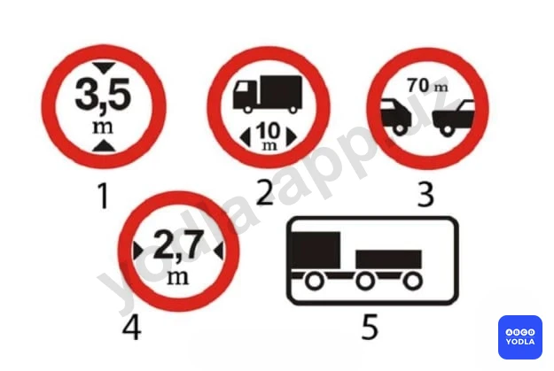

⬜ A. 1
✅ B. 2
⬜ C. 3
⬜ D. 4
⬜ E. 5

> 💡 Согласно знаку 3.15 раздела 3 приложения № 1 к ПДД, «Ограничение длины», запрещается движение транспортных средств (составов транспортных средств), габаритная длина которых (с грузом или без груза) больше указанной на знаке.

---

## Вопрос 8

**На каком рисунке показаны разрешенные направления движения?**

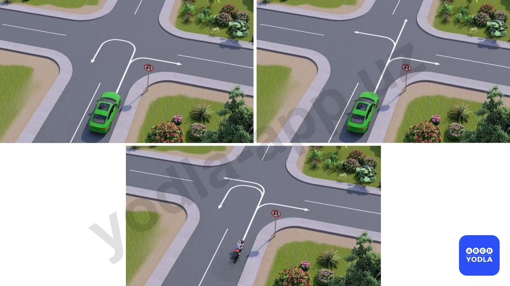

⬜ A. На левом рисунке
⬜ B. На среднем рисунке
✅ C. На правом рисунке
⬜ D. На среднем и правом рисунке

> 💡 Знак 3.19 раздела 3, приложения № 1 к ПДД, «Разворот запрещен» - запрещается только разворот.

---

## Вопрос 9

**Какой знак запрещает стоянку по четным числам?**

⬜ A. 1
⬜ B. 2
⬜ C. 3
⬜ D. 4
✅ E. 5

> 💡 Согласно тридцать четвертому абзацу третьего раздела приложения №1 ПДД: Запрещающий знак 3.30 “Стоянка запрещена по четным числам месяца”.

---

## Вопрос 10

**В каком ответе правильно указаны все разрешенные направления движения автомобиля?**

⬜ A. Только налево
⬜ B. Только прямо
⬜ C. Только направо
⬜ D. Налево и направо
✅ E. Во всех направлениях

> 💡 Согласно знаку 3.5 раздела 3 приложения № 1 к ПДД, «Движение мотоциклов запрещено», запрещается движение только мотоциклам.

---

## Вопрос 11

**Можно ли водителю автобуса обгонять в зоне действия этого знака?**

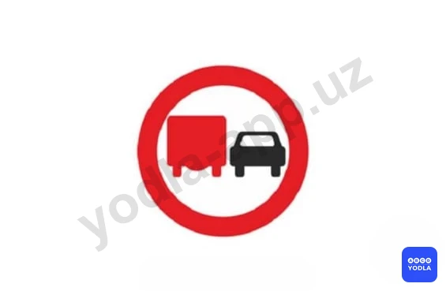

✅ A. Можно во всех случаях с соблюдением правил обгона
⬜ B. Нельзя
⬜ C. Можно при условии; если обгоняемое транспортное средство движется со скоростью менее 40 км/ч

> 💡 Согласно двадцать шестому абзацу третьего раздела приложения №1 ПДД: Запрещающий знак 3.22 "Обгон грузовым автомобилям запрещен". Запрещается грузовым автомобилям с разрешенной максимальной массой более 3,5 т обгон всех транспортных средств (за исключением транспортного средства, трактора, гужевой повозки, велосипеда, движущегося со скоростью менее 40 км/ч). 
Знак запрещает обгон грузовым автомобилям, соответственно, автобусам в зоне действия этого знака обгон разрешен во всех случаях.

---

## Вопрос 12

**Разрешается ли буксировка автомобиля; если на дороге установлен этот знак?**

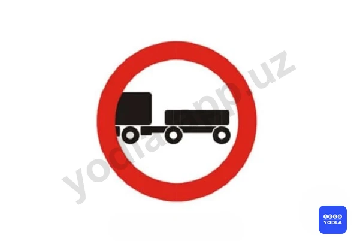

⬜ A. Разрешается только легковым автомобилям

⬜ B. Разрешается на жесткой сцепке
✅ C. Запрещается
⬜ D. Разрешается на любой сцепке

> 💡 Согласно требованию знака 3.7 раздела 3 приложения № 1 к ПДД, «Движение с прицепом запрещено» запрещается движение грузовых автомобилей и тракторов с прицепами любого типа, а также всякая буксировка механических транспортных средств.

---

## Вопрос 13

**Какие транспортные средства запрещается обгонять при этом знаке?**

⬜ A. Все
✅ B. Все, кроме одиночных, движущихся со скоростью менее 40 км/ч
⬜ C. Легковые автомобили, мотоциклы и грузовые автомобили с полной массой менее 3,5 т
⬜ D. Грузовые автомобили с полной массой более 3,5 т

> 💡 Согласно требованию знаку 3.20 раздела 3 приложения № 1 к ПДД, «Обгон запрещен» запрещается обгон всех транспортных средств, кроме одиночных, движущихся со скоростью менее 40 км/ч.

---

## Вопрос 14

**На какие транспортные средства действие этого знака не распространяется?**

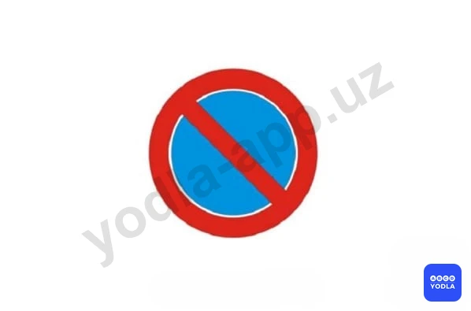

⬜ A. Маршрутное такси
⬜ B. Такси с включенным таксометром
⬜ C. Автомобиль, которым управляет инвалид, с установленной табличкой «инвалид».
⬜ D. Маршрутные транспортные средства
✅ E. варианты на которых показаны во втором и третьем ответах

> 💡 Согласно требованию знака 3.28 раздела 3 приложения № 1 к ПДД, «Стоянка запрещена» запрещается стоянка транспортных средств(за исключением транспортных средств, оборудованных проблесковым маячком синего или синего и красного цветов, прикрепленным к сотруднику выполнившую неотложное служебное задание и маркированным специальными цветовыми схемами и надписями). Действие знака не распространяется на транспортные средства управляемые инвалидами, а так же на такси с включенным таксометром.

---

## Вопрос 15

**Разрешается ли буксировка мотоцикла с боковым прицепом по дороге на которой установлен этот знак?**

⬜ A. Разрешается не более одной единицы
⬜ B. Разрешается при использовании жесткой сцепки для буксировки
✅ C. Запрещается
⬜ D. Запрещается при гололеде

> 💡 Запрещающий знак 3.7 "Движение с прицепом запрещено". Запрещается движение грузовых автомобилей и тракторов с прицепами любого типа, а также всякая буксировка механических транспортных средств. Соответственно, буксировка мотоцикла с боковым прицепом по дороге, на которой установлен этот знак, запрещена.

---

## Вопрос 16

**Каким грузовым автомобилям из перечисленных этот знак не запрещает дальнейшее движение?**

⬜ A. Данный дорожный знак 3.4 не запрещает движение грузовых автомобилей с нанесённой на борта наклонной белой полосой, а также грузовых автомобилей, предназначенных для перевозки людей.
⬜ B. Автомобилям с разрешенной максимальной массой более 3,5 т
⬜ C. Автомобилям, перевозящим опасные грузы
✅ D. Грузовым автомобилям с белой наклонной полосой на бортах

> 💡 Знак 3.4 раздела 3 приложения № 1 к ПДД, «Движение грузовых автомобилей запрещено». Запрещается движение грузовых автомобилей и составов транспортных средств с разрешенной максимальной массой более 3,5 т (если на знаке не указана масса) или с разрешенной максимальной массой более указанной на знаке, а также тракторов и самоходных машин. Этот знак не запрещает движение грузовых автомобилей с наклонной белой полосой на бортах или предназначенных для перевозки людей.

---

## Вопрос 17

**Какой из указанных знаков отменяет все ранее введенные ограничения?**

⬜ A. 1
⬜ B. 2
⬜ C. 3
✅ D. 4
⬜ E. 5

> 💡 Среди этих знаков правильным ответом является знак №4. Дорожный знак 3.31 «Конец всех ограничений» обозначает конец зоны действия одного или нескольких знаков 3.16, 3.20, 3.22, 3.24, 3.26–3.30, действующих одновременно.

---

## Вопрос 18

**Какому грузовому автомобилю можно продолжать движение при этом знаке?**

⬜ A. Автомобилю загруженному до 8 т
⬜ B. Порожнему автомобилю грузоподъемностью 8 т
✅ C. Автомобилю разрешенная максимальная масса которого не более 8 т

> 💡 Согласно знаку 3.4 раздела 3 приложения № 1 к ПДД, «Движение грузовых автомобилей запрещено», запрещается движение грузовых автомобилей и составов транспортных средств с разрешенной максимальной массой более 3,5 т (если на знаке не указана масса) или с разрешенной максимальной массой более указанной на знаке, а также тракторов и самоходных машин.

---

## Вопрос 19

**Какой знак запрещает проезд без остановки?**

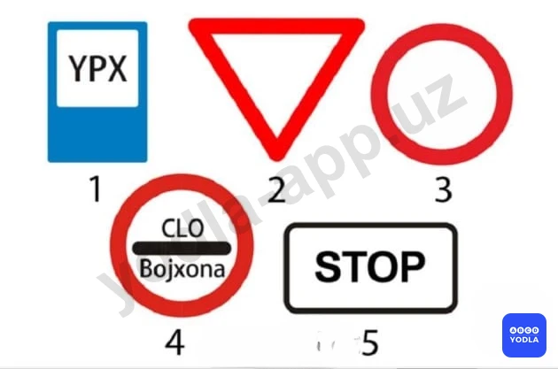

⬜ A. 1
⬜ B. 2
⬜ C. 3
✅ D. 4
⬜ E. 5

> 💡 Знак 3.17.1 раздела 3 приложения № 1 к ПДД, «Таможня» запрещается проезд без остановки у таможенного (контрольного) пункта.

---

## Вопрос 20

**На какие транспортные средства не распространяется действие данного знака?**

⬜ A. На тракторы и самоходные машины
⬜ B. На автобусы и микроавтобусы
✅ C. На транспортные средства которые обслуживают предприятия находящиеся в зоне действия знака

> 💡 Запрещающий знак 3.2 “Движение запрещено”. Запрещается движение всех транспортных средств. Действие знаков 3.1, 3.2, 3.3, 3.18.1, 3.18.2, 3.19, 3.27 не распространяется - на маршрутные транспортные средства, знаков 3.2-3.8 - на транспортные средства, которые обслуживают предприятия, находящиеся в обозначенной зоне, а также обслуживают или принадлежат гражданам, проживающим или работающим в обозначенной зоне. В этих случаях транспортные средства должны въезжать в обозначенную зону и выезжать из нее на ближайшем к месту назначения перекрестке.

---

## Вопрос 21

**Какой знак запрещает движение грузового автомобиля с прицепом, если суммарная разрешенная максимальная масса автомобиля и прицепа равна 7 т?**

⬜ A. 1
⬜ B. 2
⬜ C. 3
✅ D. 4
⬜ E. 5

> 💡 Запрещающий знак 3.7 “Движение с прицепом запрещено”. Запрещается движение грузовых автомобилей и тракторов с прицепами любого типа, а также всякая буксировка механических транспортных средств.

---

## Вопрос 22

**Какой знак разрешат левый поворот?**

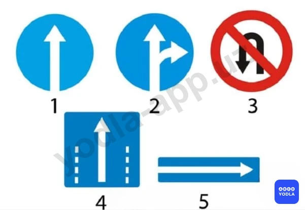

⬜ A. 1
⬜ B. 2
✅ C. 3
⬜ D. 4
⬜ E. 5

> 💡 Запрещающий знак 3.19 “Разворот запрещен”. Все знаки, кроме запрещающего разворот 3.19, запрещают поворот налево.

---

## Вопрос 23

**Разрешается ли буксировка легкового автомобиля на участке дороги; обозначенном этим дорожным знаком?**

⬜ A. Разрешается
✅ B. Запрещается

> 💡 Запрещающий знак 3.7 “Движение с прицепом запрещено”. Запрещается движение грузовых автомобилей и тракторов с прицепами любого типа, а также всякая буксировка механических транспортных средств.

---

## Вопрос 24

**Каким грузовым автомобилям разрешается продолжать движение при этом знаке?**

✅ A. Автомобилям с пассажирами в специально оборудованном кузове
⬜ B. Автомобилям перевозящим продукты в кузове-фургоне
⬜ C. Автомобилям с надписью «Связь»

> 💡 Согласно требованию знака 3.4. раздела 3 приложения № 1 к ПДД, «Движение грузовых автомобилей запрещено» запрещается движение грузовых автомобилей и составов транспортных средств с разрешенной максимальной массой более 3,5 т (если на знаке не указана масса) или с разрешенной максимальной массой, более указанной на знаке, а также тракторов и самоходных машин.

---

## Вопрос 25

**Этот дорожный знак:**

⬜ A. Запрещает движение всех видов механических транспортных средств кроме двухколесного мотоцикла без коляски
⬜ B. Запрещает движение всех транспортных средств кроме колесных тракторов
✅ C. Запрещает движение тракторов и самоходных машин

> 💡 Согласно требованию знака 3.6 раздела 3 приложения № 1 к ПДД, «Движение тракторов запрещено» запрещается движение тракторов и самоходных машин.

---

## Вопрос 26

**По какому пути из числа обозначенных стрелками разрешено движение?**

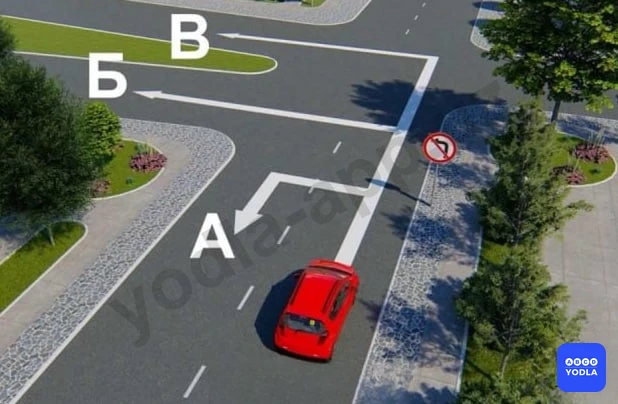

⬜ A. «А» и «Б»
⬜ B. «Б» и «В»
✅ C. «А» и «В»

> 💡 Знак 3.18.2 «Поворот налево запрещен» раздела 3 приложения № 1 к ПДД. Действие знака распространяется на пересечение проезжих частей, перед которыми установлен знак. Знак запрещает только поворот налево.

---

## Вопрос 27

**Какому автомобилю разрешено движение при этом знаке?**

⬜ A. Двухосному грузовому автомобилю, фактическая масса которого 12 т
✅ B. Трехосному грузовому автомобилю, фактическая масса которого 12 т

> 💡 Согласно знаку 3.12 раздела 3 приложения № 1 к ПДД, «Ограничение нагрузки на ось», запрещается движение транспортных средств, у которых фактическая нагрузка на какую-либо ось больше указанной на знаке.

---

## Вопрос 28

**Какой знак разрешает разворот?**

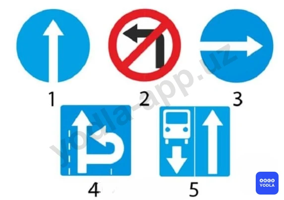

⬜ A. 1
✅ B. 2
⬜ C. 3
⬜ D. 4
⬜ E. 5

> 💡 Запрещающий знак 3.18.2 “Поворот налево запрещен”.

---

## Вопрос 29

**Для предотвращения опасных последствий заноса автомобиля водитель должен:**

⬜ A. Резко нажать на педаль тормоза
⬜ B. Нажать на педаль сцепления
✅ C. Прекратить начатое торможение

> 💡 Согласно знаку 3.13 раздела 3 приложения № 1 к ПДД, «Ограничение высоты», запрещается движение транспортных средств, габаритная высота которых (с грузом или без груза) больше указанной на знаке.

---

## Вопрос 30

**Действие; какого из знаков не распространяется на маршрутные транспортные средства?**

⬜ A. 1
⬜ B. 2
⬜ C. 3
✅ D. 4
⬜ E. 5

> 💡 Запрещающий знак 3.27 “Остановка запрещена”. Запрещается остановка и стоянка транспортных средств.

---

## Вопрос 31

**Этот дорожный знак означает, что:**

⬜ A. Запрещается обгонять все механические транспортные средства, кроме одиночных, движущихся со скоростью менее 40 км/ч, двухколесных мотоциклов без бокового прицепа и велосипедов
✅ B. Грузовым автомобилям, разрешенная максимальная масса которых превышает 3,5 т, запрещается обгонять все транспортные средства, кроме одиночных, движущихся со скоростью менее 40 км/ч

> 💡 Согласно требованию знака 3.22 раздела 3 приложения № 1 к ПДД, «Обгон грузовым автомобилям запрещен» запрещается грузовым автомобилям с разрешенной максимальной массой более 3,5 т обгон всех транспортных средств (за исключением транспортного средства, трактора, гужевой повозки, велосипеда, движущегося со скоростью менее 40 км/ч).

---

## Вопрос 32

**Разрешается ли такому автопоезду проехать по мосту?**

⬜ A. Разрешается
✅ B. Запрещается

> 💡 Знак 3.11 раздела 3 приложения № 1 к ПДД, «Ограничение массы», запрещается движение транспортных средств, в том числе составов транспортных средств, общая фактическая масса которых больше указанной на знаке.

---

## Вопрос 33

**Каким транспортным средствам запрещено движение по указанному знаку?**

✅ A. Всем механическим транспортным средствам
⬜ B. Только грузовых автомобилей
⬜ C. Всех автомобилей

> 💡 Этот знак обозначает 3.3 «Движение механических транспортных средств запрещено».

---

## Вопрос 34

**Какие знаки разрешают Вам проезд на автомобиле к месту проживания?**

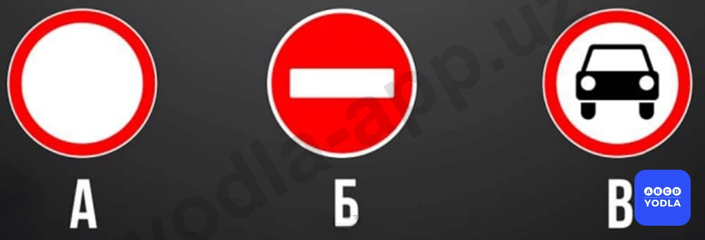

⬜ A. Только «А»
⬜ B. Только «Б»
✅ C. Только «А» и «B»
⬜ D. Все

> 💡 Знаки «Движение запрещено» и 3.3 «Движение механических транспортных средств запрещено» не распространяются на транспортные средства, обслуживающие граждан, проживающих или работающих в зоне действия знака, а также принадлежащие им. В таких случаях транспортные средства должны въезжать или выезжать через ближайший к месту назначения перекрёсток. Следовательно, правильным ответом будет А и В.

---

## Вопрос 35

**Продолжить буксировку можно:**

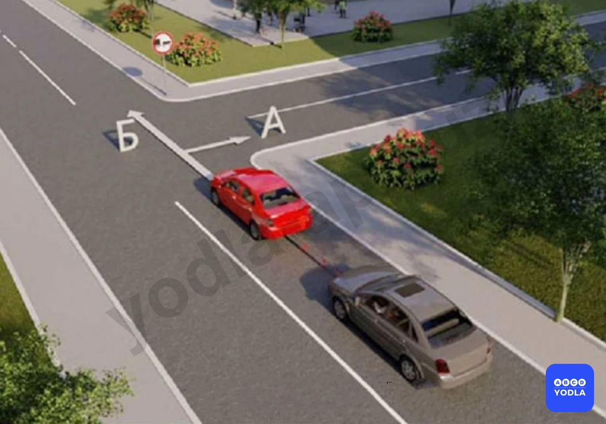

✅ A. Только в направлении «А»
⬜ B. Только в направлении «Б»
⬜ C. В любом из указанных направлений

> 💡 «Движение с прицепом запрещено». Запрещается движение грузовых автомобилей и тракторов с любыми видами прицепов, а также буксировка механических транспортных средств. Поэтому разрешено движение только в направлении А.

---

## Вопрос 36

**Какой знак запрещает дальнейшее движение всех без исключения транспортных средств?**

⬜ A. «А»
✅ B. «Б»
⬜ C. «В»

> 💡 «Опасность» без исключения запрещает движение всех транспортных средств, то есть ни одно транспортное средство не имеет права продолжать движение. Этот знак устанавливается при возникновении опасной ситуации на дороге или в случае пожара.

---

## Вопрос 37

**Разрешается ли Вам осуществить посадку (высадку) пассажиров либо загрузку (разгрузку) транспортного средства в зоне действия этого знака?**

✅ A. Да
⬜ B. Нет

> 💡 В зоне действия данного знака разрешается посадка и высадка пассажиров, поскольку знак «Стоянка запрещена» запрещает только длительное прекращение движения транспортного средства. Кратковременная остановка, в том числе для посадки или высадки пассажиров, допускается.

---

## Вопрос 38

**Какой из перечисленных дорожных знаков отменяет все ограничения, ранее введенные запрещающими знаками?**

✅ A. В
⬜ B. А и Б
⬜ C. В и Г
⬜ D. Все

> 💡 Дорожный знак 3.31 «Конец всех ограничений». Данный знак, обозначенный буквой В, отменяет действие всех ранее введённых ограничений.

---

## Вопрос 39

**Какой из этих знаков не запрещает проезд до места жительства или работы?**

⬜ A. А
⬜ B. В
✅ C. С
⬜ D. В и С

> 💡 Действие данного знака не распространяется на транспортные средства, принадлежащие гражданам, проживающим или работающим в данной зоне. Кроме того, въезд разрешается транспортным средствам, обслуживающим этих граждан.

---

## Вопрос 40

**Какой знак называется «Движение транспортных средств, перевозящих опасные грузы, запрещено»?**

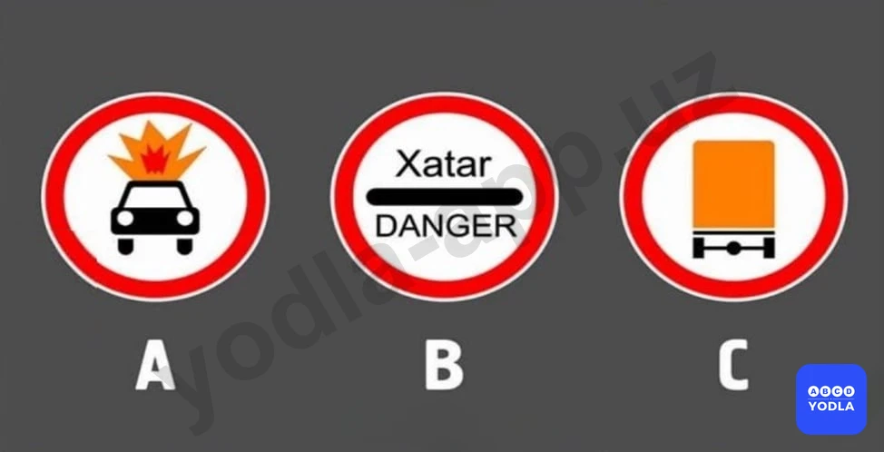

⬜ A. А
⬜ B. В
✅ C. С

> 💡 Знак в варианте С обозначает, что движение транспортных средств, перевозящих опасные грузы, запрещено.

---

## Вопрос 41

**Проезд каких транспортных средств без остановки запрещается данным знаком?**

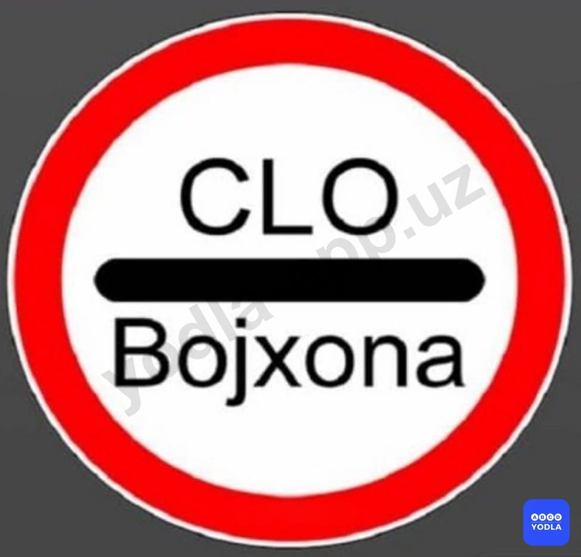

⬜ A. Грузовые автомобили
⬜ B. Легковые автомобили
✅ C. Все виды транспортных средств

> 💡 Дорожный знак «Таможня» запрещает проезд транспортных средств без остановки на таможенном пункте. Водители обязаны остановиться по требованию сотрудника таможенной службы.

---

## Вопрос 42

**Укажите знаки связанные с обгоном?**

⬜ A. А ва Б
⬜ B. Б и С
✅ C. А и С

> 💡 Знак Б обозначает затор (дорожную пробку). Знаки А и C относятся к дорожным знакам, связанным с обгоном.

---

## Вопрос 43

**Какие знаки обозначают конец зоны запрещения обгона грузовых автомобилей?**

⬜ A. А
⬜ B. Б
⬜ C. А и Б
✅ D. А, Б, В

> 💡 Знак А распространяется на все транспортные средства. Знак Б относится к грузовым автомобилям. Знак В отменяет действие всех ранее введённых запрещающих ограничений.

---

## Вопрос 44

**С какой целью применяется этот дорожный знак?**

⬜ A. Для принудительного снижения скорости движения.
✅ B. Движение без остановки запрещается
⬜ C. Для принятия мер предосторожности

> 💡 Данный дорожный знак запрещает проезд без остановки и устанавливается перед таможенными пунктами. Водители обязаны остановиться на таможенном посту.

---

## Вопрос 45

**Что означает этот дорожный знак?**

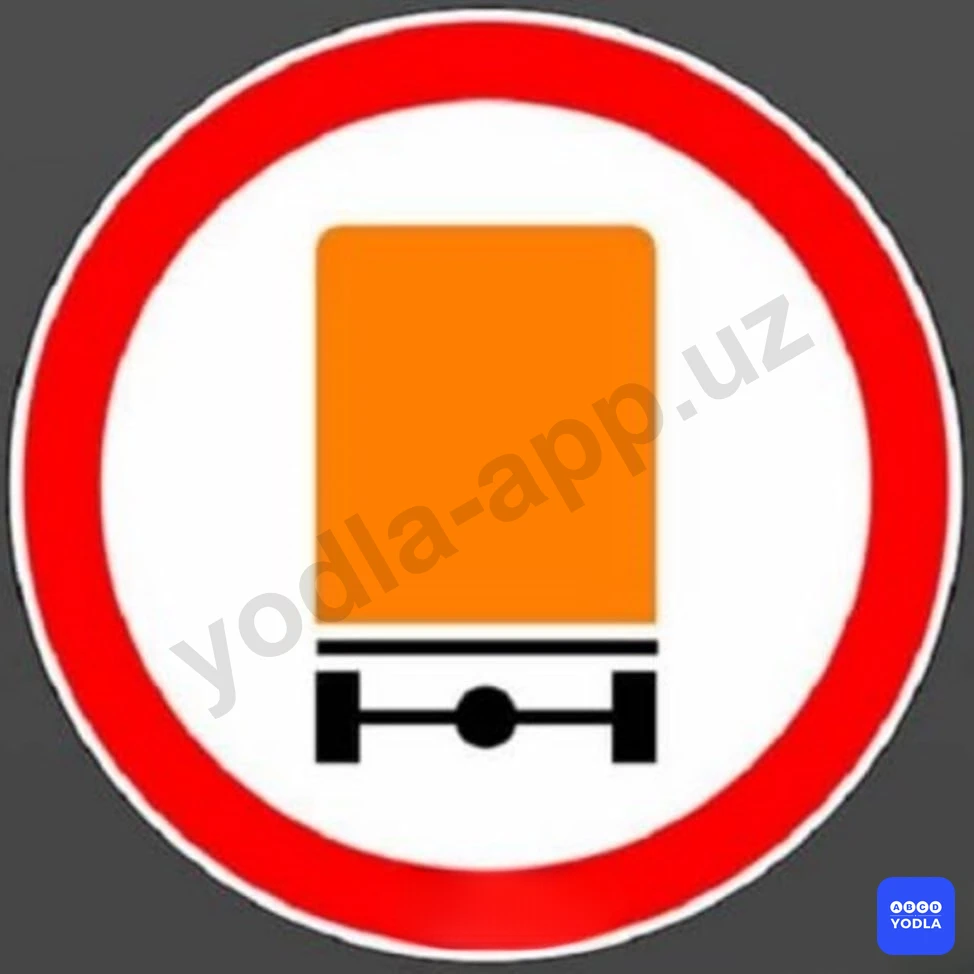

✅ A. Запрещает движение транспортных средств, перевозящих опасные грузы.
⬜ B. Запрещает движение транспортных средств, перевозящих тяжелые грузы
⬜ C. Запрещает движение транспортных средств, перевозящих взрывоопасные и легковоспламеняющиеся грузы

> 💡 Данный дорожный знак устанавливается для запрещения движения транспортных средств, перевозящих опасные грузы.

---

## Вопрос 46

**Движение каких транспортных средств запрещает этот дорожный знак?**

⬜ A. Автомобили с разрешённой полной массой более 3,5 тонн
✅ B. Движение транспортных средств, перевозящих опасные грузы
⬜ C. Все ответы верны

> 💡 При наличии данного дорожного знака движение грузовых автомобилей, перевозящих опасные грузы, запрещается.

---

## Вопрос 47

**В каких направлениях разрешено движение водителю грузового автомобиля?**

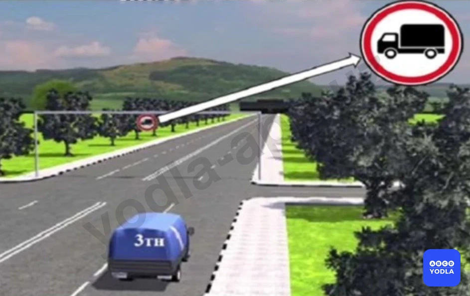

✅ A. Направо и прямо
⬜ B. Направо и налево
⬜ C. Только направо
⬜ D. На все направления

> 💡 Дорожный знак 3.14 «Движение грузовых автомобилей с разрешённой максимальной массой более 3,5 т запрещено» распространяется на грузовые автомобили с разрешённой максимальной массой свыше 3,5 тонн. Поскольку разрешённая максимальная масса нашего автомобиля составляет 3 тонны, действие данного знака на него не распространяется, и движение разрешено.

---

## Вопрос 48

**Как называется этот дорожный знак?**

✅ A. Движение транспортного средства, перевозящего опасные грузы, запрещено
⬜ B. Перевозка крупногабаритных грузов запрещена
⬜ C. Обгон грузовых автомобилей запрещен

> 💡 При наличии данного дорожного знака движение грузовых автомобилей, перевозящих опасные грузы, запрещается.

---

## Вопрос 49

**Какие из этих указанных знаков не действует на легковые немаршрутные такси при посадке — высадке пассажиров (погрузке — выгрузке грузов)?**

⬜ A. Только A
⬜ B. Только B
⬜ C. Только B,C,D
✅ D. Все

> 💡 В зоне действия всех этих знаков такси разрешается производить посадку и высадку пассажиров. Поскольку кратковременная остановка для посадки или высадки пассажиров не считается стоянкой.

---

## Вопрос 50

**Какой из указанных знаков требует обязательной остановки на нерегулируемых перекрестках?**

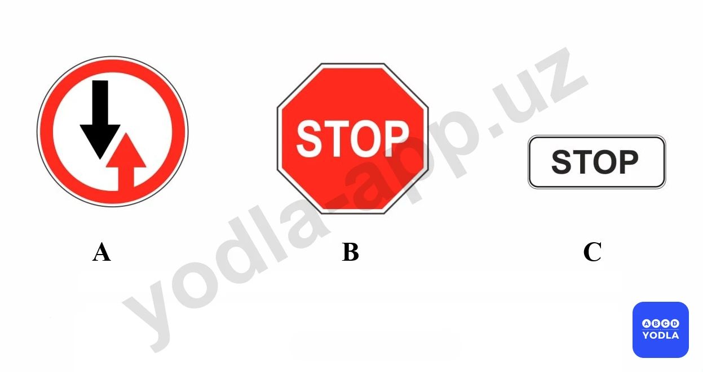

⬜ A. Только A
✅ B. Только B
⬜ C. B и C
⬜ D. Все

> 💡 На нерегулируемом перекрёстке данный знак требует от водителя обязательной остановки. Водитель должен остановиться перед стоп-линией, а при её отсутствии — перед краем пересекаемой проезжей части.

---

## Вопрос 51

**Требования каких знаков из указанных вступают в силу непосредственно в том месте, где они установлены?**

⬜ A. Только B
✅ B. А и В
⬜ C. Все

> 💡 Итак, в вопросе спрашивается, требования каких из указанных знаков вступают в силу непосредственно с места их установки. Знак А действует с места установки на протяжении следующих 100 метров, следовательно, он начинает действовать сразу. Знак Б также действует с места установки до ближайшего перекрёстка, то есть его требование тоже вступает в силу немедленно. Знак С начинает действовать только через 200 метров, поэтому он не относится к знакам, действие которых начинается непосредственно с места установки. Следовательно, правильный ответ — А и Б.

---

## Вопрос 52

**Этот дорожный знак:**

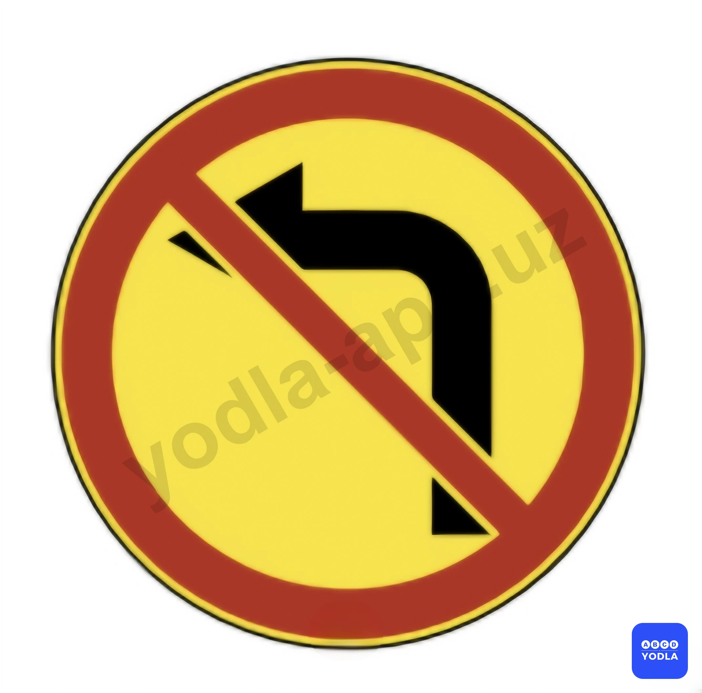

⬜ A. Постоянный знак
✅ B. Временный знак
⬜ C. Сезонный знак

> 💡 Данный дорожный знак является временным дорожным знаком. Если фон внутри знака имеет жёлтый цвет, это означает, что знак является временным. Такие знаки обычно устанавливаются в местах проведения дорожных работ или в случаях, когда необходимо временно изменить организацию дорожного движения.

---

## Вопрос 53

**Этот дорожный знак:**

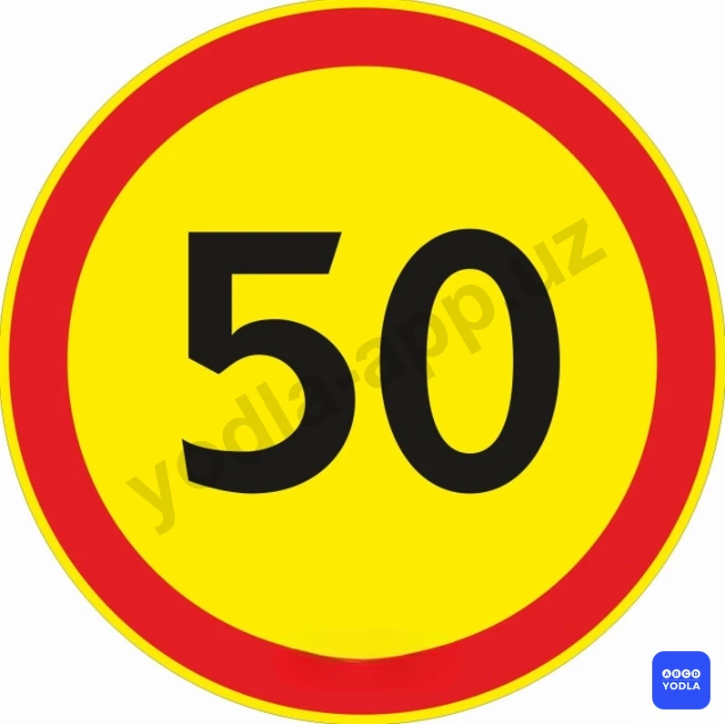

⬜ A. Является постоянным знаком
✅ B. Является временным знаком
⬜ C. Является сезонным знаком

> 💡 Данный дорожный знак также является временным дорожным знаком, поскольку его фон имеет жёлтый цвет.

---

## Вопрос 54

**Разрешено ли движение легкового автомобиля с прицепом в месте, где установлен этот знак?**

⬜ A. Разрешается, если масса прицепа не более 750 кг
✅ B. Разрешается
⬜ C. Запрещается

> 💡 Данный дорожный знак означает «Движение с прицепом запрещено». Он запрещает движение грузовых автомобилей с прицепами, а также буксировку механических транспортных средств. Однако это ограничение не распространяется на легковые автомобили, движущиеся с прицепом. Поэтому, если в вопросе спрашивается, разрешено ли движение легкового автомобиля с прицепом, правильный ответ — разрешено.

---

## Вопрос 55

**На каком знаки можно остановиться в четные дни месяца?**

⬜ A. На левом рисунке
⬜ B. На правом рисунке
✅ C. На обеих рисунке можно

> 💡 Итак, в вопросе спрашивается, при каком знаке разрешена остановка в чётные дни месяца. Обратите внимание: речь идёт именно об остановке, а не о стоянке. Не следует путать эти понятия. Поэтому в данном случае остановка разрешена при обоих знаках.

---

## Вопрос 56

**Как называется этот знак?**

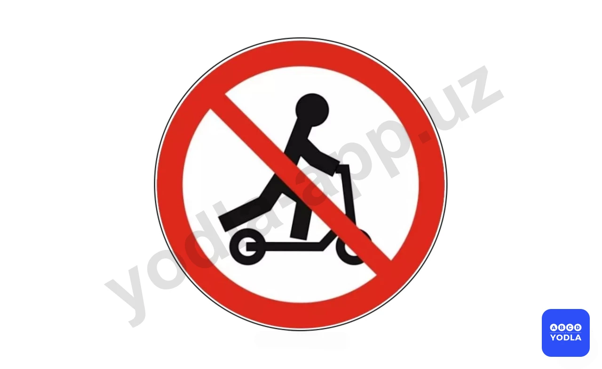

⬜ A. Движение пешеходов запрещено
✅ B. Движение индивидуальным транспортным средствам запрещено
⬜ C. Пребывание детей запрещено
⬜ D. Все указанные ответы являются правильными.

> 💡 Данный знак называется «Движение средств индивидуальной мобильности запрещено». Он запрещает движение средств индивидуальной мобильности, то есть электросамокатов и других аналогичных средств передвижения.

---

## Вопрос 57

**Какой дорожный знак разрешает разворот?**

✅ A. 1 и 2
⬜ B. 2 и 3
⬜ C. все

> 💡 В вопросе спрашивается, какие дорожные знаки разрешают разворот. Третий знак означает «Разворот запрещён». Следовательно, в зоне его действия разворот выполнять нельзя. Поэтому правильный ответ — 1 и 2.

---

## Вопрос 58

**Разрешено ли жёлтому автомобилю выполнять обгон в указанном месте?**

✅ A. Разрешено
⬜ B. Запрещено

> 💡 В данной ситуации водителю жёлтого автомобиля разрешается выполнить обгон. Несмотря на действие дорожного знака «Обгон запрещён», разрешается обгон одиночного транспортного средства, движущегося со скоростью менее 40 км/ч.

---

## Вопрос 59

**На каких направлениях разрешается разворот красному автомобилю?**

⬜ A. На первом направлении
⬜ B. На втором направлении
✅ C. На обоих направлениях разворот запрещён

> 💡 В данной ситуации разворот запрещён в обоих направлениях. Наличие разделительной полосы не влияет на действие знака 3.19 «Разворот запрещён». То есть независимо от того, есть разделительная полоса или нет, выполнять разворот запрещается.
Однако в случае со знаком 3.18.2 «Поворот налево запрещён» наличие разделительной полосы может иметь значение. Если на дороге имеется разделительная полоса, этот знак запрещает поворот налево только на первую проезжую часть. Поэтому въезд на вторую проезжую часть может быть разрешён.
Следовательно, при наличии знака 3.19 «Разворот запрещён» разворот запрещается независимо от наличия или отсутствия разделительной полосы.

---

## Вопрос 60

**На выезда с прилегающих территорий или в местах пересечения (примыкания) дороги с полевыми, лесными и другими дорогами, не предназначенными для постоянного движения и проезда, если перед ними не установлены соответствующие знаки, утрачивается ли действие этих знаков?**

⬜ A. Утрачивается
✅ B. Не утрачивается

> 💡 Как видно, вопрос сформулирован очень длинно. В таких случаях важно выделить ключевые слова. Например, достаточно обратить внимание на фразу «в местах выезда с прилегающих территорий».
Суть вопроса заключается в следующем: прекращается ли действие запрещающих знаков в местах выезда с прилегающих территорий, а также в местах пересечения с полевыми, лесными и другими дорогами, не предназначенными для сквозного движения, если перед ними не установлены соответствующие знаки?
Ответ: нет, не прекращается. Такие места не считаются перекрёстками. Если не указано иное, зона действия запрещающих знаков продолжается до ближайшего перекрёстка.
Следовательно, в местах выезда с прилегающих территорий, а также на пересечениях с полевыми и лесными дорогами действие этих знаков не прекращается.

---

## Вопрос 61

**По каким направлениям водителю синего автомобиля запрещено движение?**

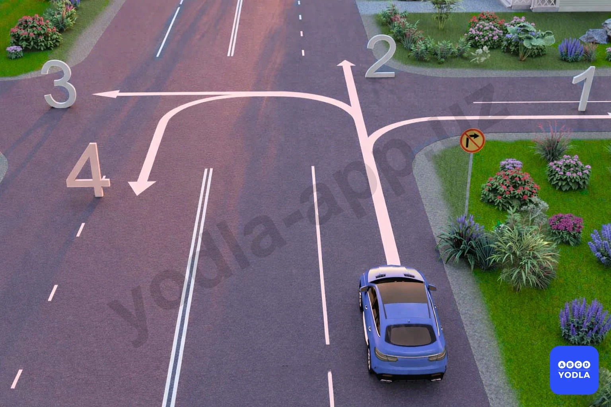

⬜ A. Только по направлению 1
⬜ B. Только по направлению 2
✅ C. По направлениям 1, 3 и 4
⬜ D. По всем направлениям

> 💡 Внимательно прочитайте вопрос. В нём спрашивается, в каком направлении водителю синего автомобиля движение не разрешается. Многие ошибочно читают вопрос как «в каком направлении разрешается движение».
В данной ситуации движение прямо разрешено. Однако поворот направо запрещён, поскольку действует временный дорожный знак. Кроме того, автомобиль движется по правой полосе, поэтому движение по третьему и четвёртому направлениям также не разрешается.
Следовательно, правильный ответ — первое и третье направления, то есть движение в этих направлениях запрещено.

---

## Вопрос 62

**Какие категории автотранспортных средств могут двигаться в зоне действия данного знака?**

✅ A. Чистые
⬜ B. Средние
⬜ C. Загрязняющие

> 💡 На основании пункта 3.35 Приложения 1 к ПДД: 3.35. На территории экологической зоны запрещено движение автотранспортных средств, имеющих «среднюю» и «вредную» экологические категории.
Знак 3.35 устанавливается на расстоянии 150 – 300 метров до въезда в экологическую зону.

---

