# 08. Предписывающие знаки (боб 1.4)

Всего вопросов: 31

## Вопрос 1

**По каким направлениям из числа обозначенных стрелками разрешается движение?**

⬜ A. Только по направлению « А »
⬜ B. Только по направлению « Б »
⬜ C. Только по направлению « В »
✅ D. Только по направлению « А » и « Г »
⬜ E. Только по направлению « Г »

> 💡 Итак, в вопросе спрашивается, в каких направлениях разрешено движение. В данной ситуации действует знак 4.1.1 «Движение прямо».
Этот знак предписывает водителю на перекрёстке двигаться только прямо. Однако он не запрещает поворот направо на прилегающие территории, такие как автозаправочные станции, жилые кварталы, парковки и другие подобные объекты.
Следовательно, на перекрёстке поворот направо запрещён, но въезд на прилегающие территории разрешается. Поэтому правильный ответ — А и Г.

---

## Вопрос 2

**В каких направлениях разрешено движение?**

⬜ A. Только « Б »
⬜ B. Только « А »
✅ C. « А » и « Б »
⬜ D. « А », « Б », « В » и « Г »
⬜ E. « А », « Б » и « В »

> 💡 В данном случае также установлен знак «Движение прямо». Этот знак предписывает движение прямо на перекрёстке, однако не запрещает поворот направо на прилегающую территорию. Поэтому водителю разрешается двигаться прямо и поворачивать направо на прилегающую территорию. Следовательно, правильный ответ — А и Б.

---

## Вопрос 3

**Какой знак называется « Объезд препятствия слева »?**

⬜ A. 1
⬜ B. 2
✅ C. 3
⬜ D. 4
⬜ E. 5

> 💡 В вопросе о знаке «Объезд препятствия слева» многие ошибочно выбирают пятый вариант ответа. Однако правильным является третий вариант.
Такой знак обычно устанавливается на разделительных островках, бордюрах или других участках дороги, где имеется препятствие. В зависимости от знака водитель обязан объехать препятствие с указанной стороны. Чаще всего используется знак «Объезд препятствия справа», но при проведении дорожных работ или в других ситуациях может быть установлен знак «Объезд препятствия слева».
Следовательно, знаки, предписывающие объезд препятствия с определённой стороны, относятся к предписывающим знакам, и в данном вопросе правильным является третий вариант ответа.

---

## Вопрос 4

**Укажите разрешенные направления движения:**

⬜ A. Только « А »
⬜ B. Только « Б »
⬜ C. Только « В »
✅ D. « А и « Б »
⬜ E. « Б и « В »

> 💡 В данной ситуации предписывающий знак «Движение прямо» требует от водителя двигаться только прямо на перекрёстке. Однако, как уже отмечалось ранее, этот знак не запрещает поворот направо на прилегающую территорию. Поэтому движение в направлениях А и Б разрешено.
Кроме того, здесь установлен знак 3.31 «Конец всех ограничений». Обратите внимание, что знак 3.31 отменяет действие только запрещающих знаков, но не распространяется на предписывающие знаки.
Следовательно, знак 3.31 не отменяет требование знака «Движение прямо». Поэтому движение в направлении В запрещено, а в направлениях А и Б движение разрешается.
Вывод: знак 3.31 «Конец всех ограничений» отменяет действие только запрещающих знаков, но не влияет на действие предписывающих знаков.

---

## Вопрос 5

**Этот дорожный знак:**

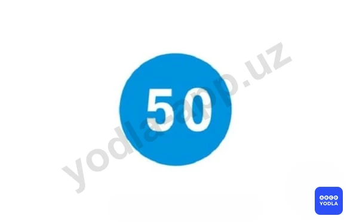

✅ A. Разрешает движение только с указанной или большей скоростью
⬜ B. Запрещает движение со скоростью; превышающей указанную на знаке
⬜ C. Указывает скорость; с которой рекомендуется движение на данном участке дороги

> 💡 Данный дорожный знак означает, что транспортным средствам разрешается движение с указанной на знаке скоростью или выше. Следовательно, движение со скоростью ниже указанной запрещается.

---

## Вопрос 6

**Какой знак запрещает движение со скоростью менее 50 км/час?**

⬜ A. 1
⬜ B. 2
✅ C. 3
⬜ D. 4
⬜ E. 5

> 💡 Итак, в вопросе спрашивается, какой знак запрещает движение со скоростью менее 50 км/ч. Это означает, что транспортное средство не может двигаться со скоростью ниже 50 км/ч, то есть должно двигаться со скоростью 50 км/ч или выше.
Такое требование устанавливает предписывающий знак «Минимальная скорость движения». Этот знак имеет форму синего круга.
Следовательно, правильный ответ — третий знак.

---

## Вопрос 7

**Какой знак указывает обязательное направление движения на перекрестке?**

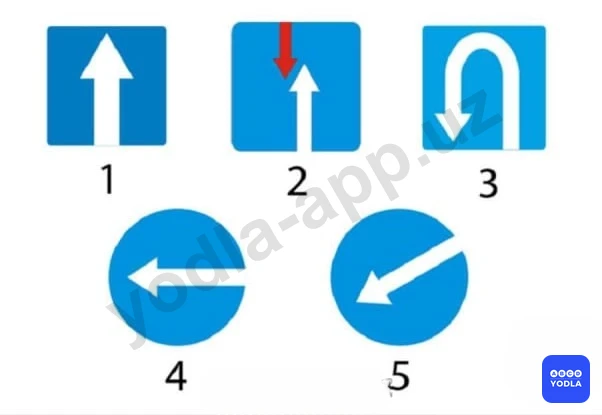

⬜ A. 1
⬜ B. 2
⬜ C. 3
✅ D. 4
⬜ E. 5

> 💡 Итак, в вопросе требуется указать знак, обозначающий обязательное направление движения на перекрёстке. Такой знак указывает водителю, в каком направлении он обязан двигаться на перекрёстке. Поэтому правильный ответ — четвёртый вариант.

---

## Вопрос 8

**При этом знаке разрешено движение:**

⬜ A. Только водителю автомобиля
⬜ B. Только водителям автомобиля и мотоцикла
✅ C. Водителям всех транспортных средств
⬜ D. Только водителям автомобиля и автобуса

> 💡 Данный знак называется «Движение легковых автомобилей». Однако он распространяется не только на легковые автомобили, но и разрешает движение некоторых других транспортных средств.
В зоне действия этого знака разрешается движение:
Легковых автомобилей;
Мотоциклов;
Автобусов;
Грузовых автомобилей с разрешённой максимальной массой не более 3,5 тонн;
Маршрутных транспортных средств.
Следовательно, ошибочно считать, что данный знак относится только к легковым автомобилям. Он разрешает движение всем перечисленным категориям транспортных средств.

---

## Вопрос 9

**На каком рисунке показано правильное направление движения?**

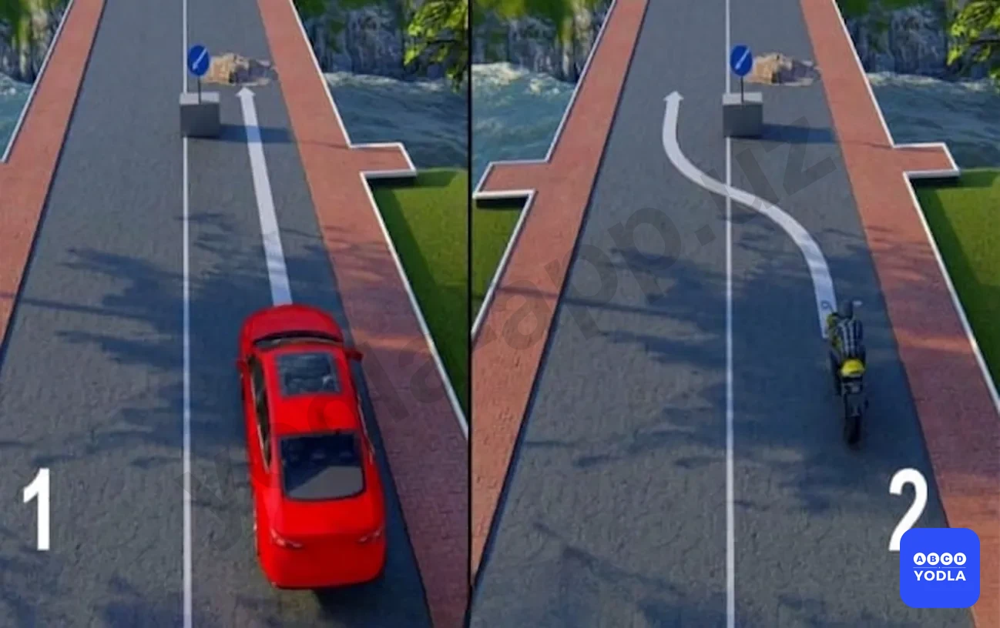

⬜ A. На первом
✅ B. На втором
⬜ C. На обоих

> 💡 В вопросе спрашивается, на каком изображении показано правильное направление движения. В данной ситуации водитель должен объехать препятствие слева. Как видно, данный предписывающий знак требует объезда препятствия именно с левой стороны. Поэтому правильный ответ — второе изображение.

---

## Вопрос 10

**Разрешается ли на этом перекрестке повернуть налево?**

✅ A. Разрешается
⬜ B. Запрещается

> 💡 Знак 4.1.1. «Движение прямо» раздела 4, приложения № 1 ПДД, разрешается движение только прямо. Действие знака распространяется на пересечение проезжих частей, перед которым установлен знак.

---

## Вопрос 11

**В каких направлениях Вам можно продолжить движение?**

⬜ A. Только направо
⬜ B. Налево и в обратном направлении
✅ C. Направо, налево и в обратном направлении

> 💡 Итак, в вопросе спрашивается, в каких направлениях разрешено продолжить движение. Как видно, дорожный знак указывает на возможность движения направо и налево.
Этот предписывающий знак разрешает водителю поворот направо, поворот налево и разворот. При этом движение прямо запрещается.
Следовательно, правильный ответ — разрешено движение направо, налево и разворот.

---

## Вопрос 12

**Кто из водителей, совершающих поворот, нарушает Правила?**

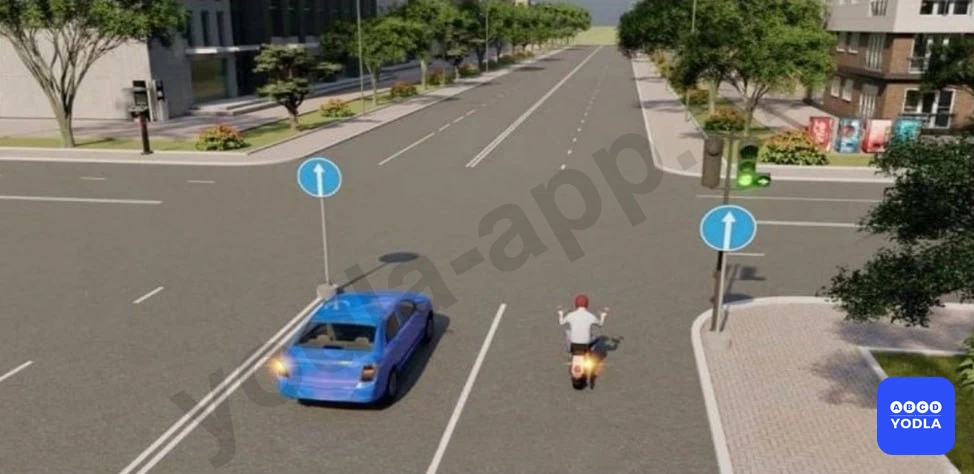

⬜ A. Только водитель легкового автомобиля
⬜ B. Только мотоциклист
✅ C. Оба нарушают

> 💡 Как видно из ситуации, водитель мотоцикла собирается повернуть направо, а водитель легкового автомобиля — повернуть налево.
Легковому автомобилю поворот налево запрещён, поскольку установленный дорожный знак не разрешает такой манёвр.
Водителю мотоцикла может показаться, что дополнительная секция светофора разрешает поворот. Однако он также не имеет права выполнять манёвр, так как для него действует знак «Движение прямо».
Следовательно, оба водителя выполняют поворот с нарушением Правил дорожного движения.
Вывод: правильный ответ — оба водителя нарушают правила.

---

## Вопрос 13

**Какой из знаков обозначает пешеходную дорожку?**

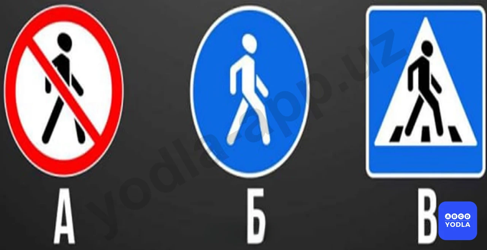

✅ A. Только «Б»
⬜ B. Только «Б» и «В»
⬜ C. Все знаки

> 💡 Знак «Пешеходная дорожка» имеет форму синего круга. Он обозначает дорожку, предназначенную для движения пешеходов.
Синий прямоугольный знак обозначает «Пешеходный переход».
Если знак с изображением пешехода выполнен в виде круга с красной каймой, это означает «Движение пешеходов запрещено».
Таким образом, знак «Пешеходная дорожка» представляет собой синий круглый знак.

---

## Вопрос 14

**Какие знаки обязывают водителя грузового автомобиля с разрешенной максимальной массой до 3,5 т. повернуть направо?**

⬜ A. Только «А»
✅ B. Только «Б»
⬜ C. «А» и «Б»
⬜ D. «Б» и «В»

> 💡 Внимательно прочитайте вопрос. В конце вопроса используется слово «предписывает». Это означает, что речь идёт именно о предписывающих дорожных знаках.
Знаки А и В относятся к информационно-указательным знакам. Они информируют водителя, указывают направление движения или организуют движение, но не предписывают обязательные действия.
Некоторые знаки могут сообщать о запрете поворота налево или указывать направление, однако они не являются предписывающими.
Поэтому, если в вопросе спрашивается, какой знак предписывает определённое действие, то правильный ответ — знак Б, так как именно он относится к предписывающим дорожным знакам.

---

## Вопрос 15

**Какой знак обозначает велосипедную дорожку?**

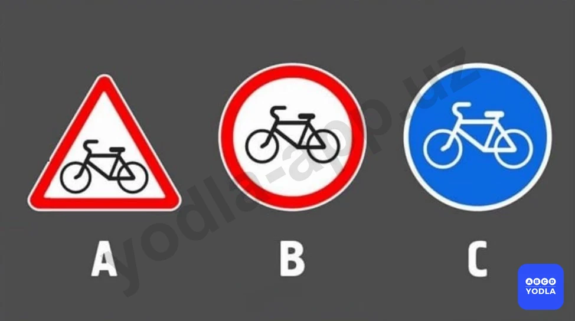

⬜ A. А
⬜ B. В
✅ C. С

> 💡 Если в вопросе спрашивается о знаке «Пешеходная дорожка», то правильным ответом будет знак С. Этот знак имеет синюю круглую форму и обозначает дорожку, предназначенную для движения пешеходов.
Знак А обозначает «Пересечение с пешеходной дорожкой».
Знак В означает «Движение пешеходов запрещено».
Следовательно, знак С обозначает «Пешеходную дорожку».

---

## Вопрос 16

**Какой знак указывает на то, что объезд препятствия разрешен с правой или левой стороны?**

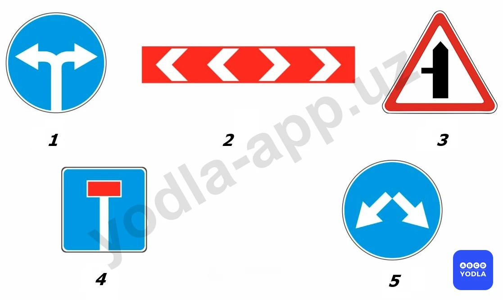

⬜ A. 1
⬜ B. 2
⬜ C. 3
⬜ D. 4
✅ E. 5

> 💡 Если в вопросе спрашивается об объезде препятствия справа или слева, то правильным ответом будет пятый предписывающий знак. Пятый знак обозначает объезд препятствия справа или слева.

---

## Вопрос 17

**Какой из перечисленных знаков называется движением легковых автомобилей?**

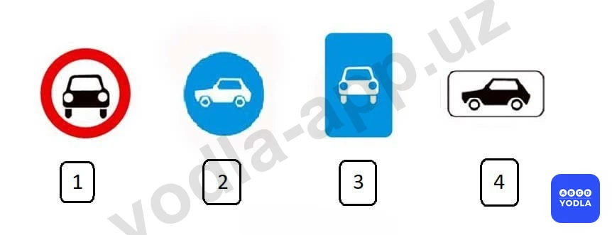

⬜ A. 1
✅ B. 2
⬜ C. 3
⬜ D. 4

> 💡 Итак, знак «Движение легковых автомобилей» относится к группе предписывающих знаков и в данном случае является вторым знаком. Этот знак называется «Движение легковых автомобилей».
Первый знак обозначает, что движение механических транспортных средств запрещено.
Второй знак — движение легковых автомобилей.
Третий знак обозначает дорогу, предназначенную для автомобилей.
Четвёртый знак является знаком дополнительной информации и применяется только совместно с другими знаками, отдельно не устанавливается.
Следовательно, правильный ответ — второй вариант.

---

## Вопрос 18

**В каком направлении движение запрещено?**

⬜ A. Только направо
⬜ B. Направо, налево и в обратном направлении
⬜ C. Налево и в обратном направлении
✅ D. Только прямо

> 💡 Таким образом, данный дорожный знак разрешает поворот направо, поворот налево и разворот, однако запрещает движение прямо.

---

## Вопрос 19

**В каких направлениях, обозначенных стрелкам разрешено движение?**

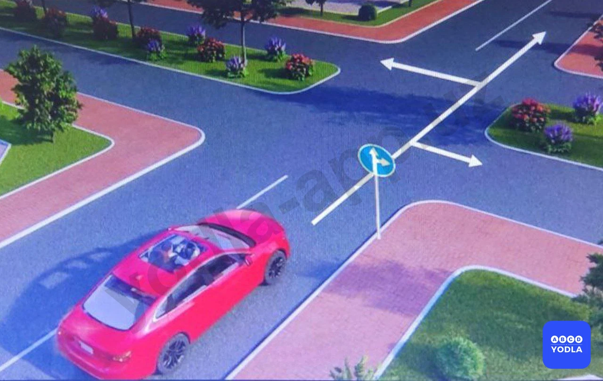

⬜ A. Только прямо
⬜ B. Только направо
⬜ C. Только налево
⬜ D. Только прямо и направо
✅ E. Во всех направлениях

> 💡 Таким образом, если на дороге имеется разделительная полоса, то при наличии знака, разрешающего движение прямо, допускается также поворот налево. Следовательно, если знак разрешает движение прямо и напра��о, то разрешается движение прямо, поворот направо и поворот налево. Поскольку посередине дороги имеется разделительная полоса, правильный ответ — движение разрешено во всех направлениях.

---

## Вопрос 20

**Разрешен ли разворот в указанной**

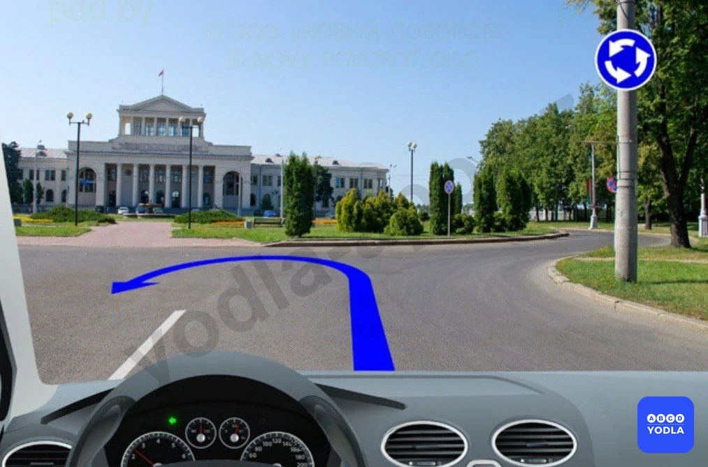

✅ A. Запрещается
⬜ B. Разрешается

> 💡 Таким образом, в данном месте разворот запрещён. Водитель не может выполнить разворот непосредственно здесь. Для изменения направления движения ему необходимо воспользоваться круговым движением или объехать перекрёсток.

---

## Вопрос 21

**В каком из направлений Вам разрешено движение в изображенной ситуации?**

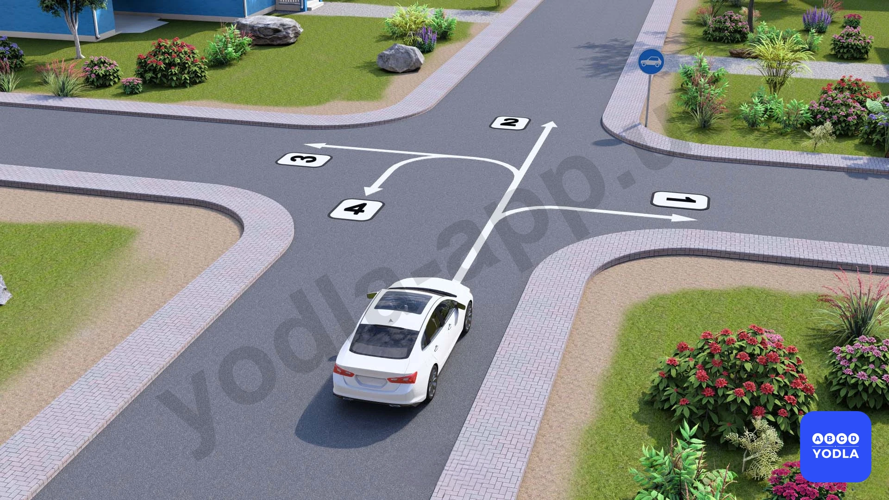

⬜ A. В направлении 1, 3 или 4
⬜ B. В направлении 1, 2 или 3
⬜ C. В направлении 1 или 4
✅ D. В любом направлении

> 💡 Таким образом, в данной ситуации установлен знак «Движение легковых автомобилей». Этот знак не вводит дополнительных ограничений по направлениям движения. Поэтому разрешается движение прямо, поворот направо, поворот налево и разворот. Следовательно, движение разрешено во всех направлениях.

---

## Вопрос 22

**Разрешен ли поворот налево на этом перекрестке?**

✅ A. Разрешается
⬜ B. Запрещается

> 💡 Если в вопросе спрашивается, разрешён ли поворот налево, то правильный ответ — да. Как видно на изображении, посередине дороги имеется разделительная полоса, пусть даже небольшая.
Знак 4.1.1 «Движение прямо» действует в отношении первой проезжей части, отделённой разделительной полосой. После пересечения первой проезжей части действие данного знака на следующую проезжую часть не распространяется.
Следовательно, при въезде на вторую проезжую часть поворот налево разрешается. Поэтому в данной ситуации поворот налево допускается.

---

## Вопрос 23

**Водителю какого автомобиля нарушил правило повернув во двор?**

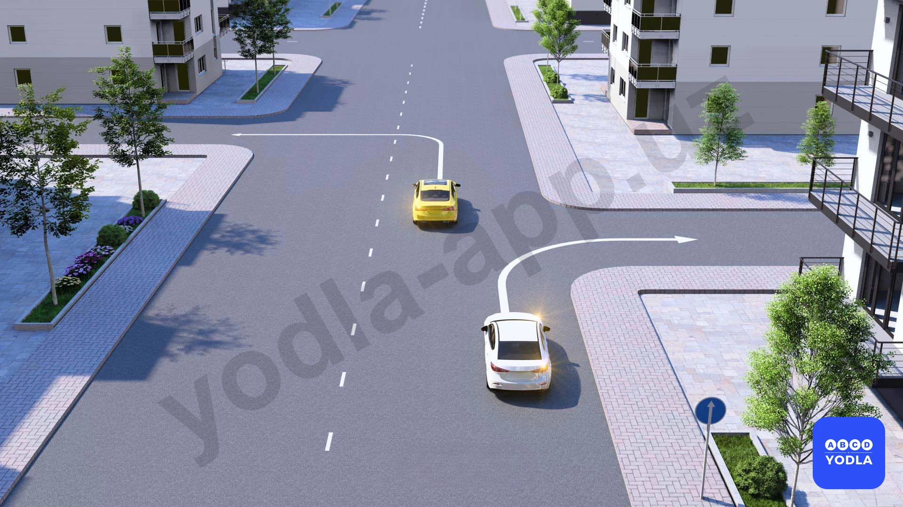

⬜ A. Только водитель белого автомобиля
✅ B. Только водитель жёлтого автомобиля
⬜ C. Никто не нарушил
⬜ D. Оба нарушили

> 💡 Итак, в вопросе спрашивается, какой водитель нарушил правила, повернув во двор. Как видно на рисунке, здесь установлен знак 4.1.1 «Движение прямо». Этот знак предписывает движение прямо на перекрёстке.
Однако данный знак не запрещает поворот направо на прилегающую территорию (во двор). Поэтому въезд во двор справа не является нарушением.
Как видно на изображении, водитель жёлтого автомобиля, поворачивающий налево, нарушает требования данного знака. Следовательно, нарушителем является водитель жёлтого автомобиля.

---

## Вопрос 24

**В каких направлениях разрешено движение согласно указателям (знакам)?**

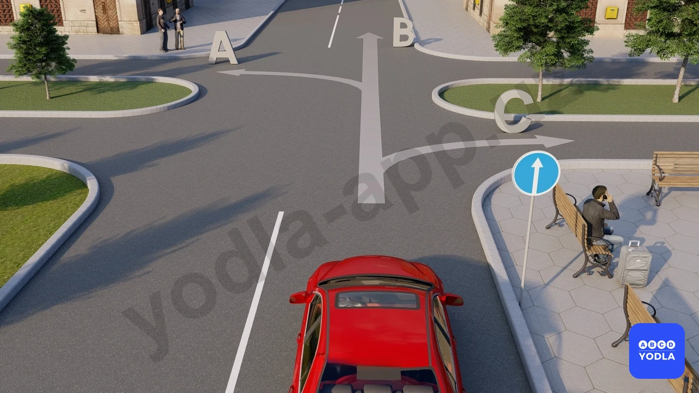

⬜ A. Только прямо
⬜ B. Только направо
⬜ C. Только налево
✅ D. Только прямо и налево
⬜ E. Во всех направлениях

> 💡 Таким об��азом, в данной ситуации установлен знак 4.1.1 «Движение прямо». Кроме того, посередине дороги имеется разделительная полоса.
Поэтому действие данного знака распространяется на первую проезжую часть. После пересечения первой проезжей части знак теряет своё действие в отношении второй проезжей части.
Следовательно, водителю разрешается движение прямо и поворот налево. Таким образом, правильный ответ — прямо и налево.

---

## Вопрос 25

**По каким направлениям водителю автомобиля разрешено движение?**

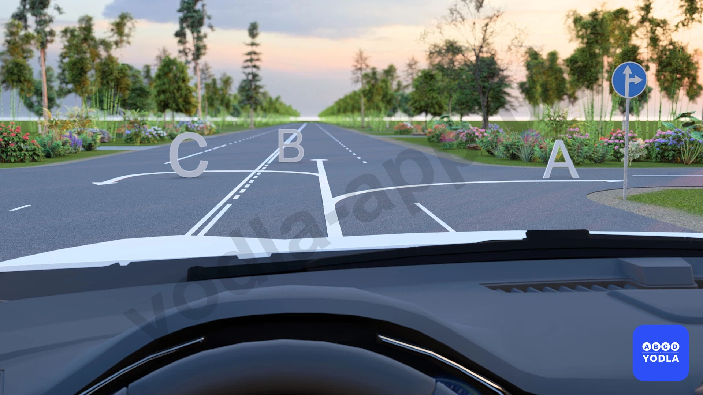

⬜ A. Только A и B
✅ B. Только B
⬜ C. Только A
⬜ D. По всем

> 💡 Как видно, водитель движется по второй полосе движения. Дорожный знак разрешает движение прямо и направо, однако необходимо учитывать направление движения по каждой полосе.
Поскольку водитель находится во второй полосе, он не может двигаться в направлении А (направо), так как это направление предназначено для другой полосы.
Движение в направлении Б, то есть прямо, разрешено.
Движение в направлении С (налево) запрещено, поскольку дорожный знак не разрешает поворот налево.
Следовательно, правильный ответ — только направление Б, то есть движение прямо.

---

## Вопрос 26

**В каком направлении разрешён разворот?**

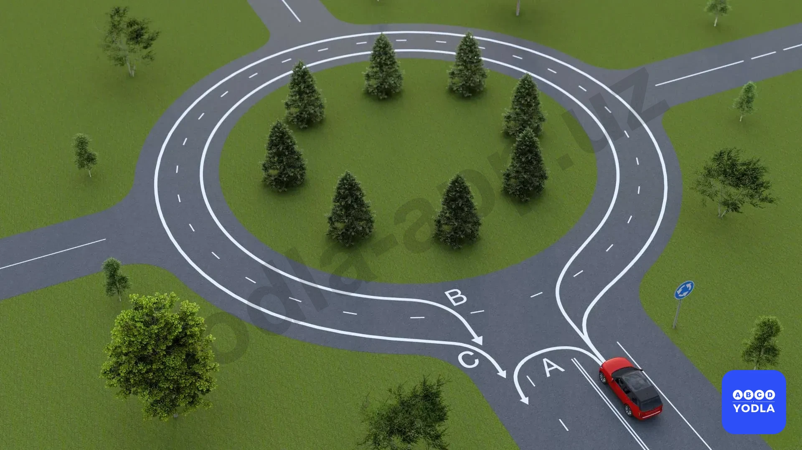

⬜ A. Только A и C
✅ B. Только C
⬜ C. Только B
⬜ D. Все направления

> 💡 Итак, в вопросе спрашивается, в каком направлении разрешён разворот.
Разворот в направлении А запрещён.
Разворот в направлении Б также запрещён, поскольку, как уже отмечалось, при выезде с кругового движения водитель должен занимать крайнюю правую полосу.
Разворот в направлении С разрешён, так как в этом случае транспортное средство покидает круговое движение с правой полосы.
Следует помнить, что при въезде на круговое движение водитель может занять любую полосу, однако выезжать с него необходимо только с крайней правой полосы.
Следовательно, правильный ответ — направление С.

---

## Вопрос 27

**В каком ответе правильно указано имя персонажа?**

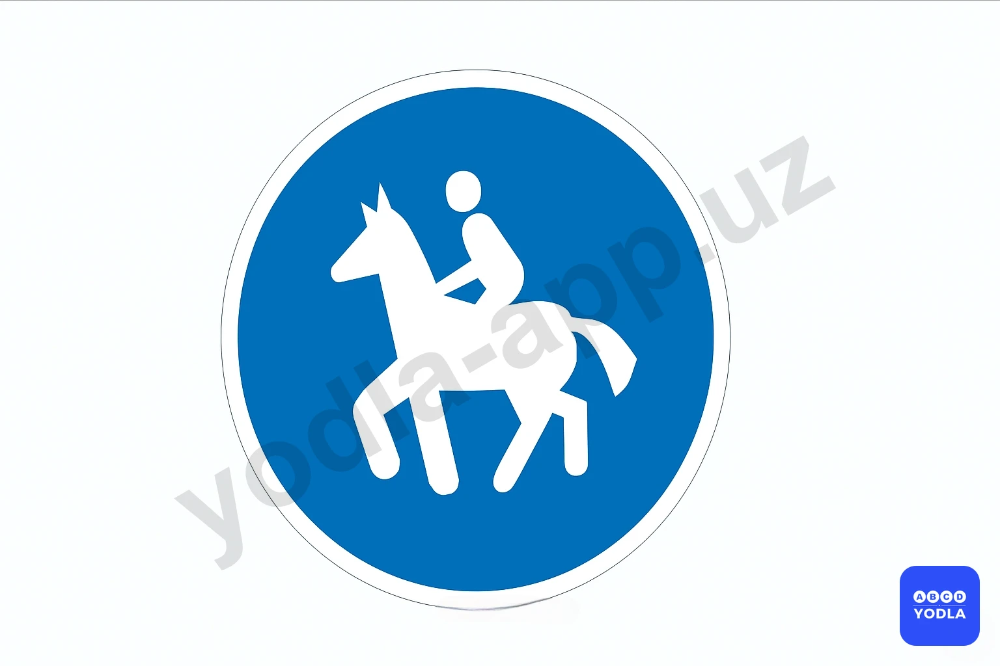

✅ A. Конная тропа
⬜ B. Езда на лошади
⬜ C. Верховая езда запрещена

> 💡 Этот знак обозначает дорогу для верховой езды. Он указывает путь, предназначенный для движения всадников.

---

## Вопрос 28

**Какое транспортное средство поворачивает направо правильно?**

⬜ A. Мотоцикл
⬜ B. Жёлтый и зелёный автомобиль
✅ C. Белый автомобиль
⬜ D. Все поворачивают правильно

> 💡 Как видно, в данной ситуации только водитель белого автомобиля правильно выполняет поворот направо.
Водитель жёлтого автомобиля поворачивает направо со второй полосы движения, что является нарушением правил.
Водитель мотоцикла движется по полосе, предназначенной только для движения прямо, однако выполняет поворот направо, что также недопустимо.
Водитель зелёного автомобиля тоже поворачивает направо со второй полосы, что является нарушением.
Согласно правилам, поворот направо должен выполняться только с крайней правой полосы и при максимально возможном приближении к правому краю проезжей части.
Следовательно, правильный ответ — только водитель белого автомобиля выполняет поворот направо правильно.

---

## Вопрос 29

**По какому направлению разрешено движение?**

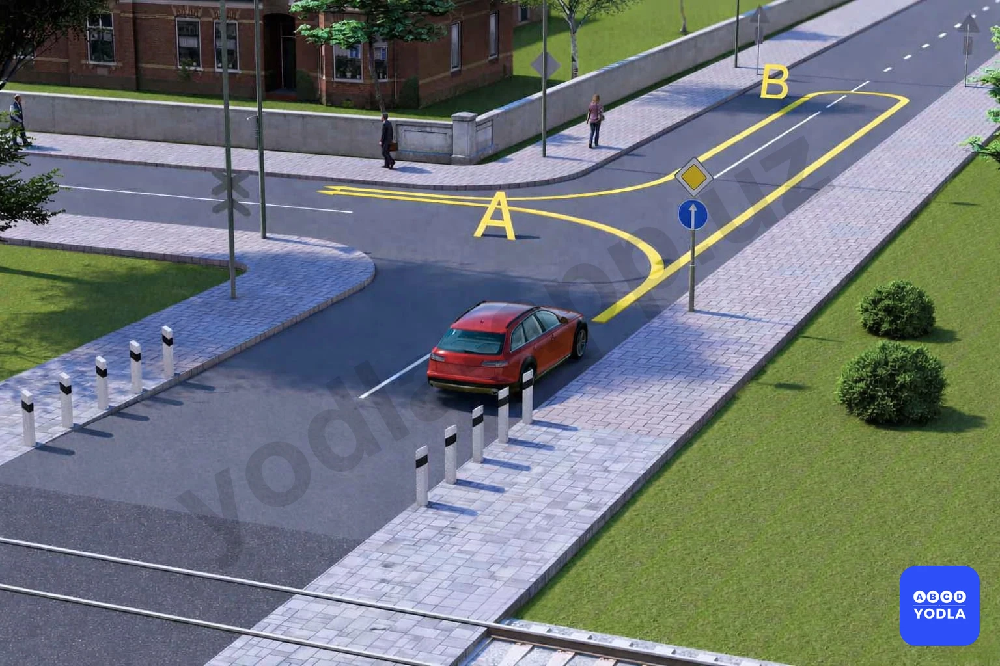

⬜ A. Только «А»
✅ B. Только «B»
⬜ C. Возможно в обоих направлениях
⬜ D. Запрещено в обоих направлениях

> 💡 Таким образом, дорожный знак 4.1.1 «Движение прямо» предписывает водителю двигаться только прямо и действует до первого перекрёстка.
Поэтому в направлении А поворот налево запрещён, так как такой манёвр противоречит требованиям знака.
В направлении Б, после проезда перекрёстка и окончания зоны действия знака, водитель может выполнить разворот и въехать на данную улицу по направлению Б.
Следовательно, правильный ответ — направление Б.

---

## Вопрос 30

**В данной ситуации кто проедет последним?**

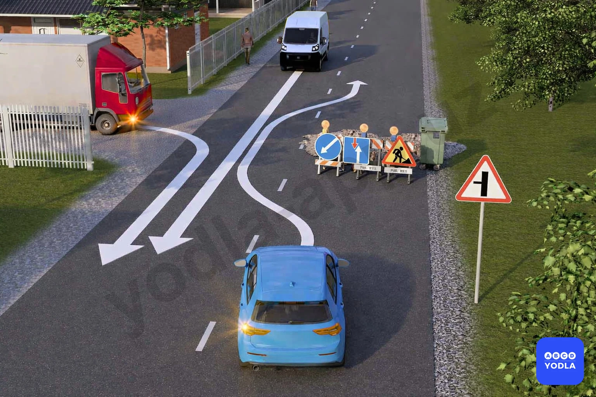

✅ A. Красный автомобиль
⬜ B. Синий автомобиль
⬜ C. Проедут по взаимной договорённости
⬜ D. Белый автомобиль

> 💡 В данной ситуации в вопросе спрашивается, кто проедет последним. Поскольку водитель красного автомобиля выезжает с прилегающей территории, он обязан уступить дорогу другим участникам движения. Поэтому именно он проедет последним.
Следовательно, правильный ответ — водитель красного автомобиля проедет последним.

---

## Вопрос 31

**В каких направлениях разрешено движение синий автомобилю?**

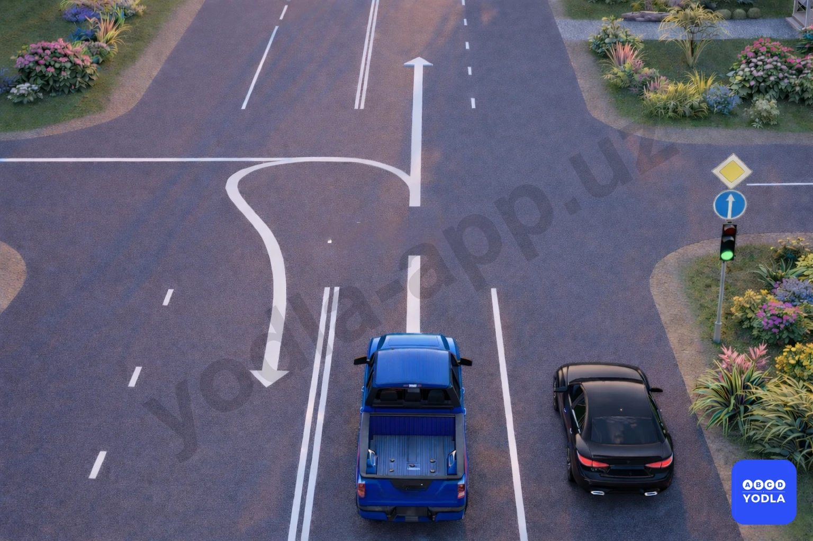

✅ A. Только прямо
⬜ B. Прямо и налево
⬜ C. Прямо и с разворотом
⬜ D. Во всех направлениях

> 💡 Вопрос заключается в том, в каких направлениях разрешено движение синему автомобилю. Как видно, здесь установлен дорожный знак 4.1.1 «Движение прямо».
Согласно требованиям данного знака, синий автомобиль может двигаться только прямо. Поворот налево и разворот запрещены.
Следовательно, правильный ответ — разрешено движение только прямо.

---

