# 09. Информационно-указательные знаки (боб 1.5)

Всего вопросов: 60

## Вопрос 1

**Какой знак указывает место; с которого на данной дороге утрачивают силу требования правил; устанав­ливающие порядок движения в населенных пунктах?**

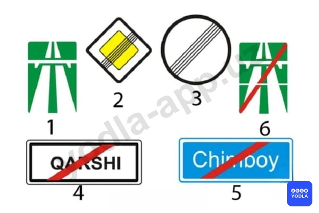

⬜ A. 1
⬜ B. 2
⬜ C. 3
✅ D. 4
⬜ E. 5

> 💡 Если в вопросе спрашивается, какой знак указывает на прекращение действия требований Правил дорожного движения, действующих в населённых пунктах, то правильным ответом является четвёртый знак. Этот знак обозначает конец населённого пункта и отменяет требования, связанные с режимом движения в населённых пунктах.

---

## Вопрос 2

**В каком ответе правильно указано разрешенное направление движения?**

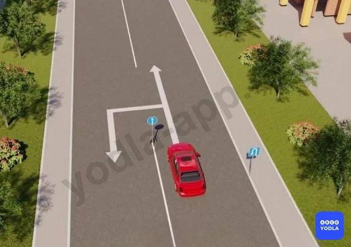

⬜ A. Только разворот
⬜ B. Тўғрига ва орқага бурилиш
✅ C. Только прямо

> 💡 В данной ситуации установлены как постоянный дорожный знак, так и временный дорожный знак. Постоянный знак устанавливает одно требование, а временный знак предписывает движение только прямо.
Если требования временных и постоянных дорожных знаков противоречат друг другу, водители обязаны руководствоваться требованиями временных дорожных знаков.
Следовательно, в данной ситуации разрешается движение только прямо.

---

## Вопрос 3

**Какой из указанных знаков информирует участников движения что; на данном участке дороги установлены специальные технические средства автоматизированные фото и видео фиксации?**

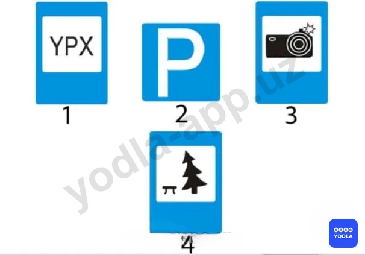

⬜ A. 1
⬜ B. 2
✅ C. 3
⬜ D. 4

> 💡 Если в вопросе спрашивается, какой дорожный знак информирует об установке автоматических средств фото- и видеофиксации, то правильным ответом будет третий знак. Этот знак предупреждает водителей о том, что на данном участке дороги установлены автоматические средства фото- и видеофиксации нарушений.

---

## Вопрос 4

**Какие из этих знаков называются «Выезд на дорогу с односторонним движением»?**

✅ A. Первый и пятый
⬜ B. Третий и пятый
⬜ C. Второй и четвертый

> 💡 Знаки, обозначающие выезд на дорогу с односторонним движением, — это первый и пятый дорожные знаки. Они информируют водителя о выезде на дорогу, где организовано одностороннее движение.
Второй дорожный знак является знаком «Дорога с односторонним движением» и указывает, что движение транспортных средств осуществляется только в одном направлении.

---

## Вопрос 5

**Что обозначает этот знак?**

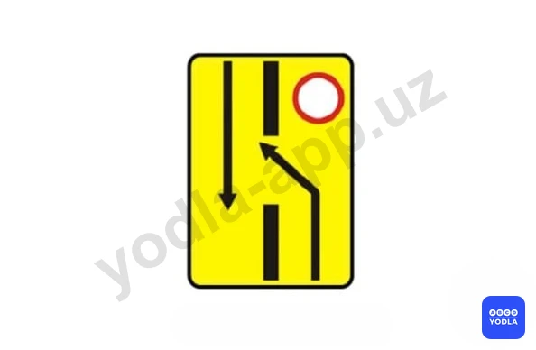

⬜ A. Предварит��льный указатель объезда препятствий
✅ B. Предварительный указатель перестроения на другую проезжую часть
⬜ C. Предварительный указатель выезда на полосу встречного движения

> 💡 Данный дорожный знак называется «Предварительный указатель перестроения на другую проезжую часть».
Обратите внимание, что толстая линия в центре знака указывает на наличие разделительной полосы. Если на дороге имеется разделительная полоса, это означает, что дорога состоит из двух отдельных проезжих частей.
Следовательно, этот знак заранее информирует водителей о необходимости перестроения на другую проезжую часть.
Таким образом, правильный ответ — «Предварительный указатель перестроения на другую проезжую часть».

---

## Вопрос 6

**Этот знак разрешает движение автомобиля:**

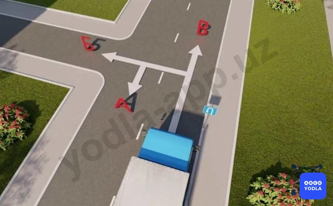

⬜ A. Во всех направлениях
⬜ B. «Б» и «В»
✅ C. «А» и «В»

> 💡 Этот знак обозначает «Место для разворота». Он разрешает выполнение разворота, однако запрещает поворот налево.
Следовательно, водитель может двигаться в направлениях А и В, но не может двигаться в направлении Б, то есть поворачивать налево.
Таким образом, правильный ответ — направления А и В.

---

## Вопрос 7

**Что обозначает этот знак?**

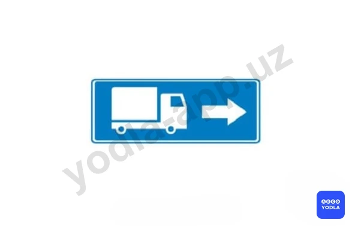

⬜ A. . Обязательное направление движения грузовых автомобилей, полная масса которых более 3,5т
⬜ B. Направление движения только для грузовых автомобилей
✅ C. Рекомендуемое направление движения для грузовых автомобилей, тракторов и самоходных машин, если на перекрестке их движение в одном из направлений запрещено
⬜ D. Направление движения грузовых автомобилей; осуществляющих междугородние перевозки

> 💡 Этот знак обозначает рекомендуемое направление движения для грузовых автомобилей на перекрёстке. Он рекомендует грузовым автомобилям двигаться направо, однако не является обязательным, а носит рекомендательный характер. Если водителю необходимо двигаться налево или он хорошо знает местность, он может повернуть налево или выполнить разворот, поскольку этот знак не запрещает такие манёвры. Обычно этот знак применяется в случаях, когда на прямом направлении для грузовых автомобилей имеется ограничение или препятствие, и водителям предлагается альтернативный маршрут. Он рекомендует, с какой стороны лучше объехать препятствие. Ключевым словом в вопросе является выражение рекомендуемое направление движения. Следовательно, данный знак обозначает рекомендуемое направление движения. Правильный ответ — третий вариант.

---

## Вопрос 8

**В каких направлениях разрешено продолжить движение на перекрестке?**

✅ A. Только «Г» и «Е»
⬜ B. «А», «Б», «Г», «Д»
⬜ C. «Б», «В», «Г», «Д»

> 💡 На перекрёстке установлен дорожный знак 5.8.1, который показывает, из какой полосы движения разрешено двигаться в определённых направлениях. Первая полоса предназначена только для поворота направо, а вторая полоса — только для движения прямо. Следовательно, движение разрешено в направлениях Г и Е.

---

## Вопрос 9

**В каком направлении разрешается движение грузовому автомобилю?**

⬜ A. Только направо
✅ B. Направо, налево и в обратном направлении
⬜ C. 3.Только налево

> 💡 Таким образом, для грузовых автомобилей движение прямо невозможно. Направо указано рекомендуемое направление движения. Поскольку дорога в прямом направлении закрыта, если мы едем по этому маршруту впервые и не знаем объездного пути, нам рекомендуется двигаться направо и воспользоваться объездом. Однако, если мы хорошо знаем эту местность или проживаем здесь, данный знак не запрещает поворот налево. Следовательно, в данной ситуации движение прямо запрещено, а поворот направо, поворот налево и разворот разрешаются.

---

## Вопрос 10

**На каком рисунке водитель совершил маневр не нарушая требований правил?**

✅ A. 1
⬜ B. 2
⬜ C. 3

> 💡 Рассмотрим каждое изображение отдельно. На первом изображении, несмотря на наличие знака "Движение прямо", разрешается поворот направо на прилегающую территорию, например во двор или жилой квартал. Нарушения правил здесь нет. На втором изображении водитель поворачивает налево, что противоречит требованиям дорожного знака и является нарушением. На третьем изображении установлен прямоугольный знак, обозначающий дорогу с односторонним движением. Водитель выполняет разворот и начинает движение во встречном направлении. На дороге с односторонним движением движение во встречном направлении запрещено. Следовательно, в данном случае также имеет место нарушение правил.

---

## Вопрос 11

**Что обозначает этот дорожный знак?**

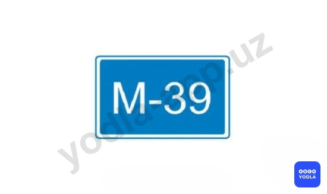

✅ A. Указывает номер (маршрут) дороги
⬜ B. Указывает расстояние до ближайшего
⬜ C. Указывает расстояние до ближайшего
⬜ D. Дублирует «Километровый знак»

> 💡 Этот дорожный знак указывает номер маршрута дороги.

---

## Вопрос 12

**В каких направлениях; обозначенных стрелками разрешено движение?**

✅ A. «А»
⬜ B. «Б»
⬜ C. «А» и «Б»

> 💡 При наличии знака места для разворота разрешается только разворот. Данный дорожный знак запрещает поворот налево.

---

## Вопрос 13

**Какие из указанных знаков устанавливаются на автомагистралях?**

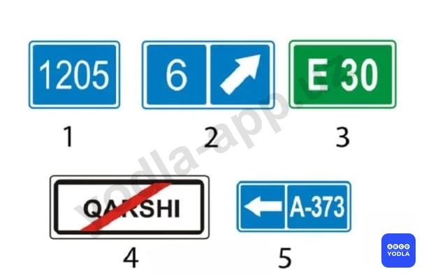

⬜ A. 1
⬜ B. 2
✅ C. 3
⬜ D. 4
⬜ E. 5

> 💡 Дорожные знаки, устанавливаемые на автомагистралях, всегда имеют зелёный фон. Следовательно, в данном случае правильным ответом является знак Е-30.

---

## Вопрос 14

**Какой из знаков указывает знак направление объезда закрытого для движения участка проезжей части на дороге с разделительной полосой?**

⬜ A. 1
⬜ B. 2
⬜ C. 3
⬜ D. 4
✅ E. 5

> 💡 Таким образом, знак, указывающий путь объезда закрытой проезжей части на дороге с разделительной полосой, является пятым знаком. Следовательно, правильный ответ — пятый вариант.

---

## Вопрос 15

**Разрешается ли автобусу движение по дороге, на которой установлен этот знак?**

⬜ A. Разрешается только автомобилю, разрешенная максимальная масса которого не более 3,5т
⬜ B. Запрещается
✅ C. Разрешается

> 💡 Этот дорожный знак обозначает дорогу для автомобилей. В зоне действия данного знака разрешается движение автобусов, мотоциклов и автомобилей. Следовательно, если в вопросе спрашивается, разрешено ли движение автобуса в месте установки этого знака, правильный ответ — разрешено.

---

## Вопрос 16

**Какой знак указывает участок дороги с односторонним движением?**

⬜ A. 1
⬜ B. 2
✅ C. 3
⬜ D. 4
⬜ E. 5

> 💡 В данном случае знак, обозначающий дорогу с односторонним движением, является третьим знаком. Следовательно, правильный ответ — третий знак.

---

## Вопрос 17

**Как должен поступить водитель, если его транспортное средство не может продолжить движении на подъем со скоростью равной или большей 40 км/ч?**

⬜ A. Продолжать движение по основной полосе, если за ним нет других транспортных средств
✅ B. Перестроиться на дополнительную полосу
⬜ C. Продолжать движение по основной полосе, если длина подъема не превышает 30 м

> 💡 Как видно, основная полоса движения предназначена для транспортных средств, движущихся со скоростью 40 км/ч и выше. Если транспортное средство не может развивать скорость 40 км/ч или движется с меньшей скоростью, водитель обязан перестроиться на дополнительную полосу движения. Данный дорожный знак указывает на необходимость перестроения на дополнительную полосу.

---

## Вопрос 18

**О чем вас информирует данный знак?**

✅ A. О месте остановки автобуса и троллейбуса
⬜ B. О запрете движения по правой полосе всем транспортным средствам кроме маршрутных

> 💡 Вопрос заключается в том, какую информацию предоставляет данный знак. Этот знак информирует о наличии остановочного пункта маршрутных транспортных средств. То есть он обозначает место остановки автобуса или троллейбуса.

---

## Вопрос 19

**Этот дорожный знак обозначает:**

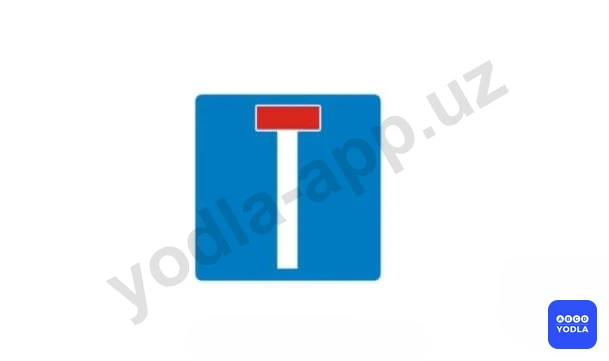

✅ A. Дорога ведет в тупик
⬜ B. Направление движения к объекту в населенном пункте
⬜ C. Конец дополнительной полосы на подъеме или полосы разгона

> 💡 Этот дорожный знак обозначает дорогу, ведущую в тупик.

---

## Вопрос 20

**В каком направлении разрешено движение?**

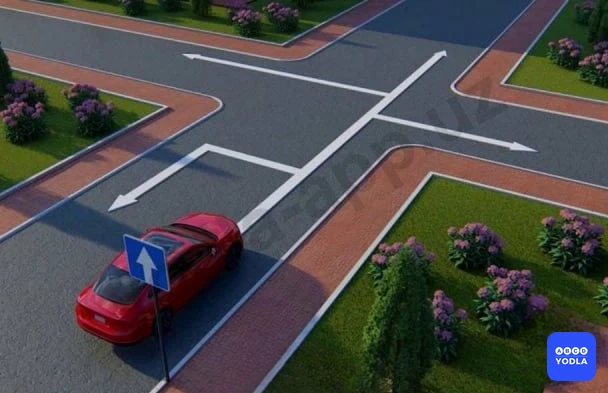

⬜ A. Только прямо
⬜ B. Прямо и направо
✅ C. Прямо, направо и налево
⬜ D. Во всех направлениях

> 💡 Если в вопросе спрашивается, в каких направлениях разрешено движение, необходимо учитывать указанные направления на дорожном знаке. Знак показывает, куда можно двигаться прямо, направо и налево. Поскольку на дороге с односторонним движением данные направления не запрещены, разрешается движение направо, налево и прямо. Следовательно, правильный ответ — направо, налево и прямо.

---

## Вопрос 21

**Какой знак указывает расстояние до начала или конца дороги?**

✅ A. 1
⬜ B. 2
⬜ C. 3
⬜ D. 4
⬜ E. 5

> 💡 Дорожный знак, указывающий расстояние от начала дороги или до её конца, является знаком 6.13. Этот знак называется километровым указателем и показывает расстояние от начала дороги или до её окончания. Обычно он устанавливается через каждый километр.

---

## Вопрос 22

**Что означает вставка на синем фоне с наименованием населенного пункта на этом знаке?**

✅ A. Данный объект находится вне этого населенного пункта и движение к нему осуществляется не по автомагистрали
⬜ B. К указанному населенному пункту будет осуществляться движение по автомагистрали
⬜ C. Указанный объект находится в данном населенном пункте

> 💡 Если данный дорожный знак выполнен на синем фоне, это означает, что он указывает направление по дороге, не являющейся автомагистралью. Иными словами, знак показывает маршрут по обычной трассе. Следовательно, правильный ответ заключается в том, что указанный объект находится вне населённого пункта, а добраться до него можно по дороге, не относящейся к автомагистрали.

---

## Вопрос 23

**Какой знак называется "Конец дороги с односторонним движением"?**

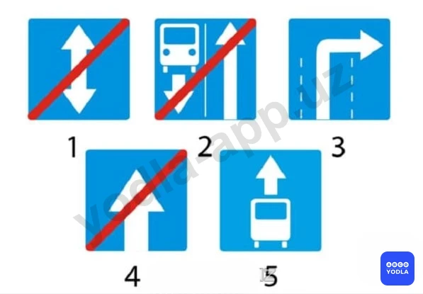

⬜ A. 1
⬜ B. 2
⬜ C. 3
✅ D. 4
⬜ E. 5

> 💡 Знак, обозначающий конец дороги с односторонним движением, в данном случае является четвёртым знаком. Следовательно, правильный ответ — четвёртый знак.

---

## Вопрос 24

**Каким транспортным средствам разрешено движение по дороге; на которой установлен этот знак?**

⬜ A. Механическим транспортным средствам
⬜ B. Всем транспортным средствам
✅ C. Автомобилям, автобусам и мотоциклам
⬜ D. Транспортным средствам; максимальная скорость которых не менее 40 км/ч

> 💡 Знак, обозначающий конец дороги с односторонним движением, в данном случае является четвёртым знаком. Следовательно, правильный ответ — четвёртый знак.

---

## Вопрос 25

**Какие из этих знаков устанавливают в начале дороги с односторонним движением?**

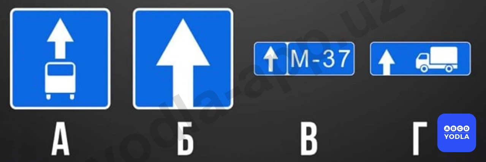

⬜ A. Только «А»
✅ B. Только «Б»
⬜ C. «Б» и «Г»
⬜ D. «Б» и «Г»

> 💡 Вопрос заключается в том, какой из данных знаков устанавливается в начале дороги с односторонним движением. В данном случае правильным ответом является знак Б. Этот знак обозначает начало дороги с односторонним движением.

---

## Вопрос 26

**Какой из указанных знаков информирует о начале дороги с реверсивным движением?**

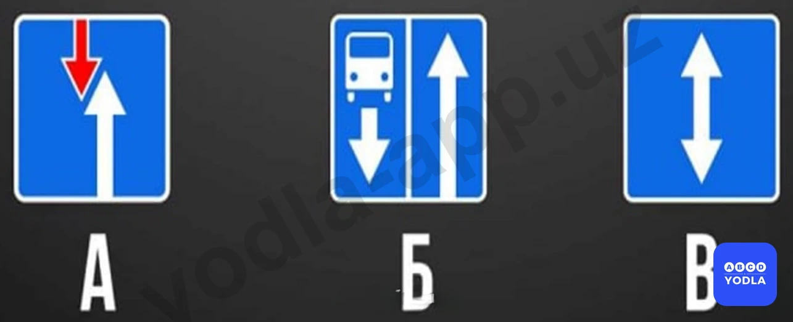

⬜ A. «А»
⬜ B. «Б»
✅ C. «В»

> 💡 Знак В является знаком, информирующим о начале реверсивного движения. Он сообщает водителям о начале участка дороги с реверсивным движением.

---

## Вопрос 27

**Этот знак указывает, что:**

⬜ A. Вы должны повернуть направо или налево
✅ B. На пересекаемой дороге организовано реверсивное движение
⬜ C. Вправо и влево от перекрестка организовано одностороннее движение

> 💡 Этот дорожный знак информирует о выезде на дорогу с реверсивным движением.

---

## Вопрос 28

**Какие знаки запрещают поворот налево?**

⬜ A. Только «А»
⬜ B. Только «А» и «Б»
✅ C. Только «А» и «Г»
⬜ D. Все

> 💡 Вопрос заключается в том, какие дорожные знаки запрещают поворот налево. Среди представленных знаков знак А запрещает поворот налево. Знак Г также запрещает поворот налево. В случае со знаком А движение разрешено только направо, поэтому поворот налево невозможен. При знаке Г поворот налево приводит к выезду на полосу, предназначенную для маршрутных транспортных средств, поэтому такой манёвр также запрещён. Следовательно, правильный ответ — А и Г.

---

## Вопрос 29

**Какие знаки разрешают выполнить разворот?**

⬜ A. Только  «Б»
⬜ B. Только «Б» и «Г»
⬜ C. Только «А», «Б» и «В»
✅ D. Все

> 💡 Во всех представленных случаях разворот разрешён. Ни один из указанных дорожных знаков не запрещает выполнение разворота.

---

## Вопрос 30

**Где начинают действовать требования Правил, относящиеся к населённым пунктам?**

✅ A. Только с места установки дорожного знака с названием населённого пункта на белом фоне 5.22
⬜ B. С места установки дорожного знака с названием населённого пункта на белом 5.22 или синем фоне 5.24
⬜ C. В начале застроенной территории, непосредственно прилегающей к дороге

> 💡 Правила дорожного движения, действующие в населённых пунктах, начинают применяться с места установки дорожного знака 5.22 с названием населённого пункта на белом фоне. Следовательно, именно с этого знака вступают в силу правила, установленные для населённых пунктов.

---

## Вопрос 31

**Какой знак указывает на дорогу для въезда в аварийных случаях?**

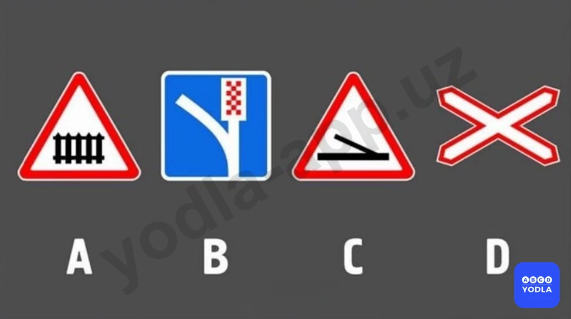

⬜ A. А и D
✅ B. В
⬜ C. С

> 💡 Если в вопросе спрашивается, какой знак обозначает въезд для аварийных ситуаций, то правильным ответом является знак В. Этот знак указывает путь въезда, предназначенный для использования в чрезвычайных и аварийных ситуациях.

---

## Вопрос 32

**Какой знак указывает место остановки транспортных средств при запрещающем сигнале светофора (регулировщика)?**

⬜ A. А
⬜ B. Б
✅ C. В
⬜ D. Г

> 💡 Вопрос заключается в том, какой знак обозначает место остановки транспортных средств при запрещающем сигнале светофора. Таким местом является стоп-линия. В данном случае знак, обозначающий стоп-линию, соответствует варианту В. Следовательно, правильный ответ — В. Многие путают варианты Б и В, однако если варианты указаны кириллическими буквами А, Б, В, Г, то следует выбирать именно вариант В.

---

## Вопрос 33

**Какой из этих знаков указывает на начало участка дороги, на котором возможно изменение направления движения в противоположную сторону?**

⬜ A. А
⬜ B. Б
✅ C. В

> 💡 Вопрос заключается в том, какой знак обозначает начало участка дороги, на котором направление движения по одной или нескольким полосам может изменяться на противоположное. Такая ситуация возникает при реверсивном движении. На реверсивной дороге направление движения по отдельным полосам может изменяться в зависимости от дорожной обстановки. Движение на таких участках регулируется реверсивными светофорами. Следовательно, правильным ответом является знак, обозначающий начало реверсивного движения. Правильный ответ — вариант В.

---

## Вопрос 34

**Какой знак указывает на закрытую улицу в конце дороги в указанном направлении?**

⬜ A. 1
⬜ B. 2
⬜ C. 3
✅ D. 4
⬜ E. 5

> 💡 Среди представленных дорожных знаков знак, обозначающий тупиковую дорогу, является четвёртым знаком. Следовательно, правильный ответ — четвёртый знак.

---

## Вопрос 35

**Какиезнаки являются информационно-указательным?**

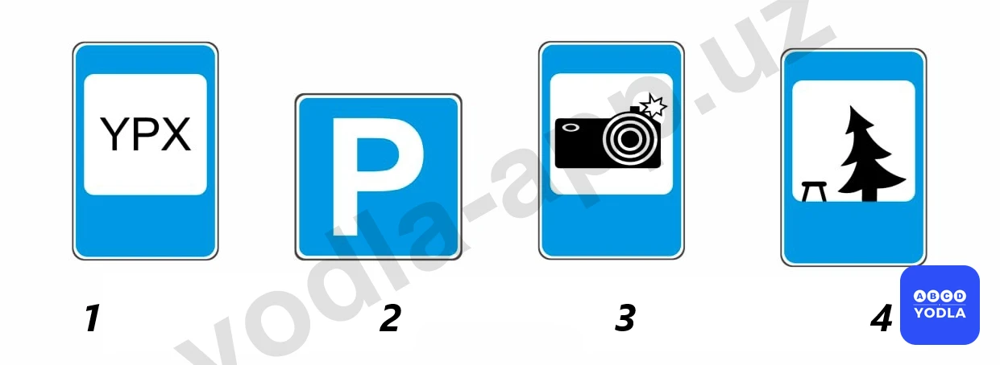

⬜ A. 1 и 2
⬜ B. 3 и 4
✅ C. 2 и 3
⬜ D. 1 и 4

> 💡 Вопрос заключается в том, какие из представленных знаков относятся к информационно-указательным знакам. В данном случае второй и третий дорожные знаки являются информационно-указательными. Первый и четвёртый дорожные знаки относятся к знакам сервиса. Следовательно, правильный ответ — второй и третий знаки.

---

## Вопрос 36

**Какие из указанных знаков запрещают поворот налево?**

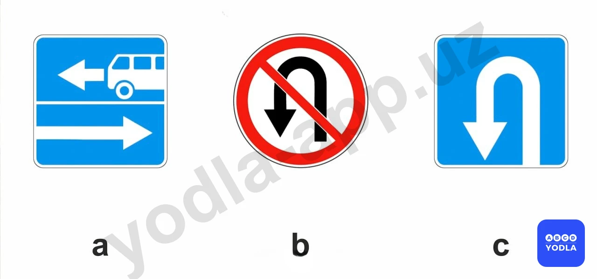

⬜ A. Только А
⬜ B. А и Б
✅ C. А и С
⬜ D. Все

> 💡 Вопрос заключается в том, какие из представленных знаков запрещают поворот налево. В случае со знаком А поворот налево невозможен, поскольку такой манёвр приводит к выезду на полосу, предназначенную для маршрутных транспортных средств. Знак С также запрещает поворот налево. Следовательно, правильный ответ — А и С.

---

## Вопрос 37

**Какие из указанных знаков запрещают движение транспортных средств, скорость которых по технической характеристике или их состоянию менее 40 км/ч?**

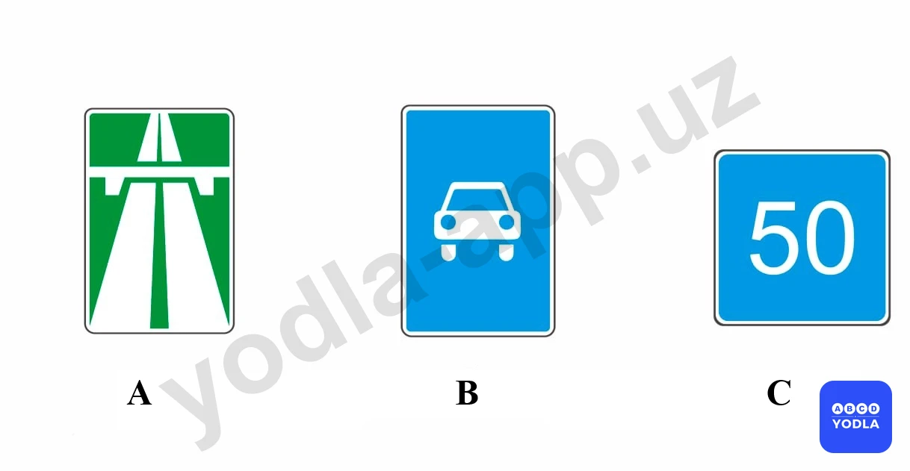

✅ A. Только A
⬜ B. Только C
⬜ C. A  и  B

> 💡 Вопрос заключается в том, какой знак запрещает движение транспортных средств, скорость которых не может превышать 40 км/ч. Правильным ответом является знак А. Этот знак запрещает движение по автомагистрали транспортным средствам, не способным двигаться со скоростью более 40 км/ч. Знак Б такого запрета не устанавливает.

---

## Вопрос 38

**Какие из указанных знаков разрешают движение грузовым автомобилям с разрешенной максимальной массой не более 3,5 т?**

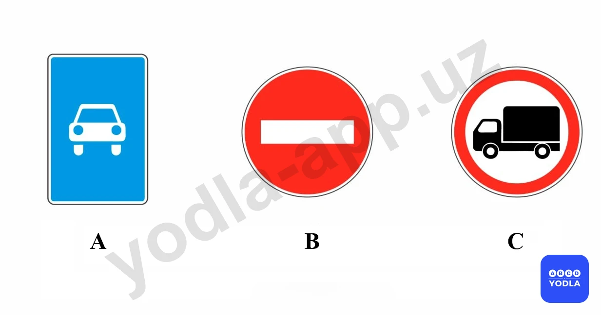

✅ A. Только a и c
⬜ B. Только c
⬜ C. a и b

> 💡 Необходимо определить, какие из представленных знаков разрешают движение грузовых автомобилей с разрешённой максимальной массой не более 3,5 тонн. Знак С разрешает движение таких транспортных средств. Кроме того, знак А обозначает дорогу для автомобилей, по которой также разрешено движение грузовых автомобилей с разрешённой максимальной массой не более 3,5 тонн. Следовательно, правильный ответ — А и С.

---

## Вопрос 39

**Какие из этих знаков являются временные дорожными знаки:**

⬜ A. «1»и«4»
✅ B. «2»и«3»
⬜ C. «3»и«4»

> 💡 Вопрос заключается в том, какие из представленных знаков являются временными дорожными знаками. Временные дорожные знаки имеют жёлтый фон. В данном случае временными являются второй и третий дорожные знаки. Следовательно, правильный ответ — второй и третий знаки.

---

## Вопрос 40

**Какой знак называется «Дорога для автомобилей»?**

⬜ A. 1
✅ B. 2
⬜ C. 3
⬜ D. 4
⬜ E. 5

> 💡 Знак, обозначающий дорогу для автомобилей, в данном случае является вторым дорожным знаком. Следовательно, правильный ответ — второй знак.

---

## Вопрос 41

**Какой из знаков обозначает надземную парковку?**

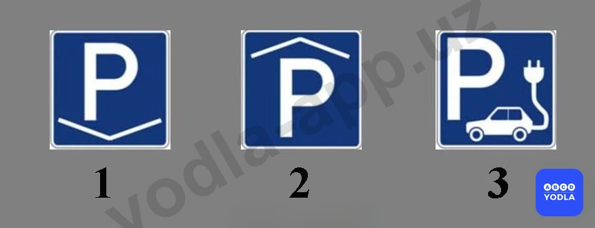

✅ A. 1
⬜ B. 2
⬜ C. 3

> 💡 Вопрос заключается в том, какой из представленных дорожных знаков обозначает наземную парковку. Полутреугольный элемент на знаке символизирует поверхность земли. Первый знак обозначает наземную парковку. Второй знак обозначает подземную парковку. Третий знак указывает на парковку для электромобилей. Следовательно, если требуется определить знак наземной парковки, правильным ответом будет первый знак.

---

## Вопрос 42

**Что означает этот знак?**

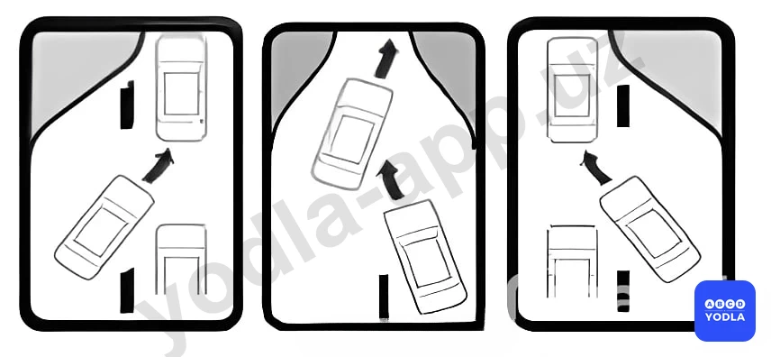

⬜ A. От наличия пробок впереди
✅ B. Проезд в порядке очереди 
⬜ C. Едем на парковку

> 💡 Этот знак является новым дорожным знаком. Он обозначает наличие участка, где организован поочерёдный проезд транспортных средств.

---

## Вопрос 43

**Если постоянные и временные дорожные знаки противоречат друг другу по смыслу, какому из них вы должны следовать?**

⬜ A. Постоянному дорожному знаку
✅ B. Временному дорожному знаку

> 💡 Если постоянные и временные дорожные знаки противоречат друг другу, водители должны руководствоваться требованиями временных дорожных знаков.

---

## Вопрос 44

**Как называется этот знак?**

⬜ A. Искусственная неровность
⬜ B. Обязательное снижение скорости
✅ C. Приподнятый пешеходный переход

> 💡 Данный дорожный знак не обозначает искусственную неровность. Он указывает на наличие приподнятого пешеходного перехода.

---

## Вопрос 45

**В каких направлениях можно поворачивать?**

✅ A. Только «А»
⬜ B. Только «Б»
⬜ C. В обоих перечисленных случаях

> 💡 Вопрос заключается в том, в каком направлении разрешено движение. В данной ситуации движение разрешено в направлении А. Если водитель выберет направление Б, он выедет на полосу встречного движения. Следовательно, правильный ответ — направление А.

---

## Вопрос 46

**Какой знак обозначает пешеходный переход?**

⬜ A. «А»
✅ B. «Б»
⬜ C. «В»

> 💡 Вопрос заключается в том, какой знак обозначает наличие пешеходного перехода. Многие ошибаются именно в этом вопросе. В данном случае правильным ответом является знак Б. Знак А предупреждает о приближении к пешеходному переходу. Знак В обозначает жилую зону. Следовательно, правильный ответ — Б.

---

## Вопрос 47

**Как называется этот знак?**

⬜ A. Место стоянки
✅ B. Платная стоянка
⬜ C. Надземная автомобильная стоянка
⬜ D. Подземная автомобильная стоянка

> 💡 Данный дорожный знак информирует о наличии платной стоянки.

---

## Вопрос 48

**Главная дорога показана**

⬜ A. Только на левом верхнем рисунке
⬜ B. Только на правом верхнем рисунке
✅ C. На обоих верхних рисунках
⬜ D. На всех рисунках

> 💡 Вопрос заключается в том, какие из представленных дорог являются главными. Две верхние картинки обозначают главную дорогу. На нижнем изображении показана дорога с односторонним движением. По самому факту наличия одностороннего движения невозможно определить, является ли дорога главной или второстепенной. Автомагистраль считается главной дорогой. Кроме того, знак примыкания второстепенной дороги также указывает на наличие главной дороги. Следовательно, правильный ответ — две верхние картинки.

---

## Вопрос 49

**Какие знаки отменяют действие дорожного знака 3.24 "Ограничение максимальной скорости"?**

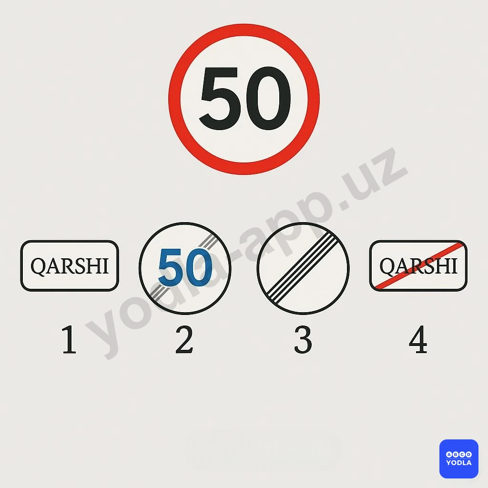

⬜ A. Только первый
⬜ B. Только второй
⬜ C. Только третий
⬜ D. Только четвёртый
✅ E. Все ответы верны

> 💡 Вопрос заключается в том, какие знаки отменяют действие ограничения максимальной скорости. В данной ситуации все представленные знаки отменяют действие ранее введённого ограничения скорости.

Знак начала населённого пункта вводит правила движения, действующие в населённых пунктах, поэтому предыдущее ограничение скорости теряет силу.

Знак окончания ограничения скорости отменяет именно это ограничение.

Знак окончания всех ограничений также отменяет ранее введённые ограничения.

Знак конца населённого пункта означает начало действия правил, установленных вне населённых пунктов, вследствие чего прежнее ограничение скорости также прекращает своё действие.

Следовательно, в данном случае все представленные дорожные знаки отменяют действие ограничения максимальной скорости.

---

## Вопрос 50

**Разрешен ли поворот направо на этом перекрестке?**

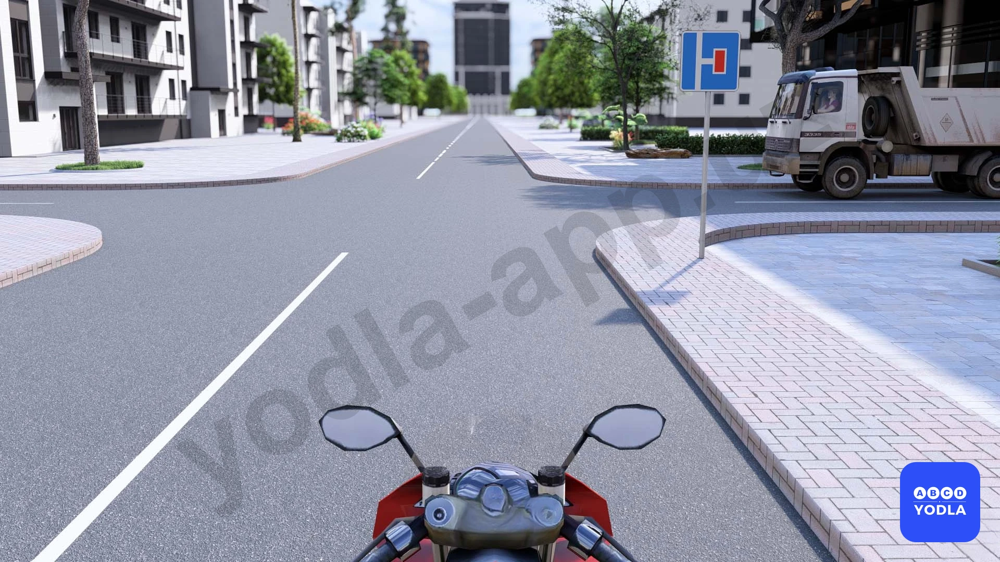

⬜ A. Запрещается
✅ B. Разрешается

> 💡 Вопрос заключается в том, разрешён ли поворот направо на данном перекрёстке. В данной ситуации отсутствуют какие-либо запрещающие знаки. Дорожный знак лишь информирует о том, что справа находится тупиковая улица. Следовательно, поворот направо разрешён. Правильный ответ — разрешено.

---

## Вопрос 51

**По какой траектории вам разрешается выполнить поворот налево?**

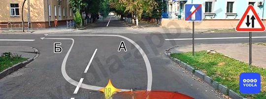

⬜ A. Только по траектории А
⬜ B. По любой из указанных траекторий
✅ C. Только по траектории B

> 💡 Как видно, первый знак информирует об окончании дороги с односторонним движением. Следующий предупреждающий знак сообщает о начале двустороннего движения.

Если водитель намерен двигаться прямо или направо, он должен занять правую полосу движения. Если же он собирается повернуть налево, необходимо занять левую полосу. Движение прямо из левой полосы в данной ситуации не допускается.

Следовательно, поворот налево разрешается только по направлениям А и Б, то есть со второй полосы движения.

---

## Вопрос 52

**В каких направлениях разрешено движение автомобилю?**

✅ A. В первом направлении
⬜ B. Во втором направлении
⬜ C. Разрешено в обоих направлениях

> 💡 Синий автомобиль находится на первой полосе движения. Для данной полосы разрешено движение прямо и налево. Следовательно, движение по первому направлению разрешается.

Движение по второму направлению с выполнением разворота не допускается, поскольку автомобиль находится не на крайней левой полосе. Разворот должен выполняться только из крайнего левого положения на проезжей части.

Таким образом, в данной ситуации разрешается движение только по первому направлению.

---

## Вопрос 53

**На каком знаке разрешён разворот?**

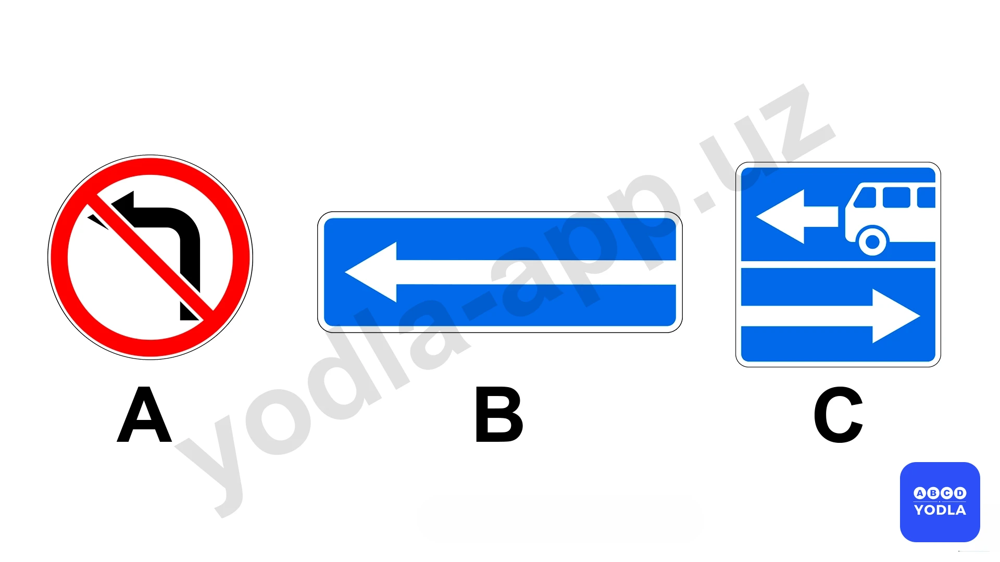

⬜ A. B
⬜ B. C
⬜ C. A
✅ D. A, B, C

> 💡 Если в вопросе спрашивается, какой знак разрешает разворот, то в данной ситуации ни один из представленных дорожных знаков не запрещает выполнение разворота. Следовательно, все указанные знаки разрешают разворот.

---

## Вопрос 54

**Какое транспортное средство поворачивает направо правильно?**

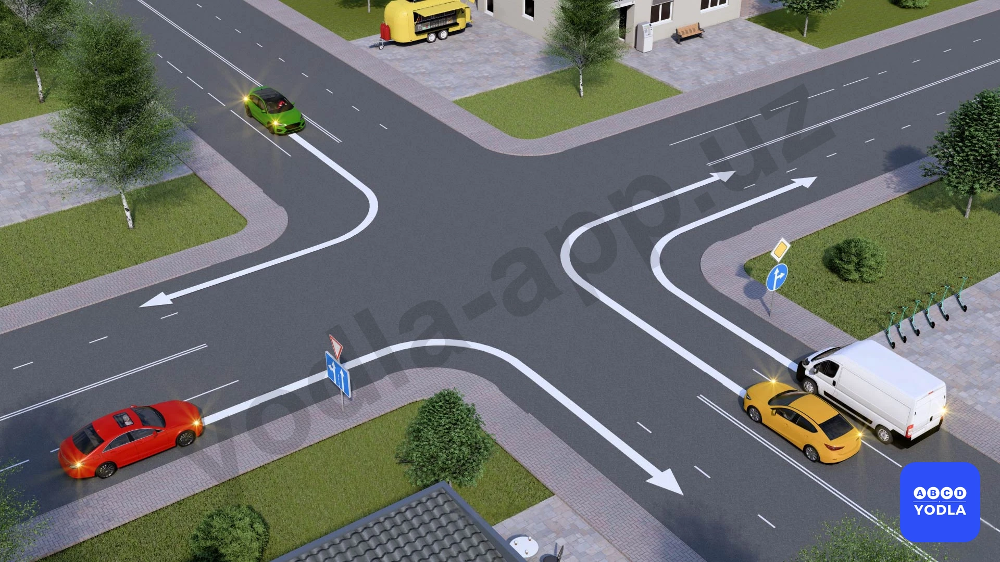

⬜ A. Белый и жёлтый автомобиль
⬜ B. Красный и белый автомобиль
⬜ C. Жёлтый и зелёный автомобиль
✅ D. Белый автомобиль
⬜ E. Все автомобили

> 💡 Вопрос заключается в том, какое транспортное средство правильно выполняет поворот направо. В данной ситуации правильный ответ — белый автомобиль.

Жёлтый автомобиль поворачивает направо со второй полосы движения. Поворот направо должен выполняться только с крайней правой полосы, поэтому это является нарушением.

Для красного автомобиля дорожный знак предписывает движение только прямо, поэтому поворот направо запрещён.

Зелёный автомобиль также выполняет поворот направо со второй полосы, что не допускается правилами.

Следовательно, правильный ответ — только белый автомобиль выполняет поворот направо правильно.

---

## Вопрос 55

**При коком сигнале светофора разрешается поворачивать направо без рельсовым транспортом средствам**

⬜ A. Красный сигнал
⬜ B. Желтый знак
⬜ C. Зеленый знак
✅ D. Все показано

> 💡 Дорожный знак 5.42 указывает, что при красном сигнале светофора разрешается поворот направо. В остальных случаях водитель должен руководствоваться общими правилами дорожного движения. Следовательно, движение разрешается по всем указанным направлениям. Правильный ответ — все указанные направления.

---

## Вопрос 56

**Разрешено ли водителю Синий  автомобиля въезжать на парковку?**

⬜ A. Разрешено
✅ B. Запрещено

> 💡 Данный дорожный знак разрешает разворот, но запрещает поворот налево. Поэтому, если в вопросе спрашивается, разрешён ли въезд в данном направлении, правильный ответ — запрещено.

---

## Вопрос 57

**Какой из следующих дорожных знаков требует соблюдения минимальной скорости?**

⬜ A. На вывеске слева
✅ B. На вывеске справа
⬜ C. В обоих случаях

> 💡 Вопрос заключается в том, какой из представленных дорожных знаков устанавливает минимальную скорость движения. Правильным ответом является знак, расположенный справа. Этот знак указывает, что транспортные средства должны двигаться со скоростью не менее 60 км/ч или выше.

Первый знак прямоугольной формы обозначает рекомендуемую скорость движения. Он не является обязательным. Водитель может двигаться со скоростью 60 км/ч, ниже или выше этого значения, если это не противоречит правилам дорожного движения.

Следовательно, правильный ответ — только знак, расположенный справа.

---

## Вопрос 58

**В каких направлениях вам разрешено продолжить движение?**

✅ A. Только налево
⬜ B. Прямо и налево
⬜ C. Налево и с разворотом

> 💡 Как видно, дополнительная секция светофора разрешает движение налево. Транспортное средство находится на первой полосе движения. В данной ситуации движение прямо не разрешается, однако разрешён поворот налево. Выполнение разворота также не допускается. Следовательно, движение разрешено только налево. Правильный ответ — только налево.

---

## Вопрос 59

**Какой сигнал должно подать красное транспортное средство, поворачивающее направо на перекрёстке, транспортному средству впереди?**

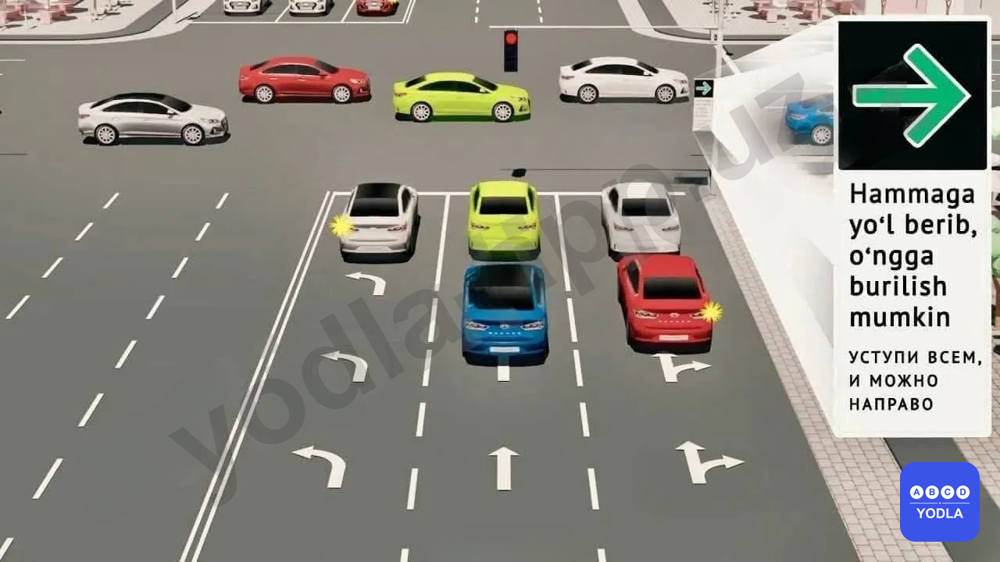

⬜ A. Звуковой сигнал
⬜ B. Световые сигналы
✅ C. Необходимо дождаться разрешающего сигнала светофора
⬜ D. Все ответы верны

> 💡 Дорожный знак 5.42 разрешает поворот направо на красный сигнал светофора, уступив дорогу всем. Если впереди находится транспортное средство, движущееся прямо, необходимо дождаться, пока для него загорится зелёный сигнал и оно продолжит движение прямо

---

## Вопрос 60

**В каких направлениях разрешается движение?**

⬜ A. Во всех направлениях, кроме поворота направо и разворота
⬜ B. Во всех направлениях
✅ C. Только прямо
⬜ D. Прямо, налево и на разворот

> 💡 На правой стороне перекрёстка установлен знак «Поворот налево запрещён». Этот знак запрещает водителю повернуть налево.

Кроме того, на левой дороге организовано одностороннее движение. Это видно по синему знаку с белой стрелкой, который показывает, что движение по этой дороге осуществляется слева направо (для вас — влево). Если вы повернёте налево, то окажетесь на полосе встречного движения, что запрещено Правилами дорожного движения.

Повернуть направо также нельзя, поскольку на этой дороге движение организовано таким образом, что въезд с вашего направления запрещён.

Поэтому:

❌ Налево — запрещено.
❌ Направо — запрещено.
❌ Разворот — запрещён.
✅ Разрешено движение только прямо.

---

