# 11. Знаки дополнительной информации (боб 1.7)

Всего вопросов: 37

## Вопрос 1

**Какому автомобилю разрешается остановка в зоне действия этих знаков?**

⬜ A. Красному
⬜ B. Обоим автомобилям
⬜ C. Ни одному
✅ D. Желтому автомобилю, обозначенному опознавательным знаком “Инвалид”

> 💡 Этот знак означает, что остановка запрещена, за исключением транспортных средств, управляемых лицами с инвалидностью или перевозящих таких лиц. Следовательно, остановка запрещена для всех транспортных средств, кроме тех, на которых установлен опознавательный знак «Инвалид». Поэтому водителю жёлтого автомобиля с таким опознавательным знаком остановка в данном месте разрешается.

---

## Вопрос 2

**Эти знаки разрешают движение:**

⬜ A. Только налево
⬜ B. Только прямо
⬜ C. Только направо
✅ D. Прямо, направо и в обратном направлении

> 💡 Если дорожный знак запрещает поворот налево, водителю разрешается двигаться прямо, поворачивать направо и выполнять разворот. Следовательно, правильный ответ — разрешено движение прямо, направо и разворот.

---

## Вопрос 3

**Этот дорожный знак вместе с дополнительной информационной табличкой означает:**

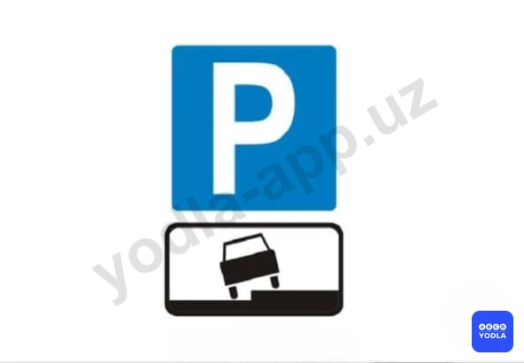

⬜ A. Место стоянки транспортных средств с разрешенной максимальной массой более 3,5 т. Табличка указывает, что у края проезжей части высокий бордюрный камень
⬜ B. Место стоянки транспортных средств; способ постановки автомобиля; указанный на табличке запрещается
✅ C. Место и способ постановки легковых автомобилей и мотоциклов на стоянке

> 💡 Если данный дорожный знак запрещает поворот налево, водителю разрешается двигаться прямо, поворачивать направо и выполнять разворот. Следовательно, правильный ответ — разрешено движение прямо, направо и разворот.

---

## Вопрос 4

**Разрешен ли обгон в этом месте?**

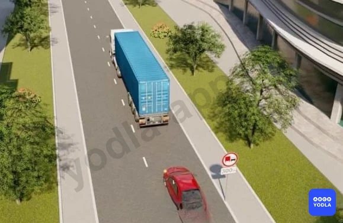

✅ A. Разрешается
⬜ B. Запрещается
⬜ C. Разрешается, если скорость обгоняемого меньше 40 км/ч.

> 💡 Вопрос заключается в том, разрешён ли обгон в данной ситуации. Да, обгон разрешён. Знак "Обгон грузовым автомобилям запрещён" установлен с табличкой, указывающей, что его действие начинается через 300 метров.

Кроме того, данный знак распространяется только на грузовые автомобили. На легковые автомобили это ограничение не действует. Поэтому водителю легкового автомобиля обгон разрешается.

Следовательно, правильный ответ — обгон разрешён.

---

## Вопрос 5

**В каком направлении запрещено движение?**

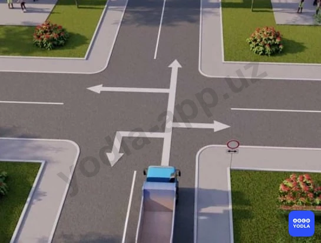

✅ A. Налево и направо
⬜ B. Прямо и в обратном направлении
⬜ C. Только прямо
⬜ D. Во всех направлениях

> 💡 Вопрос заключается в том, в каких направлениях движение запрещено. Как видно, дополнительная информационная табличка указывает направления направо и налево. Следовательно, в данной ситуации движение направо и налево запрещено. Правильный ответ — движение направо и налево запрещено.

---

## Вопрос 6

**Что означает табличка под знаком?**

⬜ A. Расстояние от знака до начала первого поворота
⬜ B. Расстояние от первого поворота до начала второго поворота
✅ C. Протяженность участка дороги с опасными поворотами

> 💡 Дополнительная табличка под дорожным знаком указывает протяжённость участка дороги, на котором имеются опасные повороты.

---

## Вопрос 7

**Что означает дополнительной информационной знак под нижеуказанном знаком?**

⬜ A. Обозначает участок дороги; на котором запрещено фото и видео фиксация
✅ B. Обозначает участок дороги; на котором установили фото и видео наблюдение со стороны ГИБДД

> 💡 Этот знак информирует о наличии участка дороги, на котором ведётся фото- и видеофиксация процесса дорожного движения органами безопасности дорожного движения.

---

## Вопрос 8

**С какой целью установлена табличка под данным знаком?**

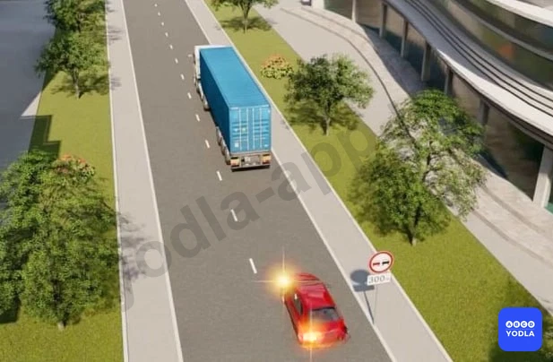

✅ A. Для уточнения расстояния от знака до начала зоны его действия
⬜ B. Для уточнение зоны действия запрещающего знака

> 💡 Вопрос заключается в том, с какой целью устанавливается дополнительная информационная табличка под запрещающим знаком. Такая табличка указывает расстояние до начала действия дорожного знака. То есть она показывает, через какое расстояние требование знака вступает в силу. Следовательно, правильным является первый вариант ответа. Например, это означает: "Обгон запрещён через 300 метров".

---

## Вопрос 9

**Разрешается ли остановка автомобиля с опознавательным знаком "Инвалид" в зоне действия этих знаков?**

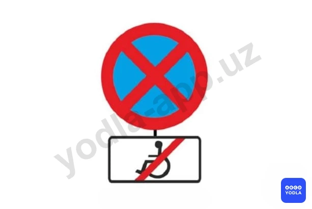

✅ A. Разрешается
⬜ B. Запрещается

> 💡 Вопрос заключается в том, разрешена ли остановка автомобилю, обозначенному опознавательным знаком «Инвалид». Дополнительная табличка означает «Кроме инвалидов». Поэтому транспортному средству с опознавательным знаком «Инвалид» остановка в данном месте разрешается. Следовательно, правильный ответ — разрешено.

---

## Вопрос 10

**О чем предупреждают знак и табличка под ним**

⬜ A. Остановка на обочине запрещена в связи с работами
✅ B. Съезд на обочину опасен в связи с проведением на ней ремонтных работ
⬜ C. Стоянка на обочине запрещена в связи с ремонтными работами на дороге

> 💡 Дополнительная табличка под данным дорожным знаком означает, что из-за проведения ремонтных работ на обочине выезд на неё является опасным.

---

## Вопрос 11

**Какой из знаков указывает протяженность опасного участка дороги; обозначенного предупреждающими знаками?**

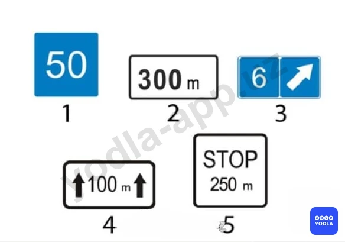

⬜ A. 1
⬜ B. 2
⬜ C. 3
✅ D. 4
⬜ E. 5

> 💡 Вопрос заключается в том, какая дополнительная табличка указывает протяжённость опасного участка дороги, обозначенного предупреждающим знаком. В данном случае п��авильным ответом является четвёртая табличка. Она указывает длину опасного участка дороги.

---

## Вопрос 12

**Какой автомобиль нарушил правила остановки?**

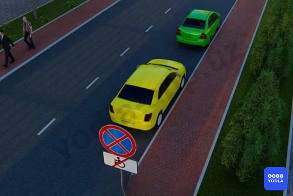

⬜ A. Зеленый автомобиль
✅ B. Оба нарушили
⬜ C. Оба не нарушали

> 💡 В данной ситуации под знаком "Остановка запрещена" установлена дополнительная табличка "Кроме инвалидов". Это означает, что остановка разрешается только транспортным средствам, на которых установлен опознавательный знак «Инвалид».

Если на транспортном средстве имеется такой знак, водитель может воспользоваться данным исключением. Во многих подобных вопросах правильным ответом выбирают водителя жёлтого автомобиля. Однако в данной ситуации на жёлтом автомобиле отсутствует опознавательный знак «Инвалид».

Следовательно, в данном случае оба водителя нарушили правила дорожного движения.

---

## Вопрос 13

**В каком направлении разрешается движение автомобиля?**

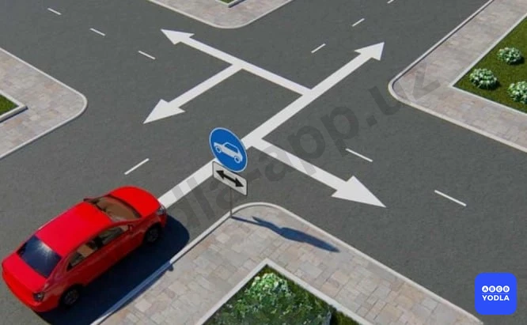

⬜ A. Налево и направо
⬜ B. Только прямо
✅ C. Во всех направлениях

> 💡 Этот вопрос часто вводит в заблуждение. Данный дорожный знак называется "Движение легковых автомобилей". На знаке указаны направления направо и налево.

Если бы на месте красного автомобиля находился грузовой автомобиль с разрешённой максимальной массой более 3,5 тонн, движение направо и налево для него было бы запрещено. В такой ситуации ему было бы разрешено только движение прямо или разворот.

Однако в данном случае транспортное средство является легковым автомобилем, поэтому ему разрешается движение во всех направлениях.

Следовательно, правильный ответ — движение разрешено во всех направлениях.

---

## Вопрос 14

**На какие транспортные средства распространяется действие знаков?**

⬜ A. Только на легковые автомобили
⬜ B. На легковые автомобили и мотоциклы
✅ C. На легковые автомобили и грузовые автомобили с разрешенной максимальной массой менее или равной 3,5 т

> 💡 Этот знак разрешает движение легковым автомобилям, а также грузовым автомобилям с разрешённой максимальной массой не более 3,5 тонн.

В некоторых вопросах вариант ответа о грузовых автомобилях с разрешённой максимальной массой не более 3,5 тонн может отсутствовать. В таких случаях правильным считается ответ "только легковым автомобилям".

Однако в данном вопросе такой вариант присутствует, поэтому правильным ответом является третий вариант.

---

## Вопрос 15

**Какой знак указывает способ постановки транспортного средства на стоянку?**

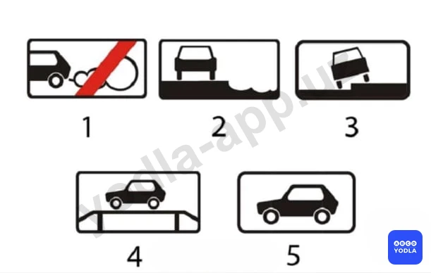

⬜ A. 1
⬜ B. 2
✅ C. 3
⬜ D. 4
⬜ E. 5

> 💡 Вопрос заключается в том, какая дополнительная информационная табличка указывает способ постановки транспортного средства на стоянку. В данном случае правильным ответом является третий знак. Эта табличка показывает, каким образом необходимо размещать транспортное средство на парковке.

---

## Вопрос 16

**О чем информирует водителя табличка, установленная под данным знаком?**

⬜ A. Во время стоянки запрещено выключать двигатель
✅ B. Стоянка разрешена только с выключенным двигателем

> 💡 Вопрос заключается в том, о чём информирует водителя дополнительная табличка под дорожным знаком. Эта табличка означает, что стоянка разрешается только при выключенном двигателе. Иными словами, стоянка с работающим двигателем не допускается. Следовательно, правильным ответом является второй вариант.

---

## Вопрос 17

**Водители; каких транспортных средств нарушили правила стоянки?**

⬜ A. «А» и «Б»
⬜ B. Только «Г»
⬜ C. «Б» и «Г»
⬜ D. «В» и «Г»
✅ E. «Б», «В» и «Г»

> 💡 Данная дополнительная табличка указывает способ стоянки легковых автомобилей, мотоциклов, мопедов и велосипедов на тротуаре. Согласно указанному способу, транспортное средство должно быть частично расположено на тротуаре.

Красный автомобиль припаркован в соответствии с требованиями знака и не нарушает правила. Жёлтый и синий автомобили нарушают установленный порядок стоянки. Кроме того, жёлтому грузовому автомобилю в данном месте стоянка вообще не разрешается.

Следовательно, правила нарушили транспортные средства Б, В и Г. Только красный автомобиль припаркован правильно.

---

## Вопрос 18

**Какой из знаков указывает протяженность опасного участка дороги?**

⬜ A. 1
⬜ B. 2
⬜ C. 3
✅ D. 4
⬜ E. 5

> 💡 Вопрос заключается в том, какой дорожный знак указывает протяжённость опасного участка дороги. В данном случае правильным ответом является четвёртый знак. Он обозначает длину опасного участка дороги.

---

## Вопрос 19

**Что означают эти знаки?**

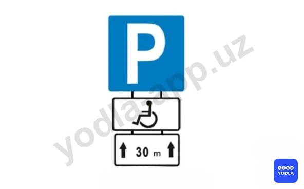

⬜ A. Знак «Инвалид» для автомобилей с ограниченными возможностями появится на проезжей части через 30 м
⬜ B. Место стоянки в зоне 30 м для транспортных средств, кроме мотоколясок
✅ C. Место стоянки в зоне 30 м для мотоколясок и автомобилей с опознавательным знаком «Инвалид»

> 💡 Этот знак обозначает место стоянки протяжённостью 30 метров, предназначенное для мотоколясок и автомобилей, обозначенных опознавательным знаком «Инвалид».

---

## Вопрос 20

**Какому транспортному средству запрещено останавливаться?**

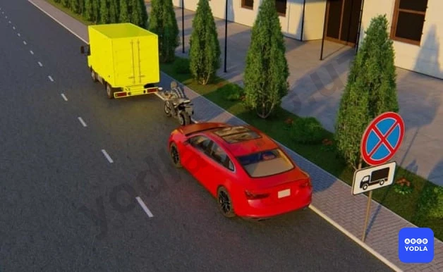

⬜ A. Водитель легкового автомобиля
⬜ B. Водитель мотоцикла
✅ C. Водитель грузового автомобиля
⬜ D. Водители всех транспортных средств

> 💡 Вопрос заключается в том, для каких транспортных средств запрещена остановка. Данная дополнительная табличка указывает, что запрет распространяется только на грузовые автомобили. Следовательно, в этом месте остановка запрещена только грузовым автомобилям.

---

## Вопрос 21

**Что указывает табличка под знаком?**

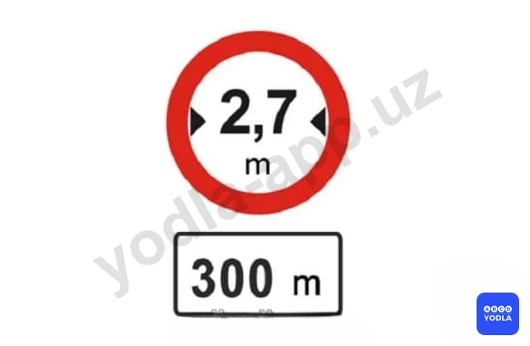

⬜ A. Протяженность узкого участка дороги
✅ B. Расстояние от знака до узкого участка дороги
⬜ C. Расстояние до объезда узкого участка дороги

> 💡 Дополнительная табличка под дорожным знаком указывает расстояние от знака до сужения дороги. Иными словами, она показывает расстояние от места установки знака до указанного объекта. Следовательно, правильный ответ — расстояние до участка сужения дороги.

---

## Вопрос 22

**Какие знаки распространяют свое действие только на период времени, когда покрытие проезжей части влажное?**

✅ A. Только «А»
⬜ B. Только «А» и «Б»
⬜ C. Все

> 💡 Вопрос заключается в том, какой из представленных дорожных знаков действует только при влажном дорожном покрытии. В данном случае правильным ответом является знак А. Эта дополнительная табличка указывает, что требования основного дорожного знака распространяются только на период, когда дорожное покрытие является влажным.

---

## Вопрос 23

**Вам разрешено продолжить движение на грузовом автомобиле с разрешенной максимальной массой  более 3,5 т:**

✅ A. Только прямо
⬜ B. Прямо и направо
⬜ C. Во всех направлениях

> 💡 Для грузовых автомобилей с разрешённой максимальной массой более 3,5 тонн указано направление движения. В данной ситуации дорожный знак разрешает таким грузовым автомобилям движение только прямо. Следовательно, правильный ответ — разрешено движение только прямо.

---

## Вопрос 24

**Какие знаки дополнительной информации указывают протяженность зоны действия знаков, с которыми они применяются?**

⬜ A. Только «А»
⬜ B. Только «Б»
✅ C. «Б» и «В»

> 💡 Вопрос заключается в том, какие дополнительные таблички при совместном применении указывают зону действия дорожного знака. В данном случае правильным ответом являются таблички Б и В. Они обозначают участок дороги, на котором действует основной дорожный знак.

Табличка А показывает расстояние от места установки знака до начала зоны его действия, то есть указывает, через какое расстояние знак начинает действовать.

Следовательно, правильный ответ — Б и В.

---

## Вопрос 25

**В каких направлениях Вам разрешено продолжить движение на легковом автомобиле?**

⬜ A. Только прямо
⬜ B. Только налево или направо
✅ C. В любых

> 💡 Вопрос заключается в том, в каких направлениях разрешено движение легковому автомобилю. В данной ситуации знак 4.1.1 «Движение прямо» применяется вместе с дополнительной табличкой и распространяется только на грузовые автомобили с разрешённой максимальной массой более 3,5 тонн.

Следовательно, на водителя легкового автомобиля действие данного знака не распространяется. Поэтому легковому автомобилю разрешается движение в любом направлении.

Правильный ответ — разрешено движение по всем указанным направлениям.

---

## Вопрос 26

**Эта табличка указывает:**

✅ A. Способ стоянки всех видов транспортных средств на проезжей части, рядом с тротуаром.
⬜ B. Место для стоянки легковых автомобилей
⬜ C. Стоянка механических транспортных средств.

> 💡 Данная дополнительная табличка указывает способ постановки на стоянку и остановки для всех видов транспортных средств. Она показывает порядок размещения транспортных средств у края проезжей части рядом с тротуаром.

Другие аналогичные таблички распространяются только на легковые автомобили, мотоциклы, мопеды и велосипеды. Именно эта табличка применяется ко всем видам транспортных средств.

Следовательно, данный знак обозначает способ остановки и стоянки для всех типов транспортных средств.

---

## Вопрос 27

**В каких случаях запрещается движение со скоростью выше 50 км/с?**

✅ A. Только если дорога мокрая
⬜ B. В любом случае

> 💡 Вопрос заключается в том, в каком случае запрещается движение со скоростью более 50 км/ч. Данное ограничение действует только при влажном дорожном покрытии. Дополнительная табличка указывает, что требования основного дорожного знака распространяются исключительно на период, когда дорожное покрытие является мокрым.

Следовательно, движение со скоростью более 50 км/ч запрещается только при влажном дорожном покрытии.

---

## Вопрос 28

**Этот допольнительная табличка означает:**

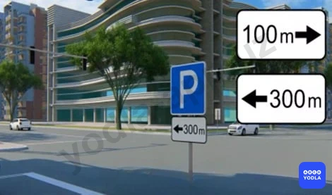

✅ A. Расстояние до объекта
⬜ B. Зона действия знака

> 💡 Данная дополнительная табличка указывает расстояние до объекта. То есть она показывает, какое расстояние осталось до объекта, обозначенного основным дорожным знаком.

---

## Вопрос 29

**Эта табличка означает**

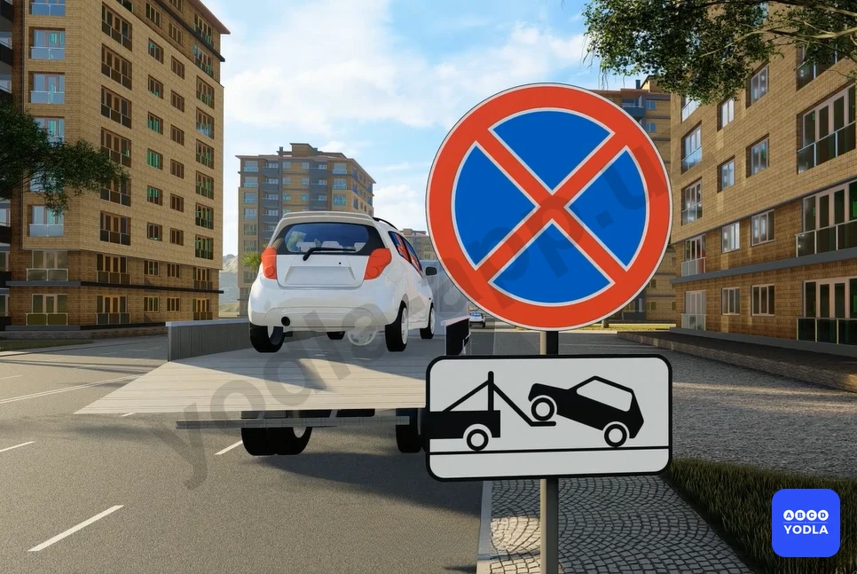

✅ A. Указывает на принудительную эвакуацию автомобилей, остановившихся в зоне действие знака
⬜ B. Разрешает эвакуацию остановившихсятранспортных средств в зоне действие знака
⬜ C. Запрещает эвакуацию остановившихся транспортных средств в зоне действие знака

> 💡 Данная дополнительная табличка указывает, что транспортные средства, остановившиеся или находящиеся на стоянке в зоне действия дорожного знака, подлежат принудительной эвакуации.

---

## Вопрос 30

**С каким дорожным знаком применяется эта табличка?**

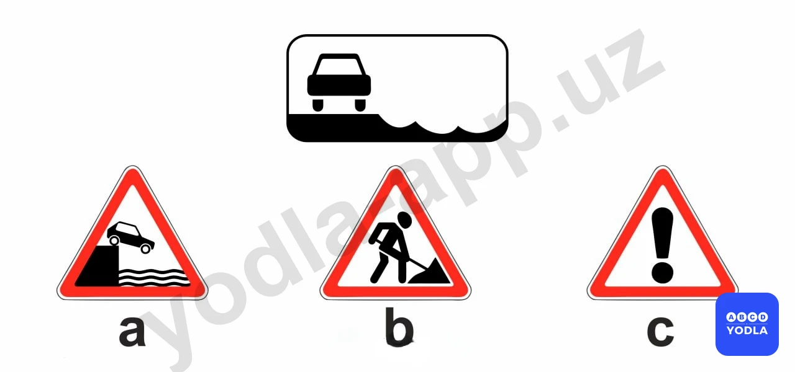

⬜ A. A
✅ B. B
⬜ C. C

> 💡 Вопрос заключается в том, с каким дорожным знаком применяется данная дополнительная табличка. В данном случае она используется совместно с предупреждающим дорожным знаком. Следовательно, правильный ответ — вариант Б.

---

## Вопрос 31

**Какой из указанных знаков распространяет свое действие только на ту полосу, над которой он установлен?
**

⬜ A. «Б» и «В»
⬜ B. Только «Б»
✅ C. Только «А»

> 💡 Вопрос заключается в том, какой знак действует только на определённую полосу движения. Правильным ответом является знак А. Стрелка, направленная вниз, указывает, что требование знака распространяется только на указанную полосу.

Знак Б синего цвета обозначает минимальную скорость движения. Он запрещает движение со скоростью менее 50 км/ч по данной полосе, но разрешает движение со скоростью выше 50 км/ч.

Знак В прямоугольной формы является информационным знаком рекомендуемой скорости. Он рекомендует движение со скоростью 50 км/ч, однако не устанавливает обязательного ограничения. Водитель может двигаться со скоростью 50 км/ч, ниже или выше этого значения, если это не противоречит другим требованиям правил дорожного движения.

В случае со знаком А ограничение скорости действует только на ту полосу, на которую указывает стрелка. Например, если знак установлен над левой полосой, то транспортным средствам на этой полосе запрещается двигаться со скоростью более 50 км/ч.

---

## Вопрос 32

**Данный дополнительной информации знак с каким дорожным знаком используется?**

⬜ A. 1
⬜ B. 2
⬜ C. 3
✅ D. 4

> 💡 Вопрос заключается в том, с каким дорожным знаком применяется данная дополнительная табличка. В данном случае правильным ответом является четвёртый дорожный знак.

---

## Вопрос 33

**Какие из указанных дорожных знаков являются дополнительными информационными знаками?**

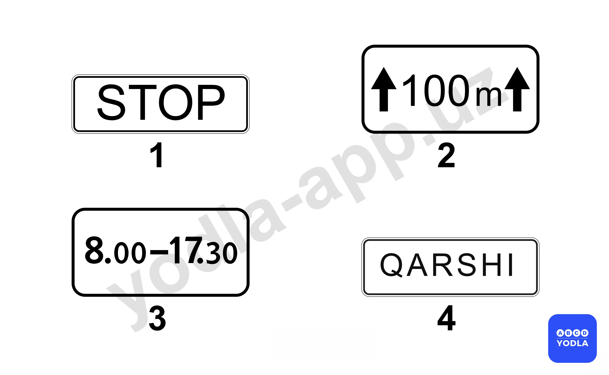

⬜ A. Знаки 1 и 2
✅ B. Знаки 2 и 3
⬜ C. Все знаки

> 💡 Вопрос заключается в том, какие из представленных знаков относятся к дополнительным информационным табличкам. В данном случае правильным ответом являются второй и третий знаки.

Первый знак относится к информационно-указательным и обозначает стоп-линию.

Четвёртый знак также является информационно-указательным и обозначает начало населённого пункта.

Вторая дополнительная табличка указывает расстояние до начала зоны действия основного дорожного знака, например 100 метров.

Третья дополнительная табличка уточняет время действия основного дорожного знака, например с 08:00 до 17:30.

Следовательно, правильный ответ — второй и третий знаки.

---

## Вопрос 34

**В каком направлении разрешено двигаться автоводителю?**

⬜ A. Направо и налево
✅ B. Только налево
⬜ C. По всем направлениям

> 💡 Вопрос заключается в том, в каком направлении водителю разрешено продолжить движение в данной ситуации.

Как видно, дорожный знак указывает на окончание дороги с односторонним движением. Кроме того, предупреждающий знак информирует о начале двустороннего движения.

Поэтому движение прямо не разрешается, так как водитель может выехать на встречную полосу. В данной ситуации разрешён только поворот налево с левой полосы движения.

Следовательно, правильный ответ — разрешено движение только налево.

---

## Вопрос 35

**Какой знак запрещает обгон водителю?**

⬜ A. 1 и 3
⬜ B. 1 и 2
✅ C. 2 и 3
⬜ D. На всех изображениях

> 💡 Вопрос заключается в том, какие знаки указывают водителю на запрет обгона.

Обратим внимание на первый знак. Под знаком «Обгон запрещён» установлена табличка «300 м». Это означает, что действие запрета начнётся через 300 метров. Следовательно, в данном месте обгон ещё разрешён.

Во втором случае знак «Обгон запрещён» уже действует, поэтому обгон выполнять нельзя.

В третьем случае дополнительная табличка указывает, что зона действия запрета продолжается ещё на протяжении 100 метров. Следовательно, обгон здесь также запрещён.

Таким образом, правильный ответ — второй и третий знаки.

---

## Вопрос 36

**В каком ответе правильно указана последовательность групп дорожных знаков?**

⬜ A. Запрещающие, приоритета, предписывающие, информационно-указательные, предупреждающие, сервисные, дополнительные информационные
✅ B. Предупреждающие, приоритета, запрещающие, предписывающие, информационно-указательные, сервисные, дополнительные информационные
⬜ C. Предупреждающие, приоритета, предписывающие, запрещающие, информационно-указательные, сервисные, дополнительные информационные
⬜ D. Все вышеперечисленные ответы правильные

> 💡 Вопрос заключается в том, в каком варианте правильно указана последовательность групп дорожных знаков. Правильная последовательность выглядит следующим образом:

1. Предупреждающие знаки;
2. Знаки приоритета;
3. Запрещающие знаки;
4. Предписывающие знаки;
5. Информационно-указательные знаки;
6. Знаки сервиса;
7. Таблички дополнительной информации.

Для запоминания достаточно сначала выучить последовательность: предупреждающие, знаки приоритета и запрещающие. Остальные группы следуют именно в этом порядке. Следовательно, правильный ответ — предупреждающие, знаки приоритета, запрещающие, предписывающие, информационно-указательные знаки, знаки сервиса и таблички дополнительной информации.

---

## Вопрос 37

**Как называется данный дорожный знак?**

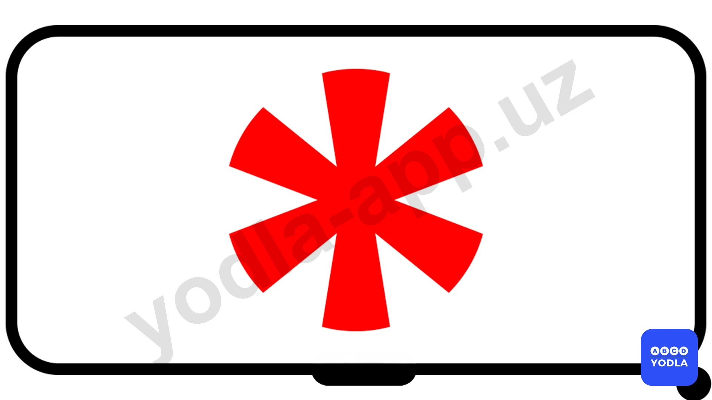

✅ A. Суббота, воскресенье и праздничные дни
⬜ B. Дни недели
⬜ C. Рабочие дни

> 💡 Этот дорожный знак относится к табличкам дополнительной информации и применяется совместно с основными дорожными знаками. Значение данной таблички — «по субботам, воскресеньям и праздничным дням».

---

