# 12. Горизонтальная разметка (боб 2.1)

Всего вопросов: 72

## Вопрос 1

**О чём предупреждает данная разметка?**

⬜ A. О приближении к месту обязательной остановки транспортных средств
✅ B. О приближении транспортных средств к "СТОП-ЛИНИИ", когда она применяется в сочетании со знаком "Движение без остановки запрещено"
⬜ C. Указывает место, где транспортное средство должно уступить дорогу пешеходам

> 💡 Данная дорожная разметка предупреждает водителя о приближении к стоп-линии. Обычно она применяется совместно со знаком «Движение без остановки запрещено» и информирует водителя о том, что впереди находится стоп-линия. Следовательно, правильный ответ — предупреждает о приближении к стоп-линии.

---

## Вопрос 2

**Разрешается ли повернуть во двор в этом месте?**

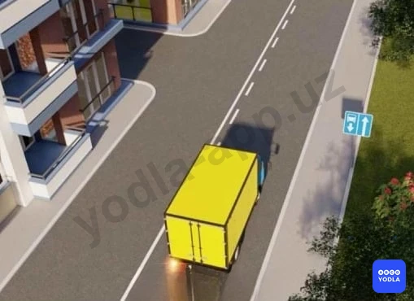

✅ A. Разрешается
⬜ B. Запрещается

> 💡 Вопрос заключается в том, разрешён ли поворот во двор в данной ситуации. Да, разрешён. Поскольку здесь нанесена прерывистая линия разметки, водитель может пересечь её для поворота налево или въезда на прилегающую территорию. Следовательно, в данном случае поворот налево во двор разрешён.

---

## Вопрос 3

**Разрешается ли обгон в данной ситуации?**

⬜ A. Разрешается
✅ B. Запрещается
⬜ C. Разрешается; если обгоняемый автомобиль движется со скоростью меньше 40 км/ч

> 💡 В данной ситуации спрашивается, разрешён ли обгон. Правильный ответ — запрещён. Поскольку на проезжей части нанесена разметка 1.1, то есть сплошная линия, пересекать её запрещается. Следовательно, выезжать на встречную полосу для выполнения обгона нельзя. Таким образом, дорожная разметка в данном случае не разрешает выполнение обгона.

---

## Вопрос 4

**Разрешено ли водителю легкового автомобиля совершить маневр, двигаясь по обозначенным траекториям ?**

⬜ A. Разрешено только по «А»
⬜ B. Разрешено только по «Б»
✅ C. Разрешено по обеим

> 💡 В данной ситуации выполнение манёвра разрешено в обоих направлениях.

Поясним. В направлении А нанесена прерывистая линия разметки, пересекать которую разрешается. В направлении Б используется разметка 1.6. Она предупреждает водителя о приближении к сплошной линии и представляет собой удлинённые штрихи.

В обоих случаях пересечение разметки не запрещено. Следовательно, выполнение манёвра разрешается как по направлению А, так и по направлению Б.

Таким образом, правильный ответ — манёвр разрешён в обоих направлениях.

---

## Вопрос 5

**Разрешается ли водителю пересекать сплошную линию разметки; обозначающую границы стояночных мест транспортных средств?**

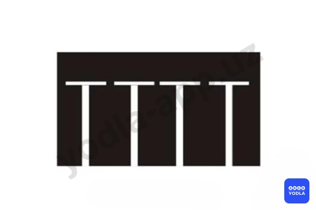

⬜ A. Разрешается для остановки
✅ B. Запрещается
⬜ C. Разрешается для въезда и выезда
⬜ D. Разрешается в любом случае, если на стоянке нет других транспортных средств

> 💡 Уважаемые учащиеся, необходимо правильно понимать понятие «пересечение разметки». Под пересечением понимается наезд на линию разметки и её пересечение в поперечном направлении.

В данной ситуации транспортное средство не пересекает линию разметки напрямую. Автомобиль заезжает на парковочное место в соответствии с направлением нанесённой разметки.

Следовательно, пересекать данную линию разметки запрещено. Правильный ответ — пересечение запрещено.

---

## Вопрос 6

**Сколько полос для движения имеет дорога; где транспортные потоки противоположных направлений разделяются двойными сплошными линиями?**

⬜ A. Две
⬜ B. Две или три полосы
⬜ C. Три полосы
✅ D. Четыре и более полос

> 💡 Данная дорожная разметка предупреждает водителя о наличии на проезжей части четырёх и более полос движения. Следовательно, правильным ответом является вариант Ф4.

---

## Вопрос 7

**Что обозначает сплошная желтая линия горизонтальной разметки?**

✅ A. Место; где запрещается остановка транспортных средств
⬜ B. Место; где разрешена остановка маршрутных транспортных средств и такси
⬜ C. Место; где запрещена стоянка транспортных средств

> 💡 Сплошная жёлтая линия обозначает место, где остановка транспортных средств запрещена. В зоне действия такой разметки остановка не допускается.

---

## Вопрос 8

**Разрешается ли произвести высадку пассажиров в месте; где нанесена по верху бордюра сплошная желтая линия в сочетании со знаком "Остановка запрещена"?**

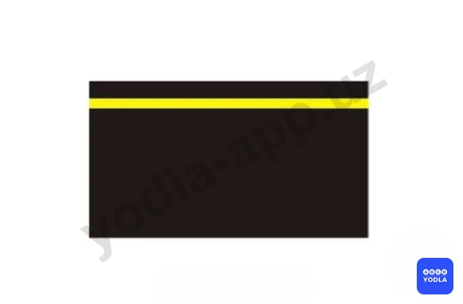

⬜ A. Разрешается
⬜ B. Запрещается
⬜ C. Разрешается в отсутствии маршрутных транспортных средств.
✅ D. Разрешается только маршрутным транспортным средствам

> 💡 Обратим внимание на вопрос. В нём спрашивается, разрешена ли высадка пассажиров в зоне данной жёлтой линии. Да, разрешена, но только для маршрутных транспортных средств. Следовательно, правильный ответ — разрешено только маршрутным транспортным средствам.

---

## Вопрос 9

**Где заканчивается зона действия знака 3.27 "Остановка запрещена" в данной ситуации?**

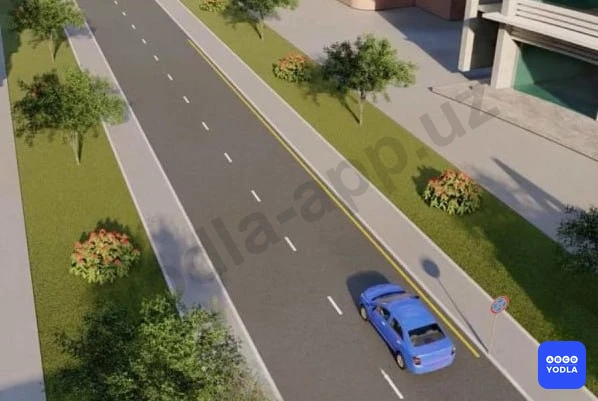

⬜ A. У первого перекрёстка
⬜ B. В конце населенного пункта
✅ C. В конце желтой линии дорожной разметки.

> 💡 Вопрос заключается в том, где заканчивается зона действия данного ограничения. Как видно, вдоль края проезжей части нанесена сплошная жёлтая линия. Ограничение действует на всём протяжении этой линии и прекращает своё действие в месте её окончания.

Следовательно, правильный ответ — зона действия заканчивается в конце жёлтой линии.

---

## Вопрос 10

**В каких направлениях разрешается движение?**

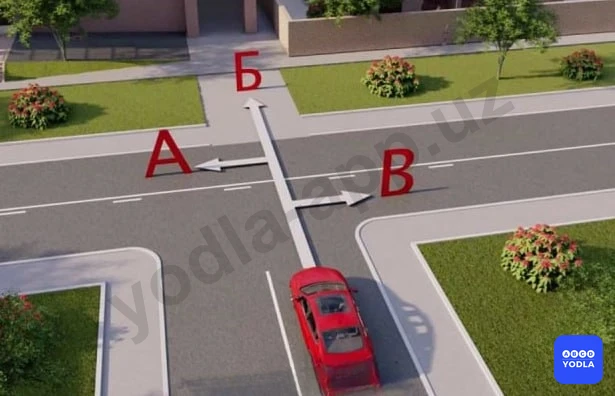

⬜ A. По направлению « А »
⬜ B. По направлению « Б »
⬜ C. По направлению « В »
✅ D. По направлениям « А », « Б » и « В »
⬜ E. По направлениям « Б » и « В »

> 💡 В данной ситуации движение разрешено во всех направлениях.

Причина заключает��я в том, что отсутствуют дорожные знаки или разметка, запрещающие поворот направо. Также нет ограничений для движения прямо.

Поворот налево тоже не запрещён, поскольку на дороге нанесена прерывистая линия разметки, которую разрешается пересекать.

Следовательно, в данной ситуации движение разрешено по всем указанным направлениям.

---

## Вопрос 11

**Данная горизонтальная разметка выполняет следующую функцию:**

⬜ A. Обозначает специальную дорожку для пешеходов
⬜ B. Обозначает дорожку для велосипедистов, стрелки показывают направление движения
✅ C. Обозначает пешеходный переход, стрелки указыают направление движения пешеходов

> 💡 Согласно шестнадцатому и семнадцатому абзацу раздела 1 приложения 2 ПДД: Горизонтальная разметка 1.14.2 (зебра) обозначает нерегулируемый пешеходный переход. Стрелы разметки 1.14.2 указывают направление движения пешеходов.

---

## Вопрос 12

**По какому пути из числа обозначенных стрелками разрешено движение?**

✅ A. Только прямо
⬜ B. Налево и в обратном направлении
⬜ C. Прямо, налево и в обратном направлении

> 💡 Согласно горизонтальной разметке 1.11 раздела 1 приложения № 2 к ПДД, данная разметка разделяет транспортные потоки противоположных или попутных направлений на участках дорог, где перестроение разрешено только из одной полосы; обозначает места, предназначенные для разворота, въезда и выезда со стояночных площадок и т. п., где движение разрешено только в одну сторону. Линию 1.11 разрешается пересекать со стороны прерывистой, а также и со стороны сплошной, но только при завершении обгона или объезда.

---

## Вопрос 13

**Что обозначают такие стрелы на проезжей части?**

⬜ A. Предупреждают водителя о приближении к опасному участку дороги
✅ B. Предупреждают о приближении к сужению проезжей части
⬜ C. Указывают направление опасного поворота дороги

> 💡 Линия 1.19 раздела 1 приложения № 2 к ПДД, предупреждает о приближении к сужению проезжей части (участку, где уменьшается количество полос движения в данном направлении) или к линии разметки 1.1 или 1.11, разделяющей транспортные потоки противоположных направлений. В первом случае может применяться в сочетании со знаками 1.18.1 – 1.18.3.

---

## Вопрос 14

**Какая из этих линий обозначает остановку маршрутных транспортных средств?**

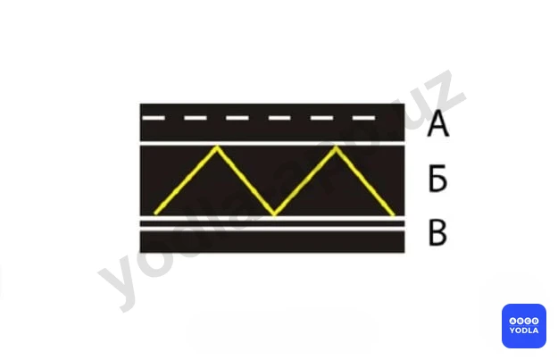

⬜ A. «А»
✅ B. «Б»
⬜ C. «В»
⬜ D. «А» и «Б»
⬜ E. «А» и «В»

> 💡 Линия 1.17 раздела 1 приложения № 2 к ПДД, обозначает остановки маршрутных транспортных средств и стоянки такси.

---

## Вопрос 15

**Какая из этих линий разметки используется для обозначения границ полос движения; на которых осуществляется реверсивное движение?**

⬜ A. Линия 1
✅ B. Линия 2
⬜ C. Линия 3
⬜ D. Линия 2 и 3
⬜ E. Линия 3 и 4

> 💡 Разметка 1.9 раздела 1 приложения № 2 к ПДД, обозначает границы полос движения, на которых осуществляется реверсивное движение; разделяет транспортные потоки противоположных направлений (при выключенных реверсивных светофорах) на дорогах, где осуществляется реверсивное движение.

---

## Вопрос 16

**С каким дорожным знаком применяется «стоп - линия»?**

⬜ A. Со знаком «Уступите дорогу»
✅ B. Со знаком «Движение без остановки запрещено»
⬜ C. Со знаком «Уступите дорогу» и со знаком «Движение без остановки запрещено»

> 💡 Линия 1.12 раздела 1 приложения № 2 к ПДД (стоп-линия) – указывает на место, где водитель должен остановиться при наличии знака 2.5 «Движение без остановки запрещено»  или при запрещающем сигнале светофора (регулировщика).

---

## Вопрос 17

**С каким дорожным знаком применяется эта разметка?**

✅ A. Со знаком «Уступите дорогу»
⬜ B. Со знаком «Движение без остановки запрещено»
⬜ C. С предупреждающим знаком «Пересечение равнозначных дорог»
⬜ D. Со всеми перечисленными знаками

> 💡 Линия 1.13 раздела 1 приложения № 2 к ПДД, указывает место, где водитель должен при необходимости остановиться, уступая дорогу транспортным средствам, движущимся по пересекаемой дороге. При знаке 2.4. «Уступите дорогу» водитель должен уступить дорогу транспортным средствам, движущимся по пересекаемой дороге.

---

## Вопрос 18

**Где наносится сплошная желтая линия; запрещающая остановку?**

⬜ A. На проезжей части
⬜ B. У края проезжей части
✅ C. У края проезжей части или по верху бордюров
⬜ D. Только по верху бордюра

> 💡 Горизонтальная разметка 1.4 (сплошная желтая линия) - обозначает места, где запрещена остановка. Применяется самостоятельно или в сочетании со знаком 3.27 и наносится у края проезжей части или по верху бордюра.

---

## Вопрос 19

**Эта дорожная разметка обозначает?**

⬜ A. Зону, в которой запрещается обгонять все транспортные средства, кроме одиночных, движущихся со скоростью менее 30 км/ч двухколесных мотоциклов, велосипедистов
✅ B. . Приближение к сужению проезжей части или к линии разметки; разделяющей транспортные потоки противоположных направлений
⬜ C. Приближение к полосе проезжей части; предназначенной для движения только маршрутных транспортных средств

> 💡 Линия 1.19 раздела 1 приложения № 2 к ПДД, предупреждает о приближении к сужению проезжей части (участку, где уменьшается количество полос движения в данном направлении) или к линии разметки 1.1 или 1.11, разделяющей транспортные потоки противоположных направлений. В первом случае может применяться в сочетании со знаками 1.18.1 – 1.18.3.

---

## Вопрос 20

**Что обозначает прерывистая широкая линия?**

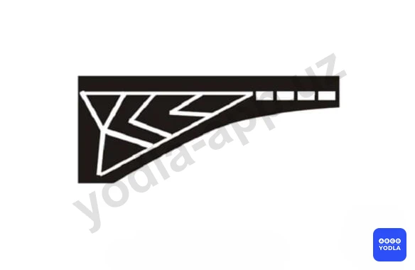

⬜ A. Границу между проезжей частью дороги и обочиной
✅ B. Границу между основной проезжей частью и полосой разгона или торможения
⬜ C. Площадки для остановки и стоянки транспортных средств

> 💡 1.8 широкая прерывистая линия раздела 1 приложения № 2 к ПДД, – обозначает границу между полосой разгона или торможения и основной полосой проезжей части (на перекрестках, пересечениях дорог на разных уровнях, в зоне автобусных остановок и т. п.). Линию 1.8 пересекать разрешается с любой стороны.

---

## Вопрос 21

**Что означает эта разметка?**

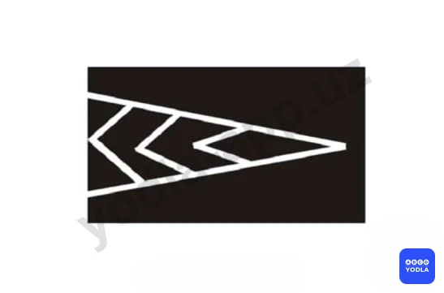

✅ A. Направляющий островок в местах слияния транспортных потоков
⬜ B. Островок для пешеходов на опасных участках движения
⬜ C. Границу места стоянки транспортных средств
⬜ D. Островок; обозначающий в местах разделения транспортных потоков

> 💡 Линия 16.3 раздела 1 приложения № 2 к ПДД, обозначает направляющие островки в местах разделения или слияния транспортных потоков.

---

## Вопрос 22

**Прерывистая линия; у которой длина штрихов в три раза превышает промежутки между ними, обозначает:**

⬜ A. Границы между полосой разгона или торможения и основной полосой проезжей части
⬜ B. Края проезжей части на автомагистралях
✅ C. Приближение к сплошной линии разметки; которая разделяет транспортные потоки противоположных или попутных направлений

> 💡 Согласно горизонтальной разметке 1.6, раздела 1 приложения № 2 к ПДД, линия 1.6 (линия приближения – прерывистая линия, у которой длина штрихов в три раза превышает промежутки между ними) – предупреждает о приближении к разметке 1.1 или 1.11, которая разделяет транспортные потоки противоположных или попутных направлений. Линию 1.6 пересекать разрешается с любой стороны.

---

## Вопрос 23

**Эта дорожная разметка:**

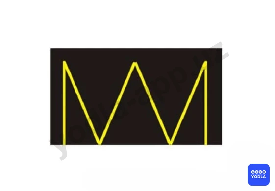

⬜ A. Обозначает стояночные места; где указаны способы постановки механических транспортных средств на около тротуарной стоянке
⬜ B. Обозначает места; где запрещена остановка механических транспортных средств
✅ C. Обозначает остановку маршрутных транспортных средств и стоянки такси

> 💡 Линия 1.17 (зигзагообразная желтая) раздела 1 приложения № 2 к ПДД, обозначает остановку маршрутных транспортных средств и стоянки такси.

---

## Вопрос 24

**Эта горизонтальная дорожная разметка обозначает:**

⬜ A. Сужение проезжей части, где уменьшается количество полос движения в данном направлении
✅ B. Место, где водитель должен при необходимости остановиться, уступая дорогу транспортным средствам движущимся по пересекаемой дороге
⬜ C. Приближение к месту где запрещена остановка

> 💡 Данная дорожная разметка применяется совместно со знаком «Уступите дорогу». Она указывает водителю на необходимость уступить дорогу транспортным средствам, движущимся по пересекаемой дороге.

Кроме того, эта разметка показывает место, где водитель должен остановиться при необходимости. Следовательно, она обозначает границу, перед которой следует уступить дорогу и при необходимости остановиться.

---

## Вопрос 25

**Разрешается ли стоянка транспортных средств на правой полосе дороги отделенной сплошной белой линией разметки и обозначенной дорожным знаком «Полоса для маршрутных транспортных средств»?**

⬜ A. Разрешается если нет знака запрещающего стоянку
✅ B. Запрещается
⬜ C. Разрешается только автомобилям которые обслуживают предприятия находящиеся в этой зоне или принадлежат гражданам проживающим в ближайших дома

> 💡 Вопрос заключается в том, разрешена ли стоянка на правой полосе дороги, выделенной для маршрутных транспортных средств и отделённой сплошной белой линией.

В данной ситуации полоса А предназначена для маршрутных транспортных средств и отделена сплошной линией разметки. Обычным транспортным средствам движение и стоянка на этой полосе не разрешаются.

Следовательно, стоянка в данном месте запрещена.

Правильный ответ — стоянка не разрешается.

---

## Вопрос 26

**Эта горизонтальная дорожная разметка обозначает:**

⬜ A. Запрещается движение в указанных направлениях
✅ B. Указывает разрешенные на перекрестке направления движения по полосам
⬜ C. Приближение к пересечению дорог на котором движение разрешается во всех направлениях

> 💡 Данная дорожная разметка обычно наносится на дорогах, чаще всего перед перекрёстками. Она показывает водителям, в каких направлениях разрешено движение с каждой полосы.

То есть эта разметка указывает разрешённые направления движения по полосам на перекрёстке.

Следовательно, правильный ответ — обозначает разрешённые направления движения по полосам на перекрёстке.

---

## Вопрос 27

**Разрешается ли пересекать прерывистую двойную линию разметки при отсутствии реверсивных светофоров или когда они отключены?**

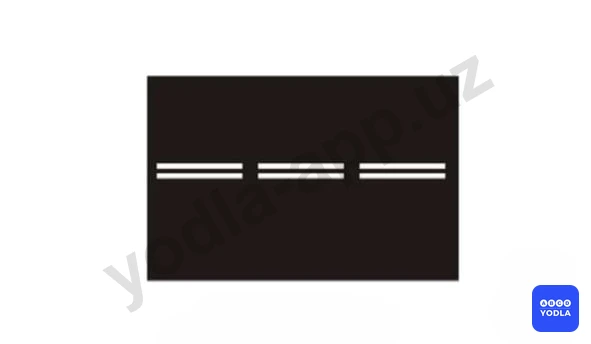

⬜ A. Разрешается если она расположена слева от водителя
✅ B. Разрешается если она расположена справа от водителя
⬜ C. Разрешается с любой стороны
⬜ D. Запрещается

> 💡 Вопрос заключается в том, разрешается ли пересекать двойную прерывистую линию при отсутствии или отключении реверсивных светофоров.

Такая разметка применяется на дорогах с реверсивным движением. Направление движения по реверсивной полосе регулируется специальными светофорами, и в определённые моменты эта полоса может использоваться встречным потоком.

Если реверсивные светофоры не работают или отключены, водитель не должен выезжать на реверсивную полосу. Пересечение двойной прерывистой линии допускается только для возвращения в свою полосу движения, если водитель находится справа от этой разметки.

Следовательно, правильный ответ — пересечение разрешается только водителю, находящемуся справа от линии разметки.

---

## Вопрос 28

**Разрешается ли пересекать сплошную линию горизонтальной разметки?**

⬜ A. Разрешается если она расположена справа от водителя
✅ B. Разрешается только в случае, если линия обозначает край проезжей части дороги
⬜ C. Разрешается только при маневрировании; когда линия обозначает границы полос движения одного направления

> 💡 Вопрос заключается в том, разрешается ли наезжать на сплошную линию дорожной разметки.

В большинстве случаев пересекать или наезжать на сплошную линию запрещается. Однако существуют исключения.

Если сплошная линия обозначает край проезжей части, например в местах въезда во двор, жилую зону, на территорию предприятия или другую прилегающую территорию, её пересечение допускается.

Следовательно, правильный ответ — разрешается пересекать сплошную линию, обозначающую край проезжей части.

---

## Вопрос 29

**Разрешается ли заезжать на островок размеченный белыми линиями?**

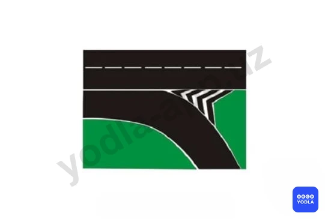

⬜ A. Разрешается только для остановки
⬜ B. Разрешается при движении задним ходом
✅ C. Запрещается

> 💡 Вопрос заключается в том, разрешается ли пересекать или наезжать на сплошную линию горизонтальной дорожной разметки.

В большинстве случаев пересечение сплошной линии запрещено. Однако существуют исключения.

Если сплошная линия обозначает край проезжей части, например в местах въезда во двор, жилую зону, на прилегающую территорию или выезда из неё, пересекать такую линию разрешается.

Следовательно, правильный ответ — разрешается пересекать сплошную линию, обозначающую край проезжей части.

---

## Вопрос 30

**Что обязан выполнить водитель транспортного средства приблизившись к перекрестку перед которым нанесена «cтоп-линия» и включен зеленый сигнал светофора?**

⬜ A. Остановиться у «cтоп-линий», а затем возобновить движение
✅ B. Продолжить движение через перекресток без остановки

> 💡 Ситуация следующая: водитель приближается к светофору, перед которым нанесена стоп-линия. При этом на светофоре горит зелёный сигнал.

В варианте А указано, что водитель должен остановиться перед стоп-линией, а затем продолжить движение.

В варианте Б указано, что водитель должен продолжить движение без остановки.

Правильный ответ — вариант Б. Несмотря на наличие стоп-линии, если светофор разрешает движение зелёным сигналом, водитель может продолжать движение без остановки.

Останавливаться перед стоп-линией необходимо только при запрещающих сигналах светофора — красном или жёлтом. При зелёном сигнале остановка не требуется.

---

## Вопрос 31

**Что означает эта разметка?**

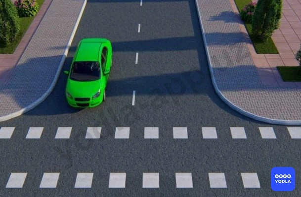

⬜ A. Пешеходный переход
✅ B. Место где велосипедная дорожка пересекает проезжую часть
⬜ C. Место перегона скота

> 💡 Данная квадратная горизонтальная дорожная разметка обозначает пешеходную дорожку. То есть она указывает место, где пешеходная дорожка пересекает проезжую часть, и предназначена для движения пешеходов.

---

## Вопрос 32

**Что означает эта разметка?**

⬜ A. Обозначает полосу предназначенную только для движения автобусов
✅ B. Обозначает полосу предназначенную только для движения маршрутных транспортных средств
⬜ C. Обозначает полосу предназначенную для движения автобусов и троллейбусов
⬜ D. Обозначает полосу предназначенную для движения автобусов и маршрутных такси (особо малых автобусов)

> 💡 Буква «А», нанесённая на проезжую часть, обозначает полосу, предназначенную для движения маршрутных транспортных средств.

Следует помнить, что к маршрутным транспортным средствам относятся автобусы, троллейбусы и маршрутные такси. Поэтому, даже если в вариантах ответа перечислены отдельные виды транспорта, наиболее правильным и полным ответом будет — маршрутные транспортные средства.

Следовательно, данная разметка обозначает полосу для движения маршрутных транспортных средств.

---

## Вопрос 33

**Водители каких транспортных средств неправильно произвели остановки для высадки пассажиров?**

✅ A. Водитель красного автомобиля
⬜ B. Синий автомобиль
⬜ C. Водитель мотоцикла
⬜ D. Водители обоих автомобилей
⬜ E. Все водители

> 💡 Обратим внимание на рисунок. Красный автомобиль остановился у сплошной жёлтой линии, синий автомобиль — у жёлтой зигзагообразной разметки, а мотоцикл находится возле прерывистой жёлтой линии.

Начнём анализ снизу. Жёлтая зигзагообразная разметка обозначает остановку автобусов и троллейбусов. В этом месте другие транспортные средства могут кратковременно останавливаться для посадки или высадки пассажиров, если они не создают помех маршрутному транспорту. Поэтому водитель синего автомобиля правила не нарушил.

Водитель мотоцикла также не нарушил правила. При необходимости он может кратковременно остановиться для высадки пассажира.

Красный автомобиль находится в зоне сплошной жёлтой линии. Такая разметка запрещает остановку транспортных средств. Следовательно, водитель красного автомобиля нарушил правила.

Таким образом, неправильно остановился только водитель красного автомобиля.

---

## Вопрос 34

**Разрешается ли использовать для движения посадочную площадку обозначенную разметкой?**

⬜ A. Разрешается
✅ B. Запрещается
⬜ C. Разрешается при отсутствии трамвая на остановке

> 💡 Вопрос заключается в том, разрешается ли использовать для движения площадку остановки, обозначенную разметкой 1.17.

Нет, не разрешается. Эта площадка предназначена для остановки автобусов и троллейбусов. Использование её для движения обычными транспортными средствами будет нарушением требований дорожной разметки.

Следовательно, использовать данную остановочную площадку для движения нельзя.

Правильный ответ — не разрешается.

---

## Вопрос 35

**Разрешено ли пересекать сплошную белую линию разметки; обозначающую край проезжей части на автомагистрали?**

✅ A. Разрешается
⬜ B. Запрещается
⬜ C. Запрещается, если на автомагистрали очень интенсивное движение

> 💡 Многие ошибаются именно в этом вопросе и выбирают ответ «запрещено». Однако правильный ответ — разрешается.

Данная линия разметки обозначает край проезжей части на автомагистрали. Если транспортное средство вынуждено остановиться или произошло техническое повреждение, водитель имеет право пересечь эту линию и выехать на обочину.

Следовательно, в данной ситуации пересекать линию разметки разрешается.

---

## Вопрос 36

**Разрешена ли остановка в этом месте?**

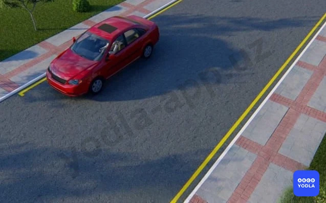

⬜ A. Разрешен
✅ B. Запрещена

> 💡 В данном месте остановка не разрешается, поскольку транспортное средство находится в зоне действия сплошной жёлтой линии. Такая разметка запрещает остановку транспортных средств.

Если автомобиль остановится после окончания жёлтой линии, остановка будет разрешена.

Следовательно, в данной ситуации остановка запрещена, а разрешается только после окончания жёлтой линии.

---

## Вопрос 37

**Какие из этих линий разрешают остановку маршрутным транспортным средствам?**

⬜ A. «А»
⬜ B. «Б»
⬜ C. «В»
✅ D. «А», «Б», «В»

> 💡 Вопрос заключается в том, на каких из указанных видов разметки маршрутным транспортным средствам разрешается остановка. Правильный ответ — А, Б и В, то есть все варианты.

В варианте А жёлтая прерывистая линия запрещает стоянку, но остановка разрешается.

Вариант Б обозначает остановочный пункт маршрутных транспортных средств, поэтому они имеют право останавливаться в этом месте.

В варианте В действует запрет остановки для обычных транспортных средств, однако для маршрутных транспортных средств предусмотрено исключение, и им остановка разрешена.

Поэтому многие ошибочно выбирают только вариант Б, однако правильный ответ — А, Б и В.

---

## Вопрос 38

**Сплошная желтая линия горизонтальной разметки в сочетании со знаком «Остановка запрещена» разрешает остановку:**

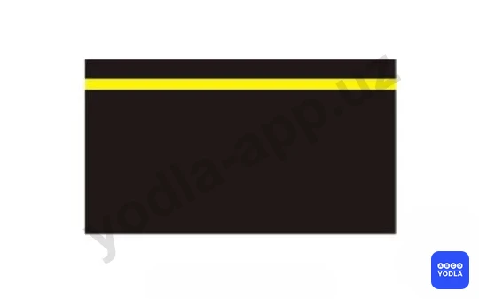

⬜ A. Всем транспортным средствам производящим высадку пассажиров
⬜ B. Автобусам и троллейбусам
✅ C. Только маршрутным транспортным средствам и немаршрутных легких такси

---

## Вопрос 39

**Что обозначает данная разметка?**

⬜ A. Полосу для движения маршрутных транспортных средств
⬜ B. Полосу движения специальных автомобилей
✅ C. Обозначает границу полосы реверсивного движения

---

## Вопрос 40

**С каким дорожным знаком может быть применена разметка в виде желтой прерывистой линии?**

⬜ A. «Остановка запрещена»
✅ B. «Стоянка запрещена»
⬜ C. «Стоянка по нечетным числам запрещена»

> 💡 Разметка 1.10 (желтая прерывистая) раздела 1 приложения № 2 к ПДД, обозначает места, где запрещена стоянка. Применяется самостоятельно или в сочетании со знаком 3.28 «Стоянка запрещена»  и наносится у края проезжей части или по верху бордюра.

---

## Вопрос 41

**Чем должен руководствоваться водитель; когда значение дорожных знаков и линий разметки противоречат друг другу?**

⬜ A. Линиями разметки
✅ B. Дорожными знаками

> 💡 Если значения дорожных знаков и дорожной разметки противоречат друг другу, водитель обязан руководствоваться требованиями дорожных знаков. Следовательно, в такой ситуации дорожный знак имеет преимущество перед дорожной разметкой.

---

## Вопрос 42

**Разрешается ли в этом месте произвести разворот?**

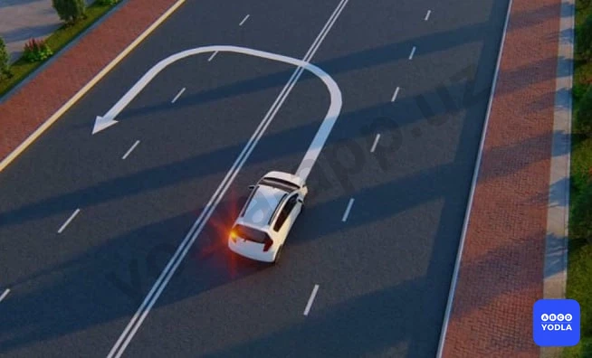

⬜ A. Разрешается
✅ B. Запрещается

> 💡 Согласно пункту 1.3 раздела 1 приложения № 2 к ПДД, линия 1.3 – разделяет транспортные потоки противоположных направлений на дорогах, имеющих четыре полосы движения и более; Линию 1.3 пересекать запрещается.

---

## Вопрос 43

**Что обозначает данная разметка?**

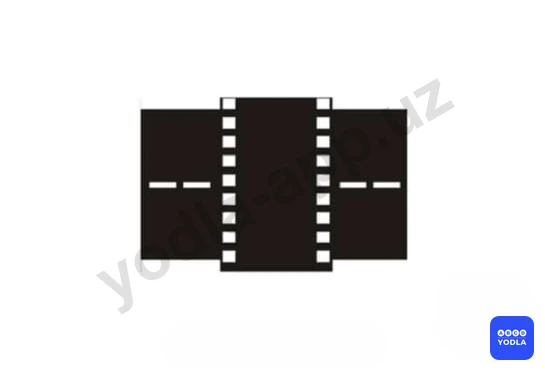

⬜ A. Место; где необходимо остановиться; чтобы пропустить пешеходов; переходящих проезжую часть
✅ B. Место; где велосипедная дорожка пересекает проезжую часть
⬜ C. Нерегулируемый пешеходный переход

> 💡 Линия 1.15 раздела 1 приложения №2 к ПДД, обозначает место, где велосипедная дорожка пересекает проезжую часть.

---

## Вопрос 44

**Что обозначает данная разметка?**

⬜ A. Пешеходный переход; где движение регулируется светофором
✅ B. Место; где велосипедная дорожка пересекает проезжую часть
⬜ C. Место; где пешеходная дорожка пересекает проезжую часть

> 💡 Горизонтальная разметка 1.15 обозначает место, где велосипедная дорожка пересекает проезжую часть.

---

## Вопрос 45

**Разрешается ли обгон на этом участке дороги?**

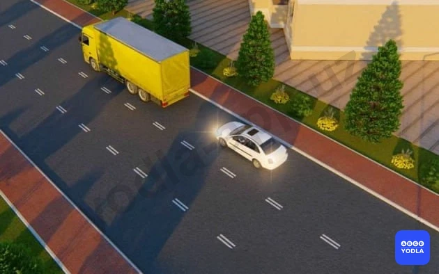

⬜ A. Разрешается
✅ B. Запрещается

> 💡 Линия 1.9 раздела 1 приложения № 2 к ПДД, обозначает границы полос движения, на которых осуществляется реверсивное движение; разделяет транспортные потоки противоположных направлений (при выключенных реверсивных светофорах) на дорогах, где осуществляется реверсивное движение. При отсутствии реверсивных светофоров или когда они отключены, линию 1.9 разрешается пересекать, если она расположена справа от водителя.

---

## Вопрос 46

**В каких случаях Вы можете наезжать на прерывистые линии разметки, разделяющие проезжую часть на полосы движения?**

✅ A. Только при перестроении
⬜ B. Только если на дороге нет других транспортных средств
⬜ C. Во всех перечисленных случаях

> 💡 ПДД Общие положения: Полоса движения любая из продольных полос проезжей части, обозначенная или необозначенная дорожной разметкой и имеющая ширину, достаточную для движения автомобилей в один ряд.

---

## Вопрос 47

**Что означает разметка в виде надписи «СТОП» на проезжей части?**

⬜ A. Предупреждает о приближении к стоп-линии перед регулируемым перекрестком
✅ B. Предупреждает о приближении к стоп-линии и знаку «Движение без остановки запрещено»
⬜ C. Предупреждает о приближении к знаку «Уступите дорогу»

> 💡 Bu "STOP" yozuvi ko‘rinishidagi yo‘l chizig‘i haydovchini to‘xtash chizig‘i hamda "To‘xtamasdan harakatlanish taqiqlanadi" yo‘l belgisi o‘rnatilgan joyga yaqinlashayotganligi haqida ogohlantiradi.

---

## Вопрос 48

**По какой траектории водитель автомобиля нарушил правила при повороте налево?**

⬜ A. Только по траектории «А»
⬜ B. Только по траектории «Б»
✅ C. По любой траектории из указанных

> 💡 Вопрос заключается в том, по какому направлению водитель нарушает правила при повороте налево.

Поворот по направлению Б запрещён, поскольку для данной полосы установлен знак, разрешающий движение только прямо.

Поворот по направлению А также запрещён, так как водитель должен был заранее занять соответствующую полосу для поворота. Кроме того, он пересёк сплошную линию разметки.

Следовательно, водитель нарушает правила при движении по всем указанным направлениям.

Правильный ответ — нарушение допускается по всем указанным направлениям.

---

## Вопрос 49

**Какой маневр Вам запрещается выполнить при наличии данной линии разметки?**

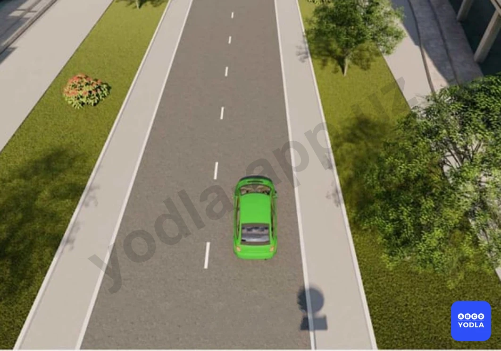

⬜ A. Обгон
⬜ B. Объезд
⬜ C. Разворот
✅ D. Разрешает все перечисленные маневры

> 💡 Вопрос заключается в том, какие манёвры запрещает данная дорожная разметка.

Эта разметка не запрещает обгон, объезд, разворот или другие перечисленные манёвры. Она не устанавливает для водителя ограничений на выполнение данных действий.

Следовательно, выполнение всех перечисленных манёвров разрешается.

Правильный ответ — ни один из перечисленных манёвров не запрещён.

---

## Вопрос 50

**Что обозначают прерывистые линии разметки на перекрестке?**

⬜ A. Обязательное направлениедвижения на перекрестке
✅ B. Границы полос движения в пределах перекрестка

> 💡 Прерывистые линии разметки на перекрёстке обозначают границы полос движения. Они помогают водителям сохранять свою полосу при проезде перекрёстка.

Следовательно, правильный ответ — обозначают границы полос движения на перекрёстке.

---

## Вопрос 51

**В данной ситуации Вы должны:**

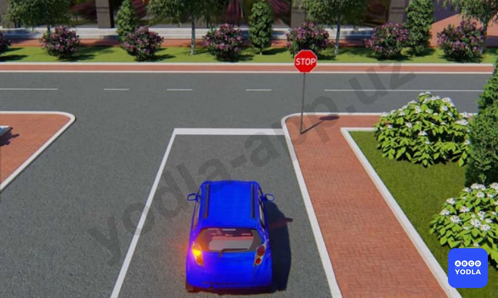

⬜ A. Остановиться у знака
✅ B. Остановиться у стоп-линии
⬜ C. При отсутствии других транспортных средств проехать перекресток без остановки

> 💡 В данной ситуации водитель должен остановиться перед стоп-линией. Как видно на рисунке, водитель остановился раньше, не доехав до стоп-линии.

Такая остановка считается неправильной. Если требуется остановка, транспортное средство должно остановиться непосредственно перед стоп-линией.

Следовательно, правильный ответ — необходимо остановиться перед стоп-линией.

---

## Вопрос 52

**Что означает эта горизонтальная линия?**

⬜ A. Велосипедная дорожка
✅ B. Искусственная неровность дороги
⬜ C. Место, где останавливаются такси

> 💡 Данная горизонтальная дорожная разметка обозначает искусственную неровность дороги. Она предупреждает водителя о наличии впереди искусственной неровности, предназначенной для снижения скорости движения.

---

## Вопрос 53

**Разметка в виде треугольника на полосе движения:
**

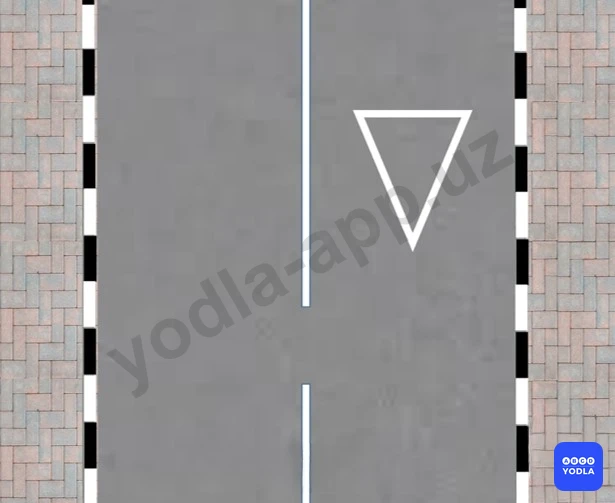

⬜ A. Обозначает опасный участок дороги
✅ B. Предупреждает Вас о приближении к месту, где нужно уступить дорогу
⬜ C. Указывает место, где Вам необходимо остановиться

> 💡 Данная дорожная разметка предупреждает водителя о приближении к месту, где необходимо уступить дорогу. Обычно она применяется вместе со знаком «Уступите дорогу» и соответствующей линией разметки.

Эта разметка информирует водителя о том, что впереди находится участок, где он обязан уступить дорогу другим транспортным средствам.

Следовательно, правильный ответ — Ф2.

---

## Вопрос 54

**Что обозначает эта разметка с надписью “50”?**

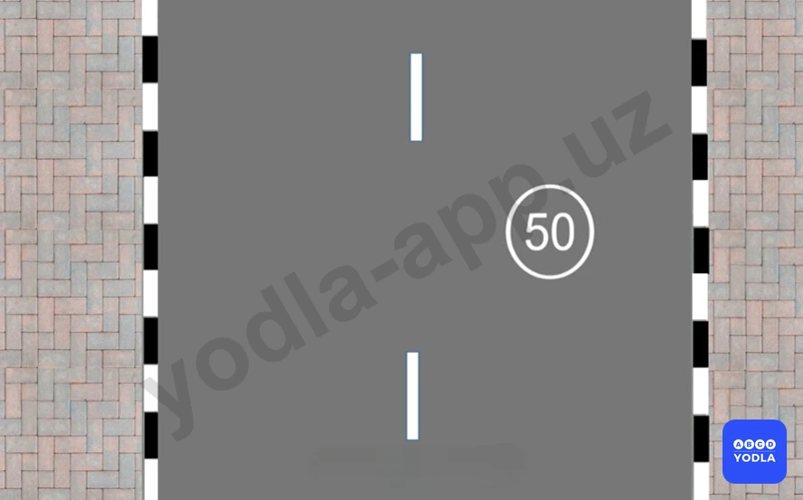

✅ A. Разрешенную максимальную скорость на данном участке дороги
⬜ B. Номер дороги или маршрута
⬜ C. Рекомендуемую скорость движения на данном участке дороги

> 💡 Данная дорожная разметка с числом «50» указывает, что максимально разрешённая скорость на данном участке дороги составляет 50 км/ч. Она дублирует значение запрещающего дорожного знака, ограничивающего скорость, и напоминает водителю о действующем ограничении.

Следовательно, эта разметка обозначает максимально разрешённую скорость и повторяет требования соответствующего дорожного знака.

---

## Вопрос 55

**В каких местах наносится дорожная разметкабело-красного цвета (зебра 1.14.4) для обозначения места пешеходного перехода?**

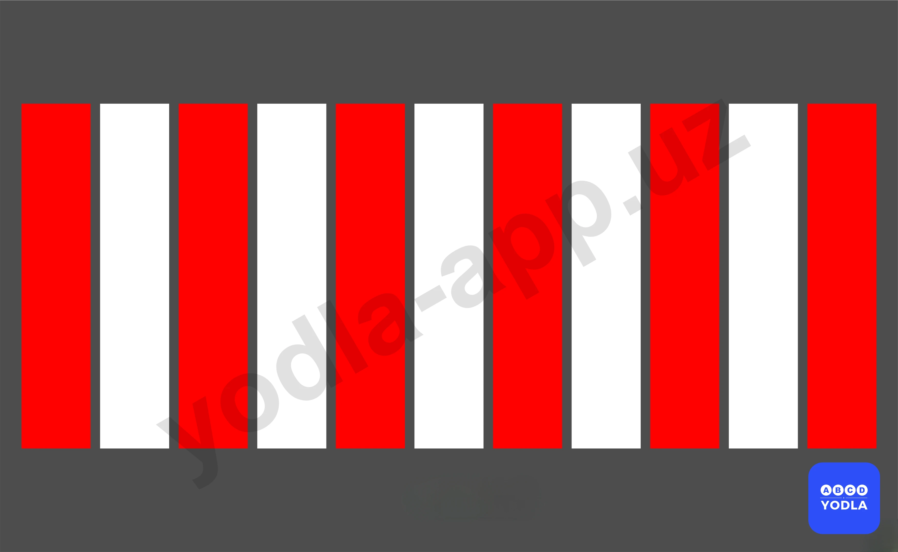

⬜ A. В местах скопления пешеходов
⬜ B. Перед зданиями коммерческого,культурного и бытового обслуживания
✅ C. Перед школами и дошкольнымиобразовательными
⬜ D. Все ответы верны

> 💡 Данная бело-красная разметка типа «зебра» предназначена для использования возле школ и дошкольных образовательных учреждений.

При внесении изменений в правила дорожного движения предполагалось применять такую разметку для более заметного обозначения пешеходных переходов рядом с детскими учреждениями. На практике сейчас чаще используются приподнятые пешеходные переходы.

Однако в экзаменационных вопросах правильным считается ответ, что данная разметка применяется возле школ и дошкольных образовательных учреждений.

Следовательно, правильный ответ — возле школ и дошкольных образовательных учреждений.

---

## Вопрос 56

**Эта дорожная разметка обозначает:**

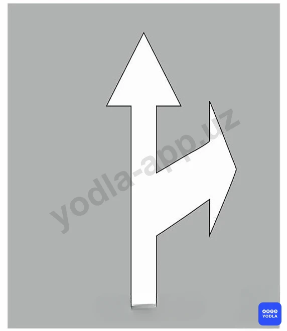

⬜ A. Запрещается движение в указанных направлениях
✅ B. Указывает разрешение на перекрестке направления движения по полосам
⬜ C. Приближение к пересечению дорог на котором движение разрешается во всех направлениях

> 💡 Данная горизонтальная дорожная разметка обычно наносится перед перекрёстками и показывает водителям, в каких направлениях разрешено движение с каждой полосы.

Следовательно, эта разметка обозначает разрешённые направления движения по полосам на перекрёстке.

Правильный ответ — показывает разрешённые направления движения по полосам на перекрёстке.

---

## Вопрос 57

**В каком направлении вам разрешено проезжать перекресток?**

✅ A. Только прямо
⬜ B. Прямо и направо
⬜ C. Только направо

> 💡 Вопрос заключается в том, в каком направлении разрешено движение через перекрёсток.

В данной ситуации дорожная разметка и дорожный знак противоречат друг другу. В таких случаях водитель обязан руководствоваться требованиями дорожного знака.

Поскольку знак разрешает движение только прямо, движение в других направлениях не допускается.

Следовательно, правильный ответ — разрешено движение только прямо.

---

## Вопрос 58

**Какие из этих линий используются для пешеходных переходов перед школами?**

⬜ A. Линия 1
⬜ B. Линия 2
✅ C. Линия 3

> 💡 Пешеходный переход возле школ и дошкольных образовательных учреждений обозначается третьим видом разметки — бело-красной разметкой типа «зебра».

Следовательно, правильный ответ — третья разметка, бело-красный пешеходный переход.

---

## Вопрос 59

**На каком снимке водитель остановился без нарушения правил?**

⬜ A. На рисунке слева
⬜ B. На рисунке справа
✅ C. На обоих изображениях

> 💡 Вопрос заключается в том, на каком рисунке водитель остановился без нарушения правил.

На первом рисунке водитель остановился перед стоп-линией, что полностью соответствует требованиям правил.

На втором рисунке стоп-линия отсутствует. В такой ситуации водитель имеет право остановиться в месте, откуда обеспечивается видимость пересекаемой дороги и возможность уступить дорогу другим участникам движения.

Следовательно, в обоих случаях водитель действовал правильно и не нарушил правила.

Правильный ответ — на обоих рисунках нарушение отсутствует.

---

## Вопрос 60

**Какой водитель нарушил правило остановки?**

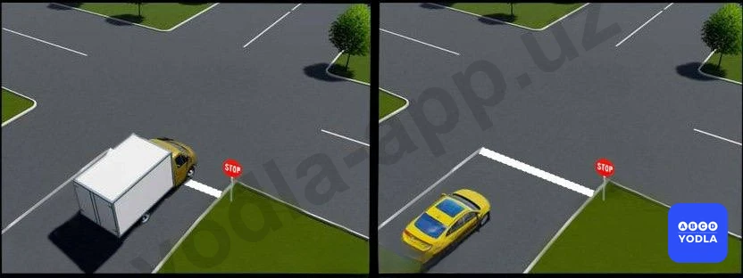

⬜ A. Легковой автомобиль
⬜ B. Грузовой автомобиль
⬜ C. Оба не сломались
✅ D. Оба сломались

> 💡 Вопрос заключается в том, на каком рисунке водитель нарушил правила.

На первом рисунке водитель остановился, не доехав до стоп-линии. В ситуации, когда требуется остановка, транспортное средство должно остановиться непосредственно перед стоп-линией. Поэтому это считается нарушением.

На втором рисунке водитель проехал стоп-линию и остановился за ней. Это также является нарушением правил.

Следовательно, на обоих рисунках водитель нарушил правила.

Правильный ответ — нарушение имеется на обоих рисунках.

---

## Вопрос 61

**Какая горизонтальная разметка обозначает пешеходный переход в «3D» виде?**

⬜ A. «А»
⬜ B. «Б»
✅ C. «В»

> 💡 Вопрос заключается в том, какая дорожная разметка обозначает пешеходный переход с 3D-эффектом.

Если в вопросе указано именно «3D-пешеходный переход», правильным ответом будет вариант В. Эта разметка выполнена таким образом, что создаёт визуальный объёмный эффект.

Если бы речь шла о приподнятом пешеходном переходе, правильным мог бы быть другой вариант. Однако здесь ключевым словом является «3D».

Следовательно, правильный ответ — вариант В.

---

## Вопрос 62

**Какая горизонтальная разметка обозначает «D»-приподнятый пешеходный переход?**

⬜ A. «А»
✅ B. «Б»
⬜ C. «В»

> 💡 В данном вопросе речь идёт о «3D-приподнятом пешеходном переходе».

Обратите внимание, что здесь присутствуют два ключевых слова: «3D» и «приподнятый». Если бы речь шла только о 3D-пешеходном переходе, правильным мог бы быть вариант В. Однако в вопросе также указано, что переход является приподнятым.

Поэтому правильный ответ — вариант Б.

---

## Вопрос 63

**Какая горизонтальная разметка обозначает приподнятый пешеходный переход?**

✅ A. «А»
⬜ B. «Б»
⬜ C. «В»

> 💡 Вопрос заключается в том, какая дорожная разметка обозначает приподнятый пешеходный переход.

Слово «3D» в вопросе отсутствует. Поскольку речь идёт только о приподнятом пешеходном переходе, правильным ответом является вариант А.

Следовательно, разметка А обозначает приподнятый пешеходный переход.

---

## Вопрос 64

**Какая группа дорожных знаков повторяется этой горизонтальной дорожной разметкой?**

⬜ A. Знаки приоритета
✅ B. Предупреждающие знаки
⬜ C. Запрещающие знаки
⬜ D. Информационно-указательные знаки

> 💡 Данная дорожная разметка дублирует значение предупреждающих дорожных знаков.

Для запоминания: предупреждающие дорожные знаки обычно имеют форму треугольника с красной каймой. Поэтому разметка в виде треугольника на проезжей части также повторяет информацию предупреждающих знаков.

Следовательно, правильный ответ — дублирует предупреждающие дорожные знаки.

---

## Вопрос 65

**в каких направлениях разрешено движение водителю красного автомобиля?**

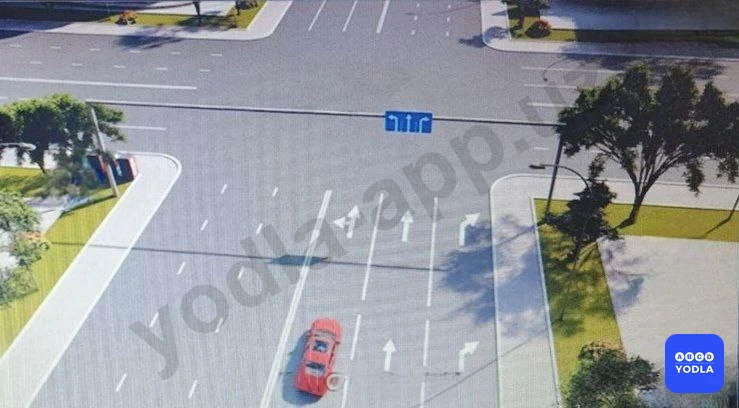

⬜ A. Только налево
✅ B. Налево и в разворот
⬜ C. Прямо и налево

> 💡 Вопрос заключается в том, какой водитель правильно остановился при запрещающем сигнале светофора.

На первом рисунке водитель проехал стоп-линию. Обратите внимание, что здесь установлен знак «STOP», который указывает на наличие стоп-линии. Поскольку водитель остановился уже за стоп-линией, его действия являются неправильными.

На втором рисунке водитель остановился непосредственно перед стоп-линией, как того требуют правила.

Следовательно, правильный ответ — второй рисунок.

---

## Вопрос 66

**Какой водитель автомобиля правильно остановился на запрещающий сигнал светофора**

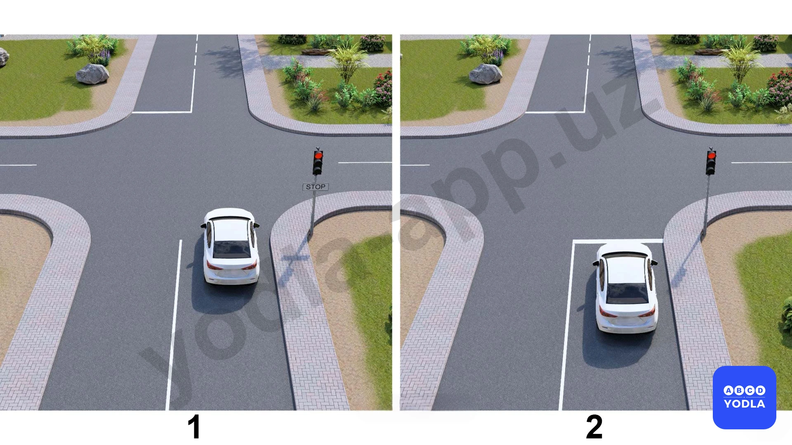

⬜ A. На 1-рисунке
✅ B. На 2-рисунке
⬜ C. На обоих рисунках

> 💡 "На основании пункта 4.1.4 Приложения 1 к ПДД и абзаца 1 пункта 56 главы 9 ПДД: 4.1.4. «Движение прямо или направо».
56. Перед поворотом направо, налево или разворотом водитель обязан заблаговременно занять соответствующее крайнее положение на проезжей части, предназначенной для движения в данном направлении, кроме случаев, когда совершается поворот при въезде на перекресток с круговым движением."

---

## Вопрос 67

**Какому автомобилю разрешено выполнить разворот?**

⬜ A. Обоим
⬜ B. Желтому автомобилю
⬜ C. Синему автомобилю
✅ D. Обоим автомобилям запрещено

> 💡 Вопрос заключается в том, какому автомобилю разрешён разворот.

В данной ситуации разворот не разрешён ни одному из автомобилей.

Жёлтый автомобиль движется со стороны сплошной линии разметки. Поскольку пересекать сплошную линию запрещено, выполнить разворот он не может.

Синий автомобиль находится в правой полосе движения. Разворот должен выполняться из крайней левой полосы, поэтому водитель синего автомобиля также не имеет права выполнять данный манёвр.

Следовательно, правильный ответ — разворот не разрешён ни одному из автомобилей.

---

## Вопрос 68

**Какое транспортное средство нарушает правила?**

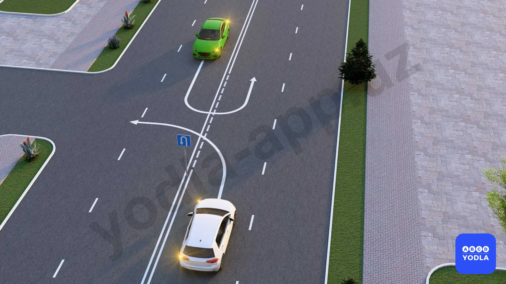

⬜ A. Оба не нарушили
⬜ B. Нарушил зелёный
✅ C. Оба нарушили
⬜ D. Нарушил белый

> 💡 Вопрос заключается в том, какому автомобилю разрешён разворот.

В данной ситуации разворот не разрешён ни одному из автомобилей.

Жёлтый автомобиль движется со стороны сплошной линии разметки. Поскольку пересечение сплошной линии запрещено, выполнить разворот он не может.

Синий автомобиль находится в правой полосе движения. Разворот должен выполняться из крайней левой полосы, поэтому водитель синего автомобиля также не имеет права выполнять этот манёвр.

Следовательно, правильный ответ — разворот не разрешён ни одному из автомобилей.

---

## Вопрос 69

**По какому направлению разрешено движение?**

⬜ A. A и B
✅ B. B и C
⬜ C. По всем направлениям

> 💡 Как видно на рисунке, здесь нанесена сплошная линия разметки. Поэтому выполнить разворот водитель не может, так как пересечение сплошной линии запрещено.

Однако движение прямо и поворот направо разрешены.

Следовательно, правильный ответ — разрешено движение по направлениям Б и С.

---

## Вопрос 70

**Водитель жёлтого автомобиля, если он остановился позади проезжающей машины, должен ли он также остановиться у знака «STOP»?**

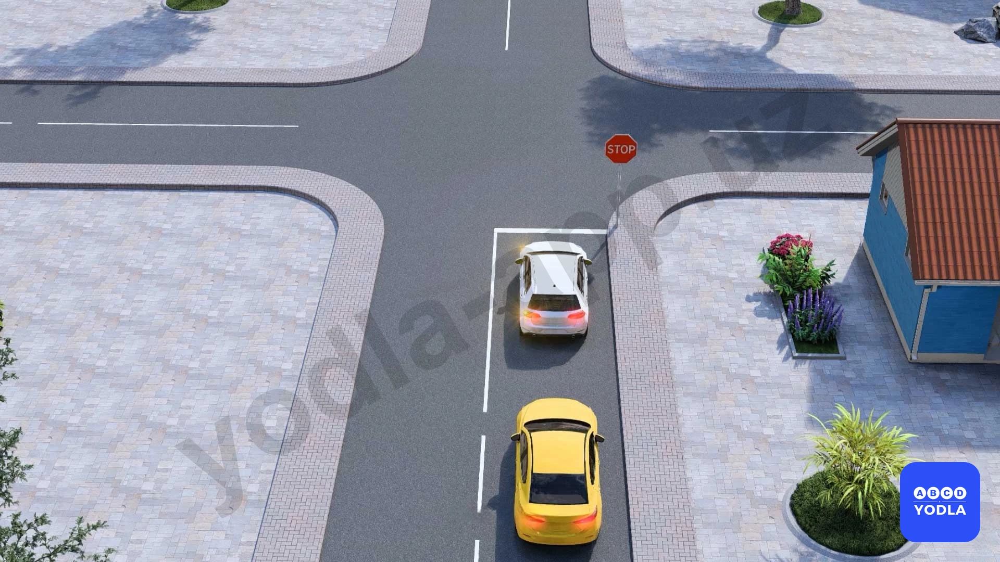

✅ A. Да
⬜ B. Нет

> 💡 Знак «Движение без остановки запрещено» распространяется на все транспортные средства.

Поэтому, если белый автомобиль остановился в соответствии с требованиями этого знака, то следующий за ним жёлтый автомобиль также обязан остановиться. Остановка одного транспортного средства не освобождает другие транспортные средства от выполнения требований знака.

Следовательно, каждое транспортное средство должно самостоятельно остановиться и только после этого продолжить движение.

---

## Вопрос 71

**Из скольких групп состоят дорожные разметки?**

✅ A. Из 2
⬜ B. Из 3
⬜ C. Из 4

> 💡 Дорожная разметка делится на две группы: горизонтальная и вертикальная.

Горизонтальная разметка наносится на проезжую часть и служит для организации дорожного движения. Вертикальная разметка наносится на дорожные сооружения, ограждения и другие объекты для предупреждения водителей и повышения безопасности движения.

Следовательно, дорожная разметка состоит из двух групп: горизонтальной и вертикальной.

---

## Вопрос 72

**Какая дорожная разметка повышает бдительность водителя?**

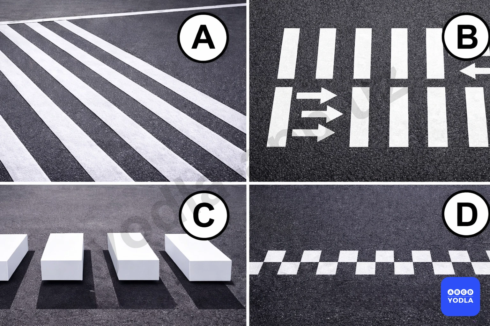

✅ A. A
⬜ B. B
⬜ C. C
⬜ D. D

> 💡 Разметка А относится к горизонтальной дорожной разметке и имеет небольшое возвышение над поверхностью дороги. Такая разметка называется «шумовой полосой».

При проезде по ней колёса автомобиля создают вибрацию и шум, которые привлекают внимание водителя. Это помогает повысить его бдительность и способствует снижению скорости на опасных участках дороги.

Следовательно, данная разметка является шумовой разметкой, предназначенной для предупреждения водителя и повышения его внимательности.

---

