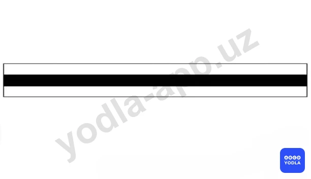
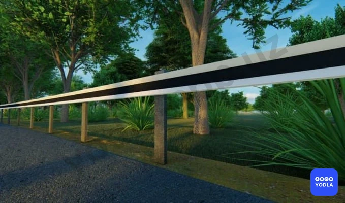
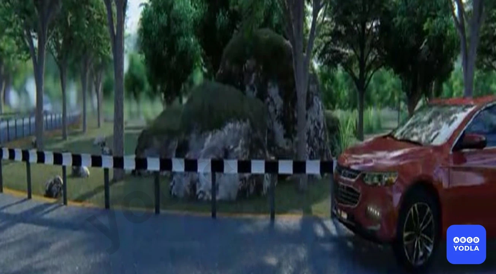

# 13. Вертикальная разметка (боб 2.2)

Всего вопросов: 5

## Вопрос 1

**Эта дорожная разметка применяется для обозначения:**

⬜ A. Дорожной развязки на разных уровнях
⬜ B. Участка дороги, на котором скорость движения ограничена до 40 км/ч
✅ C. Вертикальных элементов дорожных сооружений, когда они представляют опасность для движущихся транспортных средств

> 💡 Правильный ответ заключается в том, что данная вертикальная разметка обозначает элементы дорожных сооружений, которые могут представлять опасность для движущихся транспортных средств.

Если объяснить проще, такая разметка показывает границы мостов, путепроводов, опор и других дорожных сооружений. Она помогает водителям заранее заметить опасные элементы и избежать столкновения с ними.

Следовательно, на практике эта разметка обозначает границы мостов и других дорожных сооружений.

---

## Вопрос 2

**Что обозначает эта вертикальная дорожная разметка?**

⬜ A. Обозначает границы полос движения в опасных местах на дорогах
✅ B. Обозначает боковые поверхности ограждений дорог на других участках
⬜ C. Обозначает бордюры на опасных участках
⬜ D. Обозначает направляющие столбики, надолбы, опоры ограждений и т.п

> 💡 В вопросах по вертикальной разметке данная разметка обозначает боковую границу дорожных ограждений, расположенных у края дороги.

Проще говоря, она показывает водителю границу защитного ограждения или другого препятствия, находящегося возле проезжей части.

Следует помнить, что если разметка выполнена в виде чередующихся чёрно-белых полос, она может использоваться для обозначения опасных поворотов или участков с малым радиусом кривой. Однако в данном случае речь идёт не о малом радиусе.

Следовательно, правильный ответ — обозначает боковую границу дорожных ограждений на других участках дороги.

---

## Вопрос 3

**Что обозначает данная вертикальная разметка?**

⬜ A. Боковые поверхности ограждения дорог на закруглениях малого радиуса
✅ B. Обозначает боковые поверхности ограждений дорог на других участках

> 💡 Как видно на рисунке, эта разметка может напоминать обозначение поворота малого радиуса. Однако в данном случае она не относится к таким участкам.

Причина в том, что здесь используется трёхцветная окраска, характерная для вертикальной разметки, обозначающей боковые поверхности препятствий на других участках дороги.

Такая разметка помогает водителям видеть границы препятствий, деревьев, сооружений и других объектов возле дороги. Её назначение — предотвратить съезд автомобиля с дороги и столкновение с препятствием.

Следовательно, правильный ответ — обозначает боковые поверхности препятствий на других участках дороги.

---

## Вопрос 4

**Что означает эта вертикальная разметка?**

⬜ A. О приближении к железнодорожному переезду
⬜ B. О приближении к опасному перекрестку
✅ C. Обозначает боковые поверхности ограждения дорог на закруглениях малого радиуса крутых спусках и на других опасных участках

> 💡 Если вертикальная разметка выполнена в виде «зебры», то есть в виде чередующихся чёрно-белых полос, она обычно обозначает боковые поверхности дорожных ограждений на участках с малыми радиусами поворота, крутыми изгибами дороги и в других опасных местах.

Такая разметка привлекает внимание водителей и помогает лучше ориентироваться на опасных участках дороги.

Следовательно, правильный ответ — обозначает боковые поверхности дорожных ограждений на участках с малыми радиусами поворота и в других опасных местах.

---

## Вопрос 5

**О чем обозначает Вас вертикальная разметка, нанесенная на ограждение дороги?**

⬜ A. Обозначает приближении к железнодорожному переезду
⬜ B. Обозначает приближении к опасному перекрестку
✅ C. Обозначает боковые поверхности ограждений дорог на закруглениях малого радиуса, крутых спусках, других опасных участках

> 💡 Здесь речь идёт об участке с малым радиусом поворота. Это можно определить по разметке в виде «зебры», то есть по чередующимся чёрно-белым полосам.

Такая вертикальная разметка обозначает боковые поверхности дорожных ограждений на участках с малыми радиусами поворота, крутыми изгибами дороги и в других опасных местах.

Следовательно, правильный ответ — обозначает боковые поверхности дорожных ограждений на участках с малыми радиусами поворота, крутыми поворотами и в других опасных местах.

---

