# 14. Сигналы светофора (боб 7.1)

Всего вопросов: 39

## Вопрос 1

**Каким транспортным средствам разрешается движение в указанных направлениях?**

⬜ A. Водителю автомобиля
⬜ B. Водителям автомобиля и мотоцикла
✅ C. Водителям трамвая и автомобиля

> 💡 Горит красный, то есть запрещающий сигнал светофора. Однако дополнительная зелёная секция разрешает движение прямо.

Дополнительная секция действует только в направлении, указанном стрелкой. Поэтому в данной ситуации разрешено движение только прямо.

Синий автомобиль и трамвай намерены двигаться прямо, поэтому после уступки дороги транспортным средствам с других направлений они имеют право продолжить движение. В данной ситуации помех для них нет.

Мотоциклист собирается повернуть налево. Поскольку дополнительная секция не разрешает движение налево, он не может продолжать движение и должен дождаться разрешающего сигнала основного светофора.

Следовательно, правильный ответ — движение разрешено синему автомобилю и трамваю.

---

## Вопрос 2

**Данный светофор используется для регулирования движения:**

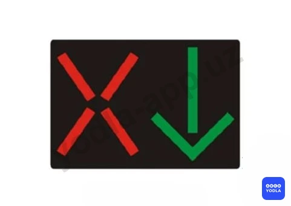

⬜ A. По всей ширине проезжей части дороги
✅ B. По полосам проезжей части; где движение меняется в противоположную сторону
⬜ C. Только на тех участках дороги; которые предназначены для маршрутных транспортных средств

> 💡 Данный светофор называется реверсивным светофором.

Реверсивные светофоры используются на полосах движения, направление движения по которым может изменяться на противоположное в зависимости от времени суток или дорожной ситуации. Они показывают водителям, какими полосами можно пользоваться, а на какие выезд запрещён.

Следовательно, это реверсивный светофор, применяемый на полосах с изменяемым направлением движения.

---

## Вопрос 3

**Данный светофор запрещает движение:**

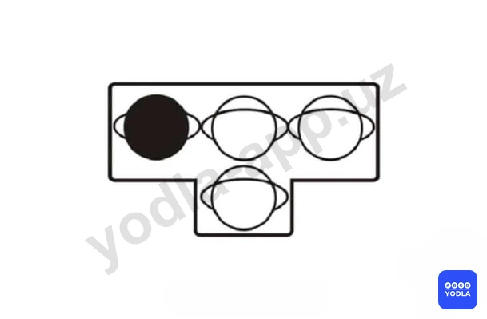

✅ A. Только налево
⬜ B. Прямо и налево
⬜ C. Прямо и направо
⬜ D. Только направо

> 💡 Данный светофор применяется для трамваев и других маршрутных транспортных средств.

Погашенный сигнал означает, что движение в соответствующем направлении запрещено. Как видно на рисунке, не горит сигнал, разрешающий движение налево.

Следовательно, поворот налево запрещён. Если сигналы для движения прямо и направо включены, движение в этих направлениях разрешается.

Если в вопросе спрашивается, какое направление запрещено, правильный ответ — движение налево запрещено.

---

## Вопрос 4

**Два попеременно мигающих красных сигнала имеют следующее значение:**

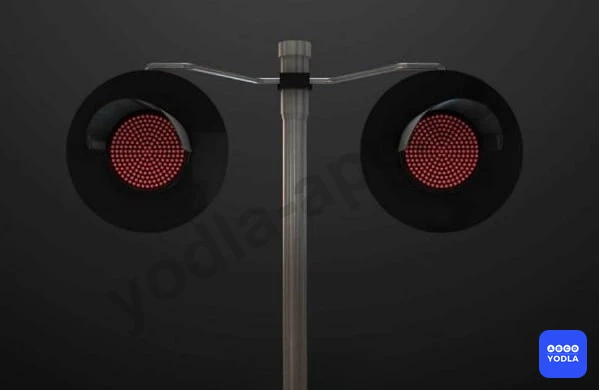

✅ A. Запрещают движение
⬜ B. Информируют других водителей о выезде на проезжую часть специальных транспортных средств
⬜ C. Разрешают движение с особой осторожностью

> 💡 Два попеременно мигающих красных сигнала устанавливаются перед железнодорожными переездами.

Они предупреждают о приближении поезда или об опасности проезда через железнодорожный переезд и запрещают дальнейшее движение транспортных средств.

Следовательно, два попеременно мигающих красных сигнала устанавливаются перед железнодорожным переездом и означают запрет движения.

---

## Вопрос 5

**Должен ли водитель трамвая при движении на данный сигнал светофора уступить дорогу транспортным средствам движущимся с других направлений?**

✅ A. Должен
⬜ B. Не должен

> 💡 Если для трамвая горит данный сигнал светофора, трамвай может продолжить движение. Однако перед началом движения он обязан уступить дорогу транспортным средствам, движущимся с других направлений.

Следовательно, в данной ситуации трамвай может двигаться только после того, как уступит дорогу транспортным средствам с других направлений.

---

## Вопрос 6

**Каким транспортным средствам разрешено движение при этом сигнале светофора?**

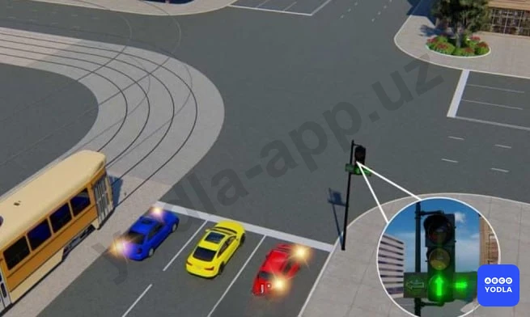

⬜ A. Трамваю, желтому и красному автомобилям
✅ B. Желтому и красному автомобилям
⬜ C. Всем транспортным средствам

> 💡 Как видно на рисунке, дополнительная секция, разрешающая движение налево, выключена. При этом секции для движения прямо и направо включены.

Это означает, что движение прямо и направо разрешено, а поворот налево запрещён.

В данной ситуации трамвай и синий автомобиль собираются повернуть налево, поэтому им движение не разрешается.

Жёлтый и красный автомобили движутся в разрешённых направлениях, поэтому они могут продолжить движение.

Следовательно, правильный ответ — движение разрешено только жёлтому и красному автомобилям.

---

## Вопрос 7

**Что обозначают одновременно включенные красный и желтый сигналы светофора?**

⬜ A. Можно начинать движение
✅ B. Запрещает движение и информирует о скором включении зеленого света
⬜ C. Приближение к перекрестку транспортного средства подающего звуковой или световой сигнал

> 💡 Одновременное включение красного и жёлтого сигналов светофора означает, что движение по-прежнему запрещено.

Этот сигнал предупреждает водителя о том, что вскоре включится зелёный сигнал и движение будет разрешено. Однако начинать движение при красном и жёлтом сигналах нельзя.

Следовательно, одновременное включение красного и жёлтого сигналов запрещает движение и предупреждает о скором включении зелёного сигнала.

---

## Вопрос 8

**В каком ответе названы все транспортные средства которым разрешено движение?**

⬜ A. Трамвай и мотоцикл
⬜ B. Автомобили и мотоцикл
✅ C. Все транспортные средства
⬜ D. Трамвай, грузовой автомобиль и мотоцикл

> 💡 Основные сигналы светофора и дополнительные секции включены и разрешают движение во всех направлениях.

Обратите внимание на формулировку вопроса: здесь не спрашивается «кто проедет первым?». Вопрос заключается в том, кому разрешено движение.

Поэтому определять очерёдность проезда не требуется. В данной ситуации движение разрешено всем транспортным средствам. Далее они будут двигаться в соответствии с правилами дорожного движения, уступая друг другу при необходимости.

Следовательно, правильный ответ — движение разрешено всем транспортным средствам.

---

## Вопрос 9

**На каком рисунке водитель правильно поворачивает направо?**

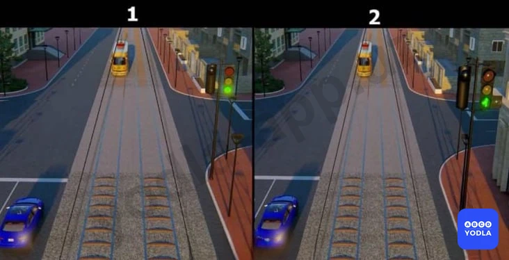

✅ A. 1
⬜ B. 2

> 💡 Внимательно рассмотрим оба рисунка. На первом изображён обычный светофор, а на втором — светофор с дополнительной секцией.

На втором рисунке дополнительная секция, разрешающая поворот направо, выключена. Это означает, что поворот направо запрещён.

Если в вопросе спрашивается, на каком рисунке водитель правильно выполняет поворот направо, то правильным является первый рисунок.

Следовательно, правильный ответ — первый рисунок.

---

## Вопрос 10

**В каком направлении разрешено движение?**

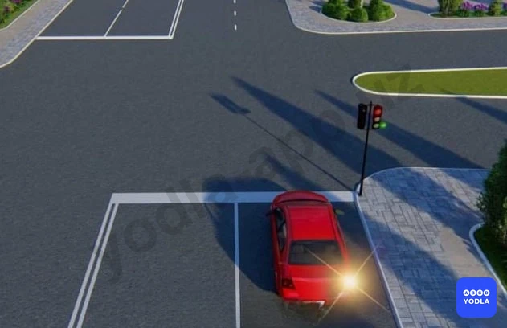

⬜ A. Прямо и направо в первый проезд
✅ B. Направо в первый проезд
⬜ C. Направо во второй проезд
⬜ D. Направо в первый и второй проезды

> 💡 Горит красный сигнал светофора. Одновременно дополнительная секция разрешает движение направо.

В такой ситуации транспортному средству разрешается двигаться только в направлении, указанном дополнительной секцией. Из-за красного сигнала движение в других направлениях запрещено.

Следовательно, правильный ответ — разрешено движение только направо, то есть по первому направлению.

---

## Вопрос 11

**Каким транспортным средствам разрешено движение при этом сигнале светофора?**

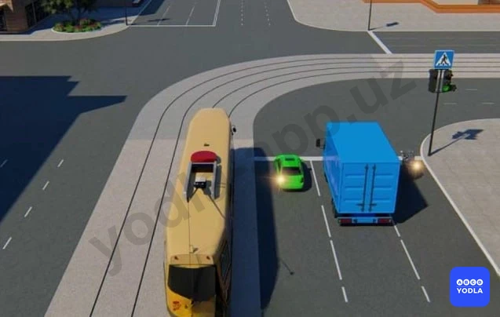

⬜ A. Трамваю и мотоциклу
⬜ B. Мотоциклу, легковому и грузовому автомобилям
✅ C. Легковому и грузовому автомобилям
⬜ D. Всем транспортным средствам

> 💡 На рисунке изображён светофор с дополнительной секцией. Дополнительная секция предназначена для движения направо, но в данный момент она выключена.

Это означает, что поворот направо запрещён.

Трамвай и мотоцикл собираются повернуть направо, поэтому движение для них запрещено.

Синий легковой автомобиль и зелёный грузовой автомобиль движутся в разрешённых направлениях, поэтому им движение разрешается.

Следовательно, правильный ответ — движение разрешено грузовому и легковому автомобилям.

---

## Вопрос 12

**О чем информируют черные стрелки на красном и желтом сигналах светофора?**

✅ A. О разрешенных направлениях движения при включении зеленого сигнала светофора
⬜ B. О разрешенных направлениях движения при красном и желтом сигналах светофора

> 💡 Красный и жёлтый сигналы, включённые одновременно, запрещают движение и предупреждают о скором включении зелёного сигнала.

Однако в данном вопросе внутри секции горит зелёный указатель направления. Он информирует водителя о том, в каком направлении будет разрешено движение при включении зелёного сигнала светофора.

Следовательно, правильный ответ — этот сигнал показывает направления, в которых будет разрешено движение при включении зелёного сигнала светофора.

---

## Вопрос 13

**При красном сигнале данного светофора движение запрещается:**

⬜ A. Только в один ряд
⬜ B. По всей ширине проезжей части
⬜ C. С обгоном
✅ D. По полосе, над которой он расположен

> 💡 Это реверсивный светофор.

Реверсивные светофоры устанавливаются над полосами движения, направление которых может изменяться на противоположное. Каждый такой светофор относится только к той полосе, над которой он расположен.

Если на реверсивном светофоре горит запрещающий сигнал (красный крест), движение по полосе, над которой установлен этот светофор, запрещается.

Следовательно, правильный ответ — движение запрещено по той полосе, над которой расположен данный светофор.

---

## Вопрос 14

**Данный светофор применяется для регулирования движения:**

⬜ A. Трамваев и троллейбусов
⬜ B. Только трамваев
✅ C. Трамваев, а также других маршрутных транспортных средств, следующих по обособленной полосе

> 💡 Данный светофор предназначен не только для трамваев.

Он регулирует движение трамваев, а также других маршрутных транспортных средств, движущихся по специально выделенной полосе.

Следовательно, этот светофор регулирует движение трамваев и других маршрутных транспортных средств, движущихся по обособленной полосе.

---

## Вопрос 15

**Что означает мигание зеленого сигнала светофора?**

⬜ A. Предупреждает о неисправности светофора
✅ B. Разрешает движение и информирует о том, что вскоре будет включен запрещающий сигнал
⬜ C. Запрещает дальнейшее движение

> 💡 Мигающий зелёный сигнал разрешает движение.

Одновременно он предупреждает водителя о том, что время действия зелёного сигнала заканчивается и вскоре включится жёлтый или красный, то есть запрещающий сигнал.

Следовательно, мигающий зелёный сигнал разрешает движение и информирует о скором включении запрещающего сигнала.

---

## Вопрос 16

**Значения каких дорожных знаков отменяются сигналами светофора?**

✅ A. Знаков приоритета
⬜ B. Запрещающих знаков
⬜ C. Предписывающих знаков
⬜ D. Всех перечисленных

> 💡 Многие ошибаются в этом вопросе и считают, что сигналы светофора отменяют действие всех дорожных знаков. Это неверно.

Сигналы светофора отменяют не все дорожные знаки, а только знаки приоритета.

Например, на регулируемом перекрёстке водитель должен руководствоваться сигналами светофора, а не знаками приоритета, такими как «Главная дорога», «Уступите дорогу» или «Движение без остановки запрещено».

При этом запрещающие, предписывающие, предупреждающие и другие дорожные знаки продолжают действовать.

Следовательно, правильный ответ — сигналы светофора отменяют действие только знаков приоритета.

---

## Вопрос 17

**Эсли водитель не может прекратить движение без резкого торможения, разрешается ли продолжать движение на жёлтый сигнала светофора?**

✅ A. Разрешается
⬜ B. Запрещено

> 💡 Знак 4.5 раздела 4 приложения № 1 к ПДД, «Велосипедная дорожка». Разрешается движение только на велосипедах и мопедах. При отсутствии тротуара или пешеходной дорожки по велосипедной дорожке могут двигаться также пешеходы.

---

## Вопрос 18

**О чем предупреждает мигающий желтый сигнал светофора?**

⬜ A. Разрешает движение
⬜ B. О том, что перекресток не регулируемый
✅ C. Все ответы правильные

> 💡 Мигающий жёлтый сигнал может иметь несколько значений.

1. Он разрешает движение, но требует от водителя повышенной осторожности.
2. Информирует о том, что перекрёсток или пешеходный переход не регулируется.
3. Предупреждает о наличии опасного участка дороги.

Поэтому, если в вариантах ответа указаны все эти значения, правильный ответ — все ответы верны.

---

## Вопрос 19

**В каком направлени разрешено движение?**

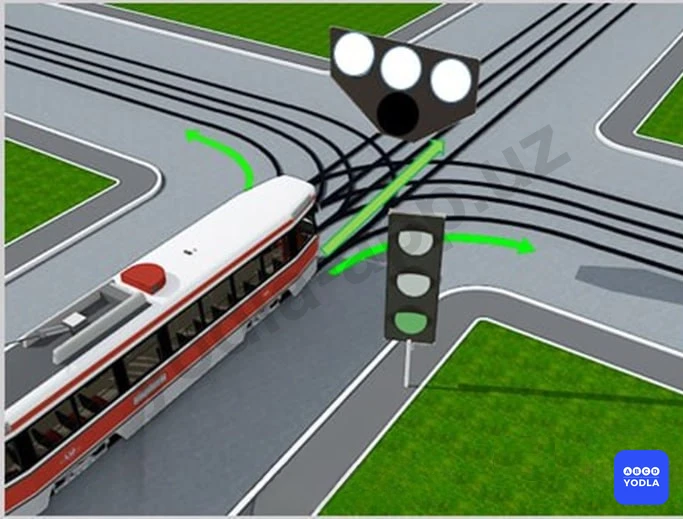

✅ A. Движение запрешено
⬜ B. Толькo прямо
⬜ C. Толькo прямо и направо
⬜ D. Разрешено во все направления

> 💡 Как видно на рисунке, на специальном светофоре для трамваев отсутствует разрешающий сигнал.

Если на трамвайном светофоре не горит ни один разрешающий белый сигнал, движение трамвая запрещено во всех направлениях.

Водитель трамвая должен руководствоваться не общим светофором, а специальным светофором, предназначенным именно для трамваев.

Следовательно, в данной ситуации движение трамвая запрещено во всех направлениях.

---

## Вопрос 20

**Мигающий жёлтый сигнал светафора:**

✅ A. Информирует о наличии нерегулируемого перекрестка или пешеходного перехода
⬜ B. Информирует о наличии нерегулируемого перекрестка
⬜ C. Сигнал светафора уведомляет вас об изменении цвета

> 💡 Мигающий жёлтый сигнал светофора предупреждает водителей о наличии нерегулируемого перекрёстка или нерегулируемого пешеходного перехода.

В такой ситуации водитель должен двигаться с повышенной осторожностью, оценивать дорожную обстановку и при необходимости уступать дорогу другим участникам движения.

Следовательно, мигающий жёлтый сигнал информирует о наличии нерегулируемого перекрёстка или нерегулируемого пешеходного перехода.

---

## Вопрос 21

**В каком направлении этот светафор позволяет вам двигаться?**

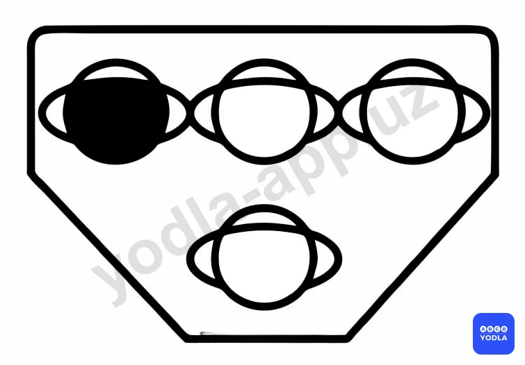

⬜ A. Только налево
✅ B. Прямо и направо
⬜ C. Только направо
⬜ D. Прямо и налево

> 💡 Как видно на рисунке, сигнал, разрешающий движение налево, выключен. Это означает, что поворот налево запрещён.

Однако обратите внимание на вопрос: спрашивается, в каких направлениях движение разрешено.

Если движение налево запрещено, то разрешёнными остаются направления прямо и направо.

Следовательно, правильный ответ — разрешено движение прямо и направо.

---

## Вопрос 22

**В случае, если значение сигналов светофора противоречат требованиям дорожных знаков приоритета?
**

✅ A. Водители должны руководствоваться сигналами светофора
⬜ B. Водители должны руководствоваться требованиям знаков приоритета

> 💡 Согласно Правилам дорожного движения, если сигналы светофора противоречат требованиям знаков приоритета, водители обязаны руководствоваться сигналами светофора.

В такой ситуации сигналы светофора имеют преимущество, а требования знаков приоритета временно не применяются.

Следовательно, правильное правило заключается в том, что при противоречии между сигналами светофора и знаками приоритета водитель должен выполнять требования светофора.

---

## Вопрос 23

**В каком направлении разрешено движение?**

✅ A. Движение запрещено
⬜ B. Только прямо
⬜ C. Только прямо и направо
⬜ D. Разрешено во все направления

> 💡 Если нижний сигнал трамвайного светофора не горит, движение трамвая запрещается.

Следовательно, правильный ответ — движение трамвая запрещено.

---

## Вопрос 24

**В каком направлении разрешено движение?**

⬜ A. «A» «B» «C»
⬜ B. «A» «B» «D»
✅ C. «D»

> 💡 Как видно на рисунке, горит красный сигнал светофора, то есть общее движение запрещено.

Однако дополнительная секция разрешает движение налево. При этом временный дорожный знак запрещает поворот налево, поэтому выполнить левый поворот нельзя.

Но данный запрет не распространяется на разворот. Следовательно, водитель может выполнить разворот.

Правильный ответ — разрешено движение в направлении D, то есть разворот.

---

## Вопрос 25

**В каком направлении запрещено движение?**

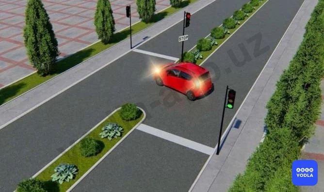

⬜ A. Только прямо и направо
⬜ B. Только налево
⬜ C. Только налево и разворот
✅ D. Только разворот
⬜ E. Во все направления

> 💡 В данной ситуации водителю красного автомобиля запрещён только разворот.

Ответы о движении направо или налево неверны, так как дороги в этих направлениях нет.

Автомобиль уже выехал на середину перекрёстка для выполнения разворота и оказался перед вторым светофором. На этом светофоре горит красный сигнал.

Поэтому водитель не может завершить разворот и должен дождаться включения зелёного сигнала.

Следовательно, правильный ответ — запрещён только разворот.

---

## Вопрос 26

**В каком направлении этот светофор разрешает движение трамвая?**

⬜ A. Только прямо
⬜ B. Во всех направлениях
✅ C. Во всех направлениях запрещает движение

> 💡 На данном трамвайном светофоре нижний белый сигнал выключен.

Если на трамвайном светофоре не горит нижний белый сигнал, движение трамвая не разрешается. В такой ситуации движение трамвая запрещено во всех направлениях.

Следовательно, правильный ответ — трамваю запрещено движение во всех направлениях.

---

## Вопрос 27

**В каком направлении этот светофор разрешает движение трамвая?**

⬜ A. Только прямо
⬜ B. Во всех направлениях
✅ C. Во всех направлениях запрещает движение

> 💡 На трамвайном светофоре нижний белый сигнал выключен.

Если нижний белый сигнал не горит, движение трамвая не разрешается.

Следовательно, в данной ситуации движение трамвая запрещено.

---

## Вопрос 28

**в каком направлении разрешено движение этого транспортного средства?**

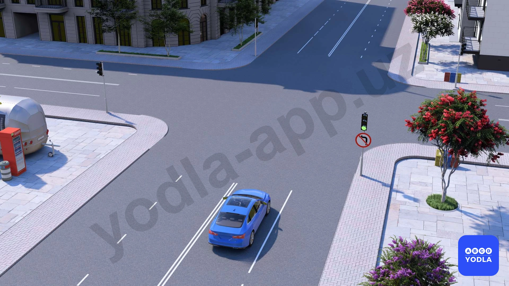

⬜ A. Только прямо
⬜ B. Прямо и направо
✅ C. Только прямо и в разворот
⬜ D. Во всех направлениях

> 💡 На пересекаемой дороге отсутствует разделительная полоса, поэтому поворот налево запрещён.

Если бы разделительная полоса была, знак действовал бы только до первого пересечения проезжих частей, и поворот налево был бы разрешён.

Светофор разрешает движение, и обычно можно было бы ехать прямо или поворачивать налево. Однако здесь установлен знак «Поворот налево запрещён».

Следовательно, водителю разрешено движение только прямо и на разворот.

---

## Вопрос 29

**Какому водителю автомобиля разрешено повернуть?**

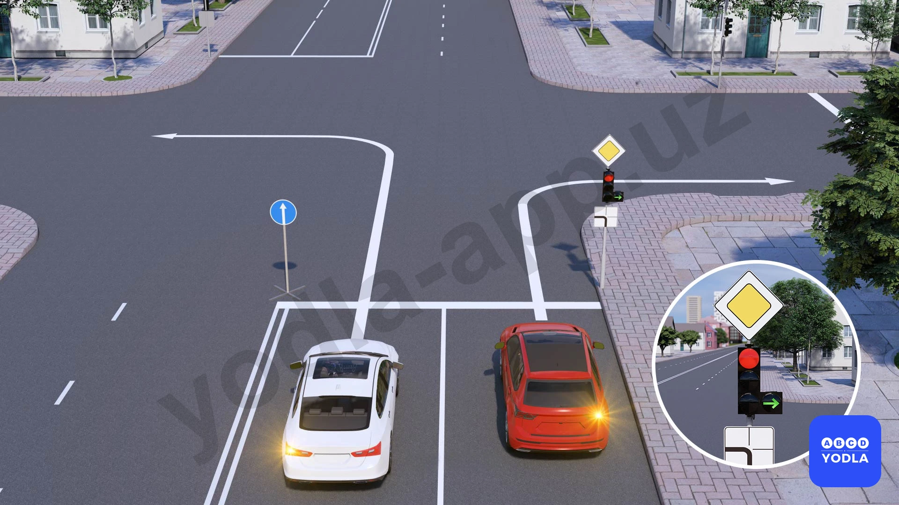

⬜ A. Разрешено обоим
⬜ B. Водителю белого автомобиля
✅ C. Запрещено обоим
⬜ D. Водителю красного автомобиля

> 💡 В этом вопросе многие ошибаются и считают, что красному автомобилю движение разрешено, потому что это разрешает светофор.

Но нужно помнить: сигналы светофора отменяют только действие знаков приоритета. Они не отменяют действие предписывающих знаков.

Здесь установлен временный предписывающий знак, который распространяется на все транспортные средства и предписывает движение только прямо.

Поэтому ни один из автомобилей не может выполнить поворот.

Следовательно, правильный ответ — поворот запрещён обоим автомобилям.

---

## Вопрос 30

**Если на основной зелёный сигнал светофора нанесены стрелки (стрелка), о чём это информирует водителей?**

⬜ A. Информирует о том, что скоро загорится зелёный сигнал
✅ B. Информирует о наличии дополнительной секции светофора
⬜ C. Информирует о том, что светофор не работает

> 💡 Если на основном зелёном сигнале светофора изображена стрелка, это информирует водителя о наличии у данного светофора дополнительной секции.

Такая стрелка заранее предупреждает водителя о том, что дополнительная секция регулирует движение в определённых направлениях отдельно.

Следовательно, правильный ответ — она информирует о наличии дополнительной секции светофора.

---

## Вопрос 31

**По каким направлениям разрешается движение?**

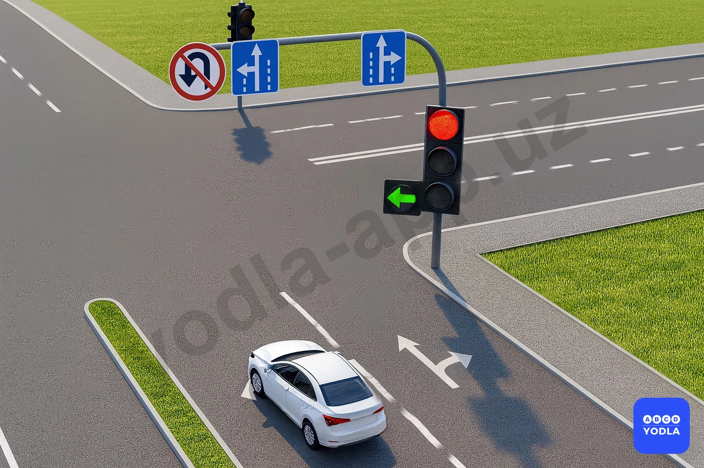

⬜ A. Разрешается движение во всех направлениях
⬜ B. Налево и разворот
✅ C. Налево
⬜ D. Прямо и налево
⬜ E. Движение во всех направлениях запрещается

> 💡 Как видно на рисунке, горит красный сигнал светофора, но дополнит��льная секция разрешает движение только налево.

Из-за расположения автомобиля и требований дорожных знаков разворот запрещён. Поэтому водитель не может выполнить разворот.

Следовательно, в данной ситуации разрешён только поворот налево.

Правильный ответ — можно двигаться только налево.

---

## Вопрос 32

**Этому автомобилю разрешено двигаться в каком направлении?**

⬜ A. Только для разворота
⬜ B. Только налево
⬜ C. Движение в обоих направлениях запрещено
✅ D. Движение в обоих направлениях разрешено

> 💡 В данной ситуации на дороге имеется разделительная полоса.

Поэтому знак «Поворот налево запрещён» действует только до первого пересечения проезжих частей и не распространяется на второе пересечение.

Следовательно, на втором пересечении поворот налево разрешён.

Кроме того, знак «Поворот налево запрещён» не запрещает разворот. Поэтому водитель может как повернуть налево, так и выполнить разворот.

Правильный ответ — движение разрешено в обоих направлениях.

---

## Вопрос 33

**Каким транспортным средствам разрешено движение направо?**

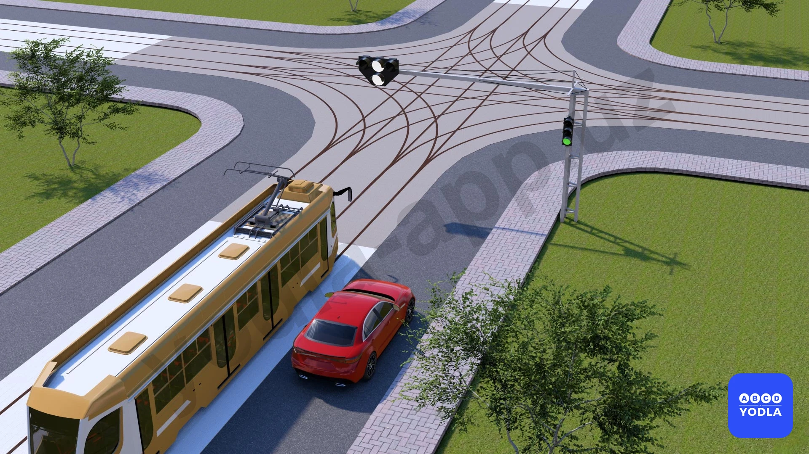

⬜ A. Обоим
⬜ B. Трамваю
✅ C. Легковому автомобилю

> 💡 В данной ситуации трамвайный светофор разрешает трамваю движение только прямо. Движение в других направлениях для трамвая не разрешено.

Для красного легкового автомобиля горит основной зелёный сигнал светофора. Основной зелёный сигнал разрешает движение во всех направлениях, которые не запрещены дорожными знаками или разметкой.

Поэтому, если вопрос заключается в том, какому транспортному средству разрешено движение, правильный ответ — легковому автомобилю.

Следовательно, движение разрешено только легковому автомобилю.

---

## Вопрос 34

**Мигающий красный сигнал?**

✅ A. Запрещает движение
⬜ B. Разрешает продолжить движение водителям, которые без резкого торможения не успевают остановиться
⬜ C. Разрешает движение

> 💡 Мигающий красный сигнал запрещает движение.

Такой сигнал указывает водителю на необходимость остановиться и действовать с повышенной осторожностью. Особенно на железнодорожных переездах мигающий красный сигнал запрещает дальнейшее движение транспортных средств.

Следовательно, мигающий красный сигнал является запрещающим сигналом.

---

## Вопрос 35

**Разрешен ли водителям синих и черных автомобилей совершать правый поворот?**

⬜ A. Разрешён
✅ B. Запрещён

> 💡 В данной ситуации водители синего и чёрного автомобилей хотят повернуть направо.

Однако на перекрёстке установлен знак «Движение прямо» (4.1.1), который разрешает движение только прямо и запрещает поворот направо.

Следовательно, правильный ответ — поворот направо для синего и чёрного автомобилей запрещён.

---

## Вопрос 36

**В этой ситуации вы:**

⬜ A. Вы можете продолжать движение, не останавливаясь
✅ B. Вы должны остановиться перед знаком и дождаться разрешающего сигнала светофора

> 💡 Согласно пункту 105 Правил дорожного движения, на перекрестке равнозначных дорог водитель безрельсового транспортного средства обязан уступить дорогу транспортным средствам, приближающимся справа. Этим же правилом должны руководствоваться между собой водители трамваев. На таких перекрестках трамвай имеет право на приоритет движения перед безрельсовыми транспортными средствами, независимо от направления его движения.
Согласно пункту 107 Правил дорожного движения, при повороте налево или развороте водитель безрельсового транспортного средства обязан уступить дорогу транспортным средствам, движущимся по равнозначной дороге со встречного направления прямо или направо, а также производящим обгон в разрешенных случаях. Этим же правилом должны руководствоваться между собой водители трамваев.
На этом перекрёстке первым движется трамвай, вторым — автобус, идущий прямо, а третьим — красный автомобиль, поворачивающий налево.

---

## Вопрос 37

**В каких направлениях вам разрешается продолжить движение?**

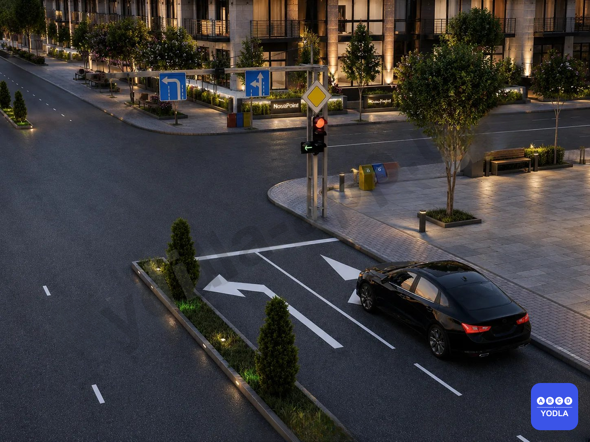

✅ A. Только налево
⬜ B. Прямо и налево
⬜ C. Налево и на разворот

> 💡 Согласно Приложению 1, пункту 5.8.2, разделу 5 (Информационно-указательные знаки) и главе 7, пункту 32 Правил дорожного движения:

5.8.2 — знак «Направления движения по полосе» указывает разрешённое направление движения по данной полосе. Движение в других направлениях запрещается.

32. Красные, жёлтые и зелёные сигналы светофора в виде стрелок имеют то же значение, что и круглые сигналы, но распространяются только на указанное направление. Если разворот не запрещён соответствующим дорожным знаком, зелёная стрелка, разрешающая поворот налево, разрешает также разворот.

В данной ситуации, согласно разметке полосы и сигналу светофора, разрешается движение только налево.

---

## Вопрос 38

**В каких направлениях разрешается движение чёрному автомобилю?**

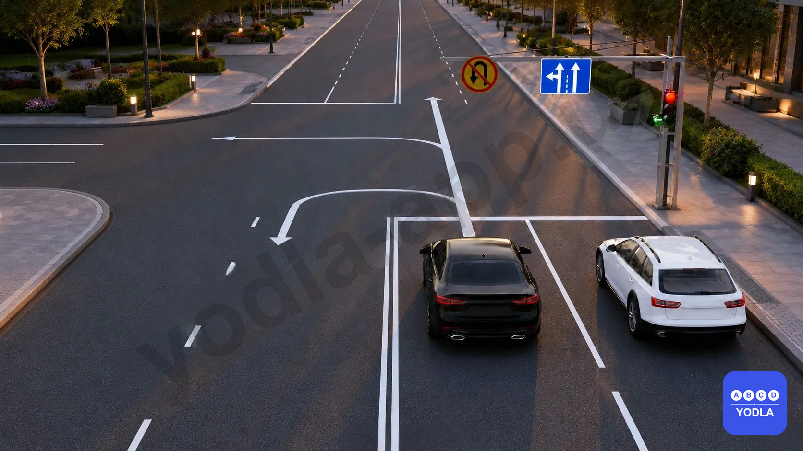

⬜ A. Прямо и налево
⬜ B. Прямо и на разворот
⬜ C. Только прямо
✅ D. Только налево

> 💡 Согласно Приложению 1, пункту 5.8.2, разделу 5 (Информационно-указательные знаки) и главе 7, пункту 32 Правил дорожного движения:

5.8.2 — знак «Направления движения по полосе» определяет разрешённое направление движения по данной полосе. Движение в иных направлениях запрещено.

32. Красные, жёлтые и зелёные сигналы светофора в виде стрелок имеют то же значение, что и круглые сигналы, и распространяются только на указанное направление. Если разворот не запрещён соответствующим дорожным знаком, зелёная стрелка, разрешающая поворот налево, также разрешает разворот.

В данной ситуации чёрному автомобилю, находящемуся на данной полосе, разрешается движение только налево.

---

## Вопрос 39

**В каком направлении разрешается движение белому автомобилю?**

⬜ A. Движение запрещено
⬜ B. Прямо, налево и на разворот
⬜ C. Прямо и налево
✅ D. Только прямо

> 💡 Согласно Приложению 1, пункту 5.8.2, разделу 5 (Информационно-указательные знаки) и главе 7, пункту 32 Правил дорожного движения:

5.8.2 — знак «Направления движения по полосе» определяет разрешённое направление движения по данной полосе. Движение в иных направлениях запрещено.

32. Красные, жёлтые и зелёные сигналы светофора в виде стрелок имеют то же значение, что и круглые сигналы и распространяются только на указанное направление. Если разворот не запрещён соответствующим дорожным знаком, зелёная стрелка, разрешающая поворот налево, также разрешает разворот.

В данной ситуации белому автомобилю, находящемуся на данной полосе, разрешается движение только прямо.

---

