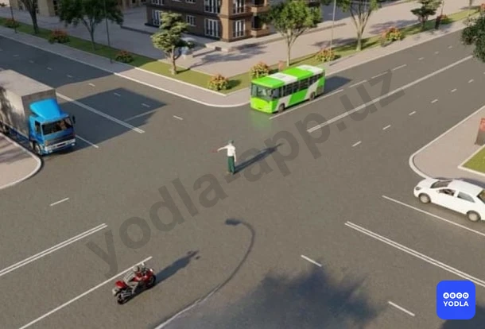
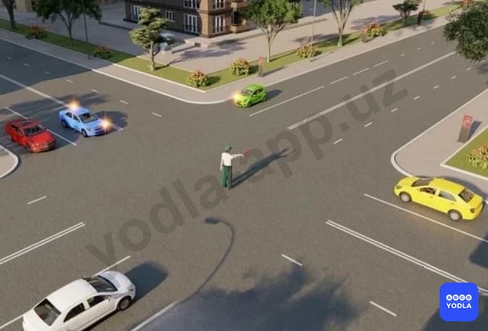
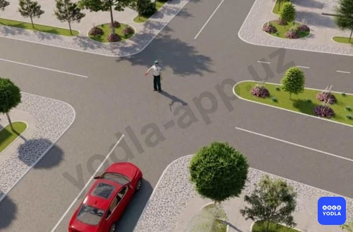
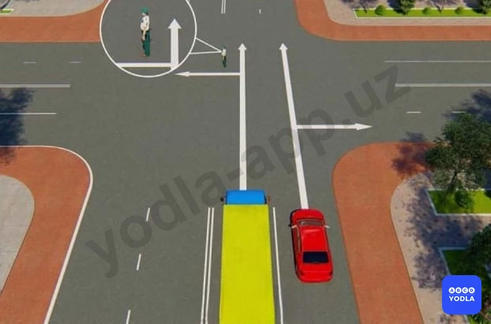
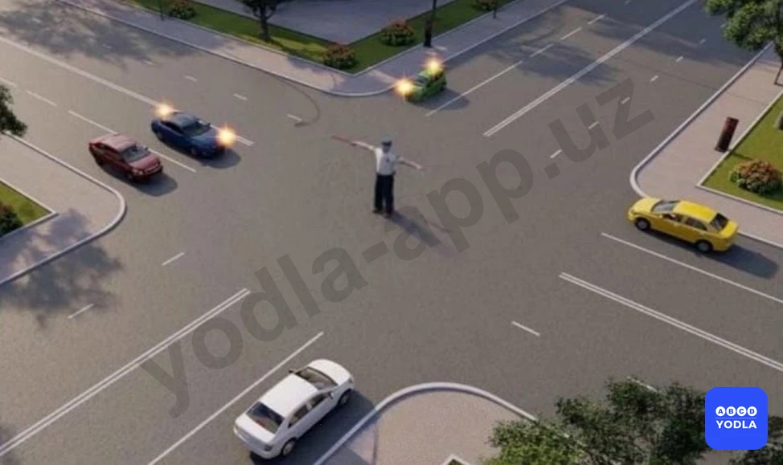
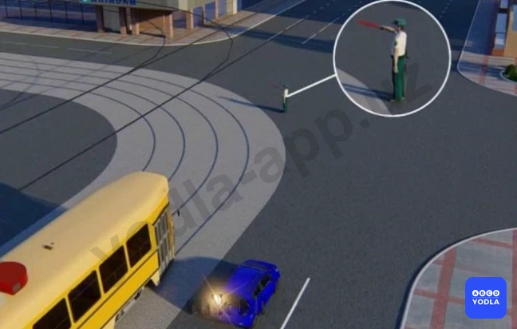
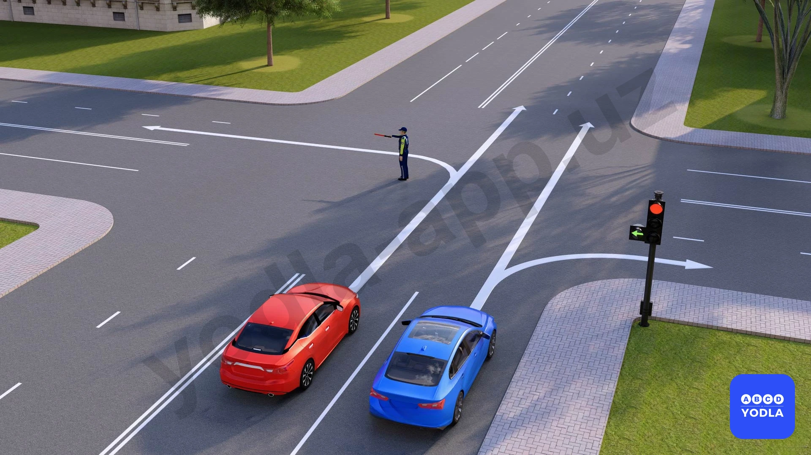
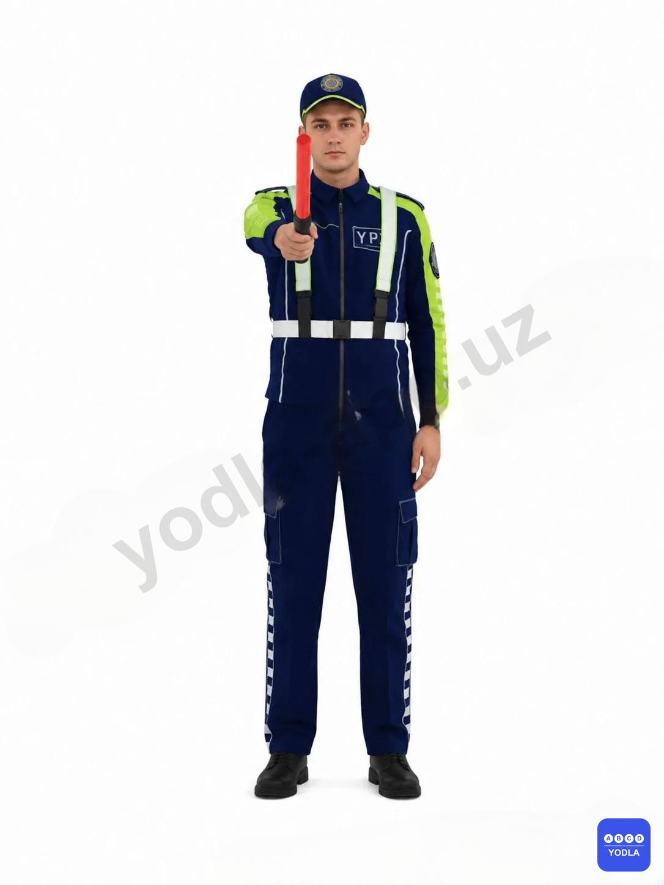
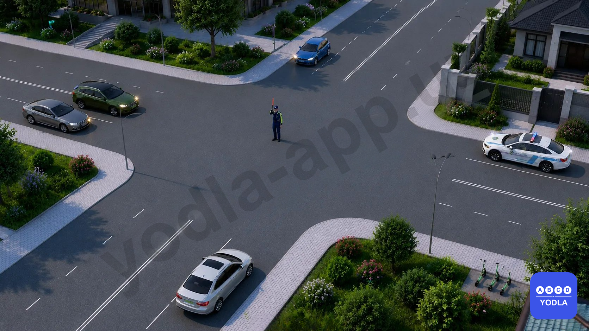
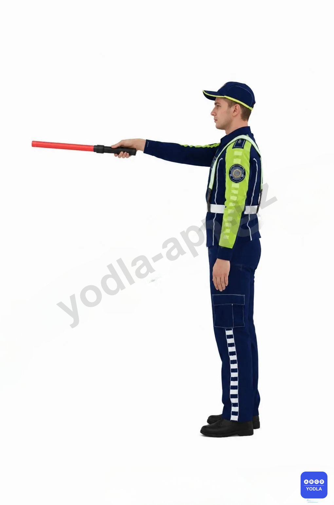

# 15. Сигналы регулировщика (боб 7.2)

Всего вопросов: 31

## Вопрос 1

**Движение запрещено:**

⬜ A. Красному и белому автомобилям
✅ B. Синему, зеленому и белому автомобилям
⬜ C. Белому, синему и желтому автомобилям

> 💡 Здесь необходимо обратить внимание на сигналы регулировщика.

Транспортным средствам, находящимся сбоку от регулировщика, разрешается движение прямо и направо.

В данной ситуации сбоку находятся синий, красный и жёлтый автомобили. Однако направление движения синего автомобиля не соответствует разрешённым направлениям, поэтому ему движение запрещено.

Транспортным средствам, находящимся перед грудью и за спиной регулировщика, движение запрещено во всех направлениях. В таком положении находятся белый и зелёный автомобили.

Следовательно:
- красному и жёлтому автомобилям движение разрешено;
- синему, белому и зелёному автомобилям движение запрещено.

Правильный ответ — движение запрещено синему, белому и зелёному автомобилям (F2).

---

## Вопрос 2

**Кто из водителей имеет право двигаться в прямом направлении?**

⬜ A. Водители автобуса и мотоцикла
⬜ B. Водители легкового и грузового автомобилей
✅ C. Водитель легкового автомобиля

> 💡 Вопрос заключается в том, водитель какого транспортного средства имеет право двигаться прямо.

Сначала определяем положение регулировщика. За спиной регулировщика находится автобус. Транспортным средствам, находящимся перед грудью и за спиной регулировщика, движение запрещено во всех направлениях. Поэтому автобусу движение запрещено.

Синий автомобиль также находится в запрещённом положении, поэтому ему движение не разрешается.

Мотоциклу разрешён только поворот направо, поэтому он не может двигаться прямо.

Легковой автомобиль имеет право двигаться прямо. Поэтому, если вопрос касается именно движения прямо, правильный ответ — легковой автомобиль.

Следовательно, только водитель легкового автомобиля имеет право двигаться прямо.

---

## Вопрос 3

**Каким транспортным средствам разрешено движение?**

⬜ A. Мотоциклу
⬜ B. Грузовому автомобилю
⬜ C. Автобусу
✅ D. Легковому автомобилю
⬜ E. Легковому и и грузовому автомобилям

> 💡 Согласно пункту 38 главы 7 ПДД, руки регулировщика вытянуты в стороны или опущены означают что: со стороны левого и правого бока — разрешено движение трамваю прямо, безрельсовым транспортным средствам — прямо и направо, пешеходам разрешено переходить проезжую часть; со стороны груди и спины — движение всех транспортных средств и пешеходов запрещено.

---

## Вопрос 4

**Этот сигнал регулировщика означает,что:**

⬜ A. Разрешено движение синемлоу, зеленому автомобилям. Запрещено красному, желтому, бему
✅ B. Разрешено движение синему, красному, зеленому автомобилям. Запрещено желтому, белому

> 💡 В этом вопросе необходимо определить, что означает данный сигнал регулировщика для каждого транспортного средства.

Позади регулировщика находится белый автомобиль. Транспортным средствам, находящимся за спиной регулировщика, движение запрещено во всех направлениях.

Жёлтый автомобиль также находится в запрещённом направлении, поэтому ему движение не разрешается.

Зелёному автомобилю разрешено движение только направо.

Транспортным средствам, находящимся сбоку от регулировщика, разрешено движение во всех допустимых направлениях.

Следовательно, правильный ответ — белому и жёлтому автомобилям движение запрещено, а зелёному автомобилю разрешено движение только направо.

---

## Вопрос 5

**Каким транспортным средствам разрешено движение?**

⬜ A. Только красному автомобилю
⬜ B. Всем транспортным средствам
✅ C. Красному, синему и зелёным автомобилям.

> 💡 В данной ситуации анализируем сигналы регулировщика.

- Транспортным средствам, находящимся за спиной регулировщика, движение запрещено во всех направлениях. Поэтому белому автомобилю движение запрещено.
- Жёлтому автомобилю также движение не разрешается.
- Зелёному автомобилю разрешено движение только направо.
- Синий и красный автомобили находятся сбоку от регулировщика, поэтому им разрешено движение в допустимых направлениях.

Следовательно:
- белому и жёлтому автомобилям движение запрещено;
- зелёному, синему и красному автомобилям движение разрешено.

Правильный ответ — красный, зелёный и синий автомобили.

---

## Вопрос 6

**Движение разрешено:**

⬜ A. Всем транспортным средствам
✅ B. Мотоциклу
⬜ C. Автомобилю и мотоциклу

> 💡 В данной ситуации регулировщик обращён к трамваю и синему автомобилю.

Транспортным средствам, находящимся перед грудью или за спиной регулировщика, движение запрещено во всех направлениях.

Поэтому:
- трамваю движение запрещено;
- синему автомобилю также движение запрещено.

Транспортным средствам, находящимся сбоку от регулировщика, разрешено движение прямо и направо.

Мотоцикл не подаёт сигнал поворота и собирается двигаться прямо из первой полосы, что соответствует правилам.

Следовательно, движение мотоциклу разрешено.

---

## Вопрос 7

**Каким транспортным средствам движение разрешено?**

⬜ A. Зеленому, синему и черному автомобилям
⬜ B. Красному, желтому и зеленому автомобилям
✅ C. Зеленому, синему и красному автомобилям

> 💡 В данной ситуации необходимо правильно определить сигналы регулировщика.

- Жёлтому и чёрному автомобилям, находящимся за спиной регулировщика, движение запрещено во всех направлениях.
- Зелёному автомобилю разрешено движение только направо.
- Красный и синий автомобили находятся сбоку от регулировщика, поэтому им разрешено движение в допустимых направлениях.

Следовательно:
- жёлтому и чёрному автомобилям движение запрещено;
- зелёному, синему и красному автомобилям движение разрешено.

Правильный ответ — движение разрешено зелёному, синему и красному автомобилям.

---

## Вопрос 8

**В каких направлениях может двигаться автомобиль?**

⬜ A. Только направо
⬜ B. Остановиться и ждать зеленого сигнала светофора
⬜ C. Только прямо
✅ D. Во всех направлениях

> 💡 В данной ситуации сигналы регулировщика и светофора противоречат друг другу.

Согласно Правилам дорожного движения, если сигналы регулировщика противоречат сигналам светофора или требованиям дорожных знаков, водители обязаны руководствоваться сигналами регулировщика.

Поэтому в данной ситуации приоритет имеют именно сигналы регулировщика, а не светофора.

Если положение регулировщика разрешает движение во всех направлениях, то транспортные средства могут двигаться во всех разрешённых направлениях.

Следовательно, правильный ответ — необходимо руководствоваться сигналами регулировщика, и в данной ситуации движение разрешено во всех направлениях.

---

## Вопрос 9

**Каким транспортным средствам разрешено движение?**

⬜ A. Легковому и грузовому автомобилям
⬜ B. Мотоциклу, легковому и грузовому автомобилям
✅ C. Легковому автомобилю и мотоциклу

> 💡 Вопрос заключается в том, каким транспортным средствам разрешено движение.

Любому транспортному средству, находящемуся за спиной регулировщика, движение запрещено во всех направлениях. В данной ситуации за спиной регулировщика транспортных средств нет.

Зелёный легковой автомобиль и мотоцикл находятся сбоку от регулировщика. Транспортным средствам, находящимся сбоку от регулировщика, разрешено движение в разрешённых направлениях.

Следовательно:
- легковому автомобилю движение разрешено;
- мотоциклу также движение разрешено.

Правильный ответ — движение разрешено легковому автомобилю и мотоциклу.

---

## Вопрос 10

**Движение разрешено:**

⬜ A. Прямо
✅ B. Направо в первый проезд
⬜ C. Направо во второй проезд
⬜ D. Направо в первый и второй проезды

> 💡 Если рука регулировщика направлена в вашу сторону, то транспортным средствам, движущимся с этой стороны, разрешается движение только направо.

Движение в других направлениях запрещено.

Следовательно, в данной ситуации разрешено движение только направо, то есть по первому направлению.

---

## Вопрос 11

**Движение разрешено:**

✅ A. Грузовому автомобилю и мотоциклу
⬜ B. Всем транспортным средствам
⬜ C. Трамваю и легковому автомобилю
⬜ D. Легковому и грузовому автомобилям, мотоциклу

> 💡 В данной ситуации руки регулировщика вытянуты в стороны.

Перед регулировщиком и за его спиной транспортных средств нет. Транспортным средствам, приближающимся сбоку, разрешается движение прямо и направо.

Поэтому:
- поворот налево запрещён;
- трамваю не разрешается поворот направо, для него разрешено только движение прямо;
- синему автомобилю движение запрещено, так как он собирается повернуть налево.

Следовательно, движение разрешено только грузовому автомобилю и мотоциклу.

---

## Вопрос 12

**В каком случае водитель мотоцикла повернул налево правильно?**

⬜ A. Выехал на перекресток, пропустил грузовой автомобиль, закончил поворот
⬜ B. Выехал на перекресток и, дождавшись разрешающего жеста регулировщика, закончил поворот
✅ C. Остановится и при разрешающем жесте регулировщика повернёт налево

> 💡 В данной ситуации поворот налево для мотоциклиста временно запрещён.

Поэтому водитель мотоцикла должен остановиться, не выезжая на середину перекрёстка, и дождаться разрешающего сигнала регулировщика.

После того как регулировщик разрешит движение налево, водитель может без дополнительной остановки выполнить поворот налево.

Следовательно, правильный ответ — водитель мотоцикла остановился и после разрешающего сигнала регулировщика повернул налево.

---

## Вопрос 13

**В каком ответе правильно названы все транспортные средства; которым разрешено движение?**

✅ A. Автомобили и мотоцикл
⬜ B. Все транспортные средства
⬜ C. Автомобили и трамвай

> 💡 В данной ситуации регулировщик держит руку, направленную влево.

Безрельсовым транспортным средствам, находящимся с этой стороны, то есть автомобилям и мотоциклу, движение разрешено.

Для трамвая данный сигнал разрешает движение только налево. Однако трамвай собирается двигаться прямо, поэтому движение для него запрещено.

Следовательно:
- автомобилям и мотоциклу движение разрешено;
- трамваю движение запрещено.

Правильный ответ — автомобили и мотоцикл.

---

## Вопрос 14

**На каком рисунке водитель поворачивает правильно?**

✅ A. На левом рисунке
⬜ B. На правом рисунке

> 💡 В данной ситуации рука регулировщика выполняет функцию шлагбаума.

Легковому автомобилю разрешено движение, поскольку он поворачивает направо.

Мотоциклу движение запрещено, так как он движется в запрещённом направлении.

Запомните:
- если рука регулировщика, с вашей стороны, направлена влево — движение разрешено;
- если рука направлена вправо — движение запрещено.

Если в вопросе спрашивается: «На каком рисунке водитель правильно выполняет поворот?», правильный ответ — на левом рисунке.

---

## Вопрос 15

**Движение запрещено:**

✅ A. Сине-желтому автомобилю - налево
⬜ B. Сине-желтому автомобилю - прямо, красному автомобилю — прямо и направо
⬜ C. Красному автомобилю — прямо и направо

> 💡 Согласно пункту 38 главы 7 ПДД, руки регулировщика вытянуты в стороны или опущены означают что: со стороны левого и правого бока — разрешено движение трамваю прямо, безрельсовым транспортным средствам — прямо и направо, пешеходам разрешено переходить проезжую часть; со стороны груди и спины — движение всех транспортных средств и пешеходов запрещено.

---

## Вопрос 16

**Движение разрешено:**

✅ A. Красному автомобилю
⬜ B. Мотоциклу
⬜ C. Трамваю и красному автомобилю
⬜ D. Трамваю
⬜ E. Синему автомобилю

> 💡 Согласно пункту 38 главы 7 ПДД, правая рука регулировщика вытянута вперед: со стороны левого бока — разрешено движение трамваю налево, безрельсовым транспортным средствам — во всех направлениях; со стороны груди — всем транспортным средствам разрешено движение только направо; со стороны правого бока и спины — движение всех транспортных средств запрещено; пешеходам разрешено переходить проезжую часть за спиной регулировщика.

---

## Вопрос 17

**Каким транспортным средствам разрешено движение?**

✅ A. Желтому и красному автомобилям
⬜ B. Зеленому, красному и белому автомобилям
⬜ C. Белому и зеленому автомобилю

> 💡 В данной ситуации прежде всего необходимо правильно определить положение регулировщика.

Если регулировщик обращён к транспортному средству грудью или спиной, движение для этого транспортного средства запрещено во всех направлениях.

Поэтому движение мотоциклу и автобусу запрещено.

Транспортным средствам, находящимся сбоку от регулировщика, разрешается движение прямо и направо.

В данной ситуации сбоку находятся белый и синий автомобили. Синий автомобиль собирается повернуть налево, поэтому движение для него запрещено.

Следовательно, движение разрешено только белому легковому автомобилю.

---

## Вопрос 18

**По каким направлениям разрешено движение транспортных средств?**

⬜ A. Трамваю налево или прямо
⬜ B. Только автомобилю налево
⬜ C. Трамваю и автомобилю налево
⬜ D. Трамваю налево или прямо, автомобилю после трамвая
✅ E. Трамваю налево, автомобилю налево и в обратном направлении

> 💡 Согласно пункту 38 главы 7 ПДД, правая рука регулировщика вытянута вперед: со стороны левого бока — разрешено движение трамваю налево, безрельсовым транспортным средствам — во всех направлениях; со стороны груди — всем транспортным средствам разрешено движение только направо; со стороны правого бока и спины — движение всех транспортных средств запрещено; пешеходам разрешено переходить проезжую часть за спиной регулировщика.

---

## Вопрос 19

**Лица; уполномоченные регулировать дорожное движение; должны иметь при себе:**

⬜ A. Соответствующее удостоверение и отличительный знак- нарукавную повязку
⬜ B. Жезл
⬜ C. Диск с красным сигналом (светоотражателем) или флажок
✅ D. Все пере��исленные отличительные знаки

> 💡 Согласно определению 44 пункта 6 главы 1 ПДД, Регулировщик - сотрудник ГСБДД МВД РУ, военной автомобильной инспекции, работник дорожно-эксплуатационных служб, дежурный на железнодорожных переездах и паромных переправах при исполнении ими своих должностных обязанностей, наделенный в установленном порядке полномочиями по регулированию дорожного движения с помощью сигналов, установленных настоящими Правилами, и не посредственно осуществляющий указанное регулирование. Регулировщик должен быть в форменной одежде и (или) иметь отличительный знаки и экипировку (нарукавную повязку, жезл, диск с красным отражателем, красный фонарь или флажок).

---

## Вопрос 20

**Сигнал регулировщика свистком служит:**

✅ A. Для привлечения внимания участников движения
⬜ B. Для замены в необходимых случаях сигнала «рука поднята вверх»
⬜ C. Разрешающим сигналом для пешеходов

> 💡 Согласно пункту 40 главы 7 ПДД, для привлечения внимания участников движения может подаваться дополнительный сигнал при помощи свистка.

---

## Вопрос 21

**Разрешается ли Вам продолжить движение, если регулировщик поднял руку вверх после того, как Вы въехали на перекресток?**

⬜ A. Не разрешается
⬜ B. Разрешается, только если Вы поворачиваете направо
✅ C. Разрешается

> 💡 Согласно пункту 124 Правил дорожного движения, в жилой зоне запрещается: учебная езда на механических транспортных средствах; стоянка с работающим двигателем; стоянка грузовых автомобилей с разрешенной максимальной массой более 3,5 т вне специально выделенных и обозначенных дорожными знаками и (или) дорожной разметкой мест.

---

## Вопрос 22

**Разрешается движение:**

⬜ A. Красному, синему, зеленому и желтому автомобилям
✅ B. Красному и желтому автомобилям
⬜ C. Красному, желтому и зеленому автомобилям

> 💡 :  Согласно статьи 6 Правил дорожного движения, пешеходный переход — участок проезжей части дороги, предназначенный для пересечения пешеходами, обозначенный дорожными знаками 5.16.1, 5.16.2 и дорожной разметкой 1.14.1 — 1.14.4.
При отсутствии дорожной разметки ширина пешеходного перехода определяется расстоянием между дорожными знаками 5.16.1 и 5.16.2.

---

## Вопрос 23

**Каким транспортным средством разрешено движение?**

⬜ A. Мотоциклу направо, легковому автомобилю на все направления
⬜ B. Легковому автомобилю на право и прямо
✅ C. Мотоциклу направо, легковому автомобилю прямо и направо

> 💡 Знак 5.42 раздела 5 приложения № 1 к ПДД, «Движение направо при красном сигнале». Если с правой стороны красного сигнала транспортного светофора установлен знак 5.42, водители транспортных средств, находящиеся непосредственно перед перекрестком, при включённом запрещающем сигнале светофора могут поворачивать направо, соблюдая все меры безопасности. При этом они обязаны уступить дорогу всем транспортным средствам, а также пешеходам, переходящим проезжую часть дороги в направлении движения и дороги, на которую транспортные средства поворачивают.

---

## Вопрос 24

**Какому транспортному средству движение запрещено?**

⬜ A. Мотоциклу
⬜ B. Никому незапрещено
✅ C. Грузовому автомобилю

> 💡 Согласно пункту 38 Правил дорожного движения, Сигналы регулировщика имеют следующие значения: правая рука вытянута вперед: со стороны левого бока — разрешено движение трамваю налево, безрельсовым транспортным средствам — во всех направлениях; со стороны груди — всем транспортным средствам разрешено движение только направо; со стороны правого бока и спины — движение всех транспортных средств запрещено; пешеходам разрешено переходить проезжую часть за спиной регулировщика.
В этой ситуации движение запрещено грузовому автомобилю.

---

## Вопрос 25

**Водитель автомобиля намерен развернуться:**

⬜ A. Проедет перекресток первым
✅ B. Выпольняет разворот, уступив дорогу трамваю

> 💡 При прохождении поворота на транспортное средство действует центробежная сила, которая возрастает с увеличением скорости и стремится сместить транспортное средство к внешней стороне закругления дороги. Занос или снос транспортного средства может возникнуть при проезде поворота из-за большой скорости движения, торможения или низкого коэффициента сцепления. Антиблокировочная тормозная система, предназначенная для предотвращения блокировки колес транспортного средства, может снизить вероятность возникновения заноса или сноса при торможении, но не может исключить возможность их возникновения.

---

## Вопрос 26

**Разрешается ли транспортному средству с включенным маячком двигаться прямо?**

⬜ A. Разрешается
✅ B. Запрещается

> 💡 Согласно пункту 60 главы 9 ПДД, в случаях, когда траектории движения транспортных средств пересекаются, а очерёдность проезда не оговорена настоящими Правилами, дорогу должен уступить водитель, к которому транспортное средство приближается справа.

---

## Вопрос 27

**В каких направлениях разрешено движение автомобилям?**

⬜ A. Красному — налево, синему — запрещено
⬜ B. Синему — прямо, красному — налево
✅ C. Обоим разрешено движение по указанным направлениям
⬜ D. Красному разрешено, синему направо запрещено

> 💡 "На основании пункта 5.8.2 Приложения 1 к ПДД и абзаца 11 раздела 5 «Информационно-указательные знаки», а также пункта 3.18.2 Приложения 1 к ПДД и абзаца 47 раздела 3 «Запрещающие знаки»: 5.8.2. «Направления движения по полосе». Разрешенные направления движения по полосе. Движение по другим направлениям запрещается.
Знаки 5.8.1 и 5.8.2, разрешающие поворот налево из крайней левой полосы, разрешают и разворот с этой полосы. 
3.18.2. «Поворот налево запрещен». Действие знаков 3.18.1 и 3.18.2 распространяется на пересечение проезжих частей, перед которыми установлен знак."

---

## Вопрос 28

**В каком направлении вы должны продолжить движение при данном сигнале регулировщика?**

⬜ A. Только прямо
⬜ B. Только в обратном направлении
⬜ C. Только налево
✅ D. Только направо

> 💡 Согласно главе 7, пункту 38 Правил дорожного движения:

Если правая рука регулировщика вытянута вперёд, то со стороны его груди всем транспортным средствам разрешается движение только направо.

---

## Вопрос 29

**Каким транспортным средствам разрешается движение при данном сигнале регулировщика?**

⬜ A. Зелёному и белому автомобилям
⬜ B. Синему автомобилю и автомобилю ДПС
⬜ C. Только автомобилю ДПС
✅ D. Никому не разрешается

> 💡 Согласно главе 7, пункту 38 и главе 6, пункту 25 (абзац 1) Правил дорожного движения:

38. Если регулировщик поднял руку вверх, движение транспортных средств и пешеходов во всех направлениях запрещается, за исключением случаев, предусмотренных пунктом 42 Правил.

25. Водители транспортных средств оперативных и специальных служб с включёнными проблесковыми маячками синего, красного или одновременно синего и красного цвета при выполнении неотложных служебных обязанностей могут отступать от требований глав 7 (за исключением сигналов регулировщика), 9–16, 19–20 и 22, а также приложений 1 и 2 Правил при условии обеспечения безопасности дорожного движения.

---

## Вопрос 30

**В каких направлениях разрешается движение транспортным средствам на перекрёстке при данном сигнале регулировщика?**

⬜ A. Трамваям — прямо, безрельсовым транспортным средствам — прямо и направо
⬜ B. Во всех направлениях
✅ C. Трамваям — налево, безрельсовым транспортным средствам — во всех направлениях

> 💡 Согласно главе 7, пункту 38 Правил дорожного движения:

38. Если правая рука регулировщика вытянута вперёд, то со стороны его левого бока трамваям разрешается движение налево, а безрельсовым транспортным средствам — во всех направлениях.

---

## Вопрос 31

**Что означает сигнал регулировщика, когда его руки вытянуты в стороны?**

⬜ A. С левой и правой стороны трамваям разрешается движение прямо, безрельсовым транспортным средствам — прямо, направо и налево.
⬜ B. С левой и правой стороны трамваям разрешается движение налево, безрельсовым транспортным средствам — направо.
✅ C. С левой и правой стороны трамваям разрешается движение прямо, безрельсовым транспортным средствам — прямо и направо, а со стороны груди и спины движение запрещено.

> 💡 Согласно главе 7, пункту 38 Правил дорожного движения:

Если руки регулировщика вытянуты в стороны или опущены, то с левой и правой стороны трамваям разрешается движение прямо, а безрельсовым транспортным средствам — прямо и направо. Со стороны груди и спины движение всех транспортных средств запрещается.

---

