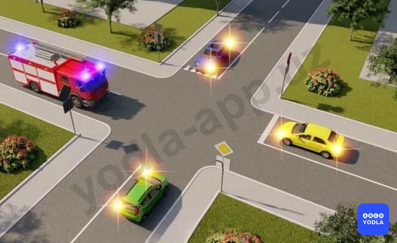
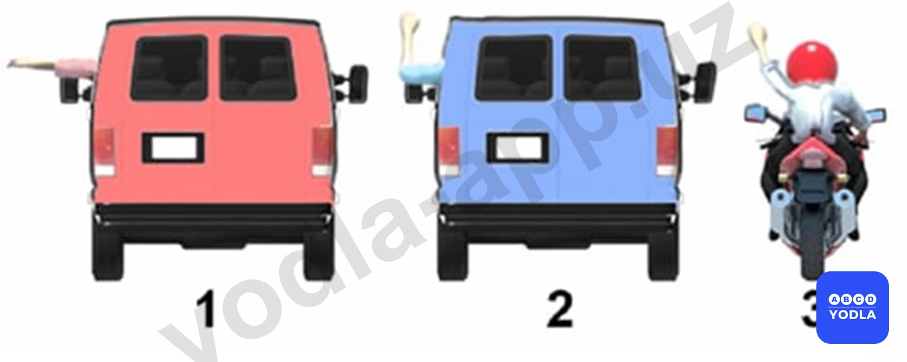

# 16. Аварийная сигнализация и знак аварийной остановки (боб 8)

Всего вопросов: 25

## Вопрос 1

**В каком случае правила не требуют подачи предупре­дительного сигнала?**

⬜ A. Перед остановкой у края проезжей части
✅ B. Перед закруглением дороги; обозначенным знаком "Опасный поворот"
⬜ C. Перед перестроением на соседнюю полосу движения

> 💡 В соответствии с пунктом 153 главы 26 ПДД: Высота борта кузова грузового автомобиля, используемого для перевозки людей должна быть не менее 1,3 м. При этом он должен быть оборудован сиденьями, закрепленными в кузове на расстоянии 0,3-0,5 м от пола кузова.

---

## Вопрос 2

**Является ли включение ближнего света фар в дневное время предупредительным сигналом?**

✅ A. Является
⬜ B. Не является

> 💡 Согласно пункту 44 главы 8 ПДД, включение ближнего света фар в дневное время являются предупредительными сигналами.

---

## Вопрос 3

**Какие сигналы считаются предупредительными?**

⬜ A. Сигналы; подаваемые световыми указателями поворота или рукой
⬜ B. Звуковые сигналы
⬜ C. Переключение света фар и включение ближнего света фар дневное время
✅ D. Все вышеперечисленные сигналы

> 💡 Согласно пункту 44 главы 8 ПДД, предупредительными сигналами являются: сигналы, подаваемые мигающими указателями поворотов или рукой; звуковые сигналы; переключение света фар; включение ближнего света фар в дневное время.

---

## Вопрос 4

**Дает ли водителю преимущественное право проезда подача предупредительного сигнала?**

✅ A. Не дает
⬜ B. Дает при завершении маневра
⬜ C. Дает при начале маневра
⬜ D. Дает во всех случаях

> 💡 Согласно пункту 46 главы 8 ПДД, подача предупредительного сигнала указателями поворотов не дает водителю право на первоочередное движение и не освобождает его от принятия необходимых мер предосторожности.

---

## Вопрос 5

**Правильно ли поступил водитель; применив переключение света фар и звуковой сигнал; для привлечения внимания обгоняемого водителя на дороге вне населенного пункта?**

⬜ A. Неправильно
✅ B. Правильно

> 💡 Согласно пунктов 48 и 49 главы 8 ПДД, вне населенных пунктов при обгоне, для предупреждения других водителей могут применяться звуковые сигналы. Вместо звукового сигнала об обгоне или же вместе с ним может подаваться предупредительный сигнал переключением фар.

---

## Вопрос 6

**Можно ли пользоваться дальним светом фар в качестве предупредительного сигнала при обгоне?**

⬜ A. Можно в любом случае
✅ B. Можно, когда это не может вызвать ослепление других водителей, в том числе и через зеркало заднего вида
⬜ C. Нельзя
⬜ D. Можно на дорогах вне населенных пунктов
⬜ E. Правильно

> 💡 Согласно пунктов 48 и 49 главы 8 ПДД, вне населенных пунктов при обгоне, для предупреждения других водителей могут применяться звуковые сигналы. Вместо звукового сигнала об обгоне или же вместе с ним может подаваться предупредительный сигнал переключением фар.

---

## Вопрос 7

**Всегда ли водитель должен подавать световой сигнал; указателями поворота при выполнении маневра?**

⬜ A. Должен всегда
✅ B. Не должен, если он может ввести в заблуждение других участников движения
⬜ C. Должен, приняв необходимые меры предосторожности

> 💡 Пункта 46 главы 8 ПДД гласит: Подача сигнала указателями поворотов или рукой должна производиться заблаговременно до начала выполнения маневра и прекращаться немедленно после его завершения (подача сигнала рукой может быть закончена непосредственно перед выполнением маневра). Подаваемый сигнал не должен вводить в заблуждение других участников дорожного движения. Подача предупредительного сигнала не дает водителю право на первоочередное движение и не освобождает его от принятия необходимых мер предосторожности.

---

## Вопрос 8

**Синий автомобиль проедет перекресток:**

⬜ A. Первым
⬜ B. Вторым
✅ C. Третьим
⬜ D. Последним

> 💡 Каким по счёту синий автомобиль проедет перекрёсток?

Первым проезжает специальное транспортное средство, имеющее преимущество.

Вторым проезжает зелёный автомобиль, находящийся на главной дороге.

Третьим перекрёсток проезжает синий автомобиль.

Последним движется водитель жёлтого автомобиля.

Следовательно, правильный ответ — синий автомобиль проедет перекрёсток третьим.

---

## Вопрос 9

**Когда в соответствии с Правилами может быть закончена подача предупредительного сигнала рукой?**

✅ A. Непосредственно перед выполнением маневра
⬜ B. Немедленно после завершения маневра
⬜ C. Во время выполнения маневра

> 💡 Предупредительный сигнал рукой должен подаваться до начала выполнения манёвра.

Водитель мотоцикла подаёт сигнал одной рукой, после чего берётся за руль обеими руками и выполняет манёвр.

Поэтому сигнал рукой:
- подаётся до начала манёвра;
- не подаётся во время выполнения манёвра;
- не подаётся после завершения манёвра.

Указатели поворота используются иначе: их выключают сразу после завершения манёвра.

Следовательно, предупреждающий сигнал рукой должен быть завершён до начала выполнения манёвра.

---

## Вопрос 10

**Должен ли водитель всегда включать и выключать фары в качестве предупредительного сигнала во время маневра?**

⬜ A. Только в случае если за ним движется другое транспортное средство
⬜ B. Только в случае если его транспортное средство имеет указатели поворотов
⬜ C. Только на дороге с интенсивным движением
✅ D. Сигнал не подается в случаях когда он может ввести в заблуждение других участников движения

> 💡 Сигнал поворота не должен вводить в заблуждение других участников дорожного движения.

Например, если водитель собирается повернуть направо на перекрёстке, но перед перекрёстком находится автозаправочная станция или прилегающая территория, слишком раннее включение указателя поворота может ввести других водителей в заблуждение.

Они могут подумать, что водитель собирается заехать на заправку или на прилегающую территорию, и начать движение, создав опасную ситуацию.

Поэтому указатель поворота необходимо включать так, чтобы не вводить в заблуждение других участников дорожного движения.

Следовательно, предупреждающий сигнал подаётся не всегда заранее, а только в том случае, если он не вводит других участников движения в заблуждение.

---

## Вопрос 11

**В каких случаях водитель обязан включать предупредительный сигнал перед остановкой?**

⬜ A. Только в случае, если сзади него движется другое транспортное средство
⬜ B. Только в населенных пунктах
✅ C. Во всех случаях

> 💡 Предупредительный сигнал не должен вводить в заблуждение других участников дорожного движения.

Например, если водитель собирается повернуть направо на перекрёстке, но перед перекрёстком находится прилегающая территория или автозаправочная станция, слишком раннее включение указателя поворота может ввести других водителей в заблуждение.

Другие водители могут подумать, что автомобиль собирается заехать на заправку или на прилегающую территорию, и начать движение, создав опасную ситуацию.

Поэтому указатель поворота не всегда нужно включать заранее. Его следует подавать только тогда, когда он не вводит в заблуждение других участников дорожного движения.

Следовательно, правильный ответ — предупреждающий сигнал должен подаваться так, чтобы не вводить других участников движения в заблуждение (F4).

---

## Вопрос 12

**Когда должен быть подан предупредительный сигнал перед перестроением?**

⬜ A. Непосредственно перед началом выполнения маневра
⬜ B. Сразу после начала выполнения маневра
✅ C. Заблаговременно до начала выполнения маневра

> 💡 Перед перестроением подача предупредительного сигнала является обязательной.

Водитель должен включить указатель поворота заранее, до начала выполнения манёвра.

После завершения манёвра сигнал необходимо немедленно выключить.

Следовательно, правильное правило — сигнал подаётся до начала манёвра и выключается сразу после его завершения.

---

## Вопрос 13

**Каким должен быть знак остановки «авария» или мигающий красный свет в жилом районе; по крайней мере; на расстоянии от автомобиля (кроме мотоцикла без бокового прицепа)?**

⬜ A. 10 м
✅ B. 15 м
⬜ C. 30 м
⬜ D. 40 м

> 💡 Знак аварийной остановки в населённых пунктах должен быть установлен на расстоянии не менее 15 метров от транспортного средства.

Следовательно, в населённых пунктах знак аварийной остановки устанавливается на расстоянии 15 метров.

---

## Вопрос 14

**Аварийная световая сигнализация должна быть включена:**

⬜ A. При вынужденной остановке в местах; где остановка запрещена
⬜ B. При дорожно-транспортном происшествии
⬜ C. При остановке и стоянке на неосвещенных участках дорог или в условиях недостаточной видимости при неисправных габаритных или стояночных огнях
✅ D. Во всех перечисленных случаях

> 💡 Аварийная световая сигнализация должна включаться во всех перечисленных случаях.

Если в вариантах ответа перечислены несколько ситуаций, и во всех них требуется включение аварийной сигнализации, правильный ответ — «во всех перечисленных случаях».

---

## Вопрос 15

**На каком рисунке водитель подает сигнал предупреждения о повороте налево?**

✅ A. 1
⬜ B. 2
⬜ C. 3

> 💡 Сигнал поворота налево подаётся вытянутой в сторону левой рукой.

Поэтому на первом рисунке сигнал поворота налево показан правильно.

Следовательно, правильный ответ — первый рисунок.

---

## Вопрос 16

**В каких случаях разрешено применять звуковые сигналы в населённых пунктах?**

⬜ A. Только для предупреждения о намерение произвести обгон
✅ B. Только для предотвращения дорожно-транспортного происшествия
⬜ C. В обоих перечисленных случаях

> 💡 В населённых пунктах звуковой сигнал разрешается подавать только для предотвращения дорожно-транспортного происшествия.

Следовательно, в населённых пунктах звуковой сигнал подаётся только для предотвращения опасности.

---

## Вопрос 17

**Какой знак используется для обозначения транспортного средства при вынужденной остановке в местах, где с учетом условий видимости оно не может быть  своевременно замечено другими водителями?**

✅ A. «А»
⬜ B. «Б»
⬜ C. «В»

> 💡 Вопрос: Какой знак применяется для обозначения транспортного средства, вынужденно остановившегося в месте с ограниченной видимостью?

Правильный ответ — знак аварийной остановки.

Этот знак используется для предупреждения других водителей о вынужденной остановке транспортного средства.

Следовательно, правильный ответ — знак аварийной остановки.

---

## Вопрос 18

**Привлечь внимание водителя обгоняемого автомобиля при движении в населенном пункте в светлое время суток можно:**

⬜ A. Только звуковым сигналом
✅ B. Только кратковременным переключением фар ближнего света на дальний
⬜ C. Только совместной подачей звукового и светового сигнала
⬜ D. Любые из перечисленных способов

> 💡 В светлое время суток в населённых пунктах для привлечения внимания водителя обгоняемого транспортного средства звуковой сигнал не применяется.

В такой ситуации водитель подаёт сигнал только светом фар:
- кратковременным переключением ближнего света;
- или кратковременным переключением дальнего света.

Следовательно, правильный ответ — подача сигнала кратковременным переключением ближнего или дальнего света фар (F2).

---

## Вопрос 19

**В каком случае Вы совершите вынужденную остановку?**

⬜ A. Остановившись непосредственно перед пешеходным переходом, чтобы уступить дорогу пешеходу.
✅ B. Остановившись на проезжей части из-за технической неисправности автомобиля
⬜ C. В обоих перечисленных случаях

> 💡 Вынужденная остановка — это прекращение движения транспортного средства из-за технической неисправности, опасности или других причин, не зависящих от воли водителя.

Например, если автомобиль остановился на проезжей части из-за технической неисправности, это считается вынужденной остановкой.

Следовательно, если транспортное средство остановилось из-за технической неисправности, водитель совершил вынужденную остановку.

---

## Вопрос 20

**Как Вы можете в светлое время суток привлечь внимание водителя обгоняемого автомобиля при движении вне населенного пункта?**

⬜ A. Только звуковым сигналом
⬜ B. Только кратковременным переключением фар с ближнего света на дальний
✅ C. Любым из перечисленных способов, включая совместную подачу этих сигналов

> 💡 Вне населённых пунктов для привлечения внимания водителя обгоняемого транспортного средства можно:

- подать звуковой сигнал;
- или подать сигнал кратковременным переключением света фар.

Следовательно, водитель может использовать оба способа.

Правильный ответ — разрешается использовать оба указанных способа.

---

## Вопрос 21

**Как Вы можете в светлое время суток привлечь внимание водителя обгоняемого автомобиля при движении вне населенного пункта?**

⬜ A. Только звуковым сигналом
⬜ B. Только кратковременным переключением фар с ближнего света на дальний
✅ C. Любым из перечисленных способов, включая совместную подачу этих сигналов

> 💡 Вне населённых пунктов для привлечения внимания водителя обгоняемого транспортного средства можно:

- подать звуковой сигнал;
- или подать сигнал кратковременным переключением света фар.

Следовательно, водитель может использовать оба способа.

Правильный ответ — разрешается использовать оба указанных способа.

---

## Вопрос 22

**Когда должна быть прекращена подача сигнала указателями поворота?**

⬜ A. Непосредственно перед началом маневра
✅ B. Сразу же после завершения маневра
⬜ C. В процессе выполнения маневра

> 💡 Предупредительный сигнал (указатель поворота) должен быть выключен сразу после завершения манёвра.

Поскольку оставленный включённым сигнал может ввести в заблуждение других участников дорожного движения.

Следовательно, правильное правило — указатель поворота выключается сразу после завершения манёвра.

---

## Вопрос 23

**Что означает жест вытягивания левой руки в сторону или поднятия правой руки вверх, согнутой в локте под прямым углом?**

✅ A. Повернуть налево или развернуться.
⬜ B. Повернуть направо или развернуться.
⬜ C. Остановиться.

> 💡 Вытянутая в сторону левая рука обозначает сигнал поворота налево или разворота.

Следовательно, вытянутая левая рука — это сигнал поворота налево.

---

## Вопрос 24

**Поднятая вверх рука водителя мотоцикла является сигналом, информирующим Вас о его намерении:**

⬜ A. Продолжить движение прямо
⬜ B. Повернуть направо
✅ C. Об остановке

> 💡 Поднятая вверх рука обозначает сигнал остановки.

Этот сигнал предупреждает других участников дорожного движения о намерении водителя снизить скорость и остановиться.

Следовательно, поднятая вверх рука информирует об остановке.

---

## Вопрос 25

**В каких случаях разрешено применять звуковые сигналы в населенных пунктах?**

✅ A. Только для предотвращения дорожно-транспортного происшествия
⬜ B. Только для предупреждения о намерении произвести обгон
⬜ C. В обоих перечисленных случаях

> 💡 В населённых пунктах звуковой сигнал разрешается подавать только для предотвращения дорожно-транспортного происшествия.

В других случаях использование звукового сигнала не допускается.

Следовательно, в населённых пунктах звуковой сигнал применяется только для предотвращения опасности.

---

