# 17. Начало движения, маневрирование (боб 9)

Всего вопросов: 56

## Вопрос 1

**Что обязан выполнить водитель перед началом движения?**

⬜ A. Проверить исправность и комплектность транспортного средства
✅ B. Убедиться, что начало движения будет безопасным и он не создаст помех другим участникам движения
⬜ C. Подать сигнал световым указателем поворота соответствующего направления
⬜ D. Выполнить все перечисленные действия

> 💡 Перед началом движения водитель должен убедиться в безопасности манёвра и в том, что он не создаст помех другим участникам дорожного движения.

В этом вопросе многие ошибочно выбирают ответ «всё перечисленное».

Запомните: «начало движения» — это начало движения транспортного средства, которое до этого стояло.

Каждый раз перед началом движения водитель не обязан полностью проверять техническое состояние автомобиля.

Прежде всего водитель должен:
- убедиться в безопасности начала движения;
- убедиться, что не создаст помех другим участникам дорожного движения.

Только после этого он подаёт предупредительный сигнал и начинает движение.

Следовательно, правильный ответ — убедиться в безопасности начала движения и отсутствии помех для других участников дорожного движения (F2).

---

## Вопрос 2

**Что должен выполнять водитель при движении транспортного средства задним ходом?**

✅ A. Не создавать помех другим участникам движения. Для обеспечения безопасности движения он, при необходимости, должен прибегнуть к помощи других лиц
⬜ B. Использовать с помощью других лиц
⬜ C. Включить задние противотуманные фонари, если они имеются на транспортном средстве
⬜ D. Включить габаритные огни

> 💡 При начале движения водитель должен выполнять следующие требования:

- не создавать помех другим участникам дорожного движения;
- обеспечить безопасность движения;
- при необходимости воспользоваться помощью других лиц для обеспечения безопасности движения.

Следовательно, основное требование при начале движения — не создавать помех другим участникам и обеспечить безопасность движения.

---

## Вопрос 3

**На перекрестке организовано круговое движение. Проезжая часть, по которой вы подъезжаете к перекрестку, имеет две полосы для движения. Какую полосу Вы обязаны занять для поворота при въезде на перекресток?**

⬜ A. Правую полосу
⬜ B. Левую полосу
✅ C. Правую или левую полосу

> 💡 При въезде на перекрёсток с круговым движением водитель может занять правую или левую полосу в зависимости от дорожной ситуации.

Однако при выезде с перекрёстка с круговым движением водитель должен выезжать только с правой полосы.

Следовательно:
- при въезде на круг можно занять правую или левую полосу;
- выезд с круга осуществляется только с правой полосы.

---

## Вопрос 4

**Если транспортное средство из-за габаритов или по другим причинам не может выполнить поворот из крайнего положения, допускается ли производить его с отступлением от этого правила?**

⬜ A. Не допускается
✅ B. Допускается, если это не создает помех другим транспортным средствам. Для обеспечения безопасности движения водитель, в случае необходимости, должен прибегнуть к помощи других лиц
⬜ C. Допускается на дорогах вне населенных пунктов
⬜ D. Допускается, но только не на перекрестке

> 💡 По правилам при повороте направо или налево водитель должен занимать соответствующую крайнюю полосу.

Однако если транспортное средство имеет большие габариты и поворот из крайней полосы затруднён или невозможен, допускается отступление от этого требования.

В таком случае водитель может выполнить поворот из другой полосы, но при этом он обязан не создавать помех другим участникам дорожного движения и обеспечить безопасность.

Следовательно, правильный ответ — разрешается.

---

## Вопрос 5

**Когда водитель должен уступить дорогу пешеходам?**

⬜ A. При выезде из двора
⬜ B. При въезде во двор
⬜ C. При выезде с заправочной станции
⬜ D. При выезде со стоянки на дорогу
✅ E. Во всех перечисленных случаях

> 💡 Пешеходам необходимо уступать дорогу во всех перечисленных случаях.

В частности:
- при выезде со двора;
- при въезде во двор;
- при выезде с автозаправочной станции на дорогу;
- при выезде с места стоянки.

Следовательно, во всех перечисленных ситуациях водитель обязан уступить дорогу пешеходам.

Правильный ответ — во всех перечисленных случаях.

---

## Вопрос 6

**При интенсивном движении; когда все полосы заняты; разрешается ли выполнять разворот?**

✅ A. Разрешается в любом случае
⬜ B. Разрешается только на дорогах; где имеется не менее трех полос для движения
⬜ C. Запрещается
⬜ D. Разрешается только на перекрестках

> 💡 Этот вопрос часто вводит учеников в заблуждение.

Вопрос звучит так: «Разрешается ли разворот при интенсивном движении, когда все полосы заняты?»

Многие под влиянием формулировки вопроса выбирают ответ «запрещается». Однако это не всегда правильно.

Если:
- дорожные знаки;
- дорожная разметка;
- или другие требования Правил дорожного движения

не запрещают разворот, то его выполнение разрешается.

Следовательно, если в условии не указаны дополнительные ограничения, правильный ответ — разворот разрешён.

Главная цель этого вопроса — проверить внимательность при чтении условия.

---

## Вопрос 7

**Что обязан сделать водитель перед перестроением и другим изменением направления движения?**

✅ A. Убедиться; что данный маневр будет безопасным и не создаст помех другим участникам движения
⬜ B. Подать предупредительный сигнал левого поворота и убедиться; что никому не будет создана помеха
⬜ C. Вне населенных пунктов подать звуковой сигнал
⬜ D. Выполнить все указанные действия

> 💡 Перед перестроением или изменением направления движения водитель должен убедиться, что данный манёвр будет безопасным и не создаст помех другим участникам дорожного движения.

Это требование предусмотрено пунктом 53 Правил дорожного движения.

Следовательно, правильный ответ — убедиться в безопасности манёвра и в отсутствии помех для других участников движения.

---

## Вопрос 8

**Разворот запрещается:**

⬜ A. На пешеходных переходах
⬜ B. В тоннелях
⬜ C. На мостах, путепроводах, эстакадах и под ними
⬜ D. На железнодорожных переездах
✅ E. Во всех перечисленных случаях

> 💡 Пункт 62 главы 9 ПДД, гласит: Разворот запрещается: на пешеходных переходах; в тоннелях; на мостах, путепроводах, эстакадах и под ними (за исключением участков дорог, где соответствующие дорожные знаки разрешают такой маневр); на железнодорожных переездах; в местах с видимостью дороги хотя бы в одном направлении менее 100 м.

---

## Вопрос 9

**Водитель зеленого автомобиля:**

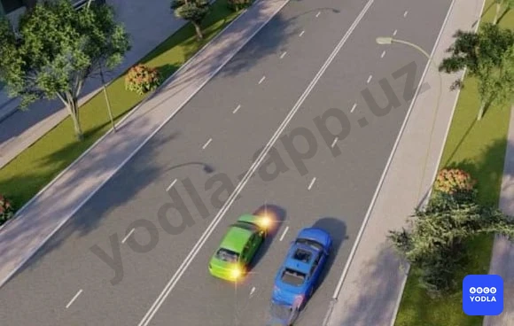

✅ A. Обязан уступить дорогу синему автомобилю; движущемся попутно в прямом направлении
⬜ B. Имеет преимущество перед синим автомобилем т.к. движется по полосе, предназначенной для обгона
⬜ C. Имеет преимущество, т.к. включил сигнал поворота

> 💡 Водитель зелёного автомобиля должен уступить дорогу синему автомобилю, который движется прямо в соседней полосе в том же направлении.

Поскольку перед перестроением водитель обязан уступить дорогу транспортным средствам, движущимся по соседней полосе.

Следовательно, водитель зелёного автомобиля должен уступить дорогу синему автомобилю.

---

## Вопрос 10

**Разворот запрещается:**

⬜ A. Ближе 15 м  от перекрестков

⬜ B. На нерегулируемых перекрестках, если на пересе­каемой дороге организовано одностороннее движение
✅ C. На пешеходных переходах
⬜ D. Во всех перечисленных случаях

> 💡 Внимательно прочитайте вопрос.

Разворот однозначно запрещён на пешеходных переходах.

Многие выбирают ответ «во всех перечисленных случаях», но здесь он будет неправильным.

Поскольку:
- вблизи нерегулируемого перекрёстка;
- или на некоторых перекрёстках, где пересекаемая дорога является дорогой с односторонним движением,

разворот не всегда запрещён.

Следовательно, правильный ответ — разворот запрещён на пешеходных переходах.

---

## Вопрос 11

**Водитель какого транспорта должен уступить дорогу?**

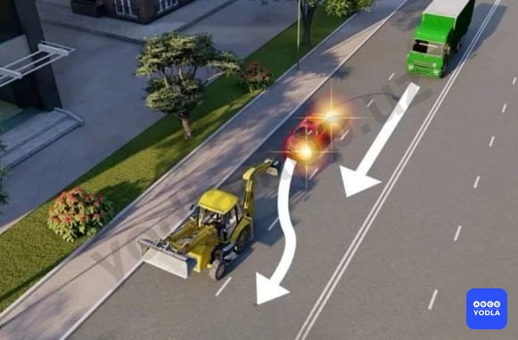

✅ A. Водитель легкового автомобиля
⬜ B. Водитель грузовика

> 💡 Вопрос: Водитель какого транспортного средства должен уступить дорогу?

В данной ситуации красный легковой автомобиль собирается обогнать медленно движущийся экскаватор.

Однако перед началом обгона водитель должен оценить дорожную обстановку. Сзади в том же направлении движется другое транспортное средство.

Согласно Правилам дорожного движения, перед перестроением или обгоном водитель обязан не создавать помех другим участникам движения и при необходимости уступить им дорогу.

Следовательно, в данной ситуации водитель красного легкового автомобиля обязан уступить дорогу.

---

## Вопрос 12

**Преимущество в движении имеет:**

⬜ A. Синий автомобиль, т.к. красный изменяет направление движения влево
✅ B. Красный автомобиль, т.к. при взаимном перестроении он находится справа
⬜ C. Синий автомобиль, т.к. при взаимном перестроении он находится слева

> 💡 Какое транспортное средство имеет преимущество при перестроении?

Если два транспортных средства одновременно намерены перестроиться, водитель обязан уступить дорогу транспортному средству, находящемуся справа.

В данной ситуации справа находится красный автомобиль.

Поэтому преимущество при перестроении имеет красный автомобиль, и именно он перестраивается первым.

Следовательно, правильный ответ — преимущество имеет красный автомобиль.

---

## Вопрос 13

**В каких местах запрещено движение задним ходом?**

⬜ A. На перекрестках, пешеходных переходах
⬜ B. На мостах, путепроводах, эстакадах и под ними
⬜ C. На автомагистралях
✅ D. Во всех перечисленных местах

> 💡 Движение задним ходом запрещается:

- на перекрёстках;
- на пешеходных переходах;
- на мостах, путепроводах, эстакадах и под ними;
- в тоннелях;
- на автобусных остановках и в других опасных местах.

Следовательно, если в вопросе перечислены именно эти варианты, правильный ответ — движение задним ходом запрещено во всех перечисленных местах.

---

## Вопрос 14

**Резкое торможение транспортного средства при интенсивном движении:**

✅ A. Может способствовать наезду сзади
⬜ B. Отражается только на техническом состоянии автомобиля
⬜ C. Является обычным приемом управления при интенсивном движении

> 💡 При интенсивном движении резкое торможение транспортного средства является опасным.

Поскольку резкое торможение может привести к тому, что движущиеся сзади автомобили не успеют остановиться и произойдёт дорожно-транспортное происшествие.

Следовательно, при интенсивном движении резкое торможение может стать причиной столкновения с автомобилями, движущимися сзади.

---

## Вопрос 15

**Как должен поступить водитель легкового автомобиля в показанной ситуации?**

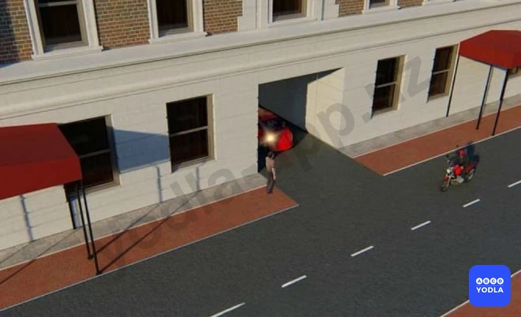

⬜ A. Быстрее завершить поворот; чтобы не создавать помехи транспортным средствам
✅ B. При выезде из двора пропустить пешехода и транспортные средства
⬜ C. Уступая дорогу транспортным средствам, остановиться на краю проезжей части

> 💡 В данной ситуации водитель легкового автомобиля выезжает со двора на дорогу.

Согласно Правилам дорожного движения, водитель, выезжающий со двора или с прилегающей территории, обязан уступить дорогу:
- пешеходам;
- транспортным средствам, движущимся по дороге.

Поэтому водитель должен сначала пропустить пешехода и транспортное средство, а затем продолжить движение.

Следовательно, правильный ответ — уступить дорогу пешеходу и транспортному средству.

---

## Вопрос 16

**Водитель какого транспортного средства правильно выполняет разворот?**

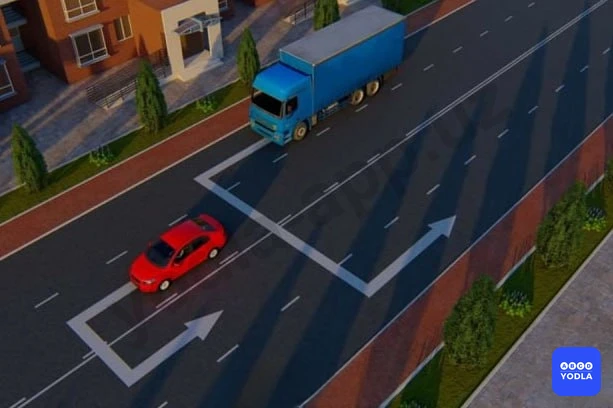

⬜ A. Водитель синего автомобиля
⬜ B. Водитель синего автомобиля
✅ C. Оба водителя

> 💡 В данной ситуации оба водителя выполнили разворот правильно.

Водитель легкового автомобиля выполнил разворот из крайней левой полосы, что полностью соответствует Правилам дорожного движения.

Если из-за габаритов транспортного средства или по другим причинам выполнить разворот из крайней левой полосы невозможно, допускается выполнение разворота из другой, более правой полосы.

Следовательно, правильный ответ — оба автомобиля выполнили разворот правильно.

---

## Вопрос 17

**Водитель какого транспортного средства правильно въезжает на пересечение с круговым движением?**

✅ A. Оба водителя
⬜ B. Только водитель автобуса
⬜ C. Только водитель легкового автомобиля

> 💡 В данной ситуации оба водителя правильно въезжают на перекрёсток с круговым движением.

Согласно правилам, при въезде на перекрёсток с круговым движением водитель может занять:
- правую полосу;
- или левую полосу.

Поэтому въезд обоих автомобилей соответствует Правилам дорожного движения.

Однако при выезде с кругового движения водитель должен занимать только крайнюю правую полосу.

В данной ситуации автомобили только въезжают на круг, поэтому оба водителя действуют правильно.

Следовательно, правильный ответ — оба водителя правильно въезжают на перекрёсток с круговым движением.

---

## Вопрос 18

**Должен ли водитель уступить дорогу другим транспортным средствам при перестроении?**

✅ A. Должен, если транспортное средство движется попутно по соседней полосе
⬜ B. Не должен
⬜ C. Должен во всех случаях при взаимном перестроении

> 💡 Должен ли водитель уступить дорогу другим транспортным средствам?

При перестроении, если два автомобиля одновременно намерены перестроиться, преимущество обычно имеет транспортное средство, находящееся справа.

Однако из этого правила есть исключения.

Если автомобиль, находящийся слева, продолжает движение прямо по соседней полосе, водитель, выполняющий перестроение, обязан уступить ему дорогу.

Фраза «движется по соседней полосе» означает, что транспортное средство продолжает движение прямо.

Следовательно, правильный ответ — если транспортное средство движется прямо по соседней полосе, ему необходимо уступить дорогу.

---

## Вопрос 19

**Водитель какого транспортного средства нарушает правила въезда на дорогу; при наличии на ней полосы разгона?**

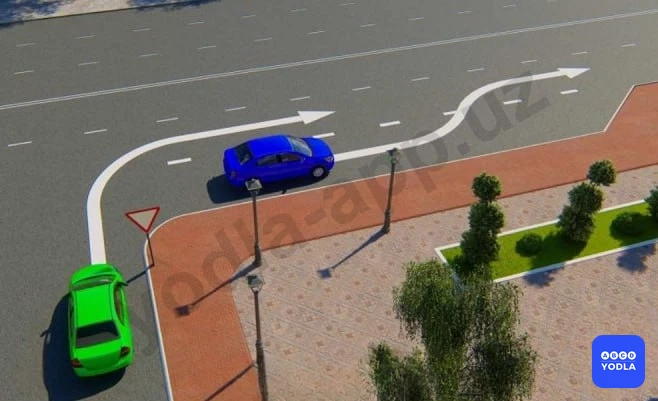

⬜ A. Оба водителя
⬜ B. Оба водителя выезжают правильно
⬜ C. Водитель синего автомобиля
✅ D. Водитель зеленого автомобиля

> 💡 В данной ситуации на дороге имеется полоса разгона.

Согласно Правилам дорожного движения, при повороте направо водитель должен занять крайнюю правую полосу или крайнее правое положение.

Водитель зелёного автомобиля не воспользовался полосой разгона и сразу выехал на вторую полосу основной дороги.

Это является нарушением Правил дорожного движения.

Следовательно, правильный ответ — водитель зелёного автомобиля нарушил правила.

---

## Вопрос 20

**Если ширина проезжей части недостаточна для разворота из крайнего левого положения; допускается ли производить его от правого края проезжей части или с правой обочины?**

⬜ A. Допускается только от правого края проезжей части. С правой обочины не допускается
✅ B. Допускается при этом водитель производящий разворот, должен уступить дорогу попутным и встречным транспортным средствам
⬜ C. Не допускается

> 💡 В данной ситуации применяется исключение, связанное с большими габаритами транспортного средства.

Если вне перекрёстка ширина проезжей части недостаточна для выполнения разворота из крайнего левого положения, разворот разрешается выполнять от правого края проезжей части или с обочины.

Однако в этом случае водитель, выполняющий разворот, обязан уступить дорогу:
- транспортным средствам, движущимся в попутном направлении;
- транспортным средствам, движущимся во встречном направлении.

Следовательно, крупногабаритное транспортное средство может выполнить разворот от правого края, но обязано уступить дорогу другим участникам движения.

---

## Вопрос 21

**Водитель какого транспортного средства нарушает правила поворота с дороги; на которой есть полоса торможения?**

⬜ A. Оба водителя
✅ B. Водитель желтой автомобиля
⬜ C. Оба водителя поворачивают правильно

> 💡 В данной ситуации водитель жёлтого автомобиля нарушил правила.

Если на дороге имеется полоса торможения, водитель перед поворотом должен перестроиться на неё.

Водитель жёлтого автомобиля не перестроился на полосу торможения и повернул направо непосредственно со второй полосы.

Это является нарушением Правил дорожного движения.

Следовательно, правильный ответ — водитель жёлтого автомобиля нарушил правила.

---

## Вопрос 22

**Какие меры должен принять водитель при возникновении препятствия или опасности для движения; которые он в состоянии обнаружить?**

⬜ A. Снизить скорость и проехать опасный участок соблюдая меры безопасности
✅ B. Снизить скорость вплоть до остановки транспортного средства и принять меры к безопасному для других участников движения объезду препятствия
⬜ C. Сообщить о случившемся в органы внутренних дел
⬜ D. Прибыть на ближайший пост ГСБДД или в орган милиции и сообщить о возникшем препятствии или опасности

> 💡 Если водитель обнаружил опасность или препятствие для движения, он обязан немедленно принять необходимые меры.

Водитель должен:
- снизить скорость вплоть до полной остановки транспортного средства;
- либо безопасно объехать препятствие, не создавая опасности для других участников дорожного движения.

Например, если при движении на большой скорости впереди внезапно возникла опасность, водитель должен либо безопасно остановиться, либо объехать препятствие, не создавая угрозы другим.

Следовательно, правильный ответ — снизить скорость вплоть до остановки или принять безопасные меры для объезда препятствия.

---

## Вопрос 23

**Как должен поступить водитель синего автомобиля?**

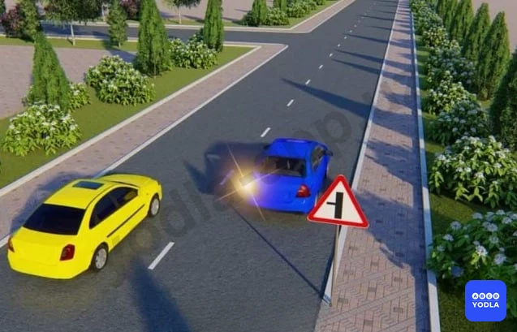

⬜ A. Проехать перекресток в намеченном направлении, не уступая дорогу желтому автомобилю, так как тот движется сзади
⬜ B. Немедленно перестроиться на полосу встречного движения
✅ C. Снизить скорость - дать возможность желтому автомобилю завершив обгон, а затем повернуть налево

> 💡 Как должен поступить водитель синего автомобиля?

Водитель синего автомобиля, намеревающийся повернуть налево, обязан пропустить жёлтый автомобиль, выполняющий обгон сзади. Для этого необходимо снизить скорость, предоставить жёлтому автомобилю возможность завершить обгон, после чего включить указатель левого поворота и выполнить поворот налево.

---

## Вопрос 24

**Разворот запрещается:**

⬜ A. На перекрестках и ближе 15 м от них
⬜ B. Ближе 15 м перед перекрестками
⬜ C. Вне населенных пунктов на участках с видимостью дороги в одном направлении менее 100 м
✅ D. При видимости дороги менее 100 м хотя бы в одном направлении

> 💡 Следовательно, разворот запрещён.

Если расстояние видимости дороги хотя бы в одном направлении составляет менее 100 метров, разворот в данном месте запрещается. Этот случай относится к местам, где разворот запрещён. Остальные варианты являются отвлекающими.

---

## Вопрос 25

**Вы решили повернуть налево или развернуться. Посмотрев в зеркало заднего вида, вы поняли, что следующий за вами водитель начал вас обгонять. Ваши дальнейшие действия?**

⬜ A. Включить левый указатель поворота и, пользуясь благоприятным расположением на проезжей части, приступить к маневру
✅ B. Включить левый указатель поворота лишь после того как вас обгонит следовавший за вами водитель
⬜ C. Включить левый указатель поворота, дать возможность себя обогнать и затем приступить к маневру

> 💡 Вопрос: Вы решили повернуть налево или выполнить разворот. Посмотрев в зеркало заднего вида, вы заметили, что водитель позади намерен выполнить обгон. Какими должны быть ваши дальнейшие действия?

В данной ситуации необходимо пропустить транспортное средство, выполняющее обгон сзади. Водитель, намеревающийся повернуть налево или развернуться, должен дождаться завершения обгона, и только после этого включить указатель левого поворота и выполнить манёвр.

Следовательно, правильный ответ — пропустить транспортное средство, выполняющее обгон, и только после завершения обгона включить указатель левого поворота и выполнить манёвр.

---

## Вопрос 26

**Как должно осуществляется движения транспортных средств на дорогах проезжая часть которых разделена на полосы линиями разметки?**

✅ A. Строго по полосам. Наезжать на прерывистые линии разметки разрешается лишь при перестроении
⬜ B. Не строго по полосам, если проезжая часть свободна от транспортных средств
⬜ C. Не строго по полосам, если габариты транспортных средств по ширине не велики
⬜ D. Не строго по полосам, если на проезжей части отсутствуют автомобили с прицепами и при этом интервал движения можно соблюдать гораздо меньший

> 💡 Вопрос: Как должно осуществляться движение транспортных средств на проезжей части дороги, разделённой линиями разметки?

Если дорожная разметка обозначает отдельные полосы движения, транспортные средства должны двигаться строго по своей полосе движения.

Пересекать продольные линии разметки разрешается только при необходимости перестроения.

Следовательно, правильный ответ — транспортные средства должны двигаться строго по предназначенной для них полосе движения.

---

## Вопрос 27

**В каком из перечисленных случаев разрешается разворот от правого края проезжей части или с правой обочины?**

⬜ A. На регулируемом перекрестке
✅ B. Вне перекрестка, если ширина проезжей части недостаточна для разворота из крайнего левого положения
⬜ C. На нерегулируемом перекрестке, если транспортное средство, совершающее разворот, находится на главной дороге

> 💡 Вопрос: В каком из перечисленных случаев разрешается выполнять разворот от правого края проезжей части или с правой обочины?

Под выражением «вне перекрёстков» понимаются участки дороги, не являющиеся перекрёстками.

Если из-за габаритов транспортного средства выполнить разворот от левого края проезжей части невозможно, разрешается выполнять разворот от правого края проезжей части или с правой обочины. Данное правило, как правило, относится к крупногабаритным грузовым автомобилям.

При выполнении такого манёвра водитель обязан уступить дорогу транспортным средствам, движущимся в попутном и встречном направлениях.

Следовательно, правильный ответ — вне перекрёстков, если габариты транспортного средства не позволяют выполнить разворот от левого края проезжей части, разрешается выполнить разворот от правого края проезжей части или с правой обочины.

---

## Вопрос 28

**Разворот запрещается:**

⬜ A. На пешеходных переходах и в тоннелях
⬜ B. На мостах, путепроводах, эстакадах и под ними
⬜ C. На железнодорожных переездах
⬜ D. При видимости дороги менее 100 м хотя бы в одном направлении
✅ E. Во всех перечисленных случаях

> 💡 Разворот запрещается:

- на пешеходных переходах;
- в тоннелях;
- на мостах, путепроводах, эстакадах и под ними;
- на железнодорожных переездах.

Поэтому, если в вопросе перечислены именно эти варианты, правильный ответ — во всех перечисленных случаях разворот запрещён.

Примечание: В некоторых тестах варианты могут отличаться, поэтому необходимо внимательно читать условие вопроса.

Следовательно, правильный ответ — во всех перечисленных случаях.

---

## Вопрос 29

**В поле на сельскохозяйственных работах, траектории движения грузового автомобиля и трактора пересекаются. Кто должен уступить дорогу?**

⬜ A. Водитель грузового автомобиля водителю трактора
⬜ B. Водитель грузового автомобиля водителю трактора
✅ C. Водитель, к которому транспортное средство приближается справа
⬜ D. Водитель находящийся справа

> 💡 На поле, где проводятся сельскохозяйственные работы, траектории движения грузового автомобиля и трактора пересекаются. В такой ситуации необходимо уступить дорогу транспортному средству, приближающемуся справа.

Согласно пункту 60 Правил дорожного движения, если иной порядок не установлен правилами и траектории движения двух транспортных средств пересекаются, водитель обязан уступить дорогу транспортному средству, находящемуся справа. Водитель, у которого справа нет транспортного средства, имеет право продолжить движение.

Следовательно, правильный ответ — уступить дорогу транспортному средству, приближающемуся справа.

---

## Вопрос 30

**Обязан ли мотоциклист уступить Вам дорогу в данной ситуации?**

⬜ A. Нет
✅ B. Да

> 💡 Поскольку мотоцикл выезжает с полосы разгона, он обязан уступить дорогу транспортным средствам, движущимся по основной дороге.

Следовательно, правильный ответ — водитель мотоцикла должен уступить вам дорогу.

---

## Вопрос 31

**Разрешается ли Вам выполнить разворот с заездом во двор задним ходом?**

⬜ A. Разрешается
✅ B. Разрешается, если при этом не будут созданы помехи другим участникам движения
⬜ C. Запрещается

> 💡 Движение задним ходом на перекрёстках запрещено, однако при въезде во двор такого запрета нет.

Поэтому въезд во двор задним ходом для выполнения разворота разрешается, если этот манёвр не создаёт помех и не представляет опасности для других участников дорожного движения.

Следовательно, правильный ответ — разрешается, если такой манёвр не создаёт помех другим участникам дорожного движения.

---

## Вопрос 32

**Когда Вы обязаны выключить левые указатели поворота, выполняя обгон?**

✅ A. Сразу после завершения маневра
⬜ B. После опережения обгоняемого транспортного средства
⬜ C. По своему усмотрению

> 💡 Указатель левого поворота необходимо выключить сразу после завершения манёвра.

Следовательно, правильный ответ — выключить указатель левого поворота сразу после завершения манёвра.

---

## Вопрос 33

**Для обеспечения безопасности при движении задним ходом в местах, где  видимость ограничено, необходимо:**

⬜ A. Подать звуковой сигнал
⬜ B. Включить аварийную сигнализацию
✅ C. Прибегнуть к помощи других лиц

> 💡 При движении задним ходом в условиях ограниченной видимости для обеспечения безопасности движения необходимо воспользоваться помощью других лиц.

Следовательно, правильный ответ — воспользоваться помощью других лиц для обеспечения безопасности движения.

---

## Вопрос 34

**Когда водитель, который хочет повернуть на дорогах с полосой торможения, должен начать торможение?**

⬜ A. Пока он не перейдет на полосу торможения
✅ B. После выхода на полосу торможения

> 💡 На дороге, имеющей полосу торможения, водитель, намеревающийся выполнить поворот, должен сначала перестроиться на полосу торможения, а затем снизить скорость.

Следовательно, правильный ответ — снизить скорость после перестроения на полосу торможения.

---

## Вопрос 35

**Какое транспортное средство должно уступить дорогу в данной ситуации?**

⬜ A. Легковой автомобиль
✅ B. Грузовик

> 💡 На рисунке водитель автомобиля Spark намерен объехать неисправный грузовой автомобиль. В такой ситуации необходимо уступить дорогу транспортному средству, движущемуся во встречном направлении.

Поэтому в данном случае уступить дорогу должен не водитель легкового автомобиля, а водитель грузового автомобиля.

Следовательно, правильный ответ — водитель грузового автомобиля должен уступить дорогу.

---

## Вопрос 36

**Разрешается ли водителю на данном перекрестке выполнять указанный маневр движением задним ходом?**

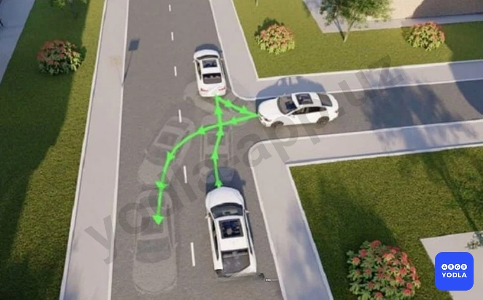

⬜ A. Разрешено
✅ B. Запрещено

> 💡 Движение задним ходом на перекрёстках запрещено.

Следовательно, правильный ответ — выполнение данного манёвра не разрешается.

---

## Вопрос 37

**Кто должен уступить в этом случае?**

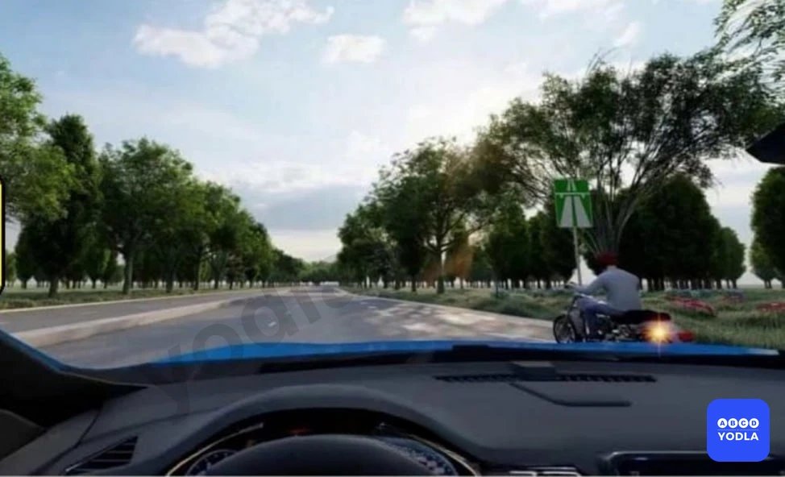

⬜ A. Водитель автомобиля
✅ B. Водитель мотоцикла

> 💡 В данной ситуации водитель мотоцикла должен уступить дорогу, поскольку он выезжает с полосы разгона.

Следовательно, правильный ответ — водитель мотоцикла должен уступить дорогу.

---

## Вопрос 38

**В этой ситуации вы едете по правой полосе, должны ли вы уступить дорогу транспортному средству, перестраивающемуся на вашу полосу?**

✅ A. Не должны
⬜ B. Должны

> 💡 В данной ситуации вы не обязаны уступать дорогу транспортному средству, которое движется по правой полосе и намерено перестроиться на вашу полосу.

Водитель, выполняющий перестроение, обязан уступить дорогу транспортным средствам, движущимся по полосе, на которую он собирается перестроиться. Он может выполнить манёвр только после того, как пропустит вас.

Следовательно, правильный ответ — вы не обязаны уступать дорогу, уступить должен водитель, выполняющий перестроение.

---

## Вопрос 39

**Способ разворота с использованием прилегающей территории слева, обеспечивающий безопасность движения, показан:**

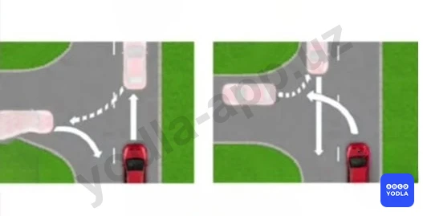

⬜ A. Только на левом рисунке
✅ B. Только на правом рисунке
⬜ C. На обоих рисунках

> 💡 В данной ситуации более безопасным считается вариант, требующий меньшего движения задним ходом. На обоих рисунках показан манёвр разворота, однако следует выбрать вариант, при котором требуется меньше двигаться задним ходом.

Чем меньше расстояние движения задним ходом, тем ниже вероятность столкновения с другими транспортными средствами.

Следовательно, правильный ответ — вариант, требующий меньшего движения задним ходом.

---

## Вопрос 40

**В каком ответе правильноуказан  места где запрещается движение задним ходом?**

⬜ A. На пешеходных переходах
⬜ B. В тоннелях
⬜ C. На перекрестках
✅ D. Во всех перечисленных случея

> 💡 Движение задним ходом запрещено на перекрёстках, в тоннелях и на пешеходных переходах.

Следовательно, правильный ответ — движение задним ходом запрещено во всех перечисленных местах.

---

## Вопрос 41

**Жельтый автомобил поворачивая налево какую полосу дольжен занимать?**

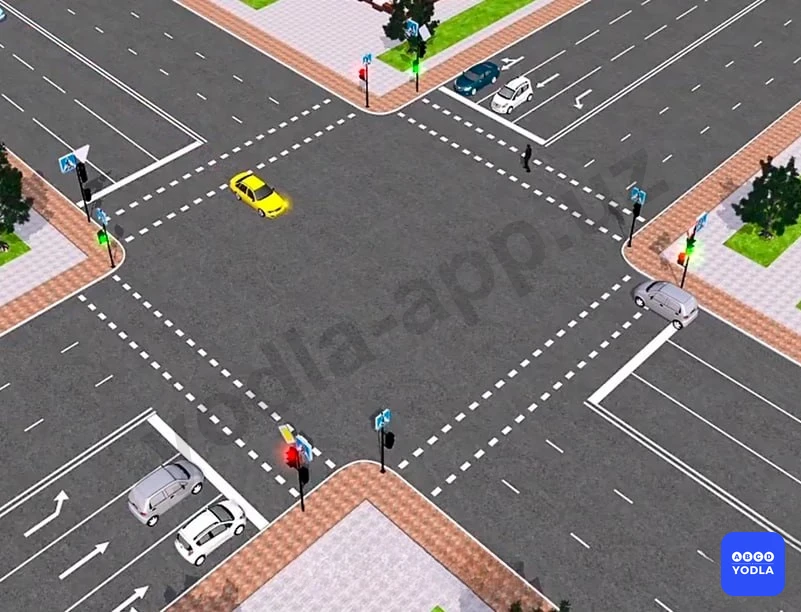

⬜ A. Правую полосу
⬜ B. Левую полосу
⬜ C. Средную полосу
✅ D. Любую полосу

> 💡 При повороте налево водитель может занять любую полосу движения. Однако рекомендуется по возможности занимать крайнюю левую или среднюю полосу.

Для транспортных средств, движущихся во встречном направлении, крайняя правая полоса предназначена для поворота направо. При включении зелёного сигнала светофора разрешается как поворот налево, так и поворот направо.

Согласно правилам, водитель, поворачивающий налево, обязан уступить дорогу транспортному средству, поворачивающему направо со встречного направления. Однако, если транспортные средства не создают помех друг другу, они могут выполнить поворот одновременно.

Следовательно, правильный ответ — водитель, поворачивающий налево, может занять любую полосу движения.

---

## Вопрос 42

**Кто должен уступить дорогу при одновременном развороте?**

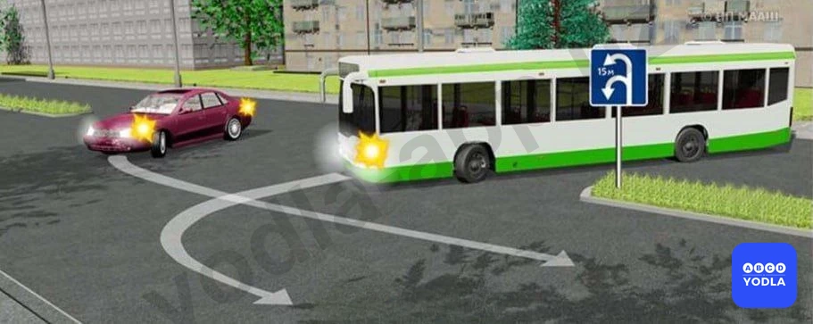

✅ A. Водитель автобуса
⬜ B. Водитель легкового автомобиля
⬜ C. В данной ситуации водителям следует действовать по взаимной договоренности

> 💡 При повороте налево водитель может занять любую полосу движения. Однако рекомендуется по возможности занимать крайнюю левую или среднюю полосу.

Для транспортных средств, движущихся во встречном направлении, крайняя правая полоса предназначена для поворота направо. При включении зелёного сигнала светофора обоим направлениям разрешается выполнять поворот.

Согласно правилам, водитель, поворачивающий налево, обязан уступить дорогу транспортному средству, поворачивающему направо со встречного направления. Однако, если транспортные средства не создают помех друг другу, они могут выполнить поворот одновременно.

Следовательно, правильный ответ — водитель, поворачивающий налево, может занять любую полосу движения.

---

## Вопрос 43

**Как Вам следует действовать, выезжая с места стоянки одновременно с другим автомобилем?**

✅ A. Уступить дорогу
⬜ B. Проехать первым
⬜ C. По взаимной договоренности с водителем этого автомобиля

> 💡 При выезде с места стоянки, если траектории движения транспортных средств пересекаются, необходимо уступить дорогу транспортному средству, приближающемуся справа.

Если в вопросе не указано, какое транспортное средство имеется в виду, предполагается, что вашим транспортным средством является автомобиль, расположенный на рисунке ближе всего к вам. В данном случае это красный автомобиль.

Следовательно, правильный ответ — уступить дорогу транспортному средству, приближающемуся справа.

---

## Вопрос 44

**Водитель какого транспортного средства должен уступить дорогу в данной ситуации?**

⬜ A. Водитель белого автомобиля
✅ B. Водитель красного автомобиля

> 💡 В данной ситуации уступить дорогу должен водитель транспортного средства, у которого справа находится другое транспортное средство.

В этом случае правая сторона водителя красного автомобиля занята, поэтому именно он обязан уступить дорогу.

Следовательно, правильный ответ — водитель красного автомобиля должен уступить дорогу.

---

## Вопрос 45

**В этой ситуации кто должен уступить дорогу?**

⬜ A. Водитель микроавтобуса
✅ B. Водитель легкового автомобиля

> 💡 В данной ситуации водитель легкового автомобиля продолжает движение, поскольку его правая сторона занята.

Следовательно, правильный ответ — водитель легкового автомобиля продолжает движение.

---

## Вопрос 46

**Какой водитель автомобиля должен уступить дорогу?**

✅ A. Водитель синего автомобиля
⬜ B. Водитель зелёного автомобиля

> 💡 В данной ситуации водитель синего автомобиля должен уступить дорогу, поскольку применяется правило «помехи справа».

Следовательно, правильный ответ — водитель синего автомобиля должен уступить дорогу.

---

## Вопрос 47

**Какой автомобиль нарушил правило поворота на перекрёстке?**

✅ A. Красный автомобиль
⬜ B. Синий автомобиль
⬜ C. Оба нарушили
⬜ D. Ни один не нарушил

> 💡 В данной ситуации водитель синего автомобиля не нарушил правила. Из-за неисправного белого автомобиля средняя и правая полосы были заняты, поэтому поворот был выполнен со второй полосы.

Водитель красного автомобиля, не въехав на полосу разгона, сразу выехал на основную дорогу. Такое действие является нарушением Правил дорожного движения.

Следовательно, правильный ответ — правила нарушил водитель красного автомобиля.

---

## Вопрос 48

**Разрешается опережение безрельсового транспортного средства, движущегося в одном направлении (не начавшего поворот):**

⬜ A. Только слева
⬜ B. Только справа
✅ C. С обеих сторон

> 💡 Безрельсовое транспортное средство, движущееся в попутном направлении и не выехавшее на трамвайные пути для поворота налево, разрешается обгонять как слева, так и справа.

Следовательно, правильный ответ — обгон разрешается как с левой, так и с правой стороны.

---

## Вопрос 49

**В каком направлении автомобилю разрешено повернуть?**

✅ A. Hаправлении A
⬜ B. Hаправлении B
⬜ C. В обоих направлениях

> 💡 Разворот разрешается выполнять только с крайней левой полосы. В данной ситуации разворот разрешён в направлении А.

Следовательно, правильный ответ — разворот разрешён в направлении А.

---

## Вопрос 50

**Водитель автомобиля в каком направлении нарушает правила?**

⬜ A. A
⬜ B. B
✅ C. Нарушает правила в обоих направлениях
⬜ D. Не нарушает правила ни в одном направлении

> 💡 Поворот направо в направлении А запрещён. Поворот в направлении Б разрешён, однако при перестроении на данную полосу водитель пересёк сплошную линию разметки.

Таким образом, в обоих случаях требования Правил дорожного движения нарушены.

Следовательно, правильный ответ — нарушения допущены в направлениях А и Б.

---

## Вопрос 51

**Как называют водителя этого черного автомобиля, когда он меняет направление движения?**

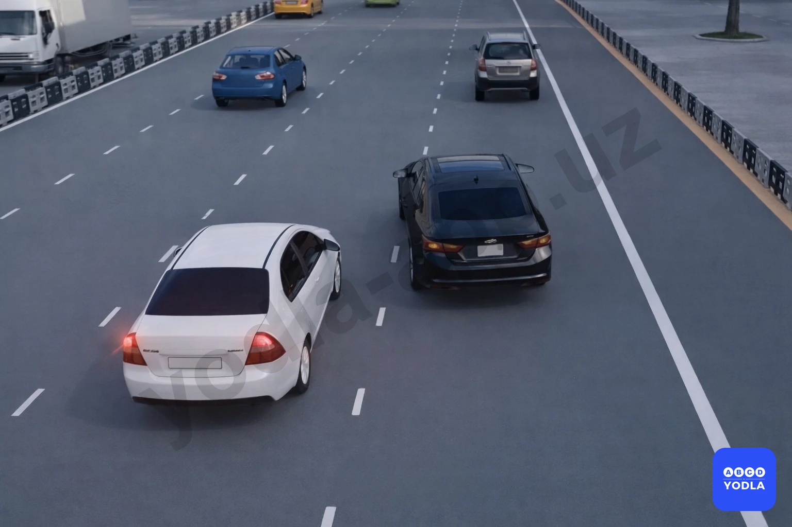

⬜ A. Маневриров��ние
⬜ B. Измените количество деталей
⬜ C. Медленное движение
✅ D. Создание аварийной ситуации 
⬜ E. Все ответы верны.

> 💡 Резкое изменение направления движения водителем чёрного транспортного средства расценивается как создание аварийной ситуации.

Следовательно, правильный ответ — создание аварийной ситуации.

---

## Вопрос 52

**Какой водитель правильно выполнил поворот?**

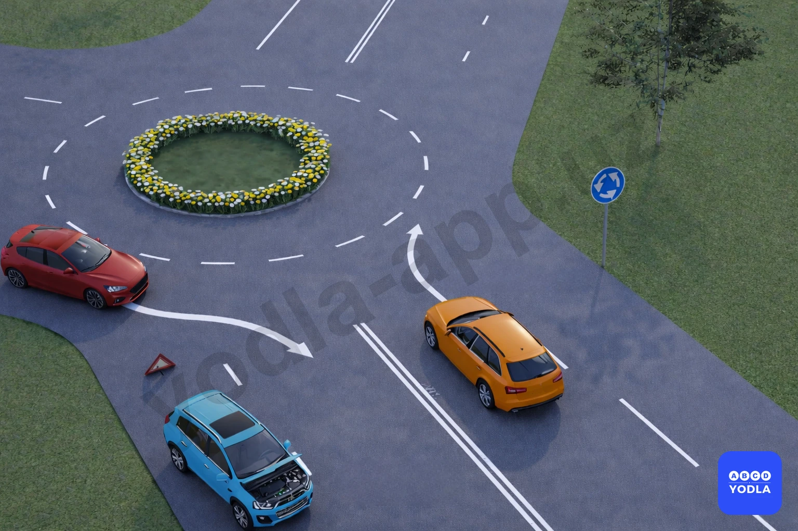

⬜ A. Оба неправильно
⬜ B. Синий
✅ C. Оба правильно
⬜ D. Зелёный

> 💡 В данной ситуации оба водителя выполнили поворот правильно. Въезд на перекрёсток с круговым движением разрешается с любой полосы.

Синий автомобиль выполняет поворот со второй полосы из-за препятствия на дороге, что не считается нарушением.

Следовательно, правильный ответ — оба водителя выполнили поворот правильно.

---

## Вопрос 53

**На каком рисунке водителям запрещён разворот?**

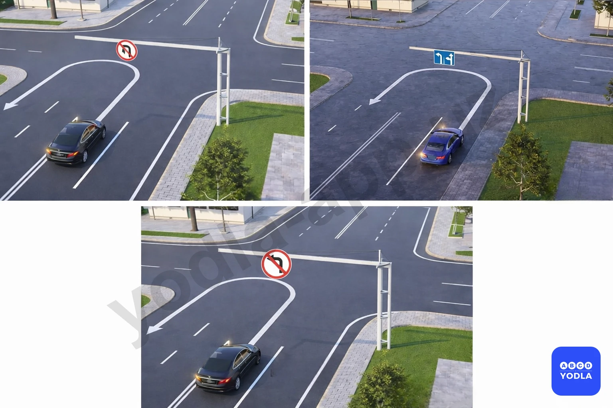

⬜ A. На всех рисунках
⬜ B. Только на рисунке ниже
⬜ C. Только на рисунке справа
✅ D. Только на рисунках слева и справа
⬜ E. Только на рисунке слева

> 💡 На первом и втором рисунках разворот запрещён.

На втором рисунке разворот запрещён, поскольку он должен выполняться только с крайней левой полосы.

На третьем рисунке разворот не запрещён. В данном месте запрещён только поворот налево.

Следовательно, правильный ответ — разворот запрещён на первом и втором рисунках.

---

## Вопрос 54

**Какое транспортное средство должно уступить дорогу?**

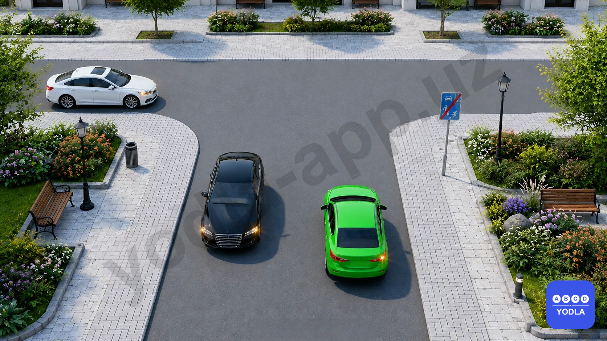

✅ A. Белый автомобиль
⬜ B. Зеленый автомобиль

> 💡 На основании пункта 75 главы 10 ПДД: 75. Если встречный разъезд затруднен, то водитель на стороне которого имеется препятствие, должен уступить дорогу.

---

## Вопрос 55

**В показанной ситуации какое транспортное средство должно уступить дорогу?**

✅ A. Белый автомобиль
⬜ B. Синий автомобиль

> 💡 На основании пункта 75 главы 10 ПДД: 75. Если встречный разъезд затруднен, то водитель на стороне которого имеется препятствие, должен уступить дорогу.

---

## Вопрос 56

**Какое транспортное средство движется правильно?**

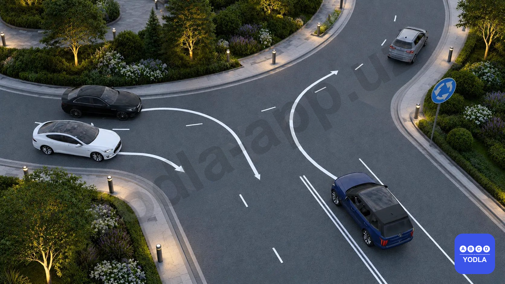

⬜ A. Синий автомобиль
✅ B. Белый и синий автомобили
⬜ C. Белый автомобиль
⬜ D. Все неправильно
⬜ E. Все правильно

> 💡 Согласно главе 9, пункту 56 (абзац 1) и пункту 57 (абзац 2) Правил дорожного движения:

56. Перед поворотом направо, налево или разворотом водитель обязан заранее занять соответствующее крайнее положение на проезжей части, предназначенной для движения в данном направлении.

57. При повороте направо транспортное средство должно двигаться как можно ближе к правому краю проезжей части.

В данной ситуации и белый, и синий автомобили движутся в соответствии с Правилами дорожного движения.

---

