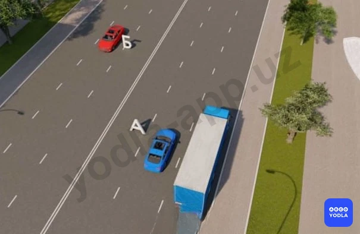
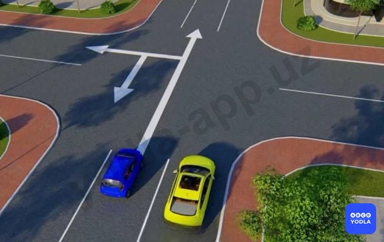
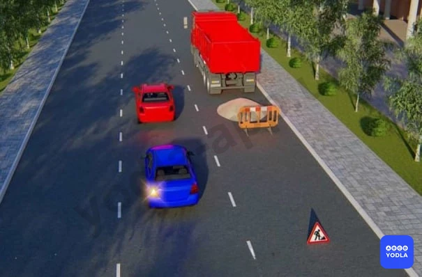
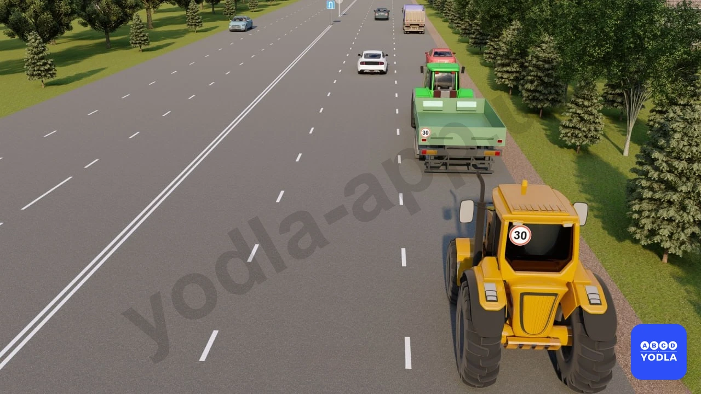
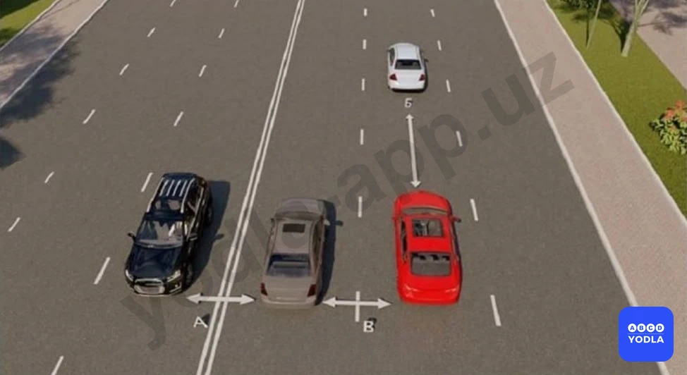
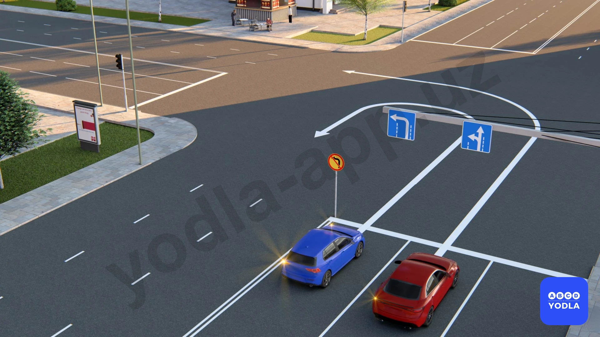

# 18. Расположение транспортных средств на проезжей части (боб 10)

Всего вопросов: 42

## Вопрос 1

**Когда запрещается выезжать на сторону дороги, предназначенную для встречного движения?**

⬜ A. На дорогах с двухсторонним движением, имеющим четыре полосы и более
⬜ B. На дорогах двухсторонним движением, имеющих четыре полосы для движения при наличии дорожной разметки в виде двух сплошных линий, разделяющих транспортные потоки противоположных направлений
✅ C. Во всех перечисленных случаях

> 💡 Выезд на сторону дороги, предназначенную для встречного движения, запрещается независимо от наличия или отсутствия дорожной разметки.

Следовательно, правильный ответ — выезд на встречную полосу запрещён во всех перечисленных случаях.

---

## Вопрос 2

**На дороге с двухсторонним движением, имеющей три полосы, Вам необходимо повернуть направо. С какой полосы Вы осуществите данный маневр?**

✅ A. С правой полосы
⬜ B. Со средней полосы
⬜ C. С правой или средней полосы
⬜ D. Со средней полосы, но лишь когда занята правая полоса

> 💡 На трёхполосной дороге с двусторонним движением поворот направо выполняется только из крайней правой полосы.

Средняя полоса используется только для поворота налево или разворота.

Следовательно, правильный ответ — поворот направо выполняется из крайней правой полосы.

---

## Вопрос 3

**В каком направлении разрешается движение автомобилям?**

⬜ A. Красному автомобилю –прямо, синему автомобилю- прямо и налево
⬜ B. Красному и синему автомобилям-прямо
✅ C. Красному автомобилю –прямо, синему- налево или обратно

> 💡 В данной ситуации грузовому автомобилю с крайней левой полосы разрешается только поворот налево и разворот. Движение прямо с этой полосы запрещено.

Транспортные средства, намеревающиеся двигаться прямо, могут использовать остальные полосы движения, но не крайнюю левую.

Дорожный знак распространяется на все транспортные средства. Поэтому не следует делать вывод только по знаку, необходимо также учитывать правила движения по полосам.

Следовательно, правильный ответ — красному автомобилю разрешено движение прямо, а синему автомобилю разрешены поворот налево и разворот.

---

## Вопрос 4

**Когда транспортное средство должно двигаться только по крайней правой полосе?**

⬜ A. При перевозке тяжеловесных и крупногабаритных грузов
⬜ B. Если водитель почувствовал болезненное состояние
⬜ C. Если во время движения ослабло крепление груза
✅ D. Когда транспортное средство по техническим причинам не может превышать скорость 40 км/ч

> 💡 Транспортное средство должно двигаться только по крайней правой полосе, если по техническим причинам оно не может развивать скорость более 40 км/ч.

Следовательно, правильный ответ — транспортное средство должно двигаться только по крайней правой полосе, если по техническим причинам не может двигаться со скоростью более 40 км/ч.

---

## Вопрос 5

**Что называется; дистанцией?**

✅ A. Расстояние «А»
⬜ B. Расстояние «Б»
⬜ C. Расстояние «А» и «Б»

> 💡 Под дистанцией понимается расстояние, обозначенное буквой А.

Следовательно, правильный ответ — расстояние А.

---

## Вопрос 6

**Кто из водителей легковых автомобилей нарушает правила при движении в населенном пункте?**

⬜ A. Только водитель автомобиля «Б»
⬜ B. Оба нарушают
✅ C. Оба не нарушают

> 💡 В данной ситуации ни один из водителей легковых автомобилей не нарушает правила движения. Водитель грузового автомобиля также не нарушает Правила дорожного движения.

Согласно Правилам дорожного движения, в населённых пунктах при отсутствии интенсивного движения и заторов рекомендуется двигаться по крайней правой полосе. Однако, если правая полоса свободна, допускается движение и по другим полосам.

Следовательно, правильный ответ — в данной ситуации никто из водителей не нарушает правила.

---

## Вопрос 7

**Вы поворачиваете на дорогу с реверсивным движением. По какой полосе после поворота Вы имеете право двигаться?**

⬜ A. В населенных пунктах движение разрешается по любой полосе
✅ B. По крайней правой полосе. Перестраиваться разрешается только после проезда реверсивного светофора или знака “Направления движения по полосам”; разрешающего движение и по другим полосам
⬜ C. Вне населенных пунктов по возможности ближе к правому краю проезжей части

> 💡 После поворота с полосы реверсивного движения водитель должен двигаться только по крайней правой полосе.

Перестроение на другие полосы допускается только в том случае, если сигналы реверсивного светофора разрешают движение по этим полосам, и после проезда знаков направления движения по полосам.

Следовательно, правильный ответ — сначала необходимо двигаться по крайней правой полосе, а затем, при наличии разрешения, можно перестроиться на другие полосы.

---

## Вопрос 8

**Разрешается ли движение по трамвайным путям при проезде перекрестка?**

⬜ A. Запрещается
⬜ B. Разрешается; если не создаются помехи трамваю
⬜ C. Разрешается; по трамвайным путям попутного направления
✅ D. Разрешается по трамвайным путям попутного направления при интенсивном движении на других полосах, объезде, опережении. При этом не должно создаваться помех трамваю

> 💡 При пересечении перекрёстка движение по трамвайным путям попутного направления разрешается для объезда, если остальные полосы движения загружены.

Это допускается при отсутствии дорожных знаков 5.8.1 и 5.8.2. При этом водитель не должен создавать помех движению трамвая.

Следовательно, правильный ответ — движение по трамвайным путям попутного направления разрешается, если другие полосы загружены и отсутствуют знаки 5.8.1 и 5.8.2.

---

## Вопрос 9

**По какой полосе разрешается движение грузовых автомобилей с разрешенной максимальной массой более 3,5 т в населенных пунктах?**

⬜ A. По возможности ближе к правому краю проезжей части
⬜ B. По любой полосе; при интенсивном движении на других полосах
✅ C. По любой полосе, однако, если для движения безрельсовых транспортных средств в одном направлении имеются три полосы и более, то на крайнюю левую полосу разрешается выезжать только для поворота налево, разворота и остановки на дорогах с односторонним движением

> 💡 В населённых пунктах грузовые автомобили с разрешённой максимальной массой более 3,5 тонн должны двигаться как можно ближе к крайней правой полосе проезжей части.

Следовательно, правильный ответ — двигаться как можно ближе к крайней правой полосе.

---

## Вопрос 10

**Вы движетесь по дороге с двухсторонним движением; имеющей три полосы. В каком случае разрешается выезжать на среднюю полосу?**

⬜ A. Только для обгона
⬜ B. Только для объезда
⬜ C. Только для поворота налево или разворота
✅ D. Во всех перечисленных случаях

> 💡 При пересечении перекрёстка движение по трамвайным путям попутного направления разрешается для объезда, если остальные полосы движения загружены.

Это допускается при отсутствии дорожных знаков 5.8.1 и 5.8.2. При этом водитель не должен создавать помех движению трамвая.

Следовательно, правильный ответ — движение по трамвайным путям попутного направления разрешается, если другие полосы загружены и отсутствуют знаки 5.8.1 и 5.8.2.

---

## Вопрос 11

**Как определяется количество полос для движения безрельсовых транспортных средств?**

⬜ A. Дорожной разметкой
⬜ B. Дорожными знаками «Направления движения по полосам» или «Направление движения по полосе»
⬜ C. Самим водителем с учетом ширины проезжей части, габаритов транспортных средств и необходимых интервалов между ними
✅ D. Всеми перечисленными способами

> 💡 Количество полос движения определяется дорожной разметкой или дорожными знаками. При их отсутствии водители самостоятельно определяют количество полос, учитывая ширину проезжей части и необходимый боковой интервал для безопасного движения транспортных средств.

Следовательно, правильный ответ — количество полос определяется всеми перечисленными способами.

---

## Вопрос 12

**На дороге с двухсторонним движением имеющих три полосы вы должны повернуть на право. С какой полосы произведете этот маневр?**

✅ A. С правой полосы
⬜ B. Со средней полосы
⬜ C. С правой или средней полосы
⬜ D. Со средней, только в том случае когда правая сторона занята

> 💡 На трёхполосной дороге с двусторонним движением поворот направо выполняется только из крайней правой полосы.

Следовательно, правильный ответ — поворот направо выполняется из крайней правой полосы.

---

## Вопрос 13

**Разрешается ли выезжать на крайнюю левую полосу предназначенную для встречного движения на дорогах с двухсторонним движением имеющих три полосы?**

⬜ A. Разрешается для обгона
⬜ B. Разрешается во всех случаях
✅ C. ��апрещается

> 💡 На трёхполосной дороге с двусторонним движением выезд на крайнюю левую полосу, предназначенную для встречного движения, запрещён.

Следовательно, правильный ответ — запрещается.

---

## Вопрос 14

**В каком направлении разрешается движение синему автомобилю?**

⬜ A. Только в обратном направлении
⬜ B. Прямо, налево и в обратном направлении
✅ C. Налево и в обратном направлении
⬜ D. Во всех направлениях

> 💡 На трёхполосной дороге с двусторонним движением движение по средней полосе разрешается только для поворота налево и разворота. Движение прямо по средней полосе запрещено.

Следовательно, правильный ответ — разрешены поворот налево и разворот.

---

## Вопрос 15

**Где не должно оказаться транспортное средство при выезде с пересечения проезжих частей во время поворота?**

⬜ A. На левой полосе, если свободна правая полоса
✅ B. На стороне встречного движения
⬜ C. На левой полосе, если имеются не менее трех полос для движения в одном направлении
⬜ D. На левой полосе, если имеется две полосы для движения в одном направлении только грузовым автомобилям с разрешенной максимальной массой более 3.5 т

> 💡 При выполнении поворота, выезжая с пересечения проезжих частей, транспортное средство не должно оказаться на полосе встречного движения.

В противном случае это создаст помехи другим участникам дорожного движения и может привести к возникновению аварийной ситуации.

Следовательно, правильный ответ — транспортное средство не должно выезжать на полосу встречного движения.

---

## Вопрос 16

**Разрешается ли водителю синего автомобиля выполнять обгон?**

⬜ A. Разрешается
✅ B. Запрещается
⬜ C. Разрешается, если красный автомобиль движется со скоростью менее 40 км/час

> 💡 В данной ситуации на трёхполосной дороге с двусторонним движением красный автомобиль объезжает неисправное транспортное средство или участок, где проводятся дорожные работы.

Синий автомобиль намерен обогнать красный автомобиль с выездом на полосу встречного движения. Такой выезд запрещён.

Следовательно, правильный ответ — водителю синего автомобиля обгон выполнять запрещено.

---

## Вопрос 17

**По какой полосе разрешается движение безрельсовых транспортных средств в населенных пунктах, если имеются три полосы и более в одном направлении? Грузовые автомобили не учитывать**

⬜ A. По любой полосе
⬜ B. По возможности ближе к правому краю проезжей части
✅ C. По любой полосе кроме крайней левой, на которою разрешается выезжать только при интенсивном движении на других поло��ах а также для поворота налево,разворота и остановки на дороге с односторонним движением

> 💡 В населённых пунктах легковые автомобили могут двигаться по любой полосе, кроме крайней левой, даже если другие полосы свободны.

На дорогах с тремя и более полосами крайняя левая полоса используется только для поворота налево, разворота, движения при интенсивном потоке транспорта, а на дорогах с односторонним движением — также для остановки.

Следовательно, правильный ответ — **разрешается движение по любой полосе, кроме крайней левой.**

---

## Вопрос 18

**Нарушает ли водитель правила при движении вне населенного пункта?**

✅ A. Да
⬜ B. Нет

> 💡 Водитель нарушает Правила дорожного движения за пределами населённого пункта.

Согласно пункту 67 Правил дорожного движения, за пределами населённых пунктов запрещается занимать левую полосу, если правая полоса свободна.

В данной ситуации правая полоса свободна, однако водитель продолжает движение по левой полосе, тем самым нарушая требования Правил.

Следовательно, правильный ответ — водитель нарушает правила, необоснованно занимая левую полосу.

---

## Вопрос 19

**В каких случаях разрешается выезжать за пределы правой полосы, если Вы управляете транспортным средством, скорость которого по техническим причинам не может быть более 40 км/ч?**

⬜ A. Только при перестроении перед поворотом налево либо разворотом
⬜ B. Только при обгоне или объезде
✅ C. Во всех перечисленных случаях
⬜ D. Во всех перечисленных случаях, а также при наличии трех и более полос для движения в одном направлении

> 💡 Транспортному средству, которое не может двигаться со скоростью более 40 км/ч, разрешается выезжать на левую полосу только в отдельных случаях.

К таким случаям относятся поворот налево, разворот, объезд препятствия, а также обгон в случаях, предусмотренных Правилами дорожного движения.

Следовательно, правильный ответ — во всех перечисленных случаях.

---

## Вопрос 20

**Разрешается ли водителю красного автомобиля двигаться по трамвайным путям?**

✅ A. Разрешается
⬜ B. Запрещается

> 💡 Водителю красного автомобиля разрешается двигаться по трамвайным путям.

Согласно пункту 69 Правил дорожного движения, если трамвайные пути расположены на одном уровне с проезжей частью, водитель может выехать на них, если его полоса занята, например, неисправным транспортным средством, либо при интенсивном движении, когда другого пути нет. При этом он не должен создавать помех движению трамвая.

Следовательно, правильный ответ — водителю красного автомобиля разрешается движение по трамвайным путям при условии, что он не создаёт помех трамваю.

---

## Вопрос 21

**Допускается ли движение транспортных средств по тротуарам и пешеходным дорожкам?**

⬜ A. Допускается, если это не затрудняет движение пешеходов
⬜ B. Не допускается, так как это может поставить под угрозу безопасность пешеходов
✅ C. Допускается при обслуживании торговых и других предприятий расположенных непосредственно у этих тротуаров или дорожек
⬜ D. Допускается для объезда стоящего у тротуара другого транспортного средства

> 💡 Движение транспортных средств по тротуару и пешеходной дорожке, как правило, запрещено.

Однако согласно пункту 72 Правил дорожного движения движение разрешается, если необходимо обслужить торговое или другое предприятие, расположенное непосредственно у тротуара или пешеходной дорожки, при отсутствии другого подъезда.

Следовательно, правильный ответ — движение разрешается для обслуживания объектов, расположенных непосредственно у тротуара или пешеходной дорожки, если отсутствует другой подъезд.

---

## Вопрос 22

**Где на проезжей части вне населенных пунктов водители должны вести транспортные средства?**

✅ A. По возможности ближе к правому краю проезжей части
⬜ B. По любой полосе
⬜ C. Только по правой полосе. Выезд на левую полосу разрешается для поворота налево или разворота

> 💡 Вне населённых пунктов водители должны двигаться как можно ближе к правому краю проезжей части.

Это требование установлено пунктом 67 Правил дорожного движения.

Следовательно, правильный ответ — двигаться как можно ближе к правому краю проезжей части.

---

## Вопрос 23

**Укажите расстояние, под которым в Правилах понимается «боковой интервал»:**

⬜ A. Только «А»
⬜ B. Только «Б»
⬜ C. Только «В»
✅ D. «А» и «В»

> 💡 Боковой интервал обозначен расстояниями А и Б.

Следовательно, правильный ответ — расстояния А и Б.

---

## Вопрос 24

**По какой полосе разрешается движение после этого знака?**

⬜ A. По любой полосе
✅ B. По правой полосе
⬜ C. Только по левой полосе

> 💡 Данный дорожный знак обозначает конец населённого пункта. После него движение осуществляется за пределами населённого пункта.

Согласно Правилам дорожного движения, за пределами населённого пункта при свободной правой полосе запрещается занимать левую полосу. Поэтому водитель должен двигаться по правой полосе.

Следовательно, правильный ответ — разрешается движение по правой полосе.

---

## Вопрос 25

**Можете ли Вы продолжить движение по средней полосе после обгона?**

⬜ A. Да
✅ B. Нет

> 💡 На трёхполосной дороге с двусторонним движением средняя полоса может использоваться для поворота налево, разворота или обгона.

После завершения обгона продолжать движение по средней полосе запрещается. Водитель должен перестроиться на правую полосу своего направления.

Следовательно, правильный ответ — нет, после завершения обгона продолжать движение по средней полосе нельзя.

---

## Вопрос 26

**Зависит ли выбор бокового интервала от скорости движения?**

⬜ A. Выбор бокового интервала от скорости движения не зависит
✅ B. При увеличении скорости движения боковой интервал необходимо увеличить

> 💡 При выборе бокового интервала необходимо учитывать скорость движения транспортного средства. С увеличением скорости боковой интервал также должен увеличиваться.

Следовательно, правильный ответ — да, с увеличением скорости боковой интервал необходимо увеличивать.

---

## Вопрос 27

**Укажите дистанцию между транспортными средствами.**

⬜ A. А и В
⬜ B. В
✅ C. Б

> 💡 Безопасная дистанция — это расстояние между двумя транспортными средствами, движущимися в одном направлении. На данном рисунке она обозначена расстоянием Б.

Следовательно, правильный ответ — расстояние Б.

---

## Вопрос 28

**Кто должен уступить дорогу эсли встречный разъезд затруднён?**

⬜ A. Водитель на стороне которого не имеется препятствие.
✅ B. Водитель на стороне которого имеется препятствие.

> 💡 Согласно пункту 75 Правил дорожного движения, если из-за препятствия встречный разъезд затруднён, водитель, на стороне которого находится препятствие, обязан уступить дорогу.

Следовательно, правильный ответ — уступить дорогу должен водитель, на стороне которого находится препятствие.

---

## Вопрос 29

**Какую дистанцию должен соблюдать водитель до движущегося впереди транспортного средства?**

⬜ A. 20 м
⬜ B. 50 м
✅ C. Водитель должен соблюдать такую дистанцию до движущегося впереди транспортного средства, которая гарантировала бы избежание столкновения в случае его экстренной остановки

> 💡 Водитель должен соблюдать такую дистанцию до впереди движущегося транспортного средства, которая позволит избежать столкновения даже в случае его резкого торможения.

Следовательно, правильный ответ — соблюдать дистанцию, достаточную для предотвращения столкновения при резком торможении впереди идущего транспортного средства.

---

## Вопрос 30

**Как водителю определять количество полос движения дороги, если нет разметки или дорожных знаков, указывающей количество полос движения для безрельсовых транспортных средств?**

✅ A. Самими водителями, с учётом ширины проезжей части, габаритов транспортных средств и необходимых интервалов между ними
⬜ B. Такую дорогу следует рассматривать как двухполосная дорога, на котором организовано двустороннее движение

> 💡 Как водителю определить количество полос проезжей части, если отсутствуют дорожные знаки или дорожная разметка?

В таких случаях водитель самостоятельно определяет количество полос, учитывая ширину проезжей части, необходимый боковой интервал между транспортными средствами, возможность безопасного разъезда двух автомобилей, а также их габаритные размеры. Исходя из габаритов своего транспортного средства, каждый водитель самостоятельно определяет, по какой полосе следует двигаться.

---

## Вопрос 31

**В каких случаях водителям следует двигаться по фиксированным полосам движения, если проезжая часть разделена полосами дороги?**

⬜ A. Только при интенсивном движении
⬜ B. Только если полосы движения обозначены сплошными линиями разметки
✅ C. Во всех случаях

> 💡 Водитель, двигаясь по проезжей части, обязан двигаться в пределах своей полосы независимо от того, нанесена ли дорожная разметка прерывистой или сплошной линией. Это правило действует как при интенсивном движении, так и при свободном движении. То есть водитель должен двигаться по одной полосе, а перестроение в другую полосу допускается только при необходимости и с соблюдением требований Правил дорожного движения. Следовательно, правильный ответ — во всех случаях.

---

## Вопрос 32

**На любой дороге с тремя и более полосамидвижения в одном направлении грузовымавтомобилям разрешается занимать крайнююлевую полосу:**

⬜ A. При обгоне, повороте налево иразвороте
⬜ B. При обгоне и объезде
✅ C. F3При повороте налево и развороте
⬜ D. Во всех случаях

> 💡 Если дорога в одном направлении имеет три и более полосы движения, то грузовым автомобилям разрешается занимать крайнюю левую полосу только для поворота налево или разворота. Движение прямо по крайней левой полосе грузовым автомобилям запрещено.

---

## Вопрос 33

**Должны ли Вы уступить дорогу встречному грузовому автомобилю?**

⬜ A. Да
✅ B. Нет

> 💡 В данной ситуации вы видите, что водитель автомобиля Spark включил аварийную сигнализацию и выставил знак аварийной остановки, то есть на его стороне образовалось препятствие. Водитель грузового автомобиля пытается объехать это препятствие. Согласно пункту 75 Правил дорожного движения, именно водитель грузового автомобиля обязан уступить дорогу транспортному средству, движущемуся навстречу. Мы продолжаем движение прямо, и препятствия на нашей стороне нет, поэтому уступать дорогу грузовому автомобилю мы не обязаны. Правильный ответ — «Нет».

---

## Вопрос 34

**Какие транспортного средства нарушает правило остановки в населённых пунктах?**

⬜ A. Водитель жёлтого автомобиля
⬜ B. Водитель синего автомобиля
✅ C. Оба не нарушили
⬜ D. Оба нарушили

> 💡 В данной ситуации вопрос звучит так: «Какой водитель в населённом пункте нарушает правила остановки?» Правильный ответ — «Никто не нарушает».

Объясню почему. Водитель жёлтого автомобиля имеет опознавательный знак «Инвалид». Поскольку установлен дорожный знак «Остановка запрещена, кроме инвалидов», ему разрешено остановиться в этом месте.

Синий автомобиль остановился с левой стороны дороги. Такая остановка разрешается при соблюдении четырёх условий:

Дорога находится в населённом пункте.
Посередине отсутствуют трамвайные пути.
Дорога имеет по одной полосе движения в каждом направлении (всего две полосы).
Дорожная разметка разрешает такую остановку.

Все эти условия выполнены, поэтому водитель синего автомобиля также не нарушает Правила дорожного движения.

Следовательно, правильный ответ — оба водителя правила не нарушают.

---

## Вопрос 35

**Если дорожные знаки и разметка не указывают иное направление, с какой стороны водители должны объезжать островки безопасности, столбы и дорожные сооружения (мосты, эстакады и тому подобное) на дорогах с двусторонним движением без разделительной полосы?**

✅ A. Объезжать только с правой стороны
⬜ B. Объезжать только с левой стороны
⬜ C. Объезжать с обеих сторон

> 💡 ли дорожные знаки и разметка не указывают направление объезда препятствия, например перед мостом, водитель должен руководствоваться правилом правой стороны. В соответствии с требованиями пункта 76 Правил дорожного движения препятствие следует объезжать справа.

---

## Вопрос 36

**Сколько полос движения на участке дороги, по которому движутся автомобили?**

⬜ A. Одна полоса
✅ B. Две полосы
⬜ C. Три полосы

> 💡 На изображении вы видите три автомобиля. Многие считают, что если по ширине дороги помещаются три автомобиля, значит здесь три полосы движения. Но это неверно.

При определении количества полос необходимо учитывать не только ширину проезжей части, но и габаритные размеры транспортных средств, а также необходимый боковой интервал между ними.

В данной ситуации главное — обратить внимание на дорожный знак. Именно он показывает, что на дороге две полосы движения.

Водитель в первую очередь должен руководствоваться дорожными знаками, затем дорожной разметкой. Если нет ни знаков, ни разметки, тогда количество полос определяется самостоятельно, исходя из ширины проезжей части, габаритов транспортных средств и безопасного бокового интервала между ними.

Следовательно, в данном случае правильный ответ — две полосы движения.

---

## Вопрос 37

**Какой водитель движется, не нарушая правил?**

✅ A. Водитель синего автомобиля
⬜ B. Водитель красного автомобиля
⬜ C. Оба водителя автомобилей
⬜ D. Оба водителя нарушают правила

> 💡 В данной ситуации вы видите временный дорожный знак «Поворот налево запрещён». Если требования постоянного и временного дорожных знаков противоречат друг другу, водитель обязан руководствоваться временным дорожным знаком.

Поэтому, несмотря на то что постоянный знак указывает направление налево, поворот налево здесь запрещён.

Однако знак «Поворот налево запрещён» не запрещает разворот, если отсутствуют другие ограничения. Следовательно, водитель синего автомобиля не нарушает Правила дорожного движения.

---

## Вопрос 38

**По какому направлению разрешён поворот налево?**

⬜ A. Только по первому направлению
✅ B. Только по второму направлению
⬜ C. Поворот налево запрещён по обоим направлениям
⬜ D. По всем направлениям

> 💡 Если трамвайные пути расположены на одном уровне с проезжей частью, выезд на них разрешается при соблюдении требований Правил дорожного движения. Однако если отсутствуют дорожные знаки 5.8.1 и 5.8.2, движение по трамвайным путям для движения прямо не допускается. Следовательно, автомобиль должен продолжить движение по своей полосе во втором направлении.

---

## Вопрос 39

**По каким направлениям разрешено движение грузовому автомобилю?**

✅ A. Только налево
⬜ B. Налево и разворот
⬜ C. Прямо и налево

> 💡 На изображении дорога имеет четыре полосы движения в одном направлении. Если в одном направлении три и более полос, грузовым автомобилям разрешается занимать крайнюю левую полосу только для поворота налево или разворота. Движение прямо по крайней левой полосе для грузовых автомобилей запрещено.

Однако в данной ситуации установлен дорожный знак «Разворот запрещён», поэтому водитель грузового автомобиля не может выполнить разворот. Следовательно, ему разрешается только поворот налево.

---

## Вопрос 40

**Разрешено ли движение в указанных направлениях?**

⬜ A. Разрешено только направо
⬜ B. Разрешено только налево
✅ C. Разрешено в обоих направлениях

> 💡 На изображении видно, что водитель жёлтого автомобиля занимает крайнюю правую полосу и выполняет поворот в соответствии с требованиями Правил дорожного движения. Это разрешено и не является нарушением.

Водителю чёрного автомобиля также разрешается занять необходимую полосу для выполнения поворота в данной ситуации.

Следовательно, действия обоих водителей разрешены, и ни один из них не нарушает Правила дорожного движения.

---

## Вопрос 41

**Сколько полос движения имеется на проезжей части, по которой движутся автомобили?**

⬜ A. 2
⬜ B. 1
✅ C. 3

> 💡 На изображении видно, что на проезжей части свободно помещаются три автомобиля, при этом между ними сохраняется необходимый боковой интервал. Дорожные знаки и разметка отсутствуют. Поэтому, учитывая ширину проезжей части и необходимый боковой интервал между транспортными средствами, считается, что на данной дороге имеется три полосы движения.

---

## Вопрос 42

**На двусторонней дороге имеется неподвижный предмет (бочка, мешок и т.п.). С какой стороны вы объедете это препятствие?**

⬜ A. С правой и с левой стороны
✅ B. С правой стороны
⬜ C. С левой стороны

> 💡 На основании пункта 76 главы 10 ПДД: 76. На дорогах с двусторонним движением при отсутствии разделительной полосы островки безопасности, тумбы и элементы дорожных сооружений (опоры мостов, путепроводов и тому подобное), находящиеся на середине проезжей части, водитель должен объезжать справа, если дорожные знаки и дорожная разметка не предписывают иное.

---

