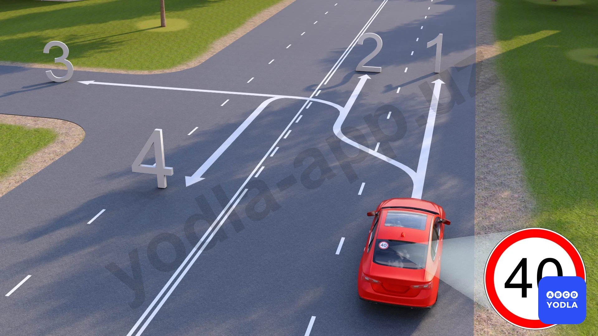

# 19. Скорость движения (боб 11)

Всего вопросов: 37

## Вопрос 1

**С какой максимальной скоростью разрешается движение легковых автомобилей на участках дорог вне населенных пунктов?**

⬜ A. 110 км/ч.
✅ B. 100 км/ч.
⬜ C. 90 км/ч
⬜ D. 80 км/ч.
⬜ E. 70 км/ч.

> 💡 Вне населённых пунктов максимально разрешённая скорость для легковых автомобилей составляет 100 км/ч. Поэтому правильный ответ — 100 км/ч.

---

## Вопрос 2

**С какой максимальной скоростью разрешается дви­жение легковых автомобилей с прицепом на участках дорог, обозначенных таким дорожным знаком?**

⬜ A. 60 км/ч
⬜ B. 70 км/ч
✅ C. 80 км/ч
⬜ D. 100 км/ч
⬜ E. 110 км/ч

> 💡 Если легковой автомобиль движется с прицепом, то вне населённых пунктов максимально разрешённая скорость для него составляет 80 км/ч. Для транспортных средств с прицепом установлен отдельный скоростной режим. Поэтому правильный ответ — 80 км/ч.

---

## Вопрос 3

**На участке дороги с данным знаком с какой максимальной скоростью должны двигаться грузовые автомобили, разрешенная максимальная масса которых не более 3,5т.?**

⬜ A. 110 км/ч
⬜ B. 70 км/ч
✅ C. 100 км/ч
⬜ D. 90 км/ч
⬜ E. 60 км/ч

> 💡 Для грузовых автомобилей с разрешённой максимальной массой не более 3,5 тонны вне населённых пунктов максимально разрешённая скорость составляет 100 км/ч. Такие автомобили по скоростному режиму приравниваются к легковым автомобилям. Поэтому правильный ответ — 100 км/ч.

---

## Вопрос 4

**Во сколько раз увеличивается длина тормозного пути, если скорость движения увеличивается в два раза?**

⬜ A. Длина тормозного пути не зависит от скорости движения
⬜ B. В три раза
✅ C. В четыре раза
⬜ D. В два раза

> 💡 Если скорость движения увеличивается в два раза, то тормозной путь увеличивается в четыре раза. Запомните простое правило: во сколько раз увеличивается скорость, во столько раз в квадрате увеличивается тормозной путь. Поэтому правильный ответ — в 4 раза.

---

## Вопрос 5

**Что называется остановочным путем?**

⬜ A. Дистанция; пройденная автомобилем за время; когда водителю стало известно об опасности до нача��а торможения
✅ B. Путь; пройденный автомобилем с момента обнаружения водителем опасности; до его полной остановки

> 💡 Остановочный путь — это общее расстояние, которое проходит автомобиль с момента, когда водитель заметил опасность, до полной остановки транспортного средства.

То есть водитель замечает опасность, в течение примерно 1 секунды оценивает ситуацию и нажимает на педаль тормоза. После этого автомобиль начинает тормозить и полностью останавливается. Расстояние, пройденное с момента обнаружения опасности до полной остановки автомобиля, называется остановочным путём.

Тормозной путь — это расстояние, которое автомобиль проходит с момента нажатия на педаль тормоза до полной остановки.

Время реакции — это время от момента обнаружения опасности до нажатия на педаль тормоза. В среднем оно принимается равным 1 секунде, хотя может изменяться в зависимости от состояния и опыта водителя.

---

## Вопрос 6

**Прежде чем начать обгон; водитель должен убедиться в том; что:**

⬜ A. Ни один из следующих за ним водителей, которому может быть создана помеха, не начал обгона
⬜ B. Водитель транспортного средства, движущегося впереди по той же полосе, не подал сигнал о повороте (перестроении) налево
⬜ C. При завершении обгона он сможет, не создавая помехи обгоняемому транспортному средству, вернуться на ранее занимаемую полосу
✅ D. Выполнить все перечисленные действия

> 💡 Перед началом обгона водитель обязан убедиться, что выполнение манёвра будет безопасным. Если все предложенные варианты соответствуют требованиям Правил дорожного движения, то правильный ответ — все перечисленные варианты.

---

## Вопрос 7

**С какой максимальной скоростью разрешено движение водителю легкового автомобиля; буксирующего прицеп вне населенного пункта?**

⬜ A. 50 км/ч
⬜ B. 70 км/ч
✅ C. 80 км/ч
⬜ D. 90 км/ч
⬜ E. 100 км/ч

> 💡 Вне населённых пунктов максимально разрешённая скорость для легкового автомобиля с прицепом составляет 80 км/ч. Поэтому правильный ответ — 80 км/ч.

---

## Вопрос 8

**В каких случаях водителю легкового автомобиля при езде вне населённых пунктов запрещается превышать установленную скорость?**

⬜ A. Только если на дороге установлены дорожные знаки; ограничивающие скорость движения
⬜ B. Только если он двигается с прицепом
⬜ C. Если он буксирует другие транспортные средства
✅ D. Во всех перечисленных случаях

> 💡 Вне населённых пунктов водителю легкового автомобиля в некоторых случаях запрещается двигаться со скоростью более 90 км/ч. Например, если установлены дорожные знаки ограничения скорости или автомобиль движется с прицепом, превышать установленную скорость запрещено.

Поэтому правильный ответ — во всех перечисленных случаях.

---

## Вопрос 9

**Что должен учитывать водитель при выборе скорости движения?**

⬜ A. Интенсивность движения, особенности и состояние транспортного средства и груза
⬜ B. Дорожные и метрологические условия
✅ C. Все перечисленные факторы

> 💡 При выборе скорости движения водитель обязан учитывать все факторы: интенсивность дорожного движения, особенности и состояние транспортного средства и груза, а также дорожные и погодные условия. Поэтому правильный ответ — все перечисленные факторы.

---

## Вопрос 10

**Водителю какого транспортного средства разрешено движение со скоростью; указанной на знаке?**

⬜ A. Обоим водителям
✅ B. Только водителю микроавтобуса
⬜ C. Обоим запрещено

> 💡 Как видно на изображении, здесь показаны микроавтобус и грузовой автомобиль. Поскольку грузовой автомобиль перевозит людей, его максимально разрешённая скорость на любых дорогах составляет 60 км/ч.

Для микроавтобуса вне населённых пунктов разрешена скорость до 90 км/ч. На данном участке дороги установлено ограничение 80 км/ч.

Следовательно, двигаться со скоростью 80 км/ч разрешается только водителю микроавтобуса. Водителю грузового автомобиля, перевозящего людей, это не разрешается, так как его скорость не должна превышать 60 км/ч независимо от типа дороги.

---

## Вопрос 11

**Кто из водителей нарушает требования Правил; если все транспортные средства движутся со скоростью 80 км/ч?**

⬜ A. Водители мотоцикла и грузового автомобиля
⬜ B. Водители мотоцикла и легкового автомобиля
⬜ C. Все водители
⬜ D. Водитель мотоцикла
✅ E. Никто не нарушает

> 💡 На данном участке дороги установлено ограничение скорости 80 км/ч. Поэтому все транспортные средства обязаны двигаться не быстрее 80 км/ч.

Хотя для легкового автомобиля вне населённых пунктов максимально разрешённая скорость составляет 100 км/ч, на этом участке он обязан соблюдать ограничение 80 км/ч.

Следовательно, если все транспортные средства движутся в пределах установленного ограничения, никто не нарушает Правила дорожного движения.

Правильный ответ — никто не нарушает.

---

## Вопрос 12

**Что называется тормозным путем?**

⬜ A. Расстояние; пройденное автомобилем с момента обнаружения водителем опасности до полной остановки
✅ B. Расстояние; пройденное автомобилем с момента нажатия на педаль тормоза до полной остановки

> 💡 Тормозной путь — это расстояние, которое автомобиль проходит с момента нажатия водителем на педаль тормоза до полной остановки автомобиля.

---

## Вопрос 13

**С какой максимальной скоростью разрешается движение на данном участке дороги при наличии на автомобиле опознавательного знака?**

✅ A. 70 км/ч
⬜ B. 90 км/ч
⬜ C. 100 км/ч

> 💡 Как видно, на дороге установлен знак ограничения скорости 90 км/ч. Однако на автомобиле установлен опознавательный знак «70».

В такой ситуации водитель не имеет права превышать скорость, указанную на опознавательном знаке автомобиля. Это требование действует на любых дорогах.

Следовательно, в данной ситуации максимально разрешённая скорость составляет 70 км/ч.

---

## Вопрос 14

**С какой максимальной скоростью разрешается движение мотоциклам на участках дорог обозначенных таким дорожным знаком?**

⬜ A. 60 км/ч
⬜ B. 70 км/ч
✅ C. 80 км/ч
⬜ D. 90 км/ч
⬜ E. 100 км/ч

> 💡 Этот дорожный знак обозначает дорогу вне населённого пункта. На таких дорогах максимально разрешённая скорость для мотоциклов составляет 80 км/ч.

Поэтому правильный ответ — 80 км/ч.

---

## Вопрос 15

**С какой максимальной скоростью разрешается движение не междугородним автобусам на участках дорог обозначенных таким дорожным знаком?**

⬜ A. 50 км/ч
⬜ B. 60 км/ч
⬜ C. 70 км/ч
✅ D. 80 км/ч
⬜ E. 90 км/ч

> 💡 Этот дорожный знак обозначает дорогу вне населённого пункта. На таких дорогах для негородских (не междугородних) автобусов максимально разрешённая скорость составляет 80 км/ч.

Если это междугородний автобус, то максимально разрешённая скорость составляет 90 км/ч.

Поэтому правильный ответ — 80 км/ч.

---

## Вопрос 16

**С какой максимальной скоростью разрешается движение в кузове грузового автомобиля при перевозке людей вне населённого пункта?**

⬜ A. 40 км/ч
⬜ B. 50 км/ч
✅ C. 60 км/ч
⬜ D. 70 км/ч
⬜ E. 80 км/ч

> 💡 Вне населённых пунктов, если грузовой автомобиль перевозит людей в кузове, максимально разрешённая скорость составляет 60 км/ч.

Это правило действует на любых дорогах. То есть грузовой автомобиль, перевозящий людей, не должен превышать скорость 60 км/ч.

Поэтому правильный ответ — 60 км/ч.

---

## Вопрос 17

**Вы приближаетесь к повороту дороги налево, он оказался более крутым, чем предполагалось. Вы должны:**

⬜ A. Продолжаете движение не изменяя скорости и придерживаясь левого края проезжей части дороги
✅ B. Снизите скорость движения
⬜ C. Увеличите скорость чтобы быстрее пройти поворот

> 💡 При приближении к повороту может оказаться, что он намного более крутой, чем вы предполагали. Это означает, что поворот более опасный и требует повышенного внимания.

В такой ситуации необходимо снизить скорость, чтобы избежать заноса или столкновения с препятствием.

Поэтому правильный ответ — уменьшить скорость.

---

## Вопрос 18

**С какой максимальной скоростью разрешается движение грузовых автомобилей с разрешенной максимальной массой более 3,5 т на участках дорог обозначенных таким дорожным знаком?**

⬜ A. 60 км/ч
⬜ B. 90 км/ч
✅ C. 80 км/ч
⬜ D. 70 км/ч
⬜ E. 100 км/ч

> 💡 Этот дорожный знак обозначает дорогу вне населённого пункта.

В вопросе речь идёт о грузовом автомобиле с разрешённой максимальной массой более 3,5 тонны. Для таких грузовых автомобилей вне населённых пунктов максимально разрешённая скорость составляет 80 км/ч.

Для грузовых автомобилей с разрешённой максимальной массой до 3,5 тонны максимально разрешённая скорость составляет 100 км/ч.

Поэтому правильный ответ — 80 км/ч.

---

## Вопрос 19

**Разрешается ли водителю междугородного автобуса вне населенных пунктов превышать скорость 80 км/ч?**

⬜ A. Разрешается только при движении по дороге имеющей две и более полосы для движения в данном направлении
✅ B. Разрешается
⬜ C. Запрещается

> 💡 Водителю маршрутного автобуса вне населённых пунктов разрешается двигаться со скоростью более 80 км/ч, поскольку для такого автобуса максимально разрешённая скорость составляет 90 км/ч.

Следовательно, превышать скорость 80 км/ч разрешается. Правильный ответ — Да, разрешается.

---

## Вопрос 20

**С какой максимальной скоростью разрешается движение междугородным автобусам на участках дорог обозначенных таким дорожным знаком?**

⬜ A. 50 км/ч
⬜ B. 60 км/ч
⬜ C. 70 км/ч
⬜ D. 80 км/ч
✅ E. 90 км/ч

> 💡 Этот дорожный знак обозначает дорогу вне населённого пункта. На таких дорогах для междугородних автобусов максимально разрешённая скорость составляет 90 км/ч.

Поэтому правильный ответ — 90 км/ч.

---

## Вопрос 21

**С какой скоростью вне населенных пунктов разрешается движение транспортных средств, осуществляющих перевозки тяжеловесных или габаритных грузов?**

⬜ A. Не более 40 км/час
⬜ B. Не более 60 км/час
✅ C. Не более предписанной ГСБДД при согласовании условий перевозки

> 💡 Транспортные средства, перевозящие крупногабаритные или тяжеловесные грузы, как вне населённых пунктов, так и в населённых пунктах, не должны превышать скорость, установленную условиями перевозки и согласованную с Государственной службой безопасности дорожного движения.

Следовательно, такие транспортные средства могут двигаться только со скоростью, указанной в разрешении или условиях перевозки.

---

## Вопрос 22

**Если на транспортном средстве установлен опознавательный знак «ограничения скорости», водитель транспортного средства обязан:**

⬜ A. Разрешается превышать указанную на знаке скорость только на участках дорог где скорость движения повышена установкой соответствующего дорожного знака
✅ B. Запрещается превышать указанную на знаке скорость

> 💡 Если на транспортном средстве установлен опознавательный знак, ограничивающий максимальную скорость, водителю запрещается превышать скорость, указанную на этом знаке.

В данном случае под знаком подразумевается именно опознавательный знак ограничения максимальной скорости, установленный на транспортном средстве.

---

## Вопрос 23

**Может ли быть повышена максимальная скорость движения; определенная технической характеристикой транспортного средства?**

⬜ A. Может быть повышена органами; ответственными за эксплуатацию дорог
⬜ B. Может быть повышена на дорогах вне населенных пунктов. На таких участках устанавливаются знаки "Ограничение максимальной скорости"
✅ C. Не может быть превышена

> 💡 Превышать максимальную скорость, указанную в технической характеристике транспортного средства, запрещено. Водитель обязан соблюдать максимальную скорость, установленную производителем транспортного средства.

Поэтому правильный ответ — нет, превышать нельзя.

---

## Вопрос 24

**Что понимается под временем реакции?**

✅ A. Время с момента обнаружения водителем опасности, до начала ответных действий
⬜ B. Время с момента; когда водитель начал тормозить; до полной остановки транспортного средства

> 💡 Время реакции — это время, которое проходит с момента обнаружения водителем опасности до начала выполнения конкретного действия.

После того как водитель замечает опасность, он оценивает ситуацию и принимает решение. Затем он либо нажимает на педаль тормоза, либо поворачивает рулевое колесо, чтобы объехать препятствие, если это безопаснее. Время, затраченное на принятие этого решения, называется временем реакции.

Среднее время реакции принимается равным 1 секунде. За это время во��итель оценивает дорожную ситуацию и принимает решение о необходимых действиях.

---

## Вопрос 25

**При выборе скорости движения водителю запрещается:**

⬜ A. Превышать скорость, указанную на опознавательном знаке, установленном на транспортном средстве в соответствии с настоящими Правилами
⬜ B. Резко тормозить, если это не требуется для обеспечения безопасности движения
✅ C. Запрещаются оба перечисленных действия

> 💡 Следовательно, оба действия запрещены. Водитель не должен превышать скорость, указанную на опознавательном знаке ограничения скорости, установленном на транспортном средстве. Кроме того, запрещается резко тормозить, если это не связано с предотвращением дорожно-транспортного происшествия и может создать помеху или опасность для других участников движения.

Поэтому правильный ответ — оба действия запрещены.

---

## Вопрос 26

**С какой максимальной скоростью разрешено движение при буксировке на гибкой сцепке?**

⬜ A. 70 км/ч
⬜ B. 60 км/ч
✅ C. 50 км/ч
⬜ D. 40 км/ч
⬜ E. 30 км/ч

> 💡 При буксировке транспортного средства максимально разрешённая скорость составляет 50 км/ч. Это правило распространяется как на буксирующее, так и на буксируемое транспортное средство.

Поэтому правильный ответ — 50 км/ч.

---

## Вопрос 27

**Какое расстояние проедет транспортное средство за одну секунду при скорости движения 108 км/ч?**

⬜ A. 15 м
⬜ B. 25 м
✅ C. 30 м

> 💡 Транспортное средство, движущееся со скоростью 108 км/ч, проходит 30 метров за 1 секунду.

Чтобы быстро определить расстояние, пройденное за одну секунду, скорость в км/ч нужно разделить на 3,6.

Например: 108 ÷ 3,6 = 30 метров.

Следовательно, правильный ответ — 30 метров.

---

## Вопрос 28

**Какое расстояние проедет транспортное средство за одну секунду при скорости движения 72 км/ч?**

⬜ A. 15 м
✅ B. 20 м
⬜ C. 25 м

> 💡 Транспортное средство, движущееся со скоростью 72 км/ч, проходит 20 метров за 1 секунду.

Для расчёта необходимо разделить скорость на 3,6:

72 ÷ 3,6 = 20 метров.

Поэтому правильный ответ — 20 метров.

---

## Вопрос 29

**С какой скоростью могут двигаться грузовые автомобили с прицепом вне населённых пунктов?**

⬜ A. 80 км/ч
✅ B. 70 км/ч
⬜ C. 90 км/ч
⬜ D. 60 км/ч

> 💡 Для грузовых автомобилей с прицепом максимально разрешённая скорость составляет 70 км/ч.

Поэтому правильный ответ — 70 км/ч.

---

## Вопрос 30

**Что наиболее важно учитывать водителю транспортных средств при выборе скорости, движущихся в темное время суток?**

⬜ A. Ограничения скорости, установленные ПДД
⬜ B. Ограничение скорости, указанное в техническом описании транспортных средств
✅ C. Условия видимости

> 💡 В тёмное время суток водитель должен выбирать скорость движения с учётом условий видимости. Чем дальше водитель может видеть дорогу, тем безопаснее он может управлять транспортным средством на соответствующей скорости.

Поэтому правильный ответ — необходимо учитывать условия видимости.

---

## Вопрос 31

**Какая максимальная скорость разрешена в жилых зонах:**

⬜ A. 5км/ч
✅ B. 20 км/ч
⬜ C. 30 км/ч
⬜ D. 40 км/ч

> 💡 В жилых зонах максимально разрешённая скорость составляет 20 км/ч.

Поэтому правильный ответ — 20 км/ч.

---

## Вопрос 32

**С какой максимальной скоростью разрешается движение в жилых зонах:**

⬜ A. 5 км/ч
⬜ B. 40 км/ч
⬜ C. 30 км/ч
✅ D. 20 км/ч

> 💡 В жилых зонах максимально разрешённая скорость составляет 20 км/ч.

Поэтому правильный ответ — 20 км/ч.

---

## Вопрос 33

**Какая максимальная скорость разрешена на расстоянии до 300 метров на дорогах вокругшкол и дошкольных учреждений?**

⬜ A. 20 км/ч
✅ B. 30 км/ч
⬜ C. 50 км/ч
⬜ D. 60 км/ч

> 💡 В ночное время вблизи образовательных учреждений, на дорогах, расположенных в радиусе до 300 метров, максимально разрешённая скорость составляет 30 км/ч.

Поэтому правильный ответ — 30 км/ч.

---

## Вопрос 34

**В каких направлениях разрешено движение данному автомобилю?**

⬜ A. По всем направлениям
⬜ B. По первому, второму и третьему направлениям
✅ C. По первому, третьему и четвёртому направлениям
⬜ D. Только по первому

> 💡 Как видно на изображении, транспортные средства, конструктивная скорость которых не превышает 40 км/ч, должны двигаться только по крайней правой полосе.

Перестраиваться на другие полосы им запрещено. Исключение составляют случаи, когда необходимо повернуть налево или выполнить разворот.

Следовательно, в данной ситуации разрешено движение по направлениям 1, 3 и 4.

---

## Вопрос 35

**Когда разрешается выезд транспортному средству, скорость которого не превышает 40 км/ч, с правой полосы проезжей части?**

⬜ A. При объезде
⬜ B. При перестроении для поворота налево или разворота
✅ C. Во всех перечисленных случаях

> 💡 Транспортные средства, скорость которых не превышает 40 км/ч, должны двигаться только по крайней правой полосе.

Покидать крайнюю правую полосу им разрешается только в исключительных случаях: для объезда препятствия, поворота налево, разворота или опережения, если это допускается Правилами дорожного движения.

Поэтому правильный ответ — во всех перечисленных случаях.

---

## Вопрос 36

**На двухполосных дорогах с двусторонним движением, расположенных вне населённых пунктов, водители транспортных средств (или составов транспортных средств), скорость которых не может превышать 50 километров в час, а также длина которых превышает 7 метров, должны соблюдать какое расстояние между собой и движущимся впереди транспортным средством?**

⬜ A. 3 метра
⬜ B. 5 метров
⬜ C. Такое расстояние, которое обеспечивает гарантию предотвращения столкновения в случае резкого торможения движущегося впереди транспортного средства
✅ D. Такое расстояние, которое позволяет обгоняющему транспортному средству без затруднений вернуться в занимаемую ранее полосу

> 💡 Здесь важно обратить внимание на то, что вне населённых пунктов транспортные средства, движущиеся со скоростью не более 50 км/ч, а также транспортные средства длиной более 7 метров, не должны создавать помех другим участникам движения.

Если за ними образовалась очередь из автомобилей и дорожная разметка разрешает обгон, водитель обязан соблюдать такую дистанцию до впереди идущего транспортного средства, чтобы обгоняющий автомобиль мог безопасно вернуться в ранее занимаемую полосу.

Поэтому правильный ответ — соблюдать дистанцию, достаточную для безопасного возвращения обгоняющего транспортного средства в свою полосу.

---

## Вопрос 37

**Какое расстояние проедет транспортное средство за одну секунду при скорости движения 90 км/ч?**

⬜ A. 15 м
✅ B. 25 м
⬜ C. 35 м

> 💡 При прохождении поворота на транспортное средство действует центробежная сила, которая возрастает с увеличением скорости и стремится сместить транспортное средство к внешней стороне закругления дороги. Занос или снос транспортного средства может возникнуть при проезде поворота из-за большой скорости движения, торможения или низкого коэффициента сцепления. Антиблокировочная тормозная система, предназначенная для предотвращения блокировки колес транспортного средства, может снизить вероятность возникновения заноса или сноса при торможении, но не может исключить возможность их возникновения.

---

