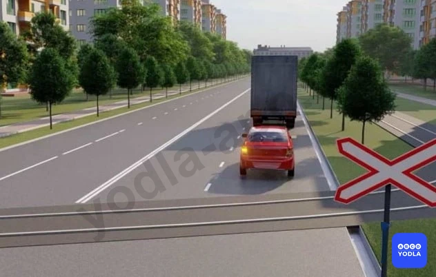
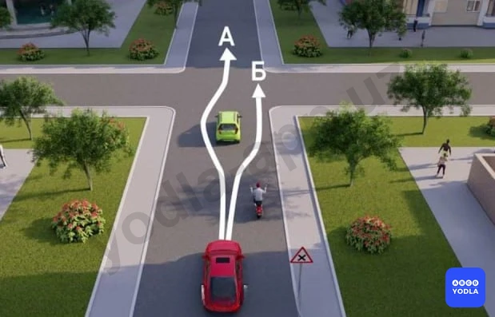
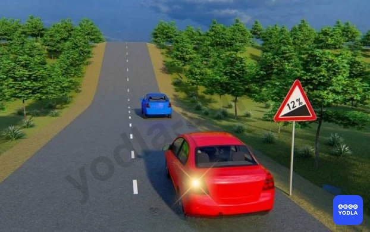
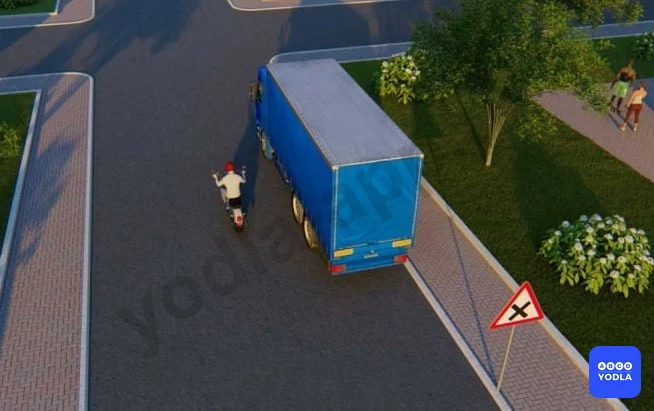
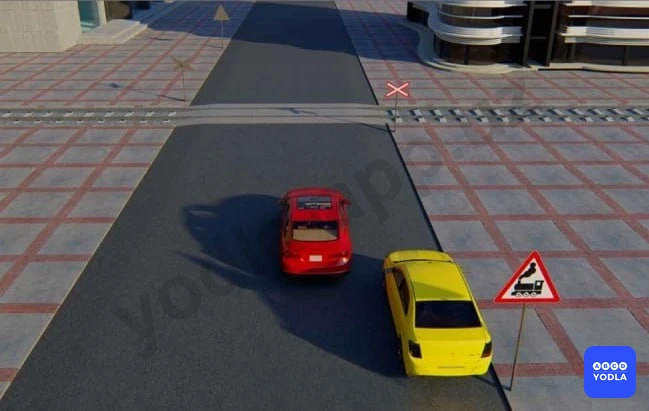
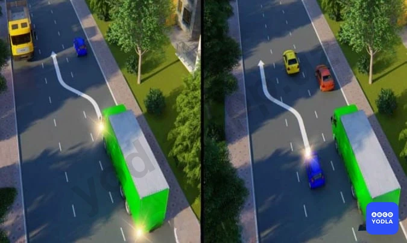

# 20. Обгон (боб 12)

Всего вопросов: 35

## Вопрос 1

**Обгон запрещается:**

⬜ A. На нерегулируемых перекрестках
⬜ B. На второстепенных дорогах на нерегулируемых перекрестках
⬜ C. На перекрестках равной важности
✅ D. Во всех перечисленных случаях

> 💡 В данной ситуации обгон запрещён во всех перечисленных случаях.

В частности:

на нерегулируемых перекрёстках;
на нерегулируемых перекрёстках неравнозначных дорог, если водитель движется не по главной дороге;
на нерегулируемых перекрёстках равнозначных дорог обгон запрещён.

Поэтому правильный ответ — во всех перечисленных случаях.

---

## Вопрос 2

**Разрешается ли обгон в данной ситуации?**

⬜ A. Разрешается
✅ B. Запрещается

> 💡 Согласно пункту 86, подпункту 6 главы 12 ПДД, обгон запрещается в конце подъёма и на участках дороги с ограниченной видимостью.

Поэтому красному автомобилю запрещено обгонять синий автомобиль, так как данная ситуация относится к условиям ограниченной видимости. На опасном повороте водитель красного автомобиля не может чётко и ясно видеть встречную полосу движения, а также не способен правильно оценить дорожную обстановку.

---

## Вопрос 3

**Разрешается ли обгон в показанной ситуации?**

✅ A. Разрешается
⬜ B. Запрещается
⬜ C. Разрешается, если скорость обгоняемого транспортного средства менее 40 км/ч

> 💡 Согласно пункту 86, подпункту 5 главы 12 ПДД, обгон запрещается на железнодорожных переездах и менее чем за 100 метров до них.

Поэтому красному автомобилю разрешается обгонять грузовой автомобиль, так как обгон выполняется непосредственно после железнодорожного переезда, то есть после полного его проезда.

---

## Вопрос 4

**На каком из рисунков показан обгон?**

✅ A. «А»
⬜ B. «Б»
⬜ C. «А» и «Б»

> 💡 Согласно пункту 6, подпункту 24 главы 1 ПДД, обгон — это опережение одного или нескольких транспортных средств, связанное с выездом на полосу, предназначенную для встречного движения, и последующим возвращением на ранее занимаемую полосу.

Поэтому обгон правильно показан на рисунке А, так как жёлтый автомобиль выезжает на полосу встречного движения для обгона синего автомобиля. На рисунке Б изображено опережение, поскольку жёлтый автомобиль планирует опередить синий автомобиль, не выезжая на полосу встречного движения.

---

## Вопрос 5

**Разрешается ли обгон транспортных средств в зоне перекрестка на дороге; являющейся главной по отношению к пересекаемой?**

✅ A. Разрешается
⬜ B. Запрещается

> 💡 Обратим внимание на вопрос. В вопросе говорится, что пересекаемый путь находится на главной дороге. Значит, если была основная дорога, то здесь разрешается обгон. Если обгон не является основным или считается основным, то обгон запрещается.

---

## Вопрос 6

**Имеет ли право водитель совершить обгон с правой стороны в данной ситуации?**

✅ A. Да
⬜ B. Нет

> 💡 Преодоление разрешено, так как водитель впереди идущего транспортного средства собирается перестроиться налево.

---

## Вопрос 7

**Разрешен ли водителю легкового автомобиля обгон в показанной ситуации?**

⬜ A. Разрешен
⬜ B. Разрешен, если скорость мотоциклиста менее 40 км/ч
✅ C. Запрещен

> 💡 Это двусторонняя дорога. Официальные лица, которые видят. Здесь переход на крайнюю левую полосу запрещен. Значит, водитель красного автомобиля движется здесь на встречную полосу и нарушает это правило. Значит, правильный ответ здесь запрещен.

---

## Вопрос 8

**Нарушает ли Правила водитель мотоцикла?**

⬜ A. Да
✅ B. Нет

> 💡 Здесь мотоциклист никак не знает правила, потому что он стучит в конце съезда, мотоцикл ещё не добрался до конца съезда, поэтому правильного ответа нет.

---

## Вопрос 9

**Если Вы выехали для обгона движущегося впереди идущего автомобиля, то в какой из перечисленных ситуаций наиболее целесообразно подать звуковой сигнал?**

⬜ A. Обгон совершается в ночное время
⬜ B. Водитель обгоняемого автомобиля начал притормаживать
✅ C. Водитель обгоняемого автомобиля включил указатель левого поворота
⬜ D. Водитель обгоняемого автомобиля включил указатель правого поворота

> 💡 Говорят, что если вы выезжаете на обгон впереди идущего автомобиля, то в каком из указанных случаев целесообразно дать звуковой ход? Конечно, если впереди идущий транспорт внезапно включит указатель поворота налево, нам придется его обгонять. А он, не глядя на нас, включил кнопку поворота налево. Так что он может подать нам сигнал.

---

## Вопрос 10

**По какому направлению водитель автомобиля правильно выполняет обгон?**

⬜ A. По направлению «А»
✅ B. По направлению «Б»
⬜ C. По направлению «А» и «Б»

> 💡 Значит, водитель красного автомобиля выехал на обгон мотоцикла, но, не доезжая до перекрестка, уже успел его обогнать. Если бы вы дали направление А, он бы оказался на перекрестке, равнозначном перекрестку. Поэтому, следовательно, ему запрещено в направлении А, правильный ответ будет правильным в направлении Б.

---

## Вопрос 11

**Разрешен ли обгон водителю красного автомобиля в такой ситуации?**

⬜ A. Разрешен
✅ B. Запрещена
⬜ C. Разрешен только при отсутствии встречных транспортных средств

> 💡 Водителю красного автомобиля запрещается выезжать на обгон, так как на трехполосной дороге с двусторонним движением не остается времени для переключения на левую полосу движения. Это правильный ответ. Запрещено.

---

## Вопрос 12

**Разрешается ли обгон в этом месте?**

⬜ A. Разрешается
✅ B. Запрещается
⬜ C. Разрешается на дорогах вне населенных пунктов
⬜ D. Запрещается только на дорогах вне населенных пунктов

> 💡 Согласно абзацу 6 пункта 86 главы 12 ПДД, обгон запрещен - в конце подъема и на других участках дорог с ограниченной видимостью.

---

## Вопрос 13

**Разрешается ли обгонять автопоезд в данной ситуации, если он движется со скоростью менее 40 км/час?**

✅ A. Запрещается
⬜ B. Разрешается

> 💡 ПДД Общие положения: Опасность - это любой фактор, который ставит под угрозу безопасность дорожного движения.

---

## Вопрос 14

**Как должен действовать водитель автомобиля при обгоне его другим транспортным средством?**

⬜ A. Не изменяя полосы движения, подать сигнал указателем правого поворота
✅ B. Не препятствовать обгону повышением скорости движения или иными действиями
⬜ C. Снизить скорость движения, подать звуковой сигнал

> 💡 Согласно пункту 84 главы 12 ПДД, водителю обгоняемого транспортного средства запрещается препятствовать обгону повышением скорости движения или иными действиями.

---

## Вопрос 15

**Разрешается ли обгон на этом участке дороги?**

⬜ A. Разрешается если обгоняемый автомобиль движется со скоростью меньше чем 40 км/ч
✅ B. Запрещается
⬜ C. Разрешается, если обгон завершается до железнодорожного переезда

---

## Вопрос 16

**Вы выехали для обгона и неожиданно увидели встречный автомобиль. Если Вы не уверены в том что сумеете завершить обгон. Вы должны:**

⬜ A. Продолжить обгон до его завершения подавая звуковой сигнал и включив фары
⬜ B. Слегка увеличить скорость и быстрее завершить обгон
✅ C. Снизить скорость и вернуться на ранее занимаемую полосу

> 💡 Согласно пункту 82 главы 12 ПДД, прежде чем начать обгон водитель обязан убедиться в том, что полоса движения, на которую он намерен выехать, свободна на достаточном для обгона расстоянии и в процессе обгона он не создаст опасности для движения и помех другим участникам движения, по завершении обгона он сможет, не создавая помех обгоняемому транспортному средству, вернуться на ранее занимаемую полосу.

---

## Вопрос 17

**Что должен делать водитель тягача?**

✅ A. Через 100 метров от опасного поворота остановиться и пропустить автомобили скопившиеся сзади
⬜ B. Продолжать движение не изменяя скорость
⬜ C. Указать рукой на обгон по параллельной полосе

---

## Вопрос 18

**Разрешается ли водителю красного автомобиля выполнить обгон в данной ситуации?**

✅ A. Разрешается
⬜ B. Запрещается
⬜ C. Разрешается при условии; что скорость обгоняемого менее 40 км/ч

> 💡 Согласно абзацу 2 пункта 86 главы 12 ПДД, обгон запрещен - на нерегулируемых перекрестках при движении по дороге, не являющейся главной.

---

## Вопрос 19

**Как должен поступить водитель крупногабаритного транспортного средства, соблюдающего определенную скорость движения в населенном пункте?**

⬜ A. Остановиться и пропустить скопившиеся за ним транспортные средства
✅ B. Продолжить движение

> 💡 Согласно пункту 87 главы 12 ПДД, водитель тихоходного или крупногабаритного транспортного средства вне населённых пунктов в случаях, когда обгон этого транспортного средства затруднён, должен принять как можно правее, а при необходимости – остановиться, чтобы пропустить скопившиеся за ним транспортные средства. Однако, в населенных пунктах нет вышеупомянутых требований,  он может продолжить движение.

---

## Вопрос 20

**Разрешен ли обгон в данной ситуации?**

⬜ A. Разрешен, только одиночных транспортных средств, движущихся со скоростью менее 40 км/час
✅ B. Запрещена
⬜ C. Разрешен во всех случаях

> 💡 Согласно абзацу 4 пункта 86 главы 12 ПДД, обгон запрещён на железнодорожных переездах и ближе чем за 100 метр перед ними. Вне населенных пунктов знак 1.2. повторяются. Второй знак устанавливается на расстоянии не менее 50 метр (не более 100 метр) до начала опасного участка.

---

## Вопрос 21

**Что такое обгон?**

⬜ A. Опережение одного или нескольких транспортных средств другим связанное с выездом из занимаемой полосы
✅ B. Опережение одного или нескольких транспортных средств, связанное с выездом на полосу встречного движения и последующим возвращением на ранее занимаемую полосу
⬜ C. Опережение одного или нескольких транспортных средств движущихся в соседнем ряду с меньшей скоростью

> 💡 Согласно определению 24 пункт 6 главы 1 ПДД, обгон – опережение одного или нескольких транспортных средств, связанное с выездом на полосу, предназначенную для встречного движения, и последующим возвращением на ранее занимаемую полосу.

---

## Вопрос 22

**В чем должен убедиться водитель прежде чем начать обгон?**

⬜ A. В том что он движется гораздо быстрее водителя обгоняемого транспортного средства
✅ B. В том что водитель транспортного средства движущегося впереди по той же полосе не подал сигнал о повороте (перестроении) налево
⬜ C. В том что участок дороги на который он намерен выехать свободен на расстоянии 1000 м

---

## Вопрос 23

**Водитель какого транспортного средства правильно выполняет обгон?**

✅ A. Водитель грузового автомобиля
⬜ B. Водитель легкового автомобиля
⬜ C. Оба правильно
⬜ D. Оба неправильно

> 💡 Согласно пункту 66 главы 10 ПДД, на дорогах с двусторонним движением, имеющих три полосы, обозначенные разметкой (за исключением дорожной разметки 1.9), из которых средняя используется для движения в обоих направлениях, разрешается выезжать на эту полосу только для обгона, объезда, поворота налево или разворота. Выезжать на крайнюю левую полосу, предназначенную для встречного движения, запрещается.

---

## Вопрос 24

**Что запрещается водителю обгоняемого транспортного средства?**

⬜ A. Двигаться со скоростью более 40 км/час
⬜ B. Препятствовать обгону снижением скорости движения своего транспортного средства
✅ C. Препятствовать обгону путем повышения скорости движения или иными действиями

---

## Вопрос 25

**Обгон запрещается?**

✅ A. На железнодорожных переездах и ближе; чем за 100 м перед ними
⬜ B. На железнодорожных переездах и более чем 100 м от них
⬜ C. На железнодорожных переездах и более чем 100 м от них вне населенных пунктов

> 💡 Согласно абзацу 4 пункта 86 главы 12 ПДД, обгон запрещён на железнодорожных переездах и ближе чем за 100 метр перед ними.

---

## Вопрос 26

**Разрешается ли обгонять автобус в этом месте?**

✅ A. Разрешается
⬜ B. Запрещается

> 💡 Согласно абзацу 4 пункта 86 главы 12 ПДД, обгон запрещён на железнодорожных переездах и ближе чем за 100 метр перед ними. Вне населенных пунктов знак 1.1. повторяются. Первый знак устанавливается на расстоянии 150 — 300 м до начала опасного участка..

---

## Вопрос 27

**Водитель какого транспортного средства выполняет обгон правильно?**

✅ A. Водитель зеленого автомобиля
⬜ B. Водитель синего автомобиля
⬜ C. Оба водителя правильно обгоняют
⬜ D. Обоим водителям обгон запрещен

> 💡 Согласно пункту 66 главы 10 ПДД, на дорогах с двусторонним движением, имеющих три полосы, обозначенные разметкой (за исключением дорожной разметки 1.9), из которых средняя используется для движения в обоих направлениях, разрешается выезжать на эту полосу только для обгона, объезда, поворота налево или разворота. Выезжать на крайнюю левую полосу, предназначенную для встречного движения, запрещается.

---

## Вопрос 28

**Какие ограничения, относящиеся к обгону, действуют на железнодорожных переездах и вблизи них?**

✅ A. Обгон запрещен на переезде и ближе чем за 100 м перед ним
⬜ B. Обгон запрещен только на после переезда
⬜ C. Обгон запрещен на переезде и на расстоянии 100 м до и после него

> 💡 Дорожная разметка 1.20 раздела 1 приложения № 2 к ПДД, предупреждает о приближении к разметке 1.13.
Дорожная разметка 1.13 раздела 1 приложения № 2 к ПДД, указывает место, где водитель должен при необходимости остановиться, уступая дорогу транспортным средствам, движущимся по пересекаемой дороге.

---

## Вопрос 29

**В каких случаях обгон запрещен?**

⬜ A. На регулируемых перекрёстках
⬜ B. В конце подъёма и на других участках дорог с ограничения видимостю
⬜ C. На нерегулируемых перекрёстках при движении по дороге не являешься главной
✅ D. Во всех причисленных случаях

> 💡 Пункта 9 главы 2 ПДД, гласит: — детям до 12 лет, находящимся на заднем сиденье автомобиля (в соответствии с пунктом 159 Правил);
— беременным женщинам, больным (при наличии справки согласно министерству Здравоохранения перечня болезней и при наличии заболеваний согласно этого перечня), состояние которых не позволяет им пристегнуться ремнем безопасности;

---

## Вопрос 30

**Какой из этих знаков установлен перед школами и дошкольными образовательными организациями?**

⬜ A. «А»

✅ B. «Б» 
⬜ C. «В»

> 💡 Согласно пункта 31 главы 7 ПДД, круглый зеленый сигнал светофора разрешает движение. Согласно пункта 36 главы 7 ПДД, для регулирования движения трамваев, могут применяться светофоры с четырьмя круглыми сигналами бело-лунного цвета, расположенными в виде буквы «Т». Движение разрешается при включении одновременно нижнего сигнала и одного или нескольких верхних. Из них левый разрешает движение налево, средний — прямо, правый — направо. Если включены только три верхних сигнала, то движение запрещено.

---

## Вопрос 31

**На каких изображениях показан обгон?**

✅ A. Только на первом и втором изображениях
⬜ B. Только на первом и третьем изображениях
⬜ C. Только на первом, втором и четвёртом изображениях
⬜ D. Только на первом изображении
⬜ E. На всех изображениях

> 💡 Пункта 88 главы 13 ПДД, гласит: На левой стороне дороги остановка и стоянка разрешаются в населенных пунктах на дорогах с односторонним движением, имеющим две полосы движения, при отсутствии трамвайных путей посередине. Пункта 115.1 главы 17.1 ПДД, гласит: По дороге с выделенной полосой для маршрутного общественного транспорта могут двигаться только маршрутные транспортные средства. Движение других транспортных средств по этой полосе запрещается, за исключением транспортных средств оперативных и специальных служб.

---

## Вопрос 32

**Разрешен ли здесь обгон?**

⬜ A. Разрешается
⬜ B. Если скорость обгоняемого транспортного средства менее 40 км/ч
✅ C. Запрещается

> 💡 "На основании абзацев 2 и 4 пункта 159 главы 26 ПДД: 159. Запрещается перевозить людей в следующих случаях:
детей в кузове грузового автомобиля;
на тракторах и других самоходных устройства, в грузовом прицепе, в прицепе-даче, в кузове грузовых мотоциклов, электромотоциклов, мопедов и скутеров."

---

## Вопрос 33

**Какие предупредительные сигналы можно использовать при обгоне в населённых пунктах?**

✅ A. Фары дальнего света
⬜ B. Звуковые сигналы
⬜ C. 1 и 2

> 💡 На основании абзацев 2 и 3 пункта 48 и пункта 49 главы 8 ПДД: 48. Звуковые сигналы могут при��еняться только в следующих случаях:
вне населенных пунктов при обгоне, для предупреждения других водителей; Запрещается применение звуковых сигналов кроме случаев, указанных выше. 
49. Вместо звукового сигнала об обгоне или же вместе с ним может подаваться предупредительный сигнал переключением фар.

---

## Вопрос 34

**Какие предупредительные сигналы можно использовать при обгоне вне населённых пунктов?**

⬜ A. Фары дальнего света
⬜ B. Звуковые сигналы
✅ C. 1 и 2

> 💡 На основании пункта 4.1.1 Приложения 1 к ПДД и абзаца 10 раздела 4 «Предписывающие знаки»: 4.1.1. «Движение прямо». Действие знаков 4.1.1 — 4.1.6 распространяется на пересечение проезжих частей, перед которым установлен знак.

---

## Вопрос 35

**На каком рисунке показан правильный вариант обгона?**

⬜ A. 1
⬜ B. 3
✅ C. 2 и 3
⬜ D. 3 и 4

> 💡 На основании Приложения 2 к ПДД, пункта 1.1 и абзаца 44, пункта 1.11 и абзаца 49, а также главы 12 ПДД, пункта 86, абзаца 2: 1.1 — разделяет транспортные потоки противоположных направлений. Линии 1.1 и 1.3 пересекать запрещается, кроме случая, когда линия 1.1 применена для обозначения края проезжей части. 
1.11 — разделяет транспортные потоки противоположных или попутных направлений на участках дорог, где перестроение разрешено только из одной полосы; обозначает места, предназначенные для разворота, въезда и выезда со стояночных площадок и т. п., где движение разрешено только в одну сторону. Линию 1.11 разрешается пересекать со стороны прерывистой, а также и со стороны сплошной, но только при завершении обгона или объезда.
86. Обгон запрещен: на регулируемых перекрестках.

---

