# 21. Остановка и стоянка (боб 13)

Всего вопросов: 72

## Вопрос 1

**Разрешается ли стоянка в этом месте?**

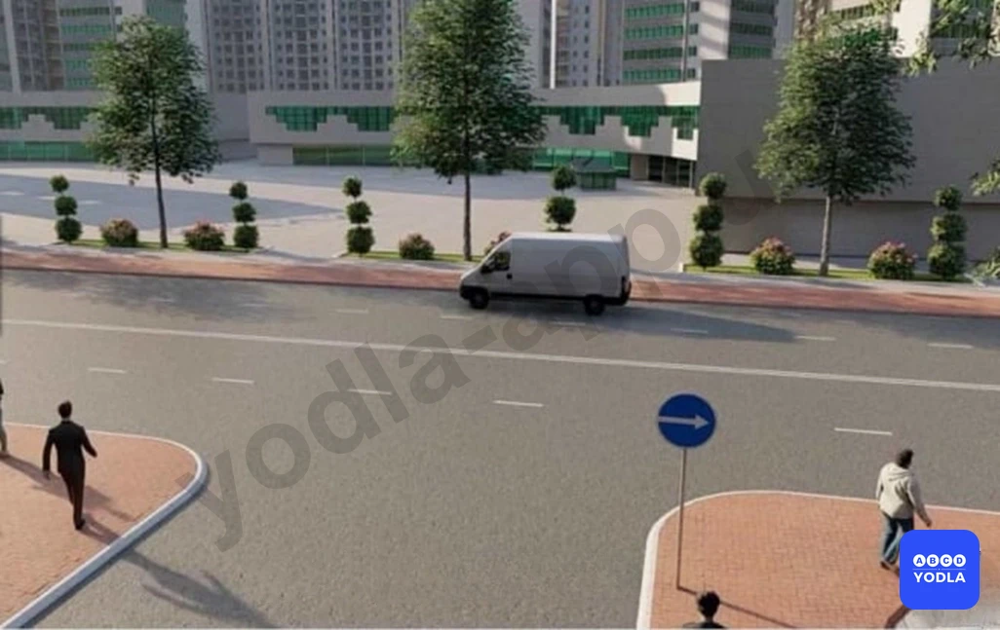

✅ A. Разрешается
⬜ B. Запрещается

> 💡 Согласно пункту 91 главы 13 ПДД, остановка и стоянка запрещается в следующих местах: на пересечении проезжих частей и ближе 30 м от края пересекаемой проезжей части, за исключением стороны напротив бокового проезда трехсторонних пересечений (перекрестков), имеющих сплошную линию дорожной разметки или разделительную полосу.

---

## Вопрос 2

**Какие транспортные средства допускается ставить в два ряда на проезжей части?**

✅ A. Мотоциклы без бокового прицепа, мопеды и велосипеды
⬜ B. Мотоциклы с боковым прицепом
⬜ C. Автомобили обозначенные знаком «Инвалид»
⬜ D. Грузовые автомобили, обслуживающие торговые и другие предприятия, которые непосредственно расположены вдоль тротуаров, разрешенная максимальная масса которых не превышает 3,5 т.

> 💡 Согласно пункту 89 главы 8 ПДД, ставить транспортные средства на проезжей части разрешается в один ряд параллельно к краю проезжей части, при условии, что они не мешают другим участникам дорожного движения, а двухколесные транспортные средства без бокового прицепа — в два ряда.

---

## Вопрос 3

**Каким транспортным средствам разрешена стоянка?**

⬜ A. Только мотоциклу
⬜ B. Только грузовому автомобилю
⬜ C. Только легковому автомобилю
✅ D. Легковому автомобилю и мотоциклу
⬜ E. Всем транспортным средствам

> 💡 Дополнительный знак 7.4.1 «Вид транспортного средства» приложения № 1 к ПДД, означает, что действие знака 3.28. «Стоянка запрещена» распространяет на грузовые автомобили, в том числе и с прицепом, с разрешенной максимальной массой более 3.5 тонн.

---

## Вопрос 4

**В каких местах разрешается стоянка транспортных средств под углом к краю проезжей части?**

⬜ A. На дорогах с двумя полосами движения в каждом направлении
⬜ B. На дорогах с тремя и более полосами движения в каждом направлении
⬜ C. Только на дорогах с односторонним движением
✅ D. На расширенных участках проезжей части; с условием; что не будет создана помеха другим участникам движения

> 💡 Согласно пункту 89 главы 13 ПДД, на отдельных участках дорог, имеющих местное уширение проезжей части, разрешается иное расположение транспортных средств, при условии, что это не будет создавать помех другим участникам движения.

---

## Вопрос 5

**При каком расстоянии между остановившемся автомобилем и сплошной линией разметки запрещается остановка?**

⬜ A. 6 м
⬜ B. 5,5 м
⬜ C. 4 м
⬜ D. 3,5 м
✅ E. 2,5 м

> 💡 Согласно абзацу 7 пункта 91 главы 13 ПДД, остановка запрещается в следующих местах: где расстояние между сплошной линией дорожной разметки (кроме обозначающей край проезжей части), разделительной полосой или противоположным краем проезжей части и остановившимся транспортным средством менее 3 м.

---

## Вопрос 6

**При остановке или стоянке на неосвещенных участках дорог в условиях недостаточной видимости водитель механического транспортного средства должен:**

⬜ A. Включить противотуманные фары или ближний свет фар
⬜ B. Включить дальний свет фар
✅ C. Включить габаритные огни

> 💡 Пункта 136 главы 23 ПДД, гласит: При остановке и стоянке в темное время суток на неосвещенных участках дорог, а также в условиях недостаточной видимости на транспортном средстве должны быть включены габаритные огни. 
В условиях недостаточной видимости дополнительно к габаритним огням могут быть включены фары ближнего света, противотуманные фары и задние противотуманные фонари.

---

## Вопрос 7

**В каких случаях запрещена стоянка на дорогах; имеющих менее трех полос движения в одну сторону?**

⬜ A. На мостах, эстакадах и на путепроводах
⬜ B. Под мостами, эстакадами и подвесными дорогами
✅ C. Во всех перечисленных случаях

> 💡 Согласно пункту 91 главы 13 ПДД, запрещается остановка и стоянка на мостах, эстакадах, путепроводах, если для движения в одном направлении имеется менее трёх полос, под мостами, эстакадами и путепроводами (кроме участков дорог, на которых разрешена стоянка с соответствующими дорожными знаками).

---

## Вопрос 8

**Разрешается ли стоянка легковому автомобилю в показанной ситуации?**

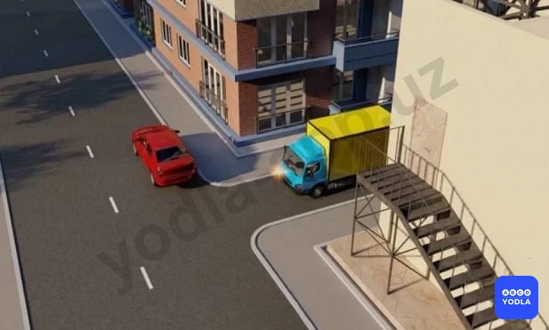

⬜ A. Разрешается
✅ B. Запрещается

> 💡 Согласно абзацу 14 пункта 91 главы 13 ПДД, остановка запрещается: в местах, где транспортное средство закроет от других водителей сигналы светофора, дорожные знаки или сделает невозможным движение (въезд или выезд) других транспортных средств, или создаст помехи для движения пешеходов.

---

## Вопрос 9

**Водители каких транспортных средств нарушили правила остановки?**

⬜ A. Только «А»
⬜ B. Только «Б»
⬜ C. Только «В»
⬜ D. «Б» и «В»
✅ E. «А» и «Б»

> 💡 Пункта 88 главы 13 ПДД, гласит: Остановка и стоянка транспортных средств разрешается как можно правее на обочине, а при ее отсутствии — у края проезжей части, и в случаях, указанных в пункте 89 Правил — на тротуаре. Грузовым автомобилям с разрешенной максимальной массой более 3,5 тн на левой стороне дорог с односторонним движением разрешается лишь остановка для загрузки или разгрузки груза.
Пункта 89 главы 13 ПДД, гласит: Ставить транспортные средства на проезжей части разрешается в один ряд параллельно к краю проезжей части, а двухколесные транспортные средства без бокового прицепа – в два ряда.

---

## Вопрос 10

**Водитель может покидать свое место или оставлять транспортное средство, если:**

⬜ A. Он выключил двигатель и включил стояночную тормозную систему
⬜ B. Он выключил двигатель и установил задний противооткатный буфер безопасности
✅ C. Им приняты необходимые меры; исключающие самопроизвольное движение транспортного средства или использование его в отсутствие водителя

> 💡 Пункта 95 главы 13 ПДД гласит: Водитель может покидать свое место или оставлять транспортное средство, если им приняты необходимые меры, исключающие самопроизвольное движение транспортного средства или использование его в отсутствии водителя.

---

## Вопрос 11

**Разрешается ли здесь стоянка?**

⬜ A. Разрешается 
✅ B. Запрещается 

> 💡 Согласно сорок третьему абзацу третьего раздела приложения 1 ПДД: Зона действия знаков 3.16, 3.20, 3.22, 3.24, 3.26- 3.30 от места установки знака до ближайшего перекрестка, а в населенных пунктах при их отсутствии — до конца населенного пункта при их отсутствии-действует до конца поселения. На выездах с прилегающих территорий на дороги или на пересечениях ( стыках ) дороги с полевыми, лесными дорогами и другими дорогами постоянного движения, не предназначенными для выезда на траву, действие этих знаков не теряется, если перед ними не установлены соответствующие знаки.

---

## Вопрос 12

**Разрешена ли остановка в этом месте?**

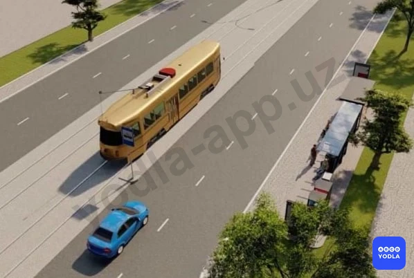

⬜ A. Разрешена
✅ B. Запрещена

> 💡 Согласно абзацу 2 пункта 88 главы 13 ПДД, в населенных пунктах остановка и стоянка допускаются на левой стороне дорог с одной полосой движения в каждом направлении и не имеющих трамвайных путей посередине, а так же дорог только с односторонним движением. Дорог имеющих трамвайных путей посередине остановка на левой стороне запрещена.

---

## Вопрос 13

**Ближе какого расстояния запрещается остановка и стоянка от остановочных площадок, а при их отсутствии, от указателя остановки маршрутных транспортных средств или такси, если это создает помехи их движению?**

⬜ A. 5 m
⬜ B. 10 m
✅ C. 15 m
⬜ D. 20 m
⬜ E. 25 m

> 💡 Согласно абзацу 13 пункта 91 главы 13 ПДД, остановка  запрещается в следующих местах: на остановочных площадках, местах остановки маршрутных транспортных средств, в том числе обозначенных дорожной разметкой 1.17 и ближе 15 м от них с обеих сторон по ходу движения, при их отсутствии — от указателя места остановки маршрутных транспортных средств (кроме остановки для посадки или высадки пассажиров, если это не создаст помех движению маршрутных транспортных средств).

---

## Вопрос 14

**Разрешается ли водителю грузовика остановиться в этом месте?**

⬜ A. Разрешается
✅ B. Запрещается

> 💡 Согласно абзацу 14 пункта 91 главы 13 ПДД, остановка запрещается в следующих местах: в местах, где транспортное средство закроет от других водителей сигналы светофора, дорожные знаки или сделает невозможным движение (въезд или выезд) других транспортных средств, или создаст помехи для движения пешеходов.

---

## Вопрос 15

**Разрешается ли стоянка автомобиля в этом месте?**

✅ A. Разрешается
⬜ B. Запрещается

> 💡 Согласно пункту 2 статьи 61 Правил ��орожного движения, при наличии в месте выезда на дорогу полосы разгона водитель должен двигаться по ней и перестраиваться на соседнюю полосу, уступая дорогу транспортным средствам, движущимся по этой дороге.

---

## Вопрос 16

**Разрешается ли остановка в указанном месте?**

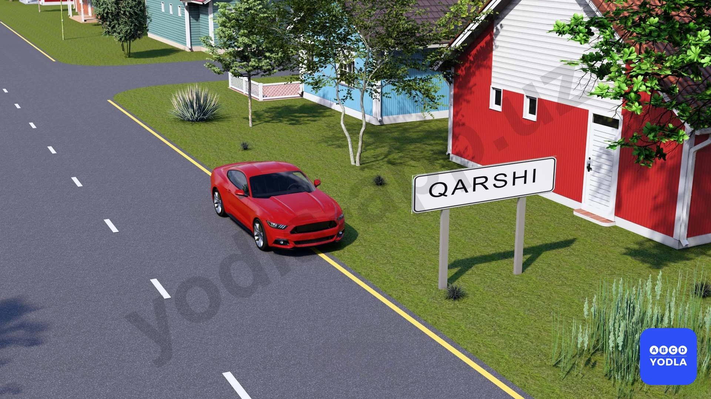

⬜ A. Разрешается
✅ B. Запрещается

---

## Вопрос 17

**Разрешена ли стоянка автомобиля в этом месте?**

⬜ A. Разрешена
✅ B. Запрещена

> 💡 Согласно требованию знака 3.28 раздела 3 приложения № 1 к ПДД, «Стоянка запрещена» запрещается стоянка транспортных средств. Его действия от места установки знака до ближайшего перекрестка за ним, до место для разворота, а в населенных пунктах при отсутствии перекрестка – до конца населенного пункта.

---

## Вопрос 18

**Где должен остановить автомобиль водитель при наличии обочины на дороге?**

⬜ A. У края проезжей части
⬜ B. На проезжей части, на расстоянии 0,5 м от обочины
✅ C. На самой обочине

> 💡 Согласно пункту 88 главы 13 ПДД, остановка и стоянка транспортных средств разрешаются на правой стороне дороги на обочине, а при ее отсутствии - на проезжей части у ее края.

---

## Вопрос 19

**Какие правила нарушил водитель легкового автомобиля?**

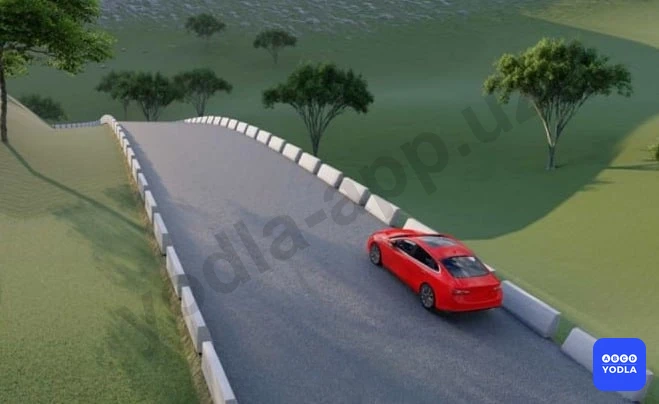

⬜ A. Только правила стоянки
✅ B. Правила остановки и стоянки

> 💡 Знак дополнительной информации 7.18 "Кроме инвалидов". Указывает, что действие знаков не распространяется на транспортные средства и мотоколяски, на которых установлены опознавательные знаки "Инвалид" в соответствии с пунктом 28.3 настоящих Правил. В данном случае знак дополнительной информации 7.18 означает, что действие знака 3.27 не распространяется на автомобили с опознавательным знаком "Инвалид". Соответственно, остановка для них разрешена.

---

## Вопрос 20

**Кто из водителей правильно произвел остановку для высадки пассажиров?**

⬜ A. Водитель синего и красного автомобиля

✅ B. Водители мотоцикла и синего автомобиля

⬜ C. Только водитель синего автомобиля
⬜ D. Все водители

> 💡 Горизонтальная разметка 1.4 (сплошная линия желтого цвета) - обозначает места, где запрещена остановка. Применяется самостоятельно или в сочетании со знаком 3.27 и наносится у края проезжей части или по верху бордюра.
Горизонтальная разметка 1.10 (прерывистая линия желтого цвета) - обозначает места, где запрещена стоянка. Применяется самостоятельно или в сочетании со знаком 3.28 и наносится у края проезжей части или по верху бордюра.
Горизонтальная разметка 1.17 - обозначает остановки маршрутных транспортных средств и стоянки такси.
Пункта 91 главы 13 ПДД, гласит: Что остановка запрещена на остановочных площадках, а при их отсутствии - ближе 15 м от указателя остановки маршрутных транспортных средств или такси, если это создаст помехи их движению. В данном случае только водитель красного автомобиля нарушил Правила дорожного движения, соответственно, водители мотоцикла и синего автомобиля правильно произвели остановку для высадки пассажиров.

---

## Вопрос 21

**Стоянка запрещается:**

⬜ A. Более 30 метров от края пересекаемых проезжих частей
⬜ B. Более 10 метров перед пешеходным переходом
⬜ C. Более одного метра за пешеходным переходом
✅ D. В тех местах; где стоящее транспортное средство делает невозможным движение (въезд или выезд) других транспортных средств или создает помехи для движения пешеходов
⬜ E. Во всех перечисленных случаях

> 💡 Пункта 91 главы 13 ПДД, гласит: Остановка запрещается в следующих местах: на пешеходных переходах и менее чем за 10 метров до них; на пересечениях проезжих частей на расстоянии менее 30 метров от края пересекаюшей проезжей части (за исключением противоположной стороны примыкающей дороги, отделенной разделительной линией или разделительной полосой на трехсторонних перекрестках); в местах, где транспортное средство закроет от других водителей сигналы светофора, дорожные знаки или сделает невозможным движение (въезд или выезд) других транспортных средств или создаст помехи для движения пешеходов.

---

## Вопрос 22

**Водители каких транспортных средств нарушили правила стоянки?**

⬜ A. Водитель легкового автомобиля
⬜ B. Водитель грузового автомобиля
✅ C. Оба водителя

> 💡 Запрещающий знак 3.28 “Стоянка запрещена”. Запрещается стоянка транспортных средств. “Стоянка запрещена” запрещает стоянку транспортных средств. Абзацу 3 пункта 88 главы 13 ПДД, грузовым автомобилям с разрешенной максимальной массой более 3,5 т на левой стороне дороги с односторонним движением остановка разрешается только для загрузки и разгрузки груза.

---

## Вопрос 23

**Водитель какого транспортного средства нарушил правила стоянки?**

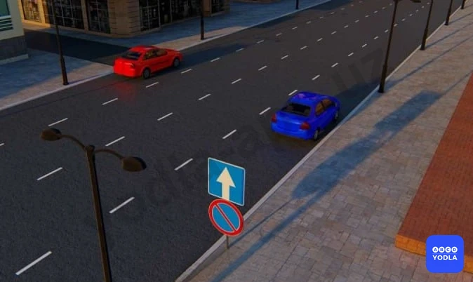

⬜ A. Водитель синего автомобиля
⬜ B. Водитель красного автомобиля
✅ C. Оба водителя нарушили
⬜ D. Оба водителя не нарушили

> 💡 Согласно пункту 91 Правил дорожного движения, остановка запрещается в следующих местах: на пересечении проезжих частей и ближе 30 м от края пересекаемой проезжей части, за исключением стороны напротив бокового проезда трехсторонних пересечений (перекрестков), имеющих сплошную линию дорожной разметки или разделительную полосу.
Согласно знак 3.28 раздела 3 приложения № 1 к ПДД, «Стоянка запрещена». запрещается стоянка транспортных средств, за исключением транспортных средств, прикрепленных к сотруднику, выполняющему служебные обязанности, и имеющих соответствующие цветографические схемы, нанесенные на наружной поверхности, оборудованных проблесковыми маячками красного или синего или синего и красного цветов.

---

## Вопрос 24

**Если за пешеходным переходом образовался затор, который вынудит водителя остановиться на пешеходном переходе, водитель обязан:**

✅ A. Остановиться и не въезжать на пешеходный переход,так как это создает помеху для движения пешеходов
⬜ B. Остановиться за 15 м перед пешеходным переходом
⬜ C. Остановиться на пешеходном переходе соблюдая необходимую дистанцию от вперед стоящего транспортного средства
⬜ D. Остановиться за 5 м перед пешеходным переходом

> 💡 Согласно пункту 112 главы 17 ПДД, запрещается въезжать на пешеходный переход, если за ним образовался затор, который вынудит водителя остановиться на пешеходном переходе.

---

## Вопрос 25

**Разрешается ли водителю автобуса остановиться для высадки пассажиров?**

✅ A. Запрещается
⬜ B. Разрешается

> 💡 Пункту 91 главы 13 ПДД, гласит: Остановка запрещается в следующих местах: в местах, где расстояние между сплошной линией разметки (кроме обозначающей край проезжей части) и остановившимся транспортным средством менее 3 M; В данном случае ширина проезжей части в одну сторону составляет 4,5 м (9 м деленное пополам), если автобус остановится в указанном месте, расстояние между сплошной линией разметки и автобусом будет менее 3 м, а это запрещено.

---

## Вопрос 26

**В каком ответе указаны все водители; нарушившие правила остановки?**

⬜ A. Водители красного автомобиля и мотоцикла
⬜ B. Водитель синего автомобиля
⬜ C. Водитель мотоцикла
✅ D. Водители всех транспортных средств

> 💡 Запрешаюший знак 3.27 “Остановка запрешена”, Запрешается остановка и стоянка транспортных средств. Знак дополнительной информации 7.2.4 “Зона действия” информирует водителей о нахождении их в зоне действия знаков. Пункту 66 главы 10 ПДД, гласит: На дорогах с двусторонним движением, имеющих три полосы (кроме обозначенных разметкой 1.9), на среднюю полосу разрешается выезжать только для обгона, поворота налево, разворота и объезда. Выезжать на крайнюю левую полосу, предназначенную для встречного движения, запрещается.

---

## Вопрос 27

**На каком рисунке водитель поставил автомобиль на стоянку с нарушением правил?**

⬜ A. Только на левом
✅ B. На левом и среднем
⬜ C. На всех

> 💡 Согласно пункту 88 главы 13 ПДД, остановка и стоянка транспортных средств разрешаются на правой стороне дороги на обочине, а при ее отсутствии – у края проезжей части.

---

## Вопрос 28

**Какой автомобиль правильно поставлен на стоянку?**

⬜ A. Легковой автомобиль
✅ B. Оба неправильно
⬜ C. Оба правильно
⬜ D. Грузовик

> 💡 Согласно абзацу 3 пункта 88 главы 13 ПДД, грузовым автомобилям с разрешенной максимальной массой более 3,5 т на левой стороне дороги с односторонним движением остановка разрешается только для загрузки и разгрузки груза. Согласно абзацу 8 пункта 91 главы 13 ПДД, остановка и стоянка запрещается в следующих местах: на пешеходных переходах и ближе 10 м перед ними.

---

## Вопрос 29

**Разрешается ли здесь остановка автомобиля?**

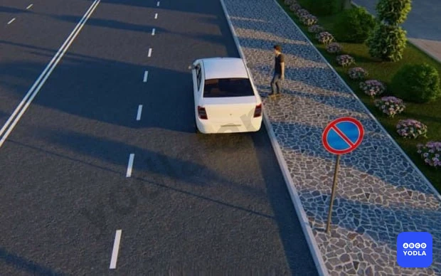

⬜ A. Запрещается, потому что расстояние между автомобилем и прерывистой линией дороги меньше 3-х метров
⬜ B. Запрещается по четным дням месяца
✅ C. Разрешается

> 💡 Согласно требованию знака 3.28 раздела 3 приложения № 1 к ПДД, «Стоянка запрещена» запрещается только стоянку. Прекращение движения транспортного средства связанным с посадкой или высадкой пассажиров транспортного средства не запрещена.

---

## Вопрос 30

**Ближе какого расстояние от железнодорожных переездов запрещается стоянка транспортных средств?**

⬜ A. 300 м
⬜ B. 150 м
⬜ C. 100 м
✅ D. 50 м
⬜ E. 25 м

> 💡 Пункту 92 главы 13 ПДД, гласит: Стоянка запрещается в следующих местах: ближе 50 м от железнодорожных переездов.

---

## Вопрос 31

**Водители каких транспортных средств правильно остановились для высадки пассажиров?**

✅ A. Водитель легкового автомобиля
⬜ B. Водитель мотоцикла
⬜ C. Водитель автобуса
⬜ D. Все водители

> 💡 Согласно абзацу 8 пункта 91 главы 13 ПДД, остановка запрещается на пешеходных переходах и ближе 10 м перед ними.

---

## Вопрос 32

**Водителю какого автомобиля разрешена остановка?**

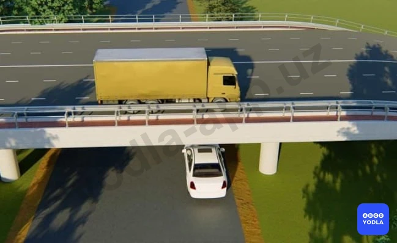

⬜ A. Водителю легкового автомобиля
✅ B. Водителю грузового автомобиля
⬜ C. Обоим водителям

> 💡 Согласно абзацу 4 пункта 91 главы 13 ПДД, остановка запрещается на мостах, эстакадах, путепроводах, если для движения в одном направлении имеется менее трёх полос. Под мостами, эстакадами и путепроводами (кроме участков дорог, на которых разрешена стоянка с соответствующими дорожными знаками).

---

## Вопрос 33

**Водитель какого транспортного средства нарушил правила остановки?**

✅ A. Только водитель мотоцикла
⬜ B. Только водитель автомобиля
⬜ C. Оба нарушили
⬜ D. Никто не нарушил

> 💡 Согласно пункту 132 главы 22 ПДД, если полоса, обозначенная дорожным знаком 5.9 отделена от остальной проезжей части дороги прерывистой линией разметки, в таких местах заезжать на эту полосу при въезде на дорогу и для посадки и высадки пассажиров у правого края проезжей части при условии, что это не создаст помех движению маршрутных транспортных средств.

---

## Вопрос 34

**Где разрешается длительная стоянка транспортных средств (отдых, ночлег и т.д.) вне населенного пункта?**

⬜ A. На обочине дороге
✅ B. На площадках для стоянки или за пределами дороги
⬜ C. На правой стороне проезжей части дороги, но так чтобы не препятствовать движению других транспортных средств
⬜ D. На левой стороне, только соблюдая все меры безопасности движения

> 💡 Пункту 90 главы 13 ПДД, гласит: Вне населенных пунктов стоянка для отдыха, ночлега и в других целях разрешается только на предусмотренных для этого площадках или за пределами дороги.

---

## Вопрос 35

**Остановка и стоянка транспортных средств запрещается в местах, где расстояние между сплошной линией продольной разметки и остановившимся транспортным средством менее:**

⬜ A. 2,0 м
✅ B. 3,0 м
⬜ C. 4,0 м
⬜ D. 5,0 м
⬜ E. 6,0 м

---

## Вопрос 36

**Где запрещается остановка и стоянка транспортных средств?**

⬜ A. В местах с интенсивным движением транспортных средств и пешеходов
✅ B. На мостах, эстакадах и путепроводах, имеющих менее 3 полос движения
⬜ C. При расстоянии более 30 м до края пересекающейся проезжей части

> 💡 Согласно абзацу 12 пункта 91 главы 13 ПДД, Остановка и стоянка запрещается в следующих местах: на пересечении проезжих частей и ближе 30 м от края пересекаемой проезжей части (за исключением стороны напротив бокового проезда трехсторонних пересечений (перекрестков), имеющих сплошную линию разметки или разделительную полосу).

---

## Вопрос 37

**Водитель какого автомобиля не нарушил правила стоянки?**

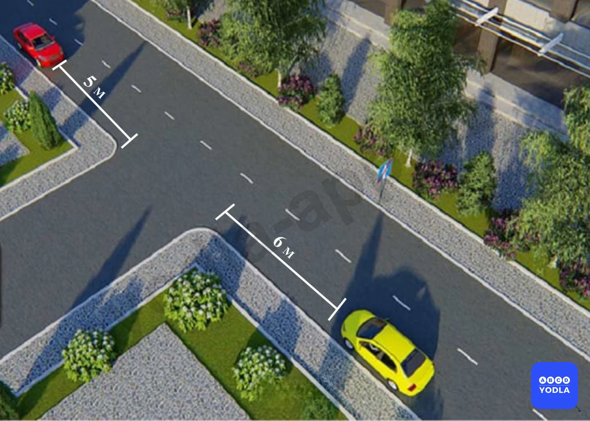

⬜ A. Красный
⬜ B. Желтый
✅ C. Оба нарушили
⬜ D. Никто не нарушил

> 💡 Согласно пункту 88 главы 13 ПДД, остановка и стоянка транспортных средств разрешаются на правой стороне дороги на обочине, а при ее отсутствии - на проезжей части у ее края. В населенных пунктах остановка и стоянка допускаются на левой стороне дорог с одной полосой движения в каждом направлении и не имеющих трамвайных путей посередине, а так же дорог только с односторонним движением.
Согласно пунку 91 главы 13 ПДД, остановка запрещается на пересечении проезжих частей и ближе 30 м от края пересекаемой проезжей части (за исключением стороны напротив бокового проезда трехсторонних пересечений (перекрестков), имеющих сплошную линию дорожной разметки или разделительную полосу).

---

## Вопрос 38

**В каких местах из перечисленных не запрещается остановка и стоянка транспортных средств?**

⬜ A. На мостах; путепроводах; имеющих 3 и более полосы движения в одном направлении
⬜ B. Более 30 м от края пересекаемой проезжей части
✅ C. Во всех указанных местах

---

## Вопрос 39

**В каком случае водитель правильно остановил машину для высадки пассажиров?**

⬜ A. На левом рисунке
⬜ B. На обоих рисунках
⬜ C. На правом рисунке
✅ D. На обоих рисунках остановился неправильно

> 💡 Пункта 91 главы 13 ПДД, гласит: на пешеходных переходах и менее чем за 10 метров до них; на пересечениях проезжих частей на расстоянии менее 30 метров от края пересекаюшей проезжей части (за исключением противоположной стороны примыкающей дороги, отделенной разделительной линией или разделительной полосой на трехсторонних перекрестках).

---

## Вопрос 40

**Разрешается ли стоянка на краю тротуара, прилегающего непосредственно к проезжей части с полным или частичным заездом на него?**

✅ A. Разрешается только легковым автомобилям и мотоциклам при условии, что это не создаст помех движению пешех
⬜ B. Запрещается только грузовым автомобилям с разрешенной максимальной массой более 3,5 т
⬜ C. Запрещается всем, транспортным средствам

> 💡 Абзацу 2 пункта 15 главы 4 ПДД, гласит: стоянка на краю тротуара, граничащего с проезжей частью, разрешается только легковым автомобилям, мотоциклам, мопедам и велосипедам при условии, что это не будет создавать помех движению пешеходов.

---

## Вопрос 41

**Что запрещается водителю, если он решил открыть двери транспортного средства и выйти из него?**

⬜ A. Запрещается открывать двери стоящего транспортного средства на дорогах с интенсивным движением
⬜ B. Запрещено открывать водительскую дверь на оживлённых дорогах. Выход через пассажирскую дверь.
✅ C. Запрещается открывать двери стоящего транспортного средства, если это угрожает безопасности и создает помехи другим участникам дорожного движения

> 💡 Согласно пункту 94 главы 13 ПДД, запрещается открывать двери транспортного средства, если это создаст помехи или опасность другим участникам дорожного движения (водителям и для пассажирам).

---

## Вопрос 42

**В каких местах из перечисленных запрещается остановка и стоянка транспортных средств?**

⬜ A. В местах выезда из ворот
⬜ B. На трамвайных путях
⬜ C. В непосредственной близости от трамвайных путей, если это создает помехи движению трамваев
✅ D. Во всех указанных местах

> 💡 Пункта 91 главы 13 ПДД, гласит: Остановка запрещается в следующих местах: на трамвайных путях, а также в непосредственной близости от них, если это создает помехи движению трамваев; в местах, где транспортное средство закроет от других водителей сигналы светофора, дорожные знаки или сделает невозможным движение (въезд или выезд) других транспортных средств или создаст помехи для движения пешеходов.

---

## Вопрос 43

**Остановка и стоянка запрещены:**

⬜ A. На железнодорожных переездах
⬜ B. На пешеходных переходах и ближе 10 м
⬜ C. В местах где движение транспорта мешает движению пешеходов
⬜ D. При выезде из дворов
✅ E. Во всех перечисленных случаях

> 💡 Пункта 91 главы 13 ПДД, гласит: Остановка запрещается в следующих местах: в тоннелях, на железнодорожных переездах; на пешеходных переходах и ближе 10 м перед ними; в местах, где транспортное средство закроет от других водителей сигналы светофора, дорожные знаки или сделает невозможным движение (въезд или выезд) других транспортных средств или создаст помехи для движения пешеходов;

---

## Вопрос 44

**Остановка и стоянка запрещена:**

⬜ A. Вблизи опасных поворотов и выпуклых переломов продольного профиля дороги с видимостью дороги менее 100 м в одном направлении
⬜ B. На мостах, эстакадах и путепроводах, имеющие менее 3 полос движения
✅ C. Во всех перечисленных случаях

> 💡 Абзацу 3 пункта 91 главы 13 ПДД, остановка запрещается в следующих местах: на мостах, эстакадах, путепроводах (если для движения в одном направлении имеется менее трех полос) и под ними; в близи выпуклых переломов продольного профиля дороги, при видимости дороги менее 100 м хотя бы в одном направлении.

---

## Вопрос 45

**Разрешено ли водителю ставить автомобиль на стоянку в указанном месте?**

⬜ A. Да
✅ B. Нет

> 💡 Согласно пункту 2 статьи 61 Правил дорожного движения, при наличии в месте выезда на дорогу полосы разгона водитель должен двигаться по ней и перестраиваться на соседнюю полосу, уступая дорогу транспортным средствам, движущимся по этой дороге.

---

## Вопрос 46

**Кто из водителей нарушил правила стоянки?**

⬜ A. Только водитель мотоцикла
✅ B. Только водитель автомобиля стоящий на тротуаре
⬜ C. Никто не нарушил

> 💡 Знак 7.16 раздела 7 приложения № 1 к ПДД, «Влажное покрытие». Указывает, что действие знака распространяется на период времени, когда покрытие проезжей части влажное.

---

## Вопрос 47

**Нарушил ли водитель грузового автомобиля правила парковки?**

✅ A. Нарушил
⬜ B. Нарушил, если разрешенная максимальная масса автомобиля более 3,5 т
⬜ C. Не нарушил

> 💡 Согласно требованиям безопасности дорожного движения, для предотвращения опасных последствий заноса автомобиля при резком повороте рулевого колеса на скользкой дороге, водителю следует предпринять быстро, но плавно повернуть рулевое колесо в сторону заноса, затем опережающим воздействием на рулевое колесо выровнять траекторию движения автомобиля.

---

## Вопрос 48

**Разрешена ли Вам остановка в указанном месте на перекрестке?**

⬜ A. Разрешена
✅ B. Запрещена
⬜ C. Разрешена, если расстояние от Вашего транспортного средства до линии разметки не менее 3 м

> 💡 Согласно пункту 7.4 Приложение № 3 к Правилам дорожного движения, светопропускание передних лобовых, боковых и задних стекол на всех транспортных средствах менее 70%, за исключением стекол люков, установленных на крыше автомобиля, а также тонированных (затемненных) стекол автотранспортных средств, установленных на основании разрешения органов внутренних дел. Примечание. Допускается наличие занавесок на боковых и задних лобовых стеклах автотранспортных средств категории М3 класса III, тонирование (затемнение) задних лобовых стекол автотранспортных средств всех категорий без ограничения светопропускания, а также наличия на задних лобовых стеклах занавесок (жалюзи, шторка) при наличии с обеих сторон наружных зеркал заднего вида.

---

## Вопрос 49

**Разрешено ли Вам остановиться на легковом автомобиле в указанном месте?**

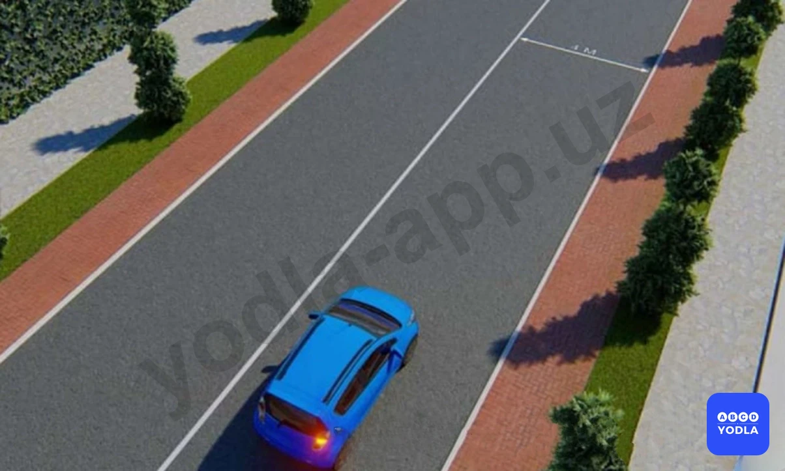

⬜ A. Да
✅ B. Нет

> 💡 Согласно требованиям безопасности дорожного движения, риск сильного бокового ветра возрастает при переходе с закрытого участка дороги на открытый участок.

---

## Вопрос 50

**В каком порядке разрешается парковать транспортные средства на нерасширенных участках проезжей части?**

⬜ A. Под углом
✅ B. Параллельно
⬜ C. В любом случае

> 💡 Знак 3.21 раздела 3 приложения № 1 к ПДД, «Конец зоны запрещения обгона».
Знак 3.23 раздела 3 приложения № 1 к ПДД, «Конец зоны запрещения обгона грузовым автомобилям».
Знак 3.31 раздела 3 приложения № 1 к ПДД, «Конец зоны всех ограничений». Обозначение конца зоны действия одновременно нескольких знаков из следующих: 3.16, 3.20, 3.22, 3.24, 3.26 — 3.30.

---

## Вопрос 51

**Кто нарушил правило стоянки?**

⬜ A. Только «А»
✅ B. Только «Б»
⬜ C. «А» и «Б»

> 💡 Согласно пункту 46 Правил дорожного движения, подача сигнала указателями поворотов или рукой должна производиться заблаговременно до начала выполнения маневра и прекращаться немедленно после его завершения (подача сигнала рукой может быть закончена непосредственно перед выполнением маневра).

---

## Вопрос 52

**Можно ли остановиться в этом месте для посадки или высадки пассажира?**

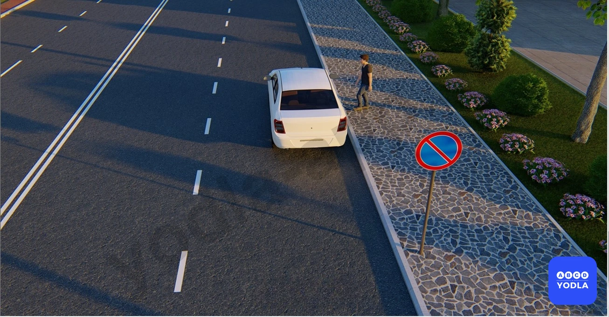

✅ A. Да
⬜ B. Нет

> 💡 ПДД приложение № 1: 3.28. “Стоянка запрещена”. Запрещается стоянка транспортных средств.

---

## Вопрос 53

**Кто из водителей нарушил правила остановки?**

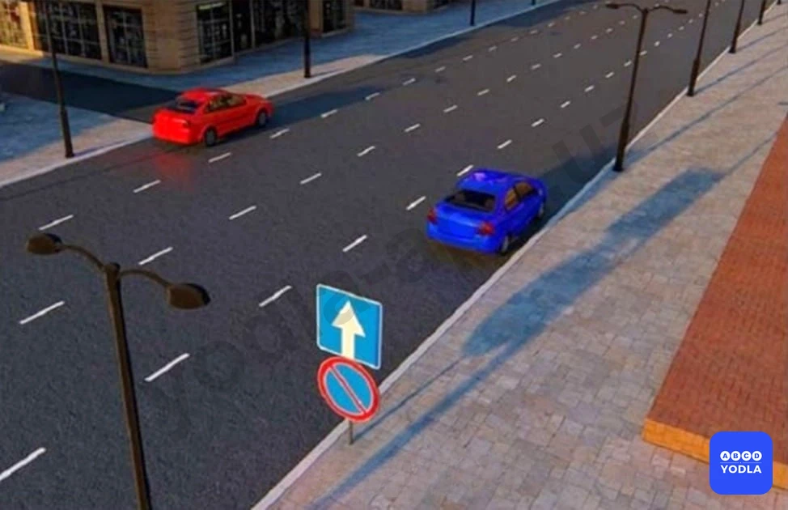

⬜ A. Оба нарушили
⬜ B. Только водитель синего автомобиля
✅ C. Только водитель красного автомобиля

> 💡 Согласно статьи 6 Правил дорожного движения, приоритет — право на первоочередное движение в намеченном направлении по отношению к другим участникам движения.

---

## Вопрос 54

**Ближе какого расстояния запрещеноостанавливаться от края пересекаемойпроезжей части?**

⬜ A. 40 метр
⬜ B. 45 метр
✅ C. 30 метр

> 💡 Пункта 91 главы 13 ПДД, гласит: на пересечениях проезжих частей и на расстоянии менее 30 метров от края пересекаюшей проезжей части (за исключением противоположной стороны примыкающей дороги, отделенной разделительной линией или разделительной полосой на трехсторонних перекрестках).

---

## Вопрос 55

**На каком расстоянии запрещена остановка транспортных средств в местах разворота, атакже до или после них?**

⬜ A. 40 метр
⬜ B. 45 метр
✅ C. 30 метр
⬜ D. 50 метр

> 💡 Пункта 91 главы 13 ПДД, гласит: Остановка запрещается в следующих местах: В местах разворота транспортных средств а также до или после них 30 метров.

---

## Вопрос 56

**Не ближе какого расстояния разрешается остановка и стоянка перед пешеходным переходом?**

⬜ A. 3 метров
⬜ B. 5 метров
✅ C. 10 метров

> 💡 Пункта 91 главы 13 ПДД, гласит: Остановка запрещается в следующих местах: на пешеходных переходах и менее чем за 10 метров до них.

---

## Вопрос 57

**На каком расстоянии от остановки по ходу движения (не доезжая и после) запрещается остановка и стоянка?**

⬜ A. 25 метр
⬜ B. 30 метр
✅ C. 15 метр
⬜ D. 20 метр

> 💡 Согласно абзацу 13 пункта 91 главы 13 ПДД, остановка  запрещается в следующих местах: на остановочных площадках, местах остановки маршрутных транспортных средств, в том числе обозначенных дорожной разметкой 1.17 и ближе 15 м от них с обеих сторон по ходу движения, при их отсутствии — от указателя места остановки маршрутных транспортных средств (кроме остановки для посадки или высадки пассажиров, если это не создаст помех движению маршрутных транспортных средств).

---

## Вопрос 58

**В каком из указанных мест Вы можете произвести остановку?**

⬜ A. Только «А»
✅ B. Только «Б»
⬜ C. Только «Б» и «В»
⬜ D. Ни в каком

> 💡 Согласно пункту 118 Правил дорожного движения, запрещается выезжать на железнодорожный переезд в следующих случаях: если за переездом образовался затор, который вынудит водителя остановиться на переезде.

---

## Вопрос 59

**Водитель какой машины не нарушил правил парковки?**

⬜ A. Красный
⬜ B. Жёлтый
✅ C. Оба нарушили
⬜ D. Никто не нарушил

> 💡 Пункта 168 главы 28 ПДД, гласит: Водителям велосипеда и индивидуальные транспортные средства запрещается:
ездить, не держась за руль или держась за руль одной рукой (за исключением случая, когда подается предупредительный сигнал перед маневром);
перевозить пассажиров (за исключением перевозки пассажиров в возрасте до 7 лет на дополнительном сиденье, оборудованном надежным подножками);
перевозить груз, который выступает более чем 0,5 м по длине или ширине за габариты, или груз, мешающий управлению;

---

## Вопрос 60

**На каком расстоянии от пересечения с велосипедной дорожкой запрещается остановка?**

✅ A. 10 метров
⬜ B. 15 метров
⬜ C. 30 метров

> 💡 Пункта 169 главы 28 ПДД, гласит: Вне перекрестков, на нерегулируемом пересечении велосипедной дорожки с дорогой, велосипедисты и индивидуальные транспортные средства должны уступить дорогу транспортным средствам, движущимся по этой дороге. При взаимном пересечении велосипедной и пешеходной дорожек (тротуара) велосипедист и индивидуальные транспортные средства должны уступить дорогу пешеходу.

---

## Вопрос 61

**В данной ситуации на каком минимальном расстоянии до первого железнодорожного пути водители должны остановиться?**

⬜ A. з метров
⬜ B. 5 метров
✅ C. 10 метров

> 💡 Пункта 25 главы 6 ПДД, гласит: Для получения приоритета перед другими участниками движения водители транспортных средств оперативных и специальных служб должны включить проблесковый маячок синего или красного или синего и красного цветов и специальный звуковой сигнал. Воспользоваться приоритетом они могут, только убедившись, что им уступают дорогу.

---

## Вопрос 62

**На каком изображении водители нарушили правила остановки?**

⬜ A. 1
⬜ B. 2
⬜ C. 3
⬜ D. 1,2
✅ E. 1,3

> 💡 ПДД приложение № 1: 4.1.1 Движение прямо.
Действие знака 4.1.1, установленного в начале участка дороги, распространяется до ближайшего перекрестка. Знак не запрещает поворот направо на прилегающие к дороге территории.

---

## Вопрос 63

**Разрешена ли остановка в указанном месте?**

⬜ A. Разрешено
✅ B. Запрещено
⬜ C. Остановиться разрешается, если расстояние между остановленным транспортным средством и сплошной линией превышает 3 метра

> 💡 ПДД приложение № 1: 5.16.2, 5.16.2. Пешеходный переход. При отсутствии на переходе разметки 1.14.1 — 1.14.3 знак 5.16.2 устанавливается справа от дороги на ближней границ�� перехода, а знак 5.16.1 — слева от дороги на дальней границе перехода.

---

## Вопрос 64

**Что считается стоянкой?**

⬜ A. Прекращение движения транспортного средства на время до 10 минут (приведение в неподвижное состояние)
✅ B. Преднамеренное прекращение движения транспортного средства на время более 10 минут по причинам, не связанным с посадкой или высадкой пассажиров либо загрузкой или разгрузкой транспортного средства.

> 💡 "На основании абзаца 2 пункта 149 главы 25 ПДД: 149. Обучаемому к концу обучения на право управления транспортным средством должно быть:
для категории «А» — не менее 16 лет."

---

## Вопрос 65

**Что считается остановкой?**

✅ A. Прекращение движения транспортного средства на время до 10 минут (приведение в неподвижное состояние)
⬜ B. Преднамеренное прекращение движения транспортного средства на время более 10 минут по причинам, не связанным с посадкой или высадкой пассажиров либо загрузкой или разгрузкой транспортного средства

> 💡 На основании абзаца 1 пункта 64 главы 10 ПДД: 64. Количество полос движения для безрельсовых транспортных средств определяется разметкой и (или) дорожными знаками 5.8.1, 5.8.2, 5.8.7, 5.8.8. Если такой дорожной разметки или дорожных знаков нет — самими водителями, с учетом ширины проезжей части, габаритов транспортных средств и необходимых интервалов между ними. При этом на дорогах с двусторонним движением стороной, предназначенной для встречного движения, считается половина ширины проезжей части, расположенная слева, не считая местной ширины проезжей части (полосы торможения и разгона, дополнительные полосы на подъем, заездные карманы мест остановок маршрутных транспортных средств).

---

## Вопрос 66

**За пределами населённых пунктов какой автомобиль не нарушил правила остановки?**

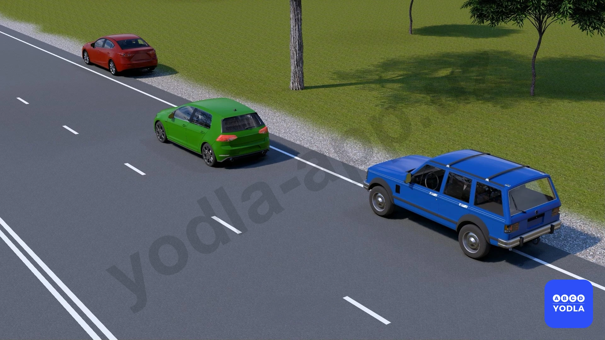

✅ A. Красный автомобиль
⬜ B. Зелёный автомобиль
⬜ C. Красный и зелёный автомобиль
⬜ D. Все автомобили нарушили правила остановки
⬜ E. Синий автомобиль

> 💡 На основании абзаца 2 пункта 133 главы 22 ПДД: Маршрутным транспортным средствам запрещается посадка и высадка пассажиров в местах, отличных отостановок (за исключением маршрутных такси).

---

## Вопрос 67

**Разрешена ли остановка автомобиля в данной ситуации?**

⬜ A. Запрещена
✅ B. Разрешена

> 💡 Впереди опасность — снизьте скорость, чтобы успеть остановиться.

---

## Вопрос 68

**Разрешена ли стоянка автомобиля в этом месте?**

✅ A. Разрешена
⬜ B. Запрещена

> 💡 На основании главы 13 ПДД, пункта 88, абзаца 2 и пункта 91, абзаца 13: В населенных пунктах на дорогах с отсутствием трамвайных путей посередине, имеющих по одной полосе в каждом направлении, а также с организацией одностороннего движения разрешается остановка и стоянка на левой стороне дороги.
91. Остановка запрещается в следующих местах: на пересечении проезжих частей и ближе 30 м от края пересекаемой проезжей части, (за исключением стороны напротив бокового проезда трехсторонних пересечений (перекрестков, имеющих сплошную линию дорожной разметки или разделительную полосу).

---

## Вопрос 69

**Разрешена ли остановка в указанном месте?**

⬜ A. Запрещена
✅ B. Разрешена

> 💡 На основании абзаца 8 пункта 91 главы 13 ПДД: 91. Остановка запрещается в следующих местах: в местах, где расстояние между сплошной линией дорожной разметки (кроме обозначающей край проезжей части), разделительной полосой или противоположным краем проезжей части и остановившимся транспортным средством менее 3 м.

---

## Вопрос 70

**Разрешена ли остановка в указанном месте?**

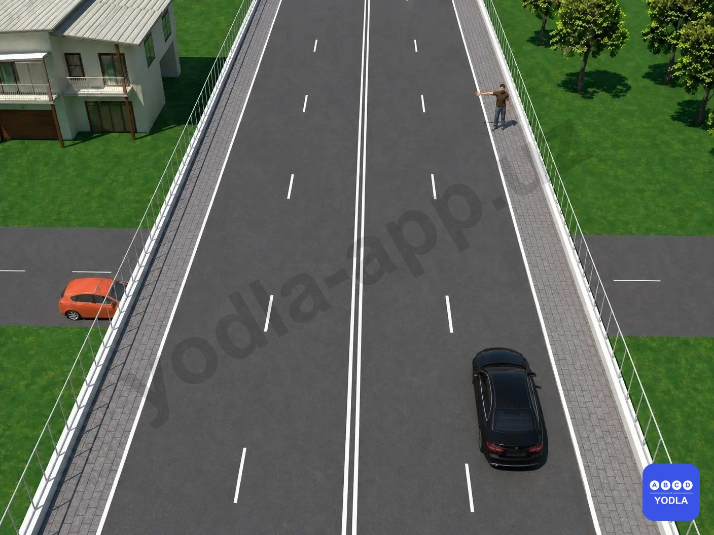

⬜ A. Разрешена
✅ B. Запрещена

> 💡 Согласно главе 13, пункту 91 (абзац 7) Правил дорожного движения:

91. Остановка запрещается: на мостах, путепроводах, эстакадах и под ними, если для движения в данном направлении имеется менее трёх полос.

В данной ситуации транспортное средство находится на мосту, поэтому остановка запрещена.

---

## Вопрос 71

**Разрешена ли остановка в указанном месте?**

✅ A. Разрешена
⬜ B. Запрещена

---

## Вопрос 72

**Разрешается ли в данном месте остановка для посадки или высадки пассажиров?**

⬜ A. Разрешается
✅ B. Запрещается
⬜ C. Разрешается только водителям такси

> 💡 Согласно главе 13, пункту 91 (абзац 4) Правил дорожного движения:

91. Остановка запрещается: в тоннелях.

Поэтому остановка в тоннеле для посадки или высадки пассажиров также запрещена.

---

