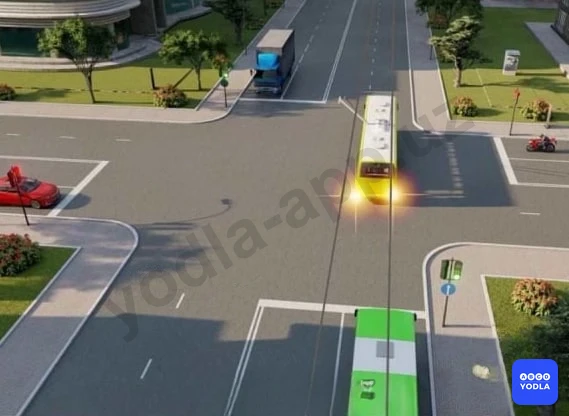
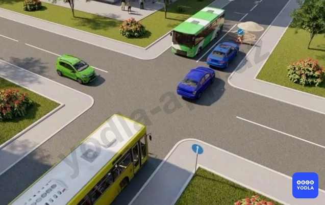
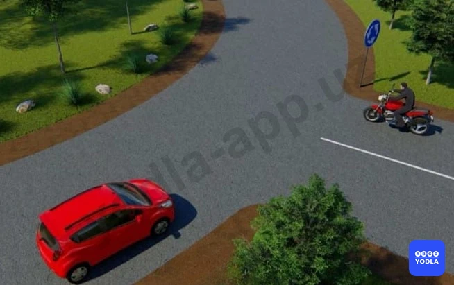
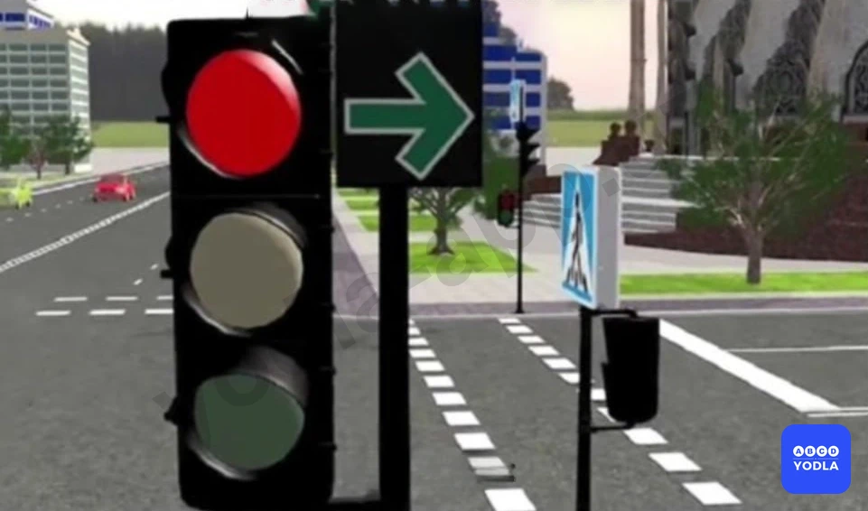
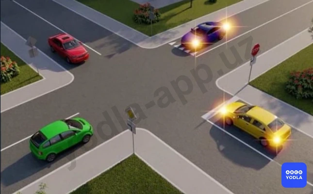
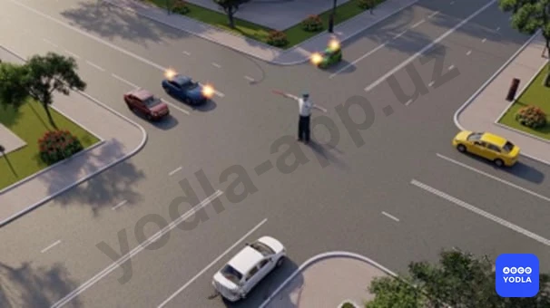

# 22. Проезд перекрестков (боб 14)

Всего вопросов: 14

## Вопрос 1

**Разрешается ли автобусу въезжать на перекресток в данной ситуации?**

⬜ A. Разрешается
✅ B. Запрещается
⬜ C. Разрешается: если автобус движется по установленному маршруту

> 💡 В соответствии с восьмым абзацем пункта 162 главы 27 ПДД: Перевозка груза допускается при условии, что груз: габариты груза, размещенного в багажнике, установленном на крыше легкового автомобиля не превышает 1 метра по высоте и 0,5 метра по длине (кроме случаев перевозки велосипедов, закрепленных специальными приспособлениями).

---

## Вопрос 2

**Красный автомобиль:**

⬜ A. Имеет преимущество перед синим, так как едет по главной дороге
✅ B. Имеет преимущество перед синим, так как едет по дороге с круговым движением
⬜ C. Должен уступить дорогу синему; приблизившемуся к перекрестку справа

> 💡 Согласно пункту 104 главы 16 ПДД, на перекрестках неравнозначных дорог водитель транспортного средства, движущегося по второстепенной дороге, должен уступить дорогу транспортным средствам, приближающимся по главной дороге, независимо от направления их дальнейшего движения.

---

## Вопрос 3

**Разрешается ли выезд на перекресток водителю желтого автобуса?**

⬜ A. Разрешается
✅ B. Запрещается
⬜ C. Если автобус движется по установленному маршруту

> 💡 Согласно пункту 97 главы 14 ПДД, водитель, который вынужден остановиться из-за образовавшегося впереди затора, не должен выезжать на перекресток,  а водитель пересек стоп-линию или дорожный знак 5.33, ему запрещается выезд пересечение проезжих частей, если он создает препятствие для движения транспортных средств в поперечном направлении.

---

## Вопрос 4

**Как должен поступить водитель в показанной ситуации?**

✅ A. Дать возможность пешеходам закончить переход проезжей части данного направления
⬜ B. Подать звуковой сигнал для предотвращения дорожно-транспортного происшествия и не уступая дорогу пешеходам проехать переход так как он находится на главной дороге

> 💡 Согласно пункту 96 главы 14 ПДД, при повороте направо или налево водитель обязан уступить дорогу пешеходам, переходящим проезжую часть пересекаемой дороги, а также велосипедистам, пересекающим дорогу по велосипедной дорожке.

---

## Вопрос 5

**Водитель какого транспортного средства должен уступить дорогу?**

⬜ A. Водитель автомобиля
✅ B. Водитель мотоцикла

> 💡 Согласно пункту 104 главы 16 ПДД, на перекрестках неравнозначных дорог водитель транспортного средства, движущегося по второстепенной дороге, должен уступить дорогу транспортным средствам, приближающимся по главной дороге, независимо от направления их дальнейшего движения.

---

## Вопрос 6

**Как должен поступить водитель; поворачивая направо в показанной ситуации?**

⬜ A. Используя преимущественное право, подать звуковой сигнал и продолжать движение в намеченном направлении
⬜ B. Снизить скорость движения и следовать с особой осторожностью
✅ C. Пропустить пешеходов; переходящих проезжую часть

> 💡 Согласно пункту 96 главы 14 ПДД, при повороте направо или налево водитель обязан уступить дорогу пешеходам, переходящим проезжую часть пересекаемой дороги, а также велосипедистам, пересекающим дорогу по велосипедной дорожке.

---

## Вопрос 7

**При въезде на перекресток Вы:**

⬜ A. Должны уступить дорогу только мотоциклу
✅ B. Должны уступить дорогу обоим транспортным средствам
⬜ C. Имеете преимущественное право на движение

> 💡 Согласно знаку 4.1.2 раздела 4 приложения № 1 к ПДД, «Движение направо», разрешается движение только в направлениях, указанных на знаке стрелкой. Действие знака 4.1.2 распространяется на пересечение проезжих частей, перед которым установлен знак.

---

## Вопрос 8

**Кто должен уступить дорогу на этом перекрестке?**

✅ A. Синий автомобиль
⬜ B. Мотоцикл и жёлтая машина

> 💡 Согласно знаку 2.5 раздела 2 приложения № 1 к ПДД,  «Движение без остановки запрещено». Запрещается движение без остановки перед стоп-линией, а если ее нет — перед краем пересекаемой проезжей части.

---

## Вопрос 9

**Нужно ли уступать дорогу пешеходам, переходящим дорогу там. где водитель поворачивает налево?**

✅ A. Да, во всех случаях
⬜ B. Да, если есть пешеходный переход

> 💡 Согласно пункту 106 Правил дорожного движения, Если главная дорога на перекрестке меняет направление, водители, движущиеся по главной дороге, должны руководствоваться между собой правилами проезда перекрестков равнозначных дорог.
Этим же правилом должны руководствоваться между собой и водители, движущиеся по второстепенным дорогам.

---

## Вопрос 10

**На кольцевой развязке:**

✅ A. Движущиеся транспортные средства имеют приоритет (преимущество) перед транспортными средствами, въезжающими на круговое движение
⬜ B. Транспортные средства, въезжающие на круговое движение, имеют приоритет по отношению к движущимися транспортными средствами по круговому движению

> 💡 Знак 7.6.1 раздела 7 приложения № 1 к ПДД, «Способ постановки транспортного средства на стоянку». 7.6.1 указывает способ постановки транспортного средства на проезжую часть, вдоль тротуара.

---

## Вопрос 11

**Когда вы поворачиваете направо в этой ситуации, вы:**

⬜ A. Вы уступаете дорогу только транспортным средсвам
⬜ B. F2. Вы уступите дорогу пешеходам на всей проезжей части
✅ C. Вы уступите дорогу пешеходам и другим транспортным средствам, пересекающим улицу в направлении движения и при повороте

> 💡 Согласно пункту 2.1 Приложение № 3 к Правилам дорожного движения, суммарный люфт в рулевом управлении в регламентированных условиях испытаний автотранспортного средства не должен превышать следующих значений: N1 – 20 градус.

---

## Вопрос 12

**На перекрёстке кругового движения:**

✅ A. Транспортные средства, движущиеся на перекрестке с круговым движением, имеют приоритет (преимущество) по отношению к транспортным средствам, въезжающим на перекресток
⬜ B. Транспортные средства въезжающий на перекрестокимеют приоритет (преимущество) по отношению к транспортным средствамдвижущиеся на перекрестке

> 💡 Согласно пункту 132 Правил дорожного движения, По полосе, обозначенной дорожными знаками 5.9, 5.10.1 — 5.10.3 для движения маршрутных транспортных средств, движение и остановка других транспортных средств запрещается.
Если полоса, обозначенная дорожным знаком 5.9 отделена от остальной проезжей части дороги прерывистой линией разметки, то при поворотах транспортные средства должны перестраиваться на эту полосу.
Разрешается также в таких местах заезжать на эту полосу при въезде на дорогу и для посадки и высадки пассажиров у правого края проезжей части при условии, что это не создаст помех движению маршрутных транспортных средств.

---

## Вопрос 13

**На рисунке изображена-...**

✅ A. Нерегулируемый, перекресток неравнозначных дорог
⬜ B. Нерегулируемый, равнозначный перекресток
⬜ C. Регулируемый перекресток

> 💡 При съезде автомобиля правыми колесами на неукрепленную и влажную обочину возникает опасность заноса из-за разницы сцепления правых и левых колес с дорогой. При этом целесообразно, не меняя скорости, т.е. не прибегая к торможению, плавным поворотом рулевого колеса вернуть автомобиль на проезжую часть. Торможение в данной ситуации может вызвать занос автомобиля.

---

## Вопрос 14

**На рисунке изображена:**

⬜ A. Нерегулируемый перекресток неравнозначных дорог
⬜ B. Нерегулируемый, равнозначный перекресток
✅ C. Регулируемый перекресток

> 💡 Пункта 128 главы 21 ПДД, гласит: На уклонах, обозначенных дорожными знаками 1.13 и 1.14, при наличии препятствия, затрудняющего движение в противоположных направлениях, уступить дорогу должен водитель транспортного средства, движущегося на спуск. Приложение № 1: пункт 2.7. “Преимущество перед встречным движением”. Узкий участок дороги, при движении по которому водитель пользуется приоритетом по отношению к встречным транспортным средствам.

---

