# 25. Нерегулируемые перекрестки равнозначных дорог (боб 16.2)

Всего вопросов: 49

## Вопрос 1

**Первым проедет перекресток:**

⬜ A. Красный автомобиль
⬜ B. Синий автомобиль
⬜ C. Желтый автомобиль
✅ D. Зеленый автомобиль

> 💡 Согласно пункту 105 главы 16 ПДД на перекрестке равнозначных дорог водитель безрельсового транспортного средства обязан уступить дорогу транспортным средствам, приближающимся справа.

---

## Вопрос 2

**Транспортные средства проедут перекресток в следующем порядке:**

✅ A. Трамвай, автобус и легковой автомобиль
⬜ B. Автобус, легковой автомобиль, трамвай
⬜ C. Легковой автомобиль, трамвай, автобус

> 💡 Согласно пункту 105 главы 16 ПДД, на перекрестке равнозначных дорог трамвай имеет право на приоритет движения перед безрельсовыми транспортными средствами, независимо от направления его движения. Согласно пункту 107 главы 16 ПДД, при повороте налево или развороте водитель безрельсового транспортного средства обязан уступить дорогу транспортным средствам, движущимся по равнозначной дороге со встречного направления прямо или направо, а также производящим обгон в разрешенных случаях.

---

## Вопрос 3

**Вторым проедет перекресток:**

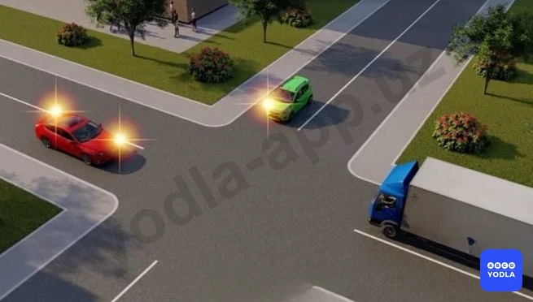

⬜ A. Красный автомобиль
✅ B. Синий автомобиль
⬜ C. Зеленый автомобиль

> 💡 Пункта 105 главы 16 ПДД, гласит: На перекрестке равнозначных дорог водитель безрельсового транспортного средства обязан уступить дорогу транспортным средствам, приближающимся справа.

---

## Вопрос 4

**B каком ответе правильно указана очередность проезда перекрестка?**

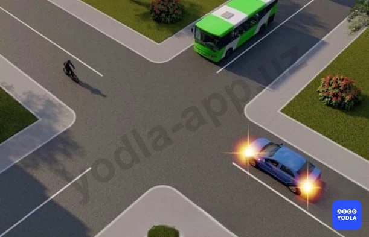

⬜ A. Автобус, автомобиль, велосипед
⬜ B. Автомобиль, автобус, велосипед
✅ C. Велосипед, автобус, автомобиль

> 💡 YHQ 16-bobi 104, 106-bandlariga asosan, teng ahamiyatga ega bo‘lmagan yo‘llar kesishgan chorrahada, keyingi harakat yo‘nalishidan qat'i nazar, asosiy yo‘ldan kelayotgan transport vositasiga ikkinchi darajali yo‘ldan kelayotgan transport vositasining haydovchisi yo‘l berishi kerak. YHQ 16-bobi 107 bandiga asosan, chapga burilishda yoki qayrilib olishda relssiz transport vositasining haydovchisi teng ahamiyatli yo‘ldan qarama-qarshi yo‘nalishdan to‘g‘riga yoki o‘ngga harakatlanayotgan, shuningdek, ruxsat etilgan hollarda quvib o‘tayotgan transport vositalariga yo‘l berishi shart. Bu qoidaga tramvay haydovchilari ham o‘zaro amal qilishlari kerak.

---

## Вопрос 5

**Водитель какого транспортного средства должен уступить дорогу?**

⬜ A. Водитель велосипеда
✅ B. Водитель автомобиля

> 💡 При торможении автомобиля под действием силы инерции происходит перераспределение массы по осям. Нагрузка на переднюю ось увеличивается, а на заднюю уменьшается.
Перераспределение массы тем значительнее, чем выше интенсивность торможения. При уменьшении нагрузки на заднюю ось уменьшается сила, прижимающая колеса к дороге; следовательно, появляется вероятность проскальзывания колес (торможение «юзом») и заноса автомобиля. Увеличение нагрузки на переднюю ось приводит к увеличению силы, прижимающей передние колеса к дороге, следовательно, вероятность их проскальзывания снижается.

---

## Вопрос 6

**Водитель какого транспортного средства имеет право на первоочередное движение?**

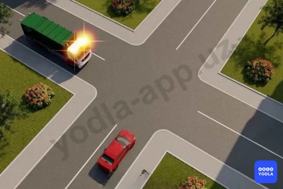

⬜ A. Водитель дорожной машины
✅ B. Водитель легкового автомобиля

> 💡 Согласно пункту 105 главы 16 ПДД, на перекрестке равнозначных дорог водитель безрельсового транспортного средства обязан уступить дорогу транспортным средствам, приближающимся справа. Согласно пункту 28 главы 6 ПДД, Проблесковый маячок жёлтого или оранжевого цвета не дает приоритета в движении и служит исключительно для предупреждения других участников движения об опасности.

---

## Вопрос 7

**Автомобили проедут перекресток в следующем порядке:**

⬜ A. Красный, зеленый, синий
⬜ B. Синий, красный, зеленый
✅ C. Все три одновременно

> 💡 Согласно пункту 105 главы 16 ПДД на перекрестке равнозначных дорог водитель безрельсового транспортного средства обязан уступить дорогу транспортным средствам, приближающимся справа.

---

## Вопрос 8

**Вторым проедет перекресток:**

⬜ A. Красный автомобиль
✅ B. Синий автомобиль
⬜ C. Зеленый автомобиль

> 💡 Согласно пункту 105 главы 16 ПДД на перекрестке равнозначных дорог водитель безрельсового транспортного средства обязан уступить дорогу транспортным средствам, приближающимся справа.

---

## Вопрос 9

**Последним проедет перекресток:**

⬜ A. Зеленый автомобиль
⬜ B. Синий автомобиль
✅ C. Красный автомобиль

> 💡 Согласно пункту 105 главы 16 ПДД на перекрестке равнозначных дорог водитель безрельсового транспортного средства обязан уступить дорогу транспортным средствам, приближающимся справа.

---

## Вопрос 10

**Пересечет перекресток первым:**

⬜ A. Красный автомобиль
⬜ B. Зеленый автомобиль
✅ C. Синий автомобиль

> 💡 Согласно пункту 105 главы 16 ПДД на перекрестке равнозначных дорог водитель безрельсового транспортного средства обязан уступить дорогу транспортным средствам, приближающимся справа.

---

## Вопрос 11

**Водитель какого транспортного средства должен уступить дорогу?**

✅ A. Водитель автобуса
⬜ B. Водитель мотоцикла

> 💡 Согласно пункту 105 главы 16 ПДД на перекрестке равнозначных дорог водитель безрельсового транспортного средства обязан уступить дорогу транспортным средствам, приближающимся справа.

---

## Вопрос 12

**Вторым проедет перекресток:**

✅ A. Синий автомобиль
⬜ B. Зеленый автомобиль
⬜ C. Красный автомобиль

> 💡 Согласно пункту 105 главы 16 ПДД на перекрестке равнозначных дорог водитель безрельсового транспортного средства обязан уступить дорогу транспортным средствам, приближающимся справа.

---

## Вопрос 13

**В каком ответе правильно указана последовательность действий водителя автомобиля?**

⬜ A. Пропустил мотоцикл и развернулся на перекрестке
⬜ B. Пропустил трамвай и развернулся на перекрестке
✅ C. Пропустил трамвай, мотоцикл и развернулся на перекрестке

> 💡 Согласно пункту 105 главы 16 ПДД, на перекрестке равнозначных дорог трамвай имеет право на приоритет движения перед безрельсовыми транспортными средствами, независимо от направления его движения. Согласно пункту 107 главы 16 ПДД, повороте налево или развороте водитель безрельсового транспортного средства обязан уступить дорогу транспортным средствам, движущимся по равнозначной дороге со встречного направления прямо или направо.

---

## Вопрос 14

**Автомобили проедут перекресток в следующем порядке:**

✅ A. Желтый въедет на перекресток и остановится, чтобы пропустить синий; зеленый; синий одновременно с красным; желтый
⬜ B. Синий одновременно с красным; зеленый; желтый
⬜ C. Зеленый; синий одновременно с красным; желтый

> 💡 Согласно пункту 105 главы 16 ПДД, на перекрестке равнозначных дорог водитель безрельсового транспортного средства обязан уступить дорогу транспортным средствам, приближающимся справа. Согласно пункту 107 главы 16 ПДД, повороте налево или развороте водитель безрельсового транспортного средства обязан уступить дорогу транспортным средствам, движущимся по равнозначной дороге со встречного направления прямо или направо.

---

## Вопрос 15

**Последний, кто пересек перекресток:**

✅ A. желтый
⬜ B. Cиний
⬜ C. Зеленым

> 💡 Согласно пункту 105 главы 16 ПДД на перекрестке равнозначных дорог водитель безрельсового транспортного средства обязан уступить дорогу транспортным средствам, приближающимся справа.

---

## Вопрос 16

**Автомобили проедут перекресток в следующем порядке:**

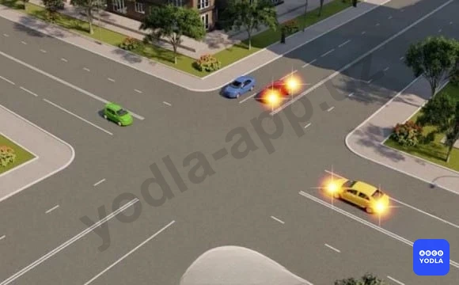

⬜ A. Желтый выедет на перекресток и остановится, чтобы пропустить зеленый; синий одновременно с красным
⬜ B. Синий одновременно с красным; зеленый, желтый
✅ C. Зеленый, синий одновременно с красным, желтый

> 💡 Согласно пункту 105 главы 16 ПДД на перекрестке равнозначных дорог водитель безрельсового транспортного средства обязан уступить дорогу транспортным средствам, приближающимся справа.

---

## Вопрос 17

**Автомобили проедут перекресток в следующем порядке:**

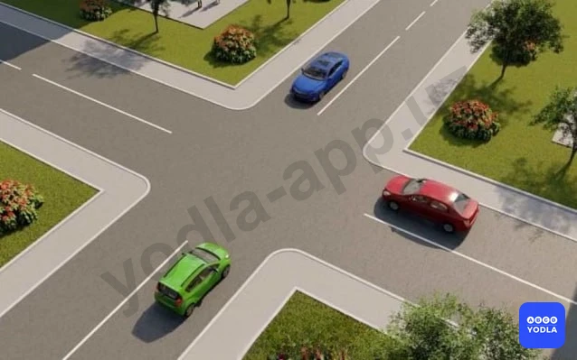

⬜ A. Зеленый; синий; красный
✅ B. Синий; красный; зеленый
⬜ C. Синий одновременно с зеленым; красный

> 💡 Согласно пункту 105 главы 16 ПДД на перекрестке равнозначных дорог водитель безрельсового транспортного средства обязан уступить дорогу транспортным средствам, приближающимся справа.

---

## Вопрос 18

**Автомобили проедут перекресток в следующем порядке:**

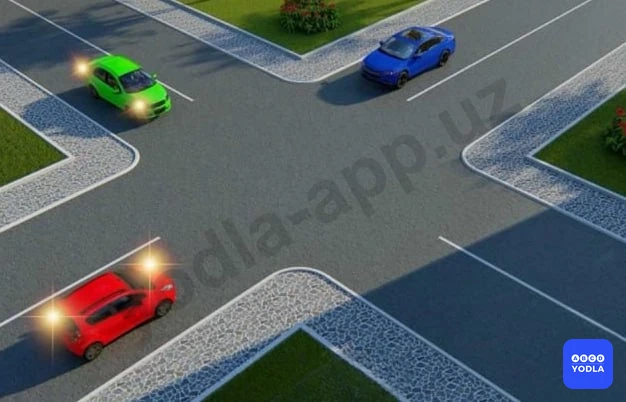

✅ A. Красный выедет на перекресток и остановится, чтобы пропустить синий, и одновременно с красным проедет зеленый; синий; красный закончит разворот
⬜ B. Красный, синий, зеленый
⬜ C. Синий, зеленый, красный

> 💡 Согласно пункту 105 главы 16 ПДД, на перекрестке равнозначных дорог водитель безрельсового транспортного средства обязан уступить дорогу транспортным средствам, приближающимся справа. Согласно пункту 107 главы 16 ПДД, повороте налево или развороте водитель безрельсового транспортного средства обязан уступить дорогу транспортным средствам, движущимся по равнозначной дороге со встречного направления прямо или направо.

---

## Вопрос 19

**Третьим проедет перекресток:**

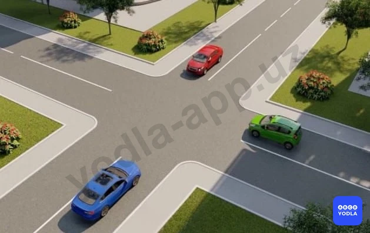

⬜ A. Зеленый автомобиль
✅ B. Синий автомобиль
⬜ C. Красный автомобиль

> 💡 Согласно пункту 105 главы 16 ПДД на перекрестке равнозначных дорог водитель безрельсового транспортного средства обязан уступить дорогу транспортным средствам, приближающимся справа.

---

## Вопрос 20

**Водитель какого транспортного средства имеет право на первоочередное движение?**

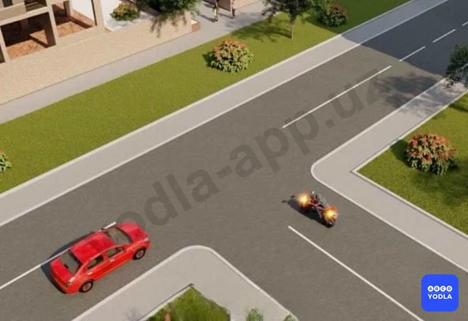

⬜ A. Водитель автомобиля
✅ B. Водитель мотоцикла

> 💡 Согласно пункту 105 главы 16 ПДД на перекрестке равнозначных дорог водитель безрельсового транспортного средства обязан уступить дорогу транспортным средствам, приближающимся справа.

---

## Вопрос 21

**Транспортные средства проедут перекресток следующем порядке:**

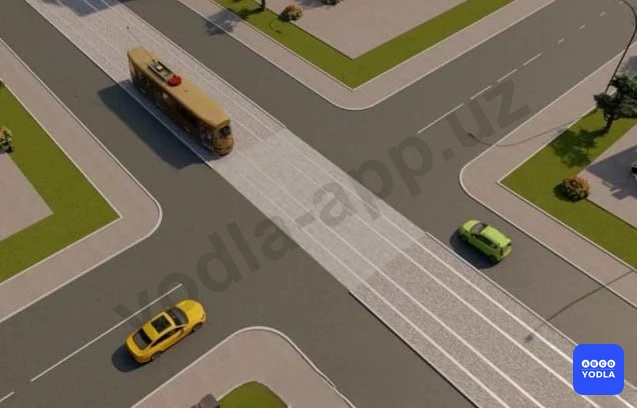

⬜ A. Трамвай, желтый, зеленый автомобили
✅ B. Трамвай и зеленый автомобиль, желтый автомобиль
⬜ C. Зеленый, желтый автомобили, трамвай

> 💡 Согласно пункту 105 главы 16 ПДД, на перекрестке равнозначных дорог водитель безрельсового транспортного средства обязан уступить дорогу транспортным средствам, приближающимся справа. На таких перекрестках трамвай имеет право на первоочередное движение перед безрельсовыми транспортными средствами независимо от направления его движения.

---

## Вопрос 22

**Кто из водителей имеет право напервоочередное движение?**

⬜ A. Водитель мотоцикла
✅ B. Водитель автомобиля

> 💡 Согласно пункту 105 главы 16 ПДД на перекрестке равнозначных дорог водитель безрельсового транспортного средства обязан уступить дорогу транспортным средствам, приближающимся справа.

---

## Вопрос 23

**Водитель какого транспортного средства должен уступить дорогу?**

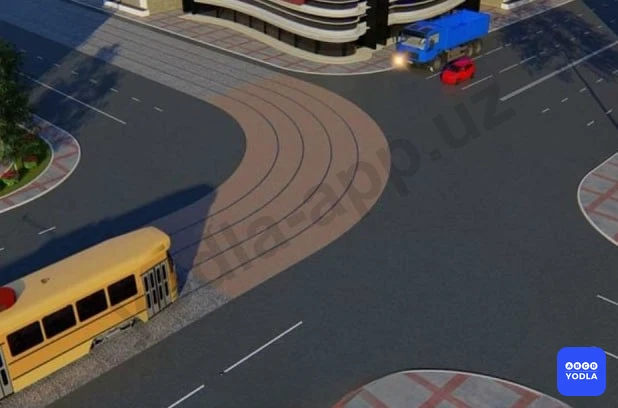

⬜ A. Водитель трамвая
⬜ B. Водитель грузового автомобиля
✅ C. Водители обоих автомобилей

> 💡 Согласно пункту 105 главы 16 ПДД, на перекрестке равнозначных дорог водитель безрельсового транспортного средства обязан уступить дорогу транспортным средствам, приближающимся справа. Этим же правилом должны руководствоваться между собой водители трамваев. На таких перекрестках трамвай имеет право на приоритет движения перед безрельсовыми транспортными средствами, независимо от направления его движения.

---

## Вопрос 24

**Водитель какого транспортного средства должен уступить дорогу?**

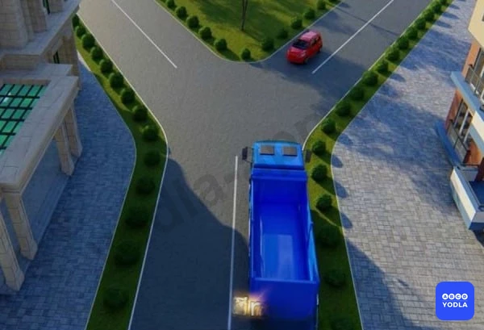

✅ A. Водитель синего автомобиля
⬜ B. Водитель красного автомобиля

> 💡 Согласно пункту 105 главы 16 ПДД на перекрестке равнозначных дорог водитель безрельсового транспортного средства обязан уступить дорогу транспортным средствам, приближающимся справа.

---

## Вопрос 25

**Водитель какого транспортного средства должен уступить дорогу?**

✅ A. Водитель автомобиля
⬜ B. Водитель трамвая

> 💡 Согласно пункту 105 главы 16 ПДД, на перекрестке равнозначных дорог водитель безрельсового транспортного средства обязан уступить дорогу транспортным средствам, приближающимся справа. На таких перекрестках трамвай имеет право на приоритет движения перед безрельсовыми транспортными средствами, независимо от направления его движения.

---

## Вопрос 26

**Синий автомобиль проедет перекресток:**

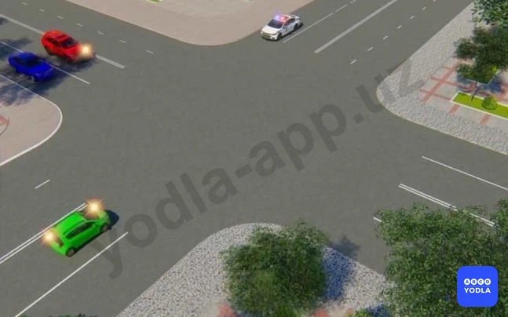

⬜ A. Первым одновременно с красным
⬜ B. Вторым одновременно с красным
✅ C. Третьим одновременно с красным

> 💡 Согласно пунктам 105 и 26 глав 16 и 6 ПДД, на перекрестке равнозначных дорог водитель безрельсового транспортного средства обязан уступить дорогу транспортным средствам, приближающимся справа. При приближении транспортных средств с включенными проблесковым маячком синего цвета или синего и красного цветов и специальным звуковым сигналом, а также сопровождаемых ими транспортных средств с включенным ближним светом фар водители обязаны уступить им дорогу для обеспечения их беспрепятственного проезда.

---

## Вопрос 27

**Транспортные средства проедут перекресток следующем порядке:**

✅ A. Все одновременно
⬜ B. Синий, красный, зеленый
⬜ C. Синий одновременно с зеленым, красный
⬜ D. Красный с зеленым, синий

> 💡 Согласно пункту 105 главы 16 ПДД на перекрестке равнозначных дорог водитель безрельсового транспортного средства обязан уступить дорогу транспортным средствам, приближающимся справа.

---

## Вопрос 28

**Последним проедет перекресток:**

✅ A. Синий автомобиль
⬜ B. Зеленый автомобиль
⬜ C. Красный автомобиль

> 💡 Согласно пункту 105 главы 16 ПДД на перекрестке равнозначных дорог водитель безрельсового транспортного средства обязан уступить дорогу транспортным средствам, приближающимся справа.

---

## Вопрос 29

**Автомобили проедут перекресток в следующем порядке:**

⬜ A. Желтый въедет на перекресток и останавливается, чтобы пропустить зеленый, зеленый, синий одновременно красный, желтый
⬜ B. Синий одновременно с красным, зеленый, желтый
✅ C. Зеленый, синий одновременно с красным, желтый

> 💡 Согласно пункту 105 главы 16 ПДД на перекрестке равнозначных дорог водитель безрельсового транспортного средства обязан уступить дорогу транспортным средствам, приближающимся справа.

---

## Вопрос 30

**Последним проедет перекресток:**

✅ A. Красный автомобиль
⬜ B. Синий автомобиль
⬜ C. Зеленый автомобиль

> 💡 Согласно пункту 105 главы 16 ПДД, на перекрестке равнозначных дорог водитель безрельсового транспортного средства обязан уступить дорогу транспортным средствам, приближающимся справа. Согласно пункту 107 главы 16 ПДД, повороте налево или развороте водитель безрельсового транспортного средства обязан уступить дорогу транспортным средствам, движущимся по равнозначной дороге со встречного направления прямо или направо.

---

## Вопрос 31

**Вторым проедет перекресток:**

⬜ A. Зеленый автомобиль
✅ B. Красный автомобиль одновременно с синим
⬜ C. Желтый автомобиль

---

## Вопрос 32

**Вторым проедет перекресток:**

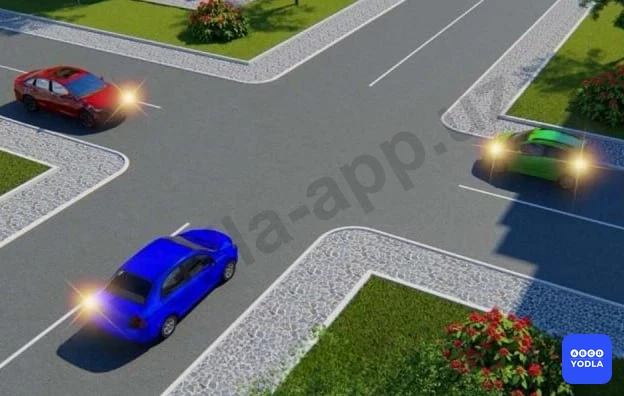

✅ A. Синий автомобиль
⬜ B. Зеленый автомобиль
⬜ C. Красный автомобиль

> 💡 Согласно пункту 105 главы 16 ПДД на перекрестке равнозначных дорог водитель безрельсового транспортного средства обязан уступить дорогу транспортным средствам, приближающимся справа.

---

## Вопрос 33

**Автомобили проедут перекресток в следующем порядке:**

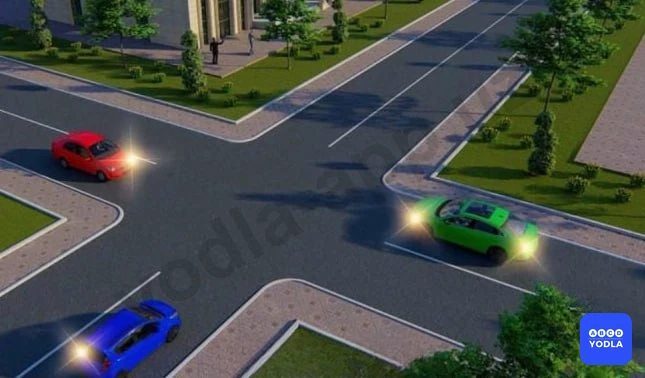

⬜ A. Красный, синий, зеленый
✅ B. Зеленый, синий, красный
⬜ C. Зеленый одновременно с красным, синий

> 💡 Согласно пункту 105 главы 16 ПДД на перекрестке равнозначных дорог водитель безрельсового транспортного средства обязан уступить дорогу транспортным средствам, приближающимся справа.

---

## Вопрос 34

**Первым проедет перекресток:**

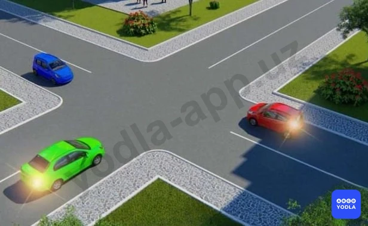

✅ A. Зеленый
⬜ B. Красный
⬜ C. Синий

> 💡 Согласно пункту 105 главы 16 ПДД на перекрестке равнозначных дорог водитель безрельсового транспортного средства обязан уступить дорогу транспортным средствам, приближающимся справа.

---

## Вопрос 35

**Красный автомобиль проедет перекресток:**

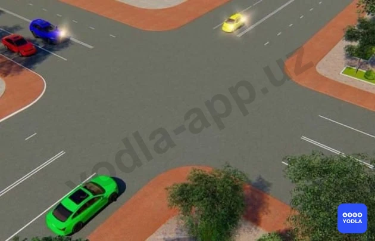

✅ A. Вторым, одновременно е синим
⬜ B. Вторым, после желтого
⬜ C. Третьим, после зеленого и желтого

> 💡 Согласно пункту 105 главы 16 ПДД на перекрестке равнозначных дорог водитель безрельсового транспортного средства обязан уступить дорогу транспортным средствам, приближающимся справа.

---

## Вопрос 36

**Автомобили проедут перекресток в следующем порядке:**

✅ A. Красный въедет на перекресток и остановится чтобы пропустить синий; зеленый; синий и красный заканчивают поворот
⬜ B. Зеленый, синий, красный
⬜ C. Красный, синий, зеленый

> 💡 Согласно пункту 105 главы 16 ПДД, на перекрестке равнозначных дорог водитель безрельсового транспортного средства обязан уступить дорогу транспортным средствам, приближающимся справа. Согласно пункту 107 главы 16 ПДД, повороте налево или развороте водитель безрельсового транспортного средства обязан уступить дорогу транспортным средствам, движущимся по равнозначной дороге со встречного направления прямо или направо.

---

## Вопрос 37

**В каком ответе правильно указана очередность проезда?**

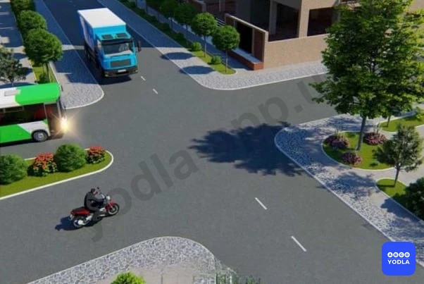

✅ A. Мотоцикл, автобус, грузовой автомобиль
⬜ B. Автобус, мотоцикл, грузовой автомобиль
⬜ C. Автобус, грузовой автомобиль, мотоцикл

> 💡 Согласно пункту 105 главы 16 ПДД на перекрестке равнозначных дорог водитель безрельсового транспортного средства обязан уступить дорогу транспортным средствам, приближающимся справа.

---

## Вопрос 38

**Транспортные средства проедут перекресток следующем порядке:**

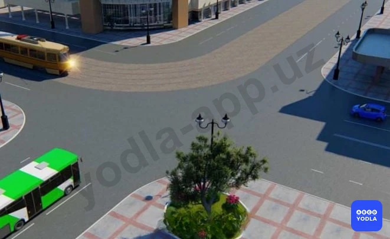

⬜ A. Легковой автомобиль, автобус, трамвай
⬜ B. Трамвай, автобус, легковой автомобиль
✅ C. Трамвай, легковой автомобиль, автобус

> 💡 Согласно пункту 105 главы 16 ПДД на перекрестке равнозначных дорог водитель безрельсового транспортного средства обязан уступить дорогу транспортным средствам, приближающимся справа. На таких перекрестках трамвай имеет право на приоритет движения перед безрельсовыми транспортными средствами, независимо от направления его движения.

---

## Вопрос 39

**Кто первым пересекает перекресток?**

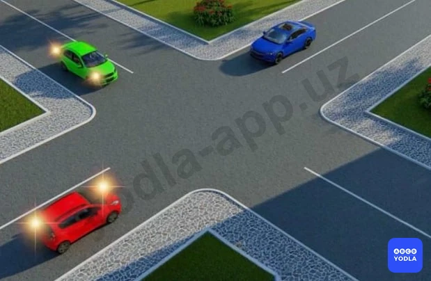

✅ A. Зеленый автомобиль
⬜ B. Красный автомобиль
⬜ C. Синий автомобиль

> 💡 Согласно пункту 104 главы 16 ПДД, на перекрестках неравнозначных дорог водитель транспортного средства, движущегося по второстепенной дороге, должен уступить дорогу транспортным средствам, приближающимся по главной дороге, независимо от направления их дальнейшего движения. Согласно пункту 107 главы 16 ПДД, при повороте налево или развороте водитель безрельсового транспортного средства обязан уступить дорогу транспортным средствам, движущимся по равнозначной дороге со встречного направления прямо или направо.

---

## Вопрос 40

**Водитель какого транспортного средства должен уступить дорогу?**

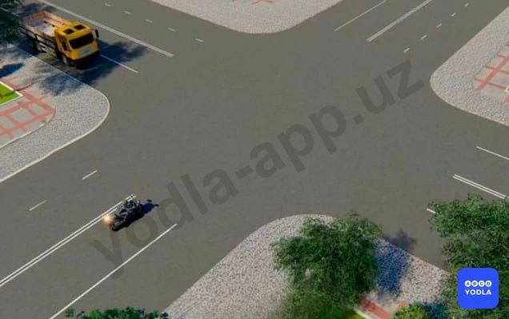

⬜ A. Водитель мотоцикла
✅ B. Водитель грузового автомобиля

> 💡 Согласно пункту 105 главы 16 ПДД на перекрестке равнозначных дорог водитель безрельсового транспортного средства обязан уступить дорогу транспортным средствам, приближающимся справа.

---

## Вопрос 41

**Вы намерены проехать перекресток в прямом направлении. Ваши действия?**

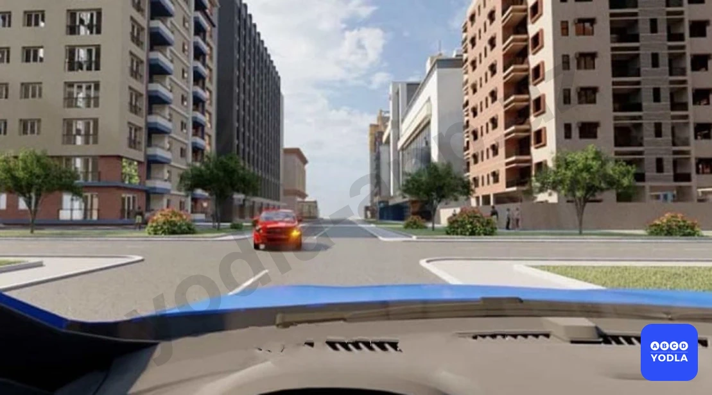

⬜ A. Уступите дорогу легковому автомобилю, поскольку онпервым въехал на перекресток
✅ B. Убедитесь, что легковой автомобиль уступает дорогу, и проедете перекресток первым

> 💡 Дорожная разметка 1.21 раздела 1 приложения № 2 к ПДД, (надпись «STOP») — предупреждает о приближении к разметке 1.12, когда она применяется в сочетании со знаком 2.5.

---

## Вопрос 42

**Какой автомобиль должен уступить дорогу на перекрестке?**

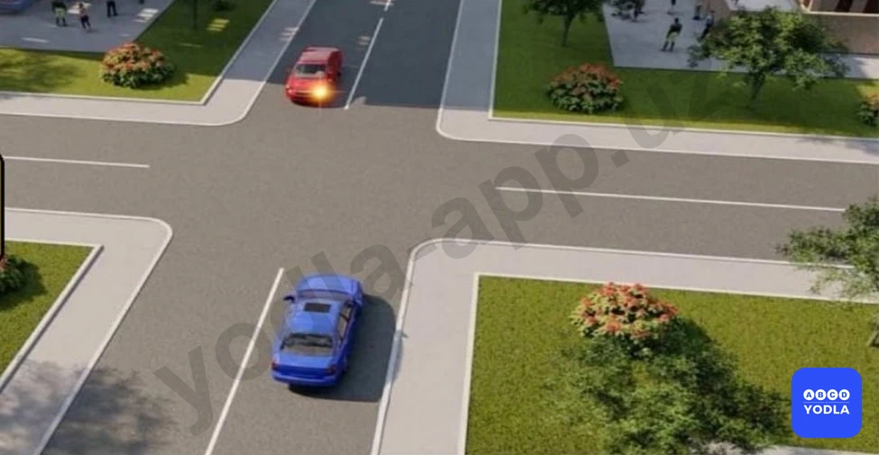

⬜ A. Синий автомобиль
✅ B. Красный автомобиль

> 💡 Согласно знаку 1.34 раздела 1 приложения № 1 к ПДД, «Внимание, управляемое препятствие», знак устанавливается перед железнодорожным переездом, оборудованным заградительным устройством, и предупреждает водителей транспортных средств о наличии заградительного устройства.

---

## Вопрос 43

**Красный автомобиль проедет перекрёсток?**

✅ A. Последним
⬜ B. Вторым.
⬜ C. Первым

---

## Вопрос 44

**Последним проедет перекресток:**

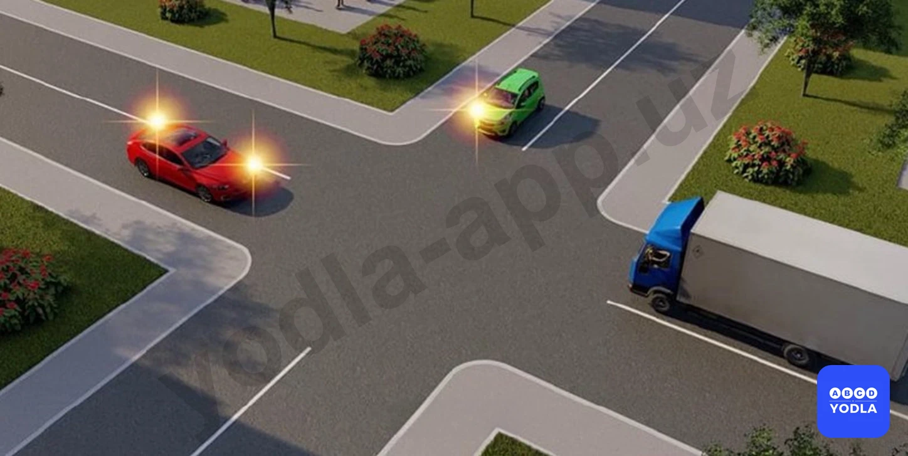

⬜ A. Синий автомобиль
✅ B. Красный автомобиль
⬜ C. Зеленый автомобиль

> 💡 Согласно пункту 105 Правил дорожного движения, на перекрестке равнозначных дорог водитель безрельсового транспортного средства обязан уступить дорогу транспортным средствам, приближающимся справа. Этим же правилом должны руководствоваться между собой водители трамваев. На таких перекрестках трамвай имеет право на приоритет движения перед безрельсовыми транспортными средствами, независимо от направления его движения.
Согласно пункту 107 Правил дорожного движения, при повороте налево или развороте водитель безрельсового транспортного средства обязан уступить дорогу транспортным средствам, движущимся по равнозначной дороге со встречного направления прямо или направо, а также производящим обгон в разрешенных случаях. Этим же правилом должны руководствоваться между собой водители трамваев.
На этом перекрестке , красный автомобиль начинает движение и останавливается на перекрестке, чтобы пропустить синий. Зеленый автомобиль пересекает перекресток первым, синий вторым, а красный автомобиль последним, завершая движение.

---

## Вопрос 45

**Последним проедет перекресток:**

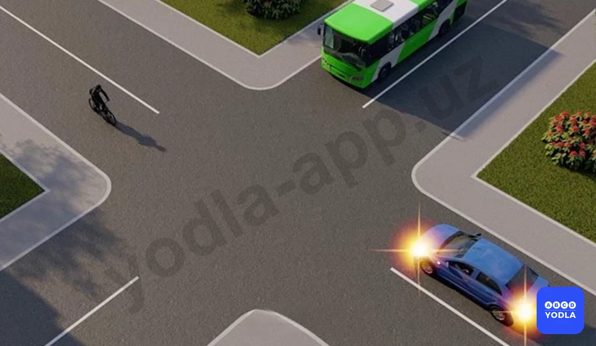

⬜ A. Велосипед
⬜ B. Автобус
✅ C. Автомобиль

> 💡 Приложение к ПДД №1: Знак 3.27 не действует на легковые немаршрутные такси при посадке высадке пассажиров (погрузке выгрузке грузов). Автомобили и мотоциклы с коляской, оборудованные опознавательным знаком “Инвалид” в соответствии с пунктом 176 настоящих Правил, управляемые инвалидами, могут отступать от требований знаков 3.2, 3.3 и 3.28. При наличии дополнительного знака 7.18 разрешается остановка в зоне действия знака 3.27. Знаки 3.28-3.30 не действуют на такси с включенным таксометром.

---

## Вопрос 46

**Первым проедет перекресток?**

✅ A. Зеленый автомобиль
⬜ B. Красный автомобиль
⬜ C. Синий автомобиль

> 💡 Пункта 48 главы 8 ПДД, гласит: Звуковые сигналы могут применяться в следующих случаях: вне населенных пунктов при обгоне, для предупреждения других водителей; в необходимых случаях для предотвращения дорожно-транспортного происшествия. Использование звуковых сигналов запрещено, за исключением случаев, указанных выше.

---

## Вопрос 47

**Первым проедет перекресток:**

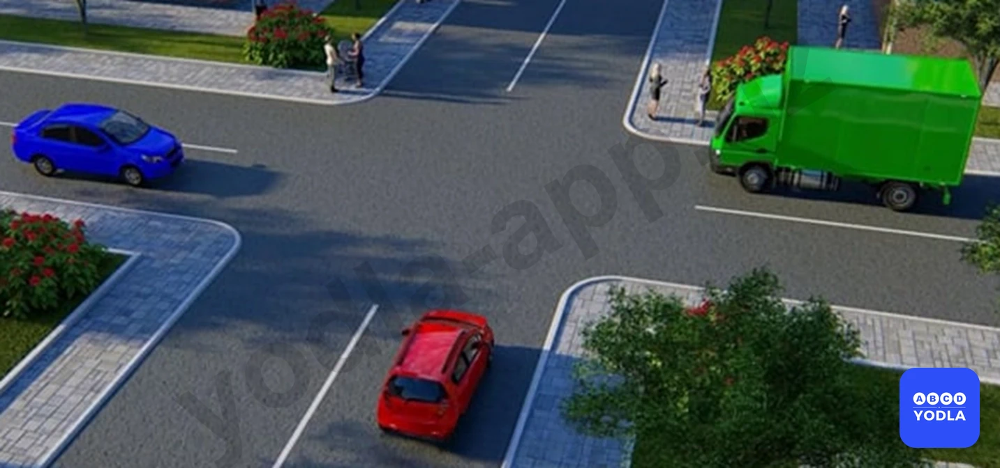

⬜ A. Красный автомобиль
⬜ B. Синий автомобиль
✅ C. Зеленый автомобиль

> 💡 Согласно пункту 100 Правил дорожного движения, при движении в направлении зеленой стрелки, включённой в дополнительной секции одновременно с жёлтым или красным сигналом светофора, водитель транспортного средства обязан уступить дорогу транспортным средствам, движущимся с других направлений.
Согласно пункту 101 Правил дорожного движения, если сигналы светофора или регулировщика разрешают движение одновременно трамваю и безрельсовым транспортным средствам, то трамвай имеет право на первоочередное движение, независимо от направления его движения. 
При движении в направлении стрелки, включенной в дополнительной секции одновременно с желтым или красным сигналом светофора, трамвай должен уступить дорогу транспортным средствам, движущимся с других направлений.

---

## Вопрос 48

**Какой водитель автомобиля должен уступить дорогу?**

✅ A. Красный автомобиль
⬜ B. Синий автомобиль

> 💡 "На основании пункта 38 главы 7 ПДД: 38. Сигналы регулировщика имеют следующие значения:
Руки вытянуты в стороны или опущены:
Правая рука вытянута вперед:
со стороны левого бока — разрешено движение трамваю налево, безрельсовым транспортным средствам — во всех направлениях."

---

## Вопрос 49

**Укажите порядок движения:**

✅ A. Трамвай 1 одновременно с жёлтым автомобилем, трамвай 2 одновременно с чёрным автомобилем
⬜ B. Трамвай 1 одновременно с жёлтым автомобилем, затем чёрный автомобиль, затем трамвай 2
⬜ C. Трамвай 1, трамвай 2, жёлтый автомобиль, чёрный автомобиль

> 💡 На основании пункта 57 главы 9 ПДД: 57. Поворот должен осуществляться таким образом, чтобы при выезде с пересечения проезжих частей транспортное средство не оказалось на стороне встречного движения.
При повороте направо транспортное средство должно двигаться по возможности ближе к правому краю проезжей части.

---

