# 26. Нерегулируемые перекрестки (изменение направления главной дороги) (боб 16.3)

Всего вопросов: 30

## Вопрос 1

**Транспортные средства проедут перекресток в следующем порядке:**

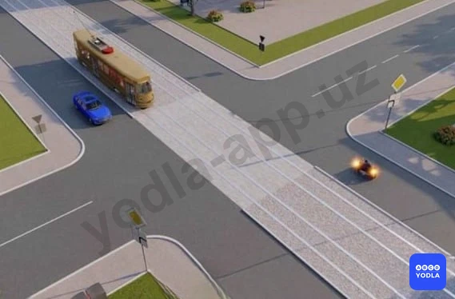

✅ A. Мотоцикл, трамвай и автомобиль
⬜ B. Трамвай, мотоцикл, автомобиль
⬜ C. Трамвай и автомобиль, мотоцикл

> 💡 Согласно пункту 104 главы 16 ПДД, на перекрестках неравнозначных дорог водитель транспортного средства, движущегося по второстепенной дороге, должен уступить дорогу транспортным средствам, приближающимся по главной дороге, независимо от направления их дальнейшего движения. На таких перекрестках трамвай имеет приоритет перед безрельсовыми транспортными средствами, движущимися в попутном или встречном направлении по равнозначной дороге, независимо от направления его движения.

---

## Вопрос 2

**Транспортные средства проедут перекресток в следующем порядке:**

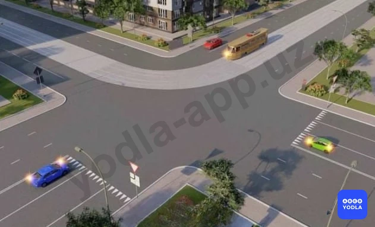

⬜ A. Красный автомобиль, трамвай, зеленый, синий автомобиль
⬜ B. Трамвай, красный, синий, зеленый автомобили
✅ C. Трамвай, красный, зеленый, синий автомобили

> 💡 Согласно пунктам 106, 105 и 104 главы 16 ПДД, если главная дорога на перекрестке меняет направление, водители, движущиеся по главной дороге, должны руководствоваться между собой правилами проезда перекрестков равнозначных дорог. На перекрестке равнозначных дорог водитель безрельсового транспортного средства обязан уступить дорогу транспортным средствам, приближающимся справа. На перекрестках неравнозначных дорог трамвай имеет приоритет перед безрельсовыми транспортными средствами, движущимися в попутном или встречном направлении по равнозначной дороге, независимо от направления его движения.

---

## Вопрос 3

**Вторым проедет перекресток:**

✅ A. Трамвай
⬜ B. Красный автомобиль
⬜ C. Синий автомобиль

> 💡 Согласно пунктам106, 105 и 104 главы 16 ПДД, если главная дорога на перекрестке меняет направление, водители, движущиеся по главной дороге, должны руководствоваться между собой правилами проезда перекрестков равнозначных дорог. На перекрестке равнозначных дорог водитель безрельсового транспортного средства обязан уступить дорогу транспортным средствам, приближающимся справа. На перекрестках неравнозначных дорог трамвай имеет приоритет перед безрельсовыми транспортными средствами, движущимися в попутном или встречном направлении по равнозначной дороге, независимо от направления его движения.

---

## Вопрос 4

**Третьим проедет перекресток:**

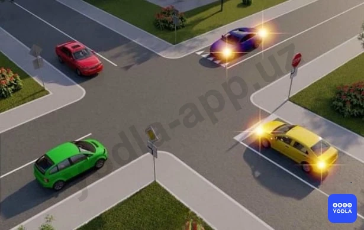

⬜ A. Зеленый автомобиль
⬜ B. Красный автомобиль
✅ C. Синий автомобиль
⬜ D. Желтый автомобиль

> 💡 Согласно пунктам 106, 105 и 104 главы 16 ПДД, если главная дорога на перекрестке меняет направление, водители, движущиеся по главной дороге, должны руководствоваться между собой правилами проезда перекрестков равнозначных дорог. На перекрестке равнозначных дорог водитель безрельсового транспортного средства обязан уступить дорогу транспортным средствам, приближающимся справа. На перекрестках неравнозначных дорог водитель транспортного средства, движущегося по второстепенной дороге, должен уступить дорогу транспортным средствам, приближающимся по главной дороге, независимо от направления их дальнейшего движения.

---

## Вопрос 5

**Автомобили проедут перекресток в следующем порядке:**

⬜ A. Синий, зеленый, красный
⬜ B. Синий одновременно с зеленым, красный
✅ C. Зеленый, красный одновременно с синим

> 💡 Согласно пунктам106, 105 и 104 главы 16 ПДД, если главная дорога на перекрестке меняет направление, водители, движущиеся по главной дороге, должны руководствоваться между собой правилами проезда перекрестков равнозначных дорог. На перекрестке равнозначных дорог водитель безрельсового транспортного средства обязан уступить дорогу транспортным средствам, приближающимся справа. На перекрестках неравнозначных дорог водитель транспортного средства, движущегося по второстепенной дороге, должен уступить дорогу транспортным средствам, приближающимся по главной дороге, независимо от направления их дальнейшего движения.

---

## Вопрос 6

**Транспортные средства проедут перекресток следующем порядке:**

✅ A. Мотоцикл, автомобиль, трамвай
⬜ B. Трамвай, автомобиль, мотоцикл
⬜ C. Трамвай, мотоцикл, автомобиль

> 💡 Согласно пунктам 106, 105 и 104 главы 16 ПДД, если главная дорога на перекрестке меняет направление, водители, движущиеся по главной дороге, должны руководствоваться между собой правилами проезда перекрестков равнозначных дорог. На перекрестке равнозначных дорог водитель безрельсового транспортного средства обязан уступить дорогу транспортным средствам, приближающимся справа. На перекрестках неравнозначных дорог трамвай имеет приоритет перед безрельсовыми транспортными средствами, движущимися в попутном или встречном направлении по равнозначной дороге, независимо от направления его движения.

---

## Вопрос 7

**Какой автомобиль последним проедет перекресток?**

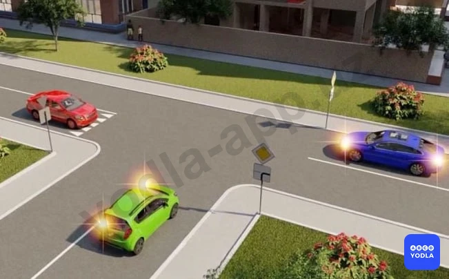

⬜ A. Синий
✅ B. Красный
⬜ C. Зеленый

> 💡 Согласно пунктам 106, 105 и 104 главы 16 ПДД, если главная дорога на перекрестке меняет направление, водители, движущиеся по главной дороге, должны руководствоваться между собой правилами проезда перекрестков равнозначных дорог. На перекрестке равнозначных дорог водитель безрельсового транспортного средства обязан уступить дорогу транспортным средствам, приближающимся справа. На перекрестках неравнозначных дорог водитель транспортного средства, движущегося по второстепенной дороге, должен уступить дорогу транспортным средствам, приближающимся по главной дороге, независимо от направления их дальнейшего движения.

---

## Вопрос 8

**Транспортные средства проедут перекресток в следующем порядке:**

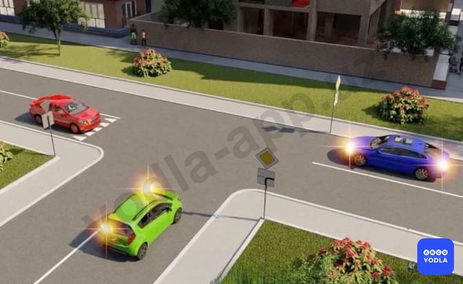

✅ A. Синий, зеленый, красный автомобили
⬜ B. Синий, пропустит красный, а затем закончит поворот; зеленый автомобиль
⬜ C. Красный, синий, зеленый автомобили
⬜ D. Зеленый, красный, синий автомобили

> 💡 Согласно пунктам106, 105 и 104 главы 16 ПДД, если главная дорога на перекрестке меняет направление, водители, движущиеся по главной дороге, должны руководствоваться между собой правилами проезда перекрестков равнозначных дорог. На перекрестке равнозначных дорог водитель безрельсового транспортного средства обязан уступить дорогу транспортным средствам, приближающимся справа. На перекрестках неравнозначных дорог водитель транспортного средства, движущегося по второстепенной дороге, должен уступить дорогу транспортным средствам, приближающимся по главной дороге, независимо от направления их дальнейшего движения.

---

## Вопрос 9

**Вторым проедет перекресток:**

⬜ A. Красный автомобиль
✅ B. Зеленый автомобиль
⬜ C. Синий автомобиль

> 💡 Согласно пунктам 106, 105 и 104 главы 16 ПДД, если главная дорога на перекрестке меняет направление, водители, движущиеся по главной дороге, должны руководствоваться между собой правилами проезда перекрестков равнозначных дорог. На перекрестке равнозначных дорог водитель безрельсового транспортного средства обязан уступить дорогу транспортным средствам, приближающимся справа. На перекрестках неравнозначных дорог водитель транспортного средства, движущегося по второстепенной дороге, должен уступить дорогу транспортным средствам, приближающимся по главной дороге, независимо от направления их дальнейшего движения.

---

## Вопрос 10

**В каком порядке проедут перекресток транспортные средства?**

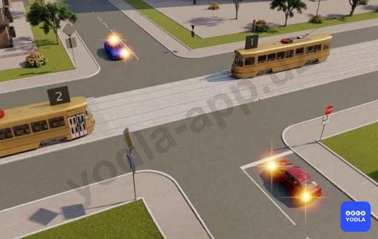

⬜ A. Трамвай 2 одновременно с трамваем 1, синий автомобиль одновременно с красным
✅ B. Трамвай 2; синий автомобиль; трамвай 1; красный автомобиль

> 💡 Согласно пунктам 106, 105 и 104 главы 16 ПДД, если главная дорога на перекрестке меняет направление, водители, движущиеся по главной дороге, должны руководствоваться между собой правилами проезда перекрестков равнозначных дорог. На перекрестке равнозначных дорог водитель безрельсового транспортного средства обязан уступить дорогу транспортным средствам, приближающимся справа. Этим же правилом должны руководствоваться между собой водители трамваев. На перекрестках неравнозначных дорог водитель транспортного средства, движущегося по второстепенной дороге, должен уступить дорогу транспортным средствам, приближающимся по главной дороге, независимо от направления их дальнейшего движения. На таких перекрестках трамвай имеет приоритет перед безрельсовыми транспортными средствами, движущимися в попутном или встречном направлении по равнозначной дороге, независимо от направления его движения.

---

## Вопрос 11

**Водитель какого транспортного средства имеет право на первоочередное движение?**

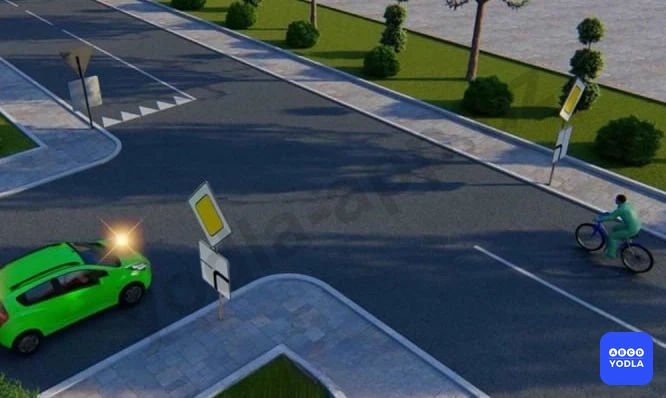

⬜ A. Водитель автомобиля
✅ B. Водитель велосипеда

> 💡 Пункт 104 главы 16 ПДД гласит: Если главная дорога на перекрестке меняет направление, водители, движущиеся по главной дороге, должны руководствоваться между собой правилами проезда перекрестков равнозначных дорог. Этим же правилом должны руководствоваться между собой и водители, движущиеся по второстепенным дорогам.

---

## Вопрос 12

**Синий автомобиль проедет перекресток:**

⬜ A. Первым
⬜ B. Вторым
⬜ C. Третьим
✅ D. Последним

> 💡 Пунктам 104, 106 главы 16 ПДД, на перекрестках неравнозначных дорог водитель транспортного средства, движущегося по второстепенной дороге, должен уступить дорогу транспортному средству, движущемуся по главной дороге, независимо от направления их дальнейшего движения. Если главная дорога на перекрестке меняет направление, водители, движущиеся по главной дороге, должны руководствоваться между собой правилами проезда перекрестков равнозначных дорог. Этим же правилом должны руководствоваться между собой и водители, движущиеся по второстепенным дорогам. Пункт 107 главы 16 ПДД, гласит: При повороте налево или развороте водитель безрельсового транспортного средства обязан уступить дорогу транспортным средствам, движущимся по равнозначной дороге со встречного направления прямо или направо, а также производящим обгон в разрешенных случаях. Этим же правилом должны руководствоваться между собой водители трамваев.

---

## Вопрос 13

**Вторым проедет перекресток:**

⬜ A. Зеленый автомобиль
✅ B. Красный автомобиль
⬜ C. Синий автомобиль
⬜ D. Желтый автомобиль

> 💡 Согласно пунктам 106, 105 и 104 главы 16 ПДД, если главная дорога на перекрестке меняет направление, водители, движущиеся по главной дороге, должны руководствоваться между собой правилами проезда перекрестков равнозначных дорог. На перекрестке равнозначных дорог водитель безрельсового транспортного средства обязан уступить дорогу транспортным средствам, приближающимся справа. На перекрестках неравнозначных дорог водитель транспортного средства, движущегося по второстепенной дороге, должен уступить дорогу транспортным средствам, приближающимся по главной дороге, независимо от направления их дальнейшего движения.

---

## Вопрос 14

**Транспортные средства проедут перекресток следующем порядке:**

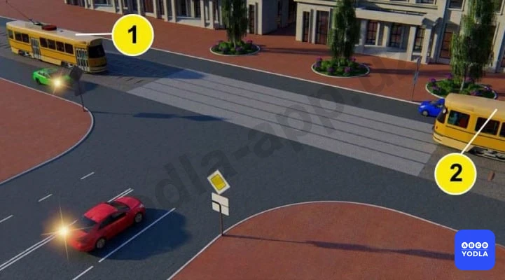

⬜ A. Трамваи 1 и 2 одновременно с зеленым автомобилем, красный, синий автомобили
✅ B. Трамвай 1 одновременно с зеленым автомобилем, красный автомобиль, трамвай 2, синий автомобиль

> 💡 Согласно пунктам 106, 105 и 104 главы 16 ПДД, если главная дорога на перекрестке меняет направление, водители, движущиеся по главной дороге, должны руководствоваться между собой правилами проезда перекрестков равнозначных дорог. На перекрестке равнозначных дорог водитель безрельсового транспортного средства обязан уступить дорогу транспортным средствам, приближающимся справа. Этим же правилом должны руководствоваться между собой водители трамваев. На перекрестках неравнозначных дорог водитель транспортного средства, движущегося по второстепенной дороге, должен уступить дорогу транспортным средствам, приближающимся по главной дороге, независимо от направления их дальнейшего движения. На таких перекрестках трамвай имеет приоритет перед безрельсовыми транспортными средствами, движущимися в попутном или встречном направлении по равнозначной дороге, независимо от направления его движения.

---

## Вопрос 15

**Транспортные средства проедут перекресток в следующем порядке:**

✅ A. Синий автомобиль, трамвай, красный автомобиль
⬜ B. Трамвай, красный, затем синий автомобили
⬜ C. Трамвай, синий автомобиль выйдет на перекресток, пропустит красный и завершит поворот

> 💡 Согласно пунктам 106, 105 и 104 главы 16 ПДД, если главная дорога на перекрестке меняет направление, водители, движущиеся по главной дороге, должны руководствоваться между собой правилами проезда перекрестков равнозначных дорог. На перекрестке равнозначных дорог водитель безрельсового транспортного средства обязан уступить дорогу транспортным средствам, приближающимся справа. На перекрестках неравнозначных дорог трамвай имеет приоритет перед безрельсовыми транспортными средствами, движущимися в попутном или встречном направлении по равнозначной дороге, независимо от направления его движения.

---

## Вопрос 16

**Транспортные средства проедут перекресток в следующем порядке:**

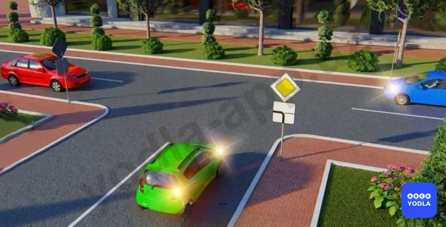

⬜ A. Синий и красный автомобили, зеленый
✅ B. Зеленый, красный, синий ,автомобили
⬜ C. Зеленый, красный и вместе с ним синий автомобиль

> 💡 Согласно пункту 104 главы 16 ПДД, на перекрестках неравнозначных дорог водитель транспортного средства, движущегося по второстепенной дороге, должен уступить дорогу транспортным средствам, приближающимся по главной дороге, независимо от направления их дальнейшего движения.

---

## Вопрос 17

**Красный автомобиль проедет перекресток:**

⬜ A. Первым
✅ B. Вторым
⬜ C. Последним

> 💡 Согласно пунктам 106, 105 и 104 главы 16 ПДД, если главная дорога на перекрестке меняет направление, водители, движущиеся по главной дороге, должны руководствоваться между собой правилами проезда перекрестков равнозначных дорог. На перекрестке равнозначных дорог водитель безрельсового транспортного средства обязан уступить дорогу транспортным средствам, приближающимся справа. На перекрестках неравнозначных дорог водитель транспортного средства, движущегося по второстепенной дороге, должен уступить дорогу транспортным средствам, приближающимся по главной дороге, независимо от направления их дальнейшего движения.

---

## Вопрос 18

**Вторым проедет перекресток:**

✅ A. Зеленый автомобиль
⬜ B. Синий автомобиль
⬜ C. Красный автомобиль

> 💡 Согласно пунктам 106, 105 и 104 главы 16 ПДД, если главная дорога на перекрестке меняет направление, водители, движущиеся по главной дороге, должны руководствоваться между собой правилами проезда перекрестков равнозначных дорог. На перекрестке равнозначных дорог водитель безрельсового транспортного средства обязан уступить дорогу транспортным средствам, приближающимся справа. На перекрестках неравнозначных дорог водитель транспортного средства, движущегося по второстепенной дороге, должен уступить дорогу транспортным средствам, приближающимся по главной дороге, независимо от направления их дальнейшего движения.

---

## Вопрос 19

**Вы намерены повернуть налево. Кому следует уступить дорогу?**

⬜ A. Только автобусу
⬜ B. Только легковому автомобилю
✅ C. Никому

> 💡 Согласно пункту 145 Правил дорожного движения, запрещается буксировка: в гололедицу, на скользкой дороге, на гибкой сцепке.

---

## Вопрос 20

**Какому транспортному средству следует уступить дорогу при повороте налево на перекрестке?**

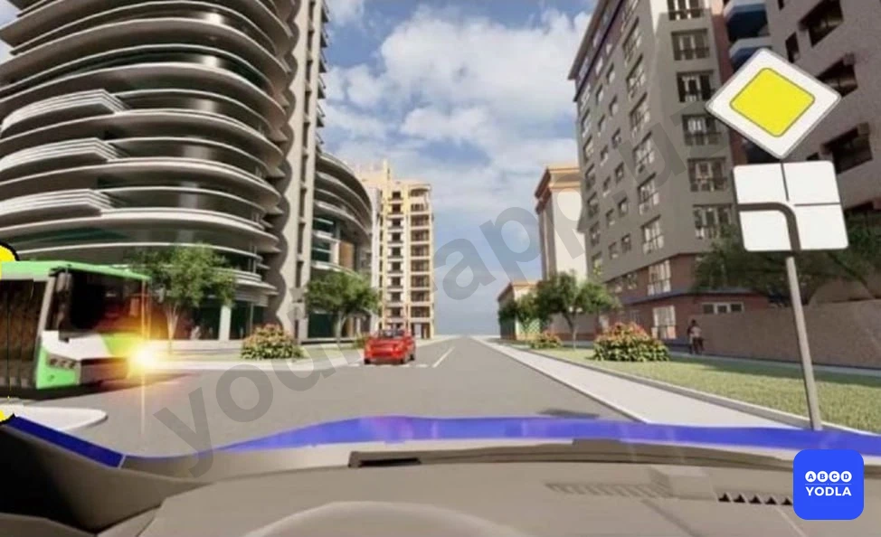

⬜ A. Автобусу
⬜ B. Лёгковому автомобилю
✅ C. Никому

> 💡 Согласно требованиям безопасности дорожного движения, способ вождения автомобиля с плавным ускорением и плавным замедлением позволяет экономить расход топлива.

---

## Вопрос 21

**Кому в этом случае должен уступить дорогу водитель синего автомобиля?**

⬜ A. Только автобусу
✅ B. Никому
⬜ C. Только легковому автомобилю

> 💡 Пункта 104 главы 16 ПДД, гласит: На перекрестках неравнозначных дорог водитель транспортного средства, движущегося по второстепенной дороге, должен уступить дорогу транспортным средствам, приближающимся по главной дороге, независимо от направления их дальнейшего движения. На таких перекрестках трамвай имеет приоритет перед безрельсовыми транспортными средствами, движущимися в попутном или встречном направлении по равнозначной дороге, независимо от направления его движения. Пункта 105 главы 16 ПДД, гласит: На перекрестке равнозначных дорог водитель безрельсового транспортного средства обязан уступить дорогу транспортным средствам, приближающимся справа. Этим же правилом должны руководствоваться между собой водители трамваев. На таких перекрестках трамвай имеет право на приоритет движения перед безрельсовыми транспортными средствами, независимо от направления его движения.

---

## Вопрос 22

**Кому водитель автобуса должен уступить дорогу на этом перекрестке?**

⬜ A. Никому
⬜ B. Красной машине
✅ C. Синей машине

> 💡 Согласно статьи 6 Правил дорожного движения, разделительная полоса — элемент дороги, разделяющий смежные проезжие части и не предназначенный для движения и остановки транспортных средств, приподнята над уровнем дороги или отделена газоном, канавой, специальными ограждениями.

---

## Вопрос 23

**Синий автомобиль проедет перекресток:**

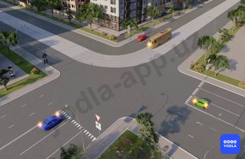

⬜ A. Первым
⬜ B. Вторым
✅ C. Последним

> 💡 Знак 2.3.3 раздела 2 приложения № 1 к ПДД, «Примыкание второстепенной дороги». 2.3.3 — примыкание слева. Дорожные знаки 2.3.1 — 2.3.3 устанавливаются в населенных пунктах на расстоянии 50 — 100 м, а вне населенных пунктов — на расстоянии 150 — 300 м до пересечения.

---

## Вопрос 24

**Желтый автомобиль проедет перекрёсток?**

⬜ A. Третьим
⬜ B. Вторым
✅ C. Последним

> 💡 Согласно пункту 2 статьи 43 Правил дорожного движения, в случае, если значение сигналов светофора противоречат требованиям дорожных знаков приоритета, водители должны руководствоваться сигналами светофора.

---

## Вопрос 25

**Вторым проедет перекресток:**

⬜ A. Трамвай
⬜ B. Мотоцикл
✅ C. Автомобиль

> 💡 Согласно пункту 105 Правил дорожного движения, на перекрестке равнозначных дорог водитель безрельсового транспортного средства обязан уступить дорогу транспортным средствам, приближающимся справа. Этим же правилом должны руководствоваться между собой водители трамваев. На таких перекрестках трамвай имеет право на приоритет движения перед безрельсовыми транспортными средствами, независимо от направления его движения.
Велосипед пересекает этот перекресток первым, автобус вторым, синий автомобиль последним.

---

## Вопрос 26

**Какой автомобиль проедет перекресток третьим?**

✅ A. Красный автомобиль
⬜ B. Зеленый автомобиль
⬜ C. Синий автомобиль

> 💡 ПДД общие положения: Разрешенная максимальная масса - максимальная масса (величина) снаряженного транспортного средства с грузом, водителем и пассажирами, установленная предприятием-изготовителем.

---

## Вопрос 27

**Вы хотите повернуть налево на перекрестке. Кому вы должны уступить дорогу?**

⬜ A. Микроавтобусу
✅ B. Трактору
⬜ C. Обоим транспортным средствам
⬜ D. Я имею право проезда первым

> 💡 ПДД приложение № 3: 7.22. Категория M1 – Транспортные средства, используемые для перевозки пассажиров и имеющие, помимо места водителя, не более восьми мест для сидения.

---

## Вопрос 28

**На каком рисунке водитель жёлтого автомобиля должен уступить дорогу красному автомобилю?**

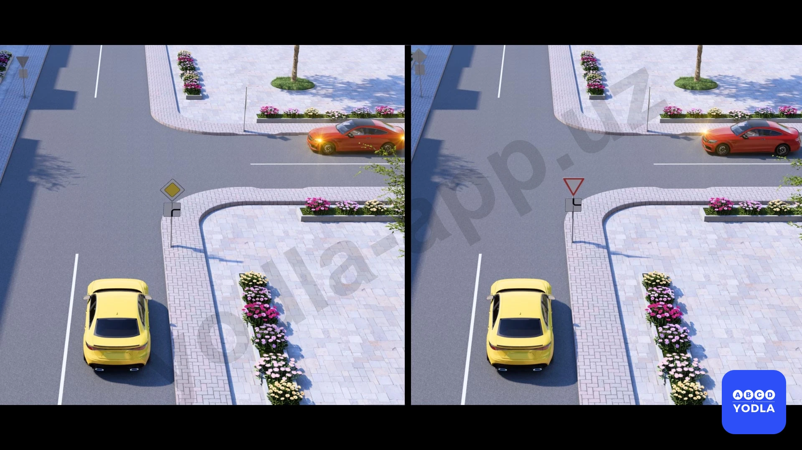

⬜ A. На первом рисунке
⬜ B. На втором рисунке
✅ C. На обоих рисунках

> 💡 "На основании абзаца 1 пункта 104 главы 16 ПДД и абзаца 7 пункта 6 главы 1 ПДД: 104. На перекрестках неравнозначных дорог водитель транспортного средства, движущегося по второстепенной дороге, должен уступить дорогу транспортным средствам, приближающимся по главной дороге, независимо от направления их дальнейшего движения.
Главная дорога — дорога с твердым покрытием (асфальт, цементобетон и аналогичные), по отношению к грунтовой или гравийной дороге, либо дорога, обозначенная дорожными знаками 2.1, 2.3.1 — 2.3.3 или 5.1, либо любая дорога по отношению к дороге, выезжающей с прилегающей территории. Покрытие примыкающей второстепенной дороги на перекрестке не делает ее равнозначной главной дороге."

---

## Вопрос 29

**Водитель какого автомобиля должен уступить дорогу?**

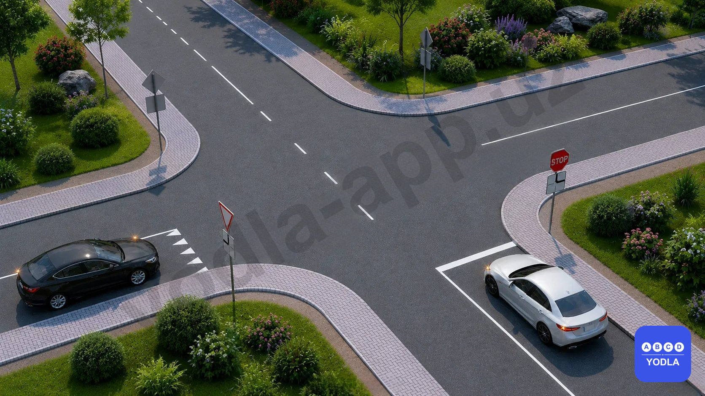

✅ A. Водитель чёрного автомобиля
⬜ B. Водитель белого автомобиля

> 💡 Согласно главе 16, пункту 105 (абзац 1) и пункту 106 Правил дорожного движения:

105. На перекрёстке равнозначных дорог водитель безрельсового транспортного средства обязан уступить дорогу транспортным средствам, приближающимся справа. Это правило также распространяется на взаимное движение трамваев.

106. Если направление главной дороги изменяется на перекрёстке, водители, движущиеся по главной дороге, должны руководствоваться правилами проезда перекрёстков равнозначных дорог. Водители, движущиеся по второстепенным дорогам также обязаны соблюдать это правило между собой.

---

## Вопрос 30

**Каким по счёту белый автомобиль проедет перекрёсток?**

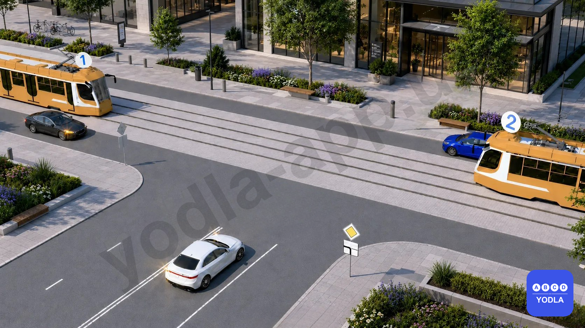

⬜ A. Первым
✅ B. Вторым
⬜ C. Третьим
⬜ D. Последним

> 💡 Согласно главе 16, пунктам 104, 105 и 106 Правил дорожного движения:

104. На перекрёстке неравнозначных дорог водитель, движущийся по второстепенной дороге, обязан уступить дорогу транспортным средствам, приближающимся по главной дороге, независимо от направления их дальнейшего движения. Трамвай имеет преимущество перед безрельсовыми транспортными средствами на равнозначной дороге.

105. На перекрёстке равнозначных дорог водитель безрельсового транспортного средства обязан уступить дорогу транспортному средству, приближающемуся справа.

106. Если направление главной дороги изменяется на перекрёстке, водители должны руководствоваться правилами проезда перекрёстков равнозначных дорог.

---

