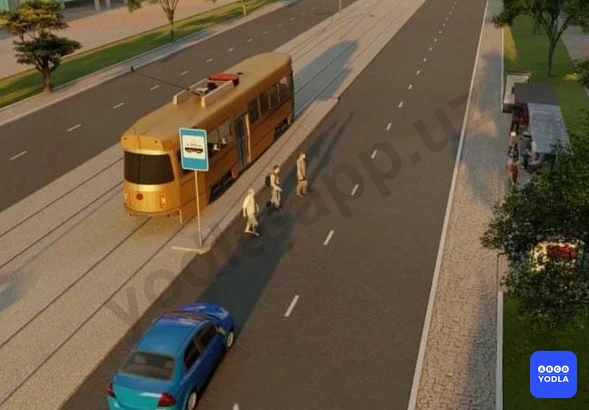
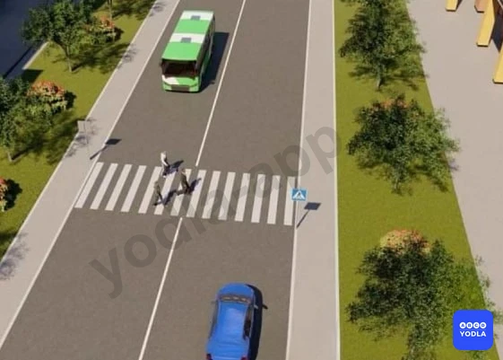
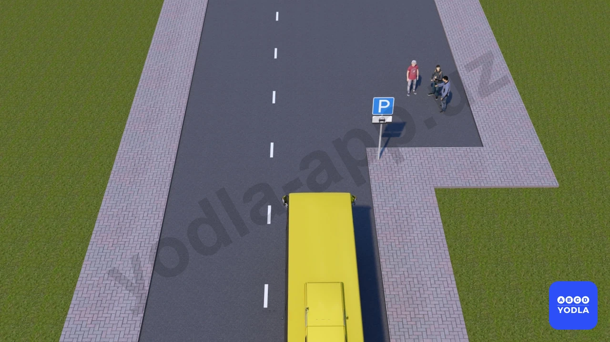

# 27. Пешеходные переходы и остановки маршрутных транспортных средств (боб 17)

Всего вопросов: 14

## Вопрос 1

**Должны ли водители маршрутных транспортных средств, движущихся по установленным маршрутам, пропускать слепых пешеходов, подающих сигнал белой тростью вне пешеходных переходов?**

✅ A. Должны во всех случаях
⬜ B. Не должны пропускать

> 💡 Согласно пункту 113 главы 17 ПДД, во всех случаях, в том числе и вне пешеходных переходов, водитель должен пропускать слепых пешеходов, подающих сигнал белой тростью.

---

## Вопрос 2

**Вы приближаетесь к нерегулируемому пешеходному переходу; перед которым остановилось транспортное средство. Вы должны:**

⬜ A. Проехать пешеходный переход безостановочно
⬜ B. Проехать пешеходный переход безостановочно, но с особой осторожностью
✅ C. Продолжить движение, лишь убедившись, что перед остановившимся транспортным средством нет пешеходов
⬜ D. Обязательно остановиться. При появлении пешеходов пропустить их

> 💡 Согласно пункту 110 главы 17 ПДД, если перед нерегулируемым пешеходным переходом транспортное средство замедлило движение или остановилось, то водители других транспортных средств, движущихся по соседним полосам, могут продолжать движение, лишь убедившись, что перед остановившимся транспортным средством нет пешеходов.

---

## Вопрос 3

**Как должен поступить водитель в ситуации; изображенной на рисунке?**

✅ A. Уступить дорогу пешеходам; идущим к стоящему на остановке (посередине дороги) трамваю попутного направления или от него
⬜ B. Остановиться и возобновить движение после того, как будут закрыты двери трамвая
⬜ C. Снизить скорость до предела; обеспечивающего при необходимости немедленную остановку; и продолжать движение

> 💡 Согласно пункту 114 главы 17 ПДД, водитель должен уступить дорогу пешеходам, идущим к дверям стоящего на остановке маршрутного транспортного средства или от него, если посадка и высадка производится с проезжей части или с посадочной площадки, расположенной на ней.

---

## Вопрос 4

**Как должен поступить водитель при проезде мимо трамвая попутного направления; стоящего на обозначенной остановке; расположений на середине дороги?**

⬜ A. Остановиться и возобновить движение только после того; как будут закрыты двери трамвая
✅ B. Уступить дорогу пешеходам, идущим к стоящему трамваю или от него

> 💡 Пункта 114 главы 17 ПДД гласит: Водитель должен уступить дорогу пешеходам, идущим к дверям стоящего на остановке маршрутного транспортного средства или от него, если посадка и высадка производится с проезжей части или с посадочной площадки, расположенной на ней.

---

## Вопрос 5

**Кто из водителей обязан остановиться?**

✅ A. Водитель легкового автомобиля
⬜ B. Водитель автобуса
⬜ C. Оба водителя

> 💡 Согласно пункту 109 главы 17 ПДД, водитель транспортного средства, приближающегося к нерегулируемому пешеходному переходу, обязан снизить скорость или остановиться, чтобы пропустить пешеходов, переходящих проезжую часть данного направления.

---

## Вопрос 6

**Когда можно выходить пешеходам на проезжую часть для посадки на трамвайных остановках; не оборудованных посадочными площадками?**

⬜ A. При приближении трамвая
✅ B. После полной остановки трамвая
⬜ C. В любом случае
⬜ D. При приближении трамвая; если на проезжей части нет транспортных средств

> 💡 Согласно пункту 22 главы 4 ПДД, в местах остановок маршрутных транспортных средств, не оборудованных приподнятыми посадочными площадками, разрешается выходить на проезжую часть для посадки в транспортное средство лишь после его остановки.

---

## Вопрос 7

**Что обязан сделать водитель; приближаясь к трамваю попутного направления; остановившемуся на остановке посередине дороги?**

⬜ A. Остановиться, затем продолжить движение после закрытия дверей
✅ B. Уступить дорогу пешеходам; идущим к стоящему на остановке посередине дороги трамваю попутного направления или от него
⬜ C. Проехать трамвайную остановку с особой осторожностью
⬜ D. Остановиться, затем продолжить движение после того; когда трамвай начнет движение

---

## Вопрос 8

**Как должен поступить водитель транспортного средства, если включился разрешающий сигнал светофора, а на проезжей части в направлении движения находятся пешеходы, не успевшие перейти дорогу?**

⬜ A. Снизить скорость, подать звуковой сигнал и проехать пешеходный переход на минимальной скорости
⬜ B. Подать звуковой сигнал и проехать пешеходный переход; не снижая скорости
✅ C. Дать возможность пешеходам закончить переход проезжей части данного направления
⬜ D. Проехать пешеходный переход; соблюдая меры предосторожности

> 💡 Согласно пункту 103 главы 15 ПДД, при включении разрешающего сигнала светофора водитель обязан уступить дорогу транспортным средствам, завершающим движение через перекресток, и пешеходам, не закончившим переход проезжей части данного направления.

---

## Вопрос 9

**Что должен сделать водитель в данной ситуации?**

⬜ A. Объехать стоящее транспортное средство на минимальной скорости, заблаговременно включив ближний свет фар и периодически подавая звуковой сигнал
✅ B. Уступить дорогу детям переходящим проезжую часть
⬜ C. Проехать данный участок, так как дети пересекают проезжую часть не по пешеходному переходу

> 💡 Согласно пункту 115 главы 17 ПДД, приближаясь к остановившемуся транспортному средству, имеющему опознавательный знак «Перевозка группы детей», водитель должен снизить скорость, при необходимости остановиться и пропустить группу детей.

---

## Вопрос 10

**Должен ли водитель пропускать слепых пешеходов, подающих сигнал белой тростью?**

✅ A. Должен во всех случаях, в том числе и вне пешеходных переходов
⬜ B. Должен на регулируемом пешеходном переходе
⬜ C. Должен на нерегулируемом пешеходном переходе
⬜ D. Должен на любом пешеходном переходе

> 💡 Согласно пункту 113 главы 17 ПДД, во всех случаях, в том числе и вне пешеходных переходов, водитель должен пропускать слепых пешеходов, подающих сигнал белой тростью.

---

## Вопрос 11

**Разрешается ли в этой обстановке водителю красного автомобиля продолжать движение через пешеходный переезд?**

⬜ A. Разрешается
✅ B. Запрещается

> 💡 Согласно пункту 110 главы 17 ПДД, если перед нерегулируемым пешеходным переходом транспортное средство замедлило движение или остановилось, то водители других транспортных средств, движущихся по соседним полосам, могут продолжать движение, лишь убедившись, что перед остановившимся транспортным средством нет пешеходов.

---

## Вопрос 12

**Где необходимо остановиться водителю, если сразу за пешеходным переходом образовался затор?**

⬜ A. На пешеходном переходе, если нет пешеходов
⬜ B. Не ближе 5 м до пешеходного перехода
✅ C. Непосредственно перед пешеходным переходом

> 💡 Согласно пункту 7.10 Приложение № 3 к Правилам дорожного движения, запрещается эксплуатация микроавтобусах, автотранспортных средствах категорий М1, N1, N2, N3 и на колесных тракторах, если отсутствуют: медицинская аптечка, огнетушитель, знак аварийной остановки (или мигающий красный фонарь) и световозвращающий жилет, категорий М3, N2, N3, — противооткатные упоры (не менее двух) соответствующие диаметру колес автотранспортного средства.

---

## Вопрос 13

**В ситуации, показанной на рисунке, должен ли водитель красного автомобиля продолжить движение?**

✅ A. Да
⬜ B. Нет

> 💡 "На основании пункта 1.11 Приложения 2 к ПДД и абзаца 49, а также пункта 5.11.1 Приложения 1 к ПДД: 1.11 — разделяет транспортные потоки противоположных или попутных направлений на участках дорог, где перестроение разрешено только из одной полосы; обозначает места, предназначенные для разворота, въезда и выезда со стояночных площадок и т. п., где движение разрешено только в одну сторону;
Линию 1.11 разрешается пересекать со стороны прерывистой, а также и со стороны сплошной, но только при завершении обгона или объезда.
5.11.1. «Место для разворота». Поворот налево запрещается."

---

## Вопрос 14

**Разрешается ли водителю автобуса высадка пассажиров в этом месте?**

⬜ A. Разрешается
✅ B. Запрещается
⬜ C. Разрешается, если автобус является маршрутным

> 💡 "На основании абзацев 1 и 2 пункта 32 главы 7 ПДД: 32. Сигналы светофора, выполненные в виде стрелок красного, желтого и зеленого цветов имеют то же значение, что и круглые соответствующего цвета. Их действие распространяется только на направление, указываемое стрелками.
Стрелка, разрешающая поворот налево, разрешает и разворот, если это не запрещено соответствующим дорожным знаком. Такое же значение имеет зеленая стрелка в дополнительной секции."

---

