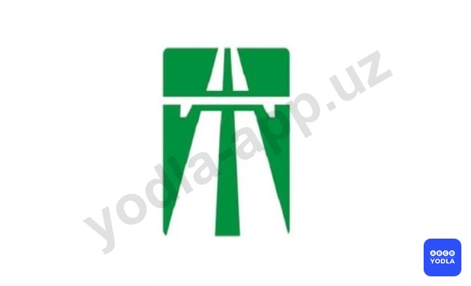

# 29. Движение по автомагистралям (боб 19)

Всего вопросов: 15

## Вопрос 1

**На автомагистрале запрещено:**

⬜ A. Разворот и въезд в разрывы разделительной полосы
⬜ B. Движение задним ходом
⬜ C. Остановка вне специальных площадок для стоянки; обозначенных знаком "Место стоянки" или "Место отдыха"
✅ D. Все перечисленные действия

> 💡 Пункта 121 главы 19 ПДД, гласит: На автомагистралях запрещается: движение пешеходов, домашних животных, гужевых повозок, велосипедов, индивидуальные транспортные средства, скутеры, мопедов, тракторов и самоходных машин, транспортных средств, скорость которых по технической характеристике или их состоянию менее 40 км/ч;
- движение грузовых автомобилей с разрешенной максимальной массой более 3,5 т по другим полосам, кроме первой и второй;
- остановка вне специальных площадок для
стоянки, обозначенных знаками 5.15 "Место
стоянки" или 6.11 "Место отдыха";
- разворот и въезд в технологические разрывы
разделительной полосы
- движение задним ходом;
- учебная езда. Как видно, на автомагистрали запрещены все перечисленные действия.

---

## Вопрос 2

**Разрешена ли буксировка на автомагистрали?**

⬜ A. Разрешена со скоростью 50 км/ч
⬜ B. Запрещается
⬜ C. Разрешена только путем частичной погрузки или на жесткой сцепке
⬜ D. Разрешена на гибкой сцепке
✅ E. Разрешена любым способом

> 💡 Пункта 145 главы 24 ПДД, гласит: Буксировка запрещается в следующих случаях: транспортных средств, у которых не действует рулевое управление (кроме случаев буксировки методом частичной погрузки);
двух и более транспортных средств; при общей длине буксирующего и буксируемого транспортных средств вместе со связующим звеном, превышающей 20 м; транспортного средства с недействующей тормозной системой, если его фактическая масса превышает половину фактической массы буксирующего транспортного средства (кроме случаев буксировки при меньшей фактической массе таких транспортных средств только на жесткой сцепке или методом частичной погрузки.); с двухколесными мотоциклами, электромотоциклами, мопедами, скутерами и индивидуальные транспортных средствам, а также такими мотоциклами, электромотоциклами, мопедами, скутерами и индивидуальные транспортных средствам;
в гололедицу, на скользкой дороге, на гибкой сцепке. В Правилах дорожного движения нет ограничений на буксировку на автомагистралях.

---

## Вопрос 3

**Разрешена ли остановка на автомагистрали?**

⬜ A. Запрещена
⬜ B. Разрешается в местах; где автомагистраль хорошо просматривается
⬜ C. Разрешается, если имеются три полосы для движения в одном направлении
✅ D. Разрешается на специальных площадках для стоянки; обозначенных знаком «Место стоянки» или «Место отдыха»

> 💡 Согласно абзацу 3 пункта 121 главы 18 ПДД, на автомагистралях запрещается остановка вне специальных площадках для стоянки, обозначенных знаками 5.15 «Место стоянки» или 6.11 «Место отдыха».

---

## Вопрос 4

**Учебная езда на автомагистрали:**

⬜ A. Разрешена со скоростью не более 70 км/час
⬜ B. Разрешена со скоростью не более 60 км/час при достаточных навыках управления у обучаемого с мастером обучения вождению
✅ C. Запрещена
⬜ D. Разрешена, если механическое транспортное средство, на котором производится обучение, обозначено опознавательным знаком

> 💡 Согласно абзацу 6 пункта 121 главы 19 ПДД, на автомагистралях обучение вождению транспортного средства запрещается.

---

## Вопрос 5

**Разрешено ли грузовикам двигаться по левой полосе на автомагистрали?**

⬜ A. Разрешается
✅ B. Запрещается

> 💡 ПДД Общие положения: Перестроение - выезд из занимаемой полосы или занимаемого ряда с сохранением первоначального направления движения.

---

## Вопрос 6

**Разрешается ли движение пешеходов по дороге обозначенной знаком «Автомагистраль»?**

✅ A. Запрещается
⬜ B. Разрешается идти только вне населенных пунктов навстречу движению транспортных средств
⬜ C. Разрешается идти вне населенных пунктов по ходу движения транспортных средств

> 💡 Согласно пункту 121 главы 18 ПДД, на автомагистралях запрещается движение пешеходов, домашних животных, гужевых повозок, велосипедов, мопедов, тракторов и самоходных машин, транспортных средств, скорость которых по технической характеристике или их состоянию менее 40 км/ч.

---

## Вопрос 7

**Что запрещено на автомагистрали водителям грузовых автомобилей, разрешенная максимальная масса которых менее 3,5 т?**

⬜ A. Движение во второй полосе трехполосной дороги
✅ B. Движение задним ходом
⬜ C. Буксировка механических транспортных средств
⬜ D. Все перечисленные действия

> 💡 Согласно абзацу 5 пункта 121 главы 19 ПДД, на автомагистралях запрещается движение задним ходом.

---

## Вопрос 8

**Разрешается ли въезд в разрывы разделительной полосы на автомагистрали?**

⬜ A. Разрешается
⬜ B. Разрешается только для разворота, кроме водителей грузовых автомобилей полной массой более 3,5 т
✅ C. Запрещается
⬜ D. Разрешается маршрутным транспортным средствам

---

## Вопрос 9

**Разрешается ли разворот в разрывах разделительной полосы на участках дорог обозначенных этим знаком?**

⬜ A. Разрешается
✅ B. Запрещается
⬜ C. Разрешается только транспортным средствам с полной массой до 3,5 тонны

---

## Вопрос 10

**В каких местах разрешена преднамеренная остановка транспортных средств на автомагистралях?**

⬜ A. На крайней правой полосе проезжей части дороги
⬜ B. В местах; где видимость более 100 м и число полос движения более четырех
✅ C. На специальных площадках для стоянки; обозначенных знаками "Место стоянки" или "Место отдыха"

> 💡 Согласно пункту 121 Правил дорожного движения, на автомагистралях запрещается: остановка вне специальных площадок для стоянки, обозначенных дорожными знаками 5.15 или 6.11.

---

## Вопрос 11

**Разрешается ли движение по автомагистралям транспортных средств; скорость которых по техничес­кой характеристике или их состоянию менее 40 км/ч?**

⬜ A. Разрешается не далее второй полосы
✅ B. Запрещается
⬜ C. Разрешается; если не установлен знак "Ограничение минимальной скорости"

> 💡 Согласно пункту 121 главы 18 ПДД, на автомагистралях запрещается движение пешеходов, домашних животных, грузовых повозок, велосипедов, мопедов, тракторов и самоходных машин, транспортных средств, скорость которых по технической характеристике или их состоянию менее 40 км/ч.

---

## Вопрос 12

**Какой из показанных знаков запрещает движение задним ходом?**

✅ A. 1
⬜ B. 2
⬜ C. 3
⬜ D. 4
⬜ E. 5

> 💡 Пункта 121 главы 19 ПДД, гласит: На автомагистралях запрещается; движение задним ходом Соответственно, в зоне действия знака 5.1 “Автомагистраль” движение задним ходом запрещено.

---

## Вопрос 13

**Остановка на автомагистрали разрешена:**

⬜ A. Только правее линии разметки, обозначающей край проезжей части
⬜ B. В любых местах за пределами проезжей части
✅ C. Только на специальных площадках для стоянки, обозначенных соответствующими знаками (5.15 или 6.11).

> 💡 Согласно пункту 121 Правил дорожного движения, на автомагистралях запрещается: остановка вне специальных площадок для стоянки, обозначенных дорожными знаками 5.15 или 6.11.

---

## Вопрос 14

**Кто из водителей нарушает правила?**

✅ A. Водители грузового автомобиля с разрешенной максимальной массой 3т и мопеда
⬜ B. Только водитель мопеда
⬜ C. Никто не нарушает

> 💡 Пункта 86 главы 12 ПДД, гласит: Обгон запрещен:
— в КОНЦЕ подъема и на других участках дорог с ограниченной видимостью;
Не нарушает, потому что мотоциклист не на КОНЦЕ подъема.

---

## Вопрос 15

**Разрешается ли грузовым автомобилям движение по крайней левой полосе на автомагистралях?**

⬜ A. Разрешается
✅ B. Запрещается

> 💡 Согласно главе 19, пункту 121 (абзац 2) Правил дорожного движения, движение грузовых автомобилей по крайней левой полосе автомагистрали запрещается.

---

