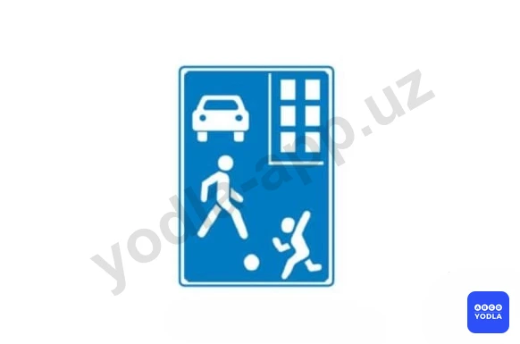
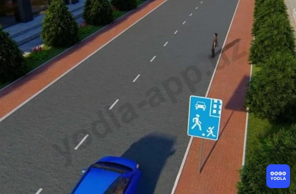

# 30. Движение в жилых зонах (боб 20)

Всего вопросов: 9

## Вопрос 1

**Какие ограничения установлены на территории; обозначенной указанным знакам?**

⬜ A. Запрещается движение со скоростью более 5км/ч
✅ B. Обучение вождению транспортных средств
⬜ C. Запрещается сквозное движение
⬜ D. Запрещается стоянка в ночное время легковых автомобилей

> 💡 Согласно абзацу 1 пункта 124 главы 20 ПДД, в жилой зоне запрещается учебная езда на механических транспортных средствах, стоянка с работающим двигателем, стоянка грузовых автомобилей с разрешенной максимальной массой более 3,5 т вне специально выделенных и обозначенных дорожными знаками и (или) дорожной разметкой мест.

---

## Вопрос 2

**Обязан ли водитель легкового автомобиля уступить дорогу?**

✅ A. Да
⬜ B. Нет

> 💡 Согласно пункту 126 главы 20 ПДД, «Конец жилой зоны», при выезде из жилых зон водители должны уступить дорогу другим участникам движения.

---

## Вопрос 3

**В каком направлении разрешено движение этому транспортному средству, если за рулем находится обучаемый?**

⬜ A. В любом
⬜ B. Только направо
✅ C. Направо, налево и в обратном направлении

> 💡 Согласно абзацу 1 пункта 124 главы 20 ПДД, в жилой зоне запрещается учебная езда на механических транспортных средствах.

---

## Вопрос 4

**Обязан ли водитель уступить дорогу пешеходам в данном месте?**

✅ A. Да
⬜ B. Нет

> 💡 Согласно пункту 123 главы 20 ПДД, в жилой зоне (территории, въезды и выезды с которых обозначены знаками 5.38 и 5.39) движение пешеходов разрешается по тротуарам и проезжей части. При этом пешеходы имеют приоритет, однако, они не должны создавать необоснованные помехи для движения транспортных средств.

---

## Вопрос 5

**Какие действия запрещены в жилой зоне?**

⬜ A. Только учебная езда
⬜ B. Только стоянка с работающим двигателем
✅ C. Все вышеперечисленные действия

> 💡 Согласно пункту 3 Приложение № 3 к Правилам дорожного движения, запрещается эксплуатация транспортных средств при нарушена регулировка фар, не работают в установленном режиме или загрязнены внешние световые приборы и световозвращатели, на транспортном средстве установлены:
спереди — противотуманные фары с огнями любого цвета, кроме белого или жёлтого, указатели поворота с огнями любого цвета, кроме жёлтого или оранжевого, а световозвращающие приспособления — любого цвета, кроме белого.

---

## Вопрос 6

**Где могут двигаться пешеходы в жилой зоне?**

⬜ A. Только по тротуарам
⬜ B. По тротуарам и в один ряд по краю проезжей части
✅ C. По тротуарам и по проезжей части

> 💡 Согласно пункту 138 Правил дорожного движения, в светлое время суток ближний свет фар должен быть включен в следующих случаях: при движении в составе организованной транспортной колонны; на автобусах и маршрутных транспортных средствах, перевозящих пассажиров; при организованной п��ревозке группы детей; при перевозке опасных, крупногабаритных и тяжеловесных грузов; 
при буксировке механических транспортных средств (на буксирующем транспортном средстве); на мотоциклах и мопедах.

---

## Вопрос 7

**При выезде из жилой зоны водитель:**

✅ A. Должен уступить дорогу другим участникам движения
⬜ B. Он имеет приоритет перед другими участниками движения

> 💡 Согласно пункту 126 Правил дорожного движения, при выезде из жилых зон водители должны уступить дорогу другим участникам движения.

---

## Вопрос 8

**При выезде из жилой зоны необходимо уступить дорогу?**

⬜ A. Только транспортным средствам, приближающимся справа
⬜ B. Только транспортным средствам, приближающимся слева
⬜ C. Только транспортным средствам с включенным проблесковым маячком
✅ D. Всем транспортным средствам

> 💡 Согласно пункту 126 Правил дорожного движения, при выезде из жилых зон водители должны уступить дорогу другим участникам движения.

---

## Вопрос 9

**Где могут двигаться пешеходы в жилой зоне?**

✅ A. По тротуарам и по проезжей части
⬜ B. Только по тротуарам
⬜ C. В один ряд по краю проезжей части

> 💡 Дорожная разметка 1.28 раздела 1 приложения № 2 к ПДД, дорожная разметка, дублирующая запрещающие знаки.

---

