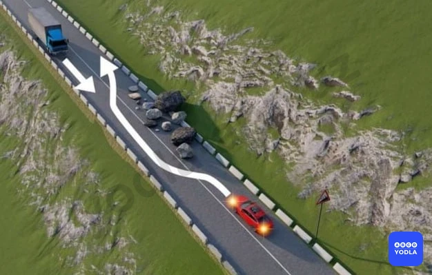
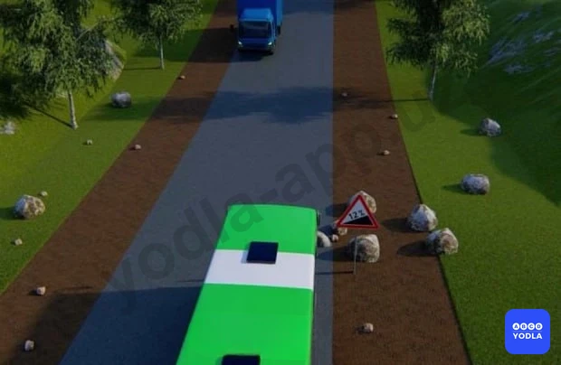
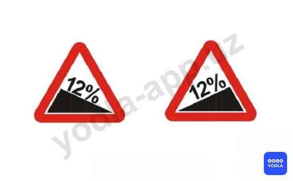

# 31. Движение по подъемам и спускам (боб 21)

Всего вопросов: 3

## Вопрос 1

**Водитель какого транспортного средства должен уступить дорогу?**

✅ A. Водитель грузовика
⬜ B. Водитель легкового автомобиля

> 💡 Предупреждающий знак 1.14 "Крутой подъем". Пункту 128 главы 21 ПДД гласит: На уклонах, обозначенных знаками 1.13 и 1.14, при наличии препятствия, затрудняющего движение в противоположных направлениях, уступить дорогу должен водитель транспортного средства, движущегося на спуск. В данном случае водитель грузового автомобиля движется на спуск, поэтому он должен уступить дорогу.

---

## Вопрос 2

**Водитель какого транспортного средства должен уступить дорогу?**

⬜ A. Водитель автобуса
✅ B. Водитель грузовика

> 💡 Согласно пункту 128 главы 21 ПДД, на уклонах, обозначенных дорожными знаками 1.13 и 1.14, при наличии препятствия, затрудняющего движение в противоположных направлениях, уступить дорогу должен водитель транспортного средства, движущегося на спуск.

---

## Вопрос 3

**Если встречный разъезд на уклонах, обозначенных соответствующими знаками, затруднен, необходимо уступить дорогу:**

⬜ A. Транспортному средству; движущемуся на спуск
⬜ B. Маршрутному транспортному средству
✅ C. Транспортному средству; движущемуся на подъем

> 💡 Согласно пункту 128 главы 21 ПДД, на уклонах, обозначенных дорожными знаками 1.13 и 1.14, при наличии препятствия, затрудняющего движение в противоположных направлениях, уступить дорогу должен водитель транспортного средства, движущегося на спуск.

---

