# 32. Приоритет маршрутных транспортных средств (боб 22)

Всего вопросов: 21

## Вопрос 1

**Разрешается ли заезжать на полосу; обозначенную этим знаком при повороте направо?**

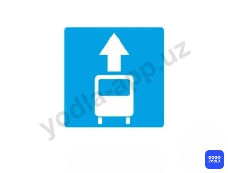

⬜ A. Разрешается
⬜ B. Запрещается
✅ C. Разрешается; если полоса не ограничена от остальной части дороги сплошной линией

> 💡 В соответствии с вторым и третьим абзацами пункта 132 главы 22 ПДД: Если полоса, обозначенная дорожным знаком 5.9 отделена от остальной проезжей части дороги прерывистой линией разметки, то при поворотах транспортные средства должны перестраиваться на эту полосу. Разрешается также в таких местах заезжать на эту полосу при въезде на дорогу и для посадки и высадки пассажиров у правого края проезжей части при условии, что это не создаст помех движению маршрутных транспортных средств.
В данном случае, если полоса не ограничена от остальной части дороги сплошной линией, транспортные средства должны перестраиваться на эту полосу при поворотах.

---

## Вопрос 2

**Из какой полосы следует поворачивать направо в показанной ситуации?**

⬜ A. Только из второй полосы
✅ B. Только из крайней правой полосы; обозначенной разметкой « А »

> 💡 Cогласно пункту 132 главы 22 ПДД, по полосе, обозначенной дорожными знаками 5.9, 5.10.1 — 5.10.3 для движения маршрутных транспортных средств, движение и остановка других транспортных средств запрещается. Если полоса, обозначенная дорожным знаком 5.9 отделена от остальной проезжей части дороги прерывистой линией разметки, то при поворотах транспортные средства должны перестраиваться на эту полосу.

---

## Вопрос 3

**Должен ли водитель автобуса; движущегося по установленному маршруту; уступать дорогу в данной ситуации?**

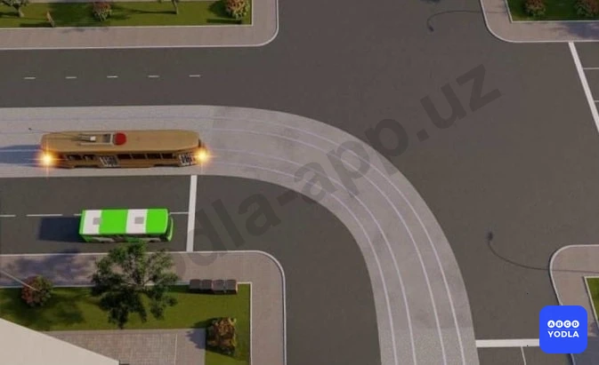

✅ A. Должен
⬜ B. . Не должен
⬜ C. Не должен, так как он движется прямо

> 💡 Пункта 105 главы 16 ПДД, гласит: На перекрестке равнозначных дорог водитель безрельсового транспортного средства обязан уступить дорогу транспортным средствам, приближающимся справа.
Этим же правилом должны руководствоваться между собой водители трамваев. На таких перекрестках трамвай имеет право на первоочередное движение перед безрельсовыми транспортными средствами независимо от направления его движения. В данном случае трамвай имеет приоритет перед автобусом. Соответственно, водитель автобуса должен уступить ему дорогу.

---

## Вопрос 4

**Можно ли заезжать на крайнюю левую полосу проезжей части; если в начале участка дороги стоит этот знак?**

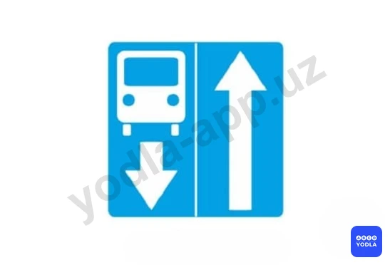

⬜ A. Можно для поворота налево
⬜ B. Можно для обгона, если нет встречного движения и полоса отделена от остальной проезжей части прерывистой линией разметки
✅ C. Нельзя ни при каких обстоятельствах

> 💡 Информационно-указательный знак 5.10.1 "Дорога с полосой для маршрутных транспортных средств". Дорога, по которой движение маршрутных транспортных средств осуществляется навстречу общему потоку транспортных средств по выделенной полосе. Пункт Пункта 132 главы 22 ПДД гласит: По полосе, обозначенной знаками 5.9, 5.10.1-5.10.3 для движения маршрутных транспортных средств, движение и остановка других транспортных средств запрещается. Если эта полоса отделена от остальной проезжей части дороги прерывистой линией разметки, то при поворотах транспортные средства должны перестраиваться на эту полосу. Разрешается также в таких местах заезжать на эту полосу при въезде на дорогу и для посадки и высадки пассажиров у правого края проезжей части при условии, что это не создаст помех движению маршрутных транспортных средств.

---

## Вопрос 5

**Разрешается ли остановка для высадки пассажира в ситуации; показанной на рисунке?**

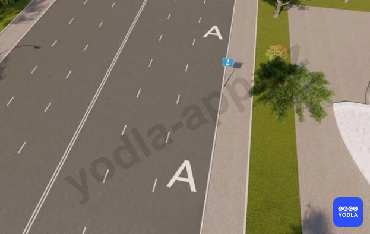

✅ A. Разрешается
⬜ B. Запрещается

> 💡 Согласно пункту 132 главы 22 ПДД, если полоса, обозначенная дорожным знаком 5.9 отделена от остальной проезжей части дороги прерывистой линией разметки, в таких местах заезжать на эту полосу при въезде на дорогу и для посадки и высадки пассажиров у правого края проезжей части разрешается при условии, что это не создаст помех движению маршрутных транспортных средств.

---

## Вопрос 6

**Каким транспортным средствам разрешено движение по правой полосе проезжей части?**

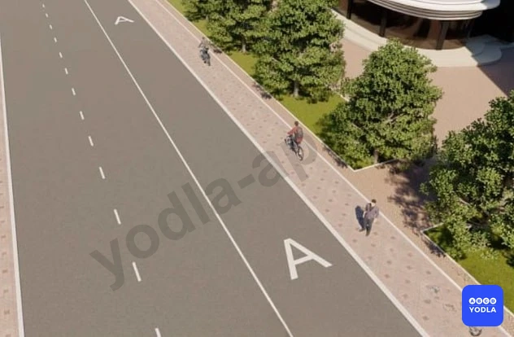

⬜ A. Всем механическим транспортным средствам
⬜ B. Маршрутным транспортным средствам и такси
⬜ C. Только велосипедам
✅ D. Только маршрутным транспортным средствам

> 💡 Согласно разделу 1 приложения № 2 к ПДД, горизонтальная разметка 1.23 – обозначает полосу, предназначенную для движения только маршрутных транспортных средств. Маршрутное транспортное средство — транспортное средство общего пользования (троллейбус, автобус, трамвай, маршрутное такси), предназначенное для перевозки пассажиров и имеющее установленный маршрут с остановочными пунктами (остановками).

---

## Вопрос 7

**В населенном пункте водитель автобуса или троллейбуса начинает движение от обозначенной остановки. Он должен:**

⬜ A. Уступить дорогу объезжавшему его транспортному средству
⬜ B. Используя преимущество, начинать движение в намеченном направлении
✅ C. Начинать движение только убедившись что ему уступают дорогу

> 💡 Пункта 133 главы 22 ПДД, гласит: В населенных пунктах водители должны уступать дорогу автобусам и троллейбусам, начинающим движение от остановки. В свою очередь, водители автобусов и троллейбусов могут начинать движение, только убедившись, что им уступают дорогу.

---

## Вопрос 8

**Разрешается ли водителю автобуса двигаться по полосе, обозначенной этим знаком, если полоса отделена сплошной линией разметки?**

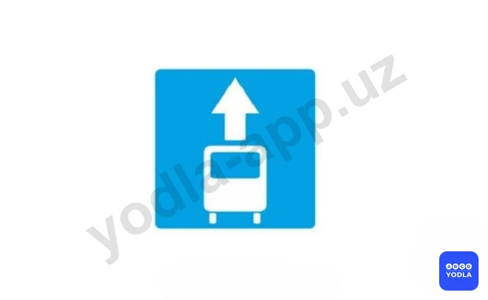

⬜ A. Разрешается
⬜ B. Запрещается
✅ C. Разрешается, если автобус движется по установленному маршруту

> 💡 Информационно-указательный знак 5.9 “Полоса для маршрутных транспортных средств”. Пункт 132 главы 22 ПДД, гласит: по полосе, обозначенной знаками 5.9, 5.10.1 - 5.10.3 для движения маршрутных транспортных средств, движение и остановка других транспортных средств запрещается.

---

## Вопрос 9

**Разрешается ли останавливаться на полосе обозначенной этим знаком для посадки пассажиров?**

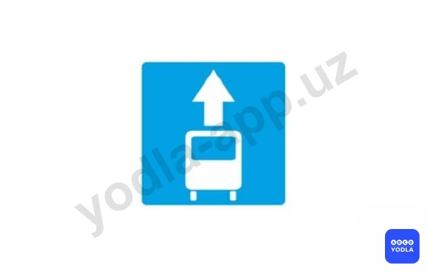

✅ A. Разрешается если полоса расположена у правого края проезжей части и если она не отделена от остальной проезжей части сплошной линией разметки
⬜ B. Запрещается
⬜ C. Разрешается

> 💡 Абзацу 3 пункта 132 главы 22 ПДД, разрешается заезжать на полосу обзначенную знаком 5.9 при въезде на дорогу и для посадки и высадки пассажиров у правого края проезжей части при условии, что это не создаст помех движению маршрутных транспортных средств.

---

## Вопрос 10

**Водители транспортных средств должны уступить дорогу автобусу или троллейбусу:**

⬜ A. Если он начинает движение от остановки
⬜ B. Если он движется по маршруту в часы «ПИК»
✅ C. В населенных пунктах, если он начинает движение с обозначенной остановки (остановок)

> 💡 Согласно пункту 133 главы 22 ПДД, в населенных пунктах водители должны уступать дорогу автобусам и троллейбусам, начинающим движение от остановки. В свою очередь, водители автобусов и троллейбусов могут начинать движение, только убедившись, что им уступают дорогу.

---

## Вопрос 11

**Обязаны ли Вы уступить дорогу маршрутному транспортному средству, отъезжающему от тротуара, где нет обозначенного места остановки?**

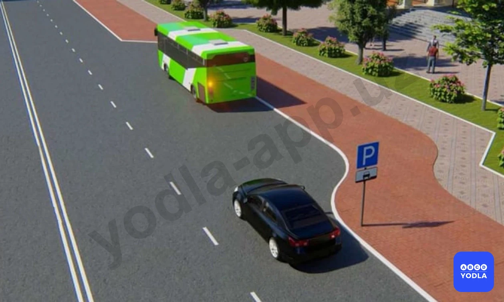

⬜ A. Да
✅ B. Нет

> 💡 Знак 7.6.1 раздела 7 приложения № 1 к ПДД, «Способ постановки транспортного средства на стоянку». 7.6.1 указывает способ постановки транспортного средства на проезжую часть, вдоль тротуара.

---

## Вопрос 12

**Какое транспортное средство должно уступить дорогу в данной ситуации?**

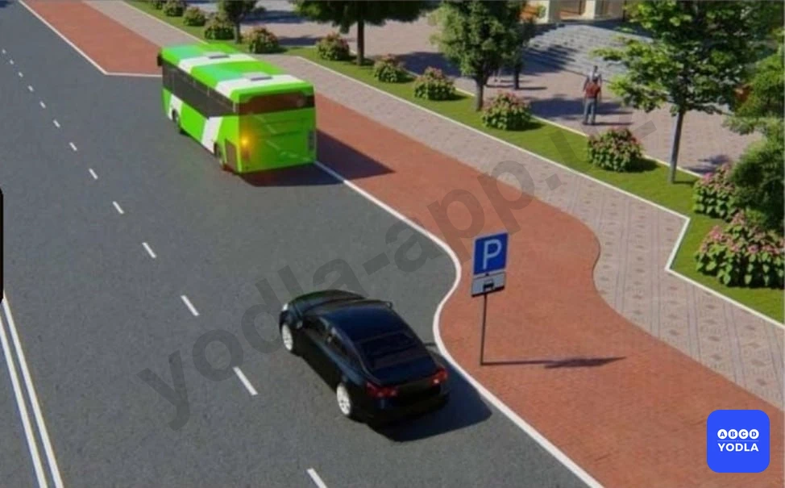

⬜ A. Легковой автомобиль
✅ B. Автобус

> 💡 Согласно предмету Первой помощи при дорожно-транспортных происшествиях, травма головного мозга характеризуется следующими основными признаками:
- Потеря сознания может длиться от нескольких секунд до нескольких часов;
- Рвота - два-три раза, в тяжёлых случаях больше;
- Амнезия - потеря памяти, связана с полученной травмой и некоторые события; жизни стираются из памяти.

---

## Вопрос 13

**В каких случаях немаршрутные транспортные средства могут двигаться по правой полосе, обозначенной буквой «А»?**

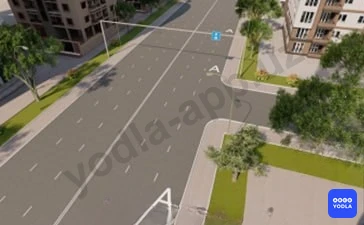

⬜ A. При повороте направо
⬜ B. При посадке и высадке пассажиров
✅ C. Во всех вышеперечисленных случаях

> 💡 Согласно абзацу третьего пункта 98 Правил дорожного движения, транспортные средства, движущиеся на перекрестке с круговым движением, имеют приоритет (преимущество) по отношению к транспортным средствам, въезжающим на перекресток.

---

## Вопрос 14

**Ситуация, в которой трамвай не имеет преимущества перед безрельсовыми транспортными средствами**

✅ A. При выезде из депо
⬜ B. При въезде в депо
⬜ C. В обоих случаях имеет преимущество
⬜ D. В обоих случаях не имеет преимущества

> 💡 ПДД приложение № 1: 4.1.1. Движение прямо.
Разрешается движение только в направлениях, указанных на знаках стрелками. Знаки, разрешающие поворот налево, разрешают и разворот (могут быть применены знаки 4.1.1–4.1.6 с конфигурацией стрелок, соответствующей требуемым направлениям движения на конкретном пересечении).

---

## Вопрос 15

**Каким транспортным средствам разрешается высаживать пассажиров?**

✅ A. «А»
⬜ B. «B»
⬜ C. «C»
⬜ D. Ни одному

> 💡 ЙҲҚ 1 илова: 4.1.1. “Ҳаракатланиш тўғрига”. Йўлнинг қисми бошланишида ўрнатилган 4.1.1 белгисининг таъсири яқин чорраҳагача жорий қилинади. Белги ўнг томонда жойлашган ҳовлиларга ва йўлга ёндош бошқа ҳудудларга бурилишни тақиқламайди.

---

## Вопрос 16

**Разрешается ли движение других видов транспортных средств по полосе проезжей части, выделенной только для транспортных средств установленного направления?**

⬜ A. Разрешено
⬜ B. Запрещено
✅ C. Разрешается только по истечении времени движения транспортного средства по установленному направлению

> 💡 ПДД приложение № 1: 4.1.1 Движение прямо.
Действие знака 4.1.1, установленного в начале участка дороги, распространяется до ближайшего перекрестка. Знак не запрещает поворот направо на прилегающие к дороге территории.

---

## Вопрос 17

**По какому направлению легковой автомобиль поворачивает правильно?**

✅ A. 1
⬜ B. 1 и 2
⬜ C. 2

> 💡 На основании абзаца 2 пункта 133 главы 22 ПДД: Маршрутным транспортным средствам запрещается посадка и высадка пассажиров в местах, отличных отостановок (за исключением маршрутных такси).

---

## Вопрос 18

**Разрешается ли маршрутным транспортным средствам брать и высаживать пассажиров вне остановок (за исключением маршрутных такси)?**

⬜ A. Разрешается
✅ B. Запрещается

> 💡 "На основании абзаца 3 пункта 168 главы 28 ПДД: 168. Велосипедистам и лицам, управляющим средствами индивидуальной мобильности, запрещается:
перевозить людей (за исключением перевозки детей в возрасте до 7 лет на дополнительном сиденье, оборудованном надежными подножками)."

---

## Вопрос 19

**Какой водитель автомобиля движется, не нарушая правила?**

✅ A. На левом рисунке
⬜ B. На правом рисунке
⬜ C. На обоих рисунках

> 💡 На основании абзаца 84 пункта 6 главы 1 и абзаца 1 пункта 64 главы 10 ПДД: полоса движения — любая продольная полоса проезжей части дороги, достаточной ширины для движения транспортных средств в один ряд, обозначенная или не обозначенная дорожной разметкой; 
64. Количество полос движения для безрельсовых транспортных средств определяется разметкой и (или) дорожными знаками 5.8.1, 5.8.2, 5.8.7, 5.8.8. Если такой дорожной разметки или дорожных знаков нет — самими водителями, с учетом ширины проезжей части, габаритов транспортных средств и необходимых интервалов между ними. При этом на дорогах с двусторонним движением стороной, предназначенной для встречного движения, считается половина ширины проезжей части, расположенная слева, не считая местной ширины проезжей части (полосы торможения и разгона, дополнительные полосы на подъем, заездные карманы мест остановок маршрутных транспортных средств).

---

## Вопрос 20

**В данной ситуации кто должен уступить дорогу?**

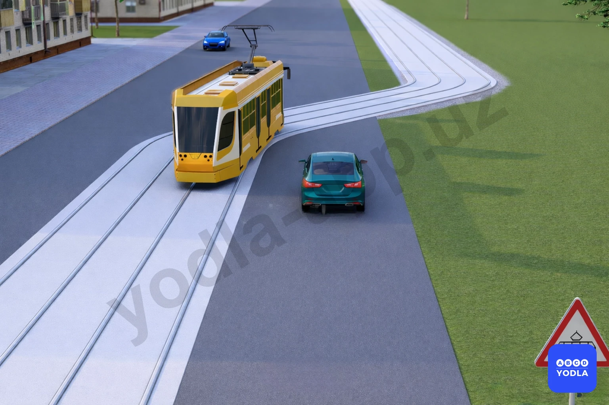

⬜ A. Водитель трамвая
✅ B. Водитель автомобиля

> 💡 На основании пункта 99 главы 15 ПДД, а также абзаца 2 пункта 43 главы 7 ПДД: 99. При повороте налево или развороте по разрешающему сигналу светофора водитель безрельсового транспортного средства обязан уступить дорогу транспортным средствам, движущимся со встречного направления прямо или направо. Таким же правилом должны руководствоваться между собой водители трамваев.
В случае если значение сигналов светофора противоречат требованиям дорожных знаков приоритета, водители должны руководствоваться сигналами светофора.

---

## Вопрос 21

**По какому направлению водитель красного автомобиля выполняет поворот правильно?**

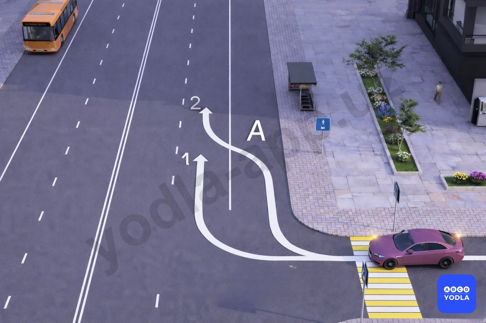

⬜ A. По обоим направлениям
✅ B. По первому направлению
⬜ C. По второму направлению
⬜ D. По обоим направлениям неправильно

> 💡 На основании главы 13 ПДД, пункта 88, абзаца 2 и пункта 91, абзаца 13: В населенных пунктах на дорогах с отсутствием трамвайных путей посередине, имеющих по одной полосе в каждом направлении, а также с организацией одностороннего движения разрешается остановка и стоянка на левой стороне дороги.
91. Остановка запрещается в следующих местах: на пересечении проезжих частей и ближе 30 м от края пересекаемой проезжей части, (за исключением стороны напротив бокового проезда трехсторонних пересечений (перекрестков, имеющих сплошную линию дорожной разметки или разделительную полосу).

---

