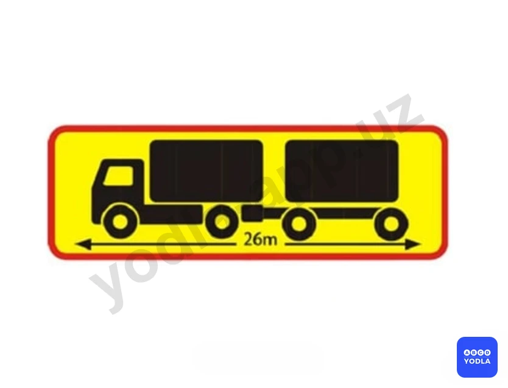
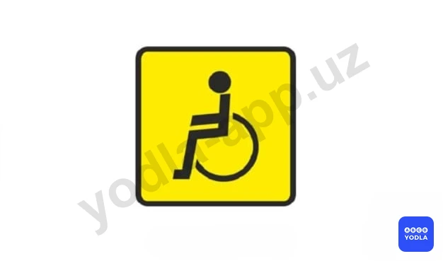
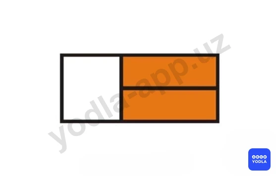
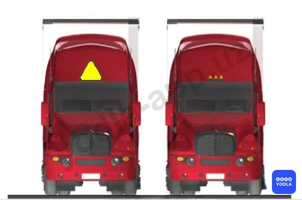
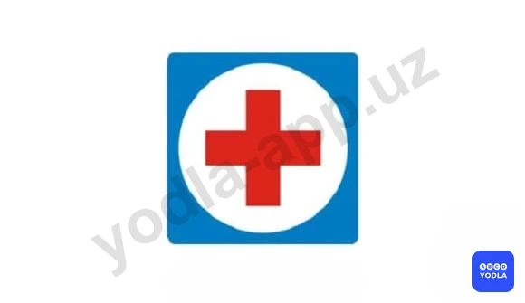

# 39. Обязанности должностных лиц и граждан по обеспечению безопасности дорожного движения (боб 29)

Всего вопросов: 13

## Вопрос 1

**Таким опознавательным знаком обозначается транспортное средство:**

⬜ A. Перевозящее тяжеловесные и крупногабаритные грузы
✅ B. Транспортное средство длина которого с грузом или без груза более 20м
⬜ C. Перевозящее людей в кузове-фургоне

> 💡 Согласно определению 9 пункта 176 главы 29 ПДД, «Длинномерное транспортное средство» — знак в виде прямоугольника размером 1200x200 мм желтого цвета с каймой красного цвета шириной 40 мм, с символикой состава транспортных средств — сзади транспортных средств, длина которых с грузом или без груза более 20 м, и автопоездов с двумя и более прицепами.

---

## Вопрос 2

**Владельцы механических транспортных средств и прицепов к ним должны зарегистрировать их в ГСБДД независимо от технического состояния с момента приобретения (получения) в течении:**

⬜ A. 2 суток
✅ B. 10 суток
⬜ C. 5 суток
⬜ D. 15 суток
⬜ E. 30 суток

---

## Вопрос 3

**Должностные лица; ответственные за эксплуатацию и техническое состояние транспортных средств обязаны:**

⬜ A. Не допускать к управлению транспортными средствами лиц; не прошедших в установленный срок медицинского освидетельствования
⬜ B. Не выпускать на линию транспортные средства; техническое состояние и оборудование которых не отвечают требованиям Правил
⬜ C. Не выпускать на линию технические средства; не зарегистрированные в установленном порядке
✅ D. Выполнить все перечисленные действия

> 💡 Пункту 180 главы 29 ПДД, гласит: Должностным и другим лицам, ответственным за техническое состояние транспортных средств и их эксплуатацию, запрещается: - выпускать на линию транспортные средства, эксплуатация которых запрещена из-за технической неисправности, переоборудованные без соответствующего разрешения, не зарегистрированные в установленном порядке или не прошедшие государственного периодического технического осмотра;
допускать к управлению транспортным средством лиц, находящихся в состоянии любого опьянения (алкогольного, наркотического и др.) или под воздействием лекарственных препаратов, снижающих реакцию и внимание, в утомленном или болезненном состоянии, угрожающем безопасности дорожного движения, а также лиц, не имеющих права управления транспортным средством данной категории, не прошедших в установленные сроки медицинского освидетельствования и состоящих на учете, как систематически употребляющие спиртные напитки и наркотические вещества;
выпускать на дороги с асфальтовым или цементобетонным покрытием трактора и другие самоходные механизмы на гусеничном ходу.
Следовательно, все перечисленные действия должны быть выполнены должностными лицами.

---

## Вопрос 4

**Таким опознавательным знаком обозначаются автомобили:**

⬜ A. Перевозящими опасные грузы
⬜ B. Управляемые инвалидами
✅ C. Управляемые глухонемыми и глухими водителями
⬜ D. Управляемые водителями имеющими водительский стаж до 2-х лет

> 💡 Согласно определению 4, данному в пункте 176 главы 29 ПДД, «Глухонемой водитель» — знак в виде желтого круга диаметром 160 мм с нанесенными внутри тремя черными кружками диаметром 40 мм — спереди и сзади механических транспортных средств, управляемых глухонемыми или глухими водителями.

---

## Вопрос 5

**Таким опознавательным знаком обозначаются транспортные средства:**

⬜ A. Управляемые глухими или глухонемыми водителями
✅ B. Управляемые инвалидами
⬜ C. Перевозящими опасные грузы

> 💡 Согласно определению абзаца 12 пункта 176 главы 29 ПДД, «Инвалид» — знак в виде квадрата желтого цвета размером сторон — 150 мм и изображением символа дорожного знака 7.17 черного цвета — спереди и сзади механических транспортных средств, управляемых инвалидами I и II групп.

---

## Вопрос 6

**Таким опознавательным знаком обозначается транспортное средство:**

⬜ A. Управляемые инвалидами
⬜ B. Перевозящее тяжеловесные и крупногабаритные грузы
✅ C. Перевозящими опасные грузы
⬜ D. Управляемые глухонемыми и глухими водителями

> 💡 Согласно определению 7 пункта 176 главы 29 ПДД, «Опасный груз» — знак в виде прямоугольника размером 690x300 мм, правая часть которого размером 400x300 мм окрашена в оранжевый, а левая — в белый цвет с каймой черного цвета (шириной 15 мм) и обозначениями, характеризующими опасные свойства груза — спереди и сзади транспортных средств, перевозящих такие грузы.

---

## Вопрос 7

**В темное время суток и в условиях недостаточной видимости оставленные на дороге дорожные машины, строительные материалы, конструкции и т.п. должны быть обозначены:**

⬜ A. Соответствующими дорожными знаками
⬜ B. Направляющими и ограждающими устройствами
⬜ C. Красными или желтыми сигнальными огнями
✅ D. Всеми перечисленными обозначениями

> 💡 Пункту 182 главы 29 ПДД, гласит: Должностные и иные лица, ответственные за производство ремонтных работ на дорогах, обязаны обеспечивать безопасность движения в местах проведения работ. Эти места, а также неработающие дорожные машины, строительные материалы, конструкции и тому подобное, которые не могут быть убраны за пределы дороги, должны быть обозначены соответствующими дорожными знаками, снабжены направляющими и ограждающими устройствами, а в темное время суток и в условиях недостаточной видимости - дополнительно красными или желтыми сигнальными огнями. После окончания ремонтных работ необходимо обеспечить безопасное движение транспортных средств и пешеходов. Соответственно, оставленные на дороге дорожные машины и т.п. должны быть обозначены всеми перечисленными способами.

---

## Вопрос 8

**Какой из указанных знаков устанавливаются для обозначения автопоезда?**

⬜ A. Левый знак
⬜ B. Правый знак
✅ C. Оба знака

> 💡 Согласно определению 1, данному в пункте 176 главы 29 ПДД, «Автопоезд» — знак в виде трех фонарей оранжевого цвета, расположенных горизонтально, посередине над передней частью кабины с промежутком между ними от 150 до 300 мм или в виде равностороннего треугольника желтого цвета, каждая сторона которого 250 мм, с устройством для внутреннего освещения — на грузовых автомобилях и колесных тракторах (1,4 т и выше) с прицепами, а также на сочлененных автобусах и троллейбусах.

---

## Вопрос 9

**Что обозначает данный опознавательный знак?**

⬜ A. Впереди участок дороги имеющий неровности на проезжей части
⬜ B. Впереди участок дороги с тремя полосами для движения в данной направлении
✅ C. Транспортное средство оборудованное шипованными шинами

> 💡 Согласно определению 2, данному в пункте 176 главы 29 ПДД, «Шипы» — знак в виде равностороннего треугольника белого цвета с каймой красного цвета, в который вписана буква «Т» черного цвета — сзади механических транспортных средств, имеющих шипованные шины. Стороны треугольника от 200 до 300 мм в зависимости от вида транспортного средства, ширина каймы равна 1/10 стороны.

---

## Вопрос 10

**Что означает данный опознавательный знак установленный на автомобиле?**

✅ A. Автомобиль принадлежит водителю врачу
⬜ B. Автомобиль принадлежит водителю инвалиду
⬜ C. Автомобиль предназначен для оказания медпомощи на дому

> 💡 Пункту 176 главы 26 ПДД, гласит: «Врач» - знак в виде квадрата синего цвета размером сторон 140 мм с вписанным белым кругом диаметром 90 мм, на который нанесен красный крест шириной штриха 25 мм может быть установлен спереди и сзади автомобилей, управляемых водителями врачами.

---

## Вопрос 11

**На задней стенке кузова автотранспортных средств категорий N2; N3; O3; O4; M2; M3 (кроме особо малых) должен быть нанесен:**

⬜ A. Опознавательный знак о принадлежности транспортного средства
✅ B. Хорошо видимый номерной знак
⬜ C. Общеизвестные знаки

> 💡 Абзацу 2 пункта 175 главы 29 ПДД, гласит: На задней стенке кузова грузовых автомобилей, прицепов (за исключением прицепов к легковым автомобилям) и автобусов (кроме микроавтобусов) должны быть нанесены номера и буквы государственного регистрационного номерного знака. Высота цифр должна быть 300 мм, ширина 120 мм, толщина штриха 30 мм, размер высоты букв 2/3 от размера цифр.

---

## Вопрос 12

**Каким опознавательным знаком обозначается транспортное средство при перевозке групп детей?**

⬜ A. 1
⬜ B. 2
✅ C. 3

> 💡 Согласно определению 3, данному в пункте 176 главы 29 ПДД, «Перевозка группы детей» — знак в виде квадрата желтого цвета с каймой красного цвета и с черным изображением символа дорожного знака 1.21 устанавливается спереди и сзади транспортного средства при организованной перевозке группы детей. Сторона квадратного знака должна быть от 250 до 300 мм, а ширина каймы — 1/10 стороны.

---

## Вопрос 13

**Данный знак устанавливается:**

⬜ A. На участках дороги, проходящих перед «детским домом» или лагерем отдыха
✅ B. Перед школой или дошкольным образовательным учреждением
⬜ C. На уч��стках дороги, где велика вероятность движения слепых пешеходов

> 💡 На основании пункта 1.14 Приложения 1 к ПДД: 1.14. «Крутой подъем».

---

